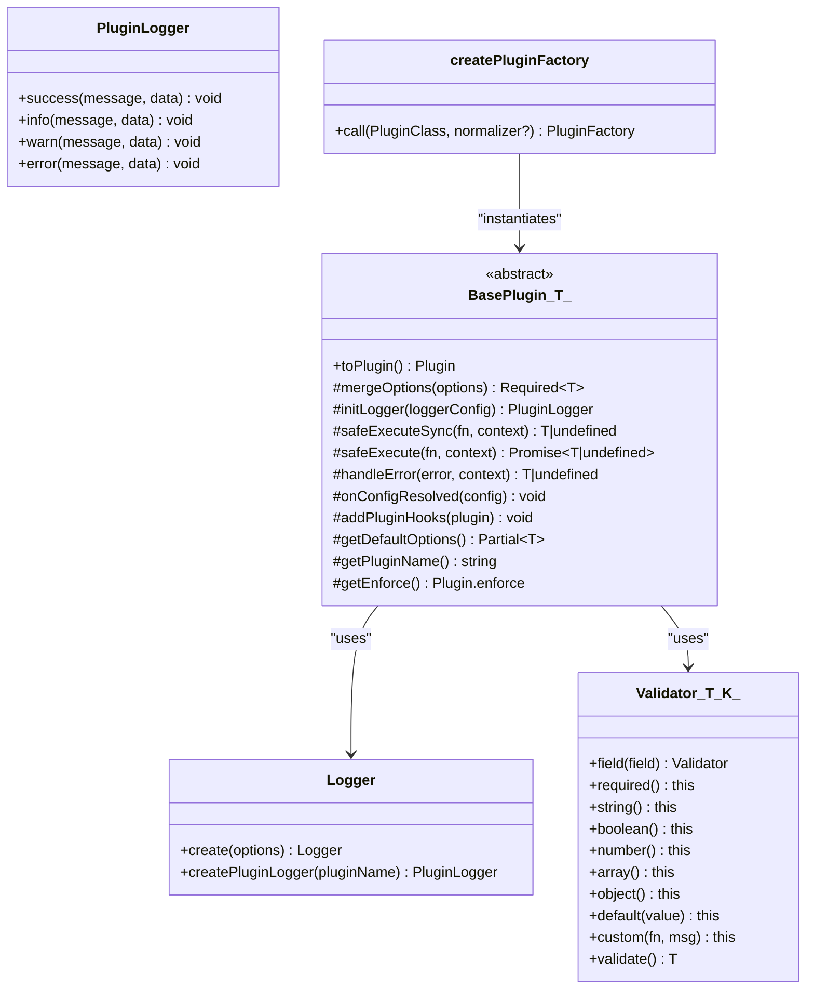
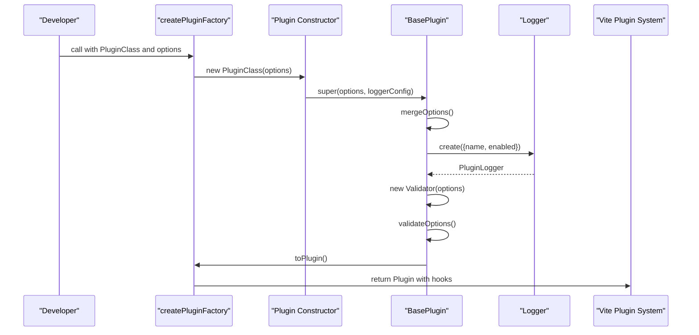
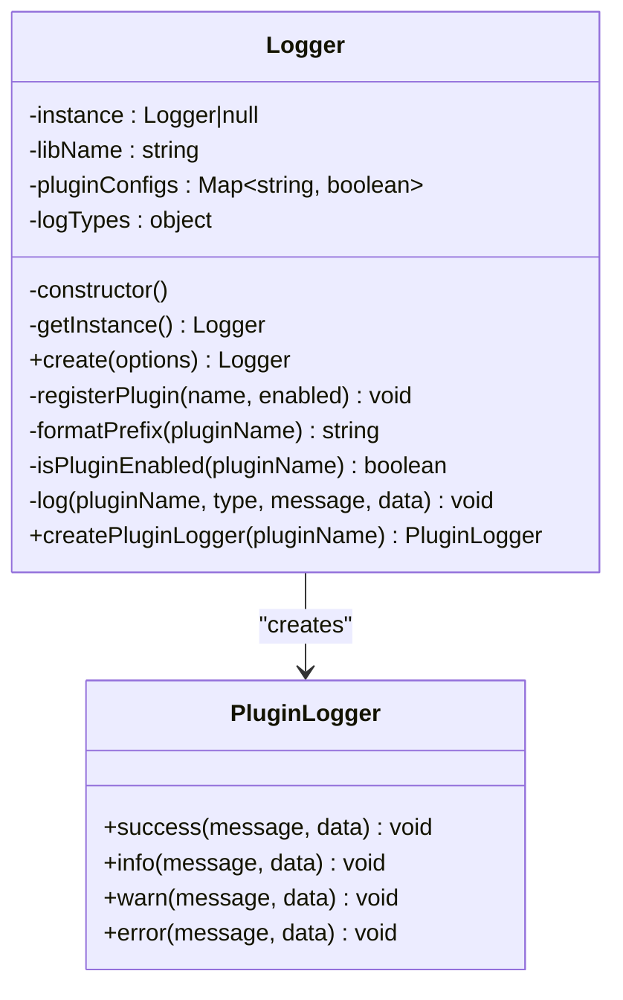
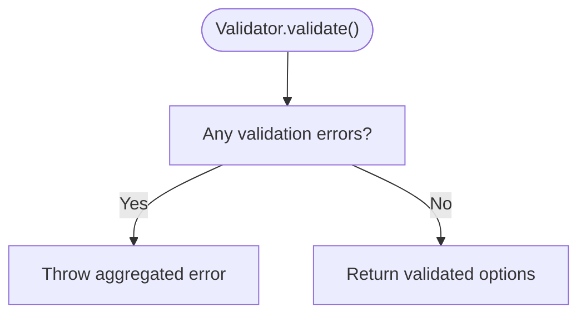
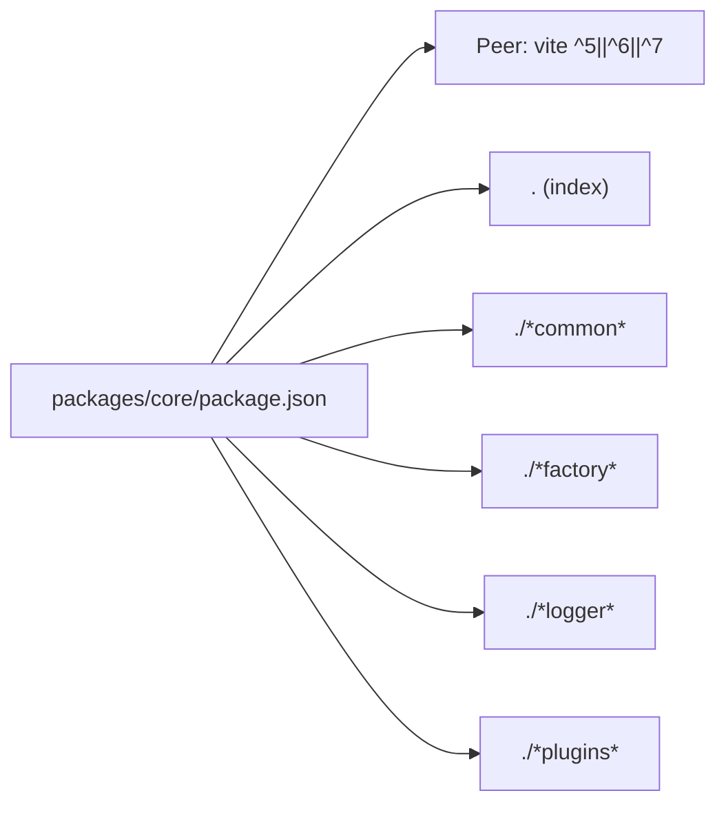

# API Reference

<cite>
**Referenced Files in This Document**
- [packages/core/src/index.ts](file://packages/core/src/index.ts)
- [packages/core/package.json](file://packages/core/package.json)
- [packages/core/src/factory/index.ts](file://packages/core/src/factory/index.ts)
- [packages/core/src/factory/types.ts](file://packages/core/src/factory/types.ts)
- [packages/core/src/factory/plugin/types.ts](file://packages/core/src/factory/plugin/types.ts)
- [packages/core/src/factory/plugin/index.ts](file://packages/core/src/factory/plugin/index.ts)
- [packages/core/src/logger/index.ts](file://packages/core/src/logger/index.ts)
- [packages/core/src/logger/types.ts](file://packages/core/src/logger/types.ts)
- [packages/core/src/common/index.ts](file://packages/core/src/common/index.ts)
- [packages/core/src/common/validation.ts](file://packages/core/src/common/validation.ts)
- [packages/core/src/common/format.ts](file://packages/core/src/common/format.ts)
- [packages/core/src/common/object.ts](file://packages/core/src/common/object.ts)
- [packages/core/src/plugins/index.ts](file://packages/core/src/plugins/index.ts)
- [packages/core/src/plugins/copyFile/index.ts](file://packages/core/src/plugins/copyFile/index.ts)
- [packages/core/src/plugins/copyFile/types.ts](file://packages/core/src/plugins/copyFile/types.ts)
- [packages/core/src/plugins/generateVersion/index.ts](file://packages/core/src/plugins/generateVersion/index.ts)
- [packages/core/src/plugins/generateVersion/types.ts](file://packages/core/src/plugins/generateVersion/types.ts)
- [packages/core/src/plugins/injectIco/index.ts](file://packages/core/src/plugins/injectIco/index.ts)
- [packages/core/src/plugins/injectIco/types.ts](file://packages/core/src/plugins/injectIco/types.ts)
</cite>

## Table of Contents
1. [Introduction](#introduction)
2. [Project Structure](#project-structure)
3. [Core Components](#core-components)
4. [Architecture Overview](#architecture-overview)
5. [Detailed Component Analysis](#detailed-component-analysis)
6. [Dependency Analysis](#dependency-analysis)
7. [Performance Considerations](#performance-considerations)
8. [Troubleshooting Guide](#troubleshooting-guide)
9. [Conclusion](#conclusion)
10. [Appendices](#appendices)

## Introduction
This document provides a comprehensive API reference for the Vite Plugin Ecosystem core package. It covers the plugin factory types, shared configuration interfaces, validation utilities, logging system, and all public plugin exports. It also documents TypeScript type definitions, generic constraints, and interface hierarchies, along with usage guidance, version compatibility, and migration notes.

## Project Structure
The core package exposes a modular API surface organized by concerns:
- Factory: plugin creation utilities and base types
- Logger: centralized logging with per-plugin loggers
- Common: shared utilities (formatting, validation, deep merge)
- Plugins: individual plugin factories and their configuration interfaces

```mermaid
graph TB
subgraph "Core Exports"
CORE["packages/core/src/index.ts"]
end
subgraph "Factory"
FACTORY_INDEX["packages/core/src/factory/index.ts"]
FACTORY_TYPES["packages/core/src/factory/types.ts"]
BASE_PLUGIN["packages/core/src/factory/plugin/index.ts"]
BASE_PLUGIN_TYPES["packages/core/src/factory/plugin/types.ts"]
end
subgraph "Logger"
LOGGER["packages/core/src/logger/index.ts"]
LOGGER_TYPES["packages/core/src/logger/types.ts"]
end
subgraph "Common"
COMMON_INDEX["packages/core/src/common/index.ts"]
VALIDATION["packages/core/src/common/validation.ts"]
FORMAT["packages/core/src/common/format.ts"]
OBJECT_UTIL["packages/core/src/common/object.ts"]
end
subgraph "Plugins"
PLUGINS_INDEX["packages/core/src/plugins/index.ts"]
COPY_FILE["packages/core/src/plugins/copyFile/index.ts"]
COPY_FILE_TYPES["packages/core/src/plugins/copyFile/types.ts"]
GEN_VERSION["packages/core/src/plugins/generateVersion/index.ts"]
GEN_VERSION_TYPES["packages/core/src/plugins/generateVersion/types.ts"]
INJECT_ICO["packages/core/src/plugins/injectIco/index.ts"]
INJECT_ICO_TYPES["packages/core/src/plugins/injectIco/types.ts"]
end
CORE --> FACTORY_INDEX
CORE --> LOGGER
CORE --> COMMON_INDEX
CORE --> PLUGINS_INDEX
FACTORY_INDEX --> FACTORY_TYPES
FACTORY_INDEX --> BASE_PLUGIN
FACTORY_TYPES --> BASE_PLUGIN_TYPES
COMMON_INDEX --> VALIDATION
COMMON_INDEX --> FORMAT
COMMON_INDEX --> OBJECT_UTIL
PLUGINS_INDEX --> COPY_FILE
PLUGINS_INDEX --> GEN_VERSION
PLUGINS_INDEX --> INJECT_ICO
COPY_FILE --> COPY_FILE_TYPES
GEN_VERSION --> GEN_VERSION_TYPES
INJECT_ICO --> INJECT_ICO_TYPES
```

**Diagram sources**
- [packages/core/src/index.ts](file://packages/core/src/index.ts#L1-L8)
- [packages/core/src/factory/index.ts](file://packages/core/src/factory/index.ts#L1-L2)
- [packages/core/src/factory/types.ts](file://packages/core/src/factory/types.ts#L1-L2)
- [packages/core/src/factory/plugin/index.ts](file://packages/core/src/factory/plugin/index.ts#L1-L386)
- [packages/core/src/factory/plugin/types.ts](file://packages/core/src/factory/plugin/types.ts#L1-L46)
- [packages/core/src/logger/index.ts](file://packages/core/src/logger/index.ts#L1-L181)
- [packages/core/src/logger/types.ts](file://packages/core/src/logger/types.ts#L1-L200)
- [packages/core/src/common/index.ts](file://packages/core/src/common/index.ts#L1-L5)
- [packages/core/src/common/validation.ts](file://packages/core/src/common/validation.ts#L1-L203)
- [packages/core/src/common/format.ts](file://packages/core/src/common/format.ts#L1-L137)
- [packages/core/src/common/object.ts](file://packages/core/src/common/object.ts#L1-L67)
- [packages/core/src/plugins/index.ts](file://packages/core/src/plugins/index.ts#L1-L4)
- [packages/core/src/plugins/copyFile/index.ts](file://packages/core/src/plugins/copyFile/index.ts#L1-L121)
- [packages/core/src/plugins/copyFile/types.ts](file://packages/core/src/plugins/copyFile/types.ts#L1-L44)
- [packages/core/src/plugins/generateVersion/index.ts](file://packages/core/src/plugins/generateVersion/index.ts#L1-L257)
- [packages/core/src/plugins/generateVersion/types.ts](file://packages/core/src/plugins/generateVersion/types.ts#L1-L120)
- [packages/core/src/plugins/injectIco/index.ts](file://packages/core/src/plugins/injectIco/index.ts#L1-L195)
- [packages/core/src/plugins/injectIco/types.ts](file://packages/core/src/plugins/injectIco/types.ts#L1-L113)

**Section sources**
- [packages/core/src/index.ts](file://packages/core/src/index.ts#L1-L8)
- [packages/core/package.json](file://packages/core/package.json#L1-L73)

## Core Components
This section documents the foundational types and utilities used across the ecosystem.

- Base plugin configuration interface
  - Name: BasePluginOptions
  - Fields:
    - enabled: boolean (default true)
    - verbose: boolean (default true)
    - errorStrategy: 'throw' | 'log' | 'ignore' (default 'throw')
  - Purpose: Standardized options for all plugins

- Plugin factory function type
  - Name: PluginFactory
  - Generic parameters:
    - T extends BasePluginOptions (plugin-specific options)
    - R (raw options input, optional)
  - Signature: (options?: R) => Plugin
  - Purpose: Produces a Vite Plugin from plugin-specific options

- Options normalizer type
  - Name: OptionsNormalizer
  - Generic parameters:
    - T (normalized options type)
    - R (raw options type, defaults to any)
  - Signature: (raw?: R) => T
  - Purpose: Transforms raw inputs into normalized options

- Validator class
  - Purpose: Fluent API for validating plugin options
  - Methods:
    - field<K extends keyof T>(field: K): Validator<T, K>
    - required(): this
    - string(): this
    - boolean(): this
    - number(): this
    - array(): this
    - object(): this
    - default(defaultValue: T[K]): this
    - custom(validator: (value: T[K]) => boolean, message: string): this
    - validate(): T
  - Notes:
    - Throws on validation failure with aggregated messages
    - Designed to be used inside plugin validation hooks

- Deep merge utility
  - Name: deepMerge
  - Signature: (...sources: Partial<T>[]) => T
  - Behavior:
    - Skips undefined values
    - Recursively merges plain objects
    - Arrays are replaced, not merged
    - Returns a new object

- Formatting utilities
  - padNumber(num: number, length?: number): string
  - generateRandomHash(length?: number): string
  - getDateFormatParams(date?: Date): DateFormatOptions
  - formatDate(date: Date, format: string): string
  - parseTemplate(template: string, values: Record<string, string>): string

- Logger
  - Class: Logger
  - Singleton pattern with create(options) factory
  - Methods:
    - create(options: LoggerOptions): Logger
    - createPluginLogger(pluginName: string): PluginLogger
  - PluginLogger interface:
    - success(message: string, data?: any): void
    - info(message: string, data?: any): void
    - warn(message: string, data?: any): void
    - error(message: string, data?: any): void

**Section sources**
- [packages/core/src/factory/plugin/types.ts](file://packages/core/src/factory/plugin/types.ts#L1-L46)
- [packages/core/src/common/validation.ts](file://packages/core/src/common/validation.ts#L1-L203)
- [packages/core/src/common/object.ts](file://packages/core/src/common/object.ts#L1-L67)
- [packages/core/src/common/format.ts](file://packages/core/src/common/format.ts#L1-L137)
- [packages/core/src/logger/index.ts](file://packages/core/src/logger/index.ts#L1-L181)
- [packages/core/src/logger/types.ts](file://packages/core/src/logger/types.ts#L1-L200)

## Architecture Overview
The ecosystem follows a layered architecture:
- Factory layer: BasePlugin class and createPluginFactory function
- Common layer: Validation, formatting, and deep merge utilities
- Logger layer: Centralized logging with per-plugin loggers
- Plugins layer: Individual plugin factories exporting Vite Plugin instances

**Diagram sources**
- [packages/core/src/factory/plugin/index.ts](file://packages/core/src/factory/plugin/index.ts#L27-L348)
- [packages/core/src/logger/index.ts](file://packages/core/src/logger/index.ts#L7-L146)
- [packages/core/src/common/validation.ts](file://packages/core/src/common/validation.ts#L16-L202)
- [packages/core/src/factory/index.ts](file://packages/core/src/factory/index.ts#L1-L2)

**Section sources**
- [packages/core/src/factory/plugin/index.ts](file://packages/core/src/factory/plugin/index.ts#L1-L386)
- [packages/core/src/logger/index.ts](file://packages/core/src/logger/index.ts#L1-L181)
- [packages/core/src/common/validation.ts](file://packages/core/src/common/validation.ts#L1-L203)

## Detailed Component Analysis

### Base Plugin System
The BasePlugin class provides a standardized lifecycle and error handling mechanism for all plugins.

Key behaviors:
- Merges user options with defaults using deepMerge
- Initializes a plugin-specific logger via Logger.create
- Validates options using Validator
- Wraps synchronous and asynchronous operations with safeExecute and safeExecuteSync
- Handles errorStrategy consistently across operations
- Converts plugin instances to Vite Plugin objects with proper hooks

**Diagram sources**
- [packages/core/src/factory/plugin/index.ts](file://packages/core/src/factory/plugin/index.ts#L369-L385)
- [packages/core/src/factory/plugin/index.ts](file://packages/core/src/factory/plugin/index.ts#L69-L81)
- [packages/core/src/logger/index.ts](file://packages/core/src/logger/index.ts#L76-L80)

**Section sources**
- [packages/core/src/factory/plugin/index.ts](file://packages/core/src/factory/plugin/index.ts#L27-L348)
- [packages/core/src/factory/plugin/types.ts](file://packages/core/src/factory/plugin/types.ts#L1-L46)

### Logging System API
The Logger singleton manages per-plugin loggers with configurable verbosity and unified prefixes.

**Diagram sources**
- [packages/core/src/logger/index.ts](file://packages/core/src/logger/index.ts#L7-L146)

**Section sources**
- [packages/core/src/logger/index.ts](file://packages/core/src/logger/index.ts#L1-L181)
- [packages/core/src/logger/types.ts](file://packages/core/src/logger/types.ts#L1-L200)

### Validation Schema
The Validator class provides a fluent API for option validation with support for required fields, type checks, defaults, and custom validators.

**Diagram sources**
- [packages/core/src/common/validation.ts](file://packages/core/src/common/validation.ts#L195-L201)

**Section sources**
- [packages/core/src/common/validation.ts](file://packages/core/src/common/validation.ts#L1-L203)

### Formatting Utilities
Provides helpers for numeric padding, random hash generation, date formatting, and template parsing.

- padNumber: zero-pad numbers to a given length
- generateRandomHash: cryptographic-quality hex string
- getDateFormatParams: structured date tokens
- formatDate: replace placeholders with date tokens
- parseTemplate: replace placeholders with arbitrary values

**Section sources**
- [packages/core/src/common/format.ts](file://packages/core/src/common/format.ts#L1-L137)

### Deep Merge Utility
Deep merges objects while preserving semantics:
- Skips undefined values
- Recursively merges plain objects
- Replaces arrays (does not merge)
- Returns a new object

**Section sources**
- [packages/core/src/common/object.ts](file://packages/core/src/common/object.ts#L1-L67)

### Plugin: Copy File
Exports a factory function that creates a Vite plugin to copy files after build.

Public API:
- Function: copyFile(options?: CopyFileOptions)
- Returns: Plugin

Configuration interface: CopyFileOptions
- Extends BasePluginOptions
- Required fields:
  - sourceDir: string
  - targetDir: string
- Optional fields:
  - overwrite?: boolean (default true)
  - recursive?: boolean (default true)
  - incremental?: boolean (default true)

Lifecycle:
- Runs on writeBundle hook
- Uses safeExecute for robustness
- Emits success/info/warn/error logs

**Section sources**
- [packages/core/src/plugins/copyFile/index.ts](file://packages/core/src/plugins/copyFile/index.ts#L1-L121)
- [packages/core/src/plugins/copyFile/types.ts](file://packages/core/src/plugins/copyFile/types.ts#L1-L44)

### Plugin: Generate Version
Exports a factory function that generates and emits version information during build.

Public API:
- Function: generateVersion(options?: GenerateVersionOptions)
- Returns: Plugin

Configuration interface: GenerateVersionOptions
- Extends BasePluginOptions
- Format selection:
  - format?: 'timestamp' | 'date' | 'datetime' | 'semver' | 'hash' | 'custom'
- Output selection:
  - outputType?: 'file' | 'define' | 'both'
- Additional fields:
  - customFormat?: string
  - semverBase?: string
  - autoIncrement?: boolean
  - outputFile?: string
  - defineName?: string
  - hashLength?: number
  - prefix?: string
  - suffix?: string
  - extra?: Record<string, any>

Behavior:
- Generates version during configResolved
- Supports writing JSON file and/or injecting define
- Uses safeExecute for robustness

**Section sources**
- [packages/core/src/plugins/generateVersion/index.ts](file://packages/core/src/plugins/generateVersion/index.ts#L1-L257)
- [packages/core/src/plugins/generateVersion/types.ts](file://packages/core/src/plugins/generateVersion/types.ts#L1-L120)

### Plugin: Inject Ico
Exports a factory function supporting both string and object configuration to inject favicon/link tags and optionally copy icon assets.

Public API:
- Function: injectIco(options?: string | InjectIcoOptions)
- Returns: Plugin

Configuration interface: InjectIcoOptions
- Extends BasePluginOptions
- Fields:
  - base?: string (default '/')
  - url?: string (overrides base)
  - link?: string (custom full link tag)
  - icons?: Icon[]
  - copyOptions?: CopyOptions

Nested interfaces:
- Icon: rel, href, sizes?, type?
- CopyOptions: sourceDir, targetDir, overwrite?, recursive?

Behavior:
- Uses transformIndexHtml with HtmlTagDescriptor when possible
- Falls back to manual injection if link provided
- Optionally copies files on writeBundle

**Section sources**
- [packages/core/src/plugins/injectIco/index.ts](file://packages/core/src/plugins/injectIco/index.ts#L1-L195)
- [packages/core/src/plugins/injectIco/types.ts](file://packages/core/src/plugins/injectIco/types.ts#L1-L113)

## Dependency Analysis
The core package declares peer dependency on Vite and exports multiple entry points for consumption.

**Diagram sources**
- [packages/core/package.json](file://packages/core/package.json#L53-L42)

**Section sources**
- [packages/core/package.json](file://packages/core/package.json#L1-L73)

## Performance Considerations
- Logging overhead: Per-plugin verbosity controls reduce console noise; keep verbose off in production builds.
- Validation cost: Validator performs runtime checks; keep validation minimal and only in development or CI.
- File operations: Copy and write operations occur post-build; ensure incremental modes and appropriate overwrite flags to minimize work.
- Random hash generation: Used for version hashing; consider caching or deterministic strategies if reproducibility is required.

## Troubleshooting Guide
Common issues and resolutions:
- Validation failures:
  - Symptom: Error thrown during plugin initialization
  - Cause: Missing required fields or invalid types
  - Resolution: Review required fields and types in plugin options; use Validator in custom validation hooks
- Error strategy:
  - Symptom: Build fails vs. continues on error
  - Cause: errorStrategy set to 'throw' vs. 'log'/'ignore'
  - Resolution: Adjust errorStrategy in BasePluginOptions
- Logging disabled:
  - Symptom: No logs from plugin
  - Cause: verbose set to false
  - Resolution: Set verbose to true or adjust per-plugin logger configuration

**Section sources**
- [packages/core/src/factory/plugin/index.ts](file://packages/core/src/factory/plugin/index.ts#L283-L311)
- [packages/core/src/logger/index.ts](file://packages/core/src/logger/index.ts#L105-L107)

## Conclusion
The Vite Plugin Ecosystem provides a robust, extensible foundation for building Vite plugins. The factory system, unified logging, and validation utilities enable consistent plugin behavior across the suite. Developers can extend the ecosystem by subclassing BasePlugin, implementing required hooks, and leveraging the provided utilities for configuration, validation, and logging.

## Appendices

### Version Compatibility
- Peer dependency: Vite ^5.0.0 || ^6.0.0 || ^7.0.0
- Package version: 0.0.4

Migration guidance:
- Upgrade Vite to a compatible major version
- Verify plugin options remain unchanged; no breaking changes observed in current types
- If adopting new features, review plugin-specific options and defaults

**Section sources**
- [packages/core/package.json](file://packages/core/package.json#L53-L55)
- [packages/core/package.json](file://packages/core/package.json#L4-L4)

### Exported Symbols Reference
- Factory
  - createPluginFactory: function
  - BasePlugin: class
  - BasePluginOptions: interface
  - PluginFactory: type
  - OptionsNormalizer: type
- Logger
  - Logger: class
  - PluginLogger: interface
- Common
  - Validator: class
  - deepMerge: function
  - padNumber, generateRandomHash, getDateFormatParams, formatDate, parseTemplate: functions
- Plugins
  - copyFile: function
  - generateVersion: function
  - injectIco: function

**Section sources**
- [packages/core/src/index.ts](file://packages/core/src/index.ts#L1-L8)
- [packages/core/src/factory/index.ts](file://packages/core/src/factory/index.ts#L1-L2)
- [packages/core/src/factory/types.ts](file://packages/core/src/factory/types.ts#L1-L2)
- [packages/core/src/logger/index.ts](file://packages/core/src/logger/index.ts#L1-L181)
- [packages/core/src/common/index.ts](file://packages/core/src/common/index.ts#L1-L5)
- [packages/core/src/plugins/index.ts](file://packages/core/src/plugins/index.ts#L1-L4)