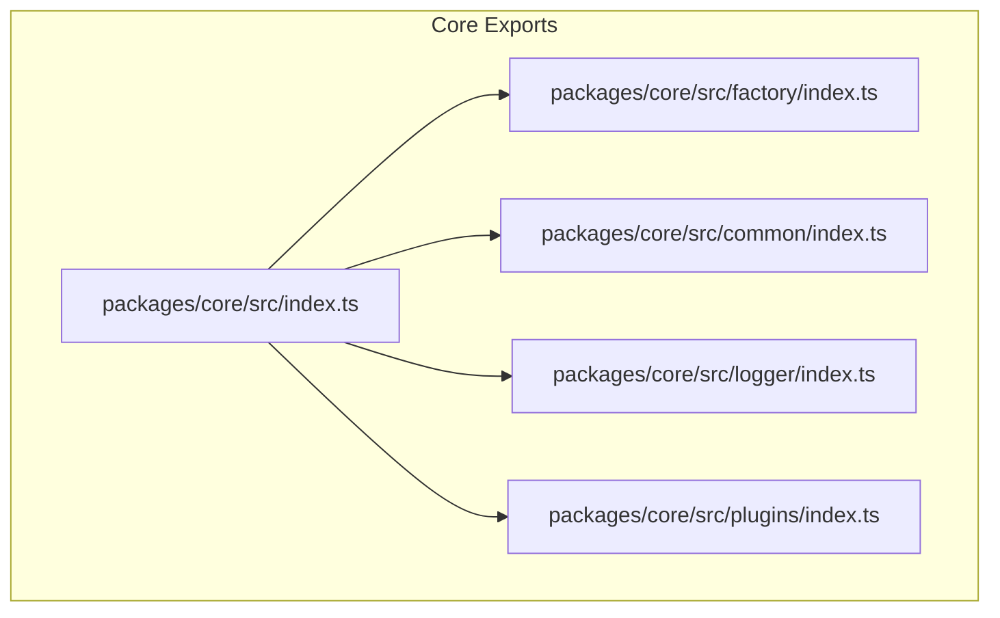
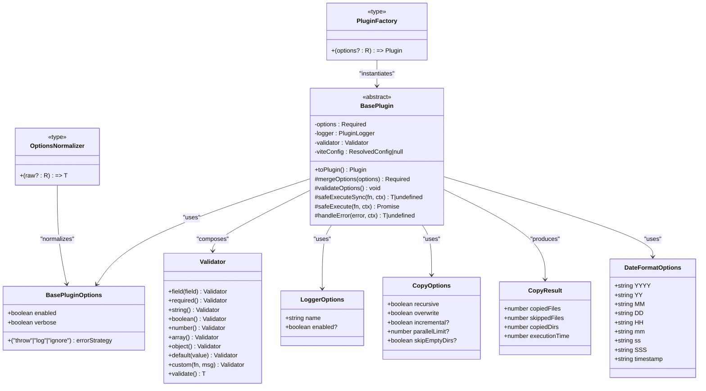
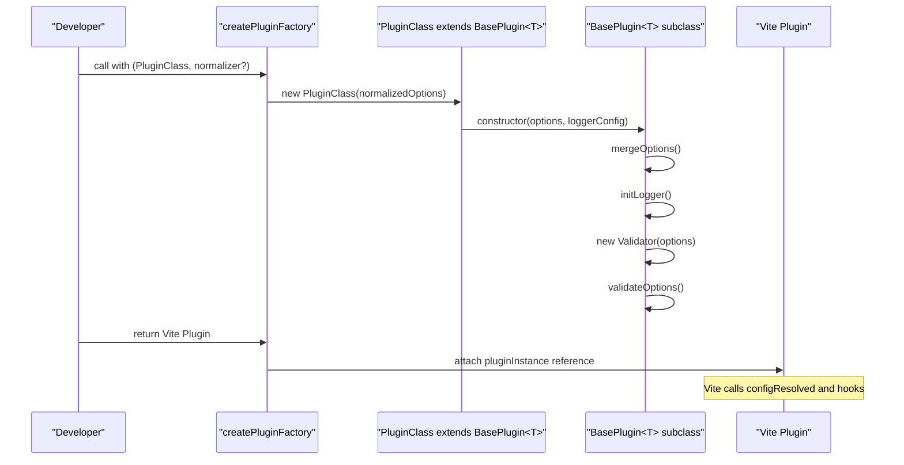
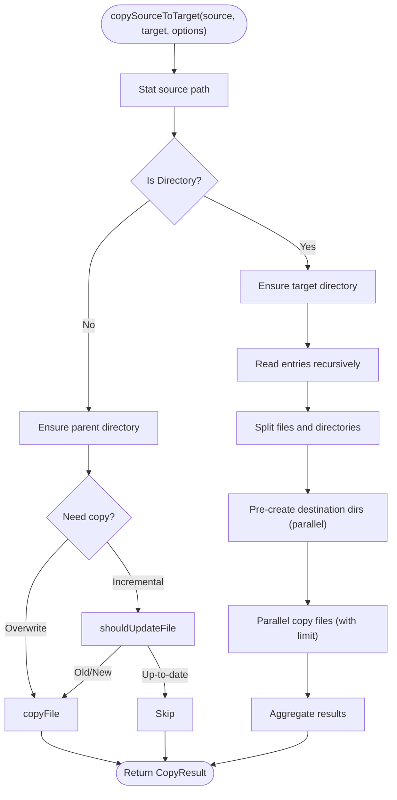
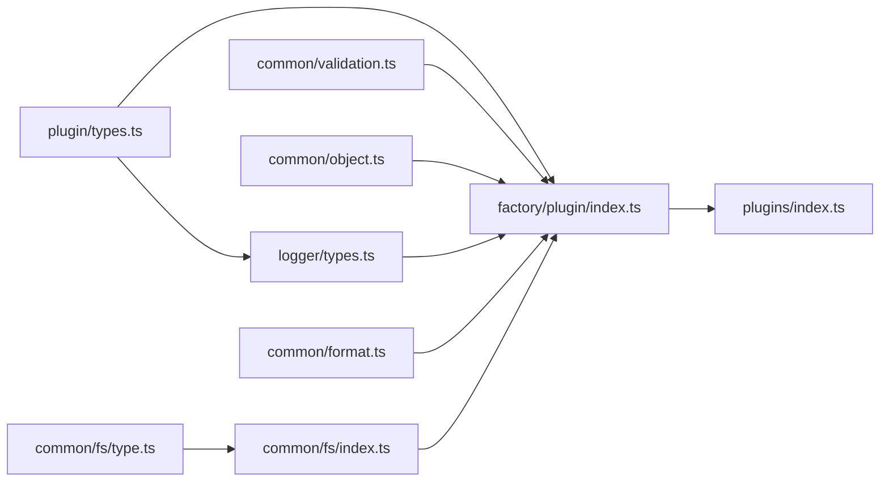

# Core Types

<cite>
**Referenced Files in This Document**
- [packages/core/src/index.ts](file://packages/core/src/index.ts)
- [packages/core/src/factory/plugin/types.ts](file://packages/core/src/factory/plugin/types.ts)
- [packages/core/src/factory/plugin/index.ts](file://packages/core/src/factory/plugin/index.ts)
- [packages/core/src/common/validation.ts](file://packages/core/src/common/validation.ts)
- [packages/core/src/common/object.ts](file://packages/core/src/common/object.ts)
- [packages/core/src/common/format.ts](file://packages/core/src/common/format.ts)
- [packages/core/src/common/fs/index.ts](file://packages/core/src/common/fs/index.ts)
- [packages/core/src/common/fs/type.ts](file://packages/core/src/common/fs/type.ts)
- [packages/core/src/logger/types.ts](file://packages/core/src/logger/types.ts)
- [packages/core/src/plugins/index.ts](file://packages/core/src/plugins/index.ts)
</cite>

## Table of Contents
1. [Introduction](#introduction)
2. [Project Structure](#project-structure)
3. [Core Components](#core-components)
4. [Architecture Overview](#architecture-overview)
5. [Detailed Component Analysis](#detailed-component-analysis)
6. [Dependency Analysis](#dependency-analysis)
7. [Performance Considerations](#performance-considerations)
8. [Troubleshooting Guide](#troubleshooting-guide)
9. [Conclusion](#conclusion)

## Introduction
This document provides comprehensive API documentation for the core type definitions and interfaces used throughout the Vite Plugin Ecosystem. It focuses on:
- BasePluginOptions interface and its role in plugin configuration
- Plugin factory types and creation patterns
- Validation schemas via the Validator class
- The abstract BasePlugin class structure, lifecycle hooks, and extension points
- Common utility types and helpers for logging, formatting, and filesystem operations
- TypeScript generics, constraints, and type guards
- Type compatibility, inheritance patterns, and guidelines for extending the ecosystem

## Project Structure
The core module exposes:
- Factory types and plugin creation utilities
- Common utilities for validation, object merging, formatting, and filesystem operations
- Logging types and infrastructure
- A set of built-in plugins

**Diagram sources**
- [packages/core/src/index.ts](file://packages/core/src/index.ts#L1-L8)
- [packages/core/src/factory/index.ts](file://packages/core/src/factory/index.ts#L1-L2)
- [packages/core/src/common/index.ts](file://packages/core/src/common/index.ts#L1-L5)
- [packages/core/src/logger/types.ts](file://packages/core/src/logger/types.ts#L1-L14)
- [packages/core/src/plugins/index.ts](file://packages/core/src/plugins/index.ts#L1-L4)

**Section sources**
- [packages/core/src/index.ts](file://packages/core/src/index.ts#L1-L8)
- [packages/core/src/plugins/index.ts](file://packages/core/src/plugins/index.ts#L1-L4)

## Core Components
This section documents the primary type definitions and their roles in the plugin architecture.

- BasePluginOptions
  - Purpose: Provides foundational configuration for all plugins, including enablement, verbosity, and error handling strategy.
  - Fields:
    - enabled: boolean flag to enable/disable plugin execution
    - verbose: boolean flag to toggle detailed logging
    - errorStrategy: union of 'throw' | 'log' | 'ignore'
  - Defaults: Provided by the BasePlugin during option merging

- OptionsNormalizer<T, R>
  - Purpose: Transforms raw user-provided options (R) into the internal options type (T).
  - Signature: (raw?: R) => T
  - Typical use: Normalize string-based or partial configurations into structured options

- PluginFactory<T extends BasePluginOptions, R>
  - Purpose: Factory function that produces a Vite Plugin from user options (R), returning a Plugin object.
  - Signature: (options?: R) => Plugin
  - Extends: Accepts optional raw options and returns a Vite Plugin compatible object

- Validator<T, K>
  - Purpose: Fluent validation builder for plugin options.
  - Generics:
    - T: Target options object being validated
    - K: Current field key being validated
  - Methods:
    - field(field): Selects a field for validation
    - required(): Marks selected field as required
    - string()/boolean()/number()/array()/object(): Type checks
    - default(value): Sets default if field is undefined/null
    - custom(validatorFn, message): Custom validation with error message
    - validate(): Executes validation and returns validated options or throws

- deepMerge<T>(...sources: Partial<T>[]): T
  - Purpose: Deep merges multiple source objects into a single result, preserving nested objects and overriding arrays.
  - Behavior: Skips undefined values to avoid overwriting existing defaults; merges nested plain objects recursively.

- LoggerOptions
  - Purpose: Configures the logger for a plugin instance.
  - Fields:
    - name: string identifying the plugin
    - enabled: boolean to enable/disable logging

- CopyOptions and CopyResult
  - Purpose: Define filesystem copy operation configuration and results.
  - CopyOptions fields: recursive, overwrite, incremental?, parallelLimit?, skipEmptyDirs?
  - CopyResult fields: copiedFiles, skippedFiles, copiedDirs, executionTime

- DateFormatOptions
  - Purpose: Provides formatted date/time placeholders for templates.
  - Fields: YYYY, YY, MM, DD, HH, mm, ss, SSS, timestamp

- Utility functions
  - padNumber(num, length): Zero-padded numeric string
  - generateRandomHash(length): Random hex string up to 64 characters
  - getDateFormatParams(date): Produces DateFormatOptions
  - formatDate(date, format): Formats date using placeholder tokens
  - parseTemplate(template, values): Replaces placeholders with values

**Section sources**
- [packages/core/src/factory/plugin/types.ts](file://packages/core/src/factory/plugin/types.ts#L1-L46)
- [packages/core/src/common/validation.ts](file://packages/core/src/common/validation.ts#L1-L203)
- [packages/core/src/common/object.ts](file://packages/core/src/common/object.ts#L1-L67)
- [packages/core/src/logger/types.ts](file://packages/core/src/logger/types.ts#L1-L14)
- [packages/core/src/common/fs/type.ts](file://packages/core/src/common/fs/type.ts#L1-L55)
- [packages/core/src/common/format.ts](file://packages/core/src/common/format.ts#L1-L137)

## Architecture Overview
The plugin architecture centers around an abstract BasePlugin that encapsulates configuration merging, validation, logging, and lifecycle management. Factories convert plugin classes into Vite-compatible Plugin instances.

**Diagram sources**
- [packages/core/src/factory/plugin/types.ts](file://packages/core/src/factory/plugin/types.ts#L1-L46)
- [packages/core/src/factory/plugin/index.ts](file://packages/core/src/factory/plugin/index.ts#L27-L348)
- [packages/core/src/common/validation.ts](file://packages/core/src/common/validation.ts#L16-L203)
- [packages/core/src/logger/types.ts](file://packages/core/src/logger/types.ts#L1-L14)
- [packages/core/src/common/fs/type.ts](file://packages/core/src/common/fs/type.ts#L1-L55)
- [packages/core/src/common/format.ts](file://packages/core/src/common/format.ts#L40-L88)

## Detailed Component Analysis

### BasePluginOptions and Plugin Factory Types
- BasePluginOptions defines the minimal contract for plugin configuration. It is merged with plugin-specific defaults and user options to produce Required<T>.
- OptionsNormalizer<T, R> enables flexible input normalization (e.g., accepting a string and converting to an options object).
- PluginFactory<T, R> is the standardized way to produce a Vite Plugin from user-provided options.

Key behaviors:
- Default values are applied during merge to ensure Required<T>.
- The factory attaches the original plugin instance to the returned Vite Plugin for introspection.

**Section sources**
- [packages/core/src/factory/plugin/types.ts](file://packages/core/src/factory/plugin/types.ts#L1-L46)
- [packages/core/src/factory/plugin/index.ts](file://packages/core/src/factory/plugin/index.ts#L369-L385)

### Validator Class
The Validator provides a fluent API for validating plugin options:
- Chainable methods select a field and apply checks (required, type assertions, defaults, custom validators).
- validate() throws if any errors were collected; otherwise returns the validated options.

Type safety:
- Generic K tracks the current field being validated.
- Field selection returns a narrowed Validator<T, NextK>.

Usage pattern:
- Instantiate with options, chain validations per field, and call validate() before using options.

**Section sources**
- [packages/core/src/common/validation.ts](file://packages/core/src/common/validation.ts#L16-L203)

### BasePlugin Lifecycle and Extension Points
BasePlugin orchestrates configuration, logging, validation, and Vite integration:
- Constructor merges options, initializes logger, constructs validator, and validates options.
- getDefaultOptions(): abstract hook for plugin-specific defaults.
- mergeOptions(): merges base defaults, plugin defaults, and user options using deepMerge.
- validateOptions(): virtual hook for custom validations.
- getPluginName(): abstract; must return a unique plugin identifier.
- getEnforce(): optional; sets enforce timing ('pre'/'post'/undefined).
- onConfigResolved(): stores resolved Vite config and logs initialization.
- addPluginHooks(plugin): abstract; adds Vite hooks to the Plugin object.
- safeExecute/safeExecuteSync: wrap synchronous/asynchronous operations with errorStrategy-aware handling.
- handleError: centralizes error handling based on errorStrategy.
- toPlugin(): returns a Vite Plugin with name, enforce, configResolved, and plugin-specific hooks.

Factory integration:
- createPluginFactory<T, P, R>(PluginClass, normalizer?): returns a function that instantiates the plugin, converts to a Vite Plugin, and attaches the instance to the returned object.

**Diagram sources**
- [packages/core/src/factory/plugin/index.ts](file://packages/core/src/factory/plugin/index.ts#L369-L385)
- [packages/core/src/factory/plugin/index.ts](file://packages/core/src/factory/plugin/index.ts#L69-L81)
- [packages/core/src/factory/plugin/index.ts](file://packages/core/src/factory/plugin/index.ts#L331-L347)

**Section sources**
- [packages/core/src/factory/plugin/index.ts](file://packages/core/src/factory/plugin/index.ts#L27-L348)

### Filesystem Utilities and Types
Common filesystem operations support efficient bulk copying with concurrency limits and incremental updates:
- checkSourceExists: validates source accessibility
- ensureTargetDir: creates target directories recursively
- readDirRecursive: enumerates files/directories with file type metadata
- shouldUpdateFile: determines if a file needs updating based on mtime/size
- copySourceToTarget: copies files/directories with parallelization and optional overwrite/incremental behavior
- writeFileContent/readFileSync: safe file read/write with error handling

CopyOptions/CopyResult define the contract for copy operations.

**Diagram sources**
- [packages/core/src/common/fs/index.ts](file://packages/core/src/common/fs/index.ts#L160-L253)

**Section sources**
- [packages/core/src/common/fs/index.ts](file://packages/core/src/common/fs/index.ts#L1-L292)
- [packages/core/src/common/fs/type.ts](file://packages/core/src/common/fs/type.ts#L1-L55)

### Formatting Utilities
Formatting helpers provide consistent date/time templating and placeholder substitution:
- padNumber: zero-pad numeric values
- generateRandomHash: secure random hex string generation
- getDateFormatParams: produces DateFormatOptions for a given date
- formatDate: renders a date string using placeholders
- parseTemplate: replaces placeholders in a template string with provided values

These utilities are useful for generating filenames, cache keys, and log messages.

**Section sources**
- [packages/core/src/common/format.ts](file://packages/core/src/common/format.ts#L1-L137)

### Logging Types
LoggerOptions configures the logger for a plugin:
- name: identifies the plugin in logs
- enabled: toggles logging

Logging is initialized within BasePlugin and used for lifecycle events and error reporting.

**Section sources**
- [packages/core/src/logger/types.ts](file://packages/core/src/logger/types.ts#L1-L14)
- [packages/core/src/factory/plugin/index.ts](file://packages/core/src/factory/plugin/index.ts#L128-L138)

### Built-in Plugins
The core module exports several built-in plugins. These are implemented elsewhere but are re-exported from the core index for convenience.

**Section sources**
- [packages/core/src/plugins/index.ts](file://packages/core/src/plugins/index.ts#L1-L4)

## Dependency Analysis
The following diagram shows key dependencies among core types and utilities:

**Diagram sources**
- [packages/core/src/factory/plugin/types.ts](file://packages/core/src/factory/plugin/types.ts#L1-L46)
- [packages/core/src/factory/plugin/index.ts](file://packages/core/src/factory/plugin/index.ts#L1-L6)
- [packages/core/src/common/validation.ts](file://packages/core/src/common/validation.ts#L1-L3)
- [packages/core/src/common/object.ts](file://packages/core/src/common/object.ts#L1-L3)
- [packages/core/src/common/fs/index.ts](file://packages/core/src/common/fs/index.ts#L1-L3)
- [packages/core/src/common/fs/type.ts](file://packages/core/src/common/fs/type.ts#L1-L3)
- [packages/core/src/common/format.ts](file://packages/core/src/common/format.ts#L1-L3)
- [packages/core/src/logger/types.ts](file://packages/core/src/logger/types.ts#L1-L3)
- [packages/core/src/plugins/index.ts](file://packages/core/src/plugins/index.ts#L1-L3)

**Section sources**
- [packages/core/src/index.ts](file://packages/core/src/index.ts#L1-L8)

## Performance Considerations
- Concurrency control: Filesystem copy operations use a configurable parallel limit to balance throughput and resource usage.
- Incremental updates: shouldUpdateFile compares modification time and size to avoid unnecessary writes.
- Safe execution wrappers: BasePlugin’s error handling avoids throwing in 'log'/'ignore' modes, reducing abrupt termination while still logging failures.
- Deep merge: Preserves nested objects and avoids overwriting with undefined values, minimizing redundant work and ensuring predictable defaults.

[No sources needed since this section provides general guidance]

## Troubleshooting Guide
Common issues and resolutions:
- Validation failures: Ensure all required fields are present and correctly typed. Use Validator.field().required() and type assertions to narrow types.
- Error strategy behavior: Configure errorStrategy to 'log' or 'ignore' to continue execution on failure; otherwise exceptions will be thrown.
- Logging visibility: Enable verbose logging via BasePluginOptions.verbose to capture lifecycle events and errors.
- Filesystem errors: Check permissions and paths; the filesystem utilities throw descriptive errors for missing files, permission issues, and IO failures.
- Factory usage: If accepting varied inputs, supply an OptionsNormalizer to normalize raw inputs into the expected options shape.

**Section sources**
- [packages/core/src/common/validation.ts](file://packages/core/src/common/validation.ts#L195-L201)
- [packages/core/src/factory/plugin/index.ts](file://packages/core/src/factory/plugin/index.ts#L283-L311)
- [packages/core/src/common/fs/index.ts](file://packages/core/src/common/fs/index.ts#L27-L39)
- [packages/core/src/common/fs/index.ts](file://packages/core/src/common/fs/index.ts#L47-L58)
- [packages/core/src/common/fs/index.ts](file://packages/core/src/common/fs/index.ts#L261-L272)
- [packages/core/src/common/fs/index.ts](file://packages/core/src/common/fs/index.ts#L280-L291)

## Conclusion
The Vite Plugin Ecosystem’s core types and abstractions provide a robust foundation for building extensible, maintainable plugins. By leveraging BasePluginOptions, the Validator, BasePlugin lifecycle hooks, and the plugin factory pattern, developers can implement plugins that are consistent, configurable, and easy to integrate with Vite. The included utilities for formatting, logging, and filesystem operations further streamline common tasks while maintaining strong type safety and predictable behavior.