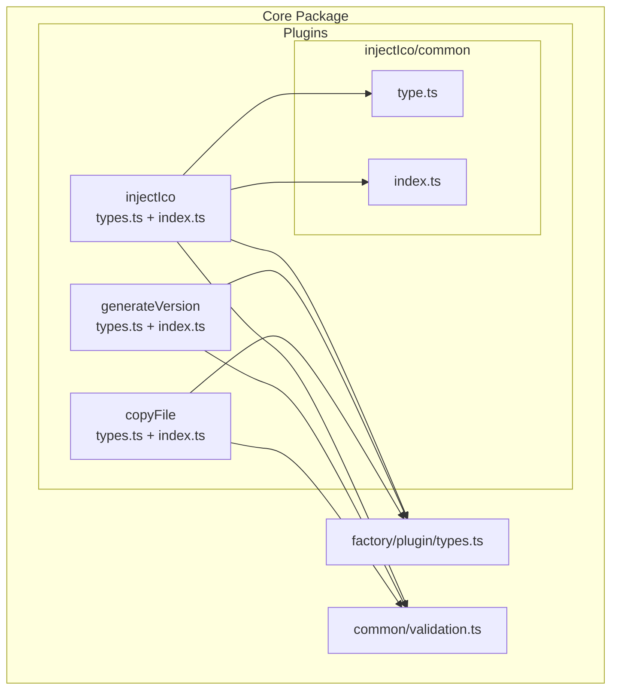
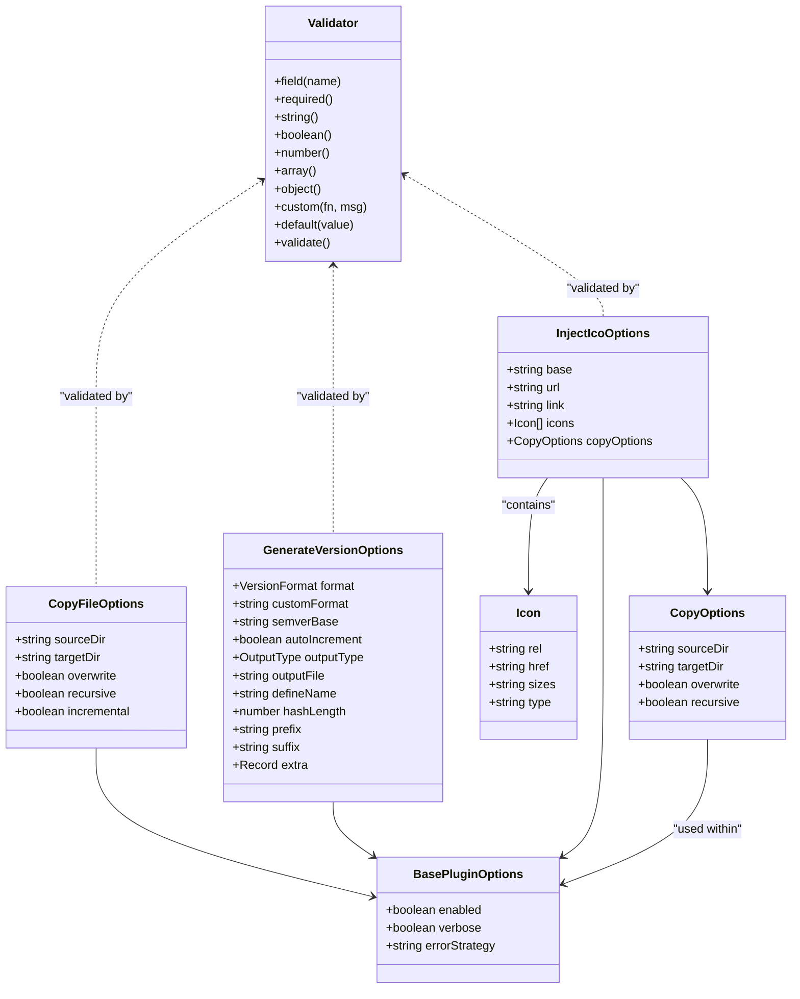
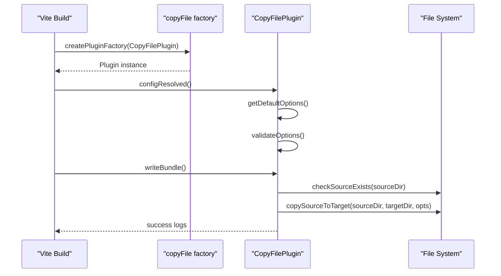
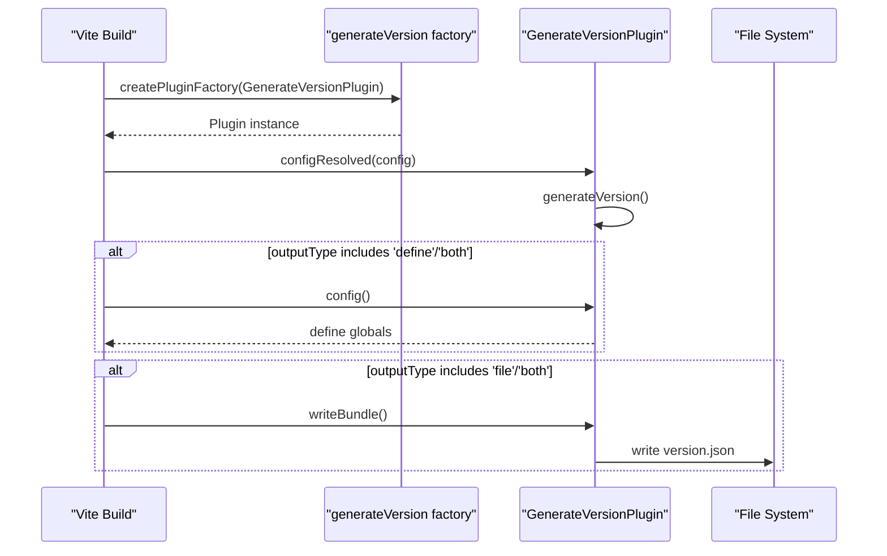
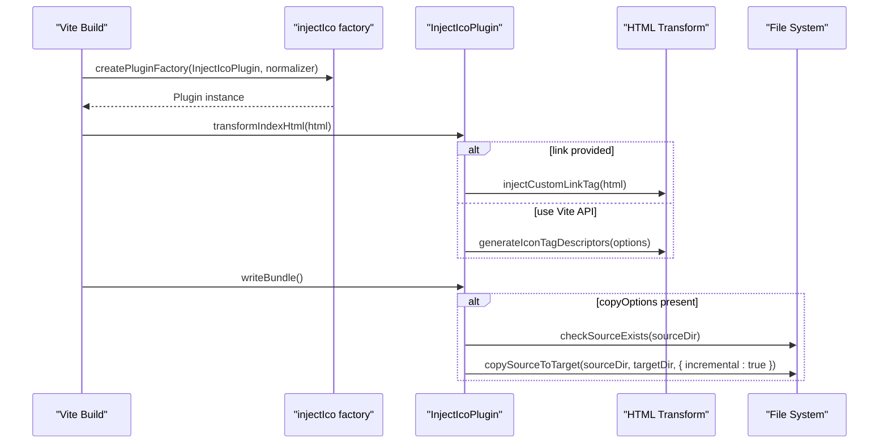
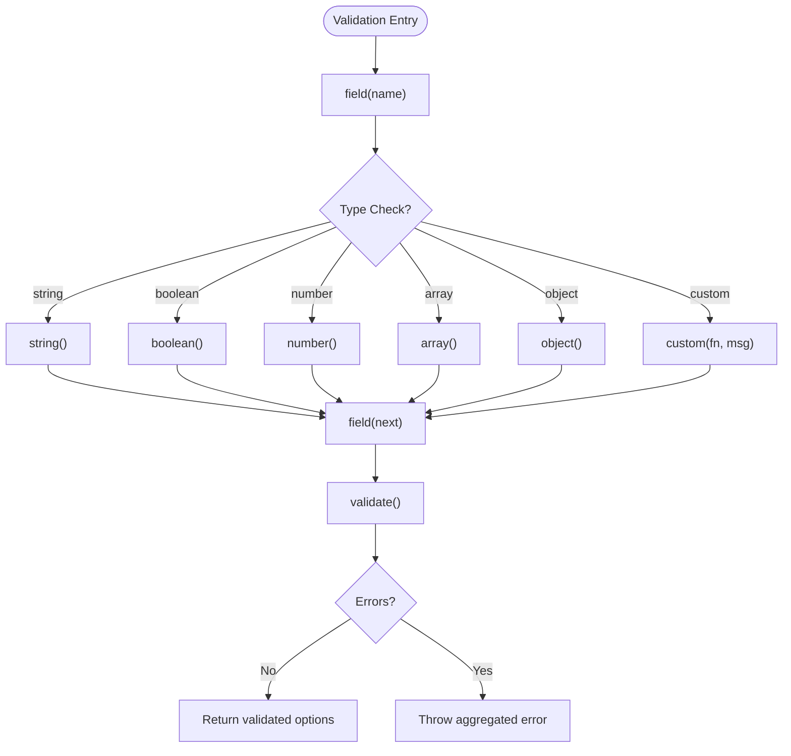
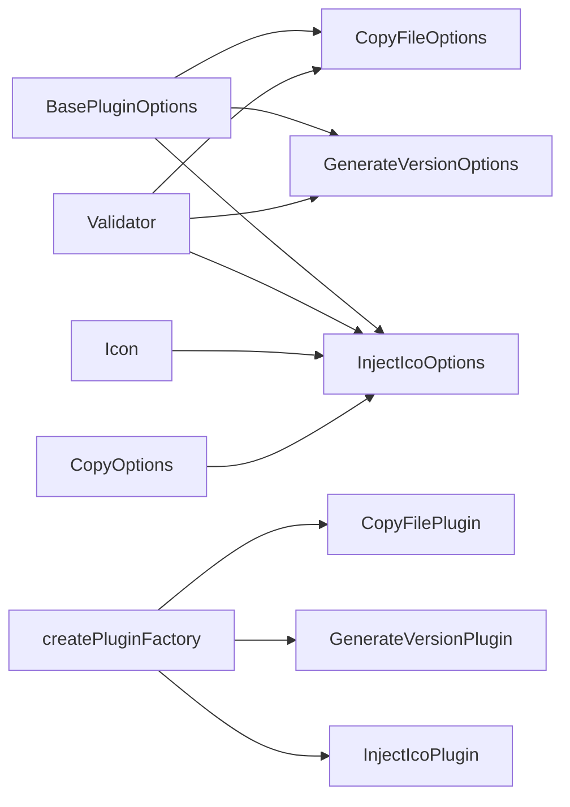

# Plugin Types

<cite>
**Referenced Files in This Document**
- [types.ts](file://packages/core/src/plugins/copyFile/types.ts)
- [index.ts](file://packages/core/src/plugins/copyFile/index.ts)
- [types.ts](file://packages/core/src/plugins/generateVersion/types.ts)
- [index.ts](file://packages/core/src/plugins/generateVersion/index.ts)
- [types.ts](file://packages/core/src/plugins/injectIco/types.ts)
- [index.ts](file://packages/core/src/plugins/injectIco/index.ts)
- [type.ts](file://packages/core/src/plugins/injectIco/common/type.ts)
- [index.ts](file://packages/core/src/plugins/injectIco/common/index.ts)
- [types.ts](file://packages/core/src/factory/plugin/types.ts)
- [validation.ts](file://packages/core/src/common/validation.ts)
- [copy-file.md](file://packages/docs/src/plugins/copy-file.md)
- [generate-version.md](file://packages/docs/src/plugins/generate-version.md)
- [inject-ico.md](file://packages/docs/src/plugins/inject-ico.md)
- [package.json](file://packages/core/package.json)
</cite>

## Table of Contents
1. [Introduction](#introduction)
2. [Project Structure](#project-structure)
3. [Core Components](#core-components)
4. [Architecture Overview](#architecture-overview)
5. [Detailed Component Analysis](#detailed-component-analysis)
6. [Dependency Analysis](#dependency-analysis)
7. [Performance Considerations](#performance-considerations)
8. [Troubleshooting Guide](#troubleshooting-guide)
9. [Conclusion](#conclusion)

## Introduction
This document provides comprehensive API documentation for plugin-specific type definitions and configuration interfaces within the Vite plugin library. It focuses on three primary plugins:
- Copy file plugin: CopyOptions interface and related configuration
- Generate version plugin: GenerateVersionOptions interface and related configuration
- Inject icon plugin: InjectIcoOptions interface and related configuration

The documentation covers parameter specifications, optional properties, default values, validation constraints, enum and union types, complex configuration objects, usage examples integrating with plugin factories, and considerations for type compatibility and migration across plugin versions.

## Project Structure
The plugin types and implementations are organized under the core package with dedicated folders per plugin. Each plugin exposes:
- Type definitions in a dedicated types.ts file
- Implementation in an index.ts file exporting a factory function
- Optional shared common utilities under an injectIco/common folder

**Diagram sources**
- [types.ts](file://packages/core/src/plugins/copyFile/types.ts#L1-L44)
- [index.ts](file://packages/core/src/plugins/copyFile/index.ts#L1-L121)
- [types.ts](file://packages/core/src/plugins/generateVersion/types.ts#L1-L120)
- [index.ts](file://packages/core/src/plugins/generateVersion/index.ts#L1-L257)
- [types.ts](file://packages/core/src/plugins/injectIco/types.ts#L1-L113)
- [index.ts](file://packages/core/src/plugins/injectIco/index.ts#L1-L195)
- [type.ts](file://packages/core/src/plugins/injectIco/common/type.ts#L1-L47)
- [index.ts](file://packages/core/src/plugins/injectIco/common/index.ts#L1-L60)
- [types.ts](file://packages/core/src/factory/plugin/types.ts#L1-L46)
- [validation.ts](file://packages/core/src/common/validation.ts#L1-L203)

**Section sources**
- [types.ts](file://packages/core/src/plugins/copyFile/types.ts#L1-L44)
- [types.ts](file://packages/core/src/plugins/generateVersion/types.ts#L1-L120)
- [types.ts](file://packages/core/src/plugins/injectIco/types.ts#L1-L113)
- [types.ts](file://packages/core/src/factory/plugin/types.ts#L1-L46)
- [validation.ts](file://packages/core/src/common/validation.ts#L1-L203)

## Core Components
This section documents the three plugin-specific configuration interfaces and their associated enums/unions, defaults, and validation constraints.

### CopyOptions (Copy File Plugin)
- Purpose: Defines configuration for copying files/directories during the build lifecycle.
- Inherits from: BasePluginOptions (enabled, verbose, errorStrategy)
- Required properties:
  - sourceDir: string
  - targetDir: string
- Optional properties with defaults:
  - overwrite: boolean = true
  - recursive: boolean = true
  - incremental: boolean = true
- Validation constraints:
  - sourceDir and targetDir must be non-empty strings
  - overwrite, recursive, incremental must be booleans
- Execution behavior:
  - Runs post-build (enforce: 'post')
  - Supports incremental copy to improve performance

Usage example path:
- [Example usage in documentation](file://packages/docs/src/plugins/copy-file.md#L70-L159)

**Section sources**
- [types.ts](file://packages/core/src/plugins/copyFile/types.ts#L8-L43)
- [index.ts](file://packages/core/src/plugins/copyFile/index.ts#L14-L40)
- [copy-file.md](file://packages/docs/src/plugins/copy-file.md#L57-L69)

### GenerateVersionOptions (Generate Version Plugin)
- Purpose: Defines configuration for generating version identifiers during the build lifecycle.
- Inherits from: BasePluginOptions (enabled, verbose, errorStrategy)
- Enum/Union types:
  - VersionFormat: 'timestamp' | 'date' | 'datetime' | 'semver' | 'hash' | 'custom'
  - OutputType: 'file' | 'define' | 'both'
- Required properties:
  - None (all are optional)
- Optional properties with defaults:
  - format: VersionFormat = 'timestamp'
  - semverBase: string = '1.0.0'
  - autoIncrement: boolean = false
  - outputType: OutputType = 'file'
  - outputFile: string = 'version.json'
  - defineName: string = '__APP_VERSION__'
  - hashLength: number = 8
  - prefix: string = ''
  - suffix: string = ''
  - extra: Record<string, any> = undefined
- Validation constraints:
  - format must be one of the allowed VersionFormat values
  - outputType must be one of the allowed OutputType values
  - hashLength must be a number in the range 1..32
  - When format is 'custom', customFormat must be provided
- Execution behavior:
  - Generates version during configResolved
  - Can output to file (writeBundle) and/or inject via Vite define (config hook)

Usage example path:
- [Example usage in documentation](file://packages/docs/src/plugins/generate-version.md#L106-L259)

**Section sources**
- [types.ts](file://packages/core/src/plugins/generateVersion/types.ts#L14-L119)
- [index.ts](file://packages/core/src/plugins/generateVersion/index.ts#L25-L54)
- [generate-version.md](file://packages/docs/src/plugins/generate-version.md#L58-L76)

### InjectIcoOptions (Inject Icon Plugin)
- Purpose: Defines configuration for injecting favicon/link tags into HTML and optionally copying icon assets.
- Inherits from: BasePluginOptions (enabled, verbose, errorStrategy)
- Nested types:
  - Icon: rel: string, href: string, sizes?: string, type?: string
  - CopyOptions: sourceDir: string, targetDir: string, overwrite?: boolean, recursive?: boolean
- Required properties:
  - None (all are optional)
- Optional properties with defaults:
  - base: string = '/'
  - url: string = undefined
  - link: string = undefined
  - icons: Icon[] = undefined
  - copyOptions: CopyOptions = undefined
- Validation constraints:
  - base, url, link must be strings
  - icons must be an array
  - When copyOptions is provided, it must be validated as an object with required fields sourceDir and targetDir as strings, and overwrite/recursive as booleans
- Execution behavior:
  - Uses Vite’s transformIndexHtml hook to inject tags (preferred)
  - Falls back to injecting a custom link tag string if provided
  - Copies icon files after build when copyOptions is present

Usage example path:
- [Example usage in documentation](file://packages/docs/src/plugins/inject-ico.md#L18-L258)

**Section sources**
- [types.ts](file://packages/core/src/plugins/injectIco/types.ts#L70-L112)
- [index.ts](file://packages/core/src/plugins/injectIco/index.ts#L15-L33)
- [inject-ico.md](file://packages/docs/src/plugins/inject-ico.md#L69-L81)

## Architecture Overview
The plugins share a common factory pattern and base configuration contract. Each plugin defines its own options interface extending BasePluginOptions and uses a factory to produce a Vite plugin instance. Validation is centralized via a reusable Validator utility.

**Diagram sources**
- [types.ts](file://packages/core/src/factory/plugin/types.ts#L8-L29)
- [types.ts](file://packages/core/src/plugins/copyFile/types.ts#L8-L43)
- [types.ts](file://packages/core/src/plugins/generateVersion/types.ts#L31-L119)
- [types.ts](file://packages/core/src/plugins/injectIco/types.ts#L70-L112)
- [type.ts](file://packages/core/src/plugins/injectIco/common/type.ts#L6-L46)
- [validation.ts](file://packages/core/src/common/validation.ts#L16-L202)

## Detailed Component Analysis

### Copy File Plugin Type Analysis
- Type structure: CopyFileOptions extends BasePluginOptions and adds three boolean toggles plus two required paths.
- Defaults: overwrite=true, recursive=true, incremental=true.
- Validation: Enforces non-empty string paths and boolean flags.
- Factory integration: copyFile factory produces a Vite plugin with enforce: 'post'.

**Diagram sources**
- [index.ts](file://packages/core/src/plugins/copyFile/index.ts#L13-L86)
- [types.ts](file://packages/core/src/plugins/copyFile/types.ts#L8-L43)

**Section sources**
- [types.ts](file://packages/core/src/plugins/copyFile/types.ts#L8-L43)
- [index.ts](file://packages/core/src/plugins/copyFile/index.ts#L14-L40)
- [index.ts](file://packages/core/src/plugins/copyFile/index.ts#L58-L80)

### Generate Version Plugin Type Analysis
- Type structure: GenerateVersionOptions includes enums VersionFormat and OutputType, plus numerous formatting and output controls.
- Defaults: timestamp format, file output, default filenames and variable names, default hash length.
- Validation: Validates enum values, numeric range, and conditional requirement for customFormat.
- Factory integration: generateVersion factory produces a Vite plugin with hooks for configResolved, config, and writeBundle.

**Diagram sources**
- [index.ts](file://packages/core/src/plugins/generateVersion/index.ts#L14-L196)
- [types.ts](file://packages/core/src/plugins/generateVersion/types.ts#L14-L119)

**Section sources**
- [types.ts](file://packages/core/src/plugins/generateVersion/types.ts#L14-L119)
- [index.ts](file://packages/core/src/plugins/generateVersion/index.ts#L25-L54)
- [index.ts](file://packages/core/src/plugins/generateVersion/index.ts#L146-L196)

### Inject Icon Plugin Type Analysis
- Type structure: InjectIcoOptions supports multiple injection strategies (base, url, link, icons) and optional asset copying via CopyOptions.
- Defaults: base='/'.
- Validation: Validates top-level fields and nested copyOptions fields when present.
- Factory integration: injectIco factory accepts either a string (interpreted as base) or the full options object.

**Diagram sources**
- [index.ts](file://packages/core/src/plugins/injectIco/index.ts#L14-L157)
- [index.ts](file://packages/core/src/plugins/injectIco/common/index.ts#L10-L59)
- [types.ts](file://packages/core/src/plugins/injectIco/types.ts#L70-L112)

**Section sources**
- [types.ts](file://packages/core/src/plugins/injectIco/types.ts#L70-L112)
- [index.ts](file://packages/core/src/plugins/injectIco/index.ts#L15-L33)
- [index.ts](file://packages/core/src/plugins/injectIco/index.ts#L131-L157)

### Validation Constraints and Error Handling
- Validator utility supports fluent validation with required, string, boolean, number, array, object, custom, default, and validate.
- Plugins apply validation in validateOptions() and throw descriptive errors when invalid.
- Error handling strategy is inherited from BasePluginOptions.errorStrategy.

**Diagram sources**
- [validation.ts](file://packages/core/src/common/validation.ts#L16-L202)

**Section sources**
- [validation.ts](file://packages/core/src/common/validation.ts#L16-L202)
- [index.ts](file://packages/core/src/plugins/copyFile/index.ts#L22-L40)
- [index.ts](file://packages/core/src/plugins/generateVersion/index.ts#L39-L54)
- [index.ts](file://packages/core/src/plugins/injectIco/index.ts#L21-L33)

## Dependency Analysis
- All plugins depend on BasePluginOptions for common behavior (enabled, verbose, errorStrategy).
- Validation is centralized in the Validator utility used by each plugin.
- The injectIco plugin composes Icon and CopyOptions types internally and exposes them in InjectIcoOptions.
- The injectIco plugin uses a normalization function to accept a string argument as base.

**Diagram sources**
- [types.ts](file://packages/core/src/factory/plugin/types.ts#L8-L29)
- [types.ts](file://packages/core/src/plugins/copyFile/types.ts#L8-L43)
- [types.ts](file://packages/core/src/plugins/generateVersion/types.ts#L31-L119)
- [types.ts](file://packages/core/src/plugins/injectIco/types.ts#L70-L112)
- [type.ts](file://packages/core/src/plugins/injectIco/common/type.ts#L6-L46)
- [validation.ts](file://packages/core/src/common/validation.ts#L16-L202)
- [index.ts](file://packages/core/src/plugins/copyFile/index.ts#L120-L121)
- [index.ts](file://packages/core/src/plugins/generateVersion/index.ts#L256-L257)
- [index.ts](file://packages/core/src/plugins/injectIco/index.ts#L194-L195)

**Section sources**
- [types.ts](file://packages/core/src/factory/plugin/types.ts#L8-L29)
- [types.ts](file://packages/core/src/plugins/injectIco/types.ts#L70-L112)
- [index.ts](file://packages/core/src/plugins/injectIco/index.ts#L194-L195)

## Performance Considerations
- Incremental copying: Enabled by default in CopyOptions and enforced in InjectIcoPlugin when copying assets, reducing rebuild times.
- Hash length: In GenerateVersionOptions, hashLength impacts entropy and string length; keep within recommended bounds.
- Output strategy: Using 'define' or 'both' adds runtime overhead due to Vite define injection; choose based on deployment needs.
- Logging verbosity: Excessive verbose logging can slow builds; disable for CI environments.

## Troubleshooting Guide
Common validation and configuration issues:
- CopyOptions
  - Non-string or empty sourceDir/targetDir cause validation failures.
  - Ensure overwrite/recursive are booleans.
- GenerateVersionOptions
  - format must be one of the allowed enum values.
  - When format is 'custom', customFormat is mandatory.
  - hashLength must be between 1 and 32.
- InjectIcoOptions
  - When copyOptions is provided, ensure required fields (sourceDir, targetDir) are strings and overwrite/recursive are booleans.
  - If link is provided, it takes precedence over url/base/icons; ensure proper HTML.
  - Missing '</head>' prevents injection; verify HTML structure.

Error handling strategy:
- errorStrategy controls behavior when validation or execution fails:
  - 'throw': stops the build with an error
  - 'log': records warnings but continues
  - 'ignore': suppresses errors and continues

**Section sources**
- [index.ts](file://packages/core/src/plugins/copyFile/index.ts#L22-L40)
- [index.ts](file://packages/core/src/plugins/generateVersion/index.ts#L39-L54)
- [index.ts](file://packages/core/src/plugins/injectIco/index.ts#L21-L33)
- [copy-file.md](file://packages/docs/src/plugins/copy-file.md#L143-L159)
- [generate-version.md](file://packages/docs/src/plugins/generate-version.md#L247-L259)
- [inject-ico.md](file://packages/docs/src/plugins/inject-ico.md#L243-L258)

## Conclusion
The plugin type system provides a consistent, strongly-typed configuration model across the copy file, generate version, and inject icon plugins. By leveraging BasePluginOptions, enum/union types, and a shared Validator utility, the library ensures predictable defaults, robust validation, and flexible integration with Vite’s plugin lifecycle. When migrating or upgrading, pay attention to conditional requirements (e.g., customFormat for GenerateVersionOptions) and ensure nested configurations (e.g., copyOptions in InjectIcoOptions) remain valid.