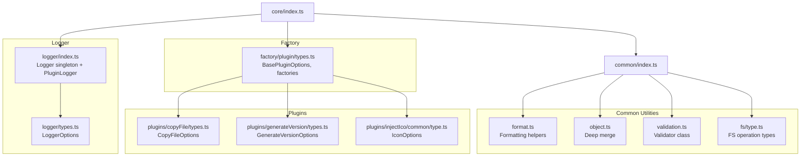
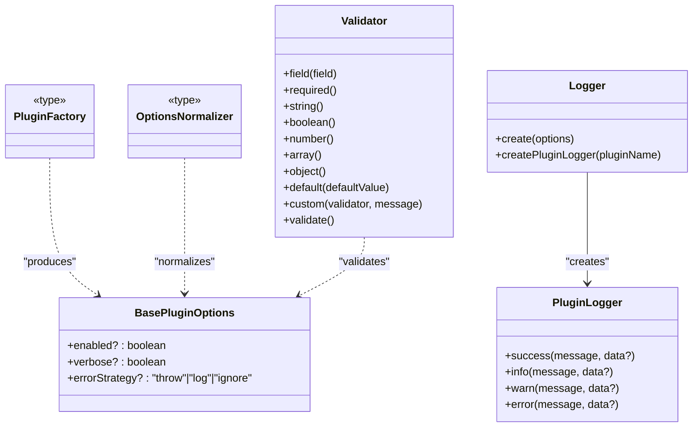
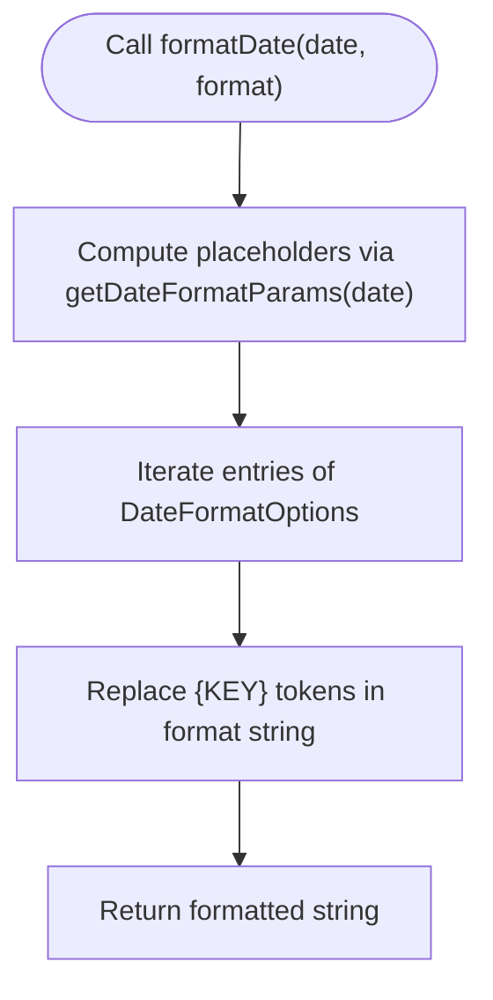
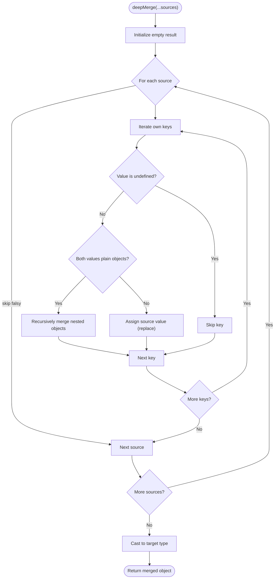
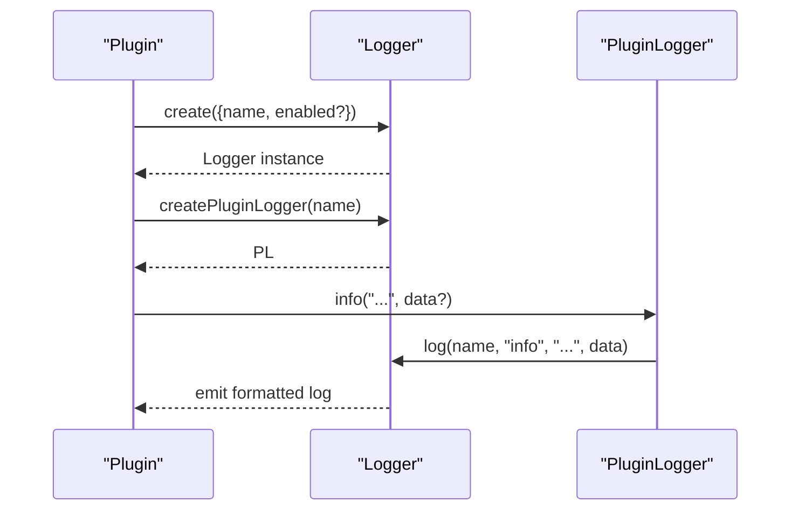
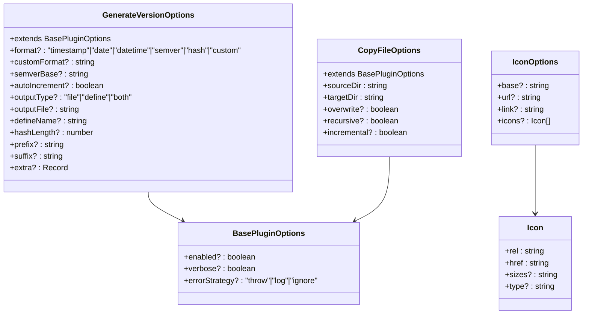
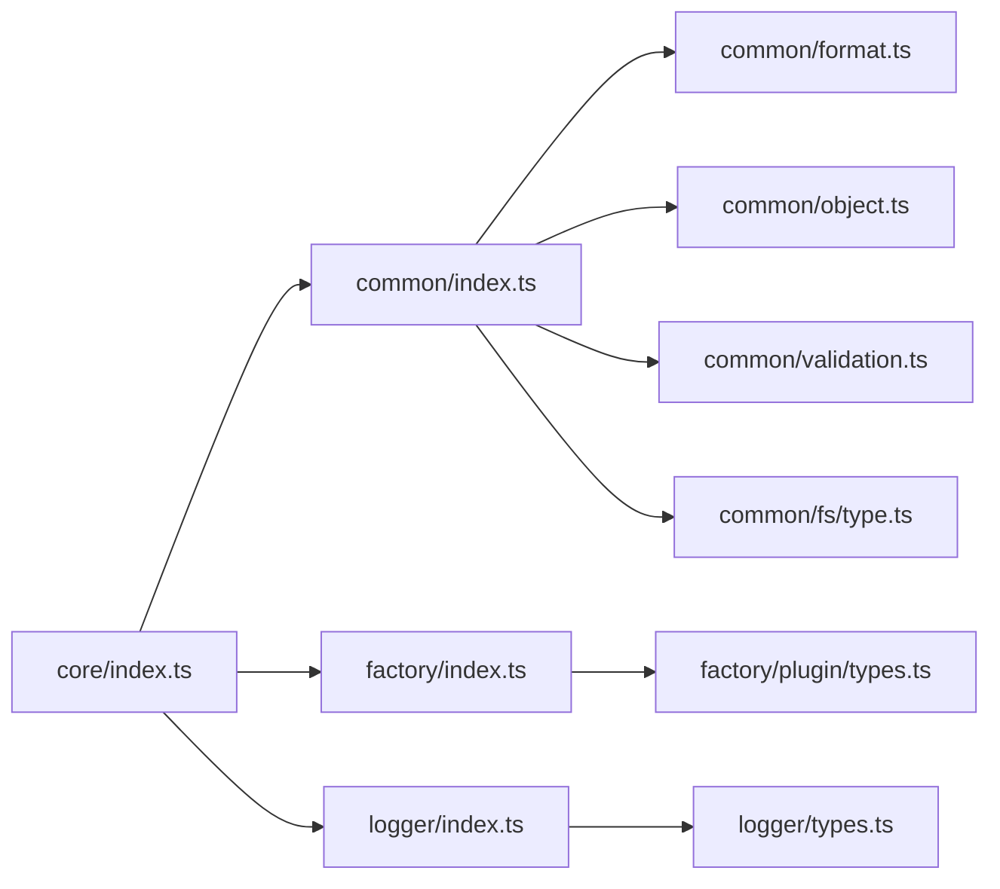

# Utility Types

<cite>
**Referenced Files in This Document**
- [format.ts](file://packages/core/src/common/format.ts)
- [object.ts](file://packages/core/src/common/object.ts)
- [validation.ts](file://packages/core/src/common/validation.ts)
- [types.ts](file://packages/core/src/logger/types.ts)
- [index.ts](file://packages/core/src/logger/index.ts)
- [types.ts](file://packages/core/src/factory/plugin/types.ts)
- [types.ts](file://packages/core/src/common/fs/type.ts)
- [types.ts](file://packages/core/src/plugins/copyFile/types.ts)
- [types.ts](file://packages/core/src/plugins/generateVersion/types.ts)
- [types.ts](file://packages/core/src/plugins/injectIco/common/type.ts)
- [index.ts](file://packages/core/src/common/index.ts)
- [index.ts](file://packages/core/src/index.ts)
</cite>

## Table of Contents
1. [Introduction](#introduction)
2. [Project Structure](#project-structure)
3. [Core Components](#core-components)
4. [Architecture Overview](#architecture-overview)
5. [Detailed Component Analysis](#detailed-component-analysis)
6. [Dependency Analysis](#dependency-analysis)
7. [Performance Considerations](#performance-considerations)
8. [Troubleshooting Guide](#troubleshooting-guide)
9. [Conclusion](#conclusion)
10. [Appendices](#appendices)

## Introduction
This document describes the utility type definitions and helper interfaces used across the plugin ecosystem. It focuses on:
- Formatting utilities for dates, hashes, and templates
- Object manipulation types and deep merge behavior
- Logging system interfaces and structured logging types
- Type definitions for common operations such as path manipulation, data transformation, and error handling
- Practical usage patterns for plugin developers and integration scenarios
- Type safety guarantees, generic constraints, and best practices

## Project Structure
The utility types are organized under a cohesive set of modules:
- Common utilities: formatting, object manipulation, validation, and filesystem options
- Factory types: plugin options base and factory signatures
- Logger: structured logging interfaces and runtime implementation
- Plugins: plugin-specific option types that extend the base factory options



**Diagram sources**
- [index.ts](file://packages/core/src/common/index.ts#L1-L5)
- [index.ts](file://packages/core/src/index.ts#L1-L8)
- [types.ts](file://packages/core/src/factory/plugin/types.ts#L1-L46)
- [types.ts](file://packages/core/src/logger/types.ts#L1-L14)
- [index.ts](file://packages/core/src/logger/index.ts#L1-L181)
- [types.ts](file://packages/core/src/common/fs/type.ts#L1-L55)
- [types.ts](file://packages/core/src/plugins/copyFile/types.ts#L1-L44)
- [types.ts](file://packages/core/src/plugins/generateVersion/types.ts#L1-L120)
- [types.ts](file://packages/core/src/plugins/injectIco/common/type.ts#L1-L47)

**Section sources**
- [index.ts](file://packages/core/src/common/index.ts#L1-L5)
- [index.ts](file://packages/core/src/index.ts#L1-L8)

## Core Components
This section summarizes the primary utility types and their roles.

- Formatting utilities
  - Numeric padding, random hash generation, date formatting options, date formatting function, and template parsing
  - Used for deterministic string generation and templated output across plugins

- Object manipulation
  - Deep merge with controlled overwrite semantics for plain objects
  - Preserves arrays via replacement and skips undefined values to avoid overriding defaults

- Validation utilities
  - Fluent Validator class for plugin configuration with required, type checks, defaults, and custom validators
  - Aggregates errors and throws on validation failure

- Logging system
  - LoggerOptions for initialization
  - Logger singleton managing per-plugin logging state and output formatting
  - PluginLogger interface for plugin-side logging calls

- Factory and plugin types
  - BasePluginOptions for common plugin toggles and error strategy
  - PluginFactory and OptionsNormalizer for standardized plugin creation
  - Plugin-specific option types extending BasePluginOptions

- Filesystem operation types
  - CopyOptions and CopyResult for copy operations with recursive, overwrite, incremental, and parallel controls

**Section sources**
- [format.ts](file://packages/core/src/common/format.ts#L1-L137)
- [object.ts](file://packages/core/src/common/object.ts#L1-L67)
- [validation.ts](file://packages/core/src/common/validation.ts#L1-L203)
- [types.ts](file://packages/core/src/logger/types.ts#L1-L14)
- [index.ts](file://packages/core/src/logger/index.ts#L1-L181)
- [types.ts](file://packages/core/src/factory/plugin/types.ts#L1-L46)
- [types.ts](file://packages/core/src/common/fs/type.ts#L1-L55)
- [types.ts](file://packages/core/src/plugins/copyFile/types.ts#L1-L44)
- [types.ts](file://packages/core/src/plugins/generateVersion/types.ts#L1-L120)
- [types.ts](file://packages/core/src/plugins/injectIco/common/type.ts#L1-L47)

## Architecture Overview
The utility types form a layered API surface:
- Low-level formatting and object helpers
- Validation and logging abstractions
- Factory and plugin option contracts
- Plugin implementations consuming these contracts



**Diagram sources**
- [validation.ts](file://packages/core/src/common/validation.ts#L16-L202)
- [index.ts](file://packages/core/src/logger/index.ts#L7-L146)
- [types.ts](file://packages/core/src/factory/plugin/types.ts#L8-L46)

## Detailed Component Analysis

### Formatting Utilities
Key APIs:
- padNumber: zero-pad numeric values to a target length
- generateRandomHash: produce cryptographically derived hex strings up to a bounded length
- DateFormatOptions: named placeholders for date parts
- getDateFormatParams: compute placeholder values for a given Date
- formatDate: render a format template using placeholders
- parseTemplate: replace placeholders in a template with provided values

Usage patterns:
- Build deterministic identifiers and filenames using padNumber and generateRandomHash
- Render localized or standardized timestamps using getDateFormatParams and formatDate
- Compose dynamic strings across plugins with parseTemplate

Type safety and constraints:
- padNumber and generateRandomHash are pure functions with explicit numeric bounds
- DateFormatOptions enumerates supported placeholders; formatDate replaces them safely
- parseTemplate uses a record map for arbitrary key-value substitution



**Diagram sources**
- [format.ts](file://packages/core/src/common/format.ts#L76-L113)

**Section sources**
- [format.ts](file://packages/core/src/common/format.ts#L1-L137)

### Object Manipulation Types
Key APIs:
- deepMerge: merges multiple source objects into a new object with controlled semantics
  - Skips undefined values to avoid overriding defaults
  - Recursively merges plain objects
  - Replaces arrays (does not concatenate)
  - Supports null overrides

Generic constraints:
- Input sources are partial versions of the target type
- Output type is the constrained target type



**Diagram sources**
- [object.ts](file://packages/core/src/common/object.ts#L35-L66)

**Section sources**
- [object.ts](file://packages/core/src/common/object.ts#L1-L67)

### Validation Utilities
Key APIs:
- Validator<T, K>: fluent builder for validating plugin options
  - field(name) selects the current field
  - required(), string(), boolean(), number(), array(), object() apply type checks
  - default(value) sets defaults for undefined/null values
  - custom(fn, msg) applies arbitrary validation
  - validate() returns validated options or throws aggregated errors

Type safety and constraints:
- Generic parameters constrain available fields and values
- Chainable methods preserve type context for fluent usage
- Errors accumulate and are thrown as a single exception

```mermaid
sequenceDiagram
participant Dev as "Plugin Developer"
participant V as "Validator<T,K>"
participant Opt as "Options<T>"
Dev->>V : new Validator(options)
Dev->>V : field("prop").required().string().default("...")
Dev->>V : validate()
V->>Opt : set defaults for null/undefined
V->>V : run type checks and custom validators
alt errors present
V-->>Dev : throw aggregated error
else no errors
V-->>Dev : return validated options
end
```

**Diagram sources**
- [validation.ts](file://packages/core/src/common/validation.ts#L36-L201)

**Section sources**
- [validation.ts](file://packages/core/src/common/validation.ts#L1-L203)

### Logging System Interfaces
Key APIs:
- LoggerOptions: name and optional enable flag
- Logger: singleton manager
  - create(options): registers plugin and returns shared instance
  - createPluginLogger(pluginName): returns a PluginLogger bound to the plugin
- PluginLogger: success, info, warn, error methods with optional data payload

Behavior:
- Per-plugin logging state is stored and checked before emitting logs
- Preformatted prefixes and icons are applied consistently
- Data payloads are logged alongside messages when provided



**Diagram sources**
- [index.ts](file://packages/core/src/logger/index.ts#L76-L145)
- [types.ts](file://packages/core/src/logger/types.ts#L4-L13)

**Section sources**
- [types.ts](file://packages/core/src/logger/types.ts#L1-L14)
- [index.ts](file://packages/core/src/logger/index.ts#L1-L181)

### Factory and Plugin Types
Key types:
- BasePluginOptions: common toggles and error strategy
- OptionsNormalizer<T, R>: transforms raw options into normalized T
- PluginFactory<T, R>: creates a Vite Plugin from options

Plugin-specific option types:
- CopyFileOptions: extends BasePluginOptions with source/target directories and copy behavior
- GenerateVersionOptions: extends BasePluginOptions with version format, output type, and customization
- IconOptions: icon injection configuration for HTML head

Usage patterns:
- Use BasePluginOptions to standardize plugin lifecycle flags
- Apply OptionsNormalizer to normalize raw configs into strongly-typed options
- Implement PluginFactory to produce Vite plugins with consistent logging and error handling



**Diagram sources**
- [types.ts](file://packages/core/src/factory/plugin/types.ts#L8-L29)
- [types.ts](file://packages/core/src/plugins/copyFile/types.ts#L8-L43)
- [types.ts](file://packages/core/src/plugins/generateVersion/types.ts#L31-L119)
- [types.ts](file://packages/core/src/plugins/injectIco/common/type.ts#L6-L46)

**Section sources**
- [types.ts](file://packages/core/src/factory/plugin/types.ts#L1-L46)
- [types.ts](file://packages/core/src/plugins/copyFile/types.ts#L1-L44)
- [types.ts](file://packages/core/src/plugins/generateVersion/types.ts#L1-L120)
- [types.ts](file://packages/core/src/plugins/injectIco/common/type.ts#L1-L47)

### Filesystem Operation Types
Key types:
- CopyOptions: recursive, overwrite, incremental, parallelLimit, skipEmptyDirs
- CopyResult: counts of copied files/dirs, skipped files, and execution time

Usage patterns:
- Configure copy operations with CopyOptions
- Inspect CopyResult after completion for diagnostics and metrics

**Section sources**
- [types.ts](file://packages/core/src/common/fs/type.ts#L1-L55)

## Dependency Analysis
The core exports aggregate all utilities and expose them for plugin authors.



**Diagram sources**
- [index.ts](file://packages/core/src/index.ts#L1-L8)
- [index.ts](file://packages/core/src/common/index.ts#L1-L5)
- [types.ts](file://packages/core/src/factory/plugin/types.ts#L1-L2)
- [types.ts](file://packages/core/src/logger/types.ts#L1-L14)

**Section sources**
- [index.ts](file://packages/core/src/index.ts#L1-L8)
- [index.ts](file://packages/core/src/common/index.ts#L1-L5)

## Performance Considerations
- Formatting
  - padNumber and generateRandomHash are O(n) with small constants; suitable for frequent use
  - formatDate iterates over a fixed set of placeholders; overhead is minimal
- Object merging
  - deepMerge traverses owned properties; complexity proportional to total properties across sources
  - Avoid excessive nesting to keep merge efficient
- Validation
  - Validator performs linear scans over fields; cost scales with number of validations
- Logging
  - Logger stores per-plugin flags in a Map; lookups are O(1)
  - Prefix formatting and console emission are lightweight

## Troubleshooting Guide
- Validation failures
  - Validator aggregates all errors; inspect the combined message to resolve multiple issues
  - Ensure field() is called before chaining type checks or defaults
- Logging not appearing
  - Verify plugin registration via Logger.create and that verbose/logging flags are enabled
  - Confirm the plugin name matches the registered key
- Deep merge unexpected overrides
  - Remember that undefined values are skipped; null values will override existing values
  - Arrays are replaced, not concatenated

**Section sources**
- [validation.ts](file://packages/core/src/common/validation.ts#L195-L201)
- [index.ts](file://packages/core/src/logger/index.ts#L105-L119)
- [object.ts](file://packages/core/src/common/object.ts#L49-L60)

## Conclusion
The utility types provide a robust foundation for building Vite plugins:
- Formatting helpers enable consistent string generation
- Object manipulation ensures predictable configuration merging
- Validation offers fluent, type-safe configuration verification
- Logging standardizes output across plugins
- Factory and plugin types unify plugin contracts and behaviors

Adopting these types improves type safety, reduces boilerplate, and simplifies cross-plugin interoperability.

## Appendices

### Best Practices
- Prefer deepMerge for configuration composition; explicitly pass null to override defaults
- Use Validator to centralize option validation and provide sensible defaults
- Initialize Logger with Logger.create and bind PluginLogger per plugin for consistent output
- Standardize plugin options using BasePluginOptions and PluginFactory for uniform behavior
- Use CopyOptions to tune copy operations for performance and correctness

### Example Scenarios
- Building a plugin that needs a version string:
  - Use generateRandomHash for short identifiers
  - Use formatDate with a template for human-readable timestamps
  - Use GenerateVersionOptions to configure output and format
- Merging plugin defaults with user options:
  - Use deepMerge to combine partial configurations
  - Apply Validator to enforce required fields and types
- Emitting structured logs:
  - Use Logger.create during plugin setup
  - Call PluginLogger methods with optional data payloads for richer diagnostics