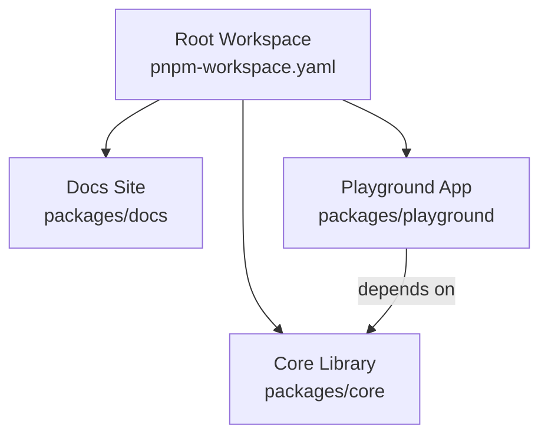
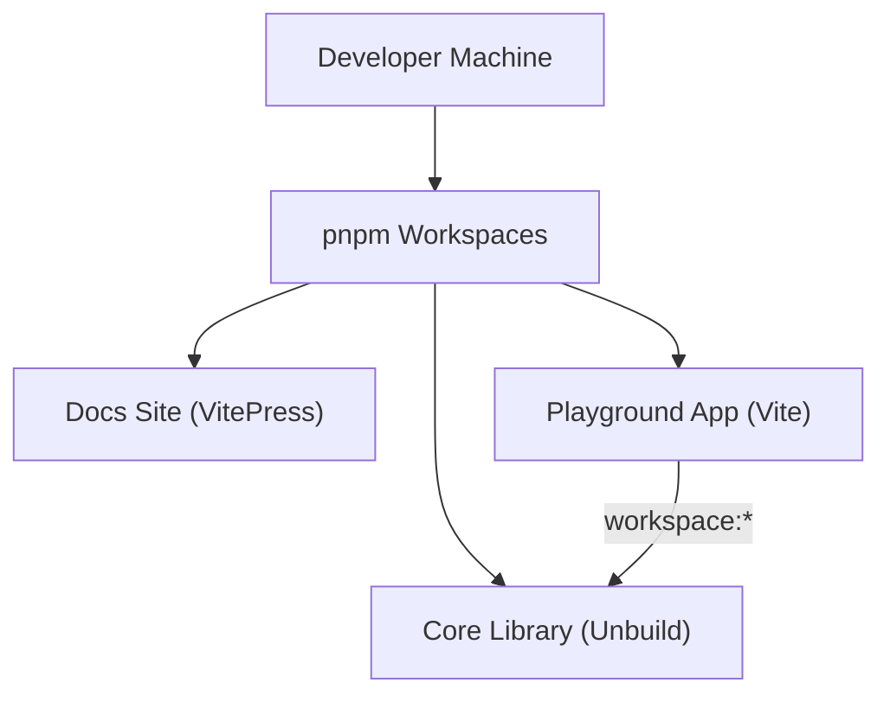
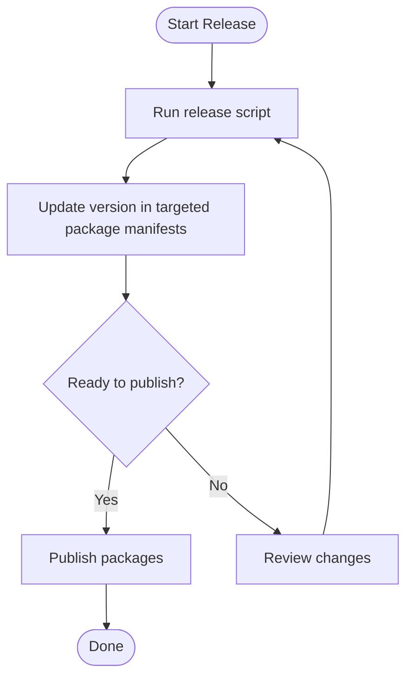
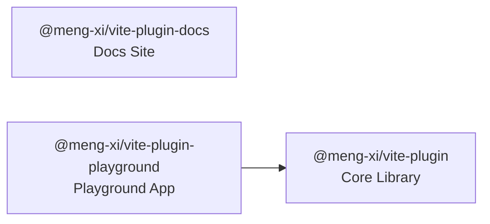

# Contributing

<cite>
**Referenced Files in This Document**
- [package.json](file://package.json)
- [pnpm-workspace.yaml](file://pnpm-workspace.yaml)
- [eslint.config.js](file://eslint.config.js)
- [.prettierrc](file://.prettierrc)
- [bump.config.ts](file://bump.config.ts)
- [packages/core/build.config.ts](file://packages/core/build.config.ts)
- [packages/core/package.json](file://packages/core/package.json)
- [packages/core/tsconfig.json](file://packages/core/tsconfig.json)
- [tsconfig.json](file://tsconfig.json)
- [packages/core/src/index.ts](file://packages/core/src/index.ts)
- [packages/docs/package.json](file://packages/docs/package.json)
- [packages/playground/package.json](file://packages/playground/package.json)
</cite>

## Table of Contents
1. [Introduction](#introduction)
2. [Project Structure](#project-structure)
3. [Core Components](#core-components)
4. [Architecture Overview](#architecture-overview)
5. [Development Setup](#development-setup)
6. [Code Standards](#code-stands)
7. [Testing Guidelines](#testing-guidelines)
8. [Release Procedures](#release-procedures)
9. [Contribution Workflow](#contribution-workflow)
10. [Continuous Integration](#continuous-integration)
11. [Dependency Analysis](#dependency-analysis)
12. [Performance Considerations](#performance-considerations)
13. [Troubleshooting Guide](#troubleshooting-guide)
14. [Conclusion](#conclusion)

## Introduction
This document describes how to contribute effectively to the Vite Plugin Ecosystem project. It covers development setup, monorepo structure, build and TypeScript configuration, code quality standards, testing, release procedures, and contribution workflow. The goal is to help contributors make impactful changes quickly while maintaining consistency across the project.

## Project Structure
The repository is a pnpm-managed monorepo containing:
- packages/core: The primary plugin library built with Unbuild and exported via dual CJS/ESM with TypeScript declarations.
- packages/docs: Documentation site powered by VitePress.
- packages/playground: Example app consuming the core package for manual testing.

**Diagram sources**
- [pnpm-workspace.yaml](file://pnpm-workspace.yaml#L1-L2)
- [packages/playground/package.json](file://packages/playground/package.json#L11-L19)

**Section sources**
- [pnpm-workspace.yaml](file://pnpm-workspace.yaml#L1-L2)
- [package.json](file://package.json#L8-L10)

## Core Components
- Core library exports:
  - Common utilities
  - Factory helpers
  - Logger utilities
  - Plugins collection
- Build configuration:
  - Unbuild entries for core modules
  - Dual CJS/ESM output with declarations
  - Minified production builds
- TypeScript configuration:
  - Strict compiler options
  - Bundler module resolution
  - Path aliases for clean imports

Key export surface and build targets are defined in the core package metadata and build config.

**Section sources**
- [packages/core/src/index.ts](file://packages/core/src/index.ts#L1-L8)
- [packages/core/build.config.ts](file://packages/core/build.config.ts#L4-L17)
- [packages/core/package.json](file://packages/core/package.json#L17-L43)

## Architecture Overview
The ecosystem integrates development tooling and documentation:
- Monorepo managed by pnpm workspaces
- Core library built with Unbuild
- Documentation site built with VitePress
- Playground app consumes the core library locally

**Diagram sources**
- [pnpm-workspace.yaml](file://pnpm-workspace.yaml#L1-L2)
- [packages/core/package.json](file://packages/core/package.json#L50-L52)
- [packages/docs/package.json](file://packages/docs/package.json#L7-L11)
- [packages/playground/package.json](file://packages/playground/package.json#L11-L19)

## Development Setup
- Prerequisites
  - Node.js LTS recommended
  - pnpm installed (version is declared at the root)
- Install dependencies
  - Run pnpm install at the repository root
- Workspace scripts
  - Use top-level scripts to run filtered commands per package
  - Examples:
    - Development builds: dev:core, dev:docs, dev:playground
    - Production builds: build:core, build:docs, build:playground
    - Linting: lint, lint:fix
    - Cleaning: clean
- IDE setup
  - Enable ESLint and Prettier integrations
  - Ensure TypeScript project references are recognized

Environment and script definitions are centralized in the root package manifest and pnpm workspace configuration.

**Section sources**
- [package.json](file://package.json#L7-L24)
- [pnpm-workspace.yaml](file://pnpm-workspace.yaml#L1-L2)

## Code Standards
- Formatting
  - Prettier configuration defines formatting rules for consistent style
- Linting
  - ESLint with TypeScript rules and Prettier integration
  - Global ignores exclude generated/dist files and common artifacts
  - Recommended rules include strictness and Prettier enforcement
- Type safety
  - Strict TypeScript compiler options
  - Bundler module resolution for accurate imports

These standards apply across the monorepo and are enforced via CI hooks.

**Section sources**
- [.prettierrc](file://.prettierrc#L1-L17)
- [eslint.config.js](file://eslint.config.js#L7-L77)
- [packages/core/tsconfig.json](file://packages/core/tsconfig.json#L2-L28)
- [tsconfig.json](file://tsconfig.json#L2-L23)

## Testing Guidelines
- Test package
  - A dedicated test package exists under the workspace
  - Top-level scripts target the test filter for running tests and watch mode
- Local testing
  - Use the test scripts to execute unit/integration tests
  - Watch mode supports iterative development
- Playgrounds
  - Use the playground app to manually verify plugin behavior against the core library

Note: Specific test framework configuration is not present in the provided files; follow existing patterns and ensure coverage aligns with new features.

**Section sources**
- [package.json](file://package.json#L18-L19)

## Release Procedures
- Versioning
  - bumpp is configured to bump versions across multiple package manifests
  - Targeted files include root and package manifests for core, docs, and playground
- Release command
  - Use the top-level release script to automate version bumps
- Publishing
  - After version bumps, publish packages to npm as appropriate
  - Ensure dist tags and package visibility match project policy

**Diagram sources**
- [bump.config.ts](file://bump.config.ts#L3-L5)
- [package.json](file://package.json#L20-L20)

**Section sources**
- [bump.config.ts](file://bump.config.ts#L1-L6)
- [package.json](file://package.json#L20-L20)

## Contribution Workflow
- Issue reporting
  - Use GitHub Issues to report bugs or request features
  - Provide reproduction steps and environment details
- Branching and commits
  - Keep commits focused and descriptive
  - Reference related issues in commit messages
- Pull requests
  - Open PRs against the default branch
  - Include a summary of changes and rationale
  - Ensure tests pass and code adheres to style/lint rules
- Code review
  - Reviews focus on correctness, maintainability, and adherence to standards
  - Address feedback promptly and update PR accordingly
- Community standards
  - Be respectful and constructive
  - Follow the project’s licensing and contribution policies

[No sources needed since this section provides general guidance]

## Continuous Integration
- Linting and formatting checks
  - Run lint and lint:fix during CI to enforce style and type rules
- Build verification
  - Verify core library builds and exports
  - Ensure docs and playground builds succeed
- Testing
  - Execute tests via the test filter script in CI
- Release automation
  - Use the release script to bump versions consistently across packages

[No sources needed since this section provides general guidance]

## Dependency Analysis
- Core library
  - Exports multiple entry points for common utilities, factories, logger, and plugins
  - Built with Unbuild and emits both CJS and ESM with TypeScript declarations
- Documentation site
  - Uses VitePress for building and previewing docs
- Playground app
  - Consumes the core library via workspace protocol
  - Provides a real-world environment for manual testing

**Diagram sources**
- [packages/core/package.json](file://packages/core/package.json#L17-L43)
- [packages/playground/package.json](file://packages/playground/package.json#L11-L19)

**Section sources**
- [packages/core/package.json](file://packages/core/package.json#L17-L43)
- [packages/docs/package.json](file://packages/docs/package.json#L7-L11)
- [packages/playground/package.json](file://packages/playground/package.json#L11-L19)

## Performance Considerations
- Prefer minimal re-renders and efficient plugin logic in the core library
- Keep bundle sizes reasonable by avoiding unnecessary dependencies
- Use minification in production builds (enabled in Unbuild configuration)
- Leverage watch mode for rapid iteration during development

[No sources needed since this section provides general guidance]

## Troubleshooting Guide
- Formatting and linting
  - Run lint and lint:fix to resolve common style/type issues
- Build failures
  - Clean node_modules and lockfiles using the provided clean script
  - Reinstall dependencies and rebuild
- Workspace issues
  - Ensure pnpm workspaces are properly configured and packages are linked
- Versioning
  - If version mismatches occur, rerun the release script to synchronize versions

**Section sources**
- [package.json](file://package.json#L21-L24)
- [eslint.config.js](file://eslint.config.js#L7-L77)
- [.prettierrc](file://.prettierrc#L1-L17)

## Conclusion
By following this guide, contributors can set up a productive development environment, adhere to code quality standards, and participate in smooth releases. The monorepo structure, Unbuild-based builds, and shared lint/formatting configurations streamline collaboration and ensure consistent outputs across the ecosystem.