# BasePlugin Architecture

<cite>
**Referenced Files in This Document**
- [BasePlugin/index.ts](file://packages/core/src/factory/plugin/index.ts)
- [BasePlugin/types.ts](file://packages/core/src/factory/plugin/types.ts)
- [CopyFilePlugin/index.ts](file://packages/core/src/plugins/copyFile/index.ts)
- [GenerateVersionPlugin/index.ts](file://packages/core/src/plugins/generateVersion/index.ts)
- [InjectIcoPlugin/index.ts](file://packages/core/src/plugins/injectIco/index.ts)
- [Logger/index.ts](file://packages/core/src/logger/index.ts)
- [Validation/index.ts](file://packages/core/src/common/validation.ts)
- [Common/index.ts](file://packages/core/src/common/index.ts)
- [Factory/index.ts](file://packages/core/src/factory/index.ts)
- [Plugins/index.ts](file://packages/core/src/plugins/index.ts)
- [Core/index.ts](file://packages/core/src/index.ts)
- [CopyFilePlugin/types.ts](file://packages/core/src/plugins/copyFile/types.ts)
- [GenerateVersionPlugin/types.ts](file://packages/core/src/plugins/generateVersion/types.ts)
- [InjectIcoPlugin/types.ts](file://packages/core/src/plugins/injectIco/types.ts)
</cite>

## Table of Contents
1. [Introduction](#introduction)
2. [Project Structure](#project-structure)
3. [Core Components](#core-components)
4. [Architecture Overview](#architecture-overview)
5. [Detailed Component Analysis](#detailed-component-analysis)
6. [Dependency Analysis](#dependency-analysis)
7. [Performance Considerations](#performance-considerations)
8. [Troubleshooting Guide](#troubleshooting-guide)
9. [Conclusion](#conclusion)

## Introduction
This document provides comprehensive technical documentation for the BasePlugin abstract class that serves as the foundation for all plugin implementations in the Vite Plugin Ecosystem. The BasePlugin class implements a robust template method pattern to standardize plugin lifecycle management, configuration handling, logging, and error handling while enabling concrete plugin implementations to focus on domain-specific functionality.

The ecosystem consists of three primary plugins built upon BasePlugin:
- CopyFilePlugin: Handles post-build file copying with advanced filtering and logging
- GenerateVersionPlugin: Generates and injects version information during builds
- InjectIcoPlugin: Manages favicon and icon injection with fallback mechanisms

## Project Structure
The Vite Plugin Ecosystem follows a modular architecture organized by functional domains:

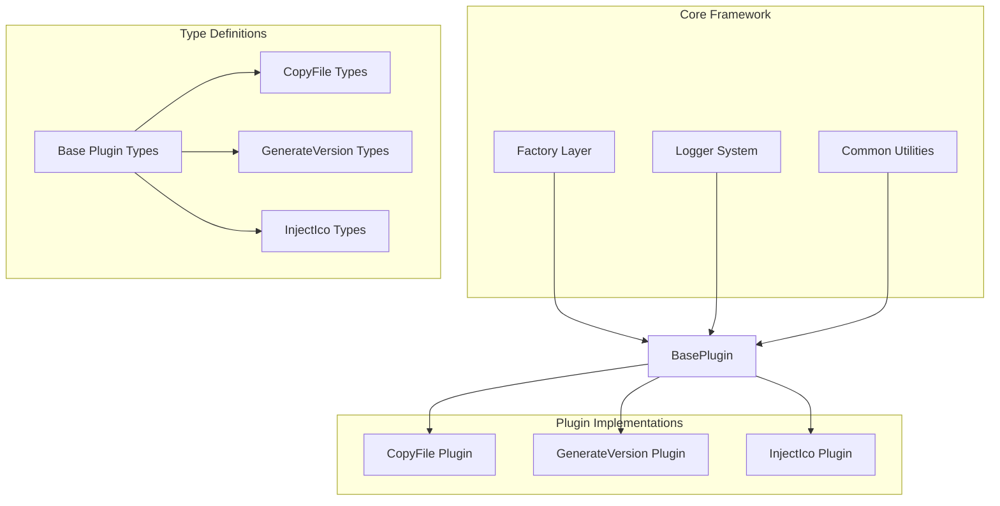

**Diagram sources**
- [Core/index.ts](file://packages/core/src/index.ts#L1-L8)
- [Factory/index.ts](file://packages/core/src/factory/index.ts#L1-L2)
- [Plugins/index.ts](file://packages/core/src/plugins/index.ts#L1-L4)

**Section sources**
- [Core/index.ts](file://packages/core/src/index.ts#L1-L8)
- [Factory/index.ts](file://packages/core/src/factory/index.ts#L1-L2)
- [Plugins/index.ts](file://packages/core/src/plugins/index.ts#L1-L4)

## Core Components
The BasePlugin class provides a comprehensive foundation for all plugin implementations through its template method pattern and standardized lifecycle management.

### BasePlugin Class Architecture
The BasePlugin implements a sophisticated template method pattern that defines the complete plugin lifecycle while delegating specific behaviors to concrete implementations:

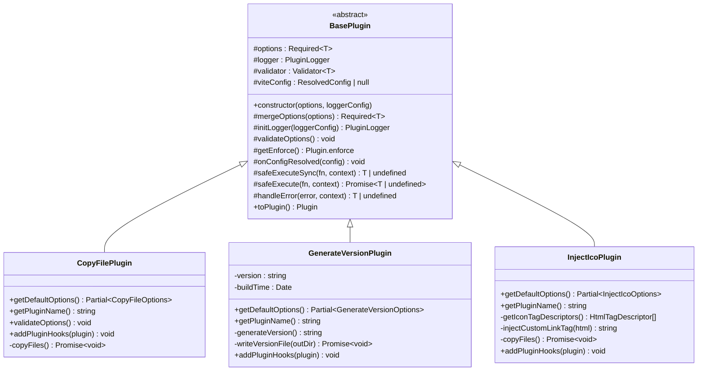

**Diagram sources**
- [BasePlugin/index.ts](file://packages/core/src/factory/plugin/index.ts#L27-L348)
- [CopyFilePlugin/index.ts](file://packages/core/src/plugins/copyFile/index.ts#L13-L87)
- [GenerateVersionPlugin/index.ts](file://packages/core/src/plugins/generateVersion/index.ts#L14-L196)
- [InjectIcoPlugin/index.ts](file://packages/core/src/plugins/injectIco/index.ts#L14-L157)

### Template Method Pattern Implementation
The BasePlugin implements a complete template method that orchestrates the plugin lifecycle:

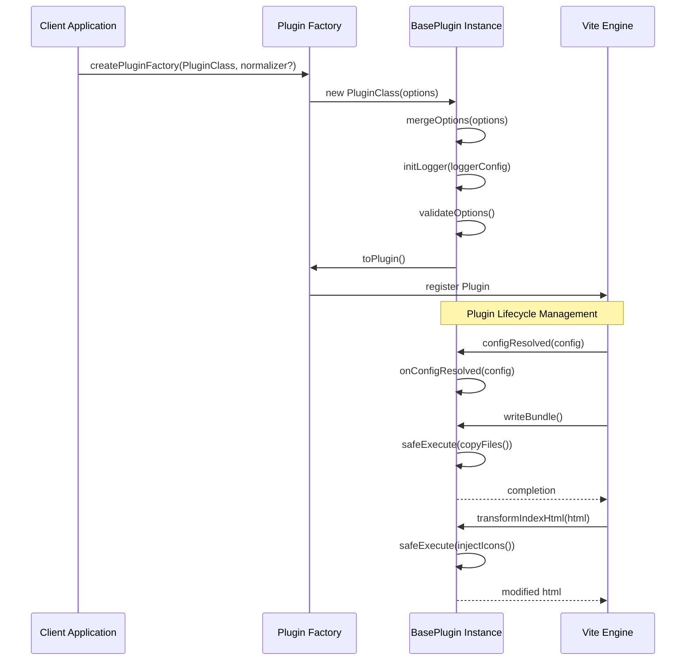

**Diagram sources**
- [BasePlugin/index.ts](file://packages/core/src/factory/plugin/index.ts#L331-L347)
- [CopyFilePlugin/index.ts](file://packages/core/src/plugins/copyFile/index.ts#L82-L86)
- [GenerateVersionPlugin/index.ts](file://packages/core/src/plugins/generateVersion/index.ts#L146-L196)
- [InjectIcoPlugin/index.ts](file://packages/core/src/plugins/injectIco/index.ts#L131-L157)

**Section sources**
- [BasePlugin/index.ts](file://packages/core/src/factory/plugin/index.ts#L27-L348)

## Architecture Overview
The BasePlugin architecture establishes a clean separation of concerns through multiple design patterns working in concert.

### Configuration Management Architecture
The configuration system implements a layered approach with base defaults, plugin-specific defaults, and user overrides:

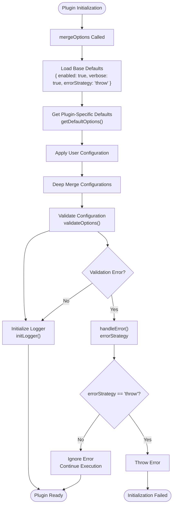

**Diagram sources**
- [BasePlugin/index.ts](file://packages/core/src/factory/plugin/index.ts#L108-L118)
- [BasePlugin/index.ts](file://packages/core/src/factory/plugin/index.ts#L161-L161)
- [BasePlugin/index.ts](file://packages/core/src/factory/plugin/index.ts#L128-L138)

### Error Handling Strategy
The error handling system provides flexible strategies controlled by configuration:

```mermaid
stateDiagram-v2
[*] --> ExecuteOperation
ExecuteOperation --> TryBlock : Attempt Operation
TryBlock --> Success : No Exception
TryBlock --> CatchBlock : Exception Thrown
Success --> [*]
CatchBlock --> CheckStrategy : handleError Called
CheckStrategy --> ThrowDecision{"errorStrategy == 'throw'?"}
CheckStrategy --> LogDecision{"errorStrategy == 'log'?"}
CheckStrategy --> IgnoreDecision{"errorStrategy == 'ignore'?"}
ThrowDecision --> |Yes| LogError["Log Error Message"]
LogDecision --> |Yes| LogError
IgnoreDecision --> |Yes| LogError
LogError --> ReThrow["Re-throw Error"]
LogError --> ReturnUndefined["Return undefined"]
LogError --> ContinueExecution["Continue Execution"]
ReThrow --> [*]
ReturnUndefined --> [*]
ContinueExecution --> [*]
```

**Diagram sources**
- [BasePlugin/index.ts](file://packages/core/src/factory/plugin/index.ts#L283-L311)

**Section sources**
- [BasePlugin/index.ts](file://packages/core/src/factory/plugin/index.ts#L108-L138)
- [BasePlugin/index.ts](file://packages/core/src/factory/plugin/index.ts#L225-L311)

## Detailed Component Analysis

### BasePlugin Lifecycle Management
The BasePlugin manages a comprehensive lifecycle that ensures proper initialization, configuration, and integration with Vite's plugin system.

#### Initialization Phase
During construction, BasePlugin performs critical setup operations in a specific order:

1. **Configuration Merging**: Combines base defaults, plugin-specific defaults, and user configuration
2. **Logger Initialization**: Creates a plugin-specific logger instance
3. **Validator Setup**: Initializes configuration validation capabilities
4. **Configuration Validation**: Executes plugin-specific validation logic

#### Runtime Lifecycle Hooks
The plugin integrates with Vite through well-defined hook points:

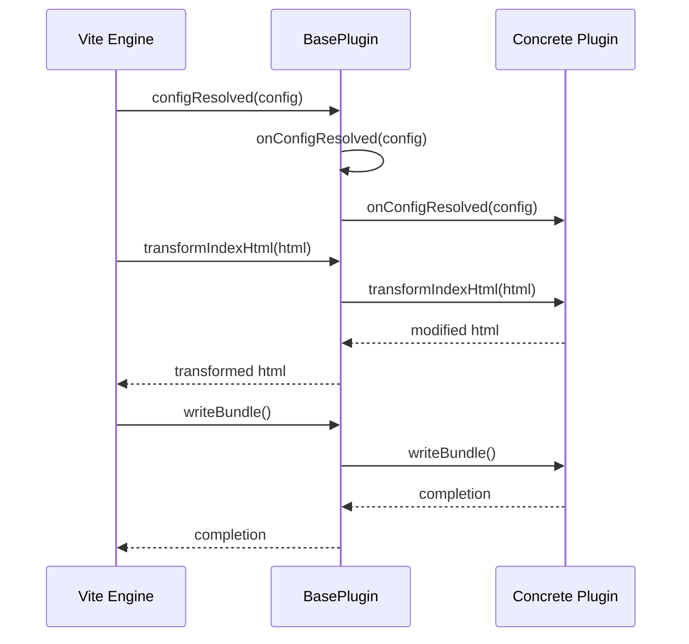

**Diagram sources**
- [BasePlugin/index.ts](file://packages/core/src/factory/plugin/index.ts#L336-L340)
- [BasePlugin/index.ts](file://packages/core/src/factory/plugin/index.ts#L190-L193)

**Section sources**
- [BasePlugin/index.ts](file://packages/core/src/factory/plugin/index.ts#L69-L81)
- [BasePlugin/index.ts](file://packages/core/src/factory/plugin/index.ts#L190-L193)

### Configuration Handling Methods

#### mergeOptions Implementation
The mergeOptions method implements a three-layer configuration strategy:

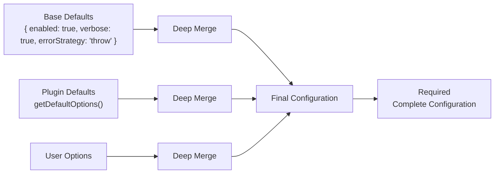

**Diagram sources**
- [BasePlugin/index.ts](file://packages/core/src/factory/plugin/index.ts#L108-L118)

#### getDefaultOptions Pattern
Each concrete plugin must implement getDefaultOptions to provide plugin-specific defaults:

**Section sources**
- [BasePlugin/index.ts](file://packages/core/src/factory/plugin/index.ts#L108-L118)
- [CopyFilePlugin/index.ts](file://packages/core/src/plugins/copyFile/index.ts#L14-L20)
- [GenerateVersionPlugin/index.ts](file://packages/core/src/plugins/generateVersion/index.ts#L25-L37)
- [InjectIcoPlugin/index.ts](file://packages/core/src/plugins/injectIco/index.ts#L15-L19)

### Logging System Integration
The BasePlugin integrates with a centralized logging system that provides structured, plugin-specific logging capabilities.

#### Logger Initialization Process
The logging system uses a singleton pattern with plugin-specific configuration:

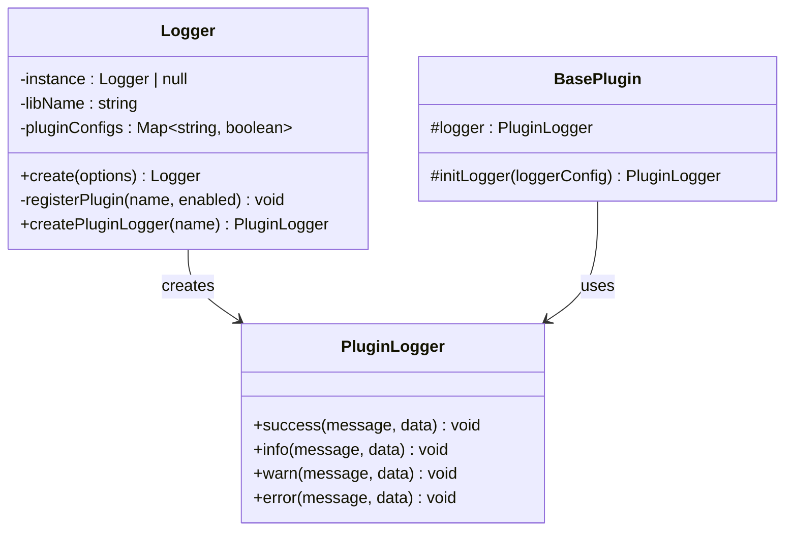

**Diagram sources**
- [Logger/index.ts](file://packages/core/src/logger/index.ts#L7-L146)
- [BasePlugin/index.ts](file://packages/core/src/factory/plugin/index.ts#L128-L138)

**Section sources**
- [Logger/index.ts](file://packages/core/src/logger/index.ts#L76-L145)
- [BasePlugin/index.ts](file://packages/core/src/factory/plugin/index.ts#L128-L138)

### Error Handling Strategies
The BasePlugin provides comprehensive error handling through the safeExecute pattern:

#### Safe Execution Pattern
The safeExecute methods wrap operations with automatic error handling:

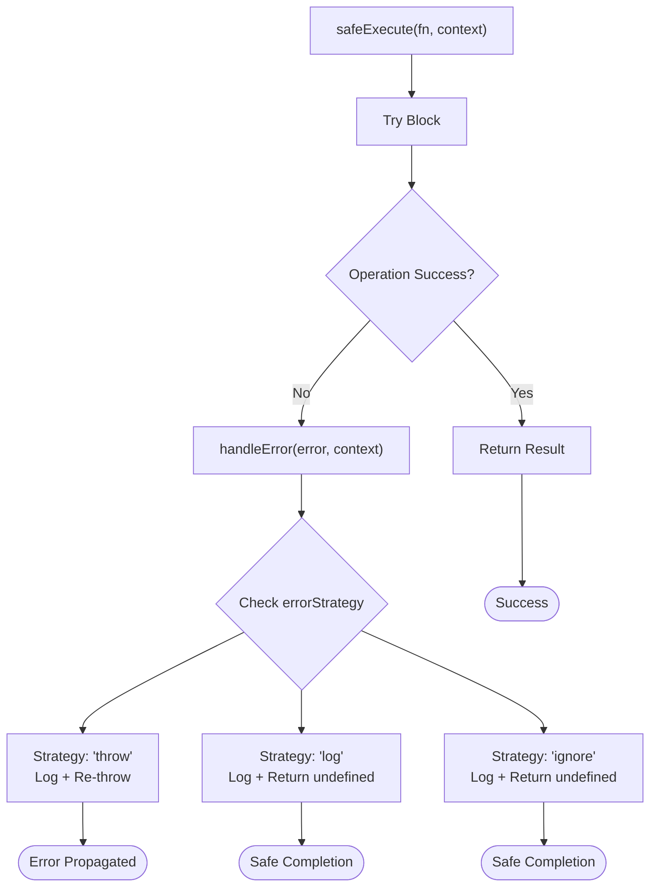

**Diagram sources**
- [BasePlugin/index.ts](file://packages/core/src/factory/plugin/index.ts#L253-L259)
- [BasePlugin/index.ts](file://packages/core/src/factory/plugin/index.ts#L283-L311)

**Section sources**
- [BasePlugin/index.ts](file://packages/core/src/factory/plugin/index.ts#L225-L311)

### Plugin-Specific Implementations

#### CopyFilePlugin Analysis
The CopyFilePlugin demonstrates advanced file operation capabilities with comprehensive error handling and logging:

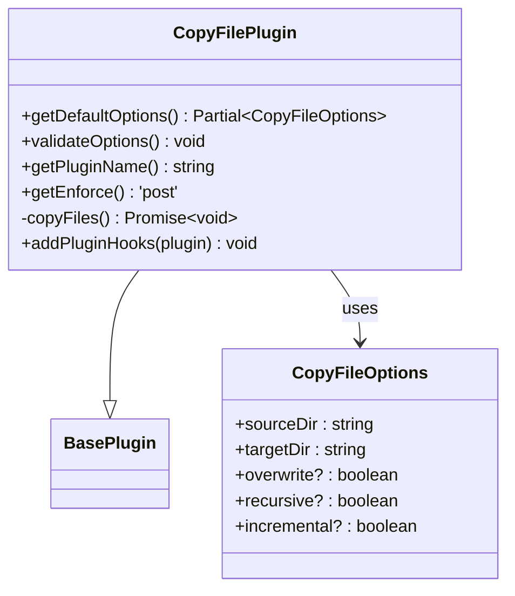

**Diagram sources**
- [CopyFilePlugin/index.ts](file://packages/core/src/plugins/copyFile/index.ts#L13-L87)
- [CopyFilePlugin/types.ts](file://packages/core/src/plugins/copyFile/types.ts#L8-L43)

#### GenerateVersionPlugin Analysis
The GenerateVersionPlugin showcases complex version generation logic with multiple output strategies:

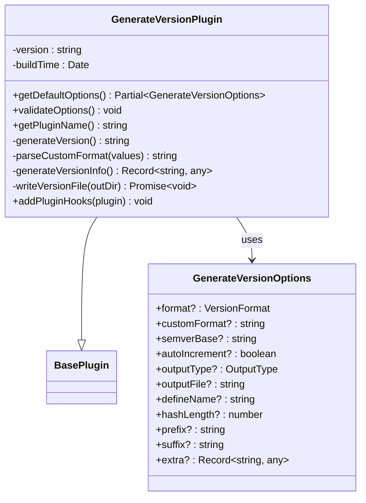

**Diagram sources**
- [GenerateVersionPlugin/index.ts](file://packages/core/src/plugins/generateVersion/index.ts#L14-L196)
- [GenerateVersionPlugin/types.ts](file://packages/core/src/plugins/generateVersion/types.ts#L31-L119)

#### InjectIcoPlugin Analysis
The InjectIcoPlugin demonstrates sophisticated HTML manipulation with fallback mechanisms:

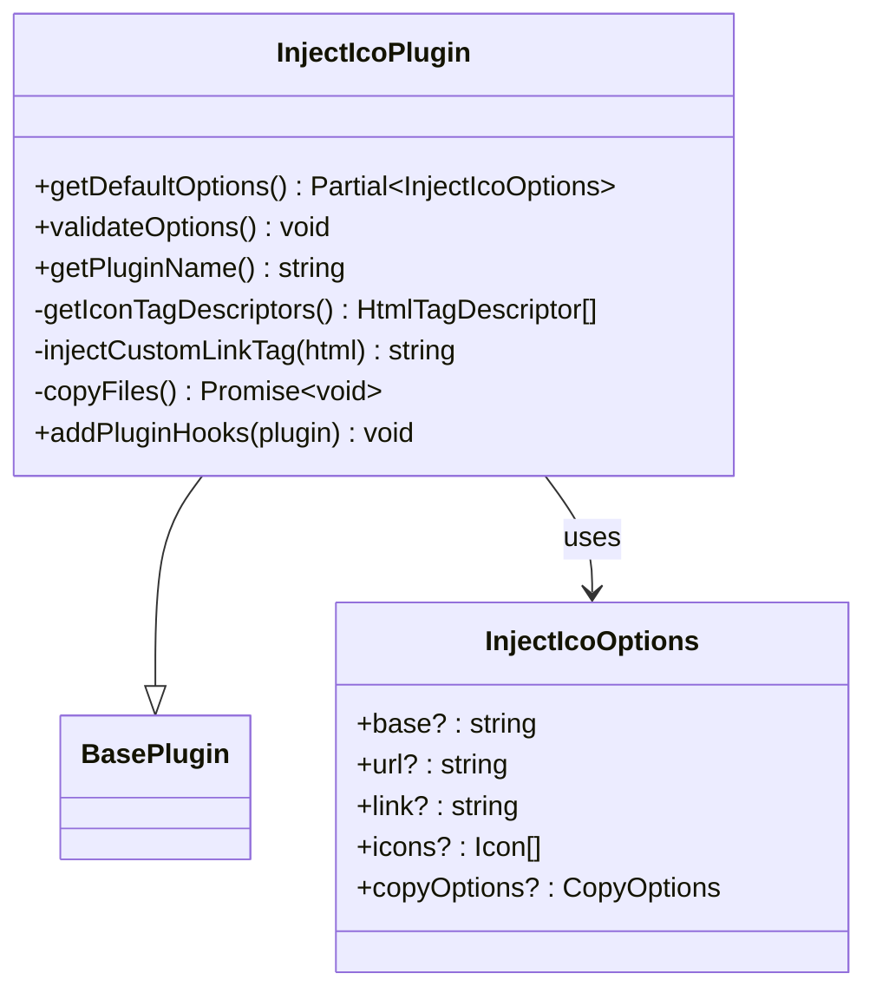

**Diagram sources**
- [InjectIcoPlugin/index.ts](file://packages/core/src/plugins/injectIco/index.ts#L14-L157)
- [InjectIcoPlugin/types.ts](file://packages/core/src/plugins/injectIco/types.ts#L70-L112)

**Section sources**
- [CopyFilePlugin/index.ts](file://packages/core/src/plugins/copyFile/index.ts#L13-L121)
- [GenerateVersionPlugin/index.ts](file://packages/core/src/plugins/generateVersion/index.ts#L14-L257)
- [InjectIcoPlugin/index.ts](file://packages/core/src/plugins/injectIco/index.ts#L14-L195)

## Dependency Analysis
The BasePlugin architecture establishes clear dependency relationships that promote maintainability and extensibility.

### Core Dependencies
The BasePlugin depends on several foundational systems:

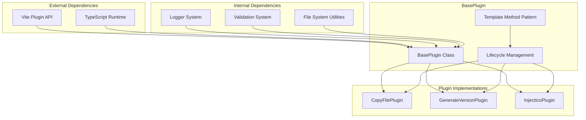

**Diagram sources**
- [BasePlugin/index.ts](file://packages/core/src/factory/plugin/index.ts#L1-L6)
- [Logger/index.ts](file://packages/core/src/logger/index.ts#L1-L2)
- [Validation/index.ts](file://packages/core/src/common/validation.ts#L1-L2)

### Type System Dependencies
The type system ensures compile-time safety across all plugin implementations:

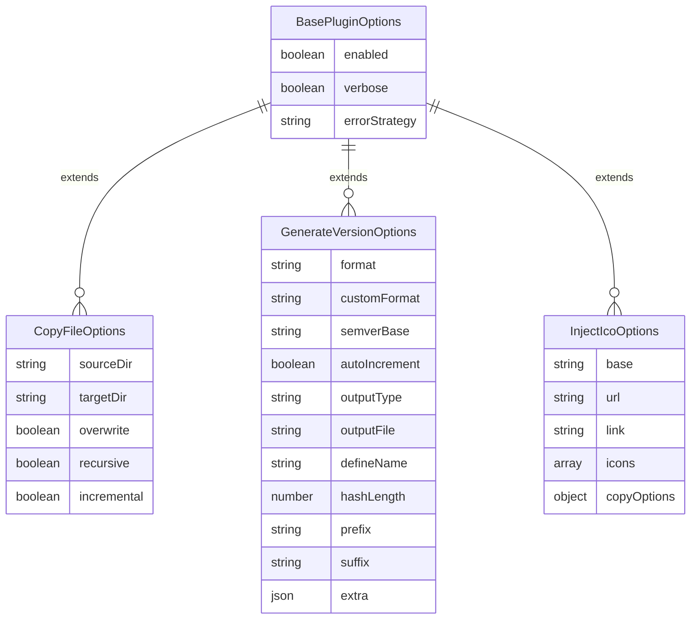

**Diagram sources**
- [BasePlugin/types.ts](file://packages/core/src/factory/plugin/types.ts#L8-L29)
- [CopyFilePlugin/types.ts](file://packages/core/src/plugins/copyFile/types.ts#L8-L43)
- [GenerateVersionPlugin/types.ts](file://packages/core/src/plugins/generateVersion/types.ts#L31-L119)
- [InjectIcoPlugin/types.ts](file://packages/core/src/plugins/injectIco/types.ts#L70-L112)

**Section sources**
- [BasePlugin/index.ts](file://packages/core/src/factory/plugin/index.ts#L1-L6)
- [BasePlugin/types.ts](file://packages/core/src/factory/plugin/types.ts#L1-L46)

## Performance Considerations
The BasePlugin architecture incorporates several performance optimizations and considerations:

### Memory Management
- **Singleton Logger**: Prevents memory leaks through centralized logging
- **Lazy Validation**: Validators are instantiated only when needed
- **Configuration Caching**: Merged configurations are computed once per plugin instance

### Execution Efficiency
- **Early Termination**: Disabled plugins skip unnecessary operations
- **Selective Hook Registration**: Only required hooks are registered
- **Asynchronous Operations**: File operations are properly awaited

### Resource Optimization
- **Minimal Dependencies**: Core plugin requires only essential external dependencies
- **Efficient Logging**: Conditional logging prevents unnecessary console operations
- **Streamlined Validation**: Fluent validator API minimizes validation overhead

## Troubleshooting Guide
Common issues and their resolution strategies when working with BasePlugin implementations:

### Configuration Validation Errors
**Symptoms**: Plugin fails to initialize with validation error messages
**Causes**: Missing required fields or invalid data types
**Solutions**:
1. Verify all required fields are provided in configuration
2. Check data types match expected types
3. Review custom validation logic in getDefaultOptions()

### Logging Issues
**Symptoms**: Missing or excessive log output
**Causes**: Incorrect logger configuration or disabled logging
**Solutions**:
1. Check verbose flag in plugin configuration
2. Verify logger initialization parameters
3. Confirm plugin-specific logging settings

### Error Strategy Confusion
**Symptoms**: Unexpected behavior during error conditions
**Causes**: Misunderstanding of errorStrategy options
**Solutions**:
1. Review errorStrategy documentation
2. Test different error handling approaches
3. Implement proper error recovery mechanisms

**Section sources**
- [BasePlugin/index.ts](file://packages/core/src/factory/plugin/index.ts#L283-L311)
- [Logger/index.ts](file://packages/core/src/logger/index.ts#L105-L107)

## Conclusion
The BasePlugin abstract class provides a robust foundation for the Vite Plugin Ecosystem through its implementation of the template method pattern, comprehensive lifecycle management, and standardized error handling. The architecture successfully balances flexibility with consistency, allowing developers to create specialized plugins while maintaining ecosystem coherence.

Key architectural strengths include:
- **Template Method Pattern**: Ensures consistent plugin lifecycle across all implementations
- **Configuration Management**: Provides flexible, layered configuration with strong typing
- **Error Handling**: Offers multiple strategies for handling operational failures
- **Logging Integration**: Centralized logging system with plugin-specific isolation
- **Extensibility**: Clean separation of concerns enables easy plugin development

The three concrete implementations (CopyFilePlugin, GenerateVersionPlugin, InjectIcoPlugin) demonstrate the effectiveness of this architectural approach, each leveraging the BasePlugin foundation to deliver specialized functionality while maintaining consistency with the overall ecosystem design.