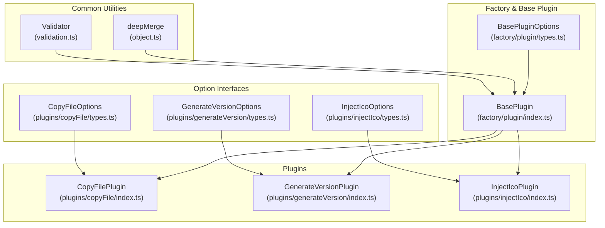
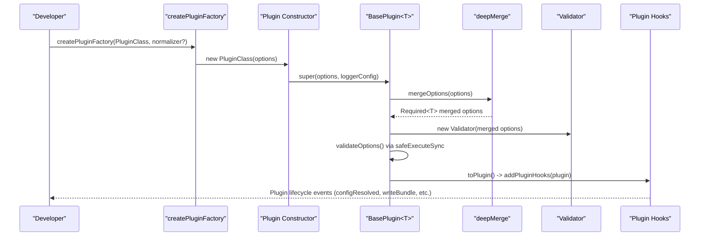
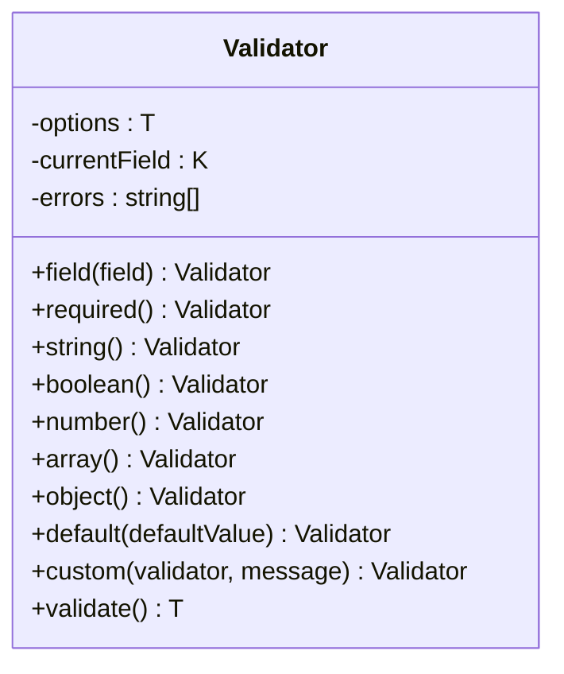
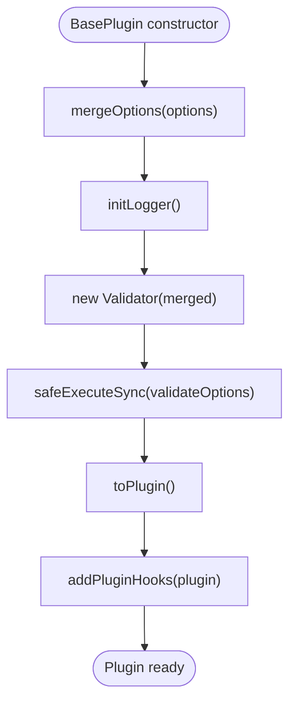
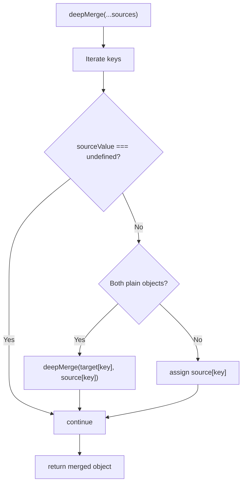
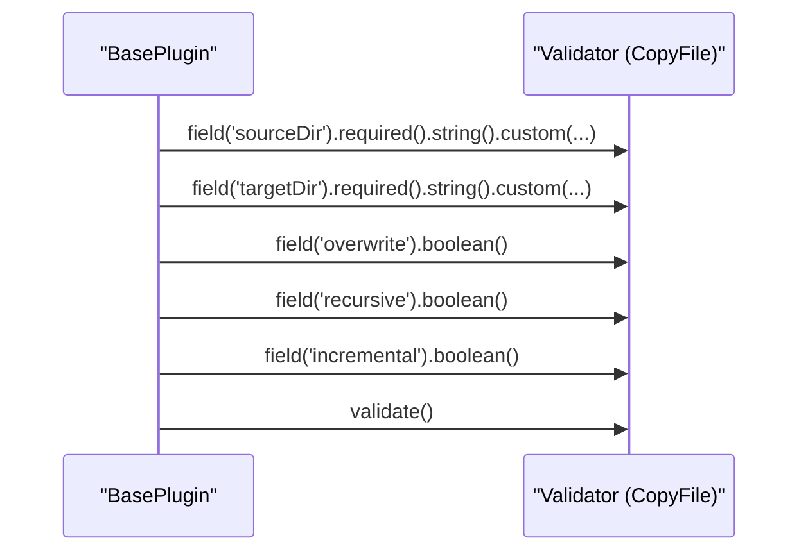
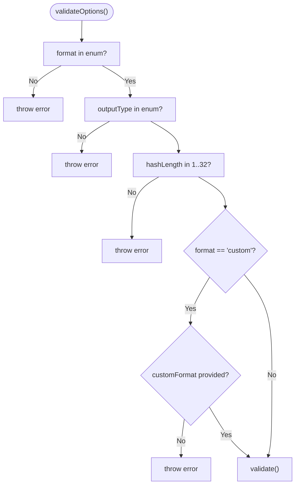
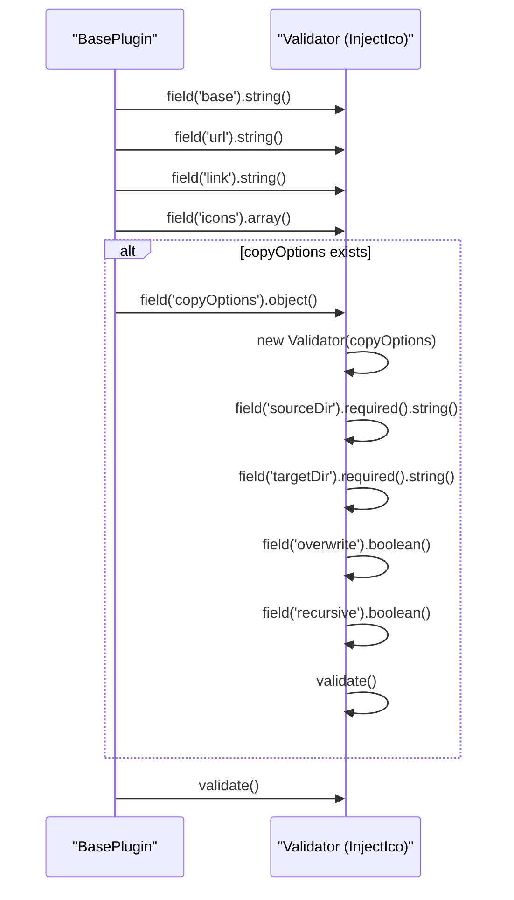
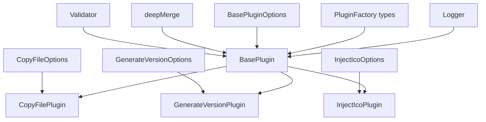

# Configuration Validation System

<cite>
**Referenced Files in This Document**
- [validation.ts](file://packages/core/src/common/validation.ts)
- [object.ts](file://packages/core/src/common/object.ts)
- [index.ts](file://packages/core/src/factory/plugin/index.ts)
- [types.ts](file://packages/core/src/factory/plugin/types.ts)
- [copyFile/types.ts](file://packages/core/src/plugins/copyFile/types.ts)
- [generateVersion/types.ts](file://packages/core/src/plugins/generateVersion/types.ts)
- [injectIco/types.ts](file://packages/core/src/plugins/injectIco/types.ts)
- [copyFile/index.ts](file://packages/core/src/plugins/copyFile/index.ts)
- [generateVersion/index.ts](file://packages/core/src/plugins/generateVersion/index.ts)
- [injectIco/index.ts](file://packages/core/src/plugins/injectIco/index.ts)
- [logger/index.ts](file://packages/core/src/logger/index.ts)
- [index.ts](file://packages/core/src/index.ts)
- [package.json](file://packages/core/package.json)
</cite>

## Table of Contents
1. [Introduction](#introduction)
2. [Project Structure](#project-structure)
3. [Core Components](#core-components)
4. [Architecture Overview](#architecture-overview)
5. [Detailed Component Analysis](#detailed-component-analysis)
6. [Dependency Analysis](#dependency-analysis)
7. [Performance Considerations](#performance-considerations)
8. [Troubleshooting Guide](#troubleshooting-guide)
9. [Conclusion](#conclusion)

## Introduction
This document explains the configuration validation system that ensures type-safe plugin configurations throughout the Vite Plugin Ecosystem. It covers the Validator class implementation, its integration with BasePlugin for automatic configuration validation, and the deepMerge utility for configuration merging. It documents validation patterns (required vs optional fields, type checking, default value handling), the BasePluginOptions interface, and how it defines the core configuration structure shared by all plugins. Examples demonstrate custom validation logic, error handling strategies, and the relationship between configuration validation and plugin lifecycle. Finally, it emphasizes the importance of type safety in plugin development and how the validation system prevents runtime errors through compile-time checks.

## Project Structure
The validation system spans three primary areas:
- Common utilities: Validator and deepMerge
- Factory and base plugin: BasePlugin orchestrating validation and lifecycle
- Plugin implementations: Concrete plugins extending BasePlugin with their own option interfaces and validation logic

**Diagram sources**
- [validation.ts](file://packages/core/src/common/validation.ts#L1-L203)
- [object.ts](file://packages/core/src/common/object.ts#L1-L67)
- [index.ts](file://packages/core/src/factory/plugin/index.ts#L1-L386)
- [types.ts](file://packages/core/src/factory/plugin/types.ts#L1-L46)
- [copyFile/index.ts](file://packages/core/src/plugins/copyFile/index.ts#L1-L121)
- [generateVersion/index.ts](file://packages/core/src/plugins/generateVersion/index.ts#L1-L257)
- [injectIco/index.ts](file://packages/core/src/plugins/injectIco/index.ts#L1-L195)
- [copyFile/types.ts](file://packages/core/src/plugins/copyFile/types.ts#L1-L44)
- [generateVersion/types.ts](file://packages/core/src/plugins/generateVersion/types.ts#L1-L120)
- [injectIco/types.ts](file://packages/core/src/plugins/injectIco/types.ts#L1-L113)

**Section sources**
- [index.ts](file://packages/core/src/index.ts#L1-L8)
- [package.json](file://packages/core/package.json#L1-L73)

## Core Components
- Validator: Fluent API for validating plugin options with required, type, default, and custom validators. It collects errors and throws upon validation failure.
- deepMerge: Deep merges multiple source objects, skipping undefined values and replacing arrays, ensuring defaults propagate correctly.
- BasePlugin<T>: Orchestrates configuration merging, logging initialization, Validator instantiation, and validation execution during construction. Provides safeExecute helpers and errorStrategy handling.
- BasePluginOptions: Shared configuration contract across all plugins (enabled, verbose, errorStrategy).
- Plugin Option Interfaces: Each plugin defines its own options interface extending BasePluginOptions.

Key responsibilities:
- Type-safe configuration: Strongly-typed option interfaces enforce compile-time checks.
- Default value propagation: deepMerge ensures missing values are filled from base and plugin-specific defaults.
- Validation pipeline: Validator runs after merging and before plugin hooks, preventing invalid configurations from reaching runtime.

**Section sources**
- [validation.ts](file://packages/core/src/common/validation.ts#L1-L203)
- [object.ts](file://packages/core/src/common/object.ts#L1-L67)
- [index.ts](file://packages/core/src/factory/plugin/index.ts#L1-L386)
- [types.ts](file://packages/core/src/factory/plugin/types.ts#L1-L46)

## Architecture Overview
The validation system integrates tightly with the plugin lifecycle:

**Diagram sources**
- [index.ts](file://packages/core/src/factory/plugin/index.ts#L69-L81)
- [index.ts](file://packages/core/src/factory/plugin/index.ts#L108-L118)
- [validation.ts](file://packages/core/src/common/validation.ts#L36-L38)
- [index.ts](file://packages/core/src/plugins/copyFile/index.ts#L13-L40)

## Detailed Component Analysis

### Validator Class
The Validator provides a fluent API for validating plugin options:
- Field selection: chain field(name) to set the current field under validation.
- Required fields: required() marks a field as mandatory; validation fails if value is undefined or null.
- Type checking: string(), boolean(), number(), array(), object() validate the type of the current field.
- Defaults: default(value) sets a default only when the field is undefined or null.
- Custom validation: custom((value) => boolean, message) allows domain-specific checks.
- Validation execution: validate() throws if any errors were collected.

Validation patterns:
- Required vs optional: Use required() for mandatory fields; omit for optional.
- Type checking: Prefer type-specific validators to prevent runtime type errors.
- Default handling: Use default() to supply sensible fallbacks; deepMerge handles broader defaults.
- Custom logic: Use custom() for cross-field constraints or complex predicates.

Error handling:
- Errors accumulate during the fluent chain; validate() throws immediately with a combined message.

**Diagram sources**
- [validation.ts](file://packages/core/src/common/validation.ts#L16-L203)

**Section sources**
- [validation.ts](file://packages/core/src/common/validation.ts#L1-L203)

### BasePlugin Integration and Lifecycle
BasePlugin coordinates configuration validation within the plugin lifecycle:
- Construction: mergeOptions() produces Required<T>; Validator validates post-merge options; safeExecuteSync runs validateOptions().
- Logging: Logger singleton creates a plugin-scoped logger respecting verbose flag.
- Lifecycle: toPlugin() registers hooks and delegates to addPluginHooks(); errorStrategy controls safeExecute behavior.

**Diagram sources**
- [index.ts](file://packages/core/src/factory/plugin/index.ts#L69-L81)
- [index.ts](file://packages/core/src/factory/plugin/index.ts#L108-L118)
- [index.ts](file://packages/core/src/factory/plugin/index.ts#L128-L138)
- [index.ts](file://packages/core/src/factory/plugin/index.ts#L331-L347)

**Section sources**
- [index.ts](file://packages/core/src/factory/plugin/index.ts#L1-L386)
- [logger/index.ts](file://packages/core/src/logger/index.ts#L1-L181)

### deepMerge Utility
deepMerge performs a controlled deep merge:
- Skips undefined values to avoid overriding existing defaults.
- Recursively merges plain objects; arrays are replaced (not merged).
- Returns a new object with merged values.

Usage in BasePlugin:
- Merges base defaults, plugin-specific defaults, and user options into Required<T>.

**Diagram sources**
- [object.ts](file://packages/core/src/common/object.ts#L35-L66)

**Section sources**
- [object.ts](file://packages/core/src/common/object.ts#L1-L67)
- [index.ts](file://packages/core/src/factory/plugin/index.ts#L108-L118)

### BasePluginOptions and Shared Contract
BasePluginOptions defines the core configuration structure shared by all plugins:
- enabled?: boolean (default: true)
- verbose?: boolean (default: true)
- errorStrategy?: 'throw' | 'log' | 'ignore' (default: 'throw')

Concrete plugin option interfaces extend BasePluginOptions, adding plugin-specific fields. This ensures consistent behavior across plugins while allowing customization.

**Section sources**
- [types.ts](file://packages/core/src/factory/plugin/types.ts#L1-L46)

### Plugin-Specific Validation Examples

#### CopyFilePlugin
- Extends BasePlugin<CopyFileOptions>.
- Validates required string fields (sourceDir, targetDir) and booleans (overwrite, recursive, incremental).
- Uses custom() to reject empty strings after trimming.

**Diagram sources**
- [copyFile/index.ts](file://packages/core/src/plugins/copyFile/index.ts#L22-L40)
- [copyFile/types.ts](file://packages/core/src/plugins/copyFile/types.ts#L1-L44)

**Section sources**
- [copyFile/index.ts](file://packages/core/src/plugins/copyFile/index.ts#L1-L121)
- [copyFile/types.ts](file://packages/core/src/plugins/copyFile/types.ts#L1-L44)

#### GenerateVersionPlugin
- Extends BasePlugin<GenerateVersionOptions>.
- Uses custom() to constrain format and outputType to predefined enums.
- Enforces numeric range for hashLength.
- Adds a custom constraint: when format is 'custom', customFormat must be provided.

**Diagram sources**
- [generateVersion/index.ts](file://packages/core/src/plugins/generateVersion/index.ts#L39-L54)
- [generateVersion/types.ts](file://packages/core/src/plugins/generateVersion/types.ts#L1-L120)

**Section sources**
- [generateVersion/index.ts](file://packages/core/src/plugins/generateVersion/index.ts#L1-L257)
- [generateVersion/types.ts](file://packages/core/src/plugins/generateVersion/types.ts#L1-L120)

#### InjectIcoPlugin
- Extends BasePlugin<InjectIcoOptions>.
- Validates top-level fields (base, url, link, icons).
- Conditionally validates nested copyOptions by constructing a separate Validator instance.
- Ensures copyOptions is an object when present.

**Diagram sources**
- [injectIco/index.ts](file://packages/core/src/plugins/injectIco/index.ts#L21-L33)
- [injectIco/types.ts](file://packages/core/src/plugins/injectIco/types.ts#L1-L113)

**Section sources**
- [injectIco/index.ts](file://packages/core/src/plugins/injectIco/index.ts#L1-L195)
- [injectIco/types.ts](file://packages/core/src/plugins/injectIco/types.ts#L1-L113)

### Relationship Between Validation and Plugin Lifecycle
- Construction phase: Validation occurs after merging defaults and user options but before hooks are registered. This prevents invalid configurations from entering runtime.
- Runtime phase: safeExecute and safeExecuteSync wrap hook execution according to errorStrategy, ensuring graceful degradation when configured.

**Section sources**
- [index.ts](file://packages/core/src/factory/plugin/index.ts#L69-L81)
- [index.ts](file://packages/core/src/factory/plugin/index.ts#L225-L311)

## Dependency Analysis
The validation system relies on:
- Validator and deepMerge from common utilities
- BasePluginOptions and PluginFactory types from factory plugin types
- Concrete plugin option interfaces
- Logger for error reporting

**Diagram sources**
- [validation.ts](file://packages/core/src/common/validation.ts#L1-L203)
- [object.ts](file://packages/core/src/common/object.ts#L1-L67)
- [index.ts](file://packages/core/src/factory/plugin/index.ts#L1-L386)
- [types.ts](file://packages/core/src/factory/plugin/types.ts#L1-L46)
- [copyFile/types.ts](file://packages/core/src/plugins/copyFile/types.ts#L1-L44)
- [generateVersion/types.ts](file://packages/core/src/plugins/generateVersion/types.ts#L1-L120)
- [injectIco/types.ts](file://packages/core/src/plugins/injectIco/types.ts#L1-L113)
- [logger/index.ts](file://packages/core/src/logger/index.ts#L1-L181)

**Section sources**
- [index.ts](file://packages/core/src/index.ts#L1-L8)
- [package.json](file://packages/core/package.json#L1-L73)

## Performance Considerations
- Validation cost: Fluent validation adds minimal overhead; errors are collected and thrown once at the end.
- deepMerge efficiency: Single-pass iteration with recursion only for plain objects; array replacement avoids expensive deep array merging.
- Error handling: errorStrategy='log'/'ignore' allows continued execution at the cost of potential degraded behavior; 'throw' ensures early failure.

## Troubleshooting Guide
Common validation issues and resolutions:
- Missing required fields: Ensure all required fields are provided in the plugin options. Use Validator.required() to catch missing values early.
- Incorrect types: Verify field types match expectations (string, boolean, number, array, object). Use appropriate type validators to prevent runtime errors.
- Custom constraints: Implement domain-specific checks with Validator.custom() and throw descriptive errors when conditions fail.
- Nested options: For nested objects (e.g., copyOptions), construct a separate Validator instance scoped to that object to validate structure and types independently.
- Error strategy: Adjust errorStrategy to 'log' or 'ignore' for non-fatal failures; use 'throw' for critical misconfigurations.

**Section sources**
- [validation.ts](file://packages/core/src/common/validation.ts#L195-L201)
- [index.ts](file://packages/core/src/factory/plugin/index.ts#L283-L311)
- [injectIco/index.ts](file://packages/core/src/plugins/injectIco/index.ts#L25-L30)

## Conclusion
The configuration validation system establishes a robust, type-safe foundation for the Vite Plugin Ecosystem. Validator provides a fluent, extensible API for enforcing required fields, types, defaults, and custom rules. BasePlugin integrates validation seamlessly into the plugin lifecycle, leveraging deepMerge to propagate defaults and ensure consistent behavior across plugins. By catching misconfigurations at construction time and offering flexible error handling strategies, the system prevents runtime errors and improves developer experience through compile-time type guarantees.