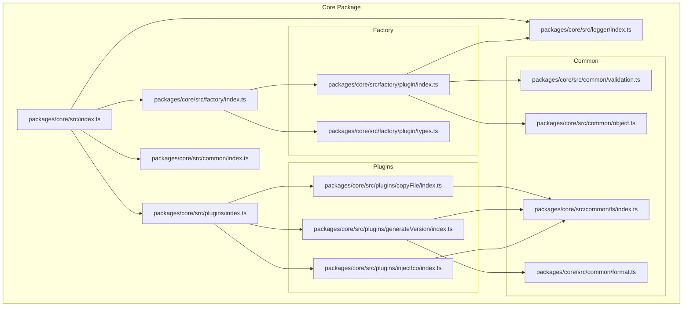
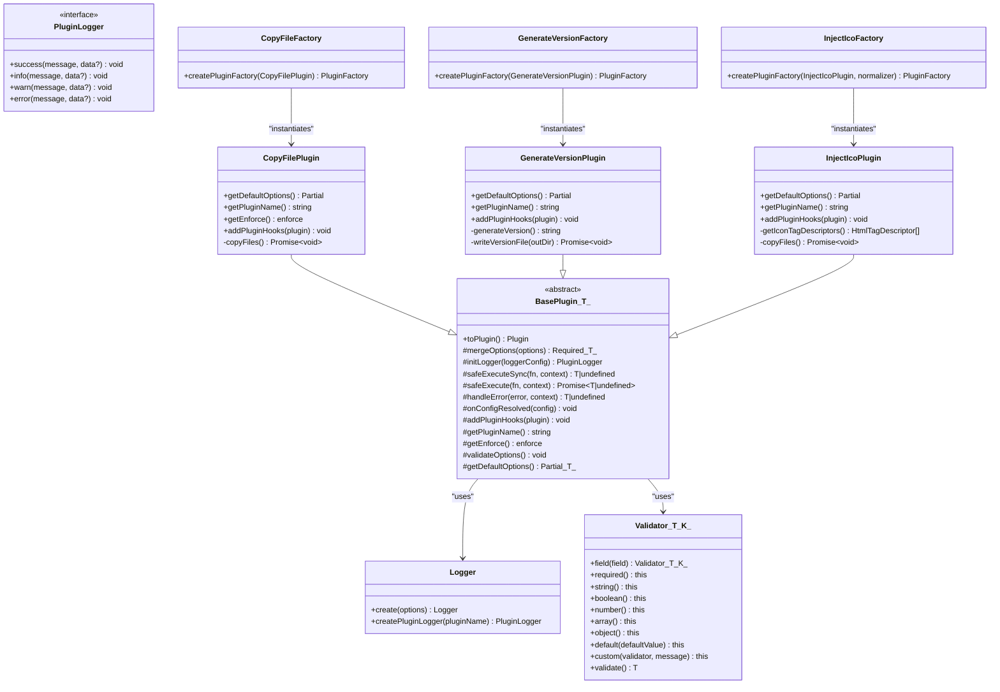
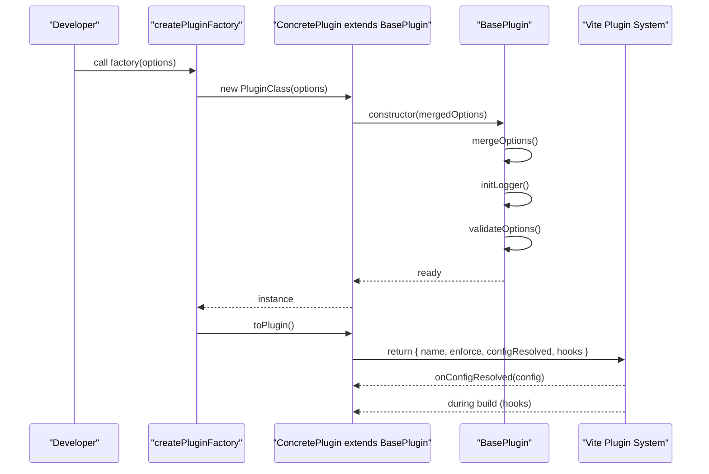
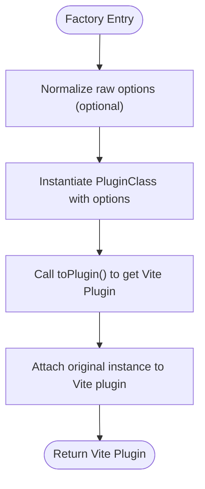
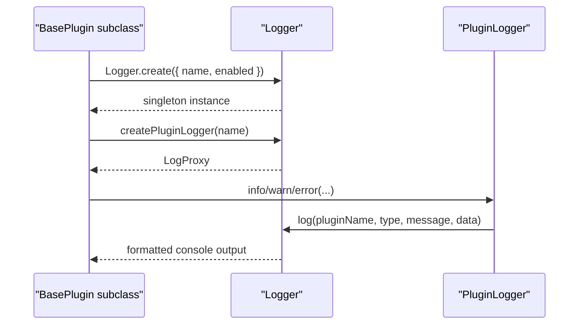
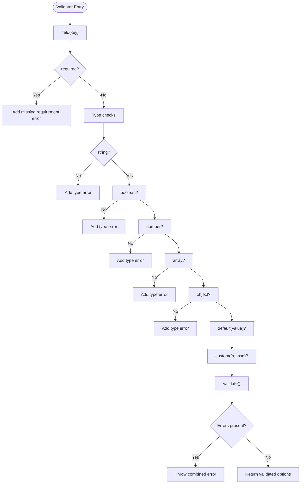
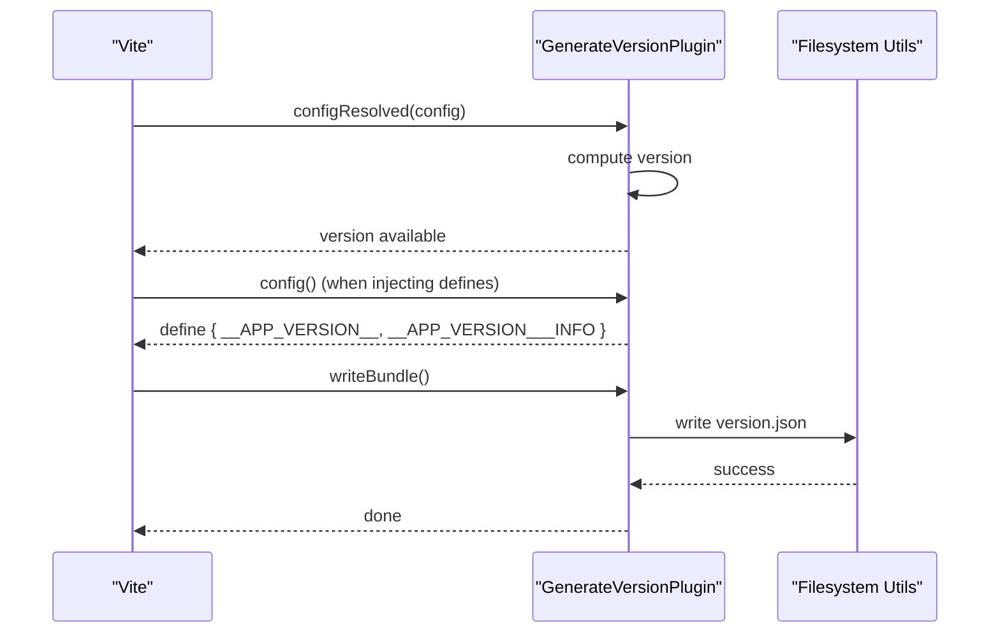
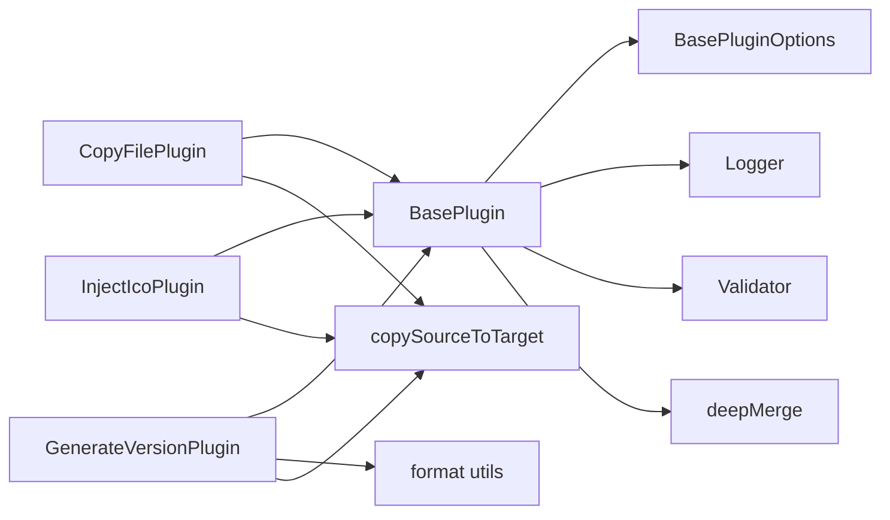

# Core Architecture

<cite>
**Referenced Files in This Document**
- [packages/core/src/index.ts](file://packages/core/src/index.ts)
- [packages/core/src/factory/index.ts](file://packages/core/src/factory/index.ts)
- [packages/core/src/plugins/index.ts](file://packages/core/src/plugins/index.ts)
- [packages/core/src/factory/plugin/index.ts](file://packages/core/src/factory/plugin/index.ts)
- [packages/core/src/factory/plugin/types.ts](file://packages/core/src/factory/plugin/types.ts)
- [packages/core/src/logger/index.ts](file://packages/core/src/logger/index.ts)
- [packages/core/src/logger/types.ts](file://packages/core/src/logger/types.ts)
- [packages/core/src/common/index.ts](file://packages/core/src/common/index.ts)
- [packages/core/src/common/validation.ts](file://packages/core/src/common/validation.ts)
- [packages/core/src/common/object.ts](file://packages/core/src/common/object.ts)
- [packages/core/src/common/format.ts](file://packages/core/src/common/format.ts)
- [packages/core/src/common/fs/index.ts](file://packages/core/src/common/fs/index.ts)
- [packages/core/src/plugins/copyFile/index.ts](file://packages/core/src/plugins/copyFile/index.ts)
- [packages/core/src/plugins/generateVersion/index.ts](file://packages/core/src/plugins/generateVersion/index.ts)
- [packages/core/src/plugins/injectIco/index.ts](file://packages/core/src/plugins/injectIco/index.ts)
</cite>

## Table of Contents
1. [Introduction](#introduction)
2. [Project Structure](#project-structure)
3. [Core Components](#core-components)
4. [Architecture Overview](#architecture-overview)
5. [Detailed Component Analysis](#detailed-component-analysis)
6. [Dependency Analysis](#dependency-analysis)
7. [Performance Considerations](#performance-considerations)
8. [Troubleshooting Guide](#troubleshooting-guide)
9. [Conclusion](#conclusion)

## Introduction
This document describes the core architecture of the Vite Plugin Ecosystem. It focuses on the plugin factory pattern, the BasePlugin abstract class, and the standardized plugin creation mechanism via createPluginFactory(). It also explains the modular monorepo structure separating core functionality, common utilities, and plugin implementations, along with lifecycle management, configuration validation, and logging infrastructure. Finally, it documents the relationships among BasePlugin, specific plugin implementations, and the factory system, and illustrates component interactions, data flow, and Vite integration points using architectural and sequence diagrams.

## Project Structure
The core package organizes functionality into cohesive modules:
- Core exports: index.ts re-exports common utilities, factories, and plugins.
- Factory: plugin factory and types under factory/plugin.
- Logger: centralized logging with per-plugin loggers.
- Common: shared utilities for validation, object manipulation, formatting, and filesystem operations.
- Plugins: individual plugin implementations (copyFile, generateVersion, injectIco).

**Diagram sources**
- [packages/core/src/index.ts](file://packages/core/src/index.ts#L1-L8)
- [packages/core/src/factory/index.ts](file://packages/core/src/factory/index.ts#L1-L2)
- [packages/core/src/plugins/index.ts](file://packages/core/src/plugins/index.ts#L1-L4)
- [packages/core/src/factory/plugin/index.ts](file://packages/core/src/factory/plugin/index.ts#L1-L386)
- [packages/core/src/factory/plugin/types.ts](file://packages/core/src/factory/plugin/types.ts#L1-L46)
- [packages/core/src/logger/index.ts](file://packages/core/src/logger/index.ts#L1-L181)
- [packages/core/src/common/index.ts](file://packages/core/src/common/index.ts#L1-L5)
- [packages/core/src/common/validation.ts](file://packages/core/src/common/validation.ts#L1-L203)
- [packages/core/src/common/object.ts](file://packages/core/src/common/object.ts#L1-L67)
- [packages/core/src/common/format.ts](file://packages/core/src/common/format.ts#L1-L137)
- [packages/core/src/common/fs/index.ts](file://packages/core/src/common/fs/index.ts#L1-L292)
- [packages/core/src/plugins/copyFile/index.ts](file://packages/core/src/plugins/copyFile/index.ts#L1-L121)
- [packages/core/src/plugins/generateVersion/index.ts](file://packages/core/src/plugins/generateVersion/index.ts#L1-L257)
- [packages/core/src/plugins/injectIco/index.ts](file://packages/core/src/plugins/injectIco/index.ts#L1-L195)

**Section sources**
- [packages/core/src/index.ts](file://packages/core/src/index.ts#L1-L8)
- [packages/core/src/factory/index.ts](file://packages/core/src/factory/index.ts#L1-L2)
- [packages/core/src/plugins/index.ts](file://packages/core/src/plugins/index.ts#L1-L4)

## Core Components
This section outlines the foundational building blocks of the ecosystem.

- BasePlugin<T extends BasePluginOptions>: An abstract class that standardizes plugin construction, configuration merging, validation, logging initialization, lifecycle hooks, and error handling. It exposes protected methods for subclasses to override and public toPlugin() to produce a Vite Plugin object.
- createPluginFactory<T, P, R>(): A generic factory that accepts a plugin class constructor and an optional OptionsNormalizer, returning a function that constructs a plugin instance, converts it to a Vite Plugin, and attaches the original instance to the returned object for external access.
- Logger and PluginLogger: A singleton logger with per-plugin loggers, enabling fine-grained control over plugin-specific logging verbosity and filtering.
- Validator<T>: A fluent validation utility enabling chainable checks for required fields, types, defaults, and custom validators.
- Common utilities: deepMerge, format helpers, filesystem operations, and file writing.

Key responsibilities:
- Standardization: BasePlugin ensures consistent configuration, lifecycle, and error handling across plugins.
- Extensibility: Subclasses implement plugin-specific behavior while inheriting shared capabilities.
- Factory-driven creation: createPluginFactory encapsulates instantiation and conversion to Vite’s Plugin interface.
- Logging: Centralized logging with per-plugin isolation and configurable verbosity.
- Validation: Fluent validation reduces boilerplate and improves reliability.

**Section sources**
- [packages/core/src/factory/plugin/index.ts](file://packages/core/src/factory/plugin/index.ts#L27-L348)
- [packages/core/src/factory/plugin/types.ts](file://packages/core/src/factory/plugin/types.ts#L1-L46)
- [packages/core/src/logger/index.ts](file://packages/core/src/logger/index.ts#L7-L146)
- [packages/core/src/common/validation.ts](file://packages/core/src/common/validation.ts#L16-L202)
- [packages/core/src/common/object.ts](file://packages/core/src/common/object.ts#L35-L66)
- [packages/core/src/common/format.ts](file://packages/core/src/common/format.ts#L17-L136)
- [packages/core/src/common/fs/index.ts](file://packages/core/src/common/fs/index.ts#L27-L272)

## Architecture Overview
The architecture follows a layered design:
- Core Layer: BasePlugin, factory, and logging form the foundation.
- Utilities Layer: Common modules provide shared functionality.
- Plugin Layer: Individual plugins extend BasePlugin and integrate with Vite hooks.
- Integration Layer: Each plugin returns a Vite Plugin object conforming to Vite’s Plugin contract.

**Diagram sources**
- [packages/core/src/factory/plugin/index.ts](file://packages/core/src/factory/plugin/index.ts#L27-L348)
- [packages/core/src/logger/index.ts](file://packages/core/src/logger/index.ts#L7-L146)
- [packages/core/src/common/validation.ts](file://packages/core/src/common/validation.ts#L16-L202)
- [packages/core/src/plugins/copyFile/index.ts](file://packages/core/src/plugins/copyFile/index.ts#L13-L121)
- [packages/core/src/plugins/generateVersion/index.ts](file://packages/core/src/plugins/generateVersion/index.ts#L14-L257)
- [packages/core/src/plugins/injectIco/index.ts](file://packages/core/src/plugins/injectIco/index.ts#L14-L195)

## Detailed Component Analysis

### BasePlugin<T> Lifecycle and Error Handling
BasePlugin orchestrates plugin lifecycle and error handling:
- Construction merges user options with defaults, initializes logging and validation, and validates options.
- toPlugin() creates a Vite Plugin with name, enforce, and configResolved hook; delegates plugin-specific hooks to addPluginHooks().
- safeExecute/safeExecuteSync wrap synchronous and asynchronous operations, delegating to handleError according to errorStrategy.
- handleError logs and either throws or ignores errors depending on configuration.

**Diagram sources**
- [packages/core/src/factory/plugin/index.ts](file://packages/core/src/factory/plugin/index.ts#L69-L347)

**Section sources**
- [packages/core/src/factory/plugin/index.ts](file://packages/core/src/factory/plugin/index.ts#L69-L347)

### Factory Pattern: createPluginFactory()
The factory encapsulates:
- Optional OptionsNormalizer to normalize raw inputs (e.g., string to object).
- Instantiation of the plugin class with normalized options.
- Conversion to a Vite Plugin via toPlugin().
- Attaching the original plugin instance to the returned Vite plugin for introspection.

**Diagram sources**
- [packages/core/src/factory/plugin/index.ts](file://packages/core/src/factory/plugin/index.ts#L369-L385)

**Section sources**
- [packages/core/src/factory/plugin/index.ts](file://packages/core/src/factory/plugin/index.ts#L369-L385)
- [packages/core/src/factory/plugin/types.ts](file://packages/core/src/factory/plugin/types.ts#L37-L46)

### Logging Infrastructure
Logger is a singleton managing per-plugin logging configuration and output:
- Logger.create registers plugin configs and returns the singleton instance.
- createPluginLogger returns a PluginLogger bound to a specific plugin name.
- Per-plugin enable/disable and colored output with icons.

**Diagram sources**
- [packages/core/src/logger/index.ts](file://packages/core/src/logger/index.ts#L76-L145)
- [packages/core/src/logger/types.ts](file://packages/core/src/logger/types.ts#L4-L13)

**Section sources**
- [packages/core/src/logger/index.ts](file://packages/core/src/logger/index.ts#L7-L146)
- [packages/core/src/logger/types.ts](file://packages/core/src/logger/types.ts#L1-L14)

### Validation System
Validator provides a fluent API for option validation:
- Chainable methods for required fields, type checks, defaults, and custom validators.
- validate() throws on errors; otherwise returns validated options.

**Diagram sources**
- [packages/core/src/common/validation.ts](file://packages/core/src/common/validation.ts#L45-L201)

**Section sources**
- [packages/core/src/common/validation.ts](file://packages/core/src/common/validation.ts#L16-L202)

### Plugin Implementations and Vite Integration
Each plugin extends BasePlugin and integrates with Vite hooks:
- copyFile: post-enforce, writeBundle hook to copy files with incremental and parallel support.
- generateVersion: configResolved to compute version, optional config hook to inject defines, writeBundle to persist version file.
- injectIco: transformIndexHtml pre-order to inject HtmlTagDescriptor or custom link tag, writeBundle to copy icons.

**Diagram sources**
- [packages/core/src/plugins/generateVersion/index.ts](file://packages/core/src/plugins/generateVersion/index.ts#L146-L196)
- [packages/core/src/common/fs/index.ts](file://packages/core/src/common/fs/index.ts#L261-L272)

**Section sources**
- [packages/core/src/plugins/copyFile/index.ts](file://packages/core/src/plugins/copyFile/index.ts#L58-L86)
- [packages/core/src/plugins/generateVersion/index.ts](file://packages/core/src/plugins/generateVersion/index.ts#L146-L196)
- [packages/core/src/plugins/injectIco/index.ts](file://packages/core/src/plugins/injectIco/index.ts#L131-L157)

## Dependency Analysis
The following diagram shows key dependencies among core components and plugins.

**Diagram sources**
- [packages/core/src/factory/plugin/index.ts](file://packages/core/src/factory/plugin/index.ts#L27-L348)
- [packages/core/src/factory/plugin/types.ts](file://packages/core/src/factory/plugin/types.ts#L8-L29)
- [packages/core/src/logger/index.ts](file://packages/core/src/logger/index.ts#L7-L146)
- [packages/core/src/common/validation.ts](file://packages/core/src/common/validation.ts#L16-L202)
- [packages/core/src/common/object.ts](file://packages/core/src/common/object.ts#L35-L66)
- [packages/core/src/common/format.ts](file://packages/core/src/common/format.ts#L76-L113)
- [packages/core/src/common/fs/index.ts](file://packages/core/src/common/fs/index.ts#L160-L253)
- [packages/core/src/plugins/copyFile/index.ts](file://packages/core/src/plugins/copyFile/index.ts#L13-L121)
- [packages/core/src/plugins/generateVersion/index.ts](file://packages/core/src/plugins/generateVersion/index.ts#L14-L257)
- [packages/core/src/plugins/injectIco/index.ts](file://packages/core/src/plugins/injectIco/index.ts#L14-L195)

**Section sources**
- [packages/core/src/factory/plugin/index.ts](file://packages/core/src/factory/plugin/index.ts#L1-L386)
- [packages/core/src/common/object.ts](file://packages/core/src/common/object.ts#L35-L66)
- [packages/core/src/common/fs/index.ts](file://packages/core/src/common/fs/index.ts#L1-L292)

## Performance Considerations
- Parallel copying: copySourceToTarget uses concurrent workers to improve throughput during file operations.
- Incremental updates: shouldUpdateFile compares modification time and size to avoid unnecessary writes.
- Logging overhead: per-plugin enable/disable minimizes console noise in production builds.
- Error strategy: choosing 'log' or 'ignore' can reduce build interruptions but requires careful monitoring.

[No sources needed since this section provides general guidance]

## Troubleshooting Guide
- Configuration validation failures: Validator throws combined errors; review required fields and types.
- Filesystem errors: checkSourceExists, ensureTargetDir, and copySourceToTarget surface permission and existence issues.
- Logging: adjust verbose flag per plugin via LoggerOptions to increase visibility during development.
- Error strategy: switch errorStrategy to 'log' or 'ignore' to continue builds on non-fatal issues.

**Section sources**
- [packages/core/src/common/validation.ts](file://packages/core/src/common/validation.ts#L195-L201)
- [packages/core/src/common/fs/index.ts](file://packages/core/src/common/fs/index.ts#L27-L58)
- [packages/core/src/factory/plugin/index.ts](file://packages/core/src/factory/plugin/index.ts#L283-L311)
- [packages/core/src/logger/index.ts](file://packages/core/src/logger/index.ts#L76-L89)

## Conclusion
The Vite Plugin Ecosystem leverages a robust architecture centered on BasePlugin, a factory-driven creation model, and a unified logging and validation framework. The modular structure cleanly separates core logic, utilities, and plugin implementations, enabling extensible and maintainable plugin development. By adhering to the Template Method, Factory, Observer-like lifecycle hooks, and Strategy-like error handling, the system balances flexibility and consistency across diverse plugin behaviors while integrating seamlessly with Vite’s build pipeline.