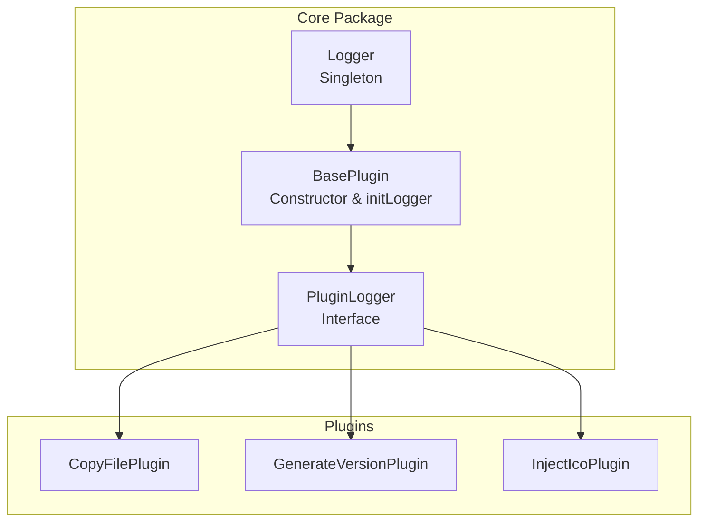
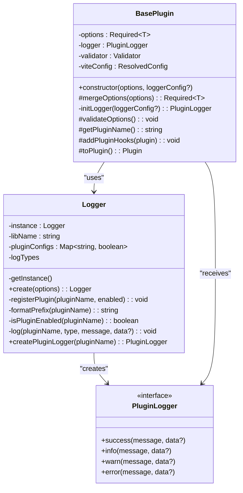
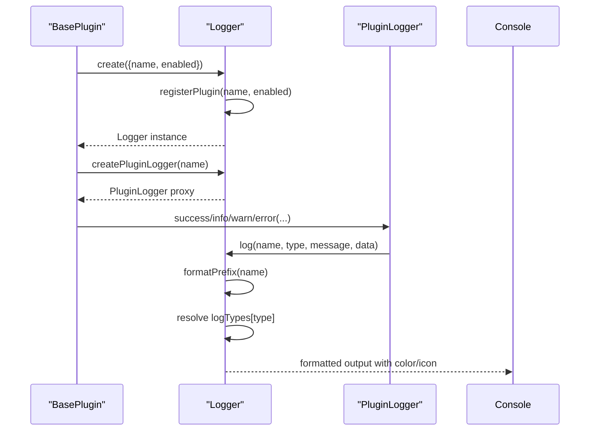
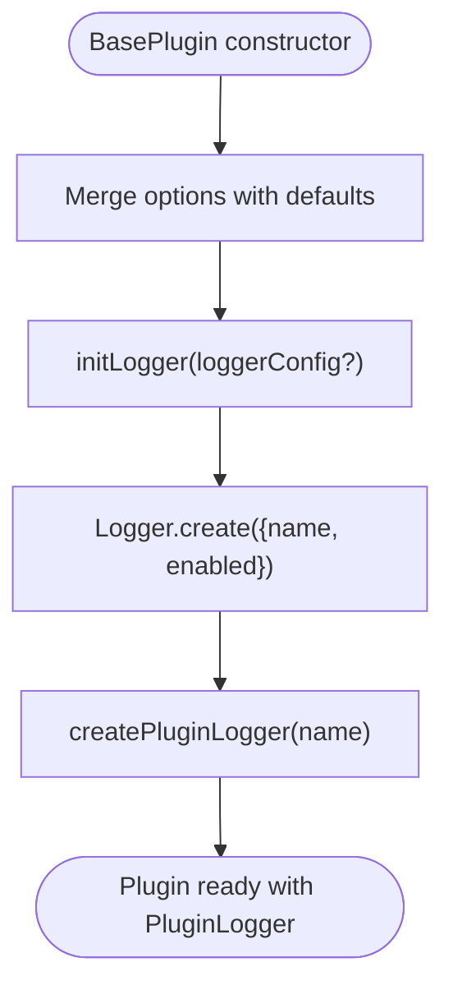
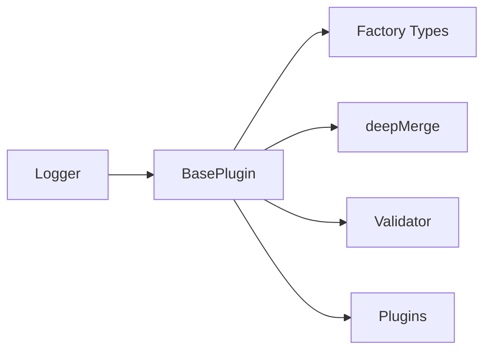

# Logging Infrastructure

<cite>
**Referenced Files in This Document**
- [logger/index.ts](file://packages/core/src/logger/index.ts)
- [logger/types.ts](file://packages/core/src/logger/types.ts)
- [factory/plugin/index.ts](file://packages/core/src/factory/plugin/index.ts)
- [factory/plugin/types.ts](file://packages/core/src/factory/plugin/types.ts)
- [plugins/copyFile/index.ts](file://packages/core/src/plugins/copyFile/index.ts)
- [plugins/generateVersion/index.ts](file://packages/core/src/plugins/generateVersion/index.ts)
- [plugins/injectIco/index.ts](file://packages/core/src/plugins/injectIco/index.ts)
- [common/validation.ts](file://packages/core/src/common/validation.ts)
- [common/object.ts](file://packages/core/src/common/object.ts)
- [plugins/copyFile/types.ts](file://packages/core/src/plugins/copyFile/types.ts)
- [plugins/generateVersion/types.ts](file://packages/core/src/plugins/generateVersion/types.ts)
- [plugins/injectIco/types.ts](file://packages/core/src/plugins/injectIco/types.ts)
- [package.json](file://packages/core/package.json)
- [README.md](file://packages/core/README.md)
</cite>

## Table of Contents
1. [Introduction](#introduction)
2. [Project Structure](#project-structure)
3. [Core Components](#core-components)
4. [Architecture Overview](#architecture-overview)
5. [Detailed Component Analysis](#detailed-component-analysis)
6. [Dependency Analysis](#dependency-analysis)
7. [Performance Considerations](#performance-considerations)
8. [Troubleshooting Guide](#troubleshooting-guide)
9. [Conclusion](#conclusion)

## Introduction
This document explains the logging infrastructure that powers structured logging across all plugins in the Vite Plugin Ecosystem. It covers the Logger singleton pattern, plugin-specific logger creation via the PluginLogger interface, logging levels and color-coded output, configuration options including verbosity control, and how plugins integrate with the logging system through the BasePlugin constructor and the initLogger method. It also provides best practices for logging, collecting debug information, performance monitoring, and error tracking, along with guidance on how plugin names, log contexts, and error strategies work together in development and production environments.

## Project Structure
The logging system is implemented in the core package and consumed by all plugins. The key elements are:
- Logger singleton that manages global logging state and per-plugin configuration
- PluginLogger interface that exposes typed logging methods for each plugin
- BasePlugin that initializes logging during construction and integrates with error handling
- Plugins that use the logger for info, success, warn, and error messages

**Diagram sources**
- [logger/index.ts](file://packages/core/src/logger/index.ts#L7-L146)
- [factory/plugin/index.ts](file://packages/core/src/factory/plugin/index.ts#L27-L138)
- [plugins/copyFile/index.ts](file://packages/core/src/plugins/copyFile/index.ts#L13-L87)
- [plugins/generateVersion/index.ts](file://packages/core/src/plugins/generateVersion/index.ts#L14-L196)
- [plugins/injectIco/index.ts](file://packages/core/src/plugins/injectIco/index.ts#L14-L157)

**Section sources**
- [logger/index.ts](file://packages/core/src/logger/index.ts#L1-L181)
- [factory/plugin/index.ts](file://packages/core/src/factory/plugin/index.ts#L1-L386)
- [package.json](file://packages/core/package.json#L1-L73)

## Core Components
- Logger singleton: Manages a single logging instance, maintains per-plugin enablement flags, defines log types with icons and colors, and formats log prefixes with library name and plugin name.
- PluginLogger interface: Provides four logging methods (success, info, warn, error) bound to a specific plugin context.
- BasePlugin integration: Initializes logging in the constructor by calling Logger.create and then creating a plugin-specific logger proxy via createPluginLogger. Uses the plugin’s verbose flag to control whether logs are emitted.
- Error handling integration: The logger is used by the error handling mechanism to record contextual error messages according to the configured errorStrategy.

Key configuration options:
- BasePluginOptions include enabled, verbose, and errorStrategy, which influence logging behavior and error handling.
- LoggerOptions include name and optional enabled flag, used to register and enable/disable per-plugin logging.

**Section sources**
- [logger/index.ts](file://packages/core/src/logger/index.ts#L7-L146)
- [logger/types.ts](file://packages/core/src/logger/types.ts#L4-L13)
- [factory/plugin/index.ts](file://packages/core/src/factory/plugin/index.ts#L69-L138)
- [factory/plugin/types.ts](file://packages/core/src/factory/plugin/types.ts#L8-L29)

## Architecture Overview
The logging architecture follows a singleton pattern for centralized logging control and a factory-style creation for per-plugin proxies. The BasePlugin constructor orchestrates logger initialization, and plugins use the PluginLogger interface to emit structured logs with consistent formatting and color coding.

**Diagram sources**
- [logger/index.ts](file://packages/core/src/logger/index.ts#L7-L146)
- [factory/plugin/index.ts](file://packages/core/src/factory/plugin/index.ts#L27-L138)

## Detailed Component Analysis

### Logger Singleton Pattern and PluginLogger Interface
- Singleton lifecycle: The Logger class stores a private static instance and exposes a factory method to create and reuse it. Each plugin registers itself with Logger.create, passing its name and enabled flag.
- Per-plugin configuration: A Map tracks whether each plugin’s logs are enabled. By default, plugins are enabled unless explicitly disabled.
- Log types and formatting: Four log types (success, info, warn, error) are defined with associated console methods, emoji icons, ANSI color codes, and reset sequences. The prefix combines the library name and plugin name for clear context.
- PluginLogger proxy: The createPluginLogger method returns an object with four methods bound to the specific plugin name, ensuring all logs carry the correct context.

**Diagram sources**
- [logger/index.ts](file://packages/core/src/logger/index.ts#L76-L145)
- [factory/plugin/index.ts](file://packages/core/src/factory/plugin/index.ts#L128-L138)

**Section sources**
- [logger/index.ts](file://packages/core/src/logger/index.ts#L7-L146)
- [logger/types.ts](file://packages/core/src/logger/types.ts#L4-L13)

### BasePlugin Constructor and initLogger Integration
- Initialization flow: During construction, BasePlugin merges user options with defaults, initializes the logger via initLogger, creates a Validator, validates options, and proceeds to plugin lifecycle.
- Logger creation: initLogger calls Logger.create with the plugin’s name and sets enabled based on the plugin’s verbose option. It then returns a PluginLogger bound to that name.
- Lifecycle hooks: The logger is used in lifecycle events such as configResolved and plugin-specific hooks to emit structured logs.

**Diagram sources**
- [factory/plugin/index.ts](file://packages/core/src/factory/plugin/index.ts#L69-L81)
- [factory/plugin/index.ts](file://packages/core/src/factory/plugin/index.ts#L128-L138)

**Section sources**
- [factory/plugin/index.ts](file://packages/core/src/factory/plugin/index.ts#L69-L138)
- [factory/plugin/types.ts](file://packages/core/src/factory/plugin/types.ts#L8-L29)

### Plugin-Specific Logging Usage Examples
- CopyFilePlugin: Uses logger.info for disabled-state notifications, logger.success for completion summaries, and logs execution metrics.
- GenerateVersionPlugin: Emits info logs for generated version and injected globals, and success logs for file writes.
- InjectIcoPlugin: Logs successes for tag injection, info for skipped operations, and warns when HTML head tags are missing.

These demonstrate consistent use of the PluginLogger interface across plugins for uniform log formatting and context.

**Section sources**
- [plugins/copyFile/index.ts](file://packages/core/src/plugins/copyFile/index.ts#L58-L80)
- [plugins/generateVersion/index.ts](file://packages/core/src/plugins/generateVersion/index.ts#L147-L196)
- [plugins/injectIco/index.ts](file://packages/core/src/plugins/injectIco/index.ts#L45-L90)

### Logging Levels, Color-Coded Output, and Verbosity Control
- Levels: success, info, warn, error. Each level maps to a console method and displays a distinct emoji icon and ANSI color.
- Color and formatting: Each log type includes color and reset codes for terminal output, and a formatted prefix combining library name and plugin name.
- Verbosity control: The plugin’s verbose flag controls whether logs are emitted. When disabled, the logger short-circuits and does not output.

Best practices:
- Use success for completed operations with summary metrics.
- Use info for state changes, configuration, and progress.
- Use warn for recoverable issues or unexpected conditions.
- Use error for failures, integrating with errorStrategy for handling.

**Section sources**
- [logger/index.ts](file://packages/core/src/logger/index.ts#L27-L52)
- [logger/index.ts](file://packages/core/src/logger/index.ts#L116-L130)
- [factory/plugin/index.ts](file://packages/core/src/factory/plugin/index.ts#L128-L138)

### Error Tracking and Strategies
- Error handling: BasePlugin.handleError formats error messages and routes them to logger.error based on errorStrategy.
- Strategies:
  - throw: Records error and rethrows to halt execution.
  - log: Records error and continues.
  - ignore: Records error and continues without throwing.
- Integration: Plugins call safeExecute/safeExecuteSync around operations, ensuring errors are captured and handled consistently.

```mermaid
flowchart TD
Try(["Try operation"]) --> Ok{"Success?"}
Ok --> |Yes| Done(["Return result"])
Ok --> |No| Handle["handleError(error, context)"]
Handle --> Strategy{"errorStrategy"}
Strategy --> |throw| LogThrow["logger.error + throw"]
Strategy --> |log/ignore| LogContinue["logger.error + return undefined"]
```

**Diagram sources**
- [factory/plugin/index.ts](file://packages/core/src/factory/plugin/index.ts#L225-L311)

**Section sources**
- [factory/plugin/index.ts](file://packages/core/src/factory/plugin/index.ts#L225-L311)

### Relationship Between Plugin Names, Log Contexts, and Error Tracking
- Plugin name: Provided by getPluginName and used as the log context prefix. This ensures logs are clearly attributed to a specific plugin.
- Log context: The prefix includes both library name and plugin name, enabling quick filtering and correlation.
- Error tracking: Error messages include the context string passed to safeExecute/safeExecuteSync, making it easy to trace where failures occurred.

**Section sources**
- [logger/index.ts](file://packages/core/src/logger/index.ts#L96-L98)
- [factory/plugin/index.ts](file://packages/core/src/factory/plugin/index.ts#L190-L193)
- [factory/plugin/index.ts](file://packages/core/src/factory/plugin/index.ts#L225-L311)

### Development vs Production Environments and Configurable Verbosity
- Development: Enable verbose to receive detailed logs for debugging. Use warn and error to surface issues early.
- Production: Disable verbose to minimize log volume. Keep errorStrategy set to throw or log depending on desired failure behavior.
- Configuration: BasePluginOptions provide enabled, verbose, and errorStrategy. LoggerOptions allow overriding per-plugin enablement.

**Section sources**
- [factory/plugin/types.ts](file://packages/core/src/factory/plugin/types.ts#L8-L29)
- [logger/types.ts](file://packages/core/src/logger/types.ts#L4-L13)
- [README.md](file://packages/core/README.md#L70-L106)

## Dependency Analysis
The logging system depends on:
- Factory plugin types and BasePlugin for configuration merging and logger initialization
- Common utilities for deep merging and validation
- Plugins for consuming the PluginLogger interface

**Diagram sources**
- [logger/index.ts](file://packages/core/src/logger/index.ts#L1-L181)
- [factory/plugin/index.ts](file://packages/core/src/factory/plugin/index.ts#L1-L386)
- [common/object.ts](file://packages/core/src/common/object.ts#L35-L66)
- [common/validation.ts](file://packages/core/src/common/validation.ts#L16-L202)

**Section sources**
- [logger/index.ts](file://packages/core/src/logger/index.ts#L1-L181)
- [factory/plugin/index.ts](file://packages/core/src/factory/plugin/index.ts#L1-L386)
- [common/object.ts](file://packages/core/src/common/object.ts#L35-L66)
- [common/validation.ts](file://packages/core/src/common/validation.ts#L16-L202)

## Performance Considerations
- Minimal overhead: Logger checks plugin enablement and formats output once per log call. Console methods are invoked directly with precomputed prefixes and colors.
- Avoid excessive logging: In production, disable verbose to reduce I/O and improve build speed.
- Batch operations: When performing file operations, prefer summarizing logs (e.g., total copied/skipped files) rather than per-item logs to minimize output volume.

## Troubleshooting Guide
Common scenarios and resolutions:
- No logs appear in production: Verify verbose is enabled in BasePluginOptions and that the plugin’s enabled flag is true.
- Confusing log attribution: Ensure getPluginName returns a unique and descriptive name; logs are prefixed with library name and plugin name.
- Excessive logs: Set verbose to false or filter logs at the terminal/console level.
- Silent failures: Set errorStrategy to throw or log to ensure errors are recorded and surfaced appropriately.

**Section sources**
- [factory/plugin/index.ts](file://packages/core/src/factory/plugin/index.ts#L128-L138)
- [logger/index.ts](file://packages/core/src/logger/index.ts#L116-L130)
- [factory/plugin/index.ts](file://packages/core/src/factory/plugin/index.ts#L283-L311)

## Conclusion
The logging infrastructure provides a robust, consistent, and configurable foundation for structured logging across all plugins. The Logger singleton centralizes control while the PluginLogger interface ensures each plugin receives a context-aware logging proxy. Combined with BasePlugin’s initialization and error handling mechanisms, developers can instrument plugins effectively for both development and production, using verbosity control and error strategies to tailor the logging experience to their needs.