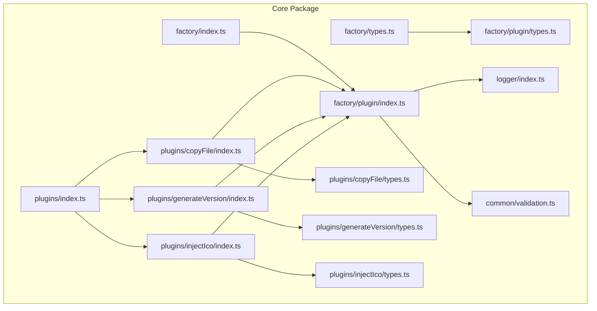
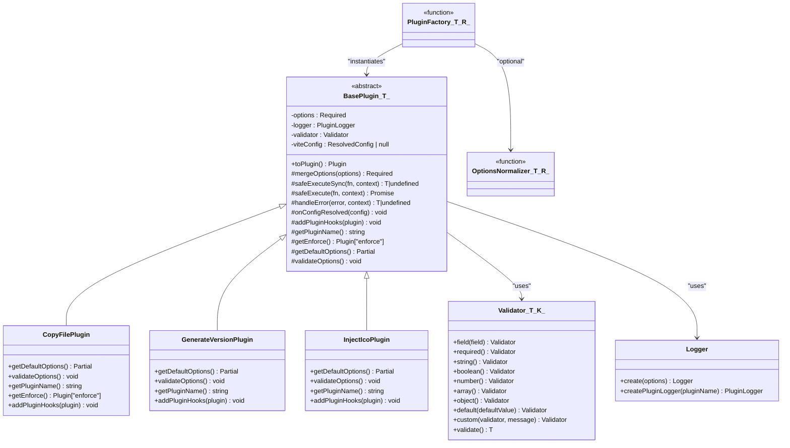
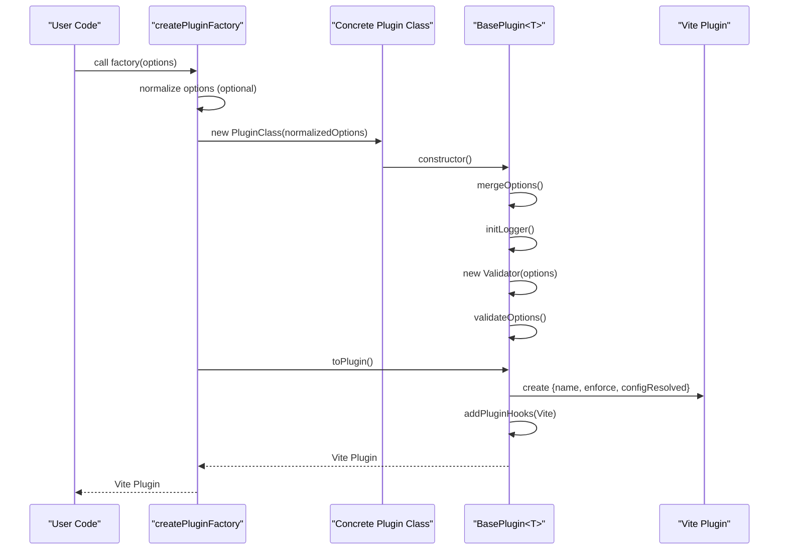
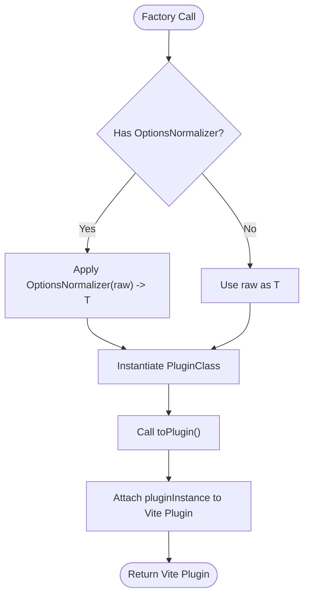
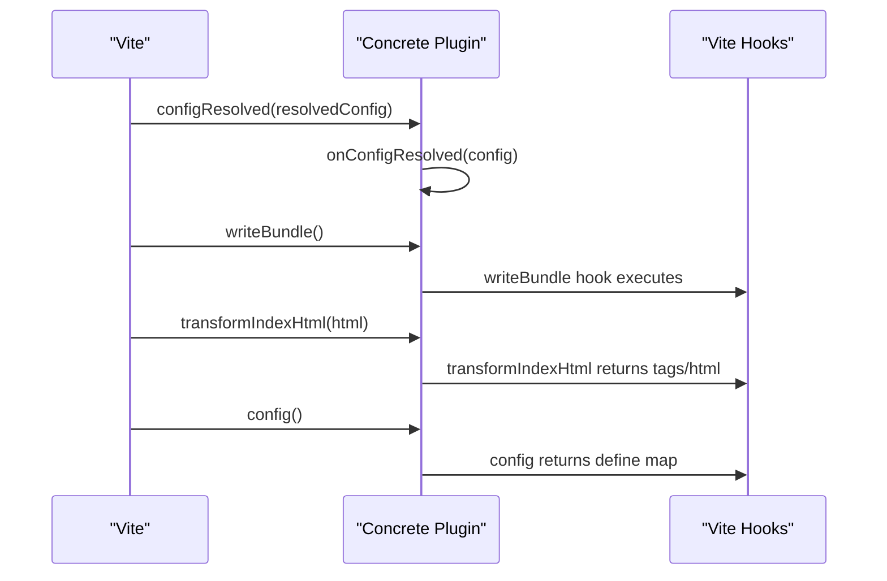
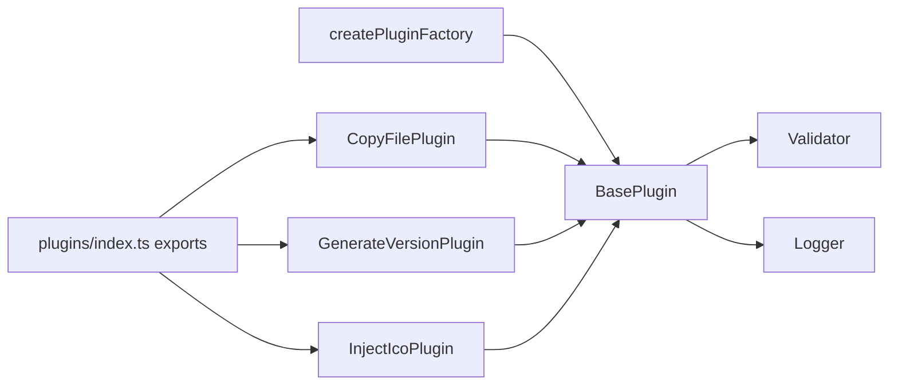

# Plugin Factory System

<cite>
**Referenced Files in This Document**
- [plugin/index.ts](file://packages/core/src/factory/plugin/index.ts)
- [plugin/types.ts](file://packages/core/src/factory/plugin/types.ts)
- [copyFile/index.ts](file://packages/core/src/plugins/copyFile/index.ts)
- [copyFile/types.ts](file://packages/core/src/plugins/copyFile/types.ts)
- [generateVersion/index.ts](file://packages/core/src/plugins/generateVersion/index.ts)
- [generateVersion/types.ts](file://packages/core/src/plugins/generateVersion/types.ts)
- [injectIco/index.ts](file://packages/core/src/plugins/injectIco/index.ts)
- [injectIco/types.ts](file://packages/core/src/plugins/injectIco/types.ts)
- [validation.ts](file://packages/core/src/common/validation.ts)
- [logger/index.ts](file://packages/core/src/logger/index.ts)
- [plugins/index.ts](file://packages/core/src/plugins/index.ts)
- [package.json](file://packages/core/package.json)
</cite>

## Table of Contents
1. [Introduction](#introduction)
2. [Project Structure](#project-structure)
3. [Core Components](#core-components)
4. [Architecture Overview](#architecture-overview)
5. [Detailed Component Analysis](#detailed-component-analysis)
6. [Dependency Analysis](#dependency-analysis)
7. [Performance Considerations](#performance-considerations)
8. [Troubleshooting Guide](#troubleshooting-guide)
9. [Conclusion](#conclusion)

## Introduction
This document explains the plugin factory system that standardizes plugin creation across the Vite Plugin Ecosystem. It focuses on the createPluginFactory function, its generic type system, and how it transforms plugin classes into Vite-compatible plugin instances. It documents the PluginFactory interface, the OptionsNormalizer pattern, and the relationship between plugin classes and factory functions. It also details the plugin instantiation process, including configuration normalization, instance creation, and Vite plugin conversion. Practical examples show how to create custom plugin factories, handle different configuration input formats, and integrate with the BasePlugin architecture. Finally, it outlines the benefits of this factory pattern for plugin development, reusability, and consistency.

## Project Structure
The plugin factory system resides in the core package under the factory directory. It defines the BasePlugin abstract class and the createPluginFactory function. Concrete plugins (copyFile, generateVersion, injectIco) extend BasePlugin and are exported via createPluginFactory. Supporting utilities include a Validator for configuration validation and a Logger singleton with per-plugin loggers.

**Diagram sources**
- [plugin/index.ts](file://packages/core/src/factory/plugin/index.ts#L1-L386)
- [plugin/types.ts](file://packages/core/src/factory/plugin/types.ts#L1-L46)
- [copyFile/index.ts](file://packages/core/src/plugins/copyFile/index.ts#L1-L121)
- [generateVersion/index.ts](file://packages/core/src/plugins/generateVersion/index.ts#L1-L257)
- [injectIco/index.ts](file://packages/core/src/plugins/injectIco/index.ts#L1-L195)
- [copyFile/types.ts](file://packages/core/src/plugins/copyFile/types.ts#L1-L44)
- [generateVersion/types.ts](file://packages/core/src/plugins/generateVersion/types.ts#L1-L120)
- [injectIco/types.ts](file://packages/core/src/plugins/injectIco/types.ts#L1-L113)
- [validation.ts](file://packages/core/src/common/validation.ts#L1-L203)
- [logger/index.ts](file://packages/core/src/logger/index.ts#L1-L181)
- [plugins/index.ts](file://packages/core/src/plugins/index.ts#L1-L4)

**Section sources**
- [plugin/index.ts](file://packages/core/src/factory/plugin/index.ts#L1-L386)
- [plugin/types.ts](file://packages/core/src/factory/plugin/types.ts#L1-L46)
- [plugins/index.ts](file://packages/core/src/plugins/index.ts#L1-L4)
- [package.json](file://packages/core/package.json#L1-L73)

## Core Components
- BasePlugin<T extends BasePluginOptions>: An abstract class that encapsulates configuration merging, logging, validation, lifecycle hooks, and Vite plugin conversion. It exposes protected methods for subclasses to override (getDefaultOptions, getPluginName, getEnforce, addPluginHooks) and public toPlugin() to produce a Vite Plugin object.
- createPluginFactory<T, P, R>(): A generic factory that accepts a plugin class constructor and an optional OptionsNormalizer. It returns a PluginFactory function that normalizes raw options, instantiates the plugin class, converts it to a Vite plugin, and attaches the original plugin instance to the returned object for introspection.
- PluginFactory<T, R>: The function signature for factory-created plugin constructors, returning a Vite Plugin.
- OptionsNormalizer<T, R>: A function that transforms raw input options into the normalized plugin options type.
- BasePluginOptions: Shared options across all plugins (enabled, verbose, errorStrategy).

Key behaviors:
- Configuration normalization: mergeOptions combines base defaults, plugin-specific defaults, and user-provided options.
- Validation: Validator supports fluent validation with required, type checks, and custom validators.
- Logging: Logger singleton creates per-plugin loggers respecting enabled flags and verbosity.
- Error handling: safeExecute/safeExecuteSync and handleError implement configurable strategies (throw, log, ignore).

**Section sources**
- [plugin/index.ts](file://packages/core/src/factory/plugin/index.ts#L27-L348)
- [plugin/types.ts](file://packages/core/src/factory/plugin/types.ts#L3-L46)
- [validation.ts](file://packages/core/src/common/validation.ts#L16-L203)
- [logger/index.ts](file://packages/core/src/logger/index.ts#L7-L181)

## Architecture Overview
The factory pattern centralizes plugin creation and conversion into a single, reusable mechanism. Concrete plugins extend BasePlugin and implement their own configuration defaults, validation, and hook wiring. The factory normalizes inputs, constructs the plugin, and produces a Vite Plugin object with lifecycle hooks attached.

**Diagram sources**
- [plugin/index.ts](file://packages/core/src/factory/plugin/index.ts#L27-L348)
- [copyFile/index.ts](file://packages/core/src/plugins/copyFile/index.ts#L13-L87)
- [generateVersion/index.ts](file://packages/core/src/plugins/generateVersion/index.ts#L14-L196)
- [injectIco/index.ts](file://packages/core/src/plugins/injectIco/index.ts#L14-L158)
- [validation.ts](file://packages/core/src/common/validation.ts#L16-L203)
- [logger/index.ts](file://packages/core/src/logger/index.ts#L7-L181)
- [plugin/types.ts](file://packages/core/src/factory/plugin/types.ts#L31-L46)

## Detailed Component Analysis

### BasePlugin<T> and Lifecycle
BasePlugin orchestrates:
- Constructor: merges options, initializes logger and validator, validates options.
- mergeOptions: merges base defaults, plugin defaults, and user options into Required<T>.
- Logging: Logger singleton creates a per-plugin logger proxy.
- Validation: Validator supports fluent validation APIs.
- Error handling: safeExecute and safeExecuteSync wrap operations with handleError using configured errorStrategy.
- Vite conversion: toPlugin sets name, enforce, and configResolved, then delegates to addPluginHooks.

**Diagram sources**
- [plugin/index.ts](file://packages/core/src/factory/plugin/index.ts#L69-L347)

**Section sources**
- [plugin/index.ts](file://packages/core/src/factory/plugin/index.ts#L27-L348)

### createPluginFactory Function and Generic Type System
createPluginFactory<T, P, R> enables:
- T: Target plugin options type (extends BasePluginOptions).
- P: Plugin instance type (extends BasePlugin<T>).
- R: Raw input type (defaults to T).
- Optional OptionsNormalizer<T, R> to convert R into T.
- Returns a PluginFactory<T, R> that:
  - Normalizes raw options (if normalizer provided).
  - Instantiates P with normalized options.
  - Calls toPlugin() to produce a Vite Plugin.
  - Attaches the original plugin instance to the returned object for introspection.

Benefits:
- Standardizes plugin creation across the ecosystem.
- Supports flexible input formats via OptionsNormalizer.
- Ensures consistent configuration merging and validation.
- Provides a uniform Vite plugin interface.

**Section sources**
- [plugin/index.ts](file://packages/core/src/factory/plugin/index.ts#L369-L385)
- [plugin/types.ts](file://packages/core/src/factory/plugin/types.ts#L31-L46)

### OptionsNormalizer Pattern
OptionsNormalizer<T, R> allows factories to accept varied input formats and convert them to the canonical T type:
- Example: injectIco factory accepts string | InjectIcoOptions and normalizes to InjectIcoOptions.
- This pattern improves ergonomics for consumers while maintaining internal consistency.

**Diagram sources**
- [plugin/index.ts](file://packages/core/src/factory/plugin/index.ts#L373-L384)
- [injectIco/index.ts](file://packages/core/src/plugins/injectIco/index.ts#L194-L194)

**Section sources**
- [plugin/index.ts](file://packages/core/src/factory/plugin/index.ts#L369-L385)
- [injectIco/index.ts](file://packages/core/src/plugins/injectIco/index.ts#L194-L194)

### Plugin Classes and Integration with BasePlugin
Each concrete plugin extends BasePlugin and implements:
- getDefaultOptions: Provide plugin-specific defaults.
- getPluginName: Unique identifier for Vite.
- getEnforce: Execution timing ('post' for copyFile, others may vary).
- addPluginHooks: Register Vite hooks (e.g., writeBundle, transformIndexHtml, config).

Examples:
- CopyFilePlugin: Validates source/target directories, copies files after build, logs results.
- GenerateVersionPlugin: Generates version strings, writes version.json, optionally injects defines.
- InjectIcoPlugin: Generates HTML tag descriptors or injects custom link tags, optionally copies icon assets.

**Diagram sources**
- [copyFile/index.ts](file://packages/core/src/plugins/copyFile/index.ts#L82-L86)
- [generateVersion/index.ts](file://packages/core/src/plugins/generateVersion/index.ts#L146-L196)
- [injectIco/index.ts](file://packages/core/src/plugins/injectIco/index.ts#L131-L157)

**Section sources**
- [copyFile/index.ts](file://packages/core/src/plugins/copyFile/index.ts#L13-L87)
- [generateVersion/index.ts](file://packages/core/src/plugins/generateVersion/index.ts#L14-L196)
- [injectIco/index.ts](file://packages/core/src/plugins/injectIco/index.ts#L14-L158)

### Type System and Interfaces
- BasePluginOptions: enabled, verbose, errorStrategy.
- PluginFactory<T, R>: Factory function returning a Vite Plugin.
- OptionsNormalizer<T, R>: Converts raw input to normalized options.
- Concrete plugin option interfaces extend BasePluginOptions and add plugin-specific fields.

**Section sources**
- [plugin/types.ts](file://packages/core/src/factory/plugin/types.ts#L3-L46)
- [copyFile/types.ts](file://packages/core/src/plugins/copyFile/types.ts#L8-L44)
- [generateVersion/types.ts](file://packages/core/src/plugins/generateVersion/types.ts#L31-L120)
- [injectIco/types.ts](file://packages/core/src/plugins/injectIco/types.ts#L70-L113)

### Practical Examples

#### Creating a Custom Plugin Factory
Steps:
- Define a plugin class extending BasePlugin<YourOptions>.
- Implement getDefaultOptions, getPluginName, getEnforce, and addPluginHooks.
- Export a factory using createPluginFactory(YourPluginClass).
- Optionally provide an OptionsNormalizer to support ergonomic input formats.

Reference paths:
- [copyFile/index.ts](file://packages/core/src/plugins/copyFile/index.ts#L13-L121)
- [generateVersion/index.ts](file://packages/core/src/plugins/generateVersion/index.ts#L14-L257)
- [injectIco/index.ts](file://packages/core/src/plugins/injectIco/index.ts#L14-L195)

#### Handling Different Configuration Input Formats
- Use OptionsNormalizer to accept string or partial object inputs and normalize to full options.
- Example: injectIco factory accepts string | InjectIcoOptions and normalizes to InjectIcoOptions.

Reference path:
- [injectIco/index.ts](file://packages/core/src/plugins/injectIco/index.ts#L194-L194)

#### Integrating with BasePlugin Architecture
- Extend BasePlugin<T> and implement abstract methods.
- Leverage mergeOptions, validator, logger, and errorStrategy for consistent behavior.
- Use toPlugin() to expose a Vite-compatible plugin.

Reference path:
- [plugin/index.ts](file://packages/core/src/factory/plugin/index.ts#L27-L348)

## Dependency Analysis
The factory system composes several subsystems:
- BasePlugin depends on Validator and Logger.
- Concrete plugins depend on BasePlugin and common utilities.
- Factories depend on BasePlugin and optionally on OptionsNormalizers.
- Exports aggregate plugin factories for consumption.

**Diagram sources**
- [plugin/index.ts](file://packages/core/src/factory/plugin/index.ts#L27-L348)
- [copyFile/index.ts](file://packages/core/src/plugins/copyFile/index.ts#L13-L87)
- [generateVersion/index.ts](file://packages/core/src/plugins/generateVersion/index.ts#L14-L196)
- [injectIco/index.ts](file://packages/core/src/plugins/injectIco/index.ts#L14-L158)
- [plugins/index.ts](file://packages/core/src/plugins/index.ts#L1-L4)

**Section sources**
- [plugin/index.ts](file://packages/core/src/factory/plugin/index.ts#L1-L386)
- [plugins/index.ts](file://packages/core/src/plugins/index.ts#L1-L4)

## Performance Considerations
- Factory overhead is minimal: construction, normalization, and conversion are lightweight.
- Logging and validation occur during initialization; keep validation logic efficient.
- ErrorStrategy impacts runtime behavior; choose 'log' or 'ignore' for non-critical failures to avoid build interruptions.
- Prefer lazy operations inside hooks (e.g., file I/O) and cache computed values when appropriate.

## Troubleshooting Guide
Common issues and resolutions:
- Configuration validation failures: Review plugin-specific validations and ensure required fields are provided. Use Validator’s fluent API to identify missing or invalid fields.
- Logging disabled unexpectedly: Verify verbose flag and per-plugin logger registration via Logger.create.
- ErrorStrategy behavior: Configure errorStrategy to 'log' or 'ignore' for non-fatal conditions; 'throw' interrupts builds on errors.
- Hook timing: Adjust getEnforce to control execution order ('pre' or 'post') depending on dependencies.

**Section sources**
- [validation.ts](file://packages/core/src/common/validation.ts#L195-L201)
- [logger/index.ts](file://packages/core/src/logger/index.ts#L76-L89)
- [plugin/index.ts](file://packages/core/src/factory/plugin/index.ts#L283-L311)

## Conclusion
The plugin factory system provides a robust, standardized approach to building Vite plugins. By leveraging BasePlugin, createPluginFactory, OptionsNormalizer, and shared utilities, developers can create consistent, configurable, and maintainable plugins. The system promotes reusability across the Vite Plugin Ecosystem by enforcing a common architecture, configuration model, and lifecycle integration.