# Development Guide

<cite>
**Referenced Files in This Document**
- [packages/core/src/index.ts](file://packages/core/src/index.ts)
- [packages/core/src/plugins/index.ts](file://packages/core/src/plugins/index.ts)
- [packages/core/src/factory/plugin/index.ts](file://packages/core/src/factory/plugin/index.ts)
- [packages/core/src/factory/plugin/types.ts](file://packages/core/src/factory/plugin/types.ts)
- [packages/core/src/logger/index.ts](file://packages/core/src/logger/index.ts)
- [packages/core/src/common/index.ts](file://packages/core/src/common/index.ts)
- [packages/core/src/common/validation.ts](file://packages/core/src/common/validation.ts)
- [packages/core/src/common/fs/index.ts](file://packages/core/src/common/fs/index.ts)
- [packages/core/src/plugins/copyFile/index.ts](file://packages/core/src/plugins/copyFile/index.ts)
- [packages/core/src/plugins/generateVersion/index.ts](file://packages/core/src/plugins/generateVersion/index.ts)
- [packages/core/src/plugins/injectIco/index.ts](file://packages/core/src/plugins/injectIco/index.ts)
- [packages/playground/vite.config.ts](file://packages/playground/vite.config.ts)
- [packages/playground/src/App.vue](file://packages/playground/src/App.vue)
- [packages/core/package.json](file://packages/core/package.json)
</cite>

## Table of Contents
1. [Introduction](#introduction)
2. [Project Structure](#project-structure)
3. [Core Components](#core-components)
4. [Architecture Overview](#architecture-overview)
5. [Detailed Component Analysis](#detailed-component-analysis)
6. [Dependency Analysis](#dependency-analysis)
7. [Performance Considerations](#performance-considerations)
8. [Troubleshooting Guide](#troubleshooting-guide)
9. [Development Workflow](#development-workflow)
10. [Best Practices](#best-practices)
11. [Step-by-Step Tutorial: Creating a Custom Plugin](#step-by-step-tutorial-creating-a-custom-plugin)
12. [Debugging Techniques](#debugging-techniques)
13. [Publishing Guidelines](#publishing-guidelines)
14. [Conclusion](#conclusion)

## Introduction
This guide explains how to extend and customize the Vite Plugin Ecosystem by building custom plugins that follow the BasePlugin class pattern, using the plugin factory system, and integrating with the playground application. It covers plugin lifecycle hooks, configuration validation, logging, error handling, performance optimization, and practical workflows for testing and publishing.

## Project Structure
The repository is organized as a monorepo with three main areas:
- core: The plugin framework, shared utilities, and built-in plugins
- playground: A minimal Vite + Vue app to test plugin usage
- docs: Documentation sources for the ecosystem

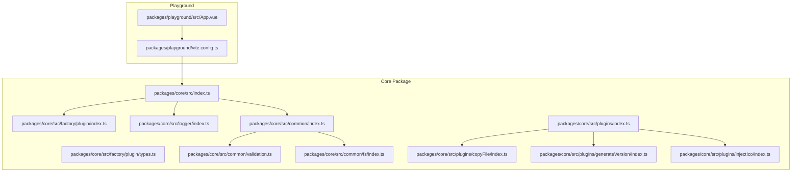

**Diagram sources**
- [packages/core/src/index.ts](file://packages/core/src/index.ts#L1-L8)
- [packages/core/src/factory/plugin/index.ts](file://packages/core/src/factory/plugin/index.ts#L1-L386)
- [packages/core/src/factory/plugin/types.ts](file://packages/core/src/factory/plugin/types.ts#L1-L46)
- [packages/core/src/logger/index.ts](file://packages/core/src/logger/index.ts#L1-L181)
- [packages/core/src/common/index.ts](file://packages/core/src/common/index.ts#L1-L5)
- [packages/core/src/common/validation.ts](file://packages/core/src/common/validation.ts#L1-L203)
- [packages/core/src/common/fs/index.ts](file://packages/core/src/common/fs/index.ts#L1-L292)
- [packages/core/src/plugins/index.ts](file://packages/core/src/plugins/index.ts#L1-L4)
- [packages/core/src/plugins/copyFile/index.ts](file://packages/core/src/plugins/copyFile/index.ts#L1-L121)
- [packages/core/src/plugins/generateVersion/index.ts](file://packages/core/src/plugins/generateVersion/index.ts#L1-L257)
- [packages/core/src/plugins/injectIco/index.ts](file://packages/core/src/plugins/injectIco/index.ts#L1-L195)
- [packages/playground/vite.config.ts](file://packages/playground/vite.config.ts#L1-L100)
- [packages/playground/src/App.vue](file://packages/playground/src/App.vue#L1-L88)

**Section sources**
- [packages/core/src/index.ts](file://packages/core/src/index.ts#L1-L8)
- [packages/core/src/plugins/index.ts](file://packages/core/src/plugins/index.ts#L1-L4)
- [packages/playground/vite.config.ts](file://packages/playground/vite.config.ts#L1-L100)

## Core Components
- BasePlugin: Provides configuration merging, validation, logging, lifecycle hooks, and safe execution helpers. It converts instances into Vite Plugin objects via toPlugin().
- createPluginFactory: Factory that instantiates a plugin class, normalizes raw options, and returns a Vite Plugin with a reference to the original instance.
- Logger: Singleton logger with per-plugin enablement and colored console output.
- Validator: Fluent validation builder for plugin options.
- FS Utilities: Robust file/directory copy, existence checks, and incremental update detection with concurrency control.

Key responsibilities:
- Configuration: Merge defaults, normalize options, validate inputs.
- Logging: Unified, structured logs with plugin-scoped prefixes.
- Safety: Wrap sync/async operations with error strategies (throw/log/ignore).
- Lifecycle: Hook registration and Vite integration.

**Section sources**
- [packages/core/src/factory/plugin/index.ts](file://packages/core/src/factory/plugin/index.ts#L27-L348)
- [packages/core/src/factory/plugin/types.ts](file://packages/core/src/factory/plugin/types.ts#L1-L46)
- [packages/core/src/logger/index.ts](file://packages/core/src/logger/index.ts#L7-L146)
- [packages/core/src/common/validation.ts](file://packages/core/src/common/validation.ts#L16-L202)
- [packages/core/src/common/fs/index.ts](file://packages/core/src/common/fs/index.ts#L160-L253)

## Architecture Overview
The plugin architecture centers around BasePlugin and the factory pattern. Each concrete plugin extends BasePlugin, defines defaults, validates options, and registers Vite hooks. The factory wraps instances into Vite Plugins and exposes a convenient function for consumers.

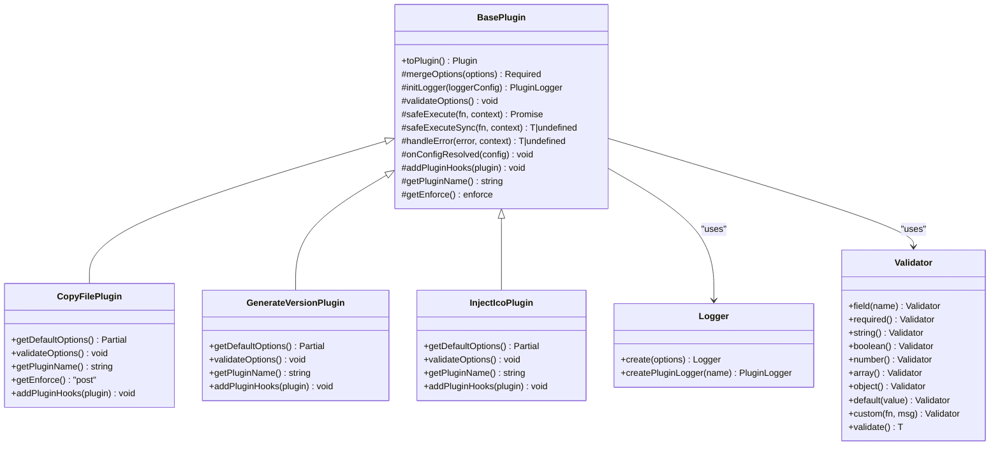

**Diagram sources**
- [packages/core/src/factory/plugin/index.ts](file://packages/core/src/factory/plugin/index.ts#L27-L348)
- [packages/core/src/plugins/copyFile/index.ts](file://packages/core/src/plugins/copyFile/index.ts#L13-L87)
- [packages/core/src/plugins/generateVersion/index.ts](file://packages/core/src/plugins/generateVersion/index.ts#L14-L197)
- [packages/core/src/plugins/injectIco/index.ts](file://packages/core/src/plugins/injectIco/index.ts#L14-L158)
- [packages/core/src/logger/index.ts](file://packages/core/src/logger/index.ts#L7-L146)
- [packages/core/src/common/validation.ts](file://packages/core/src/common/validation.ts#L16-L202)

## Detailed Component Analysis

### BasePlugin and Factory System
- Construction merges user options with base and plugin-specific defaults, initializes a logger, sets up a validator, and validates options.
- toPlugin() creates a Vite Plugin with name, enforce, and configResolved hook. It then delegates to addPluginHooks to attach runtime hooks.
- safeExecute/safeExecuteSync wrap operations and route errors according to errorStrategy.
- createPluginFactory optionally normalizes raw inputs (e.g., string to object) before constructing the plugin.

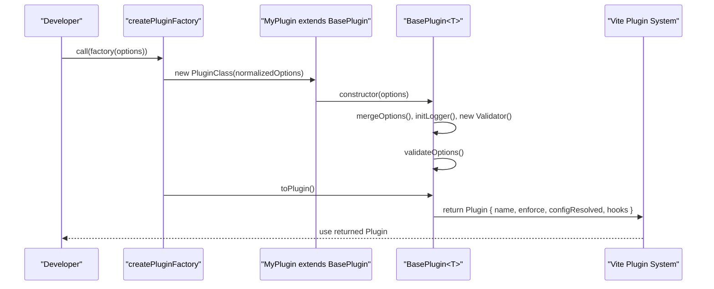

**Diagram sources**
- [packages/core/src/factory/plugin/index.ts](file://packages/core/src/factory/plugin/index.ts#L369-L385)
- [packages/core/src/factory/plugin/index.ts](file://packages/core/src/factory/plugin/index.ts#L69-L81)
- [packages/core/src/factory/plugin/index.ts](file://packages/core/src/factory/plugin/index.ts#L331-L347)

**Section sources**
- [packages/core/src/factory/plugin/index.ts](file://packages/core/src/factory/plugin/index.ts#L27-L348)
- [packages/core/src/factory/plugin/types.ts](file://packages/core/src/factory/plugin/types.ts#L32-L46)

### Logger Integration
- Logger is a singleton with per-plugin enablement. Each plugin gets a PluginLogger proxy bound to its name.
- Logs include emoji prefixes and plugin-scoped tags for clarity.

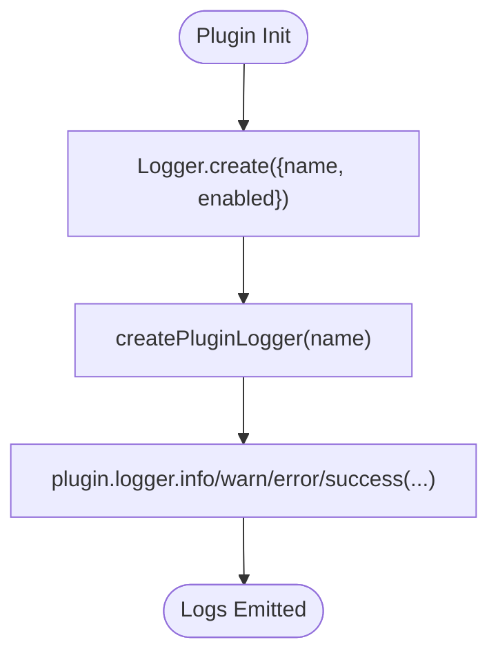

**Diagram sources**
- [packages/core/src/logger/index.ts](file://packages/core/src/logger/index.ts#L76-L145)

**Section sources**
- [packages/core/src/logger/index.ts](file://packages/core/src/logger/index.ts#L7-L181)

### Validation Pipeline
- Validator supports chaining required(), string(), boolean(), number(), array(), object(), default(), and custom().
- validate() throws if any errors were collected.

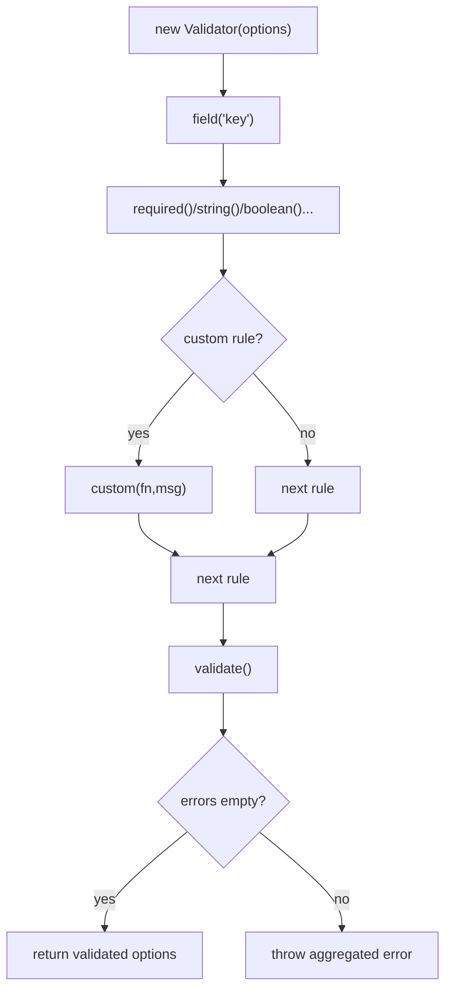

**Diagram sources**
- [packages/core/src/common/validation.ts](file://packages/core/src/common/validation.ts#L16-L202)

**Section sources**
- [packages/core/src/common/validation.ts](file://packages/core/src/common/validation.ts#L16-L202)

### File System Utilities
- copySourceToTarget supports recursive, overwrite, incremental, and parallel copying with concurrency limiting.
- checkSourceExists and ensureTargetDir handle preconditions.
- shouldUpdateFile compares mtimeMs and size for incremental updates.

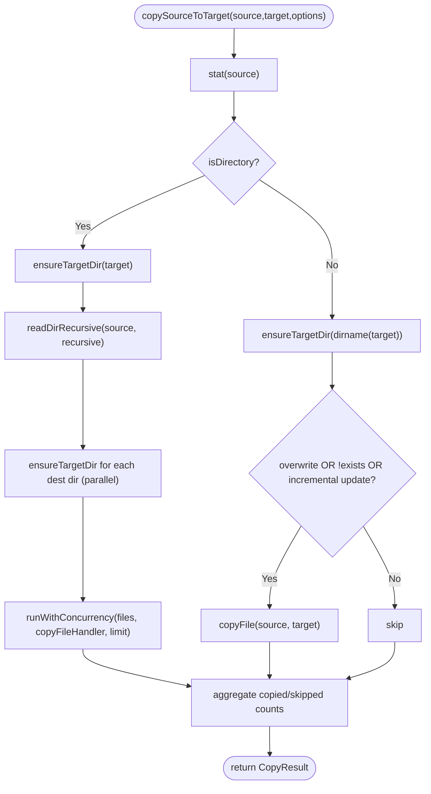

**Diagram sources**
- [packages/core/src/common/fs/index.ts](file://packages/core/src/common/fs/index.ts#L160-L253)

**Section sources**
- [packages/core/src/common/fs/index.ts](file://packages/core/src/common/fs/index.ts#L27-L292)

### Built-in Plugins

#### CopyFile Plugin
- Purpose: Copy files/directories after build completes.
- Hooks: writeBundle.
- Defaults: overwrite=true, recursive=true, incremental=true.
- Enforce: post.

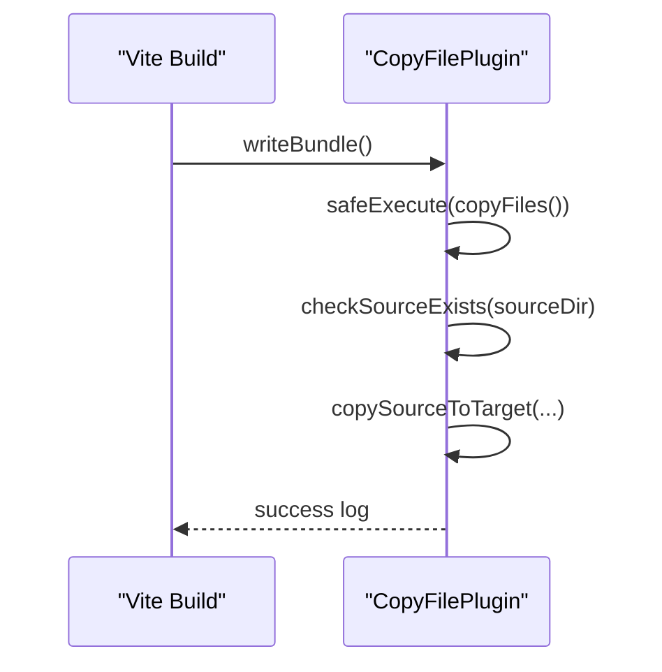

**Diagram sources**
- [packages/core/src/plugins/copyFile/index.ts](file://packages/core/src/plugins/copyFile/index.ts#L82-L86)
- [packages/core/src/plugins/copyFile/index.ts](file://packages/core/src/plugins/copyFile/index.ts#L58-L80)

**Section sources**
- [packages/core/src/plugins/copyFile/index.ts](file://packages/core/src/plugins/copyFile/index.ts#L13-L121)

#### GenerateVersion Plugin
- Purpose: Generate version strings and inject into code or write to file.
- Hooks: configResolved (generate), config (define globals), writeBundle (write file).
- Defaults: format=timestamp, outputType=file, defineName=__APP_VERSION__, hashLength=8.

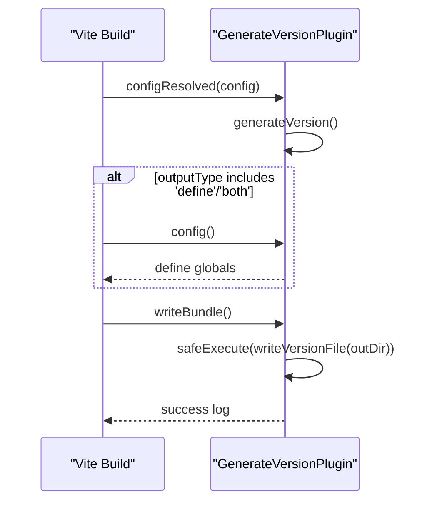

**Diagram sources**
- [packages/core/src/plugins/generateVersion/index.ts](file://packages/core/src/plugins/generateVersion/index.ts#L146-L196)
- [packages/core/src/plugins/generateVersion/index.ts](file://packages/core/src/plugins/generateVersion/index.ts#L138-L144)

**Section sources**
- [packages/core/src/plugins/generateVersion/index.ts](file://packages/core/src/plugins/generateVersion/index.ts#L14-L257)

#### InjectIco Plugin
- Purpose: Inject favicon/link tags into HTML via transformIndexHtml, optionally copy icons.
- Hooks: transformIndexHtml (pre), writeBundle.
- Defaults: base=/.

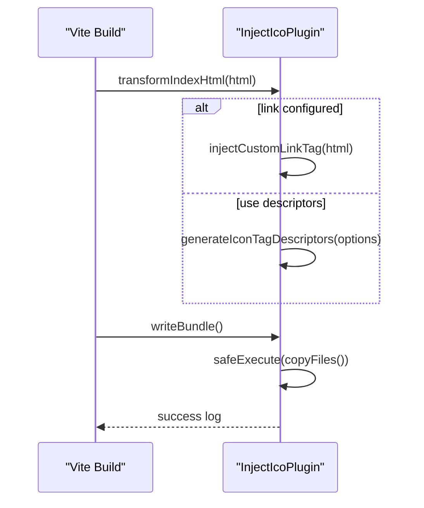

**Diagram sources**
- [packages/core/src/plugins/injectIco/index.ts](file://packages/core/src/plugins/injectIco/index.ts#L131-L157)
- [packages/core/src/plugins/injectIco/index.ts](file://packages/core/src/plugins/injectIco/index.ts#L69-L90)

**Section sources**
- [packages/core/src/plugins/injectIco/index.ts](file://packages/core/src/plugins/injectIco/index.ts#L14-L195)

## Dependency Analysis
- Export surface: core/src/index.ts re-exports common, factory, logger, and plugins.
- Plugins depend on BasePlugin and createPluginFactory, plus common utilities.
- Playground depends on the published package exports to consume plugins.

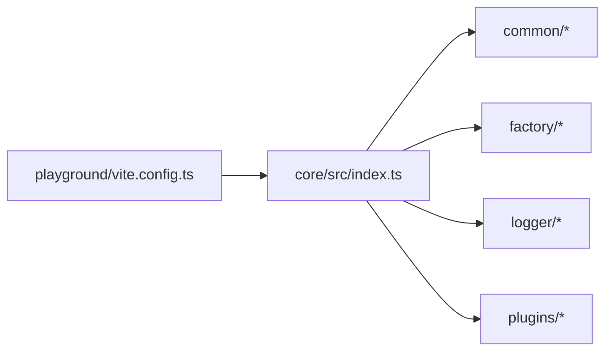

**Diagram sources**
- [packages/core/src/index.ts](file://packages/core/src/index.ts#L1-L8)
- [packages/core/src/plugins/index.ts](file://packages/core/src/plugins/index.ts#L1-L4)
- [packages/playground/vite.config.ts](file://packages/playground/vite.config.ts#L1-L100)

**Section sources**
- [packages/core/src/index.ts](file://packages/core/src/index.ts#L1-L8)
- [packages/core/src/plugins/index.ts](file://packages/core/src/plugins/index.ts#L1-L4)
- [packages/playground/vite.config.ts](file://packages/playground/vite.config.ts#L1-L100)

## Performance Considerations
- Concurrency: copySourceToTarget uses runWithConcurrency to parallelize file copies while bounding worker count.
- Incremental updates: shouldUpdateFile compares mtimeMs and size to avoid unnecessary writes.
- Logging overhead: keep verbose off in production builds to reduce console I/O.
- Hook placement: set enforce appropriately to minimize conflicts and optimize order-sensitive operations.

[No sources needed since this section provides general guidance]

## Troubleshooting Guide
Common issues and resolutions:
- Configuration validation failures: Review thrown messages from Validator.validate() and ensure required fields are present and typed correctly.
- File operation errors: checkSourceExists and ensureTargetDir throw descriptive errors for missing paths or permission issues.
- Error strategy: errorStrategy controls whether errors are thrown, logged, or ignored. Use 'log' during development and 'throw' in CI.
- Logging visibility: verify plugin verbose flag and Logger per-plugin enablement.

**Section sources**
- [packages/core/src/common/validation.ts](file://packages/core/src/common/validation.ts#L195-L201)
- [packages/core/src/common/fs/index.ts](file://packages/core/src/common/fs/index.ts#L27-L58)
- [packages/core/src/factory/plugin/index.ts](file://packages/core/src/factory/plugin/index.ts#L283-L311)
- [packages/core/src/logger/index.ts](file://packages/core/src/logger/index.ts#L105-L107)

## Development Workflow
- Local development: use the playground to test plugin usage and observe logs.
- Example usage: see packages/playground/vite.config.ts for how plugins are imported and configured.
- Runtime verification: the playground’s App.vue reads injected global variables from generateVersion to confirm injection.

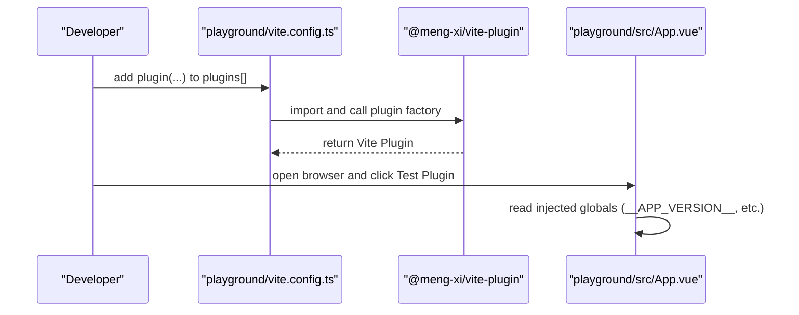

**Diagram sources**
- [packages/playground/vite.config.ts](file://packages/playground/vite.config.ts#L1-L100)
- [packages/playground/src/App.vue](file://packages/playground/src/App.vue#L15-L33)

**Section sources**
- [packages/playground/vite.config.ts](file://packages/playground/vite.config.ts#L1-L100)
- [packages/playground/src/App.vue](file://packages/playground/src/App.vue#L15-L33)

## Best Practices
- Configuration
  - Provide sensible defaults in getDefaultOptions().
  - Use Validator to enforce required and typed fields.
  - Support OptionsNormalizer for ergonomic consumer APIs.
- Logging
  - Use plugin.logger.success/info/warn/error consistently.
  - Keep verbose off in production; enable for local dev.
- Error Handling
  - Prefer safeExecute/safeExecuteSync for all side effects.
  - Choose errorStrategy based on environment (throw in CI, log/ignore in dev).
- Performance
  - Use incremental and overwrite flags to avoid redundant work.
  - Limit concurrency for IO-bound tasks.
  - Minimize heavy work in transformIndexHtml; prefer writeBundle for file IO.
- Testing
  - Add unit tests for validation and small utilities.
  - Use the playground to smoke-test integration.

[No sources needed since this section provides general guidance]

## Step-by-Step Tutorial: Creating a Custom Plugin
Follow these steps to build a new plugin:

1. Define options type
- Create a dedicated options interface under a new folder under packages/core/src/plugins/<your-plugin>.
- Export the factory function at packages/core/src/plugins/index.ts.

2. Extend BasePlugin
- Create a class that extends BasePlugin<YourOptions>.
- Implement getDefaultOptions() with defaults.
- Override getPluginName() with a unique name.
- Optionally override getEnforce() if order matters.
- Implement addPluginHooks(plugin) to register Vite hooks.

3. Add validation
- Override validateOptions() using this.validator.field(...).required().string().validate().

4. Implement hooks
- Use plugin.configResolved, config, transformIndexHtml, or writeBundle depending on your needs.
- Wrap async work with this.safeExecute and sync work with this.safeExecuteSync.

5. Create factory
- Export const yourPlugin = createPluginFactory(YourPluginClass[, normalizer]).

6. Integrate into playground
- Add your plugin to packages/playground/vite.config.ts and verify behavior.

7. Test and iterate
- Run the playground, inspect logs, and adjust options.

**Section sources**
- [packages/core/src/factory/plugin/index.ts](file://packages/core/src/factory/plugin/index.ts#L369-L385)
- [packages/core/src/plugins/index.ts](file://packages/core/src/plugins/index.ts#L1-L4)
- [packages/playground/vite.config.ts](file://packages/playground/vite.config.ts#L1-L100)

## Debugging Techniques
- Enable verbose logging for the plugin to capture detailed info.
- Temporarily switch errorStrategy to 'log' to surface issues without failing the build.
- Use console logging inside hooks cautiously; prefer plugin.logger for consistency.
- Inspect the Vite plugin object attached to the returned plugin via the factory (the factory attaches pluginInstance).

**Section sources**
- [packages/core/src/factory/plugin/index.ts](file://packages/core/src/factory/plugin/index.ts#L377-L384)
- [packages/core/src/factory/plugin/index.ts](file://packages/core/src/factory/plugin/index.ts#L283-L311)

## Publishing Guidelines
- Package metadata
  - Ensure exports map aligns with dist outputs.
  - Keep peerDependencies aligned with supported Vite versions.
- Build and distribution
  - Use the provided build scripts to generate CJS/ESM/types.
- Versioning and release
  - Update package.json version and publish to npm.
- Documentation
  - Provide usage examples and option tables in docs.

**Section sources**
- [packages/core/package.json](file://packages/core/package.json#L17-L43)
- [packages/core/package.json](file://packages/core/package.json#L49-L52)

## Conclusion
By leveraging BasePlugin and createPluginFactory, you can build robust, configurable, and maintainable Vite plugins. Use the playground to validate integrations, rely on the built-in logging and validation utilities, and follow the best practices outlined here to ensure reliable performance and developer experience.