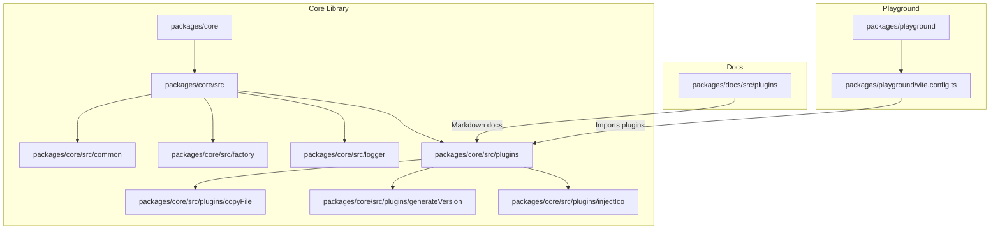
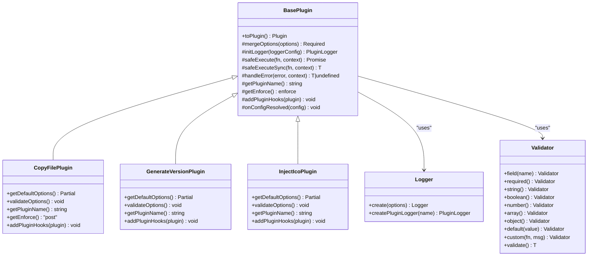
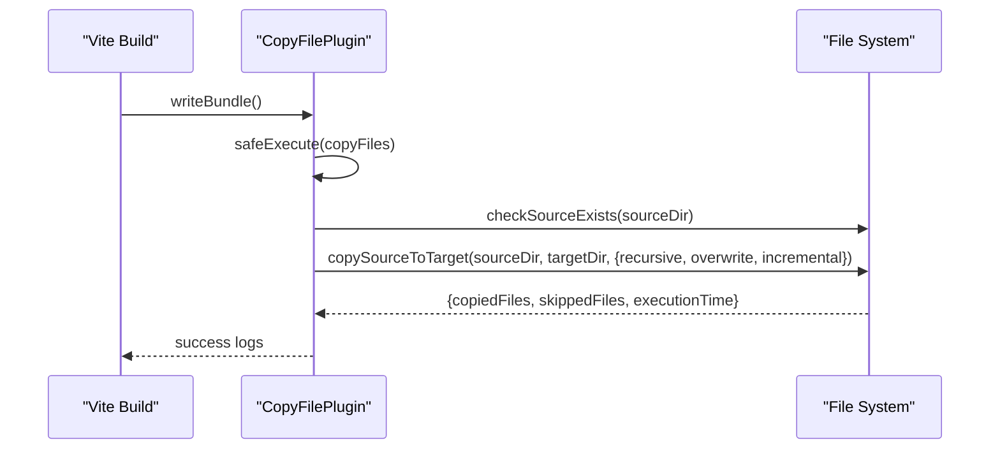
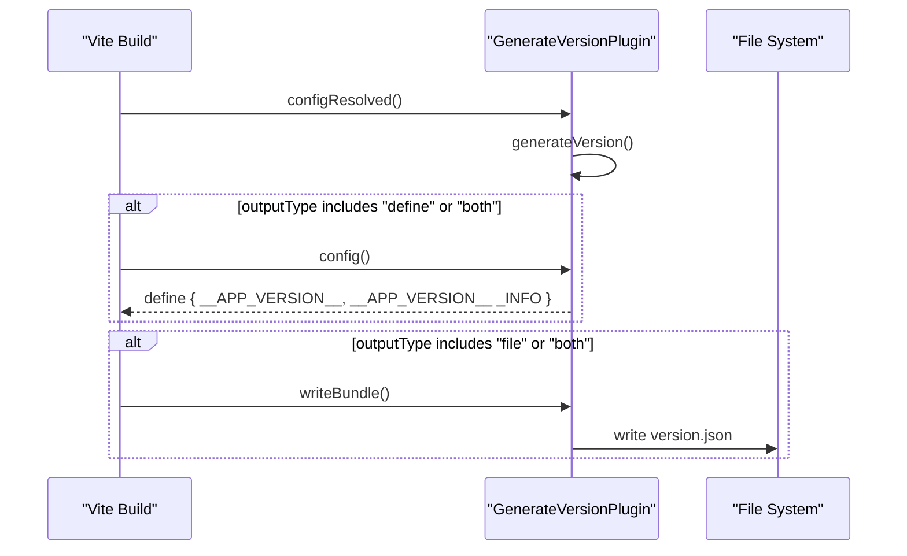
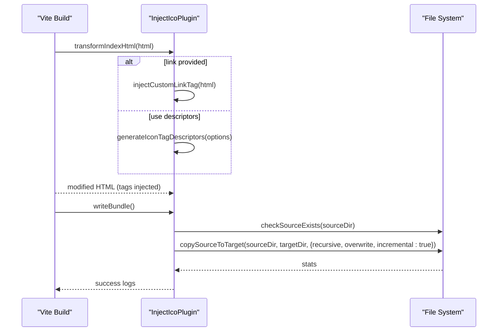
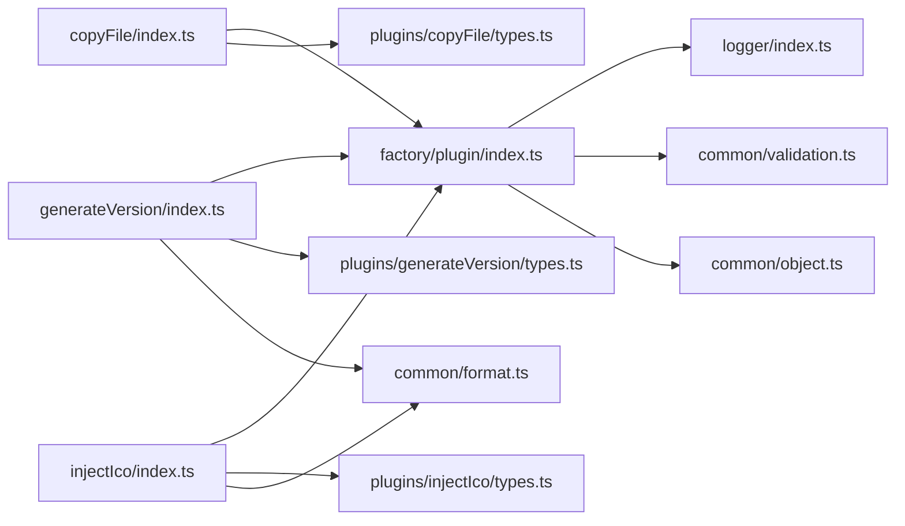

# Examples & Recipes

<cite>
**Referenced Files in This Document**
- [package.json](file://packages/core/package.json)
- [index.ts](file://packages/core/src/index.ts)
- [plugins/index.ts](file://packages/core/src/plugins/index.ts)
- [factory/plugin/index.ts](file://packages/core/src/factory/plugin/index.ts)
- [factory/plugin/types.ts](file://packages/core/src/factory/plugin/types.ts)
- [logger/index.ts](file://packages/core/src/logger/index.ts)
- [logger/types.ts](file://packages/core/src/logger/types.ts)
- [common/validation.ts](file://packages/core/src/common/validation.ts)
- [common/object.ts](file://packages/core/src/common/object.ts)
- [common/format.ts](file://packages/core/src/common/format.ts)
- [plugins/copyFile/index.ts](file://packages/core/src/plugins/copyFile/index.ts)
- [plugins/copyFile/types.ts](file://packages/core/src/plugins/copyFile/types.ts)
- [plugins/generateVersion/index.ts](file://packages/core/src/plugins/generateVersion/index.ts)
- [plugins/generateVersion/types.ts](file://packages/core/src/plugins/generateVersion/types.ts)
- [plugins/injectIco/index.ts](file://packages/core/src/plugins/injectIco/index.ts)
- [plugins/injectIco/types.ts](file://packages/core/src/plugins/injectIco/types.ts)
- [vite.config.ts](file://packages/playground/vite.config.ts)
- [copy-file.md](file://packages/docs/src/plugins/copy-file.md)
- [generate-version.md](file://packages/docs/src/plugins/generate-version.md)
- [inject-ico.md](file://packages/docs/src/plugins/inject-ico.md)
</cite>

## Table of Contents
1. [Introduction](#introduction)
2. [Project Structure](#project-structure)
3. [Core Components](#core-components)
4. [Architecture Overview](#architecture-overview)
5. [Detailed Component Analysis](#detailed-component-analysis)
6. [Dependency Analysis](#dependency-analysis)
7. [Performance Considerations](#performance-considerations)
8. [Troubleshooting Guide](#troubleshooting-guide)
9. [CI/CD and Deployment Recipes](#cicd-and-deployment-recipes)
10. [Conclusion](#conclusion)

## Introduction
This document provides practical examples and recipes for the Vite Plugin Ecosystem centered around the @meng-xi/vite-plugin library. It covers real-world usage scenarios, integration patterns, advanced configurations, troubleshooting, performance tuning, CI/CD recipes, and production optimization techniques. The goal is to help developers quickly adopt the plugins and adapt them to their specific needs.

## Project Structure
The repository is organized as a monorepo with three main areas:
- packages/core: The core plugin library exporting common utilities, factories, logging, and the three plugins (copyFile, generateVersion, injectIco).
- packages/docs: Markdown documentation for each plugin, including usage examples and configuration tables.
- packages/playground: A minimal Vite app demonstrating combined plugin usage.

**Diagram sources**
- [index.ts](file://packages/core/src/index.ts#L1-L8)
- [plugins/index.ts](file://packages/core/src/plugins/index.ts#L1-L4)
- [vite.config.ts](file://packages/playground/vite.config.ts#L1-L100)

**Section sources**
- [package.json](file://packages/core/package.json#L1-L73)
- [index.ts](file://packages/core/src/index.ts#L1-L8)
- [plugins/index.ts](file://packages/core/src/plugins/index.ts#L1-L4)

## Core Components
This section explains the foundational building blocks that all plugins share.

- BasePlugin and Plugin Factory
  - Provides lifecycle hooks, configuration merging, logging, validation, and error handling strategies.
  - Exposes a factory to produce Vite-compatible plugins with standardized behavior.

- Logging
  - Centralized Logger singleton with per-plugin loggers, supporting info, success, warn, error outputs.

- Validation
  - Fluent Validator for chainable field checks (required, type, custom) with aggregated error reporting.

- Utilities
  - deepMerge for robust defaults composition.
  - Formatting helpers for dates, hashes, and templates.

Key implementation references:
- BasePlugin lifecycle and safety execution: [factory/plugin/index.ts](file://packages/core/src/factory/plugin/index.ts#L27-L348)
- Plugin factory creation: [factory/plugin/index.ts](file://packages/core/src/factory/plugin/index.ts#L369-L385)
- Logger singleton and plugin proxy: [logger/index.ts](file://packages/core/src/logger/index.ts#L7-L146)
- Validator fluent API: [common/validation.ts](file://packages/core/src/common/validation.ts#L16-L202)
- deepMerge utility: [common/object.ts](file://packages/core/src/common/object.ts#L35-L66)
- Formatting helpers: [common/format.ts](file://packages/core/src/common/format.ts#L17-L136)

**Section sources**
- [factory/plugin/index.ts](file://packages/core/src/factory/plugin/index.ts#L27-L348)
- [factory/plugin/types.ts](file://packages/core/src/factory/plugin/types.ts#L1-L46)
- [logger/index.ts](file://packages/core/src/logger/index.ts#L7-L146)
- [logger/types.ts](file://packages/core/src/logger/types.ts#L1-L14)
- [common/validation.ts](file://packages/core/src/common/validation.ts#L16-L202)
- [common/object.ts](file://packages/core/src/common/object.ts#L35-L66)
- [common/format.ts](file://packages/core/src/common/format.ts#L17-L136)

## Architecture Overview
The ecosystem follows a consistent pattern:
- Each plugin extends BasePlugin and overrides defaults, validation, name, enforce timing, and hook registration.
- Plugins integrate with Vite via standard hooks (transformIndexHtml, writeBundle, configResolved, config).
- Factory functions normalize raw options and attach the plugin instance to the returned Vite plugin for introspection.

**Diagram sources**
- [factory/plugin/index.ts](file://packages/core/src/factory/plugin/index.ts#L27-L348)
- [logger/index.ts](file://packages/core/src/logger/index.ts#L7-L146)
- [common/validation.ts](file://packages/core/src/common/validation.ts#L16-L202)

**Section sources**
- [factory/plugin/index.ts](file://packages/core/src/factory/plugin/index.ts#L27-L348)
- [logger/index.ts](file://packages/core/src/logger/index.ts#L7-L146)
- [common/validation.ts](file://packages/core/src/common/validation.ts#L16-L202)

## Detailed Component Analysis

### copyFile Plugin
Purpose: Copy assets after the build completes, with support for recursive, overwrite, and incremental modes.

Key behaviors:
- Enforces post execution to run after other transforms.
- Validates presence of source directory.
- Supports incremental copy to reduce rebuild time.
- Comprehensive error handling via BasePlugin strategies.

Common usage patterns:
- Basic asset copying during production builds.
- Conditional enabling based on environment.
- Verbose logging for debugging.

References:
- Implementation: [plugins/copyFile/index.ts](file://packages/core/src/plugins/copyFile/index.ts#L13-L121)
- Types: [plugins/copyFile/types.ts](file://packages/core/src/plugins/copyFile/types.ts#L8-L44)
- Docs examples: [copy-file.md](file://packages/docs/src/plugins/copy-file.md#L17-L159)

**Diagram sources**
- [plugins/copyFile/index.ts](file://packages/core/src/plugins/copyFile/index.ts#L58-L86)

**Section sources**
- [plugins/copyFile/index.ts](file://packages/core/src/plugins/copyFile/index.ts#L13-L121)
- [plugins/copyFile/types.ts](file://packages/core/src/plugins/copyFile/types.ts#L8-L44)
- [copy-file.md](file://packages/docs/src/plugins/copy-file.md#L17-L159)

### generateVersion Plugin
Purpose: Generate and inject version metadata during builds, with multiple formats and output targets.

Key behaviors:
- Generates version at configResolved, ensuring consistency.
- Supports timestamp/date/datetime/semver/hash/custom formats.
- Outputs to file, injects into code via define, or both.
- Emits a companion INFO variable with build metadata.

Common usage patterns:
- Production-only generation.
- Custom format with hash and semantic placeholders.
- Dual output for frontend and analytics.

References:
- Implementation: [plugins/generateVersion/index.ts](file://packages/core/src/plugins/generateVersion/index.ts#L14-L257)
- Types: [plugins/generateVersion/types.ts](file://packages/core/src/plugins/generateVersion/types.ts#L31-L120)
- Docs examples: [generate-version.md](file://packages/docs/src/plugins/generate-version.md#L16-L259)

**Diagram sources**
- [plugins/generateVersion/index.ts](file://packages/core/src/plugins/generateVersion/index.ts#L146-L196)

**Section sources**
- [plugins/generateVersion/index.ts](file://packages/core/src/plugins/generateVersion/index.ts#L14-L257)
- [plugins/generateVersion/types.ts](file://packages/core/src/plugins/generateVersion/types.ts#L31-L120)
- [generate-version.md](file://packages/docs/src/plugins/generate-version.md#L16-L259)

### injectIco Plugin
Purpose: Inject favicon/link tags into HTML and optionally copy icon assets.

Key behaviors:
- Uses transformIndexHtml with pre order and HtmlTagDescriptor for native injection.
- Falls back to manual HTML injection when a custom link tag is provided.
- Copies icon files post-build with incremental mode.

Common usage patterns:
- Base path injection for local assets.
- Custom icon arrays for multiple formats/sizes.
- Combined with copyOptions for asset delivery.

References:
- Implementation: [plugins/injectIco/index.ts](file://packages/core/src/plugins/injectIco/index.ts#L14-L195)
- Types: [plugins/injectIco/types.ts](file://packages/core/src/plugins/injectIco/types.ts#L70-L113)
- Docs examples: [inject-ico.md](file://packages/docs/src/plugins/inject-ico.md#L18-L258)

**Diagram sources**
- [plugins/injectIco/index.ts](file://packages/core/src/plugins/injectIco/index.ts#L131-L157)

**Section sources**
- [plugins/injectIco/index.ts](file://packages/core/src/plugins/injectIco/index.ts#L14-L195)
- [plugins/injectIco/types.ts](file://packages/core/src/plugins/injectIco/types.ts#L70-L113)
- [inject-ico.md](file://packages/docs/src/plugins/inject-ico.md#L18-L258)

### Playground Integration Example
The playground demonstrates a realistic multi-plugin setup with Vue and all three plugins configured.

Highlights:
- injectIco with base path and optional copyOptions.
- copyFile for static assets.
- generateVersion with custom format and dual output.

Reference:
- [vite.config.ts](file://packages/playground/vite.config.ts#L11-L99)

**Section sources**
- [vite.config.ts](file://packages/playground/vite.config.ts#L11-L99)

## Dependency Analysis
The plugins depend on shared infrastructure:
- BasePlugin for lifecycle and error handling.
- Logger for unified logging.
- Validator for configuration checks.
- Common utilities for merging defaults and formatting.

**Diagram sources**
- [plugins/copyFile/index.ts](file://packages/core/src/plugins/copyFile/index.ts#L1-L121)
- [plugins/generateVersion/index.ts](file://packages/core/src/plugins/generateVersion/index.ts#L1-L257)
- [plugins/injectIco/index.ts](file://packages/core/src/plugins/injectIco/index.ts#L1-L195)
- [factory/plugin/index.ts](file://packages/core/src/factory/plugin/index.ts#L1-L386)
- [logger/index.ts](file://packages/core/src/logger/index.ts#L1-L181)
- [common/validation.ts](file://packages/core/src/common/validation.ts#L1-L203)
- [common/object.ts](file://packages/core/src/common/object.ts#L1-L67)
- [common/format.ts](file://packages/core/src/common/format.ts#L1-L137)

**Section sources**
- [plugins/copyFile/index.ts](file://packages/core/src/plugins/copyFile/index.ts#L1-L121)
- [plugins/generateVersion/index.ts](file://packages/core/src/plugins/generateVersion/index.ts#L1-L257)
- [plugins/injectIco/index.ts](file://packages/core/src/plugins/injectIco/index.ts#L1-L195)
- [factory/plugin/index.ts](file://packages/core/src/factory/plugin/index.ts#L1-L386)

## Performance Considerations
- Prefer incremental copy in copyFile and injectIco to minimize rebuild time.
- Limit verbose logging in production to reduce noise and overhead.
- Use targeted environments for plugin activation (e.g., production-only).
- Choose efficient formats in generateVersion (e.g., timestamp or hash) to avoid heavy computation.
- Keep sourceDir and targetDir concise and avoid unnecessary recursion when not required.

[No sources needed since this section provides general guidance]

## Troubleshooting Guide
Common issues and resolutions:
- Configuration validation failures
  - Symptom: Errors mentioning missing or invalid fields.
  - Action: Review required fields and types; consult plugin docs for exact constraints.
  - References: [common/validation.ts](file://packages/core/src/common/validation.ts#L195-L201), [copy-file.md](file://packages/docs/src/plugins/copy-file.md#L143-L159), [generate-version.md](file://packages/docs/src/plugins/generate-version.md#L247-L259), [inject-ico.md](file://packages/docs/src/plugins/inject-ico.md#L243-L258)

- Source directory not found
  - Symptom: Failures during copy operations.
  - Action: Verify absolute/relative paths and existence; ensure correct working directory.
  - References: [plugins/copyFile/index.ts](file://packages/core/src/plugins/copyFile/index.ts#L69-L76), [plugins/injectIco/index.ts](file://packages/core/src/plugins/injectIco/index.ts#L118-L125)

- HTML injection not applied
  - Symptom: Icons missing in built HTML.
  - Action: Confirm transformIndexHtml path and fallback logic; ensure closing head tag exists when using custom link injection.
  - References: [plugins/injectIco/index.ts](file://packages/core/src/plugins/injectIco/index.ts#L69-L90), [inject-ico.md](file://packages/docs/src/plugins/inject-ico.md#L243-L258)

- Error handling strategy
  - Symptom: Build halts unexpectedly vs. continues with warnings.
  - Action: Adjust errorStrategy to throw/log/ignore depending on environment.
  - References: [factory/plugin/index.ts](file://packages/core/src/factory/plugin/index.ts#L283-L311)

**Section sources**
- [common/validation.ts](file://packages/core/src/common/validation.ts#L195-L201)
- [copy-file.md](file://packages/docs/src/plugins/copy-file.md#L143-L159)
- [generate-version.md](file://packages/docs/src/plugins/generate-version.md#L247-L259)
- [inject-ico.md](file://packages/docs/src/plugins/inject-ico.md#L243-L258)
- [plugins/copyFile/index.ts](file://packages/core/src/plugins/copyFile/index.ts#L69-L76)
- [plugins/injectIco/index.ts](file://packages/core/src/plugins/injectIco/index.ts#L69-L90)
- [factory/plugin/index.ts](file://packages/core/src/factory/plugin/index.ts#L283-L311)

## CI/CD and Deployment Recipes
Recommended patterns:
- Conditional plugin activation by environment
  - Enable copyFile and injectIco only in production to avoid unnecessary work in development/testing.
  - Reference: [vite.config.ts](file://packages/playground/vite.config.ts#L33-L43), [vite.config.ts](file://packages/playground/vite.config.ts#L51-L64), [vite.config.ts](file://packages/playground/vite.config.ts#L73-L97)

- Artifact inclusion
  - Use generateVersion with outputType 'file' to emit version.json alongside build artifacts.
  - Reference: [generate-version.md](file://packages/docs/src/plugins/generate-version.md#L232-L245)

- Asset delivery
  - Pair injectIco with copyOptions to ensure icons are present in dist and linked correctly.
  - Reference: [inject-ico.md](file://packages/docs/src/plugins/inject-ico.md#L123-L161)

- Caching and speedup
  - Rely on incremental copy to cache unchanged assets across runs.
  - Reference: [copy-file.md](file://packages/docs/src/plugins/copy-file.md#L11-L13), [inject-ico.md](file://packages/docs/src/plugins/inject-ico.md#L10-L16)

**Section sources**
- [vite.config.ts](file://packages/playground/vite.config.ts#L33-L43)
- [vite.config.ts](file://packages/playground/vite.config.ts#L51-L64)
- [vite.config.ts](file://packages/playground/vite.config.ts#L73-L97)
- [generate-version.md](file://packages/docs/src/plugins/generate-version.md#L232-L245)
- [inject-ico.md](file://packages/docs/src/plugins/inject-ico.md#L123-L161)
- [copy-file.md](file://packages/docs/src/plugins/copy-file.md#L11-L13)

## Conclusion
The @meng-xi/vite-plugin ecosystem offers a cohesive set of Vite plugins with consistent configuration, validation, logging, and error handling. By leveraging the BasePlugin factory and shared utilities, teams can reliably integrate asset copying, version generation, and icon injection into their builds. Apply the recipes here to tailor behavior to your framework and environment, and rely on the troubleshooting and performance guidance for smooth operations in development and production.