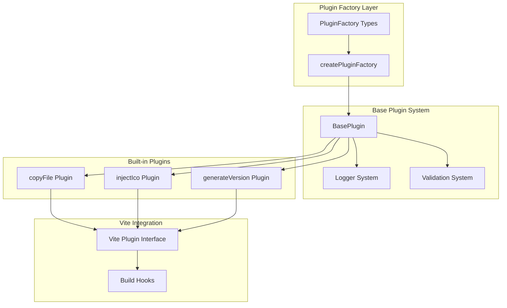
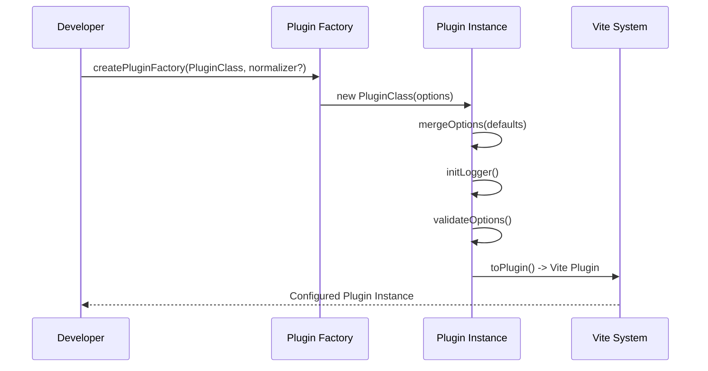
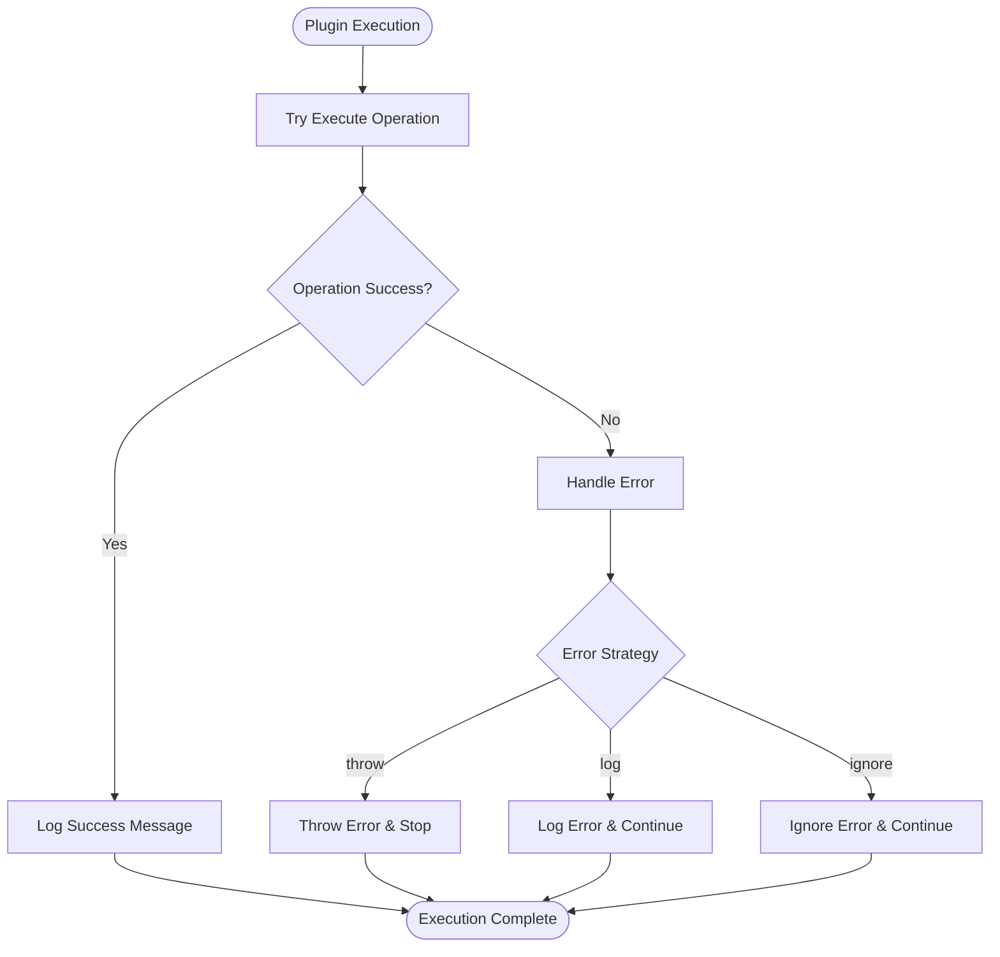
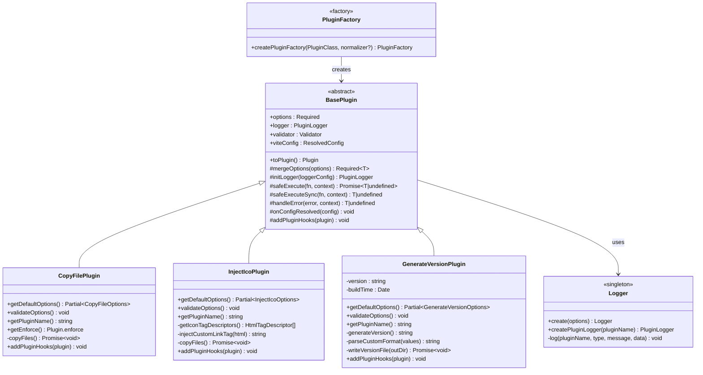

# Getting Started

<cite>
**Referenced Files in This Document**
- [package.json](file://packages/core/package.json)
- [README-en.md](file://packages/core/README-en.md)
- [installation.md](file://packages/docs/src/en/installation.md)
- [introduction.md](file://packages/docs/src/en/introduction.md)
- [plugins/index.ts](file://packages/core/src/plugins/index.ts)
- [copyFile/index.ts](file://packages/core/src/plugins/copyFile/index.ts)
- [injectIco/index.ts](file://packages/core/src/plugins/injectIco/index.ts)
- [generateVersion/index.ts](file://packages/core/src/plugins/generateVersion/index.ts)
- [factory/plugin/index.ts](file://packages/core/src/factory/plugin/index.ts)
- [factory/plugin/types.ts](file://packages/core/src/factory/plugin/types.ts)
- [logger/index.ts](file://packages/core/src/logger/index.ts)
- [common/fs/index.ts](file://packages/core/src/common/fs/index.ts)
- [playground/vite.config.ts](file://packages/playground/vite.config.ts)
</cite>

## Table of Contents
1. [Introduction](#introduction)
2. [Prerequisites](#prerequisites)
3. [Installation](#installation)
4. [Basic Setup](#basic-setup)
5. [Quick Start Examples](#quick-start-examples)
6. [Plugin Architecture Overview](#plugin-architecture-overview)
7. [Core Plugin Reference](#core-plugin-reference)
8. [Development Workflow](#development-workflow)
9. [Troubleshooting](#troubleshooting)
10. [Next Steps](#next-steps)

## Introduction

The Vite Plugin Ecosystem is a comprehensive toolkit designed to enhance the Vite build system with practical plugins for file management, version control, and asset injection. This collection provides both ready-to-use plugins and a complete plugin development framework, enabling developers to extend Vite's functionality while maintaining consistency and reliability across projects.

The ecosystem serves dual purposes:
- **Ready-to-Use Plugins**: Pre-built solutions for common build tasks
- **Development Framework**: A robust foundation for creating custom plugins

Key benefits include modular architecture, comprehensive configuration options, environment-aware behavior, and seamless integration with Vite's build pipeline.

**Section sources**
- [introduction.md](file://packages/docs/src/en/introduction.md#L1-L48)

## Prerequisites

Before diving into the Vite Plugin Ecosystem, ensure you have the following foundational knowledge:

### Vite Build System Understanding
- Familiarity with Vite's plugin architecture and lifecycle hooks
- Understanding of build processes and asset handling
- Knowledge of Vite configuration options and plugin ordering

### TypeScript Proficiency
- Strong typing concepts and interfaces
- Generic types and type inference
- Module system and import/export patterns

### File System Operations
- Directory traversal and file manipulation
- Path resolution and working directory concepts
- File permissions and access control

### Development Environment
- Node.js runtime knowledge
- Package manager familiarity (npm, yarn, pnpm)
- Basic understanding of build toolchains

## Installation

Install the Vite Plugin Ecosystem using your preferred package manager. The toolkit supports all major JavaScript package managers with identical commands.

### Package Manager Commands

```bash
# Using npm
npm install @meng-xi/vite-plugin --save-dev

# Using yarn  
yarn add @meng-xi/vite-plugin --save-dev

# Using pnpm
pnpm add @meng-xi/vite-plugin --save-dev
```

### Peer Dependencies

The ecosystem requires specific Vite versions to ensure compatibility and proper integration:

- **Vite Version Support**: ^5.0.0 || ^6.0.0 || ^7.0.0
- **Peer Dependency**: Vite must be installed alongside the plugin ecosystem
- **Version Compatibility**: Automatic validation prevents incompatible combinations

### Verification

After installation, verify the setup by checking your `package.json` for the installed dependencies and confirming the peer dependency resolution.

**Section sources**
- [package.json](file://packages/core/package.json#L53-L55)
- [installation.md](file://packages/docs/src/en/installation.md#L1-L87)

## Basic Setup

Configure the Vite Plugin Ecosystem in your Vite project by importing the desired plugins and adding them to your configuration array.

### Minimal Configuration

```typescript
import { defineConfig } from 'vite'
import { copyFile, injectIco } from '@meng-xi/vite-plugin'

export default defineConfig({
  plugins: [
    copyFile({
      sourceDir: 'src/assets',
      targetDir: 'dist/assets'
    }),
    injectIco({
      base: '/assets'
    })
  ]
})
```

### Advanced Configuration

For production environments, consider environment-specific configurations and enhanced logging:

```typescript
import { defineConfig } from 'vite'
import { copyFile, injectIco, generateVersion } from '@meng-xi/vite-plugin'

export default defineConfig({
  plugins: [
    copyFile({
      sourceDir: 'src/static',
      targetDir: 'dist/static',
      overwrite: true,
      recursive: true,
      incremental: true,
      enabled: process.env.NODE_ENV === 'production'
    }),
    injectIco({
      base: '/assets',
      enabled: true,
      verbose: true,
      copyOptions: {
        sourceDir: 'src/assets/icons',
        targetDir: 'dist/assets/icons',
        overwrite: true,
        recursive: true
      }
    }),
    generateVersion({
      format: 'custom',
      customFormat: '{YYYY}.{MM}.{DD}-{hash}',
      hashLength: 8,
      outputType: 'both',
      outputFile: 'version.json',
      defineName: '__APP_VERSION__',
      enabled: true,
      verbose: true
    })
  ]
})
```

**Section sources**
- [installation.md](file://packages/docs/src/en/installation.md#L25-L87)
- [playground/vite.config.ts](file://packages/playground/vite.config.ts#L1-L100)

## Quick Start Examples

### Example 1: Basic File Copying

Demonstrates the fundamental use of the copyFile plugin for asset management:

```typescript
import { defineConfig } from 'vite'
import { copyFile } from '@meng-xi/vite-plugin'

export default defineConfig({
  plugins: [
    copyFile({
      sourceDir: 'src/assets',
      targetDir: 'dist/assets'
    })
  ]
})
```

### Example 2: Website Icon Injection

Shows how to inject favicons and manage icon assets:

```typescript
import { defineConfig } from 'vite'
import { injectIco } from '@meng-xi/vite-plugin'

export default defineConfig({
  plugins: [
    injectIco({
      base: '/assets',
      copyOptions: {
        sourceDir: 'src/assets/icons',
        targetDir: 'dist/assets/icons'
      }
    })
  ]
})
```

### Example 3: Combined Plugin Usage

Illustrates using multiple plugins together for comprehensive build enhancement:

```typescript
import { defineConfig } from 'vite'
import { copyFile, injectIco, generateVersion } from '@meng-xi/vite-plugin'

export default defineConfig({
  plugins: [
    copyFile({
      sourceDir: 'src/static',
      targetDir: 'dist/static',
      recursive: true
    }),
    injectIco({
      base: '/assets',
      icons: [
        { rel: 'icon', href: '/favicon.svg', type: 'image/svg+xml' },
        { rel: 'icon', href: '/favicon-32x32.png', sizes: '32x32', type: 'image/png' }
      ]
    }),
    generateVersion({
      format: 'datetime',
      outputType: 'both',
      defineName: '__BUILD_INFO__'
    })
  ]
})
```

### Example 4: Environment-Based Configuration

Demonstrates conditional plugin activation based on environment variables:

```typescript
import { defineConfig } from 'vite'
import { copyFile, injectIco } from '@meng-xi/vite-plugin'

export default defineConfig({
  plugins: [
    copyFile({
      sourceDir: 'src/assets',
      targetDir: 'dist/assets',
      enabled: process.env.NODE_ENV === 'production'
    }),
    injectIco({
      base: '/assets',
      enabled: process.env.NODE_ENV === 'production'
    })
  ]
})
```

**Section sources**
- [installation.md](file://packages/docs/src/en/installation.md#L29-L87)
- [playground/vite.config.ts](file://packages/playground/vite.config.ts#L11-L99)

## Plugin Architecture Overview

The Vite Plugin Ecosystem follows a sophisticated architecture built around a factory pattern and base plugin system, providing consistency and extensibility across all plugins.

### Core Architecture Components



**Diagram sources**
- [factory/plugin/index.ts](file://packages/core/src/factory/plugin/index.ts#L369-L385)
- [factory/plugin/types.ts](file://packages/core/src/factory/plugin/types.ts#L32-L46)
- [logger/index.ts](file://packages/core/src/logger/index.ts#L7-L181)

### Plugin Factory Pattern

The ecosystem employs a factory pattern that standardizes plugin creation and configuration:



**Diagram sources**
- [factory/plugin/index.ts](file://packages/core/src/factory/plugin/index.ts#L369-L385)
- [factory/plugin/index.ts](file://packages/core/src/factory/plugin/index.ts#L331-L347)

### Error Handling Strategy

The system implements a configurable error handling mechanism:



**Diagram sources**
- [factory/plugin/index.ts](file://packages/core/src/factory/plugin/index.ts#L283-L311)

**Section sources**
- [factory/plugin/index.ts](file://packages/core/src/factory/plugin/index.ts#L1-L386)
- [factory/plugin/types.ts](file://packages/core/src/factory/plugin/types.ts#L1-L46)
- [logger/index.ts](file://packages/core/src/logger/index.ts#L1-L181)

## Core Plugin Reference

### copyFile Plugin

The copyFile plugin provides comprehensive file and directory copying capabilities with advanced options for build optimization.

#### Key Features
- **Post-build Execution**: Runs after Vite's build process completes
- **Recursive Copying**: Supports nested directory structures
- **Incremental Updates**: Only copies modified files for efficiency
- **Flexible Overwrite Control**: Granular control over existing file handling
- **Comprehensive Logging**: Detailed progress and result reporting

#### Configuration Options

| Option | Type | Default | Description |
|--------|------|---------|-------------|
| `sourceDir` | string | Required | Source directory path (non-empty string) |
| `targetDir` | string | Required | Target directory path (non-empty string) |
| `overwrite` | boolean | true | Replace existing files |
| `recursive` | boolean | true | Copy subdirectories recursively |
| `incremental` | boolean | true | Only copy modified files |
| `enabled` | boolean | true | Activate/deactivate plugin |
| `verbose` | boolean | true | Enable detailed logging |
| `errorStrategy` | 'throw' \| 'log' \| 'ignore' | 'throw' | Error handling approach |

#### Usage Patterns

Basic file copying:
```typescript
copyFile({
  sourceDir: 'src/assets',
  targetDir: 'dist/assets'
})
```

Advanced configuration:
```typescript
copyFile({
  sourceDir: 'src/static',
  targetDir: 'dist/static',
  overwrite: false,
  recursive: true,
  incremental: true,
  enabled: true,
  verbose: true,
  errorStrategy: 'throw'
})
```

**Section sources**
- [copyFile/index.ts](file://packages/core/src/plugins/copyFile/index.ts#L1-L121)
- [plugins/index.ts](file://packages/core/src/plugins/index.ts#L1-L4)

### injectIco Plugin

The injectIco plugin automates website icon management by injecting favicon links into HTML files and optionally copying icon assets.

#### Key Features
- **HTML Transformation**: Uses Vite's native transformIndexHtml hook
- **Multiple Configuration Methods**: Supports various icon specification approaches
- **Asset Copying**: Optional automatic icon file copying with incremental updates
- **Fallback Mechanisms**: Graceful handling of missing HTML head tags
- **Flexible Link Generation**: Supports custom HTML tags and standard icon arrays

#### Configuration Options

| Option | Type | Default | Description |
|--------|------|---------|-------------|
| `base` | string | '/' | Base path for icon files |
| `url` | string | undefined | Complete icon URL override |
| `link` | string | undefined | Custom HTML link tag |
| `icons` | array | undefined | Icon array configuration |
| `verbose` | boolean | true | Enable detailed logging |
| `enabled` | boolean | true | Activate/deactivate plugin |
| `errorStrategy` | 'throw' \| 'log' \| 'ignore' | 'throw' | Error handling approach |
| `copyOptions` | object | undefined | Asset copying configuration |

#### copyOptions Sub-configuration

| Option | Type | Default | Description |
|--------|------|---------|-------------|
| `sourceDir` | string | Required | Source icon directory |
| `targetDir` | string | Required | Target build directory |
| `overwrite` | boolean | true | Replace existing files |
| `recursive` | boolean | true | Copy subdirectories |

#### Usage Patterns

String-based configuration (treated as base path):
```typescript
injectIco('/assets')
```

Basic configuration:
```typescript
injectIco({
  base: '/assets'
})
```

Complete configuration with asset copying:
```typescript
injectIco({
  base: '/assets',
  enabled: true,
  verbose: true,
  copyOptions: {
    sourceDir: 'src/assets/icons',
    targetDir: 'dist/assets/icons',
    overwrite: true,
    recursive: true
  }
})
```

**Section sources**
- [injectIco/index.ts](file://packages/core/src/plugins/injectIco/index.ts#L1-L195)
- [plugins/index.ts](file://packages/core/src/plugins/index.ts#L1-L4)

### generateVersion Plugin

The generateVersion plugin creates dynamic version identifiers during the build process, supporting multiple formats and output destinations.

#### Key Features
- **Multiple Format Support**: Timestamp, date, datetime, semantic versioning, hash, and custom formats
- **Dual Output Capability**: Writes to files and injects into code simultaneously
- **Build Information Tracking**: Captures timestamps, environment data, and custom metadata
- **Flexible Template System**: Customizable version string generation
- **Environment Integration**: Seamless integration with build processes

#### Configuration Options

| Option | Type | Default | Description |
|--------|------|---------|-------------|
| `format` | 'timestamp' \| 'date' \| 'datetime' \| 'semver' \| 'hash' \| 'custom' | 'timestamp' | Version format type |
| `outputType` | 'file' \| 'define' \| 'both' | 'file' | Output destination type |
| `outputFile` | string | 'version.json' | File path for version output |
| `defineName` | string | '__APP_VERSION__' | Global variable name for code injection |
| `hashLength` | number | 8 | Hash length for hash format |
| `prefix` | string | '' | Prefix for version string |
| `suffix` | string | '' | Suffix for version string |
| `semverBase` | string | '1.0.0' | Base for semantic versioning |
| `autoIncrement` | boolean | false | Auto-increment semantic version |
| `customFormat` | string | undefined | Template for custom format |
| `extra` | object | undefined | Additional metadata to include |
| `enabled` | boolean | true | Activate/deactivate plugin |
| `verbose` | boolean | true | Enable detailed logging |

#### Format Templates

Custom format placeholders:
- `{YYYY}` - Four-digit year
- `{MM}` - Two-digit month
- `{DD}` - Two-digit day
- `{HH}` - Two-digit hour
- `{mm}` - Two-digit minute
- `{ss}` - Two-digit second
- `{hash}` - Random hash value

#### Usage Patterns

Basic timestamp format:
```typescript
generateVersion()
```

Semantic versioning:
```typescript
generateVersion({
  format: 'semver',
  semverBase: '2.0.0',
  prefix: 'v'
})
```

Custom format with hash:
```typescript
generateVersion({
  format: 'custom',
  customFormat: '{YYYY}.{MM}.{DD}-{hash}',
  hashLength: 6
})
```

Dual output configuration:
```typescript
generateVersion({
  outputType: 'both',
  outputFile: 'build-info.json',
  defineName: '__BUILD_VERSION__',
  extra: {
    environment: 'production',
    author: 'MengXi Studio'
  }
})
```

**Section sources**
- [generateVersion/index.ts](file://packages/core/src/plugins/generateVersion/index.ts#L1-L257)
- [plugins/index.ts](file://packages/core/src/plugins/index.ts#L1-L4)

## Development Workflow

### Plugin Development Pattern

The ecosystem provides a standardized approach for creating custom plugins using the BasePlugin class and createPluginFactory function.

#### Development Architecture



**Diagram sources**
- [factory/plugin/index.ts](file://packages/core/src/factory/plugin/index.ts#L27-L348)
- [logger/index.ts](file://packages/core/src/logger/index.ts#L7-L181)

### Custom Plugin Development

Creating a custom plugin follows the established pattern:

```typescript
import { BasePlugin, createPluginFactory, Validator } from '@meng-xi/vite-plugin'
import type { Plugin } from 'vite'

interface MyPluginOptions {
  path: string
  enabled?: boolean
  verbose?: boolean
  errorStrategy?: 'throw' | 'log' | 'ignore'
}

class MyPlugin extends BasePlugin<MyPluginOptions> {
  protected getDefaultOptions() {
    return {
      path: './default'
    }
  }

  protected validateOptions(): void {
    this.validator
      .field('path')
      .required()
      .string()
      .validate()
  }

  protected getPluginName(): string {
    return 'my-plugin'
  }

  protected addPluginHooks(plugin: Plugin): void {
    plugin.buildStart = () => {
      this.logger.info(`Plugin started with path: ${this.options.path}`)
    }
  }
}

export const myPlugin = createPluginFactory(MyPlugin)
```

### Plugin Integration Testing

The ecosystem includes comprehensive testing through the playground configuration:

```typescript
import { defineConfig } from 'vite'
import vue from '@vitejs/plugin-vue'
import * as vitePlugin from '@meng-xi/vite-plugin'

export default defineConfig({
  plugins: [
    vue(),
    vitePlugin.injectIco({
      base: '/assets',
      enabled: true,
      copyOptions: {
        sourceDir: 'src/assets',
        targetDir: 'dist/assets',
        overwrite: true,
        recursive: true
      }
    }),
    vitePlugin.copyFile({
      sourceDir: 'src/static',
      targetDir: 'dist/static',
      overwrite: true,
      recursive: true,
      enabled: true,
      verbose: true
    }),
    vitePlugin.generateVersion({
      format: 'custom',
      customFormat: '{YYYY}.{MM}.{DD}-{hash}',
      hashLength: 6,
      outputType: 'both',
      outputFile: 'version.json',
      defineName: '__APP_VERSION__',
      enabled: true,
      verbose: true,
      extra: {
        environment: 'development',
        author: 'MengXi Studio'
      }
    })
  ]
})
```

**Section sources**
- [factory/plugin/index.ts](file://packages/core/src/factory/plugin/index.ts#L1-L386)
- [logger/index.ts](file://packages/core/src/logger/index.ts#L1-L181)
- [playground/vite.config.ts](file://packages/playground/vite.config.ts#L1-L100)

## Troubleshooting

### Common Issues and Solutions

#### Plugin Not Found Errors
**Symptoms**: Import errors when trying to use plugins
**Solution**: Verify installation and import paths
```typescript
// Correct import
import { copyFile, injectIco } from '@meng-xi/vite-plugin'

// Verify plugin availability
console.log(typeof copyFile) // Should return 'function'
```

#### Vite Version Compatibility
**Symptoms**: Build errors related to plugin compatibility
**Solution**: Ensure compatible Vite versions
```json
{
  "dependencies": {
    "vite": "^5.0.0 || ^6.0.0 || ^7.0.0"
  }
}
```

#### File Path Issues
**Symptoms**: Plugin fails to locate source or target directories
**Solution**: Use absolute paths or verify relative paths
```typescript
copyFile({
  sourceDir: path.resolve(__dirname, 'src/assets'),
  targetDir: path.resolve(__dirname, 'dist/assets')
})
```

#### Permission Errors
**Symptoms**: Access denied when copying files
**Solution**: Check file permissions and directory access
```typescript
// Ensure directories exist and are writable
import { access, constants } from 'fs/promises'

try {
  await access('src/assets', constants.R_OK)
  await access('dist/assets', constants.W_OK)
} catch (error) {
  console.error('Permission issue:', error.message)
}
```

#### Plugin Conflicts
**Symptoms**: Unexpected behavior when multiple plugins are used
**Solution**: Check plugin order and configuration conflicts
```typescript
export default defineConfig({
  plugins: [
    // Order matters - place copyFile before injectIco
    copyFile({ /* configuration */ }),
    injectIco({ /* configuration */ })
  ]
})
```

### Debug Mode Activation

Enable verbose logging for troubleshooting:
```typescript
copyFile({
  sourceDir: 'src/assets',
  targetDir: 'dist/assets',
  verbose: true
})

injectIco({
  base: '/assets',
  verbose: true
})
```

### Error Strategy Configuration

Configure appropriate error handling for different environments:
```typescript
const errorStrategy = process.env.NODE_ENV === 'production' ? 'log' : 'throw'

copyFile({
  sourceDir: 'src/assets',
  targetDir: 'dist/assets',
  errorStrategy: errorStrategy
})
```

**Section sources**
- [factory/plugin/index.ts](file://packages/core/src/factory/plugin/index.ts#L283-L311)
- [common/fs/index.ts](file://packages/core/src/common/fs/index.ts#L27-L40)

## Next Steps

### Advanced Plugin Development

Explore the plugin development framework to create custom solutions:

1. **Study the BasePlugin Architecture**: Understand the plugin lifecycle and hooks
2. **Examine Built-in Plugins**: Learn from existing implementations
3. **Implement Custom Validation**: Extend configuration validation
4. **Add Advanced Logging**: Implement detailed progress tracking

### Performance Optimization

Consider these optimization strategies:

1. **Incremental Copying**: Enable incremental mode for large asset sets
2. **Parallel Processing**: Leverage built-in concurrency for file operations
3. **Conditional Execution**: Use environment-based activation
4. **Memory Management**: Monitor memory usage with large file sets

### Integration Patterns

Explore advanced integration scenarios:

1. **Multi-target Deployment**: Configure plugins for different deployment environments
2. **Asset Pipeline Integration**: Combine with other build tools
3. **CI/CD Automation**: Integrate with continuous integration workflows
4. **Monitoring and Analytics**: Add build performance tracking

### Community and Support

Engage with the community for ongoing support and contributions:

1. **Documentation**: Contribute to the growing documentation
2. **Examples**: Share real-world usage patterns
3. **Bug Reports**: Report issues and suggest improvements
4. **Feature Requests**: Propose new plugin capabilities

The Vite Plugin Ecosystem provides a solid foundation for enhancing Vite builds while maintaining flexibility and extensibility for future development needs.