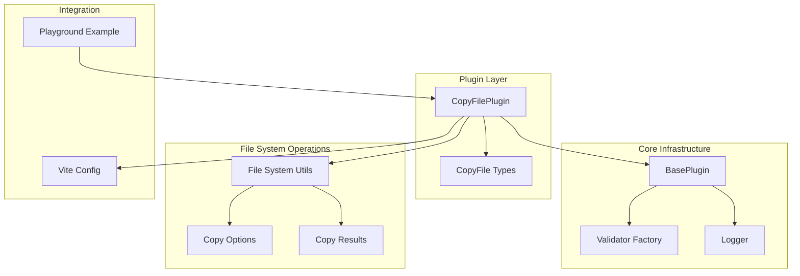
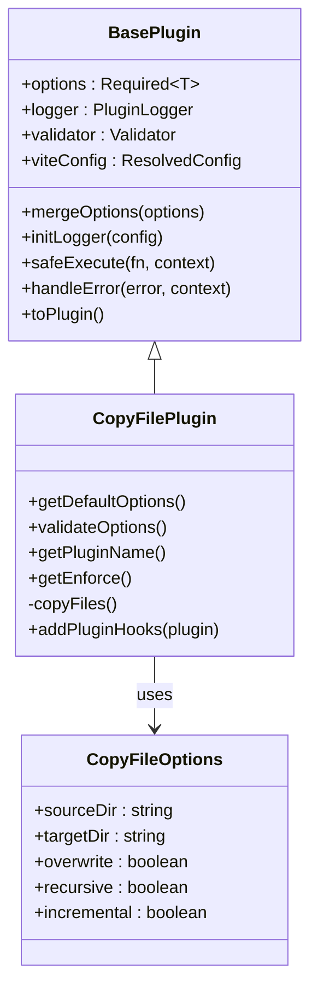
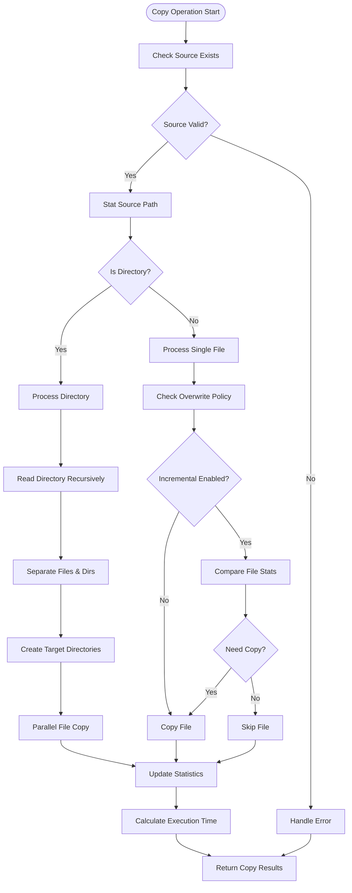
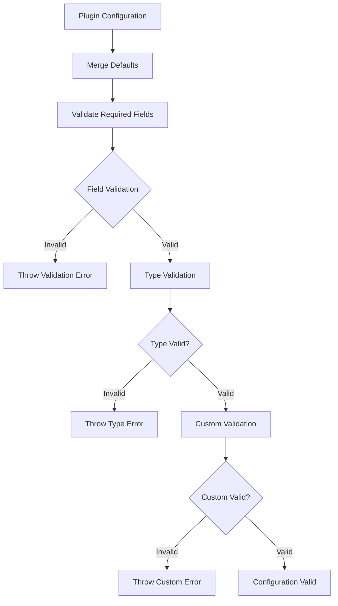
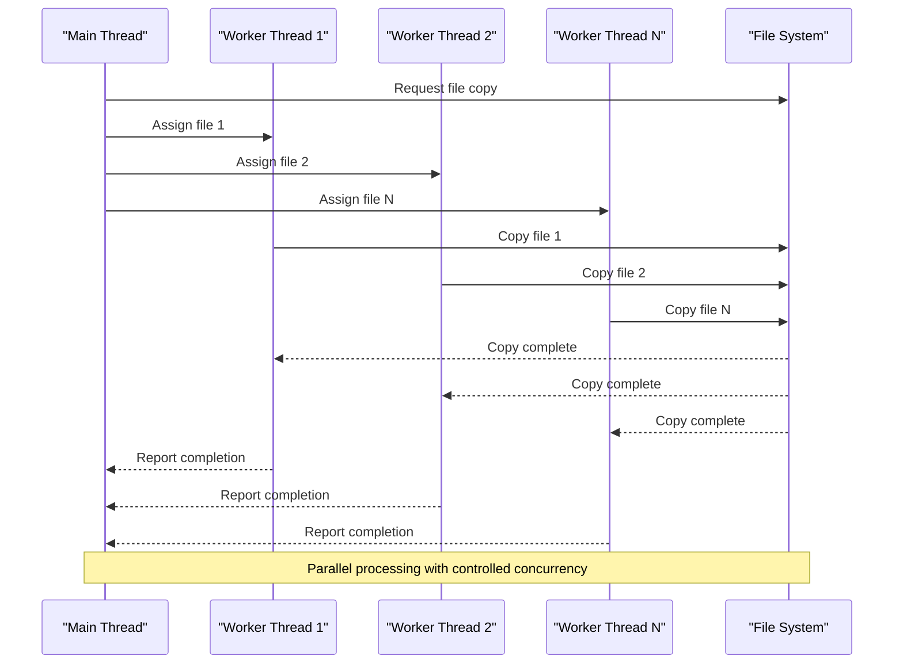
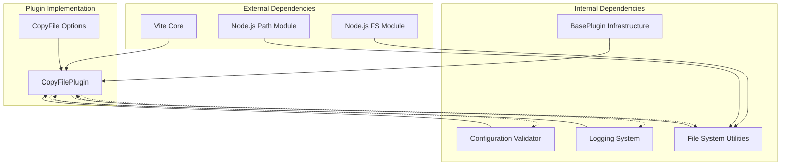

# Copy File Plugin

<cite>
**Referenced Files in This Document**
- [index.ts](file://packages/core/src/plugins/copyFile/index.ts)
- [types.ts](file://packages/core/src/plugins/copyFile/types.ts)
- [index.ts](file://packages/core/src/common/fs/index.ts)
- [type.ts](file://packages/core/src/common/fs/type.ts)
- [index.ts](file://packages/core/src/factory/plugin/index.ts)
- [types.ts](file://packages/core/src/factory/plugin/types.ts)
- [index.ts](file://packages/core/src/logger/index.ts)
- [validation.ts](file://packages/core/src/common/validation.ts)
- [copy-file.md](file://packages/docs/src/plugins/copy-file.md)
- [vite.config.ts](file://packages/playground/vite.config.ts)
- [package.json](file://packages/core/package.json)
</cite>

## Table of Contents
1. [Introduction](#introduction)
2. [Project Structure](#project-structure)
3. [Core Components](#core-components)
4. [Architecture Overview](#architecture-overview)
5. [Detailed Component Analysis](#detailed-component-analysis)
6. [Dependency Analysis](#dependency-analysis)
7. [Performance Considerations](#performance-considerations)
8. [Troubleshooting Guide](#troubleshooting-guide)
9. [Conclusion](#conclusion)
10. [Appendices](#appendices)

## Introduction
The Copy File Plugin is a Vite plugin designed to copy files and directories during the build process. It provides advanced capabilities including recursive operations, incremental updates, and concurrent processing to optimize build performance. The plugin integrates seamlessly into Vite's build pipeline, executing after other build tasks to ensure assets are copied reliably.

Key features include:
- Post-build execution timing for reliable asset copying
- Recursive directory traversal with configurable depth
- Incremental copying that only transfers modified files
- Concurrent file processing with adjustable parallel limits
- Comprehensive error handling with configurable strategies
- Rich logging and debugging capabilities

## Project Structure
The plugin follows a modular architecture with clear separation of concerns across several layers:

**Diagram sources**
- [index.ts](file://packages/core/src/plugins/copyFile/index.ts#L1-L121)
- [index.ts](file://packages/core/src/factory/plugin/index.ts#L1-L386)
- [index.ts](file://packages/core/src/common/fs/index.ts#L1-L292)

**Section sources**
- [index.ts](file://packages/core/src/plugins/copyFile/index.ts#L1-L121)
- [index.ts](file://packages/core/src/factory/plugin/index.ts#L1-L386)

## Core Components
The Copy File Plugin consists of several interconnected components that work together to provide robust file copying capabilities:

### Plugin Architecture
The plugin extends a base plugin class that provides common functionality for all plugins in the ecosystem. This architecture ensures consistency across different plugin types while allowing specific implementations to customize behavior.

### Configuration System
The plugin uses a comprehensive configuration system that validates inputs, merges defaults, and provides flexible option handling. Configuration options include source/target paths, overwrite controls, recursion settings, and performance tuning parameters.

### File System Operations
Advanced file system operations handle directory traversal, file comparison, and concurrent processing. The implementation optimizes for performance while maintaining reliability and error handling.

**Section sources**
- [index.ts](file://packages/core/src/plugins/copyFile/index.ts#L13-L87)
- [types.ts](file://packages/core/src/plugins/copyFile/types.ts#L8-L43)
- [index.ts](file://packages/core/src/factory/plugin/index.ts#L27-L348)

## Architecture Overview
The plugin architecture follows a layered approach with clear boundaries between concerns:

```mermaid
sequenceDiagram
participant Vite as "Vite Build System"
participant Plugin as "CopyFilePlugin"
participant FS as "File System Utils"
participant Logger as "Logger"
participant Validator as "Validator"
Vite->>Plugin : Initialize plugin
Plugin->>Validator : Validate configuration
Validator-->>Plugin : Configuration validated
Plugin->>Logger : Initialize logging
Plugin->>Vite : Register writeBundle hook
Vite->>Plugin : writeBundle event
Plugin->>Plugin : Extract options
Plugin->>FS : Check source exists
FS-->>Plugin : Source verified
Plugin->>FS : Copy files with options
FS->>FS : Process files concurrently
FS-->>Plugin : Copy results
Plugin->>Logger : Log success metrics
Plugin-->>Vite : Complete
Note over Plugin,FS : Concurrent processing with parallel limits
```

**Diagram sources**
- [index.ts](file://packages/core/src/plugins/copyFile/index.ts#L58-L86)
- [index.ts](file://packages/core/src/common/fs/index.ts#L160-L253)

The architecture emphasizes:
- **Post-build execution**: Ensures other build tasks complete before copying
- **Concurrent processing**: Optimizes performance through parallel file operations
- **Robust error handling**: Provides multiple strategies for handling failures
- **Comprehensive logging**: Enables detailed monitoring and debugging

## Detailed Component Analysis

### CopyFilePlugin Class
The core plugin class extends the base plugin infrastructure and implements specific file copying logic:

**Diagram sources**
- [index.ts](file://packages/core/src/plugins/copyFile/index.ts#L13-L87)
- [types.ts](file://packages/core/src/plugins/copyFile/types.ts#L8-L43)
- [index.ts](file://packages/core/src/factory/plugin/index.ts#L27-L348)

**Section sources**
- [index.ts](file://packages/core/src/plugins/copyFile/index.ts#L13-L87)
- [types.ts](file://packages/core/src/plugins/copyFile/types.ts#L8-L43)

### File System Operations
The file system layer provides optimized operations for handling file copying with advanced features:

**Diagram sources**
- [index.ts](file://packages/core/src/common/fs/index.ts#L160-L253)
- [index.ts](file://packages/core/src/common/fs/index.ts#L123-L142)

**Section sources**
- [index.ts](file://packages/core/src/common/fs/index.ts#L160-L253)
- [index.ts](file://packages/core/src/common/fs/index.ts#L123-L142)

### Configuration and Validation
The plugin implements a comprehensive validation system that ensures configuration correctness:

**Diagram sources**
- [index.ts](file://packages/core/src/plugins/copyFile/index.ts#L22-L40)
- [validation.ts](file://packages/core/src/common/validation.ts#L16-L202)

**Section sources**
- [index.ts](file://packages/core/src/plugins/copyFile/index.ts#L22-L40)
- [validation.ts](file://packages/core/src/common/validation.ts#L16-L202)

### Concurrency Management
The plugin implements sophisticated concurrency control to optimize file copying performance:

**Diagram sources**
- [index.ts](file://packages/core/src/common/fs/index.ts#L123-L142)

**Section sources**
- [index.ts](file://packages/core/src/common/fs/index.ts#L123-L142)

## Dependency Analysis
The plugin has a well-defined dependency structure that promotes modularity and maintainability:

**Diagram sources**
- [index.ts](file://packages/core/src/plugins/copyFile/index.ts#L1-L5)
- [index.ts](file://packages/core/src/factory/plugin/index.ts#L1-L6)
- [index.ts](file://packages/core/src/common/fs/index.ts#L1-L3)

**Section sources**
- [index.ts](file://packages/core/src/plugins/copyFile/index.ts#L1-L5)
- [index.ts](file://packages/core/src/factory/plugin/index.ts#L1-L6)

## Performance Considerations
The plugin implements several performance optimizations to ensure efficient file copying:

### Concurrency Control
- **Default Parallel Limit**: 10 concurrent file operations
- **Adaptive Worker Pool**: Creates worker threads up to the configured limit
- **Batch Processing**: Processes multiple files in parallel while respecting system resources

### Incremental Updates
- **File Comparison**: Compares modification times and file sizes
- **Selective Copying**: Only copies files that have changed
- **Directory Tracking**: Maintains statistics for copied directories

### Memory Efficiency
- **Streaming Operations**: Uses streaming APIs for large file handling
- **Lazy Loading**: Loads file entries on-demand during directory traversal
- **Resource Cleanup**: Properly manages file handles and memory

### Caching Strategies
- **Stat Caching**: Caches file metadata to reduce system calls
- **Path Resolution**: Resolves paths once and reuses results
- **Directory Creation**: Pre-creates target directories to minimize mkdir calls

## Troubleshooting Guide

### Common Configuration Issues
- **Invalid Source Paths**: Ensure source directories exist and are accessible
- **Permission Errors**: Verify read permissions for source files and write permissions for target directories
- **Path Resolution**: Use absolute paths or properly configured relative paths

### Error Handling Strategies
The plugin supports three error handling modes:
- **Throw Mode**: Interrupts build process on errors
- **Log Mode**: Records errors but continues processing
- **Ignore Mode**: Silently continues despite errors

### Debugging and Logging
Enable verbose logging to troubleshoot issues:
- **Verbose Mode**: Detailed execution logs
- **Success Metrics**: File counts and execution times
- **Error Details**: Specific error messages and stack traces

**Section sources**
- [index.ts](file://packages/core/src/plugins/copyFile/index.ts#L283-L311)
- [index.ts](file://packages/core/src/logger/index.ts#L116-L130)

## Conclusion
The Copy File Plugin provides a robust, feature-rich solution for file copying in Vite builds. Its architecture balances performance with reliability through concurrent processing, incremental updates, and comprehensive error handling. The plugin's modular design ensures maintainability while its extensive configuration options accommodate diverse use cases.

Key strengths include:
- **Performance Optimization**: Concurrent file processing with adaptive limits
- **Reliability**: Comprehensive error handling and validation
- **Flexibility**: Extensive configuration options for various scenarios
- **Integration**: Seamless integration with Vite's build pipeline

The plugin serves as an excellent foundation for asset management, template generation, and build artifact handling in modern web development workflows.

## Appendices

### Configuration Reference
| Option | Type | Default | Description |
|--------|------|---------|-------------|
| sourceDir | string | Required | Source directory path |
| targetDir | string | Required | Target directory path |
| overwrite | boolean | true | Overwrite existing files |
| recursive | boolean | true | Copy subdirectories recursively |
| incremental | boolean | true | Only copy modified files |
| enabled | boolean | true | Enable/disable plugin |
| verbose | boolean | true | Enable detailed logging |
| errorStrategy | string | 'throw' | Error handling strategy |

### Integration Examples
The plugin integrates seamlessly with Vite configurations and can be combined with other plugins in the ecosystem.

**Section sources**
- [copy-file.md](file://packages/docs/src/plugins/copy-file.md#L59-L68)
- [vite.config.ts](file://packages/playground/vite.config.ts#L51-L64)