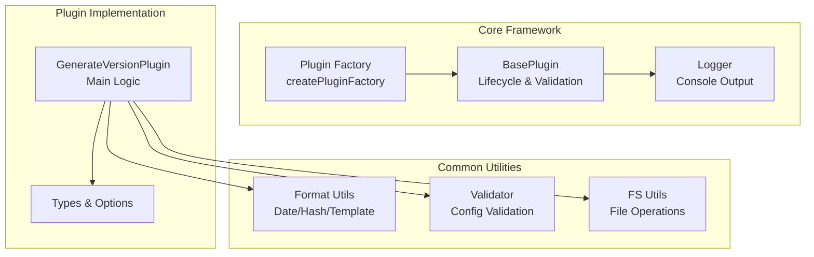
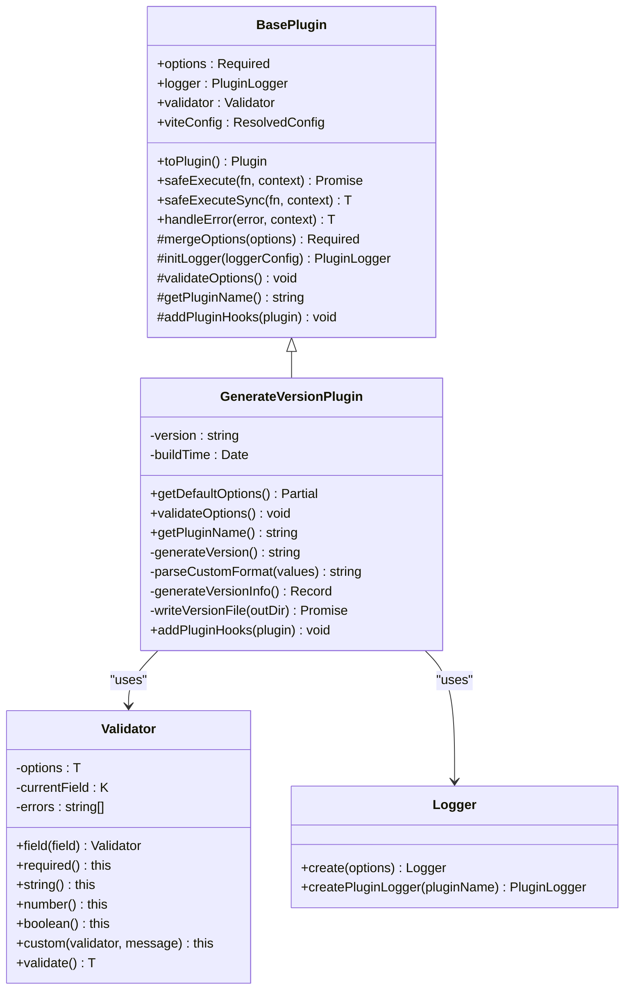
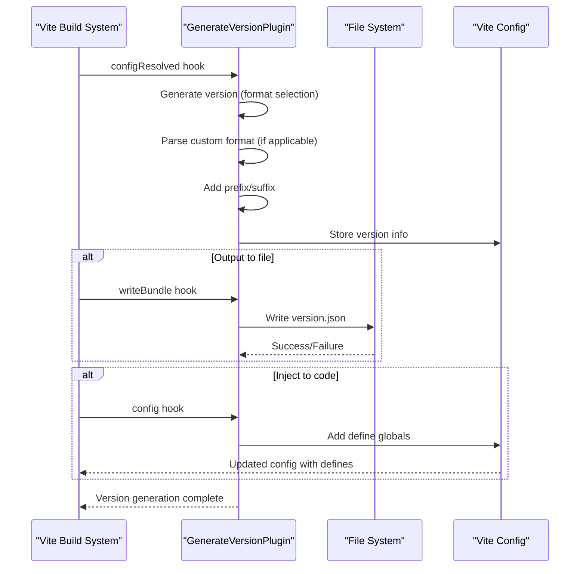
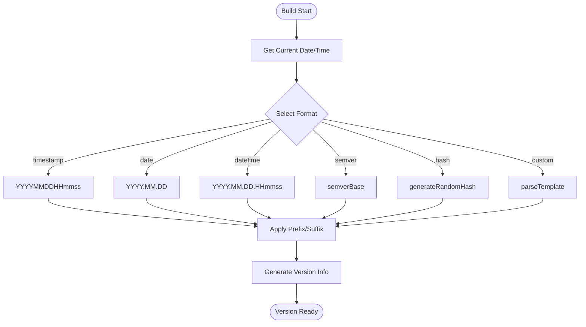
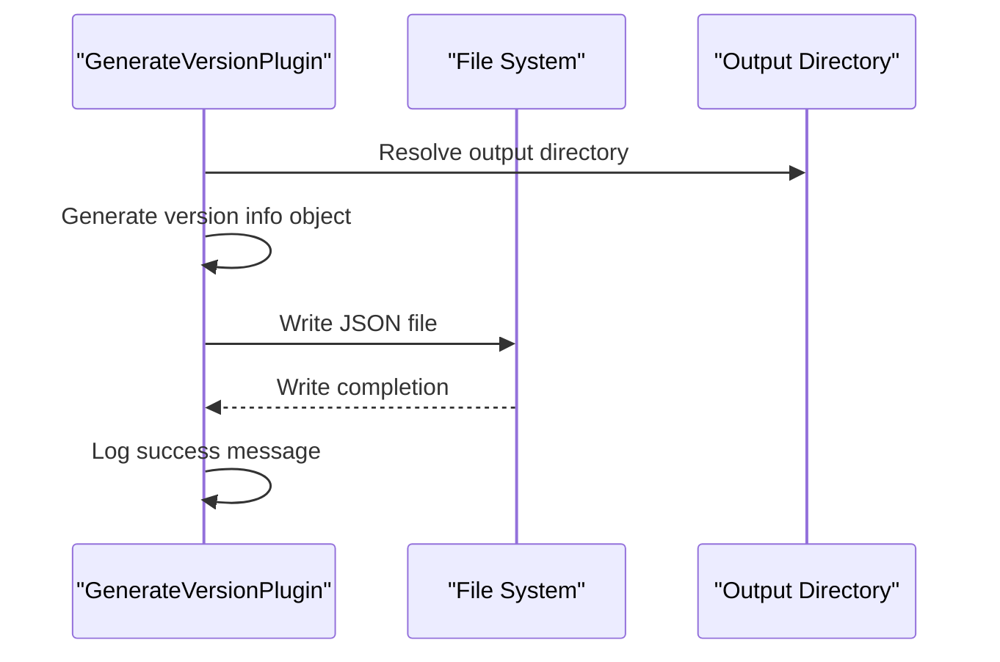
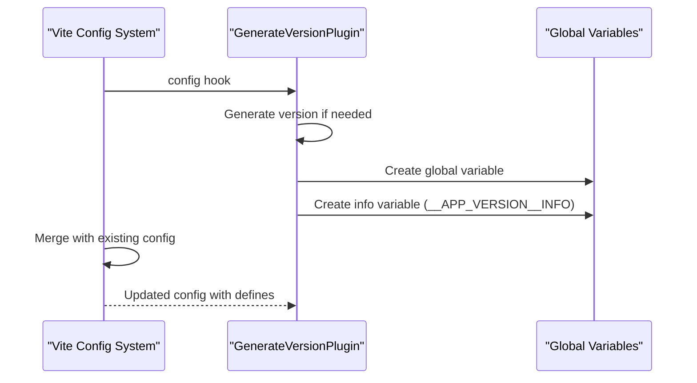
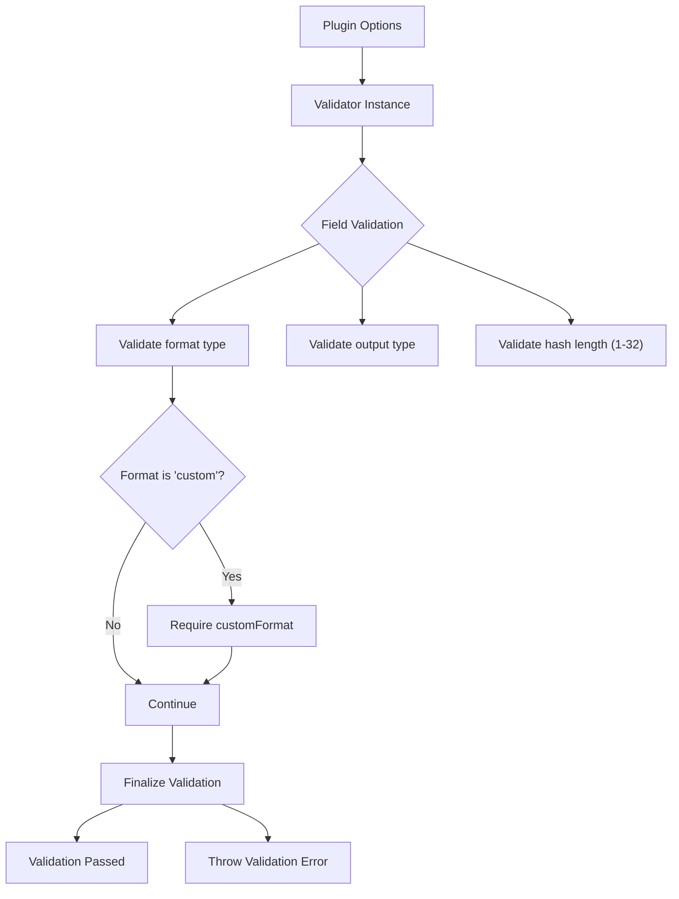
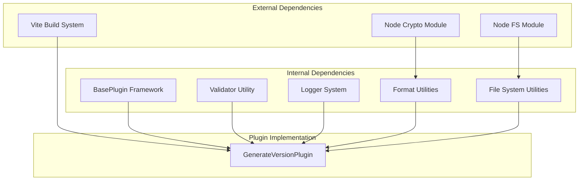

# Generate Version Plugin

<cite>
**Referenced Files in This Document**
- [index.ts](file://packages/core/src/plugins/generateVersion/index.ts)
- [types.ts](file://packages/core/src/plugins/generateVersion/types.ts)
- [format.ts](file://packages/core/src/common/format.ts)
- [validation.ts](file://packages/core/src/common/validation.ts)
- [fs/index.ts](file://packages/core/src/common/fs/index.ts)
- [plugin/index.ts](file://packages/core/src/factory/plugin/index.ts)
- [logger/index.ts](file://packages/core/src/logger/index.ts)
- [generate-version.md](file://packages/docs/src/plugins/generate-version.md)
- [package.json](file://packages/core/package.json)
</cite>

## Table of Contents
1. [Introduction](#introduction)
2. [Project Structure](#project-structure)
3. [Core Components](#core-components)
4. [Architecture Overview](#architecture-overview)
5. [Detailed Component Analysis](#detailed-component-analysis)
6. [Dependency Analysis](#dependency-analysis)
7. [Performance Considerations](#performance-considerations)
8. [Troubleshooting Guide](#troubleshooting-guide)
9. [Conclusion](#conclusion)
10. [Appendices](#appendices)

## Introduction
The Generate Version Plugin is a Vite plugin designed to automatically generate version identifiers during the build process. It supports multiple versioning strategies including timestamp, date, semantic versioning, and hash generation. The plugin can output versions to files, inject them into compiled code, or both, enabling flexible integration with CI/CD pipelines and application runtime environments.

Key capabilities:
- Multi-format version generation (timestamp, date, datetime, semver, hash, custom)
- Dual output modes (file and/or code injection)
- Customizable templates and format specifiers
- Build metadata inclusion
- Robust configuration validation and error handling
- Performance-optimized file writing and template parsing

## Project Structure
The plugin is part of a modular Vite plugin framework with shared utilities for formatting, validation, file system operations, and logging.



**Diagram sources**
- [plugin/index.ts](file://packages/core/src/factory/plugin/index.ts#L27-L348)
- [format.ts](file://packages/core/src/common/format.ts#L1-L137)
- [validation.ts](file://packages/core/src/common/validation.ts#L16-L203)
- [fs/index.ts](file://packages/core/src/common/fs/index.ts#L261-L272)
- [index.ts](file://packages/core/src/plugins/generateVersion/index.ts#L14-L197)
- [types.ts](file://packages/core/src/plugins/generateVersion/types.ts#L31-L120)

**Section sources**
- [index.ts](file://packages/core/src/plugins/generateVersion/index.ts#L1-L257)
- [types.ts](file://packages/core/src/plugins/generateVersion/types.ts#L1-L120)
- [plugin/index.ts](file://packages/core/src/factory/plugin/index.ts#L1-L386)
- [format.ts](file://packages/core/src/common/format.ts#L1-L137)
- [validation.ts](file://packages/core/src/common/validation.ts#L1-L203)
- [fs/index.ts](file://packages/core/src/common/fs/index.ts#L1-L292)

## Core Components
The plugin consists of several interconnected components that handle configuration, validation, version generation, output, and lifecycle management.

### Plugin Architecture


**Diagram sources**
- [plugin/index.ts](file://packages/core/src/factory/plugin/index.ts#L27-L348)
- [index.ts](file://packages/core/src/plugins/generateVersion/index.ts#L14-L197)
- [validation.ts](file://packages/core/src/common/validation.ts#L16-L203)
- [logger/index.ts](file://packages/core/src/logger/index.ts#L7-L146)

### Configuration Options
The plugin exposes a comprehensive set of configuration options for controlling version generation behavior:

| Option | Type | Default | Description |
|--------|------|---------|-------------|
| format | VersionFormat | 'timestamp' | Version format type |
| customFormat | string | - | Template for custom format |
| semverBase | string | '1.0.0' | Base semantic version |
| autoIncrement | boolean | false | Auto-increment patch version |
| outputType | OutputType | 'file' | Output destination |
| outputFile | string | 'version.json' | File path for output |
| defineName | string | '__APP_VERSION__' | Global variable name |
| hashLength | number | 8 | Hash length (1-32) |
| prefix | string | '' | Version prefix |
| suffix | string | '' | Version suffix |
| extra | Record<string, any> | - | Additional metadata |

**Section sources**
- [types.ts](file://packages/core/src/plugins/generateVersion/types.ts#L31-L120)
- [index.ts](file://packages/core/src/plugins/generateVersion/index.ts#L25-L54)

## Architecture Overview
The plugin integrates with Vite's build lifecycle through carefully orchestrated hooks that ensure consistent version generation across the entire build process.



**Diagram sources**
- [index.ts](file://packages/core/src/plugins/generateVersion/index.ts#L146-L196)
- [fs/index.ts](file://packages/core/src/common/fs/index.ts#L261-L272)

## Detailed Component Analysis

### Version Generation Algorithms
The plugin implements multiple version generation strategies through a centralized algorithm selector:



**Diagram sources**
- [index.ts](file://packages/core/src/plugins/generateVersion/index.ts#L63-L103)
- [format.ts](file://packages/core/src/common/format.ts#L76-L88)

#### Format-Specific Implementations
Each format type follows a distinct algorithm pattern:

**Timestamp Format**: Concatenates year, month, day, hour, minute, and second components into a continuous numeric string.

**Date Format**: Uses dot-separated year, month, and day components for human-readable identification.

**Datetime Format**: Combines date and time components with dot separators for precise timestamping.

**Semver Format**: Returns the configured base semantic version without modification.

**Hash Format**: Generates cryptographically secure random hexadecimal strings of configurable length.

**Custom Format**: Processes template strings with placeholder substitution using date/time and hash values.

**Section sources**
- [index.ts](file://packages/core/src/plugins/generateVersion/index.ts#L69-L103)
- [format.ts](file://packages/core/src/common/format.ts#L76-L136)

### Output Generation Mechanisms
The plugin supports three distinct output mechanisms with different integration points:

#### File Output


**Diagram sources**
- [index.ts](file://packages/core/src/plugins/generateVersion/index.ts#L138-L144)
- [fs/index.ts](file://packages/core/src/common/fs/index.ts#L261-L272)

#### Code Injection


**Diagram sources**
- [index.ts](file://packages/core/src/plugins/generateVersion/index.ts#L163-L183)

### Configuration Validation
The plugin employs a fluent validator API to ensure configuration correctness before initialization:



**Diagram sources**
- [validation.ts](file://packages/core/src/common/validation.ts#L16-L203)
- [index.ts](file://packages/core/src/plugins/generateVersion/index.ts#L39-L54)

**Section sources**
- [validation.ts](file://packages/core/src/common/validation.ts#L16-L203)
- [index.ts](file://packages/core/src/plugins/generateVersion/index.ts#L39-L54)

## Dependency Analysis
The plugin maintains loose coupling through dependency injection and shared utilities, enabling extensibility while maintaining stability.



**Diagram sources**
- [index.ts](file://packages/core/src/plugins/generateVersion/index.ts#L1-L6)
- [format.ts](file://packages/core/src/common/format.ts#L1)
- [fs/index.ts](file://packages/core/src/common/fs/index.ts#L1-L3)

### Error Handling Strategy
The plugin implements a comprehensive error handling mechanism with configurable strategies:

| Strategy | Behavior | Use Case |
|----------|----------|----------|
| throw | Immediately halt build with error | Production environments requiring strict validation |
| log | Continue execution with error logging | Development environments for debugging |
| ignore | Continue execution silently | Background processes where failures are acceptable |

**Section sources**
- [plugin/index.ts](file://packages/core/src/factory/plugin/index.ts#L283-L311)
- [generate-version.md](file://packages/docs/src/plugins/generate-version.md#L255-L259)

## Performance Considerations
The plugin is optimized for minimal impact on build performance through strategic design choices:

### Memory Management
- Single version string storage per plugin instance
- Reuse of date formatting parameters across operations
- Efficient template replacement using string replace operations

### File I/O Optimization
- Asynchronous file writing prevents blocking the main thread
- Atomic write operations ensure data integrity
- Minimal file system operations during build process

### Template Processing Efficiency
- Pre-computed date parameter objects reduce repeated calculations
- Optimized string replacement algorithms minimize computational overhead
- Hash generation uses efficient cryptographic primitives

## Troubleshooting Guide

### Common Configuration Issues
**Invalid Format Type**: Ensure format is one of the supported types ('timestamp', 'date', 'datetime', 'semver', 'hash', 'custom').

**Missing Custom Template**: When format is 'custom', customFormat must be provided with valid placeholders.

**Hash Length Out of Range**: hashLength must be between 1 and 32 characters.

**Output Type Mismatch**: outputType must be 'file', 'define', or 'both'.

### Build Process Integration
**Version Not Available in Code**: Verify that outputType includes 'define' or 'both' and that defineName is correctly referenced in source code.

**File Not Generated**: Check outputType includes 'file' or 'both' and that outputFile path is writable.

**Timing Issues**: Version generation occurs during configResolved hook, ensuring consistency across all build stages.

**Section sources**
- [generate-version.md](file://packages/docs/src/plugins/generate-version.md#L247-L259)
- [index.ts](file://packages/core/src/plugins/generateVersion/index.ts#L39-L54)

## Conclusion
The Generate Version Plugin provides a robust, flexible solution for automated version management in Vite projects. Its multi-format support, dual output capabilities, and comprehensive validation make it suitable for diverse deployment scenarios including continuous integration, release management, and development workflows. The plugin's architecture ensures minimal performance impact while providing reliable version generation across complex build processes.

Key strengths:
- Comprehensive format support with extensible template system
- Flexible output mechanisms for various integration needs
- Robust validation and error handling strategies
- Performance-optimized implementation with minimal build overhead
- Extensive documentation and practical examples

## Appendices

### Practical Usage Examples

#### Continuous Deployment Strategy
```typescript
generateVersion({
  format: 'timestamp',
  outputType: 'both',
  outputFile: 'build-info.json',
  defineName: '__BUILD_VERSION__'
})
```

#### Release Management Approach
```typescript
generateVersion({
  format: 'semver',
  semverBase: '1.0.0',
  prefix: 'v',
  outputType: 'file',
  extra: {
    environment: 'production',
    commit: process.env.GITHUB_SHA,
    branch: process.env.GITHUB_REF_NAME
  }
})
```

#### Development Build Pattern
```typescript
generateVersion({
  format: 'custom',
  customFormat: '{YYYY}.{MM}.{DD}-{hash}',
  hashLength: 6,
  outputType: 'define',
  defineName: '__DEV_VERSION__'
})
```

### Format Specifiers Reference
| Specifier | Description | Example |
|-----------|-------------|---------|
| {YYYY} | Four-digit year | 2026 |
| {YY} | Two-digit year | 26 |
| {MM} | Two-digit month | 02 |
| {DD} | Two-digit day | 03 |
| {HH} | Two-digit hour | 15 |
| {mm} | Two-digit minute | 30 |
| {ss} | Two-digit second | 00 |
| {SSS} | Three-digit millisecond | 123 |
| {timestamp} | Unix timestamp | 1738567800000 |
| {hash} | Random hash | a1b2c3d4 |
| {major} | Semantic major | 1 |
| {minor} | Semantic minor | 0 |
| {patch} | Semantic patch | 0 |

**Section sources**
- [generate-version.md](file://packages/docs/src/plugins/generate-version.md#L88-L105)
- [format.ts](file://packages/core/src/common/format.ts#L43-L88)