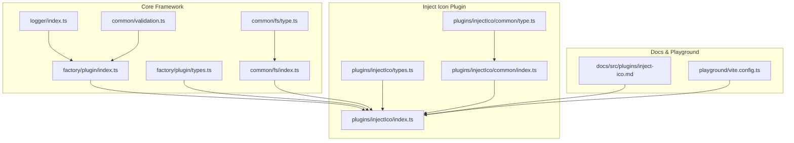
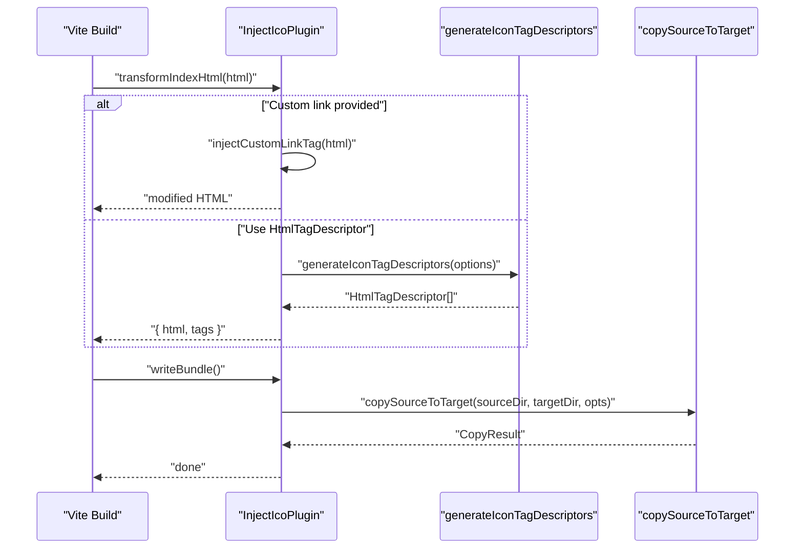
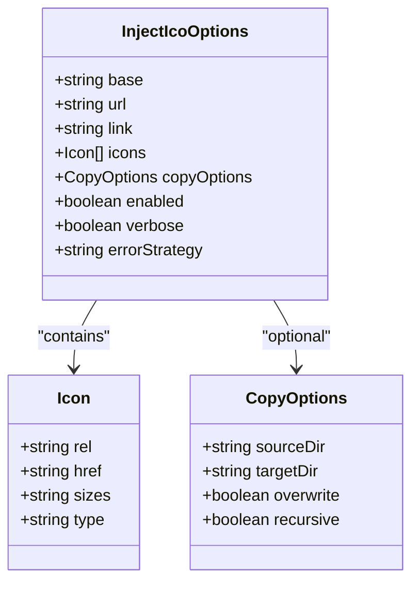
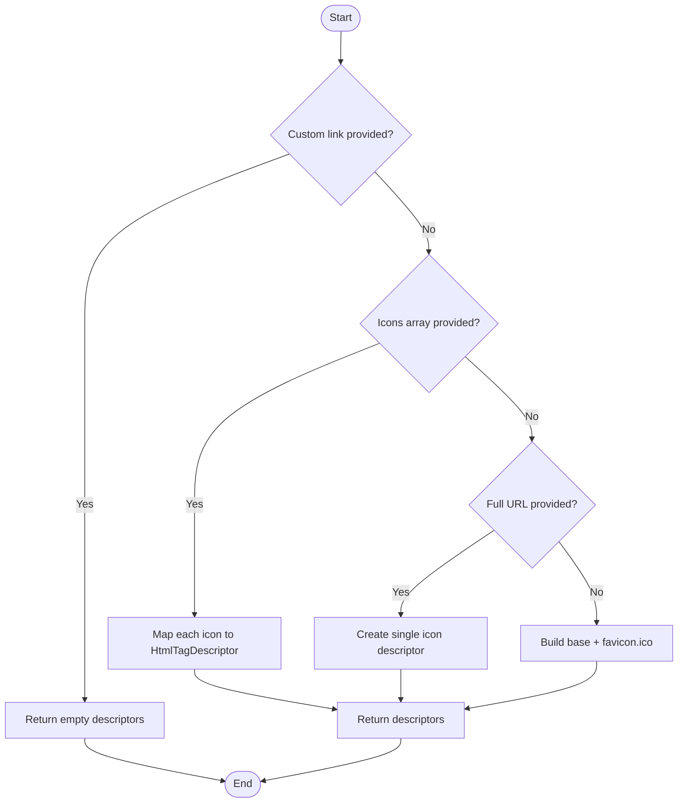
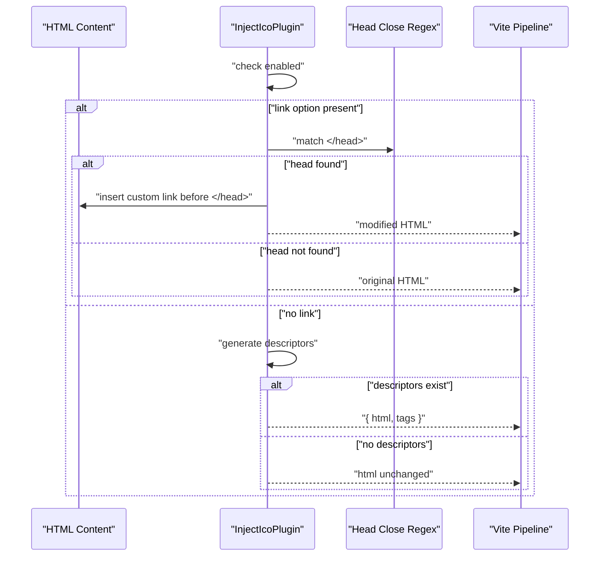
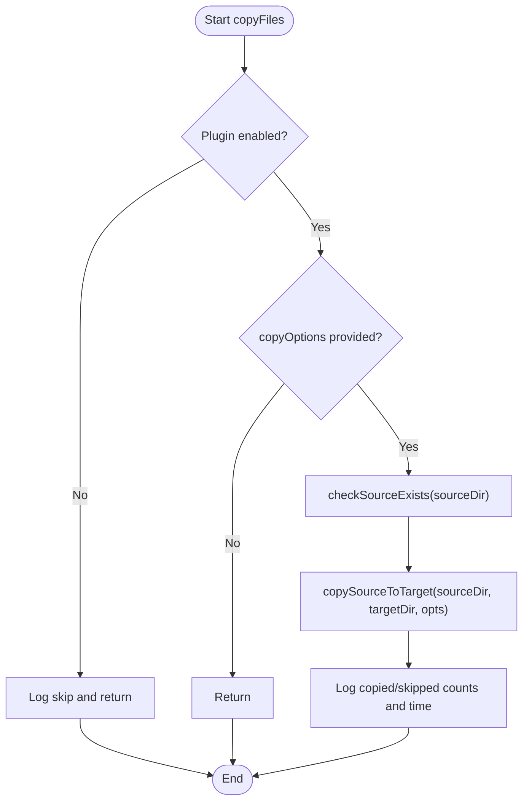
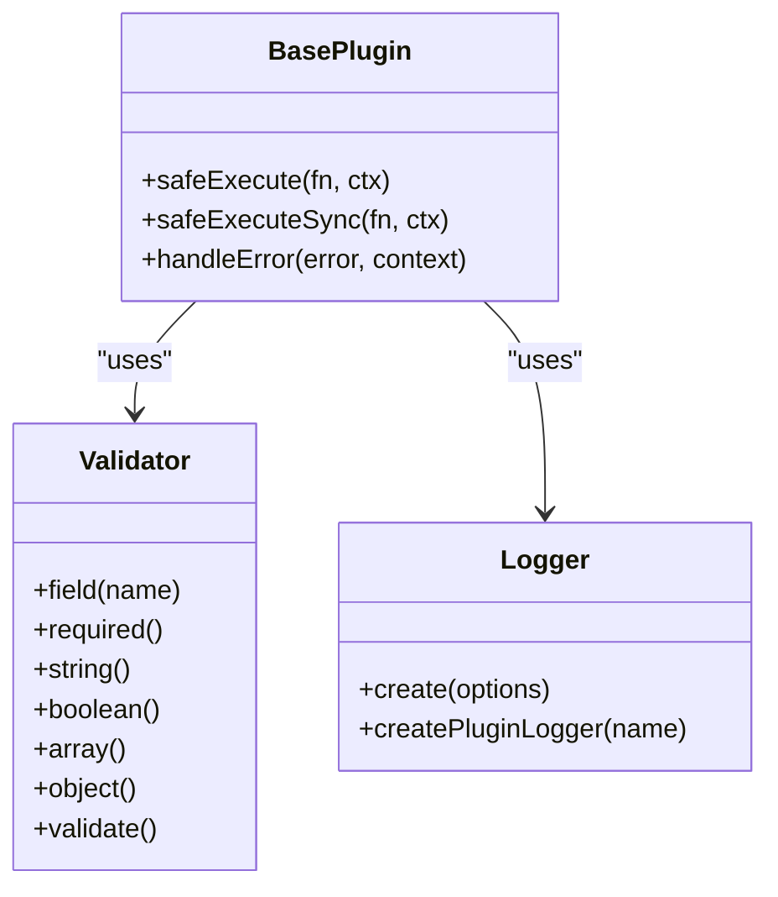
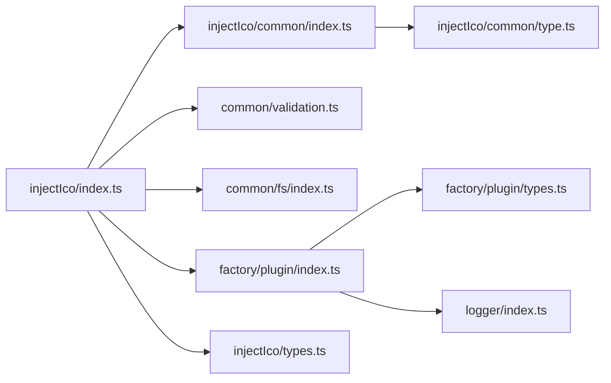

# Inject Icon Plugin

<cite>
**Referenced Files in This Document**
- [index.ts](file://packages/core/src/plugins/injectIco/index.ts)
- [types.ts](file://packages/core/src/plugins/injectIco/types.ts)
- [common/index.ts](file://packages/core/src/plugins/injectIco/common/index.ts)
- [common/type.ts](file://packages/core/src/plugins/injectIco/common/type.ts)
- [inject-ico.md](file://packages/docs/src/plugins/inject-ico.md)
- [factory/plugin/index.ts](file://packages/core/src/factory/plugin/index.ts)
- [factory/plugin/types.ts](file://packages/core/src/factory/plugin/types.ts)
- [common/validation.ts](file://packages/core/src/common/validation.ts)
- [common/fs/index.ts](file://packages/core/src/common/fs/index.ts)
- [common/fs/type.ts](file://packages/core/src/common/fs/type.ts)
- [logger/index.ts](file://packages/core/src/logger/index.ts)
- [index.ts](file://packages/core/src/index.ts)
- [vite.config.ts](file://packages/playground/vite.config.ts)
- [package.json](file://packages/core/package.json)
</cite>

## Table of Contents
1. [Introduction](#introduction)
2. [Project Structure](#project-structure)
3. [Core Components](#core-components)
4. [Architecture Overview](#architecture-overview)
5. [Detailed Component Analysis](#detailed-component-analysis)
6. [Dependency Analysis](#dependency-analysis)
7. [Performance Considerations](#performance-considerations)
8. [Troubleshooting Guide](#troubleshooting-guide)
9. [Conclusion](#conclusion)
10. [Appendices](#appendices)

## Introduction
The Inject Icon Plugin integrates with Vite's HTML pipeline to inject favicon and app icons into HTML documents. It supports multiple configuration strategies for icon sources, HTML tag generation via Vite's native HtmlTagDescriptor API, and optional file copying with robust fallbacks and error handling. This document explains configuration options, processing workflow, fallback mechanisms, and integration points with Vite and the file system.

## Project Structure
The plugin is part of a modular Vite plugin framework with shared utilities for validation, logging, and file operations.

**Diagram sources**
- [factory/plugin/index.ts](file://packages/core/src/factory/plugin/index.ts#L1-L386)
- [factory/plugin/types.ts](file://packages/core/src/factory/plugin/types.ts#L1-L46)
- [logger/index.ts](file://packages/core/src/logger/index.ts#L1-L181)
- [common/validation.ts](file://packages/core/src/common/validation.ts#L1-L203)
- [common/fs/index.ts](file://packages/core/src/common/fs/index.ts#L1-L292)
- [common/fs/type.ts](file://packages/core/src/common/fs/type.ts#L1-L55)
- [plugins/injectIco/index.ts](file://packages/core/src/plugins/injectIco/index.ts#L1-L195)
- [plugins/injectIco/types.ts](file://packages/core/src/plugins/injectIco/types.ts#L1-L113)
- [plugins/injectIco/common/index.ts](file://packages/core/src/plugins/injectIco/common/index.ts#L1-L60)
- [plugins/injectIco/common/type.ts](file://packages/core/src/plugins/injectIco/common/type.ts#L1-L47)
- [docs/src/plugins/inject-ico.md](file://packages/docs/src/plugins/inject-ico.md#L1-L258)
- [playground/vite.config.ts](file://packages/playground/vite.config.ts#L1-L100)

**Section sources**
- [index.ts](file://packages/core/src/index.ts#L1-L8)
- [package.json](file://packages/core/package.json#L1-L73)

## Core Components
- InjectIcoPlugin: Implements the plugin lifecycle, HTML tag generation, custom link injection, and file copy operations.
- Icon configuration model: Defines supported icon descriptors and copy options.
- Tag descriptor generator: Produces Vite-compatible HtmlTagDescriptor entries.
- Validation utilities: Enforce configuration correctness.
- File system utilities: Robust copy operations with incremental updates and concurrency.
- Logging: Centralized logging with per-plugin control.

Key responsibilities:
- Generate icon tags using Vite's HtmlTagDescriptor API when a custom link is not provided.
- Inject a custom link tag when configured.
- Validate options and handle errors according to the configured strategy.
- Copy icon assets to the output directory after bundle write.

**Section sources**
- [index.ts](file://packages/core/src/plugins/injectIco/index.ts#L14-L195)
- [types.ts](file://packages/core/src/plugins/injectIco/types.ts#L66-L113)
- [common/index.ts](file://packages/core/src/plugins/injectIco/common/index.ts#L10-L60)
- [common/type.ts](file://packages/core/src/plugins/injectIco/common/type.ts#L6-L47)
- [factory/plugin/index.ts](file://packages/core/src/factory/plugin/index.ts#L27-L348)
- [common/validation.ts](file://packages/core/src/common/validation.ts#L16-L203)
- [common/fs/index.ts](file://packages/core/src/common/fs/index.ts#L160-L253)
- [logger/index.ts](file://packages/core/src/logger/index.ts#L7-L181)

## Architecture Overview
The plugin participates in two Vite hooks:
- transformIndexHtml: Injects icon tags or custom link into HTML.
- writeBundle: Copies icon assets to the output directory when configured.

**Diagram sources**
- [index.ts](file://packages/core/src/plugins/injectIco/index.ts#L131-L157)
- [common/index.ts](file://packages/core/src/plugins/injectIco/common/index.ts#L10-L60)
- [common/fs/index.ts](file://packages/core/src/common/fs/index.ts#L160-L253)

## Detailed Component Analysis

### Configuration Model and Options
- Base path management: Controls the base URL for default favicon resolution.
- URL override: Full icon URL takes precedence over base path.
- Custom link: When present, overrides all other icon generation strategies.
- Icons array: Allows multiple icon descriptors with rel, href, sizes, and type.
- Copy options: Enables asset copying with overwrite, recursive, and incremental controls.

**Diagram sources**
- [types.ts](file://packages/core/src/plugins/injectIco/types.ts#L66-L113)
- [types.ts](file://packages/core/src/plugins/injectIco/types.ts#L8-L28)
- [types.ts](file://packages/core/src/plugins/injectIco/types.ts#L35-L63)

**Section sources**
- [types.ts](file://packages/core/src/plugins/injectIco/types.ts#L66-L113)
- [inject-ico.md](file://packages/docs/src/plugins/inject-ico.md#L69-L90)

### Icon Tag Generation Workflow
The generator selects the appropriate strategy:
- If a custom link is provided, return empty descriptors (caller handles string injection).
- Else if icons array is provided, convert each item to a HtmlTagDescriptor with rel, href, sizes, type.
- Else if a full URL is provided, create a single icon link descriptor.
- Else construct a default favicon link using base path.

**Diagram sources**
- [common/index.ts](file://packages/core/src/plugins/injectIco/common/index.ts#L10-L60)

**Section sources**
- [common/index.ts](file://packages/core/src/plugins/injectIco/common/index.ts#L10-L60)

### HTML Transformation Mechanisms
- Precedence order: link > icons > url > base.
- When link is set, the plugin performs a string-based insertion before the closing head tag.
- Otherwise, it uses Vite's HtmlTagDescriptor API to inject structured tags.

**Diagram sources**
- [index.ts](file://packages/core/src/plugins/injectIco/index.ts#L69-L90)
- [index.ts](file://packages/core/src/plugins/injectIco/index.ts#L131-L152)

**Section sources**
- [index.ts](file://packages/core/src/plugins/injectIco/index.ts#L69-L90)
- [index.ts](file://packages/core/src/plugins/injectIco/index.ts#L131-L152)
- [inject-ico.md](file://packages/docs/src/plugins/inject-ico.md#L243-L258)

### File Copy Operations and Fallbacks
- Triggered after bundle write when copyOptions is provided.
- Validates source existence, ensures target directories, and copies files with configurable overwrite and recursive behavior.
- Incremental mode compares modification time and size to avoid unnecessary copies.
- Concurrency is controlled to optimize throughput.

**Diagram sources**
- [index.ts](file://packages/core/src/plugins/injectIco/index.ts#L102-L129)
- [common/fs/index.ts](file://packages/core/src/common/fs/index.ts#L160-L253)

**Section sources**
- [index.ts](file://packages/core/src/plugins/injectIco/index.ts#L102-L129)
- [common/fs/index.ts](file://packages/core/src/common/fs/index.ts#L160-L253)

### Error Handling and Validation
- Configuration validation uses a fluent validator to enforce required fields and types.
- Error handling strategy determines whether to throw, log, or ignore errors during execution.
- Logging is centralized and plugin-specific, enabling fine-grained verbosity control.

**Diagram sources**
- [common/validation.ts](file://packages/core/src/common/validation.ts#L16-L203)
- [factory/plugin/index.ts](file://packages/core/src/factory/plugin/index.ts#L225-L311)
- [logger/index.ts](file://packages/core/src/logger/index.ts#L7-L181)

**Section sources**
- [common/validation.ts](file://packages/core/src/common/validation.ts#L16-L203)
- [factory/plugin/index.ts](file://packages/core/src/factory/plugin/index.ts#L225-L311)
- [logger/index.ts](file://packages/core/src/logger/index.ts#L7-L181)

### Practical Examples
- Basic base path usage: Configure base to prepend to the default favicon path.
- Custom icon set: Provide an array of icon descriptors with rel, href, sizes, and type.
- Full URL override: Supply a complete icon URL to bypass base path logic.
- Custom link injection: Insert a raw link tag string for advanced scenarios.
- Asset copying: Enable copyOptions to mirror icon assets to the output directory with overwrite and recursive flags.

Refer to the documentation page for complete examples and configuration tables.

**Section sources**
- [inject-ico.md](file://packages/docs/src/plugins/inject-ico.md#L18-L258)
- [vite.config.ts](file://packages/playground/vite.config.ts#L26-L43)

## Dependency Analysis
The plugin depends on shared framework components for lifecycle, validation, logging, and file operations.

**Diagram sources**
- [index.ts](file://packages/core/src/plugins/injectIco/index.ts#L1-L6)
- [common/index.ts](file://packages/core/src/plugins/injectIco/common/index.ts#L1-L2)
- [factory/plugin/index.ts](file://packages/core/src/factory/plugin/index.ts#L1-L5)
- [factory/plugin/types.ts](file://packages/core/src/factory/plugin/types.ts#L1-L46)
- [logger/index.ts](file://packages/core/src/logger/index.ts#L1-L5)
- [common/validation.ts](file://packages/core/src/common/validation.ts#L1-L5)
- [common/fs/index.ts](file://packages/core/src/common/fs/index.ts#L1-L3)
- [plugins/injectIco/types.ts](file://packages/core/src/plugins/injectIco/types.ts#L1-L2)
- [plugins/injectIco/common/type.ts](file://packages/core/src/plugins/injectIco/common/type.ts#L1-L2)

**Section sources**
- [index.ts](file://packages/core/src/index.ts#L1-L8)
- [package.json](file://packages/core/package.json#L17-L43)

## Performance Considerations
- Incremental copying: Compares modification time and size to minimize IO work.
- Concurrency control: Limits concurrent file operations to balance throughput and resource usage.
- Early exits: Skips processing when disabled or when no descriptors are generated.
- Head tag detection: Uses a single regex pass to locate the closing head tag for custom link injection.

Recommendations:
- Prefer incremental copying for large icon sets to reduce rebuild times.
- Use appropriate concurrency limits for CI environments with constrained resources.
- Keep icon sets minimal and targeted to reduce HTML payload.

**Section sources**
- [common/fs/index.ts](file://packages/core/src/common/fs/index.ts#L160-L253)
- [index.ts](file://packages/core/src/plugins/injectIco/index.ts#L102-L129)

## Troubleshooting Guide
Common issues and resolutions:
- Missing closing head tag: Custom link injection requires a closing head tag; otherwise, the plugin logs a warning and skips injection.
- Invalid or missing source directory: Copy operations validate source existence and throw descriptive errors for permission or non-existence issues.
- Configuration validation failures: Ensure required fields are present and of correct types; validation errors are thrown with detailed messages.
- Error strategy impact: Configure errorStrategy to 'log' or 'ignore' to prevent build interruption while still capturing issues.

Operational tips:
- Enable verbose logging to inspect plugin activity and outcomes.
- Verify base path formatting and trailing slashes to avoid incorrect icon URLs.
- Test with minimal icon sets first to isolate configuration problems.

**Section sources**
- [index.ts](file://packages/core/src/plugins/injectIco/index.ts#L69-L90)
- [index.ts](file://packages/core/src/plugins/injectIco/index.ts#L102-L129)
- [common/fs/index.ts](file://packages/core/src/common/fs/index.ts#L27-L40)
- [common/validation.ts](file://packages/core/src/common/validation.ts#L195-L201)
- [inject-ico.md](file://packages/docs/src/plugins/inject-ico.md#L243-L258)

## Conclusion
The Inject Icon Plugin provides a flexible, robust mechanism to inject favicons and app icons into Vite-built HTML, with multiple configuration strategies, strong validation, and efficient file copying. Its integration with Vite's HTML pipeline and shared framework utilities ensures reliable operation across diverse projects and environments.

## Appendices

### Configuration Reference
- Base path: Controls default favicon URL construction.
- URL override: Full icon URL takes precedence.
- Custom link: Raw HTML link tag for advanced needs.
- Icons array: Multiple descriptors with rel, href, sizes, type.
- Copy options: sourceDir, targetDir, overwrite, recursive, incremental.

**Section sources**
- [types.ts](file://packages/core/src/plugins/injectIco/types.ts#L66-L113)
- [inject-ico.md](file://packages/docs/src/plugins/inject-ico.md#L69-L90)