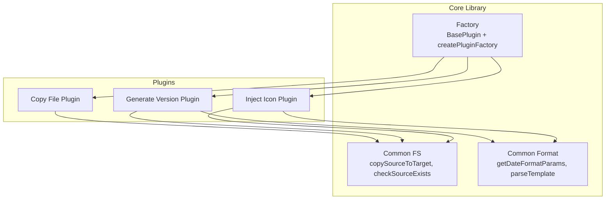
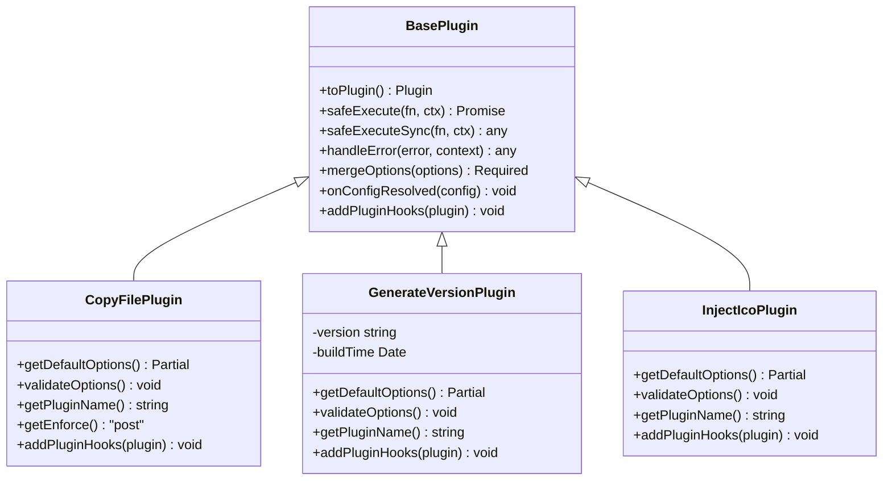
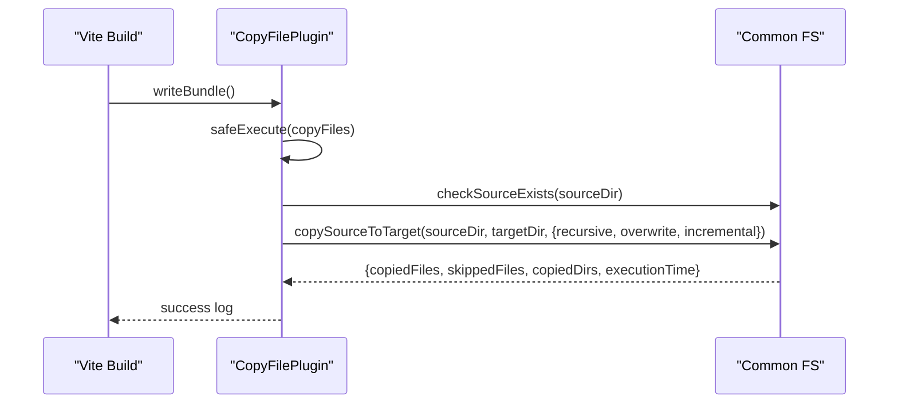
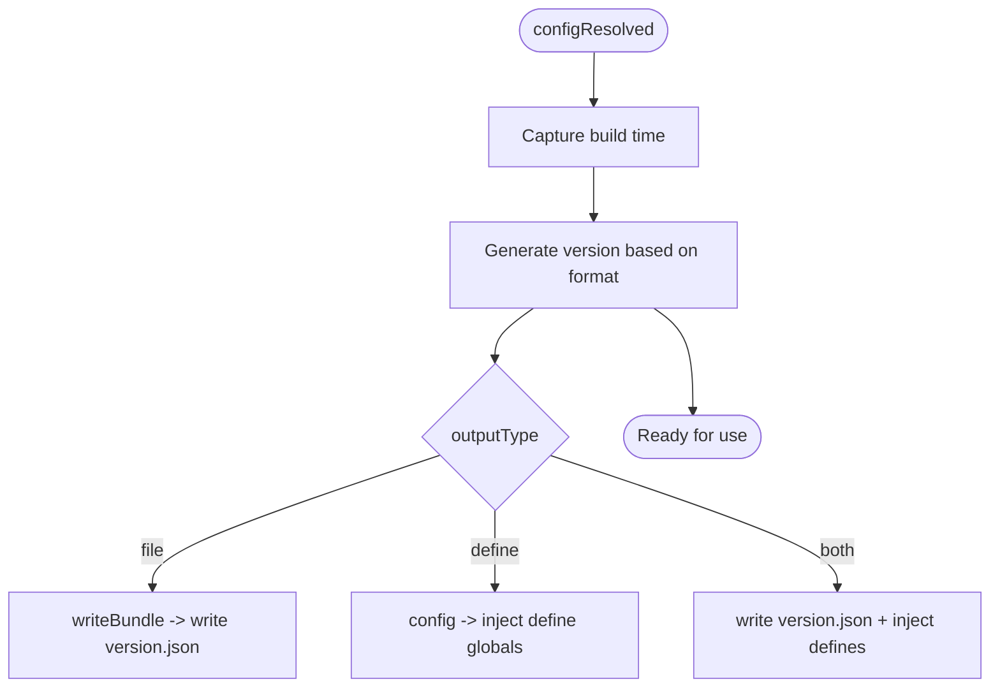
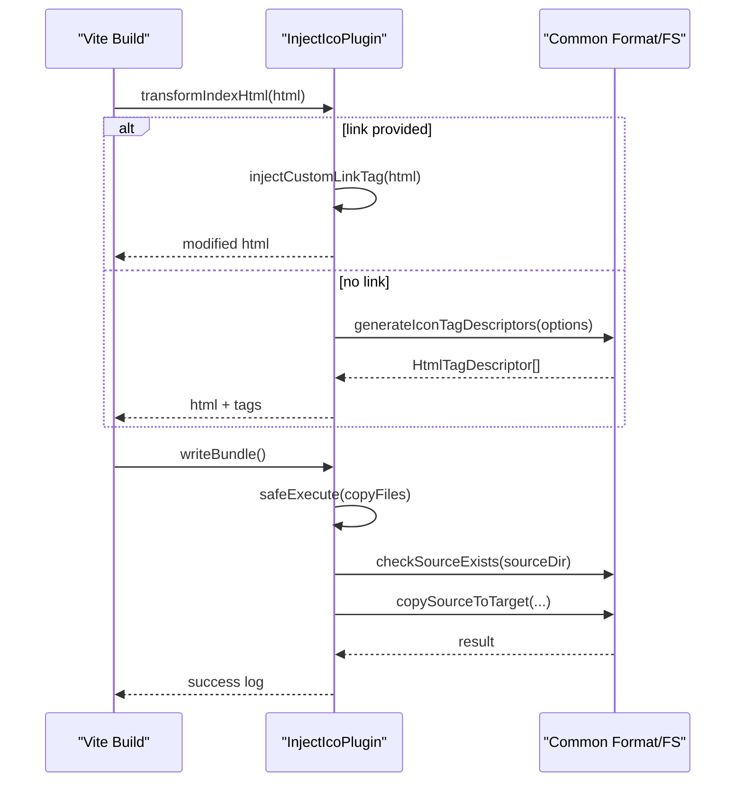
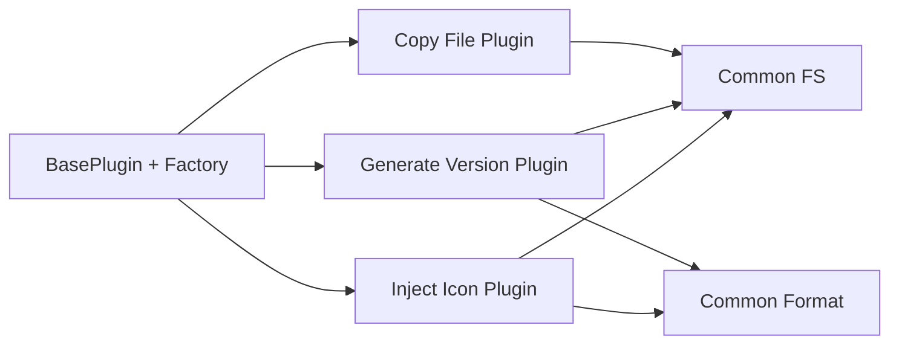

# Plugin Reference

<cite>
**Referenced Files in This Document**
- [packages/core/src/plugins/copyFile/index.ts](file://packages/core/src/plugins/copyFile/index.ts)
- [packages/core/src/plugins/copyFile/types.ts](file://packages/core/src/plugins/copyFile/types.ts)
- [packages/core/src/plugins/generateVersion/index.ts](file://packages/core/src/plugins/generateVersion/index.ts)
- [packages/core/src/plugins/generateVersion/types.ts](file://packages/core/src/plugins/generateVersion/types.ts)
- [packages/core/src/plugins/injectIco/index.ts](file://packages/core/src/plugins/injectIco/index.ts)
- [packages/core/src/plugins/injectIco/types.ts](file://packages/core/src/plugins/injectIco/types.ts)
- [packages/core/src/plugins/injectIco/common/index.ts](file://packages/core/src/plugins/injectIco/common/index.ts)
- [packages/core/src/factory/plugin/index.ts](file://packages/core/src/factory/plugin/index.ts)
- [packages/core/src/common/fs/index.ts](file://packages/core/src/common/fs/index.ts)
- [packages/core/src/common/format.ts](file://packages/core/src/common/format.ts)
- [packages/docs/src/en/plugins/copy-file.md](file://packages/docs/src/en/plugins/copy-file.md)
- [packages/docs/src/en/plugins/generate-version.md](file://packages/docs/src/en/plugins/generate-version.md)
- [packages/docs/src/en/plugins/inject-ico.md](file://packages/docs/src/en/plugins/inject-ico.md)
- [packages/core/package.json](file://packages/core/package.json)
- [packages/core/build.config.ts](file://packages/core/build.config.ts)
</cite>

## Table of Contents
1. [Introduction](#introduction)
2. [Project Structure](#project-structure)
3. [Core Components](#core-components)
4. [Architecture Overview](#architecture-overview)
5. [Detailed Component Analysis](#detailed-component-analysis)
6. [Dependency Analysis](#dependency-analysis)
7. [Performance Considerations](#performance-considerations)
8. [Troubleshooting Guide](#troubleshooting-guide)
9. [Conclusion](#conclusion)

## Introduction
This document provides a comprehensive reference for the three primary plugins in the MengXi Studio Vite plugin ecosystem:
- Copy File Plugin: Advanced file copying with recursive operations, incremental updates, and concurrent processing.
- Generate Version Plugin: Multi-format version generation including timestamp, date, semantic versioning, and hash generation.
- Inject Icon Plugin: HTML icon injection with fallback mechanisms and custom link tag configuration.

Each plugin integrates seamlessly with Vite’s build pipeline via lifecycle hooks and offers robust configuration, validation, logging, and error-handling strategies.

## Project Structure
The core plugin library is organized around a shared factory and common utilities:
- Factory: Provides a base plugin class and a factory function to standardize plugin creation, lifecycle, and error handling.
- Common Utilities: File system helpers for efficient copying, hashing, and date formatting.
- Plugins: Individual plugin implementations under a unified namespace.

**Diagram sources**
- [packages/core/src/factory/plugin/index.ts](file://packages/core/src/factory/plugin/index.ts#L27-L348)
- [packages/core/src/common/fs/index.ts](file://packages/core/src/common/fs/index.ts#L160-L253)
- [packages/core/src/common/format.ts](file://packages/core/src/common/format.ts#L76-L136)
- [packages/core/src/plugins/copyFile/index.ts](file://packages/core/src/plugins/copyFile/index.ts#L13-L87)
- [packages/core/src/plugins/generateVersion/index.ts](file://packages/core/src/plugins/generateVersion/index.ts#L14-L197)
- [packages/core/src/plugins/injectIco/index.ts](file://packages/core/src/plugins/injectIco/index.ts#L14-L158)

**Section sources**
- [packages/core/build.config.ts](file://packages/core/build.config.ts#L4-L17)
- [packages/core/package.json](file://packages/core/package.json#L1-L73)

## Core Components
This section outlines the foundational building blocks used by all plugins.

- BasePlugin: Centralizes configuration merging, validation, logging, lifecycle hooks, and safe execution with configurable error strategies.
- createPluginFactory: Standardizes plugin instantiation, normalization of options, and conversion to Vite plugin objects.
- Common FS: Implements optimized file/directory copying with concurrency, incremental checks, and robust error handling.
- Common Format: Provides date/time formatting, random hash generation, and template parsing for version customization.

Key capabilities:
- Unified plugin lifecycle via Vite hooks (configResolved, transformIndexHtml, writeBundle).
- Configurable error handling: throw, log, ignore.
- Extensive logging with verbosity controls.
- Validation for plugin-specific options.

**Section sources**
- [packages/core/src/factory/plugin/index.ts](file://packages/core/src/factory/plugin/index.ts#L27-L348)
- [packages/core/src/common/fs/index.ts](file://packages/core/src/common/fs/index.ts#L160-L253)
- [packages/core/src/common/format.ts](file://packages/core/src/common/format.ts#L76-L136)

## Architecture Overview
The plugins follow a consistent pattern:
- Extend BasePlugin to inherit lifecycle, validation, logging, and error handling.
- Implement addPluginHooks to register Vite hooks.
- Use common utilities for file operations and formatting.
- Respect enforce timing and hook ordering to integrate cleanly with Vite.

**Diagram sources**
- [packages/core/src/factory/plugin/index.ts](file://packages/core/src/factory/plugin/index.ts#L27-L348)
- [packages/core/src/plugins/copyFile/index.ts](file://packages/core/src/plugins/copyFile/index.ts#L13-L87)
- [packages/core/src/plugins/generateVersion/index.ts](file://packages/core/src/plugins/generateVersion/index.ts#L14-L197)
- [packages/core/src/plugins/injectIco/index.ts](file://packages/core/src/plugins/injectIco/index.ts#L14-L158)

## Detailed Component Analysis

### Copy File Plugin
Purpose: Copy files or directories after Vite build completes with recursive, overwrite, and incremental options.

- Lifecycle: Runs in writeBundle with enforce: 'post'.
- Configuration:
  - sourceDir: string (required)
  - targetDir: string (required)
  - overwrite: boolean (default: true)
  - recursive: boolean (default: true)
  - incremental: boolean (default: true)
  - enabled, verbose, errorStrategy: inherited from base options
- Behavior:
  - Validates presence of sourceDir.
  - Copies files with optional recursion and incremental update detection.
  - Uses concurrent processing for batch operations.
  - Emits success logs with counts and elapsed time.
- Error handling:
  - Throws on missing source or permission issues.
  - Respects errorStrategy for graceful degradation.

**Diagram sources**
- [packages/core/src/plugins/copyFile/index.ts](file://packages/core/src/plugins/copyFile/index.ts#L58-L80)
- [packages/core/src/common/fs/index.ts](file://packages/core/src/common/fs/index.ts#L160-L253)

**Section sources**
- [packages/core/src/plugins/copyFile/index.ts](file://packages/core/src/plugins/copyFile/index.ts#L13-L87)
- [packages/core/src/plugins/copyFile/types.ts](file://packages/core/src/plugins/copyFile/types.ts#L8-L43)
- [packages/docs/src/en/plugins/copy-file.md](file://packages/docs/src/en/plugins/copy-file.md#L1-L159)

### Generate Version Plugin
Purpose: Generate version strings in multiple formats and output either to a file, inject into code, or both.

- Lifecycle:
  - configResolved: Generates version and stores metadata.
  - config: Adds define globals when outputType requires injection.
  - writeBundle: Writes version.json when outputType requires file output.
- Configuration:
  - format: 'timestamp' | 'date' | 'datetime' | 'semver' | 'hash' | 'custom'
  - customFormat: string (required when format is 'custom')
  - semverBase: string (default: '1.0.0')
  - autoIncrement: boolean (default: false)
  - outputType: 'file' | 'define' | 'both'
  - outputFile: string (default: 'version.json')
  - defineName: string (default: '__APP_VERSION__')
  - hashLength: number (range: 1..32)
  - prefix, suffix: string
  - extra: Record<string, any>
  - enabled, verbose, errorStrategy: inherited
- Behavior:
  - Builds version string from date/time, hash, or semver.
  - Parses custom templates with placeholders.
  - Emits version info JSON with version, buildTime, timestamp, format, and extra fields.
  - Injects global variables for runtime access.
- Error handling:
  - Validates format and customFormat requirements.
  - Throws on invalid hashLength or missing customFormat when required.

**Diagram sources**
- [packages/core/src/plugins/generateVersion/index.ts](file://packages/core/src/plugins/generateVersion/index.ts#L146-L196)
- [packages/core/src/common/format.ts](file://packages/core/src/common/format.ts#L76-L136)

**Section sources**
- [packages/core/src/plugins/generateVersion/index.ts](file://packages/core/src/plugins/generateVersion/index.ts#L14-L197)
- [packages/core/src/plugins/generateVersion/types.ts](file://packages/core/src/plugins/generateVersion/types.ts#L31-L119)
- [packages/docs/src/en/plugins/generate-version.md](file://packages/docs/src/en/plugins/generate-version.md#L1-L259)

### Inject Icon Plugin
Purpose: Inject HTML icon link tags into the <head> of HTML files and optionally copy icon assets post-build.

- Lifecycle:
  - transformIndexHtml: Injects icon tags via Vite’s HtmlTagDescriptor API or falls back to custom link tag injection.
  - writeBundle: Copies icon files when copyOptions is provided.
- Configuration:
  - base: string (default: '/')
  - url: string (overrides base + favicon.ico)
  - link: string (overrides url and base)
  - icons: Icon[] (overrides url/base)
  - copyOptions: CopyOptions (optional)
- Icon shape:
  - rel: string
  - href: string
  - sizes?: string
  - type?: string
- CopyOptions:
  - sourceDir: string (required)
  - targetDir: string (required)
  - overwrite: boolean (default: true)
  - recursive: boolean (default: true)
- Fallback behavior:
  - link takes precedence.
  - icons take precedence over url.
  - url takes precedence over base.
  - Otherwise, defaults to base + favicon.ico.
- Error handling:
  - Validates copyOptions completeness.
  - Warns if </head> is not found during fallback injection.

**Diagram sources**
- [packages/core/src/plugins/injectIco/index.ts](file://packages/core/src/plugins/injectIco/index.ts#L131-L157)
- [packages/core/src/plugins/injectIco/common/index.ts](file://packages/core/src/plugins/injectIco/common/index.ts#L10-L59)
- [packages/core/src/common/fs/index.ts](file://packages/core/src/common/fs/index.ts#L160-L253)

**Section sources**
- [packages/core/src/plugins/injectIco/index.ts](file://packages/core/src/plugins/injectIco/index.ts#L14-L158)
- [packages/core/src/plugins/injectIco/types.ts](file://packages/core/src/plugins/injectIco/types.ts#L65-L112)
- [packages/core/src/plugins/injectIco/common/index.ts](file://packages/core/src/plugins/injectIco/common/index.ts#L10-L59)
- [packages/docs/src/en/plugins/inject-ico.md](file://packages/docs/src/en/plugins/inject-ico.md#L1-L257)

## Dependency Analysis
- Factory and BasePlugin provide a uniform foundation across all plugins.
- Common FS and Common Format are shared utilities consumed by multiple plugins.
- Each plugin registers specific Vite hooks and orchestrates common utilities for file operations or formatting.

**Diagram sources**
- [packages/core/src/factory/plugin/index.ts](file://packages/core/src/factory/plugin/index.ts#L27-L348)
- [packages/core/src/common/fs/index.ts](file://packages/core/src/common/fs/index.ts#L160-L253)
- [packages/core/src/common/format.ts](file://packages/core/src/common/format.ts#L76-L136)
- [packages/core/src/plugins/copyFile/index.ts](file://packages/core/src/plugins/copyFile/index.ts#L13-L87)
- [packages/core/src/plugins/generateVersion/index.ts](file://packages/core/src/plugins/generateVersion/index.ts#L14-L197)
- [packages/core/src/plugins/injectIco/index.ts](file://packages/core/src/plugins/injectIco/index.ts#L14-L158)

**Section sources**
- [packages/core/src/factory/plugin/index.ts](file://packages/core/src/factory/plugin/index.ts#L27-L348)
- [packages/core/src/common/fs/index.ts](file://packages/core/src/common/fs/index.ts#L160-L253)
- [packages/core/src/common/format.ts](file://packages/core/src/common/format.ts#L76-L136)

## Performance Considerations
- Copy File Plugin:
  - Concurrent file operations reduce total copy time for large directories.
  - Incremental mode avoids unnecessary writes by comparing modification time and size.
  - Recursive scanning and pre-creating target directories minimize repeated filesystem calls.
- Generate Version Plugin:
  - Version generation occurs once during configResolved, avoiding repeated computation.
  - Hash generation is lightweight and bounded by hashLength.
- Inject Icon Plugin:
  - HtmlTagDescriptor-based injection is native and efficient.
  - Optional file copy uses the same optimized copy pipeline.

Recommendations:
- Prefer incremental copying for large asset sets.
- Limit hashLength to reasonable values to balance uniqueness and readability.
- Use define injection judiciously to avoid bloating runtime globals.

[No sources needed since this section provides general guidance]

## Troubleshooting Guide
Common issues and resolutions:
- Source path errors:
  - Ensure sourceDir exists and is readable; otherwise, copy operations will fail.
- Permission errors:
  - Verify write permissions for target directories and output files.
- Validation failures:
  - For Generate Version Plugin, provide customFormat when format is 'custom'.
  - For Inject Icon Plugin, supply complete copyOptions when enabling file copy.
- Logging:
  - Increase verbosity to inspect detailed logs for diagnostics.
- Error strategy:
  - Use 'log' or 'ignore' to prevent build interruption while still capturing errors.

**Section sources**
- [packages/core/src/common/fs/index.ts](file://packages/core/src/common/fs/index.ts#L27-L58)
- [packages/core/src/plugins/generateVersion/index.ts](file://packages/core/src/plugins/generateVersion/index.ts#L39-L54)
- [packages/core/src/plugins/injectIco/index.ts](file://packages/core/src/plugins/injectIco/index.ts#L21-L33)
- [packages/core/src/factory/plugin/index.ts](file://packages/core/src/factory/plugin/index.ts#L283-L311)

## Conclusion
These three plugins provide a cohesive toolkit for file management, versioning, and HTML icon injection within Vite builds. They share a consistent architecture, robust validation, and flexible configuration, enabling reliable automation across diverse project needs. Integrating them into your Vite pipeline enhances developer productivity and build reliability.

[No sources needed since this section summarizes without analyzing specific files]