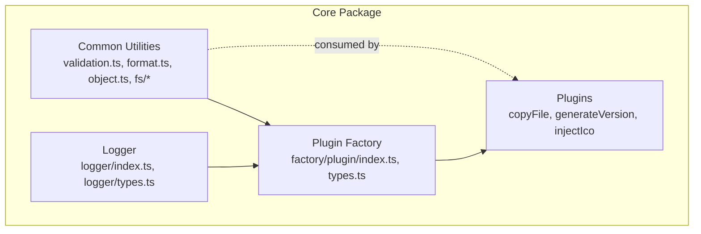
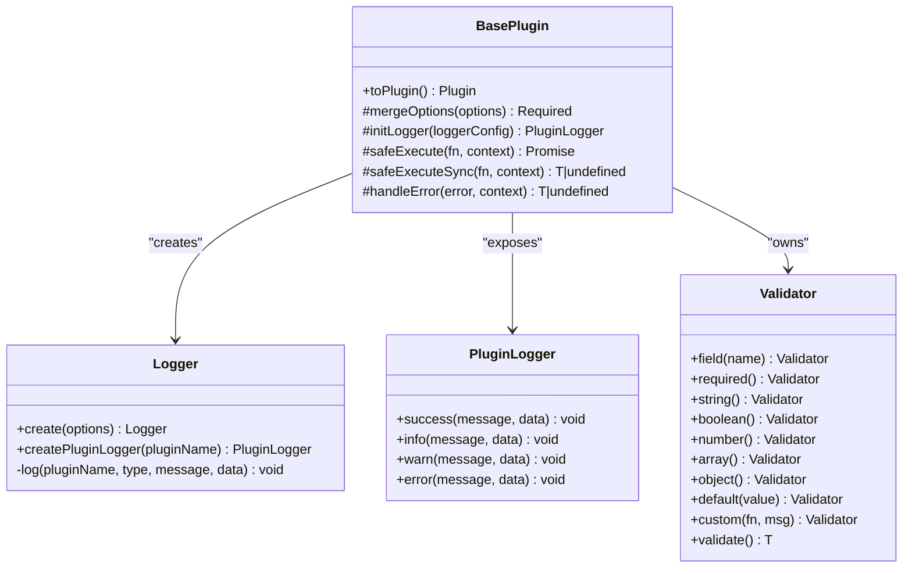
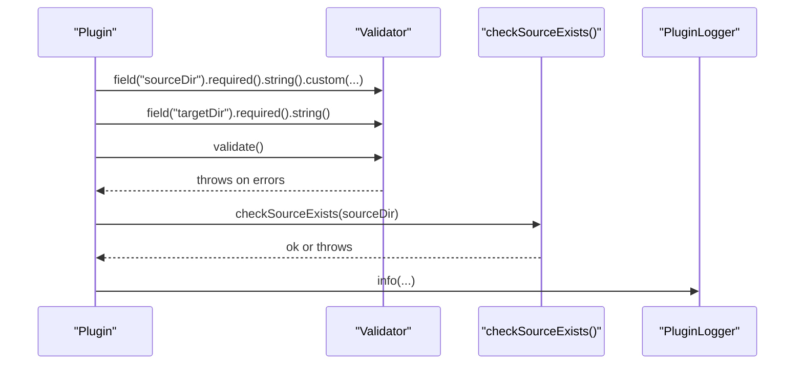
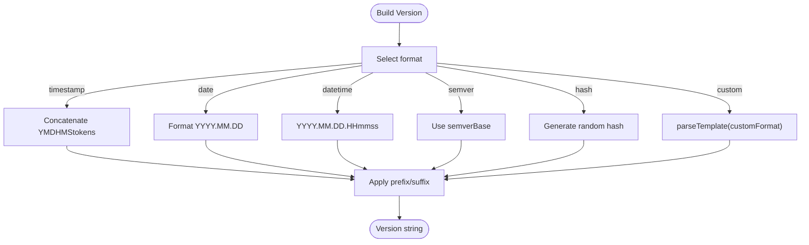
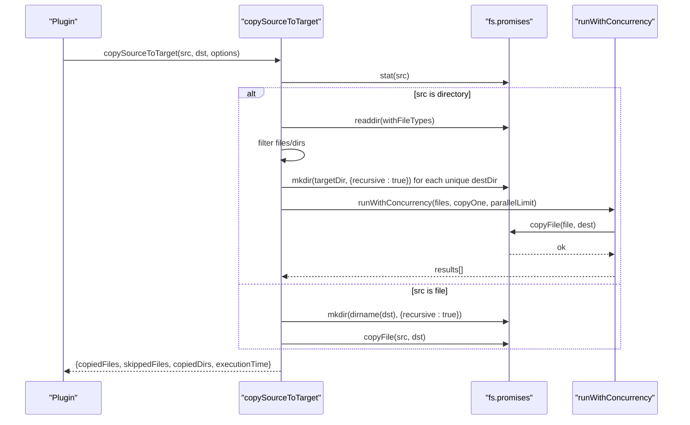
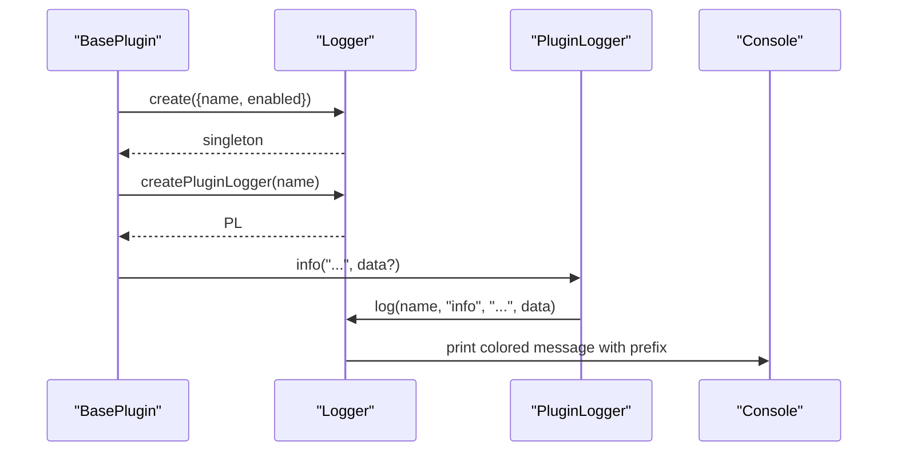
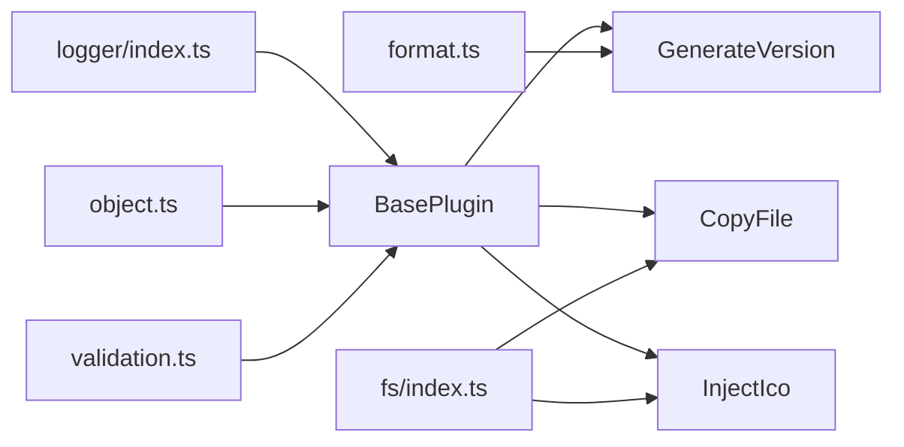

# Utility Libraries

<cite>
**Referenced Files in This Document**
- [validation.ts](file://packages/core/src/common/validation.ts)
- [format.ts](file://packages/core/src/common/format.ts)
- [object.ts](file://packages/core/src/common/object.ts)
- [fs/index.ts](file://packages/core/src/common/fs/index.ts)
- [fs/type.ts](file://packages/core/src/common/fs/type.ts)
- [logger/index.ts](file://packages/core/src/logger/index.ts)
- [logger/types.ts](file://packages/core/src/logger/types.ts)
- [common/index.ts](file://packages/core/src/common/index.ts)
- [plugin/index.ts](file://packages/core/src/factory/plugin/index.ts)
- [plugin/types.ts](file://packages/core/src/factory/plugin/types.ts)
- [copyFile/index.ts](file://packages/core/src/plugins/copyFile/index.ts)
- [generateVersion/index.ts](file://packages/core/src/plugins/generateVersion/index.ts)
- [injectIco/index.ts](file://packages/core/src/plugins/injectIco/index.ts)
- [package.json](file://packages/core/package.json)
</cite>

## Table of Contents
1. [Introduction](#introduction)
2. [Project Structure](#project-structure)
3. [Core Components](#core-components)
4. [Architecture Overview](#architecture-overview)
5. [Detailed Component Analysis](#detailed-component-analysis)
6. [Dependency Analysis](#dependency-analysis)
7. [Performance Considerations](#performance-considerations)
8. [Troubleshooting Guide](#troubleshooting-guide)
9. [Conclusion](#conclusion)

## Introduction
This document explains the utility libraries that power the plugin ecosystem. It covers:
- Type-safe configuration validation via a fluent validator
- Formatting helpers for strings and dates
- Object utilities for deep merges
- Optimized file system operations with concurrency
- Structured logging with plugin-specific contexts, severity levels, and colored console output
It also demonstrates how these utilities are shared across plugins and provides usage patterns, performance tips, and best practices.

## Project Structure
The core utilities live under the common and logger directories and are exported via a central index barrel. Plugins consume these utilities through the BasePlugin factory and createPluginFactory.

**Diagram sources**
- [common/index.ts](file://packages/core/src/common/index.ts#L1-L5)
- [logger/index.ts](file://packages/core/src/logger/index.ts#L1-L181)
- [plugin/index.ts](file://packages/core/src/factory/plugin/index.ts#L1-L386)
- [copyFile/index.ts](file://packages/core/src/plugins/copyFile/index.ts#L1-L121)
- [generateVersion/index.ts](file://packages/core/src/plugins/generateVersion/index.ts#L1-L257)
- [injectIco/index.ts](file://packages/core/src/plugins/injectIco/index.ts#L1-L195)

**Section sources**
- [common/index.ts](file://packages/core/src/common/index.ts#L1-L5)
- [package.json](file://packages/core/package.json#L17-L42)

## Core Components
- Validation system: Fluent API to validate plugin options with required fields, types, defaults, and custom rules.
- Formatting helpers: Number padding, random hash generation, date formatting, and template parsing.
- Object utilities: Deep merge with controlled override semantics.
- File system utilities: Safe existence checks, directory creation, recursive directory traversal, incremental update detection, concurrency-limited batch execution, and file copy/write/read helpers.
- Logging system: Singleton logger with plugin-scoped contexts, severity levels, emoji icons, and ANSI colorized console output.

**Section sources**
- [validation.ts](file://packages/core/src/common/validation.ts#L1-L203)
- [format.ts](file://packages/core/src/common/format.ts#L1-L137)
- [object.ts](file://packages/core/src/common/object.ts#L1-L67)
- [fs/index.ts](file://packages/core/src/common/fs/index.ts#L1-L292)
- [logger/index.ts](file://packages/core/src/logger/index.ts#L1-L181)

## Architecture Overview
The plugin factory composes utilities into a cohesive lifecycle:
- Merge options with defaults
- Initialize a plugin-scoped logger
- Construct a Validator over merged options
- Run validation synchronously during construction
- Expose a toPlugin() method that wires lifecycle hooks and delegates work to utilities

**Diagram sources**
- [plugin/index.ts](file://packages/core/src/factory/plugin/index.ts#L27-L348)
- [logger/index.ts](file://packages/core/src/logger/index.ts#L7-L146)
- [validation.ts](file://packages/core/src/common/validation.ts#L16-L202)

## Detailed Component Analysis

### Validation System
The Validator provides a fluent API to declare required fields, enforce types, set defaults, and apply custom predicates. It aggregates errors and throws a consolidated message upon validation failure.

Key behaviors:
- Field selection via field()
- Type guards: required(), string(), boolean(), number(), array(), object()
- Defaults via default()
- Custom validators via custom(fn, message)
- validate() returns validated options or throws

Usage pattern in plugins:
- Build a chain per option
- Call validate() at the end of validateOptions()

**Diagram sources**
- [copyFile/index.ts](file://packages/core/src/plugins/copyFile/index.ts#L22-L40)
- [fs/index.ts](file://packages/core/src/common/fs/index.ts#L27-L40)
- [validation.ts](file://packages/core/src/common/validation.ts#L45-L202)

**Section sources**
- [validation.ts](file://packages/core/src/common/validation.ts#L16-L202)
- [copyFile/index.ts](file://packages/core/src/plugins/copyFile/index.ts#L22-L40)
- [injectIco/index.ts](file://packages/core/src/plugins/injectIco/index.ts#L21-L33)

### Formatting Helpers
Provides:
- padNumber(num, length)
- generateRandomHash(length)
- getDateFormatParams(date)
- formatDate(date, format)
- parseTemplate(template, values)

Usage patterns:
- Version generation uses getDateFormatParams and parseTemplate to assemble semantic versions and custom formats
- Random hashes are used for dynamic version tokens

**Diagram sources**
- [generateVersion/index.ts](file://packages/core/src/plugins/generateVersion/index.ts#L63-L120)
- [format.ts](file://packages/core/src/common/format.ts#L76-L136)

**Section sources**
- [format.ts](file://packages/core/src/common/format.ts#L17-L136)
- [generateVersion/index.ts](file://packages/core/src/plugins/generateVersion/index.ts#L63-L120)

### Object Utilities
deepMerge performs a shallow-recursive merge of plain objects, skipping undefined values and replacing arrays. This ensures defaults are preserved while allowing user overrides.

Behavior highlights:
- Skips undefined values to avoid resetting defaults
- Recursively merges nested plain objects
- Replaces arrays (does not concatenate)

**Section sources**
- [object.ts](file://packages/core/src/common/object.ts#L35-L66)

### File System Operations
Optimized utilities for safe and efficient file operations:
- Existence checks and target directory creation
- Recursive directory traversal with single stat pass
- Incremental update detection using mtimeMs and size
- Concurrency-limited batch execution
- Copy single file or entire directory trees
- Write and sync read helpers with rich error messages

**Diagram sources**
- [fs/index.ts](file://packages/core/src/common/fs/index.ts#L160-L253)
- [fs/type.ts](file://packages/core/src/common/fs/type.ts#L4-L29)

Key options and results:
- CopyOptions: recursive, overwrite, incremental, parallelLimit, skipEmptyDirs
- CopyResult: counts and executionTime

**Section sources**
- [fs/index.ts](file://packages/core/src/common/fs/index.ts#L1-L292)
- [fs/type.ts](file://packages/core/src/common/fs/type.ts#L1-L55)

### Structured Logging System
Singleton Logger manages plugin-specific loggers with:
- Severity levels: success, info, warn, error
- Emoji icons and ANSI colorized console output
- Per-plugin enable/disable toggles
- Unified prefix format: [@meng-xi/vite-plugin:{pluginName}]

Usage:
- Logger.create({ name, enabled? }) returns singleton
- createPluginLogger(pluginName) returns a PluginLogger with severity methods
- BasePlugin initializes a PluginLogger bound to the plugin’s name

**Diagram sources**
- [plugin/index.ts](file://packages/core/src/factory/plugin/index.ts#L128-L138)
- [logger/index.ts](file://packages/core/src/logger/index.ts#L76-L145)

**Section sources**
- [logger/index.ts](file://packages/core/src/logger/index.ts#L7-L181)
- [logger/types.ts](file://packages/core/src/logger/types.ts#L4-L13)
- [plugin/index.ts](file://packages/core/src/factory/plugin/index.ts#L128-L138)

## Dependency Analysis
Utilities are consumed by plugins through the BasePlugin factory and createPluginFactory. The common barrel re-exports utilities for convenient imports.

**Diagram sources**
- [common/index.ts](file://packages/core/src/common/index.ts#L1-L5)
- [plugin/index.ts](file://packages/core/src/factory/plugin/index.ts#L1-L386)
- [copyFile/index.ts](file://packages/core/src/plugins/copyFile/index.ts#L1-L121)
- [generateVersion/index.ts](file://packages/core/src/plugins/generateVersion/index.ts#L1-L257)
- [injectIco/index.ts](file://packages/core/src/plugins/injectIco/index.ts#L1-L195)

**Section sources**
- [common/index.ts](file://packages/core/src/common/index.ts#L1-L5)
- [plugin/index.ts](file://packages/core/src/factory/plugin/index.ts#L1-L386)

## Performance Considerations
- File operations
  - Use readDirRecursive with withFileTypes to minimize repeated stat calls
  - Enable incremental mode to skip up-to-date files based on mtimeMs and size
  - Tune parallelLimit to balance throughput and resource usage
  - Pre-create target directories in bulk to reduce mkdir overhead
- Validation
  - Keep validation chains concise; group related validations
  - Prefer type guards (string(), boolean(), number()) before custom validators
- Formatting
  - Reuse getDateFormatParams to avoid repeated Date computations
  - Limit template replacements to necessary keys
- Logging
  - Disable verbose logging in production for lower overhead
  - Avoid logging large objects unless necessary

[No sources needed since this section provides general guidance]

## Troubleshooting Guide
- Validation failures
  - Inspect aggregated error messages thrown by validate()
  - Ensure field() is called before chaining required()/type()/custom()
- File operation errors
  - checkSourceExists/source/target permission/access issues are surfaced with explicit messages
  - ensureTargetDir failures indicate permission or path issues
  - shouldUpdateFile handles missing targets by forcing updates
- Logging issues
  - Verify plugin name registration via Logger.create
  - Confirm verbose flag enables logs for the plugin
  - Ensure console supports ANSI color codes

**Section sources**
- [validation.ts](file://packages/core/src/common/validation.ts#L195-L202)
- [fs/index.ts](file://packages/core/src/common/fs/index.ts#L27-L58)
- [logger/index.ts](file://packages/core/src/logger/index.ts#L116-L130)

## Conclusion
The utility libraries provide a robust foundation for building Vite plugins:
- Fluent validation ensures type-safe configurations
- Formatting helpers simplify versioning and templating
- Deep merging preserves defaults while allowing customization
- File system utilities deliver safe, fast, and concurrent operations
- Structured logging offers consistent, contextual, and colored output across plugins

These utilities are shared via the plugin factory and consumed by all plugins, ensuring uniform behavior and maintainability across the ecosystem.