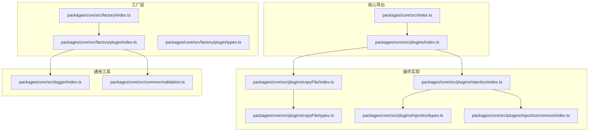
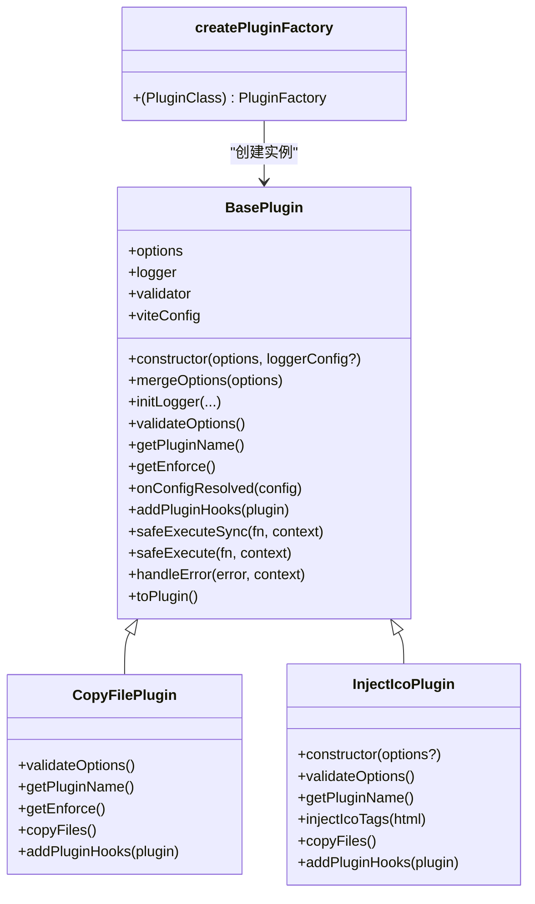
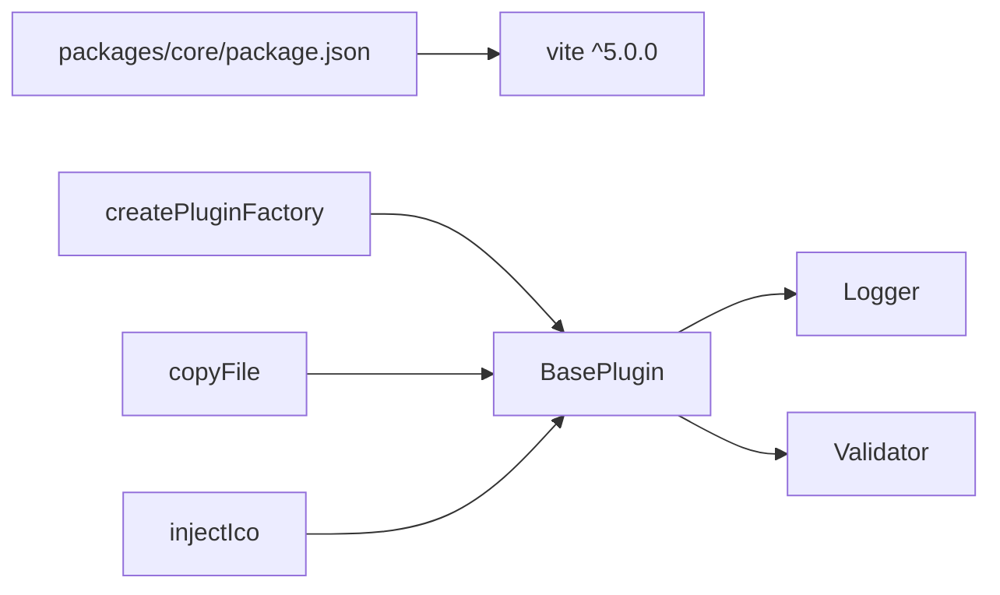

# API 参考

<cite>
**本文档引用的文件**
- [packages/core/src/index.ts](file://packages/core/src/index.ts)
- [packages/core/src/plugins/index.ts](file://packages/core/src/plugins/index.ts)
- [packages/core/src/factory/index.ts](file://packages/core/src/factory/index.ts)
- [packages/core/src/factory/plugin/index.ts](file://packages/core/src/factory/plugin/index.ts)
- [packages/core/src/factory/plugin/types.ts](file://packages/core/src/factory/plugin/types.ts)
- [packages/core/src/plugins/copyFile/index.ts](file://packages/core/src/plugins/copyFile/index.ts)
- [packages/core/src/plugins/copyFile/types.ts](file://packages/core/src/plugins/copyFile/types.ts)
- [packages/core/src/plugins/injectIco/index.ts](file://packages/core/src/plugins/injectIco/index.ts)
- [packages/core/src/plugins/injectIco/types.ts](file://packages/core/src/plugins/injectIco/types.ts)
- [packages/core/src/plugins/injectIco/common/index.ts](file://packages/core/src/plugins/injectIco/common/index.ts)
- [packages/core/src/logger/index.ts](file://packages/core/src/logger/index.ts)
- [packages/core/src/common/validation.ts](file://packages/core/src/common/validation.ts)
- [packages/core/package.json](file://packages/core/package.json)
</cite>

## 目录
1. [简介](#简介)
2. [项目结构](#项目结构)
3. [核心组件](#核心组件)
4. [架构总览](#架构总览)
5. [详细组件分析](#详细组件分析)
6. [依赖分析](#依赖分析)
7. [性能考量](#性能考量)
8. [故障排查指南](#故障排查指南)
9. [结论](#结论)
10. [附录](#附录)

## 简介
本文件为 MengXi Studio Vite 插件库的完整 API 参考文档，涵盖插件工厂函数、基础配置接口与类型定义。内容面向不同技术背景的开发者，提供参数类型、返回值、使用示例、版本兼容性、迁移建议、注意事项与最佳实践，帮助快速、安全地集成与扩展插件能力。

## 项目结构
- 核心导出入口位于 packages/core/src/index.ts，统一导出插件集合。
- 插件集合位于 packages/core/src/plugins/index.ts，当前包含 copyFile 与 injectIco 两个插件。
- 工厂层位于 packages/core/src/factory，提供插件基类与工厂函数，实现统一的生命周期、日志与错误处理。
- 各插件独立实现其业务逻辑与钩子注册，共享工厂层能力。
- 日志与通用校验工具位于 packages/core/src/logger 与 packages/core/src/common。

**图表来源**
- [packages/core/src/index.ts](file://packages/core/src/index.ts#L1-L2)
- [packages/core/src/plugins/index.ts](file://packages/core/src/plugins/index.ts#L1-L3)
- [packages/core/src/factory/index.ts](file://packages/core/src/factory/index.ts#L1-L2)
- [packages/core/src/factory/plugin/index.ts](file://packages/core/src/factory/plugin/index.ts#L1-L384)
- [packages/core/src/plugins/copyFile/index.ts](file://packages/core/src/plugins/copyFile/index.ts#L1-L116)
- [packages/core/src/plugins/copyFile/types.ts](file://packages/core/src/plugins/copyFile/types.ts#L1-L44)
- [packages/core/src/plugins/injectIco/index.ts](file://packages/core/src/plugins/injectIco/index.ts#L1-L178)
- [packages/core/src/plugins/injectIco/types.ts](file://packages/core/src/plugins/injectIco/types.ts#L1-L113)
- [packages/core/src/plugins/injectIco/common/index.ts](file://packages/core/src/plugins/injectIco/common/index.ts#L1-L41)
- [packages/core/src/logger/index.ts](file://packages/core/src/logger/index.ts#L1-L131)
- [packages/core/src/common/validation.ts](file://packages/core/src/common/validation.ts#L1-L203)

**章节来源**
- [packages/core/src/index.ts](file://packages/core/src/index.ts#L1-L2)
- [packages/core/src/plugins/index.ts](file://packages/core/src/plugins/index.ts#L1-L3)

## 核心组件
本节概述插件工厂与基础类型，帮助理解插件体系的统一抽象与扩展方式。

- 插件工厂函数
  - 名称：createPluginFactory
  - 功能：接收插件类构造函数，返回一个工厂函数，用于创建符合 Vite 规范的 Plugin 对象；同时在返回的插件对象上挂载原始插件实例，便于调试与访问内部状态。
  - 参数：
    - PluginClass：插件类构造函数，需继承自 BasePlugin<T>，且 T 继承自 BasePluginOptions。
  - 返回：PluginFactory<T>，即 (options?: T) => Plugin。
  - 使用场景：通过工厂函数创建插件实例，简化插件接入流程。
  - 示例路径：[插件工厂函数示例](file://packages/core/src/factory/plugin/index.ts#L371-L383)

- 基础插件抽象类 BasePlugin
  - 功能：提供插件生命周期管理、配置合并与默认值、日志记录器初始化、配置验证器、错误处理策略、Vite 钩子注册等核心能力。
  - 关键方法：
    - constructor(options, loggerConfig?)：初始化配置、日志与验证器，并执行配置验证。
    - mergeOptions(options)：将用户配置与默认配置深度合并。
    - initLogger(...)：根据传入配置或 Logger 实例初始化日志器。
    - validateOptions()：空实现，子类可重写以添加自定义验证。
    - getPluginName()：抽象方法，返回插件名称。
    - getEnforce()：返回插件执行时机 enforce，缺省为 undefined。
    - onConfigResolved(config)：保存解析后的 Vite 配置并记录日志。
    - addPluginHooks(plugin)：抽象方法，子类实现具体钩子注册。
    - safeExecuteSync(fn, context)：安全执行同步函数，按 errorStrategy 处理错误。
    - safeExecute(fn, context)：安全执行异步函数，按 errorStrategy 处理错误。
    - handleError(error, context)：根据 errorStrategy 记录错误并决定抛出或忽略。
    - toPlugin()：创建并返回符合 Vite 规范的 Plugin 对象，设置 name、enforce、configResolved 钩子，并调用 addPluginHooks。
  - 示例路径：[基础插件类定义](file://packages/core/src/factory/plugin/index.ts#L27-L337)

- 基础配置接口 BasePluginOptions
  - enabled：是否启用插件，默认 true。
  - verbose：是否启用详细日志，默认 true。
  - errorStrategy：错误处理策略，可选 'throw' | 'log' | 'ignore'，默认 'throw'。
  - 示例路径：[基础配置接口](file://packages/core/src/factory/plugin/types.ts#L8-L29)

- 插件工厂函数类型 PluginFactory<T>
  - 定义：(options?: T) => Plugin。
  - 示例路径：[工厂函数类型定义](file://packages/core/src/factory/plugin/types.ts#L36-L37)

**章节来源**
- [packages/core/src/factory/plugin/index.ts](file://packages/core/src/factory/plugin/index.ts#L1-L384)
- [packages/core/src/factory/plugin/types.ts](file://packages/core/src/factory/plugin/types.ts#L1-L37)

## 架构总览
下图展示了插件工厂与两个内置插件之间的关系，以及与 Vite 生命周期钩子的交互。

**图表来源**
- [packages/core/src/factory/plugin/index.ts](file://packages/core/src/factory/plugin/index.ts#L27-L337)
- [packages/core/src/plugins/copyFile/index.ts](file://packages/core/src/plugins/copyFile/index.ts#L13-L82)
- [packages/core/src/plugins/injectIco/index.ts](file://packages/core/src/plugins/injectIco/index.ts#L14-L139)

## 详细组件分析

### 插件工厂与基础类型
- 插件工厂函数 createPluginFactory
  - 输入：插件类构造函数 new (options, loggerConfig?) => P，其中 P 继承自 BasePlugin<T>。
  - 输出：PluginFactory<T>，即 (options?: T) => Plugin。
  - 行为：创建插件实例 -> 调用 toPlugin() -> 在返回的 Plugin 上挂载原始实例以便调试。
  - 示例路径：[工厂函数实现](file://packages/core/src/factory/plugin/index.ts#L371-L383)

- 基础插件抽象类 BasePlugin
  - 生命周期：构造 -> 配置合并与验证 -> 初始化日志与验证器 -> onConfigResolved -> addPluginHooks。
  - 错误策略：throw/log/ignore，分别对应抛出错误、记录错误并继续、记录错误并继续。
  - 示例路径：[基础类实现](file://packages/core/src/factory/plugin/index.ts#L27-L337)

- 基础配置接口 BasePluginOptions
  - enabled/verbose/errorStrategy 三要素，统一控制插件行为与日志级别。
  - 示例路径：[基础配置接口](file://packages/core/src/factory/plugin/types.ts#L8-L29)

- 插件工厂函数类型 PluginFactory<T>
  - 用于约束工厂函数签名，保证类型安全。
  - 示例路径：[工厂函数类型](file://packages/core/src/factory/plugin/types.ts#L36-L37)

**章节来源**
- [packages/core/src/factory/plugin/index.ts](file://packages/core/src/factory/plugin/index.ts#L1-L384)
- [packages/core/src/factory/plugin/types.ts](file://packages/core/src/factory/plugin/types.ts#L1-L37)

### 复制文件插件 copyFile
- 插件名称：copy-file
- 执行时机：post（在构建后期执行）
- 功能：在 writeBundle 阶段将指定源目录的文件复制到目标目录，支持覆盖、递归与增量复制。
- 配置接口 CopyFileOptions
  - 继承 BasePluginOptions。
  - 必填：sourceDir、targetDir。
  - 可选：overwrite（默认 true）、recursive（默认 true）、incremental（默认 true）。
  - 示例路径：[复制文件配置接口](file://packages/core/src/plugins/copyFile/types.ts#L1-L44)

- 核心行为
  - 配置验证：使用 Validator 校验 sourceDir、targetDir、overwrite、recursive、incremental。
  - 生命周期钩子：writeBundle 中安全执行复制逻辑。
  - 日志输出：成功时输出复制统计信息。
  - 示例路径：[复制文件插件实现](file://packages/core/src/plugins/copyFile/index.ts#L1-L116)

- 使用示例
  - 基本用法与高级配置示例路径：[复制文件插件示例](file://packages/core/src/plugins/copyFile/index.ts#L87-L114)

- 最佳实践
  - 确保 sourceDir 存在且可读，targetDir 可写。
  - 开发环境可开启 verbose 以观察复制过程。
  - 生产构建建议开启 incremental 以减少不必要的 IO。

**章节来源**
- [packages/core/src/plugins/copyFile/index.ts](file://packages/core/src/plugins/copyFile/index.ts#L1-L116)
- [packages/core/src/plugins/copyFile/types.ts](file://packages/core/src/plugins/copyFile/types.ts#L1-L44)

### 注入图标插件 injectIco
- 插件名称：inject-ico
- 功能：在 transformIndexHtml 阶段向 HTML 的 head 中注入图标链接；可选地在 writeBundle 阶段复制图标文件。
- 配置接口 InjectIcoOptions
  - 继承 BasePluginOptions。
  - 可选：base（默认 '/'）、url、link、icons 数组、copyOptions。
  - 其中 copyOptions 包含 sourceDir、targetDir、overwrite（默认 true）、recursive（默认 true）。
  - 示例路径：[注入图标配置接口](file://packages/core/src/plugins/injectIco/types.ts#L1-L113)

- 核心行为
  - 构造函数支持字符串或完整配置对象，自动标准化为完整配置。
  - transformIndexHtml：生成图标标签并注入到 </head> 前，避免重复注入。
  - writeBundle：若配置 copyOptions，则复制图标文件到目标目录。
  - 配置验证：对 base/url/link/icons 进行类型校验；若存在 copyOptions，则对其字段进行二次校验。
  - 示例路径：[注入图标插件实现](file://packages/core/src/plugins/injectIco/index.ts#L1-L178)

- 图标标签生成工具 generateIconTags
  - 优先级：link > icons > url > base + favicon.ico。
  - 示例路径：[图标标签生成](file://packages/core/src/plugins/injectIco/common/index.ts#L1-L41)

- 使用示例
  - 基本用法、字符串配置与完整配置示例路径：[注入图标插件示例](file://packages/core/src/plugins/injectIco/index.ts#L147-L174)

- 最佳实践
  - 若仅需注入链接，无需配置 copyOptions。
  - 若需要复制图标文件，请确保 sourceDir 存在且可读，targetDir 可写。
  - 建议在开发环境开启 verbose 以观察注入与复制过程。

**章节来源**
- [packages/core/src/plugins/injectIco/index.ts](file://packages/core/src/plugins/injectIco/index.ts#L1-L178)
- [packages/core/src/plugins/injectIco/types.ts](file://packages/core/src/plugins/injectIco/types.ts#L1-L113)
- [packages/core/src/plugins/injectIco/common/index.ts](file://packages/core/src/plugins/injectIco/common/index.ts#L1-L41)

### 日志与验证工具
- 日志 Logger
  - 支持 info/success/warn/error 四种日志类型，带时间戳与插件前缀。
  - 可通过 verbose 控制是否输出。
  - 示例路径：[日志实现](file://packages/core/src/logger/index.ts#L1-L131)

- 参数验证器 Validator
  - 流畅 API：field().required().string().boolean().default().custom().validate()。
  - 支持必填、类型、默认值与自定义校验。
  - 示例路径：[验证器实现](file://packages/core/src/common/validation.ts#L1-L203)

**章节来源**
- [packages/core/src/logger/index.ts](file://packages/core/src/logger/index.ts#L1-L131)
- [packages/core/src/common/validation.ts](file://packages/core/src/common/validation.ts#L1-L203)

## 依赖分析
- 版本与兼容性
  - peerDependencies/vite: ^5.0.0
  - 本仓库版本：0.0.2
  - 示例路径：[包配置](file://packages/core/package.json#L1-L55)

- 导出与入口
  - 核心入口导出插件集合，插件集合再导出各插件工厂或函数。
  - 示例路径：[核心入口](file://packages/core/src/index.ts#L1-L2)、[插件集合入口](file://packages/core/src/plugins/index.ts#L1-L3)

**图表来源**
- [packages/core/package.json](file://packages/core/package.json#L32-L37)
- [packages/core/src/factory/plugin/index.ts](file://packages/core/src/factory/plugin/index.ts#L1-L384)
- [packages/core/src/plugins/copyFile/index.ts](file://packages/core/src/plugins/copyFile/index.ts#L1-L116)
- [packages/core/src/plugins/injectIco/index.ts](file://packages/core/src/plugins/injectIco/index.ts#L1-L178)
- [packages/core/src/logger/index.ts](file://packages/core/src/logger/index.ts#L1-L131)
- [packages/core/src/common/validation.ts](file://packages/core/src/common/validation.ts#L1-L203)

**章节来源**
- [packages/core/package.json](file://packages/core/package.json#L1-L55)
- [packages/core/src/index.ts](file://packages/core/src/index.ts#L1-L2)
- [packages/core/src/plugins/index.ts](file://packages/core/src/plugins/index.ts#L1-L3)

## 性能考量
- 复制文件
  - 增量复制（incremental）可减少重复 IO，建议在生产构建中启用。
  - 递归复制（recursive）与覆盖（overwrite）会影响磁盘写入频率，应结合项目规模评估。
  - 参考路径：[复制文件插件实现](file://packages/core/src/plugins/copyFile/index.ts#L53-L75)

- 注入图标
  - transformIndexHtml 仅在 HTML 转换阶段执行，开销较小。
  - 复制图标文件时建议开启增量复制（由插件内部固定启用），避免重复拷贝。
  - 参考路径：[注入图标插件实现](file://packages/core/src/plugins/injectIco/index.ts#L130-L138)

- 错误策略
  - errorStrategy='throw' 会中断构建，适合严格 CI 环境。
  - errorStrategy='log'/'ignore' 可继续构建，但可能掩盖问题，建议配合 verbose 观察。
  - 参考路径：[错误处理策略](file://packages/core/src/factory/plugin/index.ts#L272-L300)

## 故障排查指南
- 配置验证失败
  - 症状：抛出“配置验证失败”异常，包含具体字段错误列表。
  - 排查：检查必填字段、类型与默认值设置；必要时使用自定义校验。
  - 参考路径：[验证器实现](file://packages/core/src/common/validation.ts#L195-L201)

- 源目录不存在
  - 症状：复制或注入阶段提示源文件不存在。
  - 排查：确认 sourceDir 路径正确且可读；检查工作目录与相对路径。
  - 参考路径：[复制文件实现中的源检查](file://packages/core/src/plugins/copyFile/index.ts#L64-L64)

- HTML 注入失败
  - 症状：未找到 </head> 标签，跳过注入。
  - 排查：确认模板 HTML 结构完整；如使用动态模板，确保在 transformIndexHtml 阶段可用。
  - 参考路径：[注入图标实现中的 HTML 注入](file://packages/core/src/plugins/injectIco/index.ts#L75-L88)

- 错误策略导致构建中断
  - 症状：构建因异常而失败。
  - 排查：调整 errorStrategy 为 'log'/'ignore' 以继续构建，或修复底层问题。
  - 参考路径：[错误处理策略](file://packages/core/src/factory/plugin/index.ts#L285-L299)

## 结论
本参考文档系统性梳理了插件工厂、基础抽象类、内置插件及其类型定义，明确了参数、返回值、使用示例与最佳实践。遵循 BasePlugin 的统一生命周期与错误策略，结合 CopyFile 与 InjectIco 的具体实现，可在 Vite 5 环境下稳定、高效地扩展构建流程。

## 附录

### 版本兼容性与迁移指南
- 兼容性
  - 依赖 Vite 5.x，升级 Vite 版本时需验证钩子与配置是否兼容。
  - 当前仓库版本为 0.0.2，属于早期版本，API 变更风险较高。
  - 参考路径：[包配置](file://packages/core/package.json#L32-L37)

- 迁移建议
  - 从旧版本升级：关注插件名称与钩子行为变化，优先在开发环境验证。
  - 配置迁移：将字符串配置标准化为完整配置对象（如 injectIco 的构造函数支持字符串输入）。
  - 参考路径：[注入图标插件构造函数](file://packages/core/src/plugins/injectIco/index.ts#L22-L26)

### 使用限制与注意事项
- 权限与路径
  - 确保 sourceDir 可读、targetDir 可写；避免跨盘符复制带来的性能与权限问题。
- 并发与顺序
  - enforce:'post' 的插件在构建后期执行，避免与其他插件产生冲突。
- 日志与可观测性
  - 开启 verbose 有助于定位问题；生产构建可根据需要关闭以减少输出。
- 参考路径
  - [复制文件插件执行时机](file://packages/core/src/plugins/copyFile/index.ts#L41-L43)
  - [注入图标插件执行时机](file://packages/core/src/plugins/injectIco/index.ts#L42-L44)