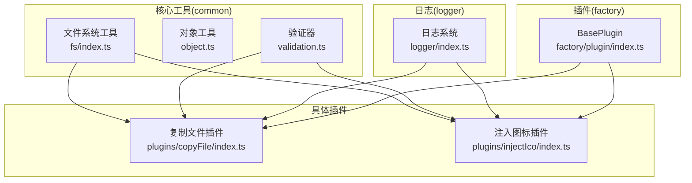
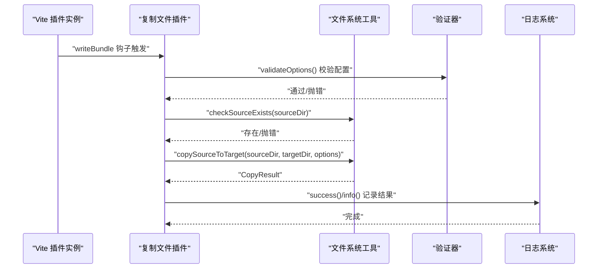
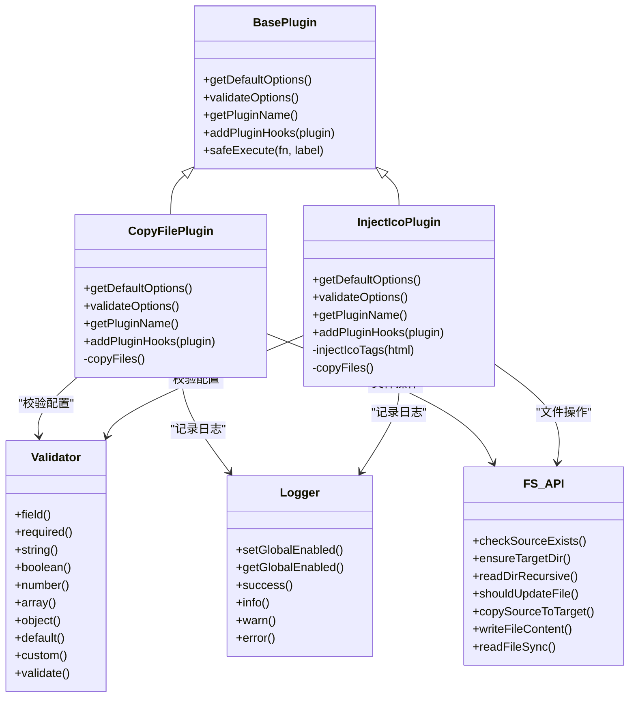
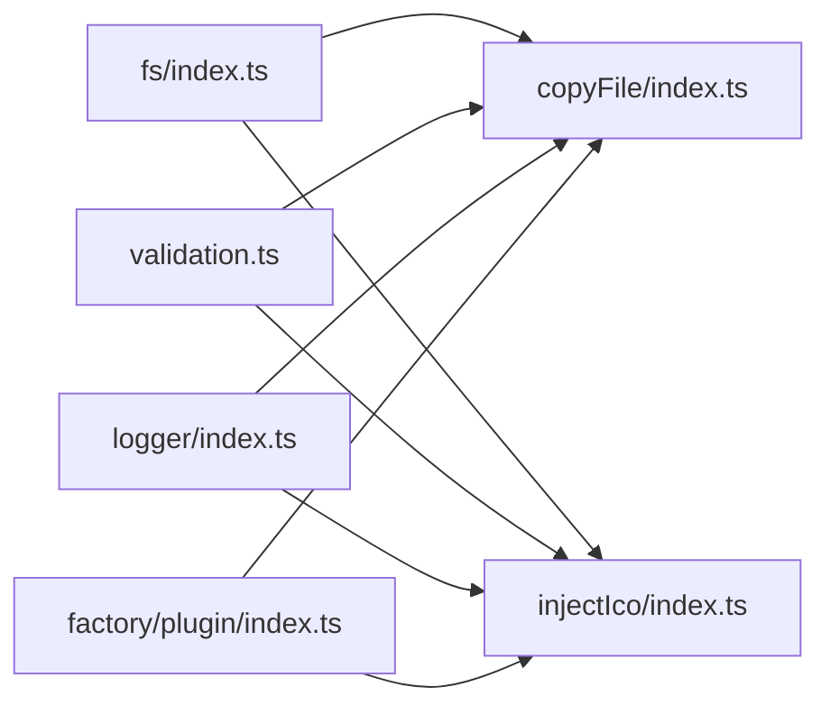

# 工具 API

<cite>
**本文引用的文件**
- [packages/core/src/common/index.ts](file://packages/core/src/common/index.ts)
- [packages/core/src/common/fs/index.ts](file://packages/core/src/common/fs/index.ts)
- [packages/core/src/common/fs/type.ts](file://packages/core/src/common/fs/type.ts)
- [packages/core/src/common/object.ts](file://packages/core/src/common/object.ts)
- [packages/core/src/common/validation.ts](file://packages/core/src/common/validation.ts)
- [packages/core/src/logger/index.ts](file://packages/core/src/logger/index.ts)
- [packages/core/src/logger/types.ts](file://packages/core/src/logger/types.ts)
- [packages/core/src/plugins/copyFile/index.ts](file://packages/core/src/plugins/copyFile/index.ts)
- [packages/core/src/plugins/injectIco/index.ts](file://packages/core/src/plugins/injectIco/index.ts)
- [packages/core/src/factory/plugin/index.ts](file://packages/core/src/factory/plugin/index.ts)
- [packages/test/src/copyFile/copyFile.test.ts](file://packages/test/src/copyFile/copyFile.test.ts)
- [packages/test/src/injectIco/injectIco.test.ts](file://packages/test/src/injectIco/injectIco.test.ts)
</cite>

## 目录
1. [简介](#简介)
2. [项目结构](#项目结构)
3. [核心组件](#核心组件)
4. [架构总览](#架构总览)
5. [详细组件分析](#详细组件分析)
6. [依赖分析](#依赖分析)
7. [性能考虑](#性能考虑)
8. [故障排查指南](#故障排查指南)
9. [结论](#结论)
10. [附录](#附录)

## 简介
本文件系统性梳理并文档化工具 API，涵盖以下能力：
- 文件系统工具：目录处理、文件复制与权限控制、同步/异步读写
- 对象工具：深度合并
- 验证器：流畅 API 的配置校验与自定义规则
- 日志系统：日志级别、格式化与全局开关

同时给出各工具 API 的参数、返回值、使用场景、示例与性能建议，并阐明工具 API 在插件中的协作关系与组合使用方法。

## 项目结构
核心工具位于 packages/core/src 下，按职责分层：
- common：通用工具（文件系统、对象、验证）
- logger：日志系统
- plugins：基于工厂模式封装的 Vite 插件
- factory：插件工厂与基类

图表来源
- [packages/core/src/common/fs/index.ts](file://packages/core/src/common/fs/index.ts#L1-L241)
- [packages/core/src/common/object.ts](file://packages/core/src/common/object.ts#L1-L30)
- [packages/core/src/common/validation.ts](file://packages/core/src/common/validation.ts#L1-L203)
- [packages/core/src/logger/index.ts](file://packages/core/src/logger/index.ts#L1-L155)
- [packages/core/src/plugins/copyFile/index.ts](file://packages/core/src/plugins/copyFile/index.ts#L1-L121)
- [packages/core/src/plugins/injectIco/index.ts](file://packages/core/src/plugins/injectIco/index.ts#L1-L169)
- [packages/core/src/factory/plugin/index.ts](file://packages/core/src/factory/plugin/index.ts)

章节来源
- [packages/core/src/common/index.ts](file://packages/core/src/common/index.ts#L1-L4)
- [packages/core/src/index.ts](file://packages/core/src/index.ts#L1-L8)

## 核心组件
- 文件系统工具：提供检查源存在、确保目标目录、递归读取目录、判断增量更新、复制源到目标、写入内容、同步读取等能力
- 对象工具：提供深度合并对象的能力
- 验证器：提供流畅 API 的字段必填、类型校验、默认值、自定义校验与最终 validate
- 日志系统：提供 info/success/warn/error 四种日志级别，支持全局开关与实例开关

章节来源
- [packages/core/src/common/fs/index.ts](file://packages/core/src/common/fs/index.ts#L1-L241)
- [packages/core/src/common/object.ts](file://packages/core/src/common/object.ts#L1-L30)
- [packages/core/src/common/validation.ts](file://packages/core/src/common/validation.ts#L1-L203)
- [packages/core/src/logger/index.ts](file://packages/core/src/logger/index.ts#L1-L155)

## 架构总览
工具 API 与插件的协作关系如下：

图表来源
- [packages/core/src/plugins/copyFile/index.ts](file://packages/core/src/plugins/copyFile/index.ts#L58-L80)
- [packages/core/src/common/fs/index.ts](file://packages/core/src/common/fs/index.ts#L10-L23)
- [packages/core/src/common/fs/index.ts](file://packages/core/src/common/fs/index.ts#L98-L202)
- [packages/core/src/common/validation.ts](file://packages/core/src/common/validation.ts#L195-L202)
- [packages/core/src/logger/index.ts](file://packages/core/src/logger/index.ts#L124-L153)

## 详细组件分析

### 文件系统工具 API
- 功能概览
  - 检查源文件/目录是否存在
  - 确保目标目录存在（递归创建）
  - 递归读取目录内容（返回文件/目录路径列表）
  - 判断增量更新（比较修改时间与大小）
  - 复制源到目标（支持递归、覆盖、增量、统计复制/跳过数量、耗时）
  - 写入文件内容（UTF-8）
  - 同步读取文件内容（UTF-8）

- 关键类型
  - 复制选项 CopyOptions：recursive、overwrite、incremental、parallelLimit、skipEmptyDirs
  - 复制结果 CopyResult：copiedFiles、skippedFiles、copiedDirs、executionTime

- API 规范
  - checkSourceExists(sourcePath: string): Promise<void>
    - 用途：校验源路径存在性；不存在或权限不足时抛错
    - 场景：复制前前置校验
  - ensureTargetDir(targetPath: string): Promise<void>
    - 用途：确保目标目录存在（递归）
    - 场景：复制前准备目标目录
  - readDirRecursive(dirPath: string, recursive: boolean): Promise<string[]>
    - 用途：递归读取目录，返回文件/目录绝对路径列表
    - 场景：批量文件处理
  - shouldUpdateFile(sourceFile: string, targetFile: string): Promise<boolean>
    - 用途：增量复制判断（mtimeMs 或 size 不一致）
    - 场景：提升复制效率
  - copySourceToTarget(sourcePath: string, targetPath: string, options: CopyOptions): Promise<CopyResult>
    - 用途：复制单文件或目录树；支持覆盖、递归、增量；返回统计与耗时
    - 场景：构建后资源复制
  - writeFileContent(filePath: string, content: string): Promise<void>
    - 用途：写入 UTF-8 文本
    - 场景：生成/更新文本文件
  - readFileSync(filePath: string): string
    - 用途：同步读取 UTF-8 文本
    - 场景：快速读取配置或模板

- 使用示例（路径参考）
  - 复制目录：[packages/test/src/copyFile/copyFile.test.ts](file://packages/test/src/copyFile/copyFile.test.ts#L51-L80)
  - 覆盖策略：[packages/test/src/copyFile/copyFile.test.ts](file://packages/test/src/copyFile/copyFile.test.ts#L82-L110)
  - 递归复制：[packages/test/src/copyFile/copyFile.test.ts](file://packages/test/src/copyFile/copyFile.test.ts#L112-L134)
  - 增量复制：[packages/test/src/copyFile/copyFile.test.ts](file://packages/test/src/copyFile/copyFile.test.ts#L136-L179)
  - 禁用插件跳过复制：[packages/test/src/copyFile/copyFile.test.ts](file://packages/test/src/copyFile/copyFile.test.ts#L181-L203)

- 性能与注意事项
  - 增量复制可显著减少 IO；注意 mtimeMs 的精度与跨平台差异
  - 递归复制时建议限制并发（parallelLimit）以避免磁盘压力过大
  - 跳过空目录可减少无效 IO（skipEmptyDirs）

章节来源
- [packages/core/src/common/fs/index.ts](file://packages/core/src/common/fs/index.ts#L10-L23)
- [packages/core/src/common/fs/index.ts](file://packages/core/src/common/fs/index.ts#L30-L41)
- [packages/core/src/common/fs/index.ts](file://packages/core/src/common/fs/index.ts#L49-L69)
- [packages/core/src/common/fs/index.ts](file://packages/core/src/common/fs/index.ts#L77-L88)
- [packages/core/src/common/fs/index.ts](file://packages/core/src/common/fs/index.ts#L98-L202)
- [packages/core/src/common/fs/index.ts](file://packages/core/src/common/fs/index.ts#L210-L221)
- [packages/core/src/common/fs/index.ts](file://packages/core/src/common/fs/index.ts#L229-L240)
- [packages/core/src/common/fs/type.ts](file://packages/core/src/common/fs/type.ts#L4-L29)
- [packages/core/src/common/fs/type.ts](file://packages/core/src/common/fs/type.ts#L34-L54)
- [packages/test/src/copyFile/copyFile.test.ts](file://packages/test/src/copyFile/copyFile.test.ts#L51-L80)

### 对象工具 API
- 功能概览
  - 深度合并多个对象，保留嵌套对象的合并语义，其余简单覆盖

- API 规范
  - deepMerge<T extends Record<string, any>>(...sources: Partial<T>[]): T
    - 用途：深度合并对象
    - 返回：合并后的对象
    - 场景：配置合并、默认值叠加

- 最佳实践
  - 合并顺序决定优先级：靠后的 sources 覆盖前面的同名字段
  - 数组不会被递归合并，而是整体覆盖

章节来源
- [packages/core/src/common/object.ts](file://packages/core/src/common/object.ts#L8-L29)

### 验证器工具 API
- 功能概览
  - 流畅 API：field().required().string().boolean().number().array().object().default().custom().validate()
  - 支持默认值注入与自定义校验函数
  - validate() 失败时抛出包含所有错误信息的异常

- API 规范
  - 构造：new Validator(options)
  - 链式方法：
    - field(key)：选择当前字段
    - required()：必填校验
    - string()/boolean()/number()/array()/object()：类型校验
    - default(value)：未提供时注入默认值
    - custom(validatorFn, message)：自定义校验
    - validate()：执行校验并返回选项对象
  - 异常：validate() 抛错时包含所有错误信息

- 使用示例（路径参考）
  - 复制文件插件配置校验：[packages/core/src/plugins/copyFile/index.ts](file://packages/core/src/plugins/copyFile/index.ts#L22-L40)
  - 注入图标插件配置校验（含嵌套 copyOptions）：[packages/core/src/plugins/injectIco/index.ts](file://packages/core/src/plugins/injectIco/index.ts#L21-L33)

- 自定义规则建议
  - 使用 custom() 定义业务规则（如非空字符串 trim 校验）
  - 对嵌套对象使用独立 Validator 实例进行细粒度校验

章节来源
- [packages/core/src/common/validation.ts](file://packages/core/src/common/validation.ts#L16-L202)
- [packages/core/src/plugins/copyFile/index.ts](file://packages/core/src/plugins/copyFile/index.ts#L22-L40)
- [packages/core/src/plugins/injectIco/index.ts](file://packages/core/src/plugins/injectIco/index.ts#L21-L33)

### 日志系统 API
- 功能概览
  - 四种日志级别：info、success、warn、error
  - 统一前缀：库名与插件名，带本地化时间戳
  - 全局开关：setGlobalEnabled()/getGlobalEnabled() 控制所有插件输出
  - 实例开关：构造时传入 enabled 控制单个插件输出

- API 规范
  - 构造：new Logger({ name, enabled? })
  - 类方法：
    - static setGlobalEnabled(enabled: boolean): void
    - static getGlobalEnabled(): boolean
    - success(message: string, data?: any): void
    - info(message: string, data?: any): void
    - warn(message: string, data?: any): void
    - error(message: string, data?: any): void

- 使用示例（路径参考）
  - 复制文件插件成功/信息日志：[packages/core/src/plugins/copyFile/index.ts](file://packages/core/src/plugins/copyFile/index.ts#L78-L79)
  - 注入图标插件成功/信息/警告日志：[packages/core/src/plugins/injectIco/index.ts](file://packages/core/src/plugins/injectIco/index.ts#L73-L79)

- 配置与格式化
  - 前缀包含库名、插件名与时间戳
  - 成功/警告/错误分别带有图标与颜色（控制台输出）

章节来源
- [packages/core/src/logger/index.ts](file://packages/core/src/logger/index.ts#L6-L154)
- [packages/core/src/logger/types.ts](file://packages/core/src/logger/types.ts#L4-L13)
- [packages/core/src/plugins/copyFile/index.ts](file://packages/core/src/plugins/copyFile/index.ts#L78-L79)
- [packages/core/src/plugins/injectIco/index.ts](file://packages/core/src/plugins/injectIco/index.ts#L73-L79)

### 插件与工具 API 的协作关系
- 插件通过工厂模式创建，继承 BasePlugin，内部组合：
  - 验证器：validateOptions() 中使用 Validator 校验配置
  - 文件系统工具：checkSourceExists() 与 copySourceToTarget() 执行复制
  - 日志系统：记录执行过程与结果
- 复制文件插件
  - 默认选项：overwrite、recursive、incremental
  - 钩子：writeBundle 执行复制
- 注入图标插件
  - 默认选项：base
  - 钩子：transformIndexHtml 注入图标标签；writeBundle 可选复制图标文件

图表来源
- [packages/core/src/plugins/copyFile/index.ts](file://packages/core/src/plugins/copyFile/index.ts#L13-L87)
- [packages/core/src/plugins/injectIco/index.ts](file://packages/core/src/plugins/injectIco/index.ts#L14-L132)
- [packages/core/src/common/validation.ts](file://packages/core/src/common/validation.ts#L16-L202)
- [packages/core/src/logger/index.ts](file://packages/core/src/logger/index.ts#L6-L154)
- [packages/core/src/common/fs/index.ts](file://packages/core/src/common/fs/index.ts#L10-L241)
- [packages/core/src/factory/plugin/index.ts](file://packages/core/src/factory/plugin/index.ts)

章节来源
- [packages/core/src/plugins/copyFile/index.ts](file://packages/core/src/plugins/copyFile/index.ts#L13-L87)
- [packages/core/src/plugins/injectIco/index.ts](file://packages/core/src/plugins/injectIco/index.ts#L14-L132)

## 依赖分析
- 组件内聚与耦合
  - 文件系统工具与验证器、日志系统被插件广泛复用，内聚高、耦合低
  - 插件通过工厂模式与基类解耦具体实现细节
- 外部依赖
  - Node.js fs/path 模块（文件系统）
  - Vite Plugin 类型（插件钩子）
- 循环依赖
  - 未发现循环依赖迹象

图表来源
- [packages/core/src/common/fs/index.ts](file://packages/core/src/common/fs/index.ts#L1-L241)
- [packages/core/src/common/validation.ts](file://packages/core/src/common/validation.ts#L1-L203)
- [packages/core/src/logger/index.ts](file://packages/core/src/logger/index.ts#L1-L155)
- [packages/core/src/plugins/copyFile/index.ts](file://packages/core/src/plugins/copyFile/index.ts#L1-L121)
- [packages/core/src/plugins/injectIco/index.ts](file://packages/core/src/plugins/injectIco/index.ts#L1-L169)
- [packages/core/src/factory/plugin/index.ts](file://packages/core/src/factory/plugin/index.ts)

章节来源
- [packages/core/src/plugins/copyFile/index.ts](file://packages/core/src/plugins/copyFile/index.ts#L1-L121)
- [packages/core/src/plugins/injectIco/index.ts](file://packages/core/src/plugins/injectIco/index.ts#L1-L169)

## 性能考虑
- 复制性能
  - 增量复制（incremental）可避免重复拷贝，建议在大体积静态资源场景启用
  - 递归复制时建议限制并发（parallelLimit），避免磁盘与 CPU 竞争
  - 跳过空目录（skipEmptyDirs）可减少无效 IO
- IO 优化
  - 批量读取目录（readDirRecursive）后一次性过滤文件，减少 stat 调用次数
  - 同步读取适合小文件或初始化阶段，异步写入适合构建流程
- 日志开销
  - 全局关闭日志可降低输出成本；插件内也支持实例级开关

## 故障排查指南
- 常见错误与定位
  - 源不存在或权限不足：checkSourceExists 抛错
  - 目标目录创建失败：ensureTargetDir 抛错
  - 复制失败：copySourceToTarget 抛错
  - 配置校验失败：Validator.validate 抛错
- 排查步骤
  - 确认源路径存在且可读
  - 确认目标路径具备写权限
  - 开启插件日志查看复制统计与耗时
  - 使用 validate() 捕获配置错误
- 相关实现参考
  - 源检查与错误抛出：[packages/core/src/common/fs/index.ts](file://packages/core/src/common/fs/index.ts#L10-L23)
  - 目标目录创建与错误抛出：[packages/core/src/common/fs/index.ts](file://packages/core/src/common/fs/index.ts#L30-L41)
  - 复制流程与统计：[packages/core/src/common/fs/index.ts](file://packages/core/src/common/fs/index.ts#L98-L202)
  - 配置校验与错误抛出：[packages/core/src/common/validation.ts](file://packages/core/src/common/validation.ts#L195-L202)
  - 插件日志输出：[packages/core/src/logger/index.ts](file://packages/core/src/logger/index.ts#L124-L153)

章节来源
- [packages/core/src/common/fs/index.ts](file://packages/core/src/common/fs/index.ts#L10-L23)
- [packages/core/src/common/fs/index.ts](file://packages/core/src/common/fs/index.ts#L30-L41)
- [packages/core/src/common/fs/index.ts](file://packages/core/src/common/fs/index.ts#L98-L202)
- [packages/core/src/common/validation.ts](file://packages/core/src/common/validation.ts#L195-L202)
- [packages/core/src/logger/index.ts](file://packages/core/src/logger/index.ts#L124-L153)

## 结论
本工具 API 以清晰的职责划分与流畅的链式 API，为 Vite 插件生态提供了稳定、可组合的基础能力。文件系统工具覆盖复制、目录与权限场景；对象工具提供配置合并；验证器保障配置安全；日志系统统一输出风格。插件通过工厂与基类模式与工具解耦，便于扩展与维护。

## 附录
- 实际使用示例（路径参考）
  - 复制文件插件基本与高级用法：[packages/core/src/plugins/copyFile/index.ts](file://packages/core/src/plugins/copyFile/index.ts#L95-L119)
  - 注入图标插件基本与完整配置：[packages/core/src/plugins/injectIco/index.ts](file://packages/core/src/plugins/injectIco/index.ts#L140-L168)
  - 测试用例覆盖场景（递归、覆盖、增量、禁用）：[packages/test/src/copyFile/copyFile.test.ts](file://packages/test/src/copyFile/copyFile.test.ts#L51-L179)
  - 注入图标插件测试（HTML 转换、复制、默认图标）：[packages/test/src/injectIco/injectIco.test.ts](file://packages/test/src/injectIco/injectIco.test.ts#L73-L133)