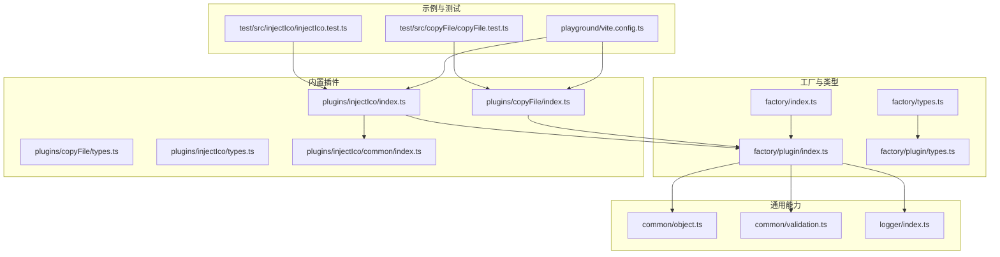
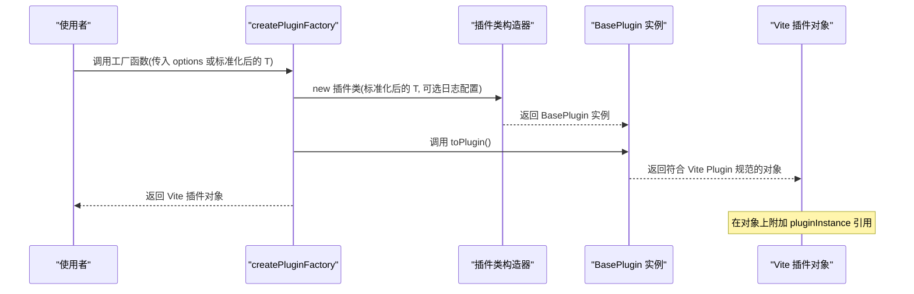
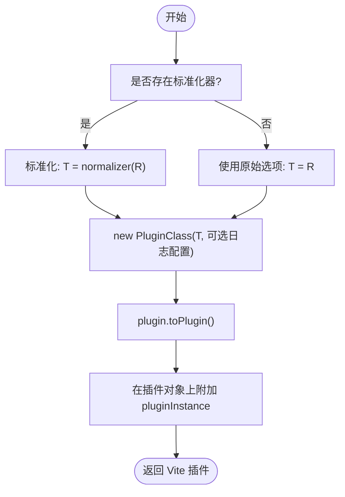
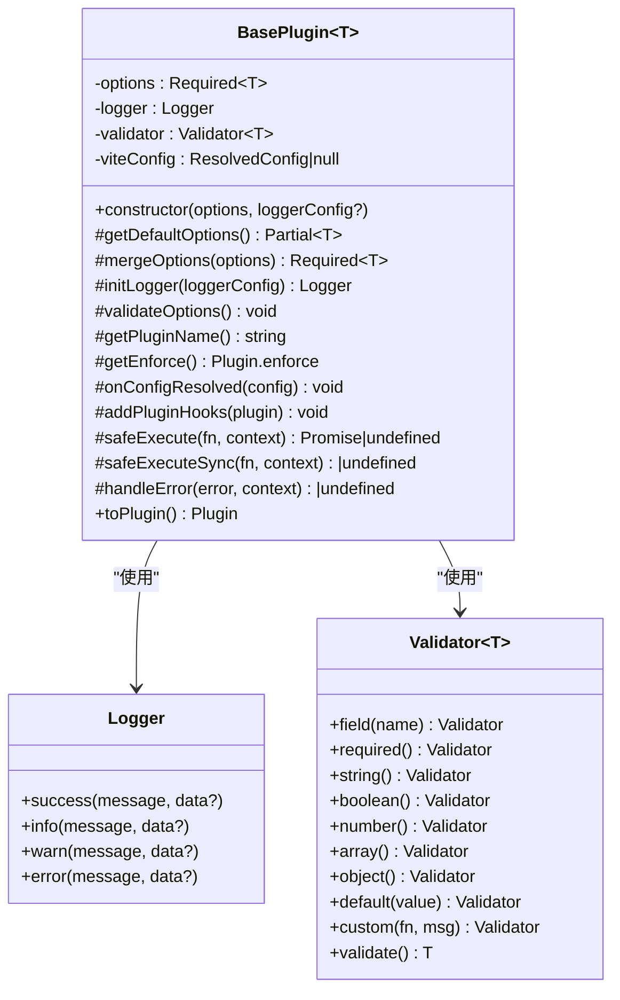
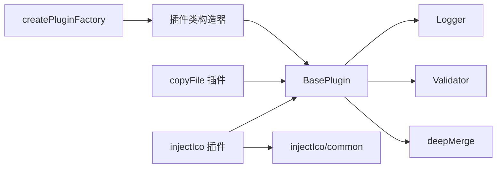

# 工厂 API

<cite>
**本文引用的文件**
- [packages/core/src/factory/plugin/index.ts](file://packages/core/src/factory/plugin/index.ts)
- [packages/core/src/factory/plugin/types.ts](file://packages/core/src/factory/plugin/types.ts)
- [packages/core/src/factory/index.ts](file://packages/core/src/factory/index.ts)
- [packages/core/src/factory/types.ts](file://packages/core/src/factory/types.ts)
- [packages/core/src/common/object.ts](file://packages/core/src/common/object.ts)
- [packages/core/src/common/validation.ts](file://packages/core/src/common/validation.ts)
- [packages/core/src/logger/index.ts](file://packages/core/src/logger/index.ts)
- [packages/core/src/plugins/copyFile/index.ts](file://packages/core/src/plugins/copyFile/index.ts)
- [packages/core/src/plugins/copyFile/types.ts](file://packages/core/src/plugins/copyFile/types.ts)
- [packages/core/src/plugins/injectIco/index.ts](file://packages/core/src/plugins/injectIco/index.ts)
- [packages/core/src/plugins/injectIco/types.ts](file://packages/core/src/plugins/injectIco/types.ts)
- [packages/core/src/plugins/injectIco/common/index.ts](file://packages/core/src/plugins/injectIco/common/index.ts)
- [packages/playground/vite.config.ts](file://packages/playground/vite.config.ts)
- [packages/test/src/copyFile/copyFile.test.ts](file://packages/test/src/copyFile/copyFile.test.ts)
- [packages/test/src/injectIco/injectIco.test.ts](file://packages/test/src/injectIco/injectIco.test.ts)
</cite>

## 目录
1. [简介](#简介)
2. [项目结构](#项目结构)
3. [核心组件](#核心组件)
4. [架构总览](#架构总览)
5. [详细组件分析](#详细组件分析)
6. [依赖分析](#依赖分析)
7. [性能考虑](#性能考虑)
8. [故障排查指南](#故障排查指南)
9. [结论](#结论)
10. [附录](#附录)

## 简介
本文件系统化阐述插件工厂 API 的设计与使用，重点围绕 createPluginFactory() 工厂函数的完整规范展开，涵盖：
- 工厂函数的类型签名、参数与返回值
- 插件生命周期与 BasePlugin 基类的职责边界
- 类型安全与错误处理机制
- 自定义插件开发指南与最佳实践
- 实际使用示例与扩展建议

## 项目结构
工厂 API 位于核心包 packages/core 下，采用“按领域分层 + 按功能聚合”的组织方式：
- factory：工厂与插件基类、类型定义
- plugins：内置插件实现（copyFile、injectIco）
- common：通用能力（深拷贝、校验器）
- logger：日志工具
- playground：使用示例
- test：行为测试



**图表来源**
- [packages/core/src/factory/index.ts](file://packages/core/src/factory/index.ts#L1-L2)
- [packages/core/src/factory/types.ts](file://packages/core/src/factory/types.ts#L1-L2)
- [packages/core/src/factory/plugin/index.ts](file://packages/core/src/factory/plugin/index.ts#L1-L387)
- [packages/core/src/factory/plugin/types.ts](file://packages/core/src/factory/plugin/types.ts#L1-L46)
- [packages/core/src/common/object.ts](file://packages/core/src/common/object.ts#L1-L30)
- [packages/core/src/common/validation.ts](file://packages/core/src/common/validation.ts#L1-L203)
- [packages/core/src/logger/index.ts](file://packages/core/src/logger/index.ts#L1-L131)
- [packages/core/src/plugins/copyFile/index.ts](file://packages/core/src/plugins/copyFile/index.ts#L1-L121)
- [packages/core/src/plugins/copyFile/types.ts](file://packages/core/src/plugins/copyFile/types.ts#L1-L44)
- [packages/core/src/plugins/injectIco/index.ts](file://packages/core/src/plugins/injectIco/index.ts#L1-L171)
- [packages/core/src/plugins/injectIco/types.ts](file://packages/core/src/plugins/injectIco/types.ts#L1-L113)
- [packages/core/src/plugins/injectIco/common/index.ts](file://packages/core/src/plugins/injectIco/common/index.ts#L1-L41)
- [packages/playground/vite.config.ts](file://packages/playground/vite.config.ts#L1-L69)
- [packages/test/src/copyFile/copyFile.test.ts](file://packages/test/src/copyFile/copyFile.test.ts#L1-L219)
- [packages/test/src/injectIco/injectIco.test.ts](file://packages/test/src/injectIco/injectIco.test.ts#L1-L273)

**章节来源**
- [packages/core/src/factory/index.ts](file://packages/core/src/factory/index.ts#L1-L2)
- [packages/core/src/factory/types.ts](file://packages/core/src/factory/types.ts#L1-L2)
- [packages/core/src/factory/plugin/index.ts](file://packages/core/src/factory/plugin/index.ts#L1-L387)
- [packages/core/src/factory/plugin/types.ts](file://packages/core/src/factory/plugin/types.ts#L1-L46)

## 核心组件
- BasePlugin<T extends BasePluginOptions>：插件基类，统一管理配置合并、日志、校验、生命周期钩子与错误策略。
- createPluginFactory<T, P, R>()：工厂函数，接收插件类构造器与可选的选项标准化器，返回符合 Vite Plugin 规范的工厂函数。
- BasePluginOptions：基础配置（启用开关、日志开关、错误策略）。
- OptionsNormalizer<T, R>：选项标准化器，将原始输入规范化为目标类型。
- PluginFactory<T, R>：工厂函数类型，接收原始配置并返回 Vite Plugin 对象。

关键职责与交互：
- BasePlugin 负责配置合并（deepMerge）、日志初始化、验证器初始化、生命周期钩子挂载与错误处理。
- createPluginFactory 负责实例化插件、调用 toPlugin() 转换为 Vite 插件，并在插件对象上附加原始实例引用，便于调试与扩展。

**章节来源**
- [packages/core/src/factory/plugin/index.ts](file://packages/core/src/factory/plugin/index.ts#L27-L349)
- [packages/core/src/factory/plugin/types.ts](file://packages/core/src/factory/plugin/types.ts#L3-L46)
- [packages/core/src/common/object.ts](file://packages/core/src/common/object.ts#L8-L29)
- [packages/core/src/common/validation.ts](file://packages/core/src/common/validation.ts#L16-L202)

## 架构总览
工厂模式将“插件类”与“Vite 插件对象”解耦，通过工厂函数集中处理实例化、配置标准化与对象转换，提升可测试性与可扩展性。



**图表来源**
- [packages/core/src/factory/plugin/index.ts](file://packages/core/src/factory/plugin/index.ts#L370-L386)

**章节来源**
- [packages/core/src/factory/plugin/index.ts](file://packages/core/src/factory/plugin/index.ts#L370-L386)

## 详细组件分析

### 工厂函数 createPluginFactory<T, P, R>()
- 类型参数
  - T：插件配置类型，需继承 BasePluginOptions
  - P：插件实例类型，需继承 BasePlugin<T>
  - R：原始配置类型（可选，默认与 T 相同）
- 参数
  - PluginClass：插件类构造器，接收 (options: T, loggerConfig?) -> P
  - normalizer：可选的 OptionsNormalizer<T, R>，用于将 R 类型标准化为 T
- 返回值
  - PluginFactory<T, R>：接收 R? 并返回 Vite Plugin 对象
- 行为要点
  - 若提供 normalizer，则将原始 options 通过 normalizer(R) -> T；否则直接使用 options 作为 T
  - 实例化插件类，调用 toPlugin() 转换为 Vite 插件对象
  - 在返回的 Vite 插件对象上挂载 pluginInstance 引用，便于调试与扩展



**图表来源**
- [packages/core/src/factory/plugin/index.ts](file://packages/core/src/factory/plugin/index.ts#L370-L386)

**章节来源**
- [packages/core/src/factory/plugin/index.ts](file://packages/core/src/factory/plugin/index.ts#L370-L386)
- [packages/core/src/factory/plugin/types.ts](file://packages/core/src/factory/plugin/types.ts#L31-L46)

### BasePlugin<T extends BasePluginOptions>
- 配置与日志
  - options：合并后的 Required<T>
  - logger：Logger 实例，受 verbose 控制
  - validator：Validator<T>，用于配置校验
- 生命周期钩子
  - getPluginName()：抽象，返回插件名称
  - getEnforce()：可选，返回 'pre' | 'post' | undefined
  - onConfigResolved(config)：保存解析后的 Vite 配置
  - addPluginHooks(plugin)：抽象，向 Vite 插件对象挂载钩子
  - toPlugin()：创建并返回 Vite 插件对象
- 错误处理
  - safeExecute(fn, context)：异步安全执行
  - safeExecuteSync(fn, context)：同步安全执行
  - handleError(error, context)：根据 errorStrategy 决策抛错或记录日志并返回 undefined
- 配置合并
  - mergeOptions(options)：将基础默认值、插件特定默认值与用户配置深度合并



**图表来源**
- [packages/core/src/factory/plugin/index.ts](file://packages/core/src/factory/plugin/index.ts#L27-L349)
- [packages/core/src/logger/index.ts](file://packages/core/src/logger/index.ts#L6-L131)
- [packages/core/src/common/validation.ts](file://packages/core/src/common/validation.ts#L16-L202)

**章节来源**
- [packages/core/src/factory/plugin/index.ts](file://packages/core/src/factory/plugin/index.ts#L27-L349)
- [packages/core/src/logger/index.ts](file://packages/core/src/logger/index.ts#L6-L131)
- [packages/core/src/common/validation.ts](file://packages/core/src/common/validation.ts#L16-L202)

### 类型系统与类型安全
- BasePluginOptions：enabled、verbose、errorStrategy
- PluginFactory<T, R>：(options?: R) => Plugin
- OptionsNormalizer<T, R>：(raw?: R) => T
- 深度合并 deepMerge：确保嵌套对象逐层合并，避免浅拷贝导致的副作用

```mermaid
erDiagram
BASE_PLUGIN_OPTIONS {
boolean enabled
boolean verbose
enum errorStrategy
}
COPY_FILE_OPTIONS {
string sourceDir
string targetDir
boolean overwrite
boolean recursive
boolean incremental
}
INJECT_ICO_OPTIONS {
string base
string url
string link
array icons
object copyOptions
}
BASE_PLUGIN_OPTIONS <|-- COPY_FILE_OPTIONS
BASE_PLUGIN_OPTIONS <|-- INJECT_ICO_OPTIONS
```

**图表来源**
- [packages/core/src/factory/plugin/types.ts](file://packages/core/src/factory/plugin/types.ts#L8-L29)
- [packages/core/src/plugins/copyFile/types.ts](file://packages/core/src/plugins/copyFile/types.ts#L8-L43)
- [packages/core/src/plugins/injectIco/types.ts](file://packages/core/src/plugins/injectIco/types.ts#L70-L112)

**章节来源**
- [packages/core/src/factory/plugin/types.ts](file://packages/core/src/factory/plugin/types.ts#L1-L46)
- [packages/core/src/plugins/copyFile/types.ts](file://packages/core/src/plugins/copyFile/types.ts#L1-L44)
- [packages/core/src/plugins/injectIco/types.ts](file://packages/core/src/plugins/injectIco/types.ts#L1-L113)

### 自定义插件开发指南
- 继承 BasePlugin<T>
  - 实现 getDefaultOptions()：提供插件特定默认值
  - 实现 getPluginName()：返回唯一插件名
  - 实现 addPluginHooks(plugin)：挂载所需 Vite 钩子
  - 可选重写 getEnforce()：控制执行时机
  - 可选重写 validateOptions()：使用 this.validator 进行字段校验
- 使用 createPluginFactory 创建工厂
  - 若需要将原始输入标准化为 T，提供 OptionsNormalizer<T, R>
  - 工厂返回的函数即为 Vite 插件工厂，可直接在 Vite 配置中使用
- 生命周期与错误策略
  - 在钩子中使用 this.safeExecute 或 this.safeExecuteSync 包裹异步/同步逻辑
  - 根据 errorStrategy 决定抛错或记录日志后继续执行

参考实现：
- 复制文件插件：[packages/core/src/plugins/copyFile/index.ts](file://packages/core/src/plugins/copyFile/index.ts#L13-L87)
- 注入图标插件：[packages/core/src/plugins/injectIco/index.ts](file://packages/core/src/plugins/injectIco/index.ts#L14-L132)

**章节来源**
- [packages/core/src/plugins/copyFile/index.ts](file://packages/core/src/plugins/copyFile/index.ts#L13-L87)
- [packages/core/src/plugins/injectIco/index.ts](file://packages/core/src/plugins/injectIco/index.ts#L14-L132)
- [packages/core/src/factory/plugin/index.ts](file://packages/core/src/factory/plugin/index.ts#L27-L349)

### 实际使用示例
- playground 示例：同时使用 injectIco 与 copyFile 插件
  - [packages/playground/vite.config.ts](file://packages/playground/vite.config.ts#L26-L66)
- 行为测试示例：
  - 复制文件插件测试：[packages/test/src/copyFile/copyFile.test.ts](file://packages/test/src/copyFile/copyFile.test.ts#L40-L218)
  - 注入图标插件测试：[packages/test/src/injectIco/injectIco.test.ts](file://packages/test/src/injectIco/injectIco.test.ts#L50-L273)

**章节来源**
- [packages/playground/vite.config.ts](file://packages/playground/vite.config.ts#L1-L69)
- [packages/test/src/copyFile/copyFile.test.ts](file://packages/test/src/copyFile/copyFile.test.ts#L1-L219)
- [packages/test/src/injectIco/injectIco.test.ts](file://packages/test/src/injectIco/injectIco.test.ts#L1-L273)

## 依赖分析
- BasePlugin 依赖
  - Logger：日志输出
  - Validator：配置校验
  - deepMerge：配置合并
- 工厂函数依赖
  - 插件类构造器：负责实例化具体插件
  - 可选标准化器：将 R 规范化为 T
- 内置插件依赖
  - copyFile：依赖 common 工具（文件存在性检查、复制）
  - injectIco：依赖 injectIco/common（图标标签生成）



**图表来源**
- [packages/core/src/factory/plugin/index.ts](file://packages/core/src/factory/plugin/index.ts#L1-L387)
- [packages/core/src/plugins/copyFile/index.ts](file://packages/core/src/plugins/copyFile/index.ts#L1-L121)
- [packages/core/src/plugins/injectIco/index.ts](file://packages/core/src/plugins/injectIco/index.ts#L1-L171)
- [packages/core/src/plugins/injectIco/common/index.ts](file://packages/core/src/plugins/injectIco/common/index.ts#L9-L40)

**章节来源**
- [packages/core/src/factory/plugin/index.ts](file://packages/core/src/factory/plugin/index.ts#L1-L387)
- [packages/core/src/plugins/copyFile/index.ts](file://packages/core/src/plugins/copyFile/index.ts#L1-L121)
- [packages/core/src/plugins/injectIco/index.ts](file://packages/core/src/plugins/injectIco/index.ts#L1-L171)
- [packages/core/src/plugins/injectIco/common/index.ts](file://packages/core/src/plugins/injectIco/common/index.ts#L1-L41)

## 性能考虑
- 配置合并：deepMerge 为 O(n+m) 层级遍历，嵌套对象深度合并，避免浅拷贝导致的副作用
- 日志控制：通过 verbose 开关减少不必要的日志输出
- 错误策略：errorStrategy 为 'log'/'ignore' 时可避免异常传播带来的额外开销
- 钩子执行：在钩子中使用 safeExecute/safeExecuteSync 包裹，避免异常中断构建流程

[本节为通用指导，无需列出具体文件来源]

## 故障排查指南
- 配置验证失败
  - 症状：初始化阶段抛出配置错误
  - 排查：检查 validateOptions() 中的字段约束与自定义校验
  - 参考：[packages/core/src/common/validation.ts](file://packages/core/src/common/validation.ts#L195-L201)
- 插件未生效
  - 症状：writeBundle/transformIndexHtml 未触发
  - 排查：确认 enabled 为 true；检查 enforce 设置；确认 toPlugin() 已正确挂载钩子
  - 参考：[packages/core/src/factory/plugin/index.ts](file://packages/core/src/factory/plugin/index.ts#L332-L348)
- 错误策略影响
  - 症状：构建中断或静默失败
  - 排查：根据 errorStrategy 选择 'throw'/'log'/'ignore'
  - 参考：[packages/core/src/factory/plugin/index.ts](file://packages/core/src/factory/plugin/index.ts#L284-L312)
- 日志定位
  - 使用 Logger 的 info/warn/error 输出上下文信息，结合插件名定位问题
  - 参考：[packages/core/src/logger/index.ts](file://packages/core/src/logger/index.ts#L78-L129)

**章节来源**
- [packages/core/src/common/validation.ts](file://packages/core/src/common/validation.ts#L195-L201)
- [packages/core/src/factory/plugin/index.ts](file://packages/core/src/factory/plugin/index.ts#L284-L348)
- [packages/core/src/logger/index.ts](file://packages/core/src/logger/index.ts#L78-L129)

## 结论
工厂 API 通过 createPluginFactory 将插件类与 Vite 插件对象解耦，配合 BasePlugin 的生命周期与错误处理机制，提供了类型安全、可测试且易于扩展的插件开发框架。推荐在自定义插件中遵循以下原则：
- 明确插件默认配置与校验规则
- 使用标准化器处理多样化的原始输入
- 在钩子中统一使用安全执行包装
- 通过 errorStrategy 与 verbose 精细控制错误与日志

[本节为总结性内容，无需列出具体文件来源]

## 附录

### API 规范速查
- createPluginFactory
  - 输入：插件类构造器、可选标准化器
  - 输出：(options?: R) => Plugin
  - 关键行为：实例化插件、toPlugin()、附加 pluginInstance
- BasePlugin
  - 生命周期：getPluginName/getEnforce/onConfigResolved/addPluginHooks/toPlugin
  - 安全执行：safeExecute/safeExecuteSync
  - 错误策略：handleError
- 类型
  - BasePluginOptions：enabled、verbose、errorStrategy
  - PluginFactory<T, R>：工厂函数类型
  - OptionsNormalizer<T, R>：标准化器类型

**章节来源**
- [packages/core/src/factory/plugin/index.ts](file://packages/core/src/factory/plugin/index.ts#L370-L386)
- [packages/core/src/factory/plugin/types.ts](file://packages/core/src/factory/plugin/types.ts#L3-L46)