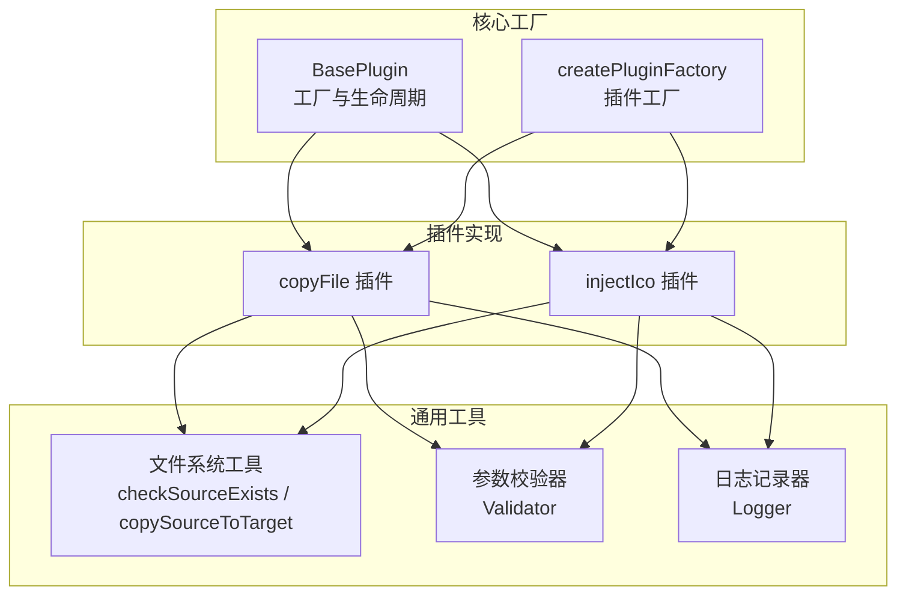
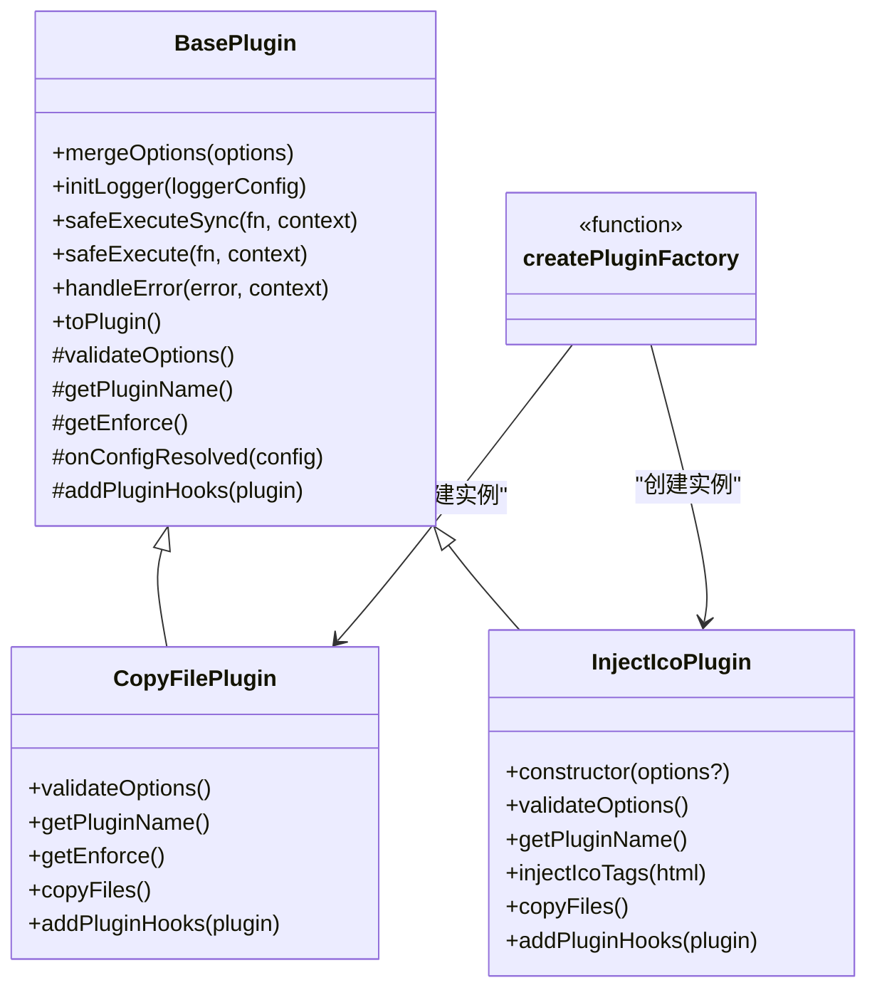
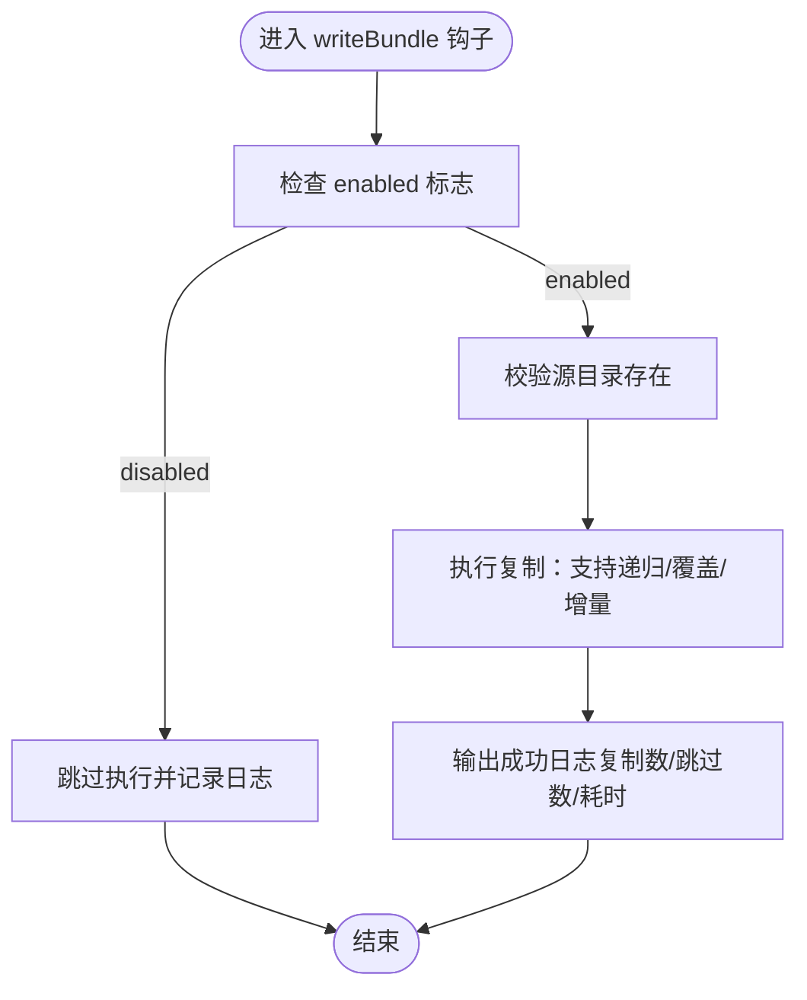
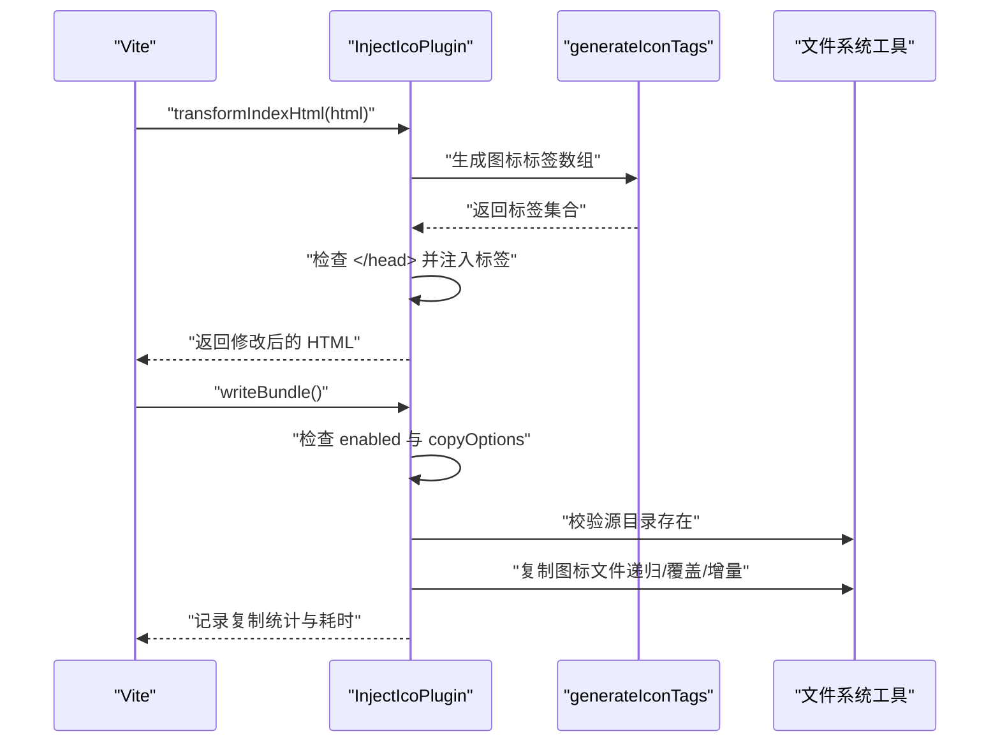
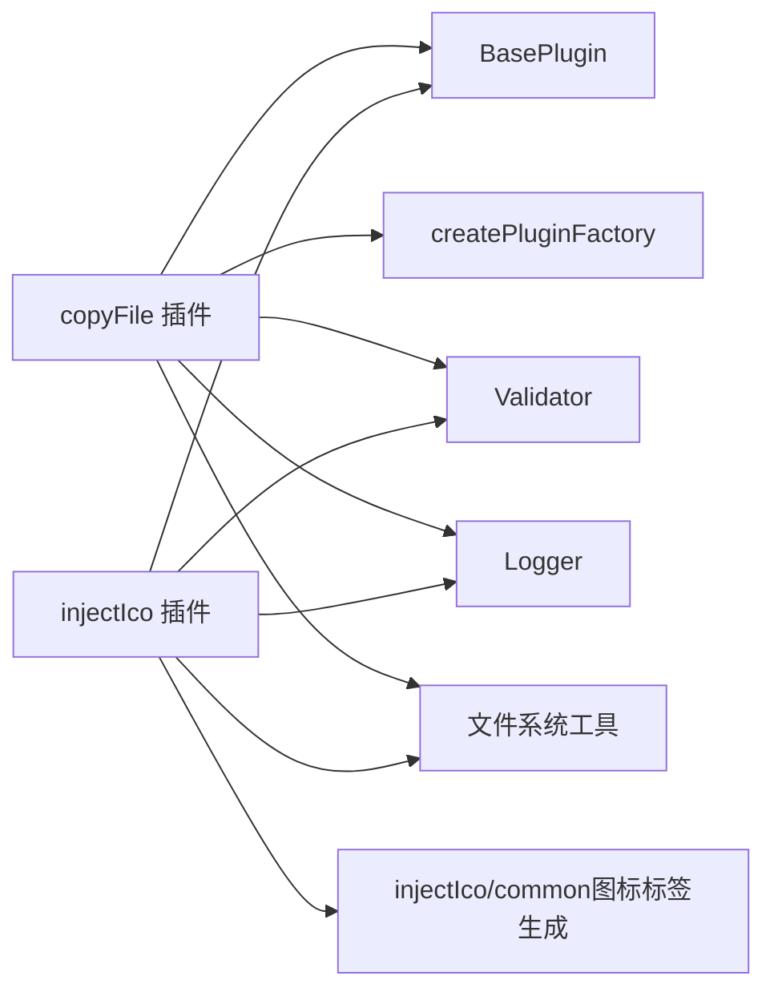

# 插件 API

<cite>
**本文档引用的文件**
- [packages/core/src/plugins/index.ts](file://packages/core/src/plugins/index.ts)
- [packages/core/src/plugins/copyFile/index.ts](file://packages/core/src/plugins/copyFile/index.ts)
- [packages/core/src/plugins/copyFile/types.ts](file://packages/core/src/plugins/copyFile/types.ts)
- [packages/core/src/plugins/injectIco/index.ts](file://packages/core/src/plugins/injectIco/index.ts)
- [packages/core/src/plugins/injectIco/types.ts](file://packages/core/src/plugins/injectIco/types.ts)
- [packages/core/src/plugins/injectIco/common/index.ts](file://packages/core/src/plugins/injectIco/common/index.ts)
- [packages/core/src/factory/plugin/index.ts](file://packages/core/src/factory/plugin/index.ts)
- [packages/core/src/factory/plugin/types.ts](file://packages/core/src/factory/plugin/types.ts)
- [packages/core/src/factory/types.ts](file://packages/core/src/factory/types.ts)
- [packages/core/src/common/fs/index.ts](file://packages/core/src/common/fs/index.ts)
- [packages/core/src/common/validation.ts](file://packages/core/src/common/validation.ts)
- [packages/core/src/logger/index.ts](file://packages/core/src/logger/index.ts)
- [packages/docs/src/plugins/copy-file.md](file://packages/docs/src/plugins/copy-file.md)
</cite>

## 目录
1. [简介](#简介)
2. [项目结构](#项目结构)
3. [核心组件](#核心组件)
4. [架构总览](#架构总览)
5. [详细组件分析](#详细组件分析)
6. [依赖关系分析](#依赖关系分析)
7. [性能考虑](#性能考虑)
8. [故障排除指南](#故障排除指南)
9. [结论](#结论)
10. [附录](#附录)

## 简介
本文件为 MengXi Studio Vite 插件生态中的插件 API 详细文档，重点覆盖以下两个插件工厂函数：
- copyFile()：在构建完成后复制文件或目录，支持递归、覆盖与增量复制。
- injectIco()：在 HTML 中注入网站图标链接，并可选地复制图标资源到打包目录。

文档内容涵盖：
- API 规范：函数签名、参数类型、返回值、生命周期钩子
- 配置选项与类型定义：完整 TypeScript 接口说明
- 使用示例与最佳实践：基础到高级配置、组合使用方法
- 错误处理与性能优化：错误策略、日志、增量复制、并发与 I/O 优化
- 常见问题与调试技巧：典型错误、定位方法与修复建议

## 项目结构
插件位于 packages/core/src 下，采用“按功能模块分层”的组织方式：
- factory：插件基类与工厂函数，统一生命周期与错误处理
- plugins：具体插件实现与类型定义
- common：通用工具（文件系统、校验器）
- logger：统一日志输出
- docs：配套文档（含 copyFile 的 Markdown 文档）

图表来源
- [packages/core/src/factory/plugin/index.ts](file://packages/core/src/factory/plugin/index.ts#L27-L337)
- [packages/core/src/plugins/copyFile/index.ts](file://packages/core/src/plugins/copyFile/index.ts#L1-L116)
- [packages/core/src/plugins/injectIco/index.ts](file://packages/core/src/plugins/injectIco/index.ts#L1-L178)
- [packages/core/src/common/fs/index.ts](file://packages/core/src/common/fs/index.ts#L10-L202)
- [packages/core/src/common/validation.ts](file://packages/core/src/common/validation.ts#L16-L202)
- [packages/core/src/logger/index.ts](file://packages/core/src/logger/index.ts#L6-L131)

章节来源
- [packages/core/src/plugins/index.ts](file://packages/core/src/plugins/index.ts#L1-L3)
- [packages/core/src/factory/plugin/index.ts](file://packages/core/src/factory/plugin/index.ts#L27-L337)

## 核心组件
- BasePlugin<T>：所有插件的抽象基类，提供配置合并、日志、校验、生命周期钩子注册与错误处理。
- createPluginFactory<T, P>()：插件工厂函数，接收插件类构造器，返回符合 Vite 规范的 Plugin 对象。
- Validator：链式参数校验器，支持必填、类型、默认值与自定义校验。
- Logger：统一日志输出，支持 info/success/warn/error 四种级别。
- 文件系统工具：checkSourceExists、ensureTargetDir、readDirRecursive、shouldUpdateFile、copySourceToTarget、writeFileContent、readFileSync。

章节来源
- [packages/core/src/factory/plugin/index.ts](file://packages/core/src/factory/plugin/index.ts#L27-L337)
- [packages/core/src/factory/plugin/types.ts](file://packages/core/src/factory/plugin/types.ts#L1-L37)
- [packages/core/src/common/validation.ts](file://packages/core/src/common/validation.ts#L16-L202)
- [packages/core/src/logger/index.ts](file://packages/core/src/logger/index.ts#L6-L131)
- [packages/core/src/common/fs/index.ts](file://packages/core/src/common/fs/index.ts#L10-L202)

## 架构总览
下图展示了插件工厂与具体插件的关系，以及关键依赖：

图表来源
- [packages/core/src/factory/plugin/index.ts](file://packages/core/src/factory/plugin/index.ts#L27-L337)
- [packages/core/src/plugins/copyFile/index.ts](file://packages/core/src/plugins/copyFile/index.ts#L13-L82)
- [packages/core/src/plugins/injectIco/index.ts](file://packages/core/src/plugins/injectIco/index.ts#L14-L139)

## 详细组件分析

### copyFile 插件 API 规范
- 工厂函数：copyFile(options?: CopyFileOptions): Plugin
- 执行时机：enforce: 'post'，在构建流程末尾执行
- 生命周期钩子：
  - writeBundle：执行文件复制
- 主要行为：
  - 校验 sourceDir 与 targetDir 存在性
  - 支持递归、覆盖与增量复制
  - 输出复制统计与耗时日志
- 返回值：返回符合 Vite 规范的 Plugin 对象

配置选项（CopyFileOptions）：
- sourceDir: string（必填，非空字符串）
- targetDir: string（必填，非空字符串）
- overwrite?: boolean（默认 true）
- recursive?: boolean（默认 true）
- incremental?: boolean（默认 true）
- 继承基础选项：enabled、verbose、errorStrategy

类型定义参考：
- [CopyFileOptions 接口](file://packages/core/src/plugins/copyFile/types.ts#L8-L43)

使用示例（路径引用）：
- [基础用法示例](file://packages/docs/src/plugins/copy-file.md#L21-L33)
- [完整配置示例](file://packages/docs/src/plugins/copy-file.md#L37-L54)
- [自定义配置示例](file://packages/docs/src/plugins/copy-file.md#L89-L107)
- [按环境启用示例](file://packages/docs/src/plugins/copy-file.md#L111-L124)
- [禁用插件示例](file://packages/docs/src/plugins/copy-file.md#L128-L141)

实现要点与流程图：

图表来源
- [packages/core/src/plugins/copyFile/index.ts](file://packages/core/src/plugins/copyFile/index.ts#L53-L75)
- [packages/core/src/common/fs/index.ts](file://packages/core/src/common/fs/index.ts#L98-L202)

章节来源
- [packages/core/src/plugins/copyFile/index.ts](file://packages/core/src/plugins/copyFile/index.ts#L13-L116)
- [packages/core/src/plugins/copyFile/types.ts](file://packages/core/src/plugins/copyFile/types.ts#L8-L43)
- [packages/docs/src/plugins/copy-file.md](file://packages/docs/src/plugins/copy-file.md#L1-L159)

### injectIco 插件 API 觨范
- 工厂函数：injectIco(options?: string | InjectIcoOptions): Plugin
- 执行时机：默认 enforce: undefined（由 Vite 按默认顺序执行）
- 生命周期钩子：
  - transformIndexHtml：向 HTML 注入图标 link 标签
  - writeBundle：可选复制图标资源到目标目录
- 主要行为：
  - 生成图标标签（支持 link、icons、url、base）
  - 可选复制图标文件（基于 copyOptions）
  - 避免重复注入，仅在找到 </head> 时注入

配置选项（InjectIcoOptions）：
- base?: string（默认 '/'）
- url?: string（完整图标 URL，优先于 base）
- link?: string（完整 link 标签，优先于 url/base）
- icons?: Icon[]（图标数组，包含 rel、href、sizes、type）
- copyOptions?: CopyOptions（可选，启用图标文件复制）
- 继承基础选项：enabled、verbose、errorStrategy

类型定义参考：
- [InjectIcoOptions 接口](file://packages/core/src/plugins/injectIco/types.ts#L66-L112)
- [Icon 接口](file://packages/core/src/plugins/injectIco/types.ts#L8-L28)
- [CopyOptions 接口](file://packages/core/src/plugins/injectIco/types.ts#L35-L63)

实现要点与序列图：

图表来源
- [packages/core/src/plugins/injectIco/index.ts](file://packages/core/src/plugins/injectIco/index.ts#L130-L139)
- [packages/core/src/plugins/injectIco/common/index.ts](file://packages/core/src/plugins/injectIco/common/index.ts#L9-L40)
- [packages/core/src/common/fs/index.ts](file://packages/core/src/common/fs/index.ts#L98-L202)

章节来源
- [packages/core/src/plugins/injectIco/index.ts](file://packages/core/src/plugins/injectIco/index.ts#L14-L178)
- [packages/core/src/plugins/injectIco/types.ts](file://packages/core/src/plugins/injectIco/types.ts#L66-L112)
- [packages/core/src/plugins/injectIco/common/index.ts](file://packages/core/src/plugins/injectIco/common/index.ts#L9-L40)

## 依赖关系分析
- copyFile 依赖：
  - BasePlugin（生命周期与错误处理）
  - createPluginFactory（工厂）
  - Validator（配置校验）
  - Logger（日志）
  - 文件系统工具（源存在性检查、复制实现）
- injectIco 依赖：
  - BasePlugin（生命周期与错误处理）
  - Validator（配置校验）
  - Logger（日志）
  - 文件系统工具（源存在性检查、复制实现）
  - injectIco/common（图标标签生成）

图表来源
- [packages/core/src/plugins/copyFile/index.ts](file://packages/core/src/plugins/copyFile/index.ts#L1-L5)
- [packages/core/src/plugins/injectIco/index.ts](file://packages/core/src/plugins/injectIco/index.ts#L1-L5)
- [packages/core/src/factory/plugin/index.ts](file://packages/core/src/factory/plugin/index.ts#L371-L383)

章节来源
- [packages/core/src/plugins/copyFile/index.ts](file://packages/core/src/plugins/copyFile/index.ts#L1-L5)
- [packages/core/src/plugins/injectIco/index.ts](file://packages/core/src/plugins/injectIco/index.ts#L1-L5)
- [packages/core/src/factory/plugin/index.ts](file://packages/core/src/factory/plugin/index.ts#L371-L383)

## 性能考虑
- 增量复制：copyFile 与 injectIco 在复制时支持增量模式，仅复制变更文件，减少 I/O 开销。
- 递归复制：合理使用 recursive 控制复制范围，避免不必要的深层遍历。
- 覆盖策略：overwrite=false 可避免重复写入，但需注意 shouldUpdateFile 的 stat 比较开销。
- 并发与 I/O：批量复制时建议避免过度并发，优先保证磁盘吞吐稳定。
- 日志级别：在生产构建中可关闭 verbose 以减少日志输出带来的额外开销。
- HTML 注入：injectIco 仅在检测到 </head> 时注入，避免重复注入与多余字符串拼接。

[本节为通用性能建议，无需特定文件引用]

## 故障排除指南
- 源路径不存在
  - 现象：抛出“源文件不存在”错误
  - 处理：确认 sourceDir 存在且可访问；必要时在复制前进行预检查
  - 参考实现：[checkSourceExists](file://packages/core/src/common/fs/index.ts#L10-L23)
- 权限不足
  - 现象：复制或写入时报权限错误
  - 处理：提升目录权限或调整目标路径；在 CI 环境中确保工作目录权限
  - 参考实现：[ensureTargetDir / copySourceToTarget / writeFileContent](file://packages/core/src/common/fs/index.ts#L30-L221)
- HTML 注入失败
  - 现象：未找到 </head> 标签，跳过注入
  - 处理：确认模板 HTML 结构；injectIco 会自动跳过无 </head> 的情况
  - 参考实现：[injectIco 注入逻辑](file://packages/core/src/plugins/injectIco/index.ts#L55-L89)
- 配置校验失败
  - 现象：抛出“配置验证失败”错误
  - 处理：检查必填字段与类型；使用默认值或修正类型
  - 参考实现：[Validator](file://packages/core/src/common/validation.ts#L16-L202)
- 错误策略选择
  - 'throw'：立即中断构建，便于快速发现错误
  - 'log'/'ignore'：记录错误并继续，适合非关键任务
  - 参考实现：[handleError](file://packages/core/src/factory/plugin/index.ts#L272-L300)

章节来源
- [packages/core/src/common/fs/index.ts](file://packages/core/src/common/fs/index.ts#L10-L221)
- [packages/core/src/plugins/injectIco/index.ts](file://packages/core/src/plugins/injectIco/index.ts#L55-L89)
- [packages/core/src/common/validation.ts](file://packages/core/src/common/validation.ts#L16-L202)
- [packages/core/src/factory/plugin/index.ts](file://packages/core/src/factory/plugin/index.ts#L272-L300)

## 结论
- copyFile 与 injectIco 均基于统一的 BasePlugin 与 createPluginFactory，具备一致的生命周期、日志与错误处理机制。
- copyFile 专注于静态资源复制，支持增量与递归，适合构建后资产整理。
- injectIco 专注于 HTML 图标注入与可选的图标复制，满足多格式、多尺寸图标需求。
- 建议在生产环境结合 errorStrategy 与 verbose 进行权衡；在大型项目中优先启用增量复制以提升构建效率。

[本节为总结性内容，无需特定文件引用]

## 附录

### API 一览表
- copyFile(options?: CopyFileOptions): Plugin
  - 参数：CopyFileOptions
  - 返回：Vite 插件对象
  - 生命周期：writeBundle（post）
  - 参考：[copyFile 实现](file://packages/core/src/plugins/copyFile/index.ts#L13-L116)，[类型定义](file://packages/core/src/plugins/copyFile/types.ts#L8-L43)
- injectIco(options?: string | InjectIcoOptions): Plugin
  - 参数：字符串（base）或 InjectIcoOptions
  - 返回：Vite 插件对象
  - 生命周期：transformIndexHtml、writeBundle
  - 参考：[injectIco 实现](file://packages/core/src/plugins/injectIco/index.ts#L14-L178)，[类型定义](file://packages/core/src/plugins/injectIco/types.ts#L66-L112)

### 组合使用与最佳实践
- 典型组合：先 injectIco 注入图标链接，再 copyFile 复制图标资源，确保 HTML 与静态资源一致。
- 环境区分：在开发环境关闭 verbose，在生产环境开启以获得完整日志。
- 错误策略：关键任务使用 'throw'，非关键任务使用 'log'/'ignore'。
- 资源管理：为 copyOptions 设置合理的 sourceDir/targetDir，避免与构建产物冲突。

[本节为通用实践建议，无需特定文件引用]