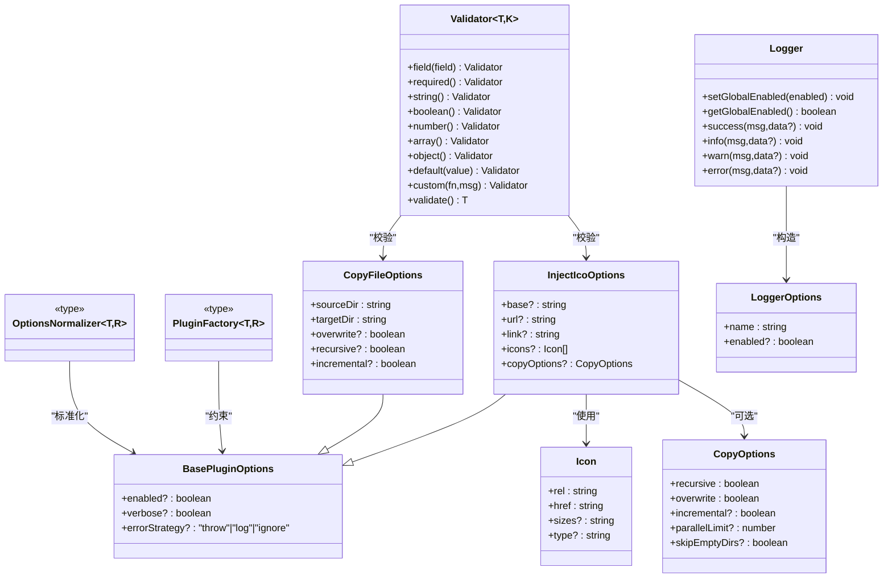
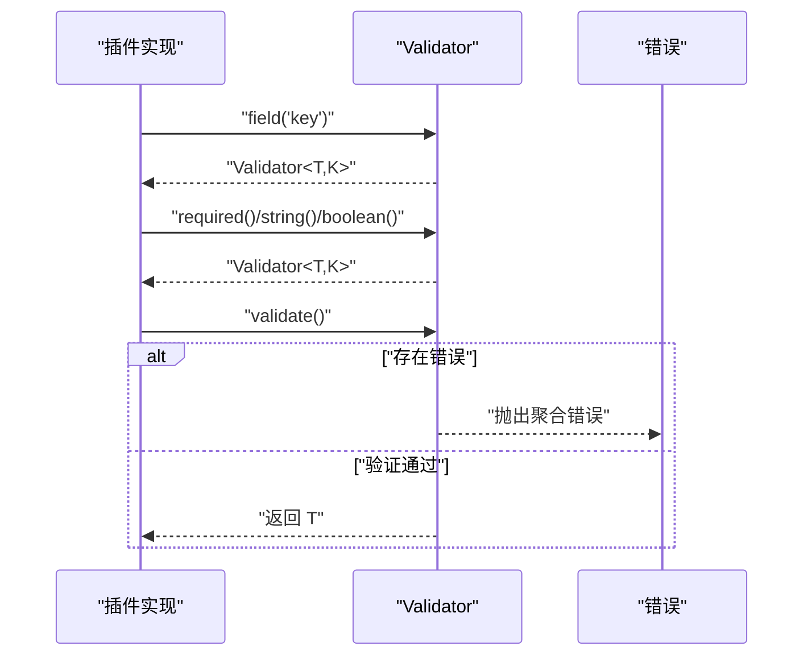
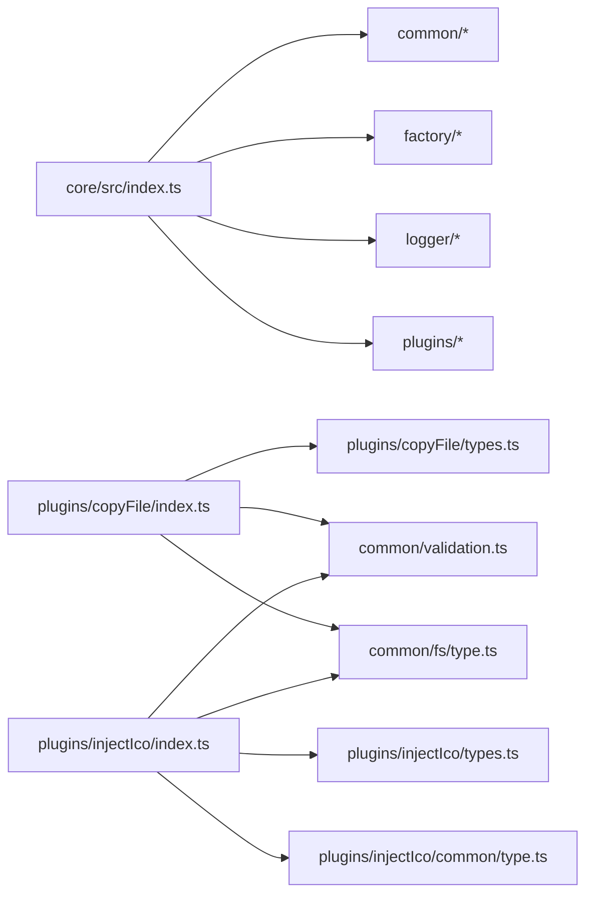

# 类型定义

<cite>
**本文引用的文件**
- [packages/core/src/index.ts](file://packages/core/src/index.ts)
- [packages/core/src/factory/index.ts](file://packages/core/src/factory/index.ts)
- [packages/core/src/factory/types.ts](file://packages/core/src/factory/types.ts)
- [packages/core/src/factory/plugin/types.ts](file://packages/core/src/factory/plugin/types.ts)
- [packages/core/src/common/validation.ts](file://packages/core/src/common/validation.ts)
- [packages/core/src/common/object.ts](file://packages/core/src/common/object.ts)
- [packages/core/src/common/fs/type.ts](file://packages/core/src/common/fs/type.ts)
- [packages/core/src/logger/index.ts](file://packages/core/src/logger/index.ts)
- [packages/core/src/logger/types.ts](file://packages/core/src/logger/types.ts)
- [packages/core/src/plugins/copyFile/types.ts](file://packages/core/src/plugins/copyFile/types.ts)
- [packages/core/src/plugins/copyFile/index.ts](file://packages/core/src/plugins/copyFile/index.ts)
- [packages/core/src/plugins/injectIco/types.ts](file://packages/core/src/plugins/injectIco/types.ts)
- [packages/core/src/plugins/injectIco/common/type.ts](file://packages/core/src/plugins/injectIco/common/type.ts)
- [packages/core/src/plugins/injectIco/index.ts](file://packages/core/src/plugins/injectIco/index.ts)
- [packages/playground/vite.config.ts](file://packages/playground/vite.config.ts)
</cite>

## 目录
1. [简介](#简介)
2. [项目结构](#项目结构)
3. [核心组件](#核心组件)
4. [架构总览](#架构总览)
5. [详细组件分析](#详细组件分析)
6. [依赖分析](#依赖分析)
7. [性能考虑](#性能考虑)
8. [故障排查指南](#故障排查指南)
9. [结论](#结论)
10. [附录](#附录)

## 简介
本文件为 MengXi Studio Vite 插件体系的 TypeScript 类型定义参考文档，聚焦于以下方面：
- 插件配置接口与工厂类型定义
- 工具类型声明（泛型、联合类型、类型别名）
- 类型安全最佳实践与常见错误的解决方案
- 版本兼容性与迁移建议
- 类型推断与约束技巧
- 类型与运行时行为的关系及验证方法
- 每个重要类型的注释说明、使用场景与示例路径

## 项目结构
核心类型分布在如下模块：
- 工厂层：提供插件工厂函数类型与基础插件配置
- 通用工具层：验证器、深拷贝、文件复制选项与结果
- 日志层：日志器与日志选项
- 插件层：各插件的配置接口与实现入口
- 示例与测试：在 Playground 中演示类型的实际使用

```mermaid
graph TB
subgraph "核心导出"
CORE["packages/core/src/index.ts<br/>导出 common/factory/logger/plugins"]
end
subgraph "工厂层"
FACTORY_INDEX["packages/core/src/factory/index.ts"]
FACTORY_TYPES["packages/core/src/factory/types.ts"]
PLUGIN_TYPES["packages/core/src/factory/plugin/types.ts"]
end
subgraph "通用工具层"
VALIDATION["packages/core/src/common/validation.ts"]
OBJECT_UTIL["packages/core/src/common/object.ts"]
FS_TYPES["packages/core/src/common/fs/type.ts"]
end
subgraph "日志层"
LOGGER_INDEX["packages/core/src/logger/index.ts"]
LOGGER_TYPES["packages/core/src/logger/types.ts"]
end
subgraph "插件层"
COPY_TYPES["packages/core/src/plugins/copyFile/types.ts"]
COPY_PLUGIN["packages/core/src/plugins/copyFile/index.ts"]
ICO_TYPES["packages/core/src/plugins/injectIco/types.ts"]
ICO_COMMON["packages/core/src/plugins/injectIco/common/type.ts"]
ICO_PLUGIN["packages/core/src/plugins/injectIco/index.ts"]
end
CORE --> FACTORY_INDEX
CORE --> VALIDATION
CORE --> LOGGER_INDEX
CORE --> COPY_TYPES
CORE --> ICO_TYPES
FACTORY_INDEX --> PLUGIN_TYPES
FACTORY_TYPES --> PLUGIN_TYPES
COPY_PLUGIN --> COPY_TYPES
ICO_PLUGIN --> ICO_TYPES
ICO_PLUGIN --> ICO_COMMON
```

图表来源
- [packages/core/src/index.ts](file://packages/core/src/index.ts#L1-L8)
- [packages/core/src/factory/index.ts](file://packages/core/src/factory/index.ts#L1-L2)
- [packages/core/src/factory/types.ts](file://packages/core/src/factory/types.ts#L1-L2)
- [packages/core/src/factory/plugin/types.ts](file://packages/core/src/factory/plugin/types.ts#L1-L46)
- [packages/core/src/common/validation.ts](file://packages/core/src/common/validation.ts#L1-L203)
- [packages/core/src/common/object.ts](file://packages/core/src/common/object.ts#L1-L30)
- [packages/core/src/common/fs/type.ts](file://packages/core/src/common/fs/type.ts#L1-L55)
- [packages/core/src/logger/index.ts](file://packages/core/src/logger/index.ts#L1-L155)
- [packages/core/src/logger/types.ts](file://packages/core/src/logger/types.ts#L1-L14)
- [packages/core/src/plugins/copyFile/types.ts](file://packages/core/src/plugins/copyFile/types.ts#L1-L44)
- [packages/core/src/plugins/copyFile/index.ts](file://packages/core/src/plugins/copyFile/index.ts#L1-L121)
- [packages/core/src/plugins/injectIco/types.ts](file://packages/core/src/plugins/injectIco/types.ts#L1-L113)
- [packages/core/src/plugins/injectIco/common/type.ts](file://packages/core/src/plugins/injectIco/common/type.ts#L1-L47)
- [packages/core/src/plugins/injectIco/index.ts](file://packages/core/src/plugins/injectIco/index.ts#L1-L169)

章节来源
- [packages/core/src/index.ts](file://packages/core/src/index.ts#L1-L8)

## 核心组件
本节梳理公共接口与类型别名，帮助快速定位与理解。

- 基础插件配置
  - 接口：BasePluginOptions
  - 关键属性：enabled、verbose、errorStrategy
  - 取值范围：errorStrategy 为 'throw' | 'log' | 'ignore'
  - 用途：作为所有插件配置的基类接口，统一启用、日志与错误策略

- 插件工厂类型
  - 类型别名：OptionsNormalizer<T, R>
  - 类型别名：PluginFactory<T, R>
  - 泛型约束：T 继承自 BasePluginOptions；R 为原始配置类型
  - 用途：标准化原始配置到目标配置，并产出 Vite 插件实例

- 验证器
  - 类：Validator<T, K>
  - 泛型：T 为选项对象类型；K 为当前字段键
  - 流畅 API：field().required().string().boolean().number().array().object().default().custom().validate()
  - 用途：在插件初始化阶段对配置进行类型与业务规则校验

- 深度合并
  - 函数：deepMerge<T>(...sources: Partial<T>[]): T
  - 用途：对多个对象进行深度合并，保留嵌套对象的结构

- 文件复制选项与结果
  - 接口：CopyOptions（recursive、overwrite、incremental、parallelLimit、skipEmptyDirs）
  - 接口：CopyResult（copiedFiles、skippedFiles、copiedDirs、executionTime）

- 日志器与日志选项
  - 接口：LoggerOptions（name、enabled）
  - 类：Logger（静态开关、实例开关、多类型日志输出）

- 插件：复制文件
  - 接口：CopyFileOptions（继承 BasePluginOptions，新增 sourceDir、targetDir、overwrite、recursive、incremental）
  - 工厂：copyFile（基于 createPluginFactory）

- 插件：注入图标
  - 接口：InjectIcoOptions（继承 BasePluginOptions，新增 base、url、link、icons、copyOptions）
  - 子接口：Icon、CopyOptions（内部定义）
  - 工厂：injectIco（支持字符串或对象配置，内部标准化为对象）

章节来源
- [packages/core/src/factory/plugin/types.ts](file://packages/core/src/factory/plugin/types.ts#L1-L46)
- [packages/core/src/common/validation.ts](file://packages/core/src/common/validation.ts#L1-L203)
- [packages/core/src/common/object.ts](file://packages/core/src/common/object.ts#L1-L30)
- [packages/core/src/common/fs/type.ts](file://packages/core/src/common/fs/type.ts#L1-L55)
- [packages/core/src/logger/types.ts](file://packages/core/src/logger/types.ts#L1-L14)
- [packages/core/src/logger/index.ts](file://packages/core/src/logger/index.ts#L1-L155)
- [packages/core/src/plugins/copyFile/types.ts](file://packages/core/src/plugins/copyFile/types.ts#L1-L44)
- [packages/core/src/plugins/injectIco/types.ts](file://packages/core/src/plugins/injectIco/types.ts#L1-L113)
- [packages/core/src/plugins/injectIco/common/type.ts](file://packages/core/src/plugins/injectIco/common/type.ts#L1-L47)

## 架构总览
下图展示类型与实现之间的关系：工厂类型定义位于工厂层，插件配置接口位于插件层，验证器与日志器贯穿各插件实现。

图表来源
- [packages/core/src/factory/plugin/types.ts](file://packages/core/src/factory/plugin/types.ts#L1-L46)
- [packages/core/src/common/validation.ts](file://packages/core/src/common/validation.ts#L1-L203)
- [packages/core/src/plugins/copyFile/types.ts](file://packages/core/src/plugins/copyFile/types.ts#L1-L44)
- [packages/core/src/plugins/injectIco/types.ts](file://packages/core/src/plugins/injectIco/types.ts#L1-L113)
- [packages/core/src/plugins/injectIco/common/type.ts](file://packages/core/src/plugins/injectIco/common/type.ts#L1-L47)
- [packages/core/src/logger/types.ts](file://packages/core/src/logger/types.ts#L1-L14)
- [packages/core/src/logger/index.ts](file://packages/core/src/logger/index.ts#L1-L155)

## 详细组件分析

### 工厂类型与插件配置
- BasePluginOptions
  - 作用：统一插件启用、日志与错误策略
  - 默认值：enabled 默认启用；verbose 默认开启日志；errorStrategy 默认抛出异常
  - 使用场景：所有插件配置接口的基类，确保一致的生命周期与错误处理策略

- OptionsNormalizer<T, R>
  - 作用：将原始配置 R 映射为强类型配置 T
  - 适用：当插件支持多种输入形式（如字符串或对象）时，通过标准化器转换为统一对象

- PluginFactory<T, R>
  - 作用：接收可选的原始配置 R，返回 Vite 的 Plugin 实例
  - 约束：T 必须继承 BasePluginOptions，保证插件具备统一的开关与日志能力

- 使用示例路径
  - 复制文件插件工厂：[packages/core/src/plugins/copyFile/index.ts](file://packages/core/src/plugins/copyFile/index.ts#L120-L121)
  - 注入图标插件工厂（字符串到对象的标准化）：[packages/core/src/plugins/injectIco/index.ts](file://packages/core/src/plugins/injectIco/index.ts#L168-L169)

章节来源
- [packages/core/src/factory/plugin/types.ts](file://packages/core/src/factory/plugin/types.ts#L1-L46)
- [packages/core/src/plugins/copyFile/index.ts](file://packages/core/src/plugins/copyFile/index.ts#L120-L121)
- [packages/core/src/plugins/injectIco/index.ts](file://packages/core/src/plugins/injectIco/index.ts#L168-L169)

### 验证器：Validator<T, K>
- 设计要点
  - 泛型 K 用于在链式调用中逐步收窄当前字段类型
  - 支持 required、string、boolean、number、array、object、default、custom、validate
  - validate 失败时抛出聚合错误信息，便于一次性发现配置问题

- 使用流程（序列图）

图表来源
- [packages/core/src/common/validation.ts](file://packages/core/src/common/validation.ts#L195-L201)

- 在插件中的应用
  - 复制文件插件：对 sourceDir、targetDir、overwrite、recursive、incremental 进行验证
  - 注入图标插件：对 base、url、link、icons、copyOptions 进行验证，且在存在 copyOptions 时对其子字段再次验证

- 使用示例路径
  - 复制文件插件验证：[packages/core/src/plugins/copyFile/index.ts](file://packages/core/src/plugins/copyFile/index.ts#L22-L40)
  - 注入图标插件验证：[packages/core/src/plugins/injectIco/index.ts](file://packages/core/src/plugins/injectIco/index.ts#L21-L33)

章节来源
- [packages/core/src/common/validation.ts](file://packages/core/src/common/validation.ts#L1-L203)
- [packages/core/src/plugins/copyFile/index.ts](file://packages/core/src/plugins/copyFile/index.ts#L22-L40)
- [packages/core/src/plugins/injectIco/index.ts](file://packages/core/src/plugins/injectIco/index.ts#L21-L33)

### 深度合并：deepMerge<T>
- 设计要点
  - 对象深度合并：嵌套对象递归合并，简单值覆盖
  - 返回类型：通过类型断言确保返回值符合目标类型 T
  - 用途：在插件默认配置与用户配置之间进行安全合并

- 使用示例路径
  - 深度合并函数：[packages/core/src/common/object.ts](file://packages/core/src/common/object.ts#L8-L29)

章节来源
- [packages/core/src/common/object.ts](file://packages/core/src/common/object.ts#L1-L30)

### 文件复制：CopyOptions 与 CopyResult
- CopyOptions
  - 字段：recursive、overwrite、incremental、parallelLimit、skipEmptyDirs
  - 用途：控制复制行为（递归、覆盖、增量、并发限制、空目录跳过）

- CopyResult
  - 字段：copiedFiles、skippedFiles、copiedDirs、executionTime
  - 用途：记录复制过程统计信息，便于日志输出与性能分析

- 使用示例路径
  - 类型定义：[packages/core/src/common/fs/type.ts](file://packages/core/src/common/fs/type.ts#L4-L54)
  - 在插件中的使用（复制文件插件与注入图标插件均调用复制函数并记录结果）：[packages/core/src/plugins/copyFile/index.ts](file://packages/core/src/plugins/copyFile/index.ts#L72-L80), [packages/core/src/plugins/injectIco/index.ts](file://packages/core/src/plugins/injectIco/index.ts#L113-L121)

章节来源
- [packages/core/src/common/fs/type.ts](file://packages/core/src/common/fs/type.ts#L1-L55)
- [packages/core/src/plugins/copyFile/index.ts](file://packages/core/src/plugins/copyFile/index.ts#L72-L80)
- [packages/core/src/plugins/injectIco/index.ts](file://packages/core/src/plugins/injectIco/index.ts#L113-L121)

### 日志器：Logger 与 LoggerOptions
- LoggerOptions
  - 字段：name、enabled
  - 用途：构造日志器时指定插件名称与初始启用状态

- Logger
  - 静态开关：setGlobalEnabled/getGlobalEnabled 控制全局日志
  - 实例开关：构造时传入 enabled 决定是否输出
  - 日志类型：info、success、warn、error，带彩色输出与前缀格式化
  - 用途：统一插件日志输出风格，便于调试与审计

- 使用示例路径
  - 日志器与类型：[packages/core/src/logger/index.ts](file://packages/core/src/logger/index.ts#L1-L155), [packages/core/src/logger/types.ts](file://packages/core/src/logger/types.ts#L1-L14)

章节来源
- [packages/core/src/logger/index.ts](file://packages/core/src/logger/index.ts#L1-L155)
- [packages/core/src/logger/types.ts](file://packages/core/src/logger/types.ts#L1-L14)

### 插件：复制文件（copyFile）
- 配置接口：CopyFileOptions
  - 继承：BasePluginOptions
  - 新增：sourceDir、targetDir、overwrite、recursive、incremental
  - 默认值：在插件内部设置 overwrite、recursive、incremental 为 true

- 工厂函数：copyFile
  - 基于 createPluginFactory，返回 Vite 插件实例
  - 生命周期钩子：writeBundle 时执行复制逻辑

- 运行时行为
  - 若 enabled 为 false，跳过执行并输出提示
  - 校验源目录存在后执行复制，输出复制统计与耗时

- 使用示例路径
  - 配置接口：[packages/core/src/plugins/copyFile/types.ts](file://packages/core/src/plugins/copyFile/types.ts#L1-L44)
  - 插件实现与工厂：[packages/core/src/plugins/copyFile/index.ts](file://packages/core/src/plugins/copyFile/index.ts#L1-L121)
  - Playground 示例：[packages/playground/vite.config.ts](file://packages/playground/vite.config.ts#L53-L66)

章节来源
- [packages/core/src/plugins/copyFile/types.ts](file://packages/core/src/plugins/copyFile/types.ts#L1-L44)
- [packages/core/src/plugins/copyFile/index.ts](file://packages/core/src/plugins/copyFile/index.ts#L1-L121)
- [packages/playground/vite.config.ts](file://packages/playground/vite.config.ts#L53-L66)

### 插件：注入图标（injectIco）
- 配置接口：InjectIcoOptions
  - 继承：BasePluginOptions
  - 新增：base、url、link、icons、copyOptions
  - Icons：Icon 数组，支持 rel、href、sizes、type
  - CopyOptions：复制图标文件的目标与行为控制

- 工厂函数：injectIco
  - 支持字符串或对象两种输入形式
  - 字符串输入会被标准化为 { base: string }
  - 基于 createPluginFactory，返回 Vite 插件实例

- 运行时行为
  - transformIndexHtml：在 HTML 的 </head> 前注入图标标签
  - writeBundle：若配置 copyOptions，则复制图标文件到目标目录
  - 防重注入：检测是否已存在图标标签

- 使用示例路径
  - 配置接口与子类型：[packages/core/src/plugins/injectIco/types.ts](file://packages/core/src/plugins/injectIco/types.ts#L1-L113), [packages/core/src/plugins/injectIco/common/type.ts](file://packages/core/src/plugins/injectIco/common/type.ts#L1-L47)
  - 插件实现与工厂：[packages/core/src/plugins/injectIco/index.ts](file://packages/core/src/plugins/injectIco/index.ts#L1-L169)
  - Playground 示例：[packages/playground/vite.config.ts](file://packages/playground/vite.config.ts#L26-L45)

章节来源
- [packages/core/src/plugins/injectIco/types.ts](file://packages/core/src/plugins/injectIco/types.ts#L1-L113)
- [packages/core/src/plugins/injectIco/common/type.ts](file://packages/core/src/plugins/injectIco/common/type.ts#L1-L47)
- [packages/core/src/plugins/injectIco/index.ts](file://packages/core/src/plugins/injectIco/index.ts#L1-L169)
- [packages/playground/vite.config.ts](file://packages/playground/vite.config.ts#L26-L45)

## 依赖分析
- 模块导出关系
  - packages/core/src/index.ts 统一导出 common、factory、logger、plugins
  - factory/index.ts 与 factory/types.ts 导出插件工厂相关类型
  - plugins/* 导出各插件的类型与实现

- 插件对工具的依赖
  - 复制文件插件：依赖 common 的验证器与复制函数，使用 CopyOptions/CopyResult
  - 注入图标插件：依赖 common 的验证器与复制函数，使用 Icon/CopyOptions，同时依赖 injectIco/common 的图标标签生成

图表来源
- [packages/core/src/index.ts](file://packages/core/src/index.ts#L1-L8)
- [packages/core/src/plugins/copyFile/index.ts](file://packages/core/src/plugins/copyFile/index.ts#L1-L121)
- [packages/core/src/plugins/injectIco/index.ts](file://packages/core/src/plugins/injectIco/index.ts#L1-L169)
- [packages/core/src/plugins/copyFile/types.ts](file://packages/core/src/plugins/copyFile/types.ts#L1-L44)
- [packages/core/src/plugins/injectIco/types.ts](file://packages/core/src/plugins/injectIco/types.ts#L1-L113)
- [packages/core/src/plugins/injectIco/common/type.ts](file://packages/core/src/plugins/injectIco/common/type.ts#L1-L47)
- [packages/core/src/common/validation.ts](file://packages/core/src/common/validation.ts#L1-L203)
- [packages/core/src/common/fs/type.ts](file://packages/core/src/common/fs/type.ts#L1-L55)

章节来源
- [packages/core/src/index.ts](file://packages/core/src/index.ts#L1-L8)

## 性能考虑
- 并发与增量复制
  - parallelLimit：限制并行处理的最大文件数，避免资源争用
  - incremental：启用增量复制，减少不必要的写入与 IO 开销
- 空目录跳过
  - skipEmptyDirs：跳过空目录，降低遍历成本
- 日志开销
  - 通过 LoggerOptions.enabled 与 Logger.setGlobalEnabled 控制日志输出，避免在生产环境产生过多 I/O

## 故障排查指南
- 配置验证失败
  - 症状：抛出包含多项错误信息的异常
  - 排查：检查 required 字段是否缺失、类型是否匹配、自定义规则是否满足
  - 参考：Validator.validate 抛出聚合错误的实现
- 插件未执行
  - 症状：日志提示“插件已禁用，跳过执行”
  - 排查：确认 enabled 为 true；检查 verbose 是否开启以观察日志
- HTML 注入失败
  - 症状：未找到 </head> 标签，跳过注入
  - 排查：确认模板 HTML 结构正确；检查是否已存在图标标签导致重复注入
- 复制失败
  - 症状：源目录不存在或权限不足
  - 排查：确认 sourceDir 存在且可读；检查 overwrite 与 recursive 配置

章节来源
- [packages/core/src/common/validation.ts](file://packages/core/src/common/validation.ts#L195-L201)
- [packages/core/src/plugins/copyFile/index.ts](file://packages/core/src/plugins/copyFile/index.ts#L62-L66)
- [packages/core/src/plugins/injectIco/index.ts](file://packages/core/src/plugins/injectIco/index.ts#L67-L81)

## 结论
本类型定义文档系统性地梳理了工厂类型、验证器、日志器与各插件配置接口，明确了泛型、联合类型与类型别名的使用方式，并结合实际插件实现展示了类型与运行时行为的关系。遵循本文档的类型安全实践与验证流程，可有效提升插件开发的可靠性与可维护性。

## 附录

### 类型安全最佳实践
- 使用 BasePluginOptions 作为所有插件配置的基类，确保一致的开关与日志策略
- 在插件初始化阶段使用 Validator 对配置进行链式验证，尽早暴露错误
- 使用 OptionsNormalizer 将多种输入形式标准化为统一对象，增强 API 友好性
- 使用 deepMerge 合并默认配置与用户配置，避免浅拷贝导致的副作用
- 通过 CopyOptions 的 incremental 与 parallelLimit 控制复制性能，结合 skipEmptyDirs 优化遍历

### 常见类型错误与解决方案
- 缺少必填字段：在验证器中添加 required 并提供清晰的错误信息
- 类型不匹配：使用 string/boolean/number/array/object 等方法进行精确校验
- 默认值缺失：使用 default 为可选字段提供合理默认值
- 自定义规则：使用 custom 提供业务规则校验，确保语义正确

### 版本兼容性与迁移指南
- 保持 BasePluginOptions 的稳定：新增字段应向后兼容，避免破坏既有配置
- 工厂类型保持向后兼容：PluginFactory<T, R> 的约束不应改变现有插件签名
- 验证器扩展：新增验证方法时，尽量提供默认行为，避免强制变更既有配置
- 迁移建议：当需要破坏性变更时，提供迁移脚本或在 README 中明确升级步骤

### 类型推断与约束技巧
- 使用泛型 K 在 Validator.field 中逐步收窄当前字段类型，提高类型安全性
- 使用 Partial<T> 与深拷贝合并，确保默认值与用户配置的类型一致性
- 使用联合类型限定 errorStrategy 的取值范围，避免无效配置

### 类型与运行时行为的关系
- 插件生命周期钩子（如 writeBundle、transformIndexHtml）由插件实现绑定，类型定义确保传参与返回值的正确性
- Logger 的 enabled 与全局开关共同决定日志输出，类型定义保证开关字段的存在与可选性
- 验证器在运行前完成配置校验，类型定义与运行时行为形成闭环

### 实际使用示例路径
- 复制文件插件：[packages/core/src/plugins/copyFile/index.ts](file://packages/core/src/plugins/copyFile/index.ts#L95-L121)
- 注入图标插件：[packages/core/src/plugins/injectIco/index.ts](file://packages/core/src/plugins/injectIco/index.ts#L134-L169)
- Playground 配置示例：[packages/playground/vite.config.ts](file://packages/playground/vite.config.ts#L1-L69)