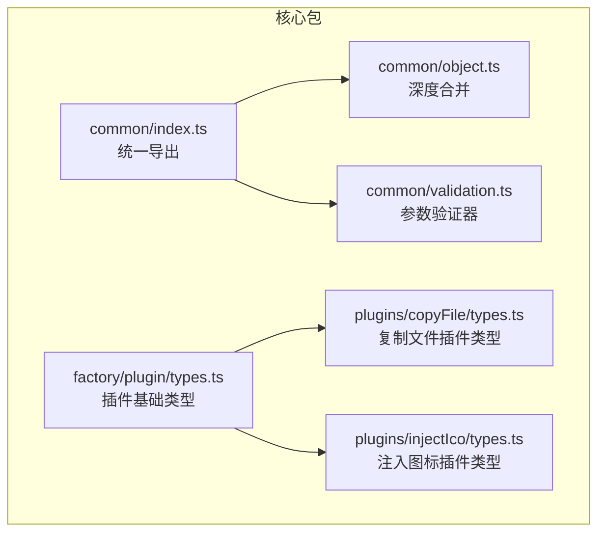
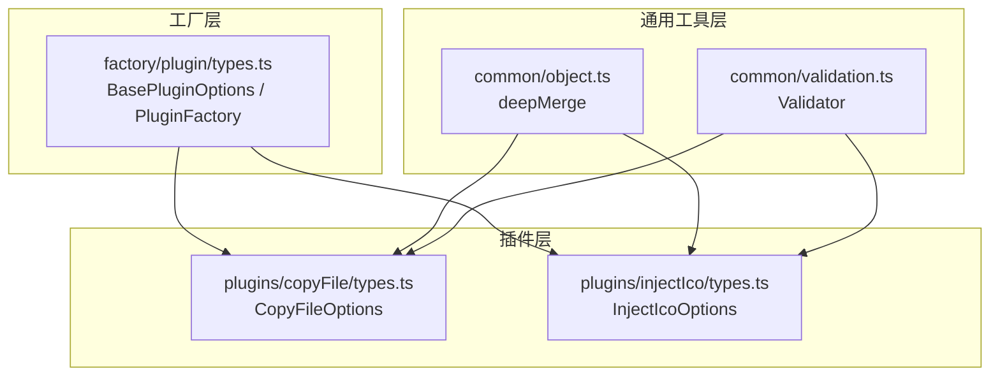
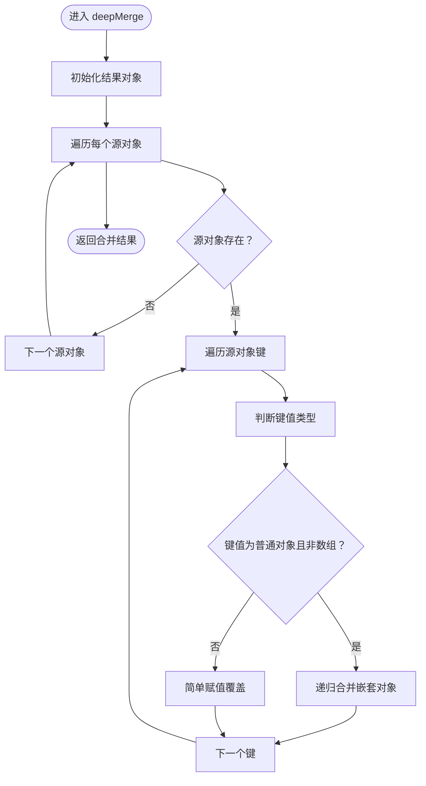
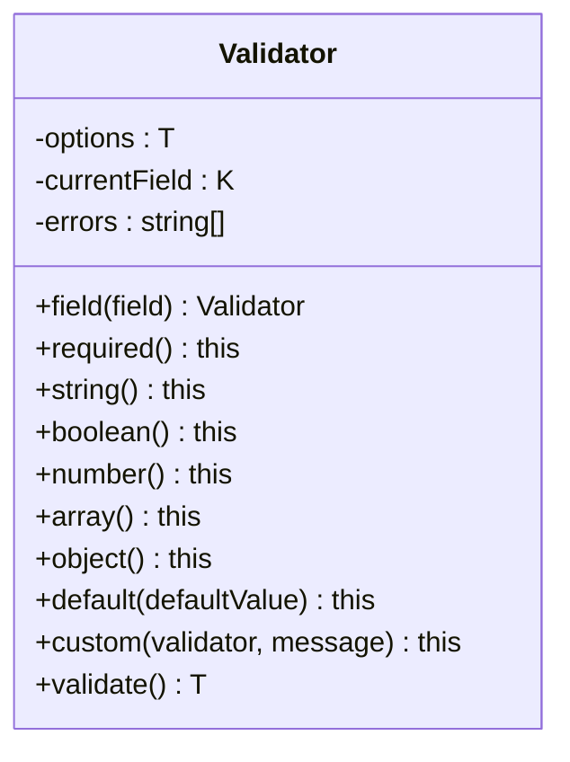
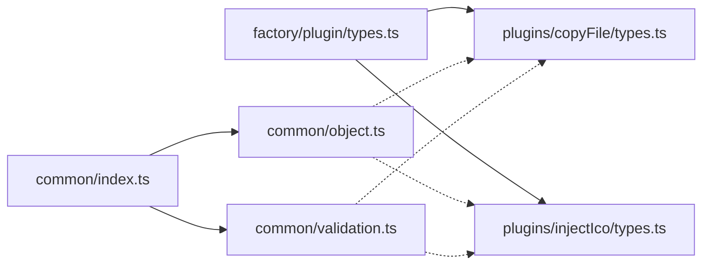

# 对象工具

<cite>
**本文引用的文件**
- [packages/core/src/common/object.ts](file://packages/core/src/common/object.ts)
- [packages/core/src/common/index.ts](file://packages/core/src/common/index.ts)
- [packages/core/src/common/validation.ts](file://packages/core/src/common/validation.ts)
- [packages/core/src/factory/plugin/types.ts](file://packages/core/src/factory/plugin/types.ts)
- [packages/core/src/plugins/copyFile/types.ts](file://packages/core/src/plugins/copyFile/types.ts)
- [packages/core/src/plugins/injectIco/types.ts](file://packages/core/src/plugins/injectIco/types.ts)
- [packages/test/src/copyFile/copyFile.test.ts](file://packages/test/src/copyFile/copyFile.test.ts)
- [packages/test/src/injectIco/injectIco.test.ts](file://packages/test/src/injectIco/injectIco.test.ts)
- [packages/core/package.json](file://packages/core/package.json)
</cite>

## 目录
1. [简介](#简介)
2. [项目结构](#项目结构)
3. [核心组件](#核心组件)
4. [架构总览](#架构总览)
5. [详细组件分析](#详细组件分析)
6. [依赖分析](#依赖分析)
7. [性能考虑](#性能考虑)
8. [故障排查指南](#故障排查指南)
9. [结论](#结论)
10. [附录：API 参考](#附录api-参考)

## 简介
本文件为“对象工具”模块的实用参考文档，聚焦于对象操作工具函数的功能与使用方法，包括：
- 对象属性访问与类型检查
- 数据转换与标准化
- 深度合并与浅层合并
- 过滤与选择
- 序列化与反序列化（JSON）
- 在插件开发中的应用与最佳实践

本模块当前提供两个核心能力：
- 深度合并对象（deepMerge）
- 参数验证器（Validator）

这些能力广泛应用于插件工厂与配置对象的处理，确保插件配置在不同环境与版本下保持一致与可预期的行为。

## 项目结构
对象工具位于核心包的通用工具层，导出入口统一由 common/index.ts 暴露，便于上层插件工厂与具体插件使用。

图表来源
- [packages/core/src/common/index.ts](file://packages/core/src/common/index.ts#L1-L4)
- [packages/core/src/common/object.ts](file://packages/core/src/common/object.ts#L1-L30)
- [packages/core/src/common/validation.ts](file://packages/core/src/common/validation.ts#L1-L203)
- [packages/core/src/factory/plugin/types.ts](file://packages/core/src/factory/plugin/types.ts#L1-L46)
- [packages/core/src/plugins/copyFile/types.ts](file://packages/core/src/plugins/copyFile/types.ts#L1-L44)
- [packages/core/src/plugins/injectIco/types.ts](file://packages/core/src/plugins/injectIco/types.ts#L1-L113)

章节来源
- [packages/core/src/common/index.ts](file://packages/core/src/common/index.ts#L1-L4)

## 核心组件
- 深度合并工具：对多个源对象进行递归合并，保留嵌套对象的结构，并以后出现的源对象覆盖同名键值。
- 参数验证器：提供链式 API，对插件配置进行必填、类型、默认值与自定义校验，集中处理配置错误。

章节来源
- [packages/core/src/common/object.ts](file://packages/core/src/common/object.ts#L1-L30)
- [packages/core/src/common/validation.ts](file://packages/core/src/common/validation.ts#L1-L203)

## 架构总览
对象工具在插件体系中的位置如下：
- 工厂层（factory）定义插件基础类型与工厂函数签名
- 插件层（plugins）定义各插件的配置接口，通常继承基础类型
- 通用工具层（common）提供对象合并与参数验证等通用能力
- 测试层（test）验证插件行为与配置处理

图表来源
- [packages/core/src/factory/plugin/types.ts](file://packages/core/src/factory/plugin/types.ts#L1-L46)
- [packages/core/src/plugins/copyFile/types.ts](file://packages/core/src/plugins/copyFile/types.ts#L1-L44)
- [packages/core/src/plugins/injectIco/types.ts](file://packages/core/src/plugins/injectIco/types.ts#L1-L113)
- [packages/core/src/common/object.ts](file://packages/core/src/common/object.ts#L1-L30)
- [packages/core/src/common/validation.ts](file://packages/core/src/common/validation.ts#L1-L203)

## 详细组件分析

### 组件一：深度合并（deepMerge）
- 功能概述
  - 接收任意数量的源对象，按顺序合并到结果对象中
  - 对嵌套对象进行递归合并；非对象或数组的键采用覆盖策略
  - 返回强类型结果，保证与输入泛型一致

- 关键实现要点
  - 遍历每个源对象的所有自有键
  - 判断键值是否为普通对象（排除数组与 null）
  - 若目标与源对应键均为普通对象，则递归合并；否则直接覆盖
  - 最终返回合并后的对象

- 适用场景
  - 合并用户配置与默认配置
  - 合并多份配置片段，后者优先级更高
  - 在插件工厂中将原始配置标准化为最终运行时配置

- 注意事项
  - 数组不会被递归合并，而是直接覆盖
  - null 与 undefined 的处理遵循“非空对象才递归”的判断
  - 合并结果为新对象，不修改原对象

- 复杂度
  - 时间复杂度：O(N)，N 为所有源对象键的数量
  - 空间复杂度：O(N)，用于存储合并结果

- 使用示例（路径）
  - [packages/test/src/copyFile/copyFile.test.ts](file://packages/test/src/copyFile/copyFile.test.ts#L1-L219)
  - [packages/test/src/injectIco/injectIco.test.ts](file://packages/test/src/injectIco/injectIco.test.ts#L1-L273)

图表来源
- [packages/core/src/common/object.ts](file://packages/core/src/common/object.ts#L1-L30)

章节来源
- [packages/core/src/common/object.ts](file://packages/core/src/common/object.ts#L1-L30)

### 组件二：参数验证器（Validator）
- 功能概述
  - 提供流畅的链式 API，对插件配置进行验证
  - 支持必填、类型检查（字符串、布尔、数字、数组、对象）、默认值设置、自定义校验
  - 验证失败时收集错误信息并在 validate() 中统一抛出

- 关键实现要点
  - 字段选择：field() 指定当前校验字段
  - 类型校验：string()、boolean()、number()、array()、object()
  - 其他：required()、default()、custom()、validate()
  - 错误收集：validate() 将所有错误拼接为单一异常抛出

- 适用场景
  - 插件配置的输入校验
  - 在插件工厂中对原始配置进行标准化与默认值填充
  - 为插件使用者提供明确的错误提示

- 使用示例（路径）
  - [packages/test/src/copyFile/copyFile.test.ts](file://packages/test/src/copyFile/copyFile.test.ts#L205-L217)
  - [packages/test/src/injectIco/injectIco.test.ts](file://packages/test/src/injectIco/injectIco.test.ts#L135-L204)

图表来源
- [packages/core/src/common/validation.ts](file://packages/core/src/common/validation.ts#L1-L203)

章节来源
- [packages/core/src/common/validation.ts](file://packages/core/src/common/validation.ts#L1-L203)

### 组件三：对象类型与配置接口（与对象工具协作）
- 基础插件配置（BasePluginOptions）
  - enabled：是否启用插件
  - verbose：是否输出详细日志
  - errorStrategy：错误处理策略（抛出/记录/忽略）
- 复制文件插件配置（CopyFileOptions）
  - 继承基础配置，增加源目录、目标目录、覆盖、递归、增量等选项
- 注入图标插件配置（InjectIcoOptions）
  - 继承基础配置，增加 base、url、link、icons、copyOptions 等选项

这些接口与对象工具配合，常用于：
- 使用 deepMerge 合并默认配置与用户配置
- 使用 Validator 校验关键字段与类型

章节来源
- [packages/core/src/factory/plugin/types.ts](file://packages/core/src/factory/plugin/types.ts#L1-L46)
- [packages/core/src/plugins/copyFile/types.ts](file://packages/core/src/plugins/copyFile/types.ts#L1-L44)
- [packages/core/src/plugins/injectIco/types.ts](file://packages/core/src/plugins/injectIco/types.ts#L1-L113)

## 依赖分析
- 导出关系
  - common/index.ts 统一导出 fs、object、validation
  - 插件类型文件依赖工厂类型定义
- 使用关系
  - 插件配置接口与对象工具共同服务于插件工厂与插件实例化流程
  - 测试文件验证了对象工具在真实场景中的行为

图表来源
- [packages/core/src/common/index.ts](file://packages/core/src/common/index.ts#L1-L4)
- [packages/core/src/common/object.ts](file://packages/core/src/common/object.ts#L1-L30)
- [packages/core/src/common/validation.ts](file://packages/core/src/common/validation.ts#L1-L203)
- [packages/core/src/factory/plugin/types.ts](file://packages/core/src/factory/plugin/types.ts#L1-L46)
- [packages/core/src/plugins/copyFile/types.ts](file://packages/core/src/plugins/copyFile/types.ts#L1-L44)
- [packages/core/src/plugins/injectIco/types.ts](file://packages/core/src/plugins/injectIco/types.ts#L1-L113)

章节来源
- [packages/core/src/common/index.ts](file://packages/core/src/common/index.ts#L1-L4)

## 性能考虑
- 深度合并
  - 时间复杂度 O(N)，空间复杂度 O(N)，适合大多数配置合并场景
  - 避免在热路径中对超大对象进行频繁深度合并
  - 如需浅合并，可自行实现浅拷贝策略（例如使用扩展运算符）
- 参数验证器
  - 验证逻辑线性，开销较小
  - 建议在插件初始化阶段一次性完成，避免重复验证

## 故障排查指南
- 配置验证失败
  - 症状：调用 validate() 抛出包含多条错误信息的异常
  - 排查：确认已先调用 field() 指定字段，再依次调用 required()/类型方法/default()/custom()
  - 参考测试用例对错误场景的断言
- 深度合并未按预期工作
  - 症状：数组未被递归合并、null/undefined 未覆盖
  - 排查：确认源对象键值类型与合并策略；注意 deepMerge 不会递归数组
- 插件配置未生效
  - 症状：插件未执行或行为异常
  - 排查：检查 enabled、verbose、errorStrategy 等基础配置；核对 copyOptions/incremental 等高级选项

章节来源
- [packages/core/src/common/validation.ts](file://packages/core/src/common/validation.ts#L195-L201)
- [packages/test/src/copyFile/copyFile.test.ts](file://packages/test/src/copyFile/copyFile.test.ts#L205-L217)
- [packages/test/src/injectIco/injectIco.test.ts](file://packages/test/src/injectIco/injectIco.test.ts#L135-L204)

## 结论
对象工具模块提供了简洁而强大的对象合并与参数验证能力，能够有效支撑插件工厂与插件配置的处理流程。通过合理使用 deepMerge 与 Validator，可以显著提升配置处理的一致性与健壮性，并降低插件开发中的常见错误风险。

## 附录：API 参考

### 深度合并（deepMerge）
- 函数签名
  - deepMerge(...sources: Partial<T>[]): T
- 参数
  - sources：可变数量的源对象，类型为 Partial<T>，即允许部分键存在
- 返回值
  - 合并后的对象，类型为 T
- 行为
  - 遍历每个源对象的自有键
  - 若键值为普通对象（非数组且非 null），则递归合并
  - 否则直接覆盖
- 复杂度
  - 时间：O(N)
  - 空间：O(N)
- 使用示例（路径）
  - [packages/test/src/copyFile/copyFile.test.ts](file://packages/test/src/copyFile/copyFile.test.ts#L1-L219)
  - [packages/test/src/injectIco/injectIco.test.ts](file://packages/test/src/injectIco/injectIco.test.ts#L1-L273)

章节来源
- [packages/core/src/common/object.ts](file://packages/core/src/common/object.ts#L1-L30)

### 参数验证器（Validator）
- 类签名
  - class Validator<T extends Record<string, any>, K extends keyof T = any>
- 方法
  - field(field: NextK): Validator<T, NextK>
  - required(): this
  - string(): this
  - boolean(): this
  - number(): this
  - array(): this
  - object(): this
  - default(defaultValue: T[K]): this
  - custom(validator: (value: T[K]) => boolean, message: string): this
  - validate(): T
- 行为
  - 链式调用，先指定字段，再进行类型/必填/默认值/自定义校验
  - validate() 统一抛出错误，错误信息包含所有失败项
- 使用示例（路径）
  - [packages/test/src/copyFile/copyFile.test.ts](file://packages/test/src/copyFile/copyFile.test.ts#L205-L217)
  - [packages/test/src/injectIco/injectIco.test.ts](file://packages/test/src/injectIco/injectIco.test.ts#L135-L204)

章节来源
- [packages/core/src/common/validation.ts](file://packages/core/src/common/validation.ts#L1-L203)

### 插件基础类型与配置接口
- 基础插件配置（BasePluginOptions）
  - enabled?: boolean
  - verbose?: boolean
  - errorStrategy?: 'throw' | 'log' | 'ignore'
- 复制文件插件配置（CopyFileOptions）
  - 继承 BasePluginOptions
  - sourceDir: string
  - targetDir: string
  - overwrite?: boolean
  - recursive?: boolean
  - incremental?: boolean
- 注入图标插件配置（InjectIcoOptions）
  - 继承 BasePluginOptions
  - base?: string
  - url?: string
  - link?: string
  - icons?: Icon[]
  - copyOptions?: CopyOptions

章节来源
- [packages/core/src/factory/plugin/types.ts](file://packages/core/src/factory/plugin/types.ts#L1-L46)
- [packages/core/src/plugins/copyFile/types.ts](file://packages/core/src/plugins/copyFile/types.ts#L1-L44)
- [packages/core/src/plugins/injectIco/types.ts](file://packages/core/src/plugins/injectIco/types.ts#L1-L113)

### 对象工具在插件开发中的应用
- 配置对象处理
  - 使用 deepMerge 合并默认配置与用户配置
  - 使用 Validator 校验关键字段与类型，减少运行时错误
- 数据转换
  - 将原始配置标准化为目标类型，便于后续处理
- 日志与错误策略
  - 结合 BasePluginOptions 的 verbose 与 errorStrategy 控制日志输出与错误处理

章节来源
- [packages/core/src/factory/plugin/types.ts](file://packages/core/src/factory/plugin/types.ts#L1-L46)
- [packages/core/src/plugins/copyFile/types.ts](file://packages/core/src/plugins/copyFile/types.ts#L1-L44)
- [packages/core/src/plugins/injectIco/types.ts](file://packages/core/src/plugins/injectIco/types.ts#L1-L113)

### JSON 序列化与反序列化
- 说明
  - 本模块未提供专用的 JSON 工具函数
  - 建议在需要时使用浏览器/Node.js 原生 JSON API 进行序列化与反序列化
  - 对于复杂对象，可结合 deepMerge 与类型检查工具进行预处理与校验

[本节为通用指导，无需列出具体文件来源]

### 浅拷贝与深拷贝（概念性说明）
- 浅拷贝
  - 仅复制对象的第一层属性，嵌套对象仍为引用
  - 适用于只读配置或不需要修改嵌套结构的场景
- 深拷贝
  - 递归复制整个对象树，生成完全独立的新对象
  - 适用于需要安全修改嵌套结构的场景
- 选择建议
  - 若配置层级较浅且不涉及嵌套对象修改，可使用浅拷贝
  - 若配置包含深层嵌套对象且需要隔离修改，使用深拷贝

[本节为通用指导，无需列出具体文件来源]