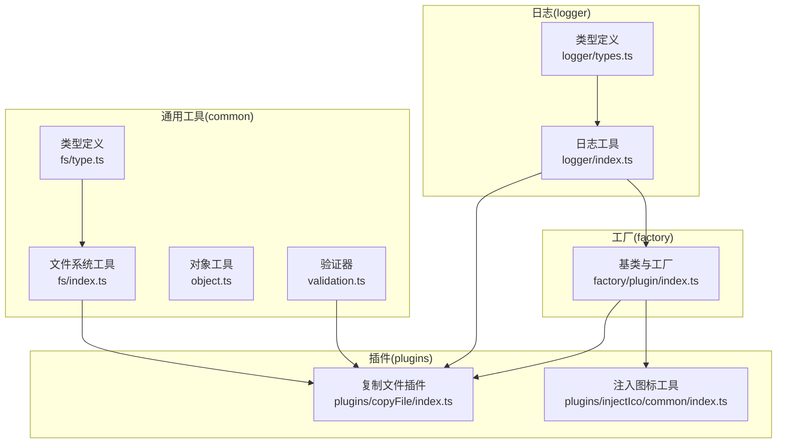
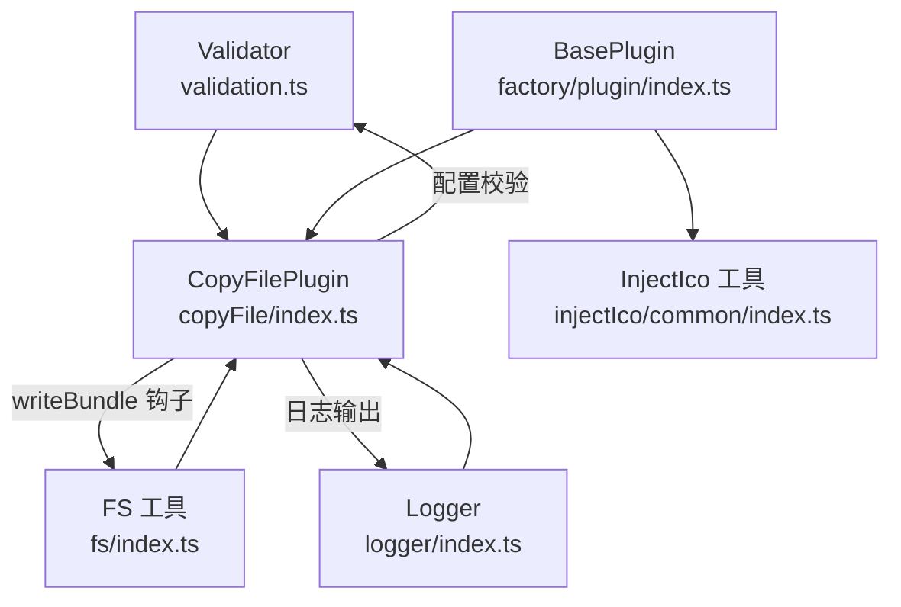
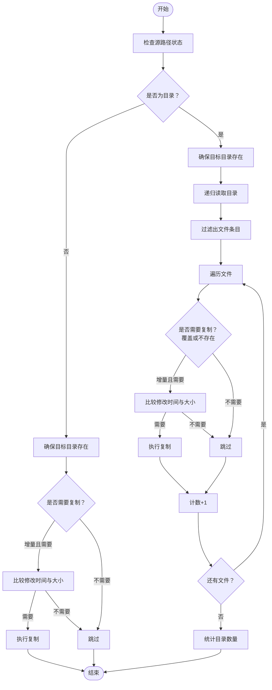
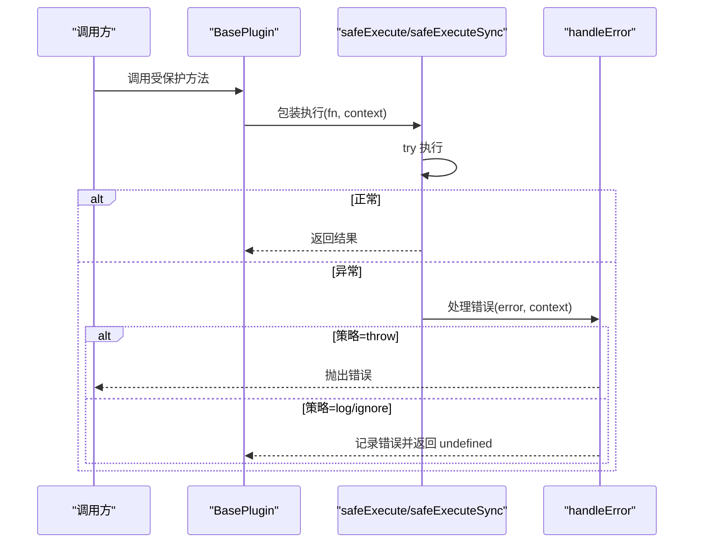
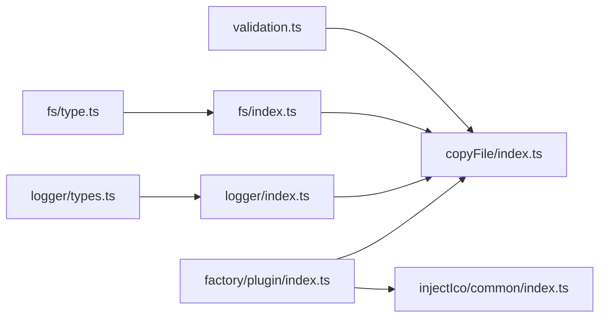

# 工具模块

<cite>
**本文档引用的文件**
- [packages/core/src/common/fs/index.ts](file://packages/core/src/common/fs/index.ts)
- [packages/core/src/common/fs/type.ts](file://packages/core/src/common/fs/type.ts)
- [packages/core/src/common/object.ts](file://packages/core/src/common/object.ts)
- [packages/core/src/common/validation.ts](file://packages/core/src/common/validation.ts)
- [packages/core/src/logger/index.ts](file://packages/core/src/logger/index.ts)
- [packages/core/src/logger/types.ts](file://packages/core/src/logger/types.ts)
- [packages/core/src/common/index.ts](file://packages/core/src/common/index.ts)
- [packages/core/src/plugins/copyFile/index.ts](file://packages/core/src/plugins/copyFile/index.ts)
- [packages/core/src/plugins/copyFile/types.ts](file://packages/core/src/plugins/copyFile/types.ts)
- [packages/core/src/plugins/injectIco/common/index.ts](file://packages/core/src/plugins/injectIco/common/index.ts)
- [packages/core/src/plugins/injectIco/common/type.ts](file://packages/core/src/plugins/injectIco/common/type.ts)
- [packages/core/src/factory/plugin/index.ts](file://packages/core/src/factory/plugin/index.ts)
- [packages/test/src/copyFile/copyFile.test.ts](file://packages/test/src/copyFile/copyFile.test.ts)
- [packages/test/src/injectIco/injectIco.test.ts](file://packages/test/src/injectIco/injectIco.test.ts)
- [packages/core/package.json](file://packages/core/package.json)
</cite>

## 更新摘要
**所做变更**
- 增强了日志系统的单例模式实现，支持插件级别的日志配置管理
- 完善了验证器工具的类型安全性和错误处理机制
- 优化了文件系统工具的错误处理和用户体验
- 增强了插件工厂的基础功能，提供更完善的基础设施能力

## 目录
1. [简介](#简介)
2. [项目结构](#项目结构)
3. [核心组件](#核心组件)
4. [架构总览](#架构总览)
5. [详细组件分析](#详细组件分析)
6. [依赖分析](#依赖分析)
7. [性能考虑](#性能考虑)
8. [故障排查指南](#故障排查指南)
9. [结论](#结论)
10. [附录](#附录)

## 简介
本文件为工具模块的全面参考文档，涵盖以下方面：
- 文件系统工具：文件操作、目录处理与增量复制算法
- 日志系统：配置选项、使用技巧与输出控制
- 验证器工具：内置验证规则与自定义验证器创建
- 对象工具：深拷贝合并的最佳实践
- 工具模块 API 参考：参数、返回值与使用示例
- 模块间依赖关系与组合使用方式

## 项目结构
工具模块位于 packages/core/src 下，采用按功能分层组织：
- common：通用工具（文件系统、对象、验证）
- logger：日志工具
- factory：插件工厂与基类
- plugins：具体插件实现（如复制文件、注入图标）

**图表来源**
- [packages/core/src/common/fs/index.ts](file://packages/core/src/common/fs/index.ts#L1-L241)
- [packages/core/src/common/fs/type.ts](file://packages/core/src/common/fs/type.ts#L1-L55)
- [packages/core/src/common/object.ts](file://packages/core/src/common/object.ts#L1-L30)
- [packages/core/src/common/validation.ts](file://packages/core/src/common/validation.ts#L1-L203)
- [packages/core/src/logger/index.ts](file://packages/core/src/logger/index.ts#L1-L188)
- [packages/core/src/logger/types.ts](file://packages/core/src/logger/types.ts#L1-L14)
- [packages/core/src/factory/plugin/index.ts](file://packages/core/src/factory/plugin/index.ts#L1-L386)
- [packages/core/src/plugins/copyFile/index.ts](file://packages/core/src/plugins/copyFile/index.ts#L1-L121)
- [packages/core/src/plugins/injectIco/common/index.ts](file://packages/core/src/plugins/injectIco/common/index.ts#L1-L41)

**章节来源**
- [packages/core/src/common/index.ts](file://packages/core/src/common/index.ts#L1-L4)
- [packages/core/src/plugins/copyFile/types.ts](file://packages/core/src/plugins/copyFile/types.ts#L1-L44)
- [packages/core/src/plugins/injectIco/common/type.ts](file://packages/core/src/plugins/injectIco/common/type.ts#L1-L47)

## 核心组件
- 文件系统工具：提供源文件存在性检查、目标目录确保、递归读取、增量判断、复制执行、写入与同步读取等能力
- 对象工具：提供深度合并对象的能力
- 验证器工具：提供流畅 API 的参数校验，支持必填、类型校验、默认值与自定义规则
- 日志系统：统一输出前缀、彩色与图标、四种日志级别（info/success/warn/error），受开关控制
- 插件工厂：统一插件生命周期、错误处理策略、日志初始化与配置合并

**章节来源**
- [packages/core/src/common/fs/index.ts](file://packages/core/src/common/fs/index.ts#L1-L241)
- [packages/core/src/common/object.ts](file://packages/core/src/common/object.ts#L1-L30)
- [packages/core/src/common/validation.ts](file://packages/core/src/common/validation.ts#L1-L203)
- [packages/core/src/logger/index.ts](file://packages/core/src/logger/index.ts#L1-L188)
- [packages/core/src/factory/plugin/index.ts](file://packages/core/src/factory/plugin/index.ts#L1-L386)

## 架构总览
工具模块围绕"通用工具 + 工厂 + 插件"的架构设计，插件通过工厂创建并复用通用工具与日志系统。

**图表来源**
- [packages/core/src/common/validation.ts](file://packages/core/src/common/validation.ts#L16-L202)
- [packages/core/src/plugins/copyFile/index.ts](file://packages/core/src/plugins/copyFile/index.ts#L13-L82)
- [packages/core/src/common/fs/index.ts](file://packages/core/src/common/fs/index.ts#L98-L202)
- [packages/core/src/logger/index.ts](file://packages/core/src/logger/index.ts#L6-L130)
- [packages/core/src/factory/plugin/index.ts](file://packages/core/src/factory/plugin/index.ts#L27-L337)
- [packages/core/src/plugins/injectIco/common/index.ts](file://packages/core/src/plugins/injectIco/common/index.ts#L9-L40)

## 详细组件分析

### 文件系统工具（fs）
- 功能概览
  - 源文件存在性检查：对源路径执行访问检查，区分不存在与权限不足等错误
  - 目标目录确保：递归创建目标目录
  - 递归读取目录：支持 withFileTypes 读取，返回文件与目录路径列表
  - 增量判断：比较修改时间与文件大小，判断是否需要更新
  - 复制执行：支持目录与文件两种模式；支持覆盖与增量策略；统计复制/跳过数量与执行时间
  - 写入与读取：异步写入 UTF-8 文本；同步读取 UTF-8 文本
- 关键流程（复制执行）

**图表来源**
- [packages/core/src/common/fs/index.ts](file://packages/core/src/common/fs/index.ts#L98-L202)
- [packages/core/src/common/fs/index.ts](file://packages/core/src/common/fs/index.ts#L107-L192)

- API 参考
  - checkSourceExists(sourcePath: string): Promise<void>
    - 作用：检查源文件/目录是否存在，不存在或权限不足时抛出异常
    - 参数：sourcePath - 源路径
    - 返回：Promise<void>
    - 异常：ENOENT/EACCES 等错误
  - ensureTargetDir(targetPath: string): Promise<void>
    - 作用：递归创建目标目录
    - 参数：targetPath - 目标目录路径
    - 返回：Promise<void>
    - 异常：权限不足或其他 IO 错误
  - readDirRecursive(dirPath: string, recursive: boolean): Promise<string[]>
    - 作用：读取目录内容，支持递归
    - 参数：dirPath - 目录路径；recursive - 是否递归
    - 返回：Promise<string[]> 文件/目录绝对路径数组
  - shouldUpdateFile(sourceFile: string, targetFile: string): Promise<boolean>
    - 作用：判断文件是否需要更新（mtime 或 size 不一致）
    - 参数：sourceFile - 源文件；targetFile - 目标文件
    - 返回：Promise<boolean>
  - copySourceToTarget(sourcePath: string, targetPath: string, options: CopyOptions): Promise<CopyResult>
    - 作用：执行复制（文件或目录），支持覆盖与增量
    - 参数：sourcePath - 源路径；targetPath - 目标路径；options - 复制选项
    - 返回：Promise<CopyResult> 包含 copiedFiles、skippedFiles、copiedDirs、executionTime
    - 异常：IO 错误
  - writeFileContent(filePath: string, content: string): Promise<void>
    - 作用：写入 UTF-8 文本
    - 参数：filePath - 文件路径；content - 文本内容
    - 返回：Promise<void>
    - 异常：权限不足或其他 IO 错误
  - readFileSync(filePath: string): string
    - 作用：同步读取 UTF-8 文本
    - 参数：filePath - 文件路径
    - 返回：string
    - 异常：权限不足或其他 IO 错误
- 类型定义
  - CopyOptions
    - recursive: boolean - 是否递归
    - overwrite: boolean - 是否覆盖
    - incremental?: boolean - 是否增量复制
    - parallelLimit?: number - 并行限制（预留）
    - skipEmptyDirs?: boolean - 跳过空目录（预留）
  - CopyResult
    - copiedFiles: number - 复制文件数
    - skippedFiles: number - 跳过文件数
    - copiedDirs: number - 复制目录数
    - executionTime: number - 执行时间(ms)

**章节来源**
- [packages/core/src/common/fs/index.ts](file://packages/core/src/common/fs/index.ts#L10-L241)
- [packages/core/src/common/fs/type.ts](file://packages/core/src/common/fs/type.ts#L4-L54)

### 对象工具（object）
- 功能概览
  - deepMerge：对多个对象进行深度合并，嵌套对象递归合并，其余简单覆盖
- API 参考
  - deepMerge(...sources: Partial<T>[]): T
    - 作用：深度合并对象
    - 参数：sources - 源对象列表
    - 返回：合并后的对象
    - 注意：嵌套对象深度合并，数组不递归

**章节来源**
- [packages/core/src/common/object.ts](file://packages/core/src/common/object.ts#L8-L29)

### 验证器工具（validation）
- 功能概览
  - Validator<T>：提供流畅 API 的配置校验，支持必填、类型校验、默认值、自定义规则与一次性验证
- API 参考
  - field(keyof T): this
    - 作用：指定当前校验字段
  - required(): this
    - 作用：标记字段为必填（undefined/null 视为缺失）
  - string(): this / boolean(): this / number(): this / array(): this / object(): this
    - 作用：类型校验（非空时）
  - default(defaultValue: any): this
    - 作用：为 undefined/null 设置默认值
  - custom(validator: (value: any) => boolean, message: string): this
    - 作用：自定义校验
  - validate(): T
    - 作用：执行验证，失败抛出错误
- 使用示例（来自插件）
  - 插件内部使用示例路径：[packages/core/src/plugins/copyFile/index.ts](file://packages/core/src/plugins/copyFile/index.ts#L14-L35)

**章节来源**
- [packages/core/src/common/validation.ts](file://packages/core/src/common/validation.ts#L16-L202)
- [packages/core/src/plugins/copyFile/index.ts](file://packages/core/src/plugins/copyFile/index.ts#L14-L35)

### 日志系统（logger）
- 功能概览
  - Logger：统一输出前缀（库名+插件名+时间戳）、四种级别（info/success/warn/error）、彩色与图标、受开关控制
  - 单例模式：全局唯一实例，支持多插件共享
  - 插件配置管理：为每个插件单独管理启用状态
- API 参考
  - 构造函数：Logger(options: LoggerOptions)
    - 参数：name - 插件名；enabled? - 是否启用
  - success(message: string, data?: any): void
  - info(message: string, data?: any): void
  - warn(message: string, data?: any): void
  - error(message: string, data?: any): void
  - create(options: LoggerOptions): Logger
    - 作用：创建日志记录器（工厂方法）
    - 返回：Logger 单例实例
  - createPluginLogger(pluginName: string): PluginLogger
    - 作用：为插件创建专用日志代理
    - 返回：PluginLogger 接口
- 类型定义
  - LoggerOptions：name: string；enabled?: boolean
  - PluginLogger：success/info/warn/error 四种日志方法

**更新** 新增单例模式实现，支持插件级别的日志配置管理

**章节来源**
- [packages/core/src/logger/index.ts](file://packages/core/src/logger/index.ts#L6-L188)
- [packages/core/src/logger/types.ts](file://packages/core/src/logger/types.ts#L4-L13)

### 插件工厂与基类（factory）
- 功能概览
  - BasePlugin<T>：统一配置合并、日志初始化、生命周期钩子、错误处理策略（throw/log/ignore）
  - createPluginFactory：创建插件工厂，返回符合 Vite 规范的 Plugin 对象
- 关键流程（安全执行）

**图表来源**
- [packages/core/src/factory/plugin/index.ts](file://packages/core/src/factory/plugin/index.ts#L242-L300)

- API 参考
  - BasePlugin
    - 构造函数：constructor(options: T, loggerConfig?: LoggerOptions | Logger)
    - toPlugin(): Plugin
    - safeExecute(fn, context): Promise
    - safeExecuteSync(fn, context): T | undefined
    - handleError(error, context): T | undefined
    - mergeOptions(options): Required<T>
    - initLogger(loggerConfig?): Logger
  - createPluginFactory(PluginClass)
    - 返回：(options?) => Plugin

**章节来源**
- [packages/core/src/factory/plugin/index.ts](file://packages/core/src/factory/plugin/index.ts#L27-L386)

### 复制文件插件（copyFile）
- 功能概览
  - 在构建完成后执行，将源目录/文件复制到目标目录，支持覆盖与增量
  - 使用 Validator 校验配置，使用 Logger 输出结果
- API 参考
  - copyFile(options: CopyFileOptions): Plugin
  - CopyFileOptions
    - sourceDir: string
    - targetDir: string
    - overwrite?: boolean
    - recursive?: boolean
    - incremental?: boolean
    - 其他基础选项由 BasePluginOptions 提供（enabled/verbose/errorStrategy）
- 使用示例（来自测试）
  - 基本使用与高级配置示例路径：[packages/core/src/plugins/copyFile/index.ts](file://packages/core/src/plugins/copyFile/index.ts#L88-L114)
  - 行为验证示例路径：[packages/test/src/copyFile/copyFile.test.ts](file://packages/test/src/copyFile/copyFile.test.ts#L39-L218)

**章节来源**
- [packages/core/src/plugins/copyFile/index.ts](file://packages/core/src/plugins/copyFile/index.ts#L13-L121)
- [packages/core/src/plugins/copyFile/types.ts](file://packages/core/src/plugins/copyFile/types.ts#L8-L43)
- [packages/test/src/copyFile/copyFile.test.ts](file://packages/test/src/copyFile/copyFile.test.ts#L39-L218)

### 注入图标工具（injectIco）
- 功能概览
  - 生成图标标签数组，支持 link 片段、自定义 icons、url 或默认 base/favicon.ico
  - 可选与复制文件插件组合使用（copyOptions）
- API 参考
  - generateIconTags(options: IconOptions): string[]
  - IconOptions
    - base?: string
    - url?: string
    - link?: string
    - icons?: Array<{ rel, href, sizes?, type? }>
- 使用示例（来自测试）
  - 示例路径：[packages/test/src/injectIco/injectIco.test.ts](file://packages/test/src/injectIco/injectIco.test.ts#L73-L106)

**章节来源**
- [packages/core/src/plugins/injectIco/common/index.ts](file://packages/core/src/plugins/injectIco/common/index.ts#L9-L40)
- [packages/core/src/plugins/injectIco/common/type.ts](file://packages/core/src/plugins/injectIco/common/type.ts#L6-L46)
- [packages/test/src/injectIco/injectIco.test.ts](file://packages/test/src/injectIco/injectIco.test.ts#L73-L106)

## 依赖分析
- 模块内依赖
  - 复制文件插件依赖：fs 工具、验证器、日志系统、工厂基类
  - 注入图标工具独立于 fs 工具，但可与复制文件插件组合使用
- 外部依赖
  - Node.js fs/path；Vite 插件系统；TypeScript 类型系统
- 依赖关系图

**图表来源**
- [packages/core/src/plugins/copyFile/index.ts](file://packages/core/src/plugins/copyFile/index.ts#L1-L5)
- [packages/core/src/common/fs/index.ts](file://packages/core/src/common/fs/index.ts#L1-L3)
- [packages/core/src/logger/index.ts](file://packages/core/src/logger/index.ts#L1)
- [packages/core/src/factory/plugin/index.ts](file://packages/core/src/factory/plugin/index.ts#L1-L5)
- [packages/core/src/plugins/injectIco/common/index.ts](file://packages/core/src/plugins/injectIco/common/index.ts#L1)
- [packages/core/src/common/fs/type.ts](file://packages/core/src/common/fs/type.ts#L1)
- [packages/core/src/logger/types.ts](file://packages/core/src/logger/types.ts#L1)

**章节来源**
- [packages/core/src/plugins/copyFile/index.ts](file://packages/core/src/plugins/copyFile/index.ts#L1-L5)
- [packages/core/src/plugins/injectIco/common/index.ts](file://packages/core/src/plugins/injectIco/common/index.ts#L1)
- [packages/core/src/factory/plugin/index.ts](file://packages/core/src/factory/plugin/index.ts#L1-L5)

## 性能考虑
- 增量复制
  - 通过比较修改时间与文件大小减少不必要的复制，显著降低重复构建成本
- 递归读取
  - 目录层级较深时建议谨慎使用 recursive，必要时结合 skipEmptyDirs（预留）与 parallelLimit（预留）优化
- 并行与批量
  - 当前实现逐个复制文件；如需更高吞吐，可在业务侧引入并发队列（注意磁盘 IO 与系统资源）
- 日志输出
  - enabled=false 时避免输出开销；生产环境建议关闭 verbose

## 故障排查指南
- 复制失败
  - 检查源路径是否存在与权限；确认目标目录可写
  - 若启用增量，确认目标文件存在且 stat 可用
- 验证失败
  - 查看 Validator 抛出的错误信息，定位必填字段与类型问题
- 日志未输出
  - 确认 Logger.enabled 或插件 verbose 为 true
- 插件未生效
  - 确认插件 enabled 为 true，且在 Vite 生命周期钩子中正确触发（如 writeBundle）

**章节来源**
- [packages/core/src/common/fs/index.ts](file://packages/core/src/common/fs/index.ts#L10-L23)
- [packages/core/src/common/fs/index.ts](file://packages/core/src/common/fs/index.ts#L136-L148)
- [packages/core/src/common/validation.ts](file://packages/core/src/common/validation.ts#L195-L201)
- [packages/core/src/logger/index.ts](file://packages/core/src/logger/index.ts#L78-L93)
- [packages/core/src/plugins/copyFile/index.ts](file://packages/core/src/plugins/copyFile/index.ts#L57-L61)

## 结论
工具模块通过清晰的职责划分与统一的工厂模式，提供了稳定可靠的文件复制、对象合并、参数验证与日志输出能力。插件基于这些工具快速构建，具备良好的扩展性与可维护性。建议在复杂场景下结合增量复制与合理的日志策略，以获得更好的开发体验与构建效率。

## 附录
- 版本与依赖
  - 依赖 Vite 5.x；导出 ESM/CJS/Types；支持 peerDependencies
- 相关测试
  - 复制文件插件测试：覆盖基本使用、覆盖、递归、增量、禁用与校验
  - 注入图标插件测试：覆盖默认配置、HTML 注入、复制选项与边界情况

**章节来源**
- [packages/core/package.json](file://packages/core/package.json#L32-L36)
- [packages/test/src/copyFile/copyFile.test.ts](file://packages/test/src/copyFile/copyFile.test.ts#L39-L218)
- [packages/test/src/injectIco/injectIco.test.ts](file://packages/test/src/injectIco/injectIco.test.ts#L50-L273)