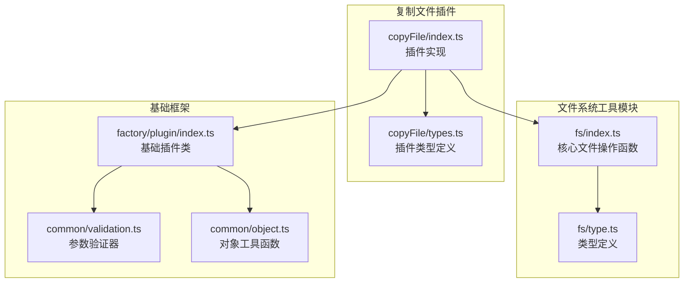
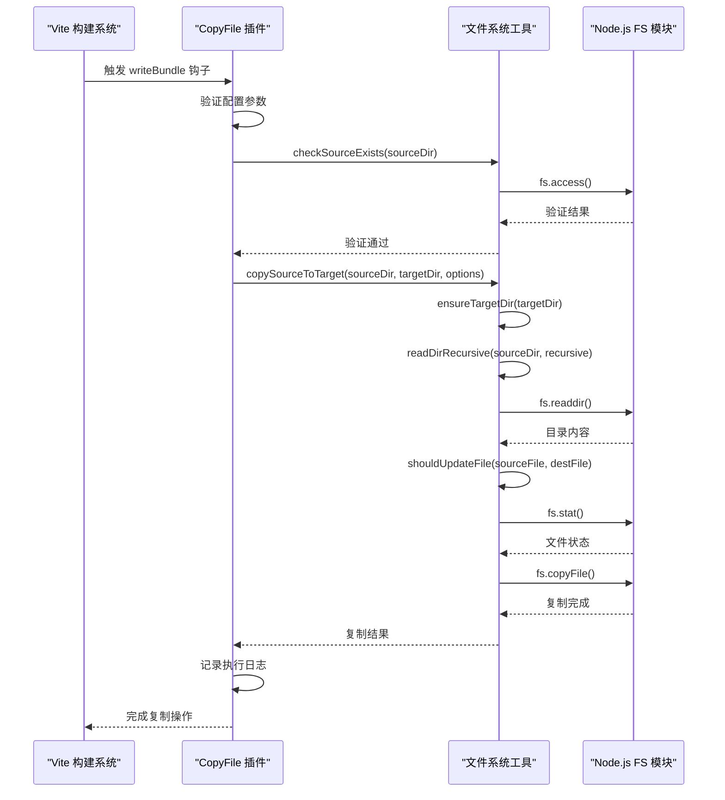
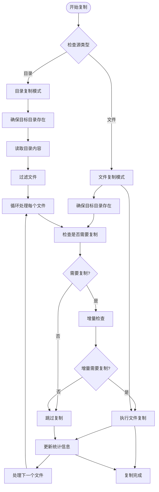
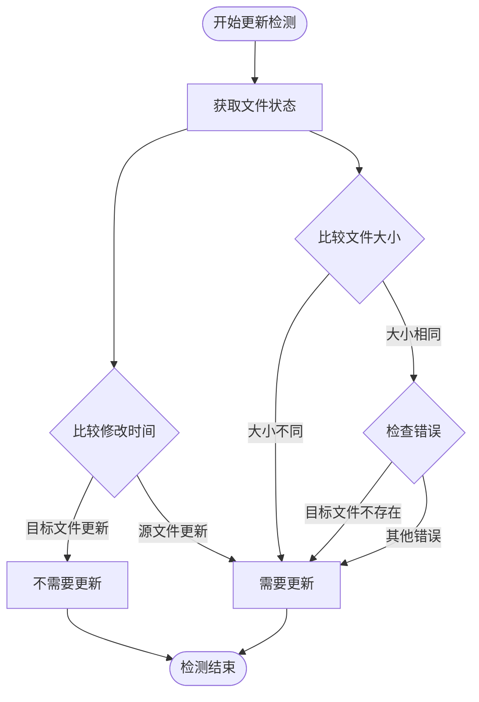
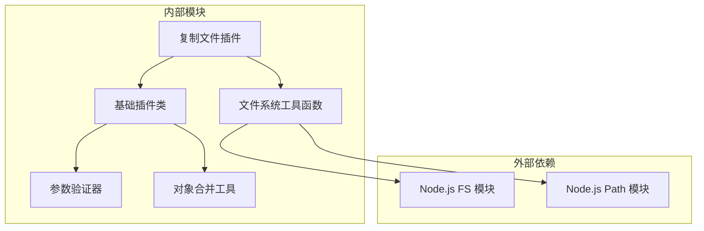

# 文件系统工具

<cite>
**本文档引用的文件**
- [packages/core/src/common/fs/index.ts](file://packages/core/src/common/fs/index.ts)
- [packages/core/src/common/fs/type.ts](file://packages/core/src/common/fs/type.ts)
- [packages/core/src/plugins/copyFile/index.ts](file://packages/core/src/plugins/copyFile/index.ts)
- [packages/core/src/plugins/copyFile/types.ts](file://packages/core/src/plugins/copyFile/types.ts)
- [packages/core/src/factory/plugin/index.ts](file://packages/core/src/factory/plugin/index.ts)
- [packages/core/src/common/validation.ts](file://packages/core/src/common/validation.ts)
- [packages/core/src/common/object.ts](file://packages/core/src/common/object.ts)
- [packages/docs/src/plugins/copy-file.md](file://packages/docs/src/plugins/copy-file.md)
- [packages/test/src/copyFile/copyFile.test.ts](file://packages/test/src/copyFile/copyFile.test.ts)
</cite>

## 目录
1. [简介](#简介)
2. [项目结构](#项目结构)
3. [核心组件](#核心组件)
4. [架构概览](#架构概览)
5. [详细组件分析](#详细组件分析)
6. [依赖关系分析](#依赖关系分析)
7. [性能考虑](#性能考虑)
8. [故障排除指南](#故障排除指南)
9. [结论](#结论)
10. [附录](#附录)

## 简介
文件系统工具模块提供了完整的文件复制、目录处理和文件操作功能。该模块专注于在 Vite 构建流程中高效地复制静态资源，支持递归复制、增量复制、覆盖控制等核心功能。模块采用异步操作设计，确保在大型项目中的性能表现，并提供了完善的错误处理机制。

## 项目结构
文件系统工具模块位于 `packages/core/src/common/fs/` 目录下，主要包含以下文件：
- `index.ts`: 核心文件系统操作函数
- `type.ts`: 类型定义和接口声明

同时，复制文件插件位于 `packages/core/src/plugins/copyFile/` 目录，作为 Vite 插件集成到构建流程中。



**图表来源**
- [packages/core/src/common/fs/index.ts](file://packages/core/src/common/fs/index.ts#L1-L241)
- [packages/core/src/common/fs/type.ts](file://packages/core/src/common/fs/type.ts#L1-L55)
- [packages/core/src/plugins/copyFile/index.ts](file://packages/core/src/plugins/copyFile/index.ts#L1-L121)
- [packages/core/src/plugins/copyFile/types.ts](file://packages/core/src/plugins/copyFile/types.ts#L1-L44)

**章节来源**
- [packages/core/src/common/fs/index.ts](file://packages/core/src/common/fs/index.ts#L1-L241)
- [packages/core/src/common/fs/type.ts](file://packages/core/src/common/fs/type.ts#L1-L55)

## 核心组件
文件系统工具模块包含以下核心组件：

### 文件复制核心函数
- `checkSourceExists`: 检查源文件是否存在
- `ensureTargetDir`: 确保目标目录存在
- `copySourceToTarget`: 主要的复制函数，支持递归和增量复制

### 目录处理工具
- `readDirRecursive`: 递归读取目录内容
- `shouldUpdateFile`: 检测文件是否需要更新

### 文件读写工具
- `writeFileContent`: 异步写入文件内容
- `readFileSync`: 同步读取文件内容

**章节来源**
- [packages/core/src/common/fs/index.ts](file://packages/core/src/common/fs/index.ts#L10-L241)

## 架构概览
文件系统工具模块采用分层架构设计，将文件操作功能封装在独立的函数中，通过插件形式集成到 Vite 构建流程中。



**图表来源**
- [packages/core/src/plugins/copyFile/index.ts](file://packages/core/src/plugins/copyFile/index.ts#L58-L80)
- [packages/core/src/common/fs/index.ts](file://packages/core/src/common/fs/index.ts#L98-L202)

## 详细组件分析

### 文件复制主函数 copySourceToTarget
`copySourceToTarget` 是整个文件复制功能的核心，支持完整的递归复制和增量复制机制。

#### 主要功能特性
- **递归复制**: 支持复制整个目录树结构
- **增量复制**: 仅复制修改过的文件，提高构建效率
- **覆盖控制**: 精确控制文件覆盖行为
- **统计报告**: 提供详细的复制统计信息

#### 处理流程


**图表来源**
- [packages/core/src/common/fs/index.ts](file://packages/core/src/common/fs/index.ts#L98-L202)

#### 参数配置详解
- `sourcePath`: 源文件或目录路径
- `targetPath`: 目标文件或目录路径  
- `options`: 复制选项配置

**章节来源**
- [packages/core/src/common/fs/index.ts](file://packages/core/src/common/fs/index.ts#L98-L202)

### 目录递归处理 readDirRecursive
`readDirRecursive` 函数实现了高效的目录递归遍历机制。

#### 递归遍历机制
- **异步递归**: 使用 Promise 实现非阻塞的递归遍历
- **文件类型检测**: 区分文件和目录，分别处理
- **路径拼接**: 正确处理相对路径和绝对路径

#### 过滤逻辑
函数会自动过滤出所有文件条目，忽略目录本身，只返回实际的文件路径。

**章节来源**
- [packages/core/src/common/fs/index.ts](file://packages/core/src/common/fs/index.ts#L49-L69)

### 文件更新检测 shouldUpdateFile
`shouldUpdateFile` 函数实现了智能的文件更新检测算法。

#### 更新检测策略
算法采用双重条件判断：
1. **时间戳比较**: `sourceStats.mtimeMs > targetStats.mtimeMs`
2. **文件大小比较**: `sourceStats.size !== targetStats.size`

#### 检测逻辑


**图表来源**
- [packages/core/src/common/fs/index.ts](file://packages/core/src/common/fs/index.ts#L77-L87)

**章节来源**
- [packages/core/src/common/fs/index.ts](file://packages/core/src/common/fs/index.ts#L77-L87)

### 错误处理机制

**更新** 文件系统工具模块提供了完善的错误处理机制，特别针对常见的文件系统错误进行了专门处理。

#### 错误分类处理
- **权限错误 (EACCES)**: 权限不足导致的操作失败
- **文件不存在 (ENOENT)**: 源文件或目标文件不存在
- **其他IO错误**: 磁盘空间不足、磁盘损坏等

#### 错误处理策略
- **统一错误格式**: 所有错误都包装为标准的 Error 对象
- **详细错误信息**: 包含具体的文件路径和错误详情
- **类型化错误**: 不同类型的错误有不同的错误消息格式

#### 特殊错误处理实现
模块中的关键函数都实现了专门的错误处理：

1. **源文件检查 (`checkSourceExists`)**:
   - 专门处理 `ENOENT` (文件不存在) 错误
   - 专门处理 `EACCES` (权限不足) 错误
   - 提供详细的错误上下文信息

2. **目标目录创建 (`ensureTargetDir`)**:
   - 专门处理 `EACCES` (权限不足) 错误
   - 提供清晰的目录创建失败原因

3. **文件写入 (`writeFileContent`)**:
   - 专门处理 `EACCES` (权限不足) 错误
   - 提供文件写入失败的详细信息

4. **文件读取 (`readFileSync`)**:
   - 专门处理 `EACCES` (权限不足) 错误
   - 提供文件读取失败的详细信息

**章节来源**
- [packages/core/src/common/fs/index.ts](file://packages/core/src/common/fs/index.ts#L10-L241)

### 文件操作函数详解

#### checkSourceExists - 源文件存在性检查
- **功能**: 验证源文件或目录是否存在且可访问
- **参数**: `sourcePath` (string) - 源文件路径
- **返回值**: Promise<void> - 验证通过无返回值
- **异常**: 当文件不存在或权限不足时抛出详细错误
- **错误处理**: 专门处理 `ENOENT` 和 `EACCES` 错误

#### ensureTargetDir - 目标目录创建
- **功能**: 确保目标目录存在，不存在则自动创建
- **参数**: `targetPath` (string) - 目标目录路径
- **返回值**: Promise<void> - 创建完成无返回值
- **异常**: 当目录创建失败时抛出详细错误
- **错误处理**: 专门处理 `EACCES` 错误

#### writeFileContent - 文件写入
- **功能**: 异步写入文件内容到指定路径
- **参数**: `filePath` (string), `content` (string)
- **返回值**: Promise<void>
- **异常**: 当写入失败时抛出详细错误
- **错误处理**: 专门处理 `EACCES` 错误

#### readFileSync - 文件同步读取
- **功能**: 同步读取文件内容
- **参数**: `filePath` (string)
- **返回值**: string - 文件内容
- **异常**: 当读取失败时抛出详细错误
- **错误处理**: 专门处理 `EACCES` 错误

**章节来源**
- [packages/core/src/common/fs/index.ts](file://packages/core/src/common/fs/index.ts#L10-L241)

## 依赖关系分析

### 组件依赖图


**图表来源**
- [packages/core/src/common/fs/index.ts](file://packages/core/src/common/fs/index.ts#L1-L3)
- [packages/core/src/plugins/copyFile/index.ts](file://packages/core/src/plugins/copyFile/index.ts#L1-L4)

### 关键依赖关系
- **Node.js FS 模块**: 提供底层文件系统操作能力
- **Path 模块**: 处理文件路径操作和拼接
- **基础插件类**: 提供插件生命周期管理和错误处理
- **参数验证器**: 确保插件配置的有效性

**章节来源**
- [packages/core/src/common/fs/index.ts](file://packages/core/src/common/fs/index.ts#L1-L3)
- [packages/core/src/plugins/copyFile/index.ts](file://packages/core/src/plugins/copyFile/index.ts#L1-L4)

## 性能考虑

### 性能优化策略
1. **异步操作**: 所有文件操作都是异步的，避免阻塞主线程
2. **增量复制**: 仅复制修改过的文件，减少不必要的IO操作
3. **并行处理**: 支持配置并行处理限制，平衡性能和资源使用
4. **内存管理**: 递归遍历时合理管理内存使用

### 性能监控
- **执行时间统计**: 记录整个复制过程的总耗时
- **文件统计**: 统计复制的文件数量、跳过的文件数量和目录数量
- **日志输出**: 提供详细的执行日志，便于性能分析

### 最佳实践建议
- **合理配置增量复制**: 在开发环境中启用增量复制，在生产环境中根据需要调整
- **控制并行度**: 对于大量小文件的场景，适当降低并行度以避免磁盘IO瓶颈
- **预检查文件**: 在批量操作前先检查文件存在性和权限
- **错误恢复**: 实现适当的错误恢复机制，避免部分失败影响整体操作

## 故障排除指南

### 常见错误及解决方案

#### 权限错误 (EACCES)
**症状**: 文件复制或读写操作失败
**原因**: 缺少必要的文件系统权限
**解决方案**: 
- 检查文件和目录的权限设置
- 确认运行用户具有足够的权限
- 考虑使用管理员权限运行

#### 文件不存在 (ENOENT)
**症状**: 源文件或目标路径不存在
**原因**: 路径配置错误或文件已被删除
**解决方案**:
- 验证源文件路径的正确性
- 确认文件确实存在于指定位置
- 检查相对路径和绝对路径的使用

#### 磁盘空间不足
**症状**: 文件写入或目录创建失败
**原因**: 目标磁盘空间不足
**解决方案**:
- 清理目标磁盘空间
- 检查磁盘配额限制
- 考虑使用更大的存储空间

### 错误处理策略

**更新** 模块提供了多层次的错误处理策略：

#### 插件级错误处理
- **errorStrategy 配置**: 支持三种策略
  - `'throw'`: 抛出错误，中断构建流程
  - `'log'`: 记录错误日志，但不中断构建
  - `'ignore'`: 忽略错误，继续执行

#### 函数级错误处理
- **专门错误类型**: 每个函数都针对特定错误类型提供详细处理
- **上下文信息**: 错误消息包含具体的操作上下文和文件路径
- **统一格式**: 所有错误都遵循一致的格式和命名约定

#### 调试技巧
1. **启用详细日志**: 设置 `verbose: true` 获取详细的执行日志
2. **逐步验证**: 分别测试每个文件操作函数
3. **边界条件**: 测试空目录、大文件、特殊字符文件名等情况
4. **性能监控**: 监控磁盘IO和内存使用情况

**章节来源**
- [packages/core/src/common/fs/index.ts](file://packages/core/src/common/fs/index.ts#L10-L241)
- [packages/core/src/factory/plugin/index.ts](file://packages/core/src/factory/plugin/index.ts#L283-L311)

## 结论
文件系统工具模块提供了完整而高效的文件复制解决方案，特别针对 Vite 构建流程进行了优化。模块的设计充分考虑了性能、可靠性和易用性，支持递归复制、增量复制、覆盖控制等核心功能。通过完善的错误处理机制和详细的日志输出，开发者可以轻松地集成和使用这些功能。

模块的主要优势包括：
- **高性能**: 异步操作和增量复制机制
- **可靠性**: 完善的错误处理和验证机制  
- **易用性**: 简洁的API设计和详细的文档
- **可扩展性**: 基于插件架构，易于扩展新功能

## 附录

### API 参考

#### 文件复制函数
| 函数名 | 参数 | 返回值 | 描述 |
|--------|------|--------|------|
| checkSourceExists | sourcePath: string | Promise<void> | 检查源文件是否存在 |
| ensureTargetDir | targetPath: string | Promise<void> | 确保目标目录存在 |
| copySourceToTarget | sourcePath: string, targetPath: string, options: CopyOptions | Promise<CopyResult> | 主要复制函数 |

#### 目录处理函数
| 函数名 | 参数 | 返回值 | 描述 |
|--------|------|--------|------|
| readDirRecursive | dirPath: string, recursive: boolean | Promise<string[]> | 递归读取目录内容 |
| shouldUpdateFile | sourceFile: string, targetFile: string | Promise<boolean> | 检测文件是否需要更新 |

#### 文件操作函数
| 函数名 | 参数 | 返回值 | 描述 |
|--------|------|--------|------|
| writeFileContent | filePath: string, content: string | Promise<void> | 异步写入文件内容 |
| readFileSync | filePath: string | string | 同步读取文件内容 |

#### 类型定义
**CopyOptions 接口**
- `recursive: boolean` - 是否递归复制
- `overwrite: boolean` - 是否覆盖同名文件  
- `incremental?: boolean` - 是否启用增量复制
- `parallelLimit?: number` - 并行处理限制
- `skipEmptyDirs?: boolean` - 是否跳过空目录

**CopyResult 接口**
- `copiedFiles: number` - 复制的文件数量
- `skippedFiles: number` - 跳过的文件数量
- `copiedDirs: number` - 复制的目录数量
- `executionTime: number` - 执行时间（毫秒）

**章节来源**
- [packages/core/src/common/fs/type.ts](file://packages/core/src/common/fs/type.ts#L4-L54)
- [packages/core/src/common/fs/index.ts](file://packages/core/src/common/fs/index.ts#L10-L241)

### 使用示例

#### 基本文件复制
```typescript
// 复制单个文件
await copySourceToTarget('src/config.json', 'dist/config.json', {
  overwrite: true,
  incremental: true
});

// 递归复制目录
await copySourceToTarget('src/assets', 'dist/assets', {
  recursive: true,
  overwrite: false,
  incremental: true
});
```

#### 配置验证
```typescript
// 使用插件配置验证
const plugin = copyFile({
  sourceDir: 'src/assets',
  targetDir: 'dist/assets',
  overwrite: true,
  recursive: true,
  incremental: true
});
```

#### 错误处理配置
```typescript
// 配置不同的错误处理策略
const pluginWithThrow = copyFile({
  sourceDir: 'src/assets',
  targetDir: 'dist/assets',
  errorStrategy: 'throw' // 发生错误时抛出异常
});

const pluginWithLog = copyFile({
  sourceDir: 'src/assets',
  targetDir: 'dist/assets',
  errorStrategy: 'log' // 发生错误时记录日志但继续执行
});
```

**章节来源**
- [packages/test/src/copyFile/copyFile.test.ts](file://packages/test/src/copyFile/copyFile.test.ts#L51-L80)
- [packages/docs/src/plugins/copy-file.md](file://packages/docs/src/plugins/copy-file.md#L19-L55)