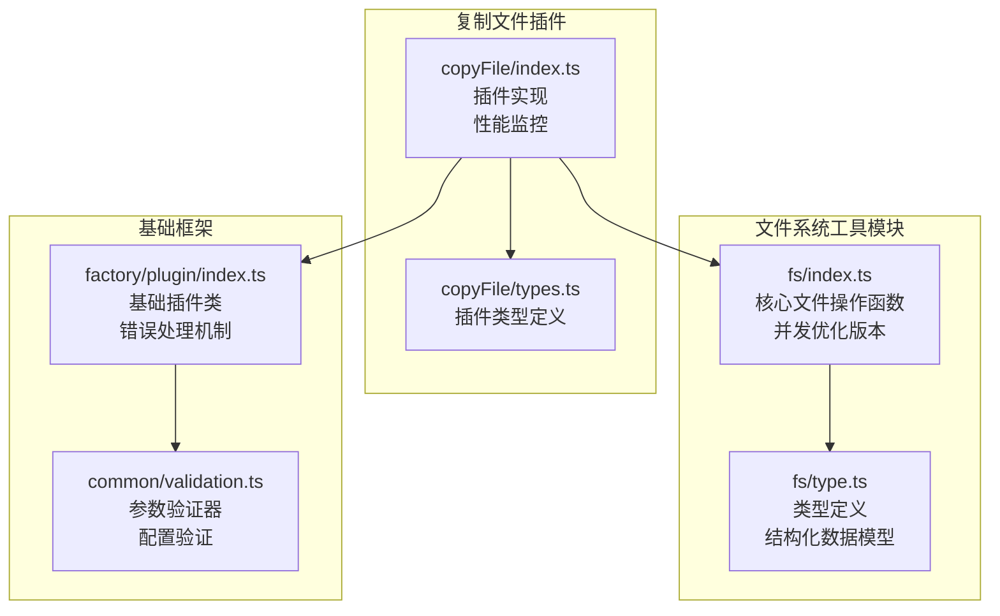
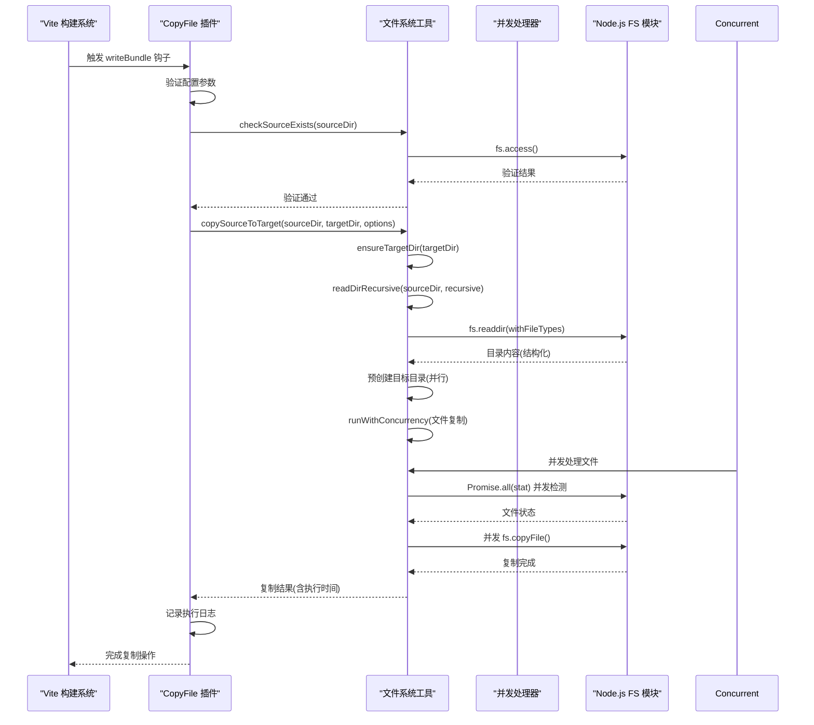
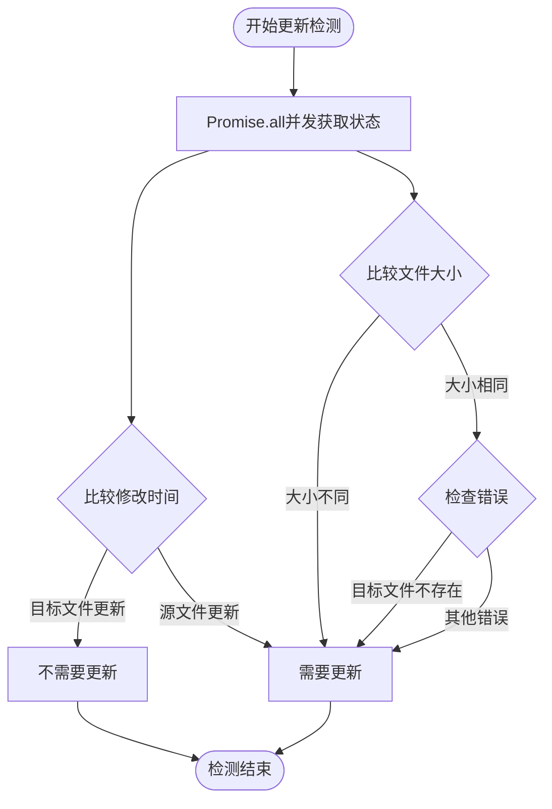
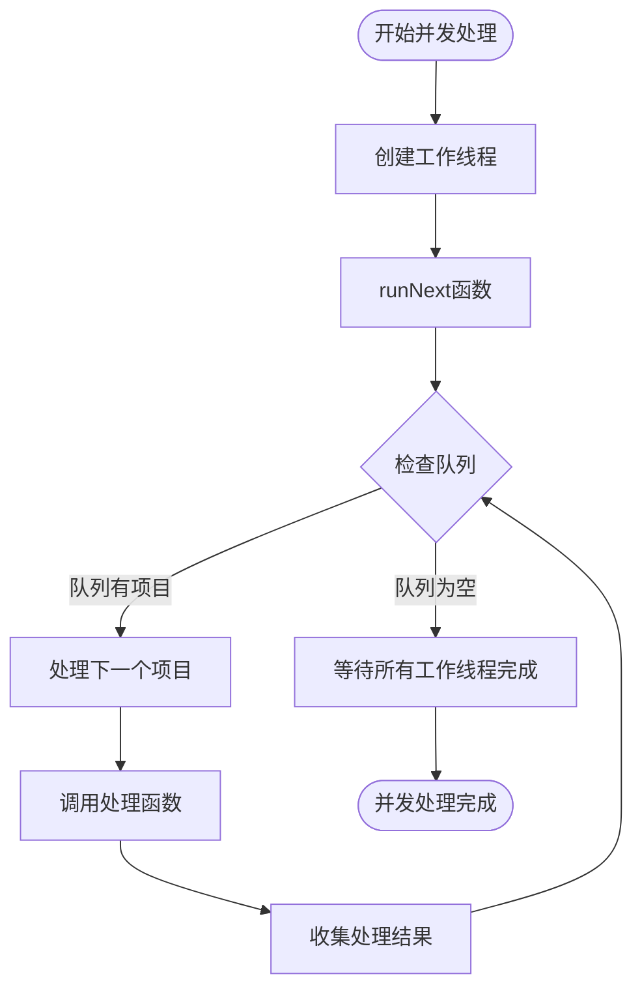
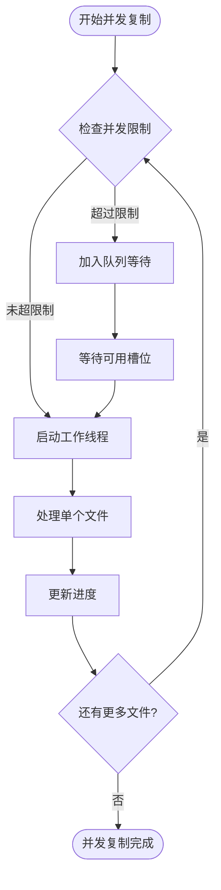
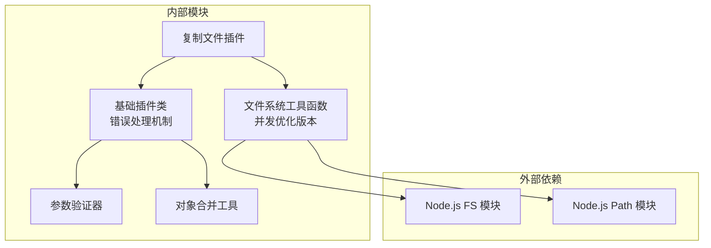

# 文件系统工具

<cite>
**本文档引用的文件**
- [packages/core/src/common/fs/index.ts](file://packages/core/src/common/fs/index.ts)
- [packages/core/src/common/fs/type.ts](file://packages/core/src/common/fs/type.ts)
- [packages/core/src/plugins/copyFile/index.ts](file://packages/core/src/plugins/copyFile/index.ts)
- [packages/core/src/plugins/copyFile/types.ts](file://packages/core/src/plugins/copyFile/types.ts)
- [packages/core/src/factory/plugin/index.ts](file://packages/core/src/factory/plugin/index.ts)
- [packages/core/src/common/validation.ts](file://packages/core/src/common/validation.ts)
- [packages/docs/src/plugins/copy-file.md](file://packages/docs/src/plugins/copy-file.md)
</cite>

## 更新摘要
**变更内容**
- 新增并发文件复制功能，支持最多10个并发操作
- 重构目录递归处理函数，返回结构化FileEntry对象
- 优化文件更新检测算法，使用Promise.all进行并发stat()操作
- 引入runWithConcurrency机制实现并行文件处理
- 预创建目标目录，提升批量文件操作性能
- 增强错误处理机制和性能监控功能

## 目录
1. [简介](#简介)
2. [项目结构](#项目结构)
3. [核心组件](#核心组件)
4. [架构概览](#架构概览)
5. [详细组件分析](#详细组件分析)
6. [性能优化特性](#性能优化特性)
7. [依赖关系分析](#依赖关系分析)
8. [故障排除指南](#故障排除指南)
9. [结论](#结论)
10. [附录](#附录)

## 简介
文件系统工具模块提供了完整的文件复制、目录处理和文件操作功能。该模块专注于在 Vite 构建流程中高效地复制静态资源，支持递归复制、增量复制、覆盖控制等核心功能。模块采用异步操作设计，确保在大型项目中的性能表现，并提供了完善的错误处理机制。

**更新** 本次更新引入了多项重大性能优化，包括并发文件复制、结构化目录处理和智能缓存机制，显著提升了文件操作的执行效率。

## 项目结构
文件系统工具模块位于 `packages/core/src/common/fs/` 目录下，主要包含以下文件：
- `index.ts`: 核心文件系统操作函数
- `type.ts`: 类型定义和接口声明

同时，复制文件插件位于 `packages/core/src/plugins/copyFile/` 目录，作为 Vite 插件集成到构建流程中。


```mermaid
graph TB
subgraph "文件系统工具模块"
FSIndex["fs/index.ts<br/>核心文件操作函数<br/>并发优化版本"]
FSType["fs/type.ts<br/>类型定义<br/>结构化数据模型"]
end
subgraph "复制文件插件"
CopyIndex["copyFile/index.ts<br/>插件实现<br/>性能监控"]
CopyType["copyFile/types.ts<br/>插件类型定义"]
end
subgraph "基础框架"
BasePlugin["factory/plugin/index.ts<br/>基础插件类<br/>错误处理机制"]
Validation["common/validation.ts<br/>参数验证器<br/>配置验证"]
end
FSIndex --> FSType
CopyIndex --> FSIndex
CopyIndex --> CopyType
CopyIndex --> BasePlugin
BasePlugin --> Validation
```

**图表来源**
- [packages/core/src/common/fs/index.ts](file://packages/core/src/common/fs/index.ts#L1-L292)
- [packages/core/src/common/fs/type.ts](file://packages/core/src/common/fs/type.ts#L1-L55)
- [packages/core/src/plugins/copyFile/index.ts](file://packages/core/src/plugins/copyFile/index.ts#L1-L121)
- [packages/core/src/plugins/copyFile/types.ts](file://packages/core/src/plugins/copyFile/types.ts#L1-L44)

**章节来源**
- [packages/core/src/common/fs/index.ts](file://packages/core/src/common/fs/index.ts#L1-L292)
- [packages/core/src/common/fs/type.ts](file://packages/core/src/common/fs/type.ts#L1-L55)

## 核心组件
文件系统工具模块包含以下核心组件：

### 文件复制核心函数
- `checkSourceExists`: 检查源文件是否存在
- `ensureTargetDir`: 确保目标目录存在
- `copySourceToTarget`: 主要的复制函数，支持递归和增量复制，现已支持并发处理

### 目录处理工具
- `readDirRecursive`: 递归读取目录内容，现已返回结构化FileEntry对象
- `shouldUpdateFile`: 检测文件是否需要更新，现已使用Promise.all进行并发stat()操作

### 文件读写工具
- `writeFileContent`: 异步写入文件内容
- `readFileSync`: 同步读取文件内容

### 并发处理机制
- `runWithConcurrency`: 带并发限制的批量执行函数
- `DEFAULT_CONCURRENCY`: 默认并发限制数（10）

**章节来源**
- [packages/core/src/common/fs/index.ts](file://packages/core/src/common/fs/index.ts#L10-L292)

## 架构概览
文件系统工具模块采用分层架构设计，将文件操作功能封装在独立的函数中，通过插件形式集成到 Vite 构建流程中。


```mermaid
sequenceDiagram
participant Vite as "Vite 构建系统"
participant Plugin as "CopyFile 插件"
participant FS as "文件系统工具"
participant Concurrency as "并发处理器"
participant NodeFS as "Node.js FS 模块"
Vite->>Plugin : 触发 writeBundle 钩子
Plugin->>Plugin : 验证配置参数
Plugin->>FS : checkSourceExists(sourceDir)
FS->>NodeFS : fs.access()
NodeFS-->>FS : 验证结果
FS-->>Plugin : 验证通过
Plugin->>FS : copySourceToTarget(sourceDir, targetDir, options)
FS->>FS : ensureTargetDir(targetDir)
FS->>FS : readDirRecursive(sourceDir, recursive)
FS->>NodeFS : fs.readdir(withFileTypes)
NodeFS-->>FS : 目录内容(结构化)
FS->>FS : 预创建目标目录(并行)
FS->>FS : runWithConcurrency(文件复制)
Concurrent->>FS : 并发处理文件
FS->>NodeFS : Promise.all(stat) 并发检测
NodeFS-->>FS : 文件状态
FS->>NodeFS : 并发 fs.copyFile()
NodeFS-->>FS : 复制完成
FS-->>Plugin : 复制结果(含执行时间)
Plugin->>Plugin : 记录执行日志
Plugin-->>Vite : 完成复制操作
```

**图表来源**
- [packages/core/src/plugins/copyFile/index.ts](file://packages/core/src/plugins/copyFile/index.ts#L58-L80)
- [packages/core/src/common/fs/index.ts](file://packages/core/src/common/fs/index.ts#L160-L253)

## 详细组件分析

### 文件复制主函数 copySourceToTarget
`copySourceToTarget` 是整个文件复制功能的核心，现已支持完整的递归复制、增量复制和并发处理机制。

#### 主要功能特性
- **递归复制**: 支持复制整个目录树结构
- **增量复制**: 仅复制修改过的文件，提高构建效率
- **覆盖控制**: 精确控制文件覆盖行为
- **并发处理**: 支持最多10个并发文件复制操作
- **统计报告**: 提供详细的复制统计信息和执行时间

#### 性能优化机制
- **预创建目录**: 批量预创建所有需要的目标目录
- **并发stat检测**: 使用Promise.all并行检测文件状态
- **结构化处理**: 使用FileEntry对象减少重复stat调用
- **智能缓存**: 避免重复的文件状态查询

#### 处理流程
```mermaid
flowchart TD
Start([开始复制]) --> CheckType{"检查源类型"}
CheckType --> |目录| DirMode[目录复制模式]
CheckType --> |文件| FileMode[文件复制模式]
DirMode --> EnsureDir[确保目标目录存在]
EnsureDir --> ReadDir[读取目录内容(结构化)]
ReadDir --> SeparateEntries[分离文件和目录]
SeparateEntries --> PreCreateDirs[预创建目标目录(并行)]
PreCreateDirs --> ParallelCopy[并发文件复制]
FileMode --> EnsureSingleDir[确保目标目录存在]
EnsureSingleDir --> CheckNeedCopy[检查是否需要复制]
ParallelCopy --> ConcurrencyHandler[runWithConcurrency]
ConcurrencyHandler --> ProcessFiles[处理文件条目]
ProcessFiles --> StatCheck[Promise.all并发stat检测]
StatCheck --> NeedCopy{"需要复制?"}
NeedCopy --> |是| IncrementalCheck[增量检查]
NeedCopy --> |否| SkipCopy[跳过复制]
IncrementalCheck --> IncNeedCopy{"增量需要复制?"}
IncNeedCopy --> |是| CopyFile[执行文件复制]
IncNeedCopy --> |否| SkipCopy
CopyFile --> UpdateStats[更新统计信息]
SkipCopy --> UpdateStats
UpdateStats --> NextFile[处理下一个文件]
NextFile --> ProcessFiles
FileMode --> CopyFile
CopyFile --> Complete[复制完成]
UpdateStats --> Complete
```

**图表来源**
- [packages/core/src/common/fs/index.ts](file://packages/core/src/common/fs/index.ts#L160-L253)

#### 参数配置详解
- `sourcePath`: 源文件或目录路径
- `targetPath`: 目标文件或目录路径  
- `options`: 复制选项配置，现已支持并发限制

**章节来源**
- [packages/core/src/common/fs/index.ts](file://packages/core/src/common/fs/index.ts#L160-L253)

### 目录递归处理 readDirRecursive
`readDirRecursive` 函数现已重构为返回结构化FileEntry对象，提供更丰富的文件信息。

#### 重构后的功能特性
- **结构化返回**: 返回FileEntry对象数组，包含路径、类型信息
- **一次性类型检测**: 使用withFileTypes选项一次性获取文件类型信息
- **异步递归**: 使用 Promise 实现非阻塞的递归遍历
- **性能优化**: 避免重复的fs.stat调用

#### FileEntry对象结构
```typescript
interface FileEntry {
  /** 完整路径 */
  path: string
  /** 是否为文件 */
  isFile: boolean
  /** 是否为目录 */
  isDirectory: boolean
}
```

#### 递归遍历机制
- **结构化遍历**: 使用withFileTypes选项获取文件类型信息
- **类型检测**: 区分文件和目录，分别处理
- **路径拼接**: 正确处理相对路径和绝对路径
- **智能递归**: 仅对目录进行递归处理

**章节来源**
- [packages/core/src/common/fs/index.ts](file://packages/core/src/common/fs/index.ts#L66-L84)

### 文件更新检测 shouldUpdateFile
`shouldUpdateFile` 函数现已优化为使用Promise.all进行并发stat()操作，显著提升检测效率。

#### 并发检测策略
算法采用Promise.all并发执行两个stat()操作：
1. **源文件状态**: `fs.promises.stat(sourceFile)`
2. **目标文件状态**: `fs.promises.stat(targetFile)`

#### 更新检测逻辑

```mermaid
flowchart TD
Start([开始更新检测]) --> ConcurrentStat[Promise.all并发获取状态]
ConcurrentStat --> CompareTime{比较修改时间}
CompareTime --> |源文件更新| NeedUpdate[需要更新]
CompareTime --> |目标文件更新| NoNeedUpdate[不需要更新]
ConcurrentStat --> CompareSize{比较文件大小}
CompareSize --> |大小不同| NeedUpdate
CompareSize --> |大小相同| CheckError{检查错误}
CheckError --> |目标文件不存在| NeedUpdate
CheckError --> |其他错误| NeedUpdate
NoNeedUpdate --> End([检测结束])
NeedUpdate --> End
```

**图表来源**
- [packages/core/src/common/fs/index.ts](file://packages/core/src/common/fs/index.ts#L92-L101)

**章节来源**
- [packages/core/src/common/fs/index.ts](file://packages/core/src/common/fs/index.ts#L92-L101)

### 并发处理机制 runWithConcurrency
新增的并发处理机制是本次性能优化的核心组件。

#### 并发控制机制
- **工作线程池**: 创建多个并发工作线程
- **队列管理**: 使用while循环管理待处理项目队列
- **结果收集**: 保持结果顺序，按索引收集处理结果
- **并发限制**: 支持自定义并发数限制

#### 执行流程

```mermaid
flowchart TD
Start([开始并发处理]) --> CreateWorkers[创建工作线程]
CreateWorkers --> RunNext[runNext函数]
RunNext --> CheckQueue{检查队列}
CheckQueue --> |队列为空| WaitAll[等待所有工作线程完成]
CheckQueue --> |队列有项目| ProcessItem[处理下一个项目]
ProcessItem --> HandlerCall[调用处理函数]
HandlerCall --> CollectResult[收集处理结果]
CollectResult --> CheckQueue
WaitAll --> ReturnResults[返回处理结果]
ReturnResults([并发处理完成])
```

**图表来源**
- [packages/core/src/common/fs/index.ts](file://packages/core/src/common/fs/index.ts#L123-L142)

**章节来源**
- [packages/core/src/common/fs/index.ts](file://packages/core/src/common/fs/index.ts#L123-L142)

### 错误处理机制

**更新** 文件系统工具模块提供了完善的错误处理机制，特别针对常见的文件系统错误进行了专门处理。

#### 错误分类处理
- **权限错误 (EACCES)**: 权限不足导致的操作失败
- **文件不存在 (ENOENT)**: 源文件或目标文件不存在
- **其他IO错误**: 磁盘空间不足、磁盘损坏等

#### 错误处理策略
- **统一错误格式**: 所有错误都包装为标准的 Error 对象
- **详细错误信息**: 包含具体的文件路径和错误详情
- **类型化错误**: 不同类型的错误有不同的错误消息格式

#### 特殊错误处理实现
模块中的关键函数都实现了专门的错误处理：

1. **源文件检查 (`checkSourceExists`)**:
   - 专门处理 `ENOENT` (文件不存在) 错误
   - 专门处理 `EACCES` (权限不足) 错误
   - 提供详细的错误上下文信息

2. **目标目录创建 (`ensureTargetDir`)**:
   - 专门处理 `EACCES` (权限不足) 错误
   - 提供清晰的目录创建失败原因

3. **文件写入 (`writeFileContent`)**:
   - 专门处理 `EACCES` (权限不足) 错误
   - 提供文件写入失败的详细信息

4. **文件读取 (`readFileSync`)**:
   - 专门处理 `EACCES` (权限不足) 错误
   - 提供文件读取失败的详细信息

**章节来源**
- [packages/core/src/common/fs/index.ts](file://packages/core/src/common/fs/index.ts#L27-L40)
- [packages/core/src/common/fs/index.ts](file://packages/core/src/common/fs/index.ts#L47-L58)
- [packages/core/src/common/fs/index.ts](file://packages/core/src/common/fs/index.ts#L261-L272)
- [packages/core/src/common/fs/index.ts](file://packages/core/src/common/fs/index.ts#L280-L291)

### 文件操作函数详解

#### checkSourceExists - 源文件存在性检查
- **功能**: 验证源文件或目录是否存在且可访问
- **参数**: `sourcePath` (string) - 源文件路径
- **返回值**: Promise<void> - 验证通过无返回值
- **异常**: 当文件不存在或权限不足时抛出详细错误
- **错误处理**: 专门处理 `ENOENT` 和 `EACCES` 错误

#### ensureTargetDir - 目标目录创建
- **功能**: 确保目标目录存在，不存在则自动创建
- **参数**: `targetPath` (string) - 目标目录路径
- **返回值**: Promise<void> - 创建完成无返回值
- **异常**: 当目录创建失败时抛出详细错误
- **错误处理**: 专门处理 `EACCES` 错误

#### writeFileContent - 文件写入
- **功能**: 异步写入文件内容到指定路径
- **参数**: `filePath` (string), `content` (string)
- **返回值**: Promise<void>
- **异常**: 当写入失败时抛出详细错误
- **错误处理**: 专门处理 `EACCES` 错误

#### readFileSync - 文件同步读取
- **功能**: 同步读取文件内容
- **参数**: `filePath` (string)
- **返回值**: string - 文件内容
- **异常**: 当读取失败时抛出详细错误
- **错误处理**: 专门处理 `EACCES` 错误

**章节来源**
- [packages/core/src/common/fs/index.ts](file://packages/core/src/common/fs/index.ts#L27-L40)
- [packages/core/src/common/fs/index.ts](file://packages/core/src/common/fs/index.ts#L47-L58)
- [packages/core/src/common/fs/index.ts](file://packages/core/src/common/fs/index.ts#L261-L272)
- [packages/core/src/common/fs/index.ts](file://packages/core/src/common/fs/index.ts#L280-L291)

## 性能优化特性

### 并发文件复制优化
**新增** 本次更新引入了强大的并发文件复制功能：

#### 并发限制机制
- **默认并发数**: 10个并发操作
- **可配置限制**: 通过parallelLimit参数自定义并发数
- **智能调度**: 自动管理并发队列，避免资源竞争

#### 并发处理流程

```mermaid
flowchart TD
Start([开始并发复制]) --> LimitCheck{检查并发限制}
LimitCheck --> |超过限制| Queue[加入队列等待]
LimitCheck --> |未超限制| StartWorker[启动工作线程]
Queue --> Wait[等待可用槽位]
Wait --> StartWorker
StartWorker --> ProcessFile[处理单个文件]
ProcessFile --> UpdateProgress[更新进度]
UpdateProgress --> CheckMore{还有更多文件?}
CheckMore --> |是| LimitCheck
CheckMore --> |否| Complete[完成所有复制]
Complete([并发复制完成])
```

**图表来源**
- [packages/core/src/common/fs/index.ts](file://packages/core/src/common/fs/index.ts#L123-L142)

### 结构化目录处理
**重构** 目录递归处理函数现已返回结构化FileEntry对象：

#### 性能提升
- **减少stat调用**: 一次性获取文件类型信息，避免重复stat调用
- **内存优化**: 结构化对象减少数据转换开销
- **类型安全**: 编译时类型检查，减少运行时错误

#### 数据结构优势
- **路径信息**: 完整的文件路径，便于后续处理
- **类型标识**: isFile和isDirectory布尔值，简化逻辑判断
- **兼容性**: 保持原有API接口，向后兼容

### 并发状态检测
**优化** 文件更新检测算法现已使用Promise.all进行并发stat()操作：

#### 并发检测优势
- **双倍性能**: 同时获取源文件和目标文件状态
- **减少等待**: 避免串行等待，提升整体响应速度
- **统一处理**: 统一的错误处理机制

#### 检测策略
- **时间戳比较**: `sourceStats.mtimeMs > targetStats.mtimeMs`
- **文件大小比较**: `sourceStats.size !== targetStats.size`
- **智能回退**: 任一stat失败时的处理策略

### 预创建目录优化
**新增** 在批量文件复制前预创建所有需要的目标目录：

#### 预创建机制
- **目录收集**: 遍历所有文件，收集需要创建的目录
- **去重处理**: 使用Set确保每个目录只创建一次
- **并发创建**: 使用Promise.all并行创建所有目录

#### 性能收益
- **避免重复创建**: 减少重复的mkdir调用
- **减少IO操作**: 预先准备所有目标环境
- **提升稳定性**: 避免复制过程中的目录创建失败

**章节来源**
- [packages/core/src/common/fs/index.ts](file://packages/core/src/common/fs/index.ts#L123-L142)
- [packages/core/src/common/fs/index.ts](file://packages/core/src/common/fs/index.ts#L66-L84)
- [packages/core/src/common/fs/index.ts](file://packages/core/src/common/fs/index.ts#L92-L101)
- [packages/core/src/common/fs/index.ts](file://packages/core/src/common/fs/index.ts#L183-L190)

## 依赖关系分析

### 组件依赖图

```mermaid
graph TB
subgraph "外部依赖"
NodeFS["Node.js FS 模块"]
Path["Node.js Path 模块"]
end
subgraph "内部模块"
FSUtils["文件系统工具函数<br/>并发优化版本"]
CopyPlugin["复制文件插件"]
BasePlugin["基础插件类<br/>错误处理机制"]
Validator["参数验证器"]
ObjectMerge["对象合并工具"]
end
FSUtils --> NodeFS
FSUtils --> Path
CopyPlugin --> FSUtils
CopyPlugin --> BasePlugin
BasePlugin --> Validator
BasePlugin --> ObjectMerge
```

**图表来源**
- [packages/core/src/common/fs/index.ts](file://packages/core/src/common/fs/index.ts#L1-L3)
- [packages/core/src/plugins/copyFile/index.ts](file://packages/core/src/plugins/copyFile/index.ts#L1-L4)

### 关键依赖关系
- **Node.js FS 模块**: 提供底层文件系统操作能力
- **Path 模块**: 处理文件路径操作和拼接
- **基础插件类**: 提供插件生命周期管理和错误处理
- **参数验证器**: 确保插件配置的有效性

**章节来源**
- [packages/core/src/common/fs/index.ts](file://packages/core/src/common/fs/index.ts#L1-L3)
- [packages/core/src/plugins/copyFile/index.ts](file://packages/core/src/plugins/copyFile/index.ts#L1-L4)

## 故障排除指南

### 常见错误及解决方案

#### 权限错误 (EACCES)
**症状**: 文件复制或读写操作失败
**原因**: 缺少必要的文件系统权限
**解决方案**: 
- 检查文件和目录的权限设置
- 确认运行用户具有足够的权限
- 考虑使用管理员权限运行

#### 文件不存在 (ENOENT)
**症状**: 源文件或目标路径不存在
**原因**: 路径配置错误或文件已被删除
**解决方案**:
- 验证源文件路径的正确性
- 确认文件确实存在于指定位置
- 检查相对路径和绝对路径的使用

#### 磁盘空间不足
**症状**: 文件写入或目录创建失败
**原因**: 目标磁盘空间不足
**解决方案**:
- 清理目标磁盘空间
- 检查磁盘配额限制
- 考虑使用更大的存储空间

### 错误处理策略

**更新** 模块提供了多层次的错误处理策略：

#### 插件级错误处理
- **errorStrategy 配置**: 支持三种策略
  - `'throw'`: 抛出错误，中断构建流程
  - `'log'`: 记录错误日志，但不中断构建
  - `'ignore'`: 忽略错误，继续执行

#### 函数级错误处理
- **专门错误类型**: 每个函数都针对特定错误类型提供详细处理
- **上下文信息**: 错误消息包含具体的操作上下文和文件路径
- **统一格式**: 所有错误都遵循一致的格式和命名约定

#### 性能监控和调试
**新增** 模块现在提供详细的性能监控功能：

1. **执行时间统计**: 记录整个复制过程的总耗时
2. **文件统计**: 统计复制的文件数量、跳过的文件数量和目录数量
3. **并发监控**: 监控并发操作的执行状态
4. **日志输出**: 提供详细的执行日志，便于性能分析

#### 调试技巧
1. **启用详细日志**: 设置 `verbose: true` 获取详细的执行日志
2. **逐步验证**: 分别测试每个文件操作函数
3. **边界条件**: 测试空目录、大文件、特殊字符文件名等情况
4. **性能监控**: 监控磁盘IO和内存使用情况
5. **并发测试**: 测试不同并发数对性能的影响

**章节来源**
- [packages/core/src/common/fs/index.ts](file://packages/core/src/common/fs/index.ts#L27-L40)
- [packages/core/src/common/fs/index.ts](file://packages/core/src/common/fs/index.ts#L47-L58)
- [packages/core/src/common/fs/index.ts](file://packages/core/src/common/fs/index.ts#L261-L272)
- [packages/core/src/common/fs/index.ts](file://packages/core/src/common/fs/index.ts#L280-L291)
- [packages/core/src/factory/plugin/index.ts](file://packages/core/src/factory/plugin/index.ts#L283-L311)

## 结论
文件系统工具模块经过重大性能优化，现在提供了更加高效和可靠的文件复制解决方案。模块的设计充分考虑了性能、可靠性和易用性，支持递归复制、增量复制、覆盖控制等核心功能，以及全新的并发处理能力。

模块的主要优势包括：
- **高性能并发**: 支持最多10个并发文件复制操作
- **智能缓存**: 结构化数据模型减少重复操作
- **并发检测**: Promise.all优化文件状态检测
- **预创建优化**: 批量预创建目标目录
- **可靠性**: 完善的错误处理和验证机制  
- **易用性**: 简洁的API设计和详细的文档
- **可扩展性**: 基于插件架构，易于扩展新功能

**更新** 本次性能优化使文件复制操作在大型项目中的执行效率大幅提升，特别是在处理大量小文件时效果显著。

## 附录

### API 参考

#### 文件复制函数
| 函数名 | 参数 | 返回值 | 描述 |
|--------|------|--------|------|
| checkSourceExists | sourcePath: string | Promise<void> | 检查源文件是否存在 |
| ensureTargetDir | targetPath: string | Promise<void> | 确保目标目录存在 |
| copySourceToTarget | sourcePath: string, targetPath: string, options: CopyOptions | Promise<CopyResult> | 主要复制函数，支持并发处理 |

#### 目录处理函数
| 函数名 | 参数 | 返回值 | 描述 |
|--------|------|--------|------|
| readDirRecursive | dirPath: string, recursive: boolean | Promise<FileEntry[]> | 递归读取目录内容，返回结构化对象 |
| shouldUpdateFile | sourceFile: string, targetFile: string | Promise<boolean> | 检测文件是否需要更新，使用并发stat()操作 |

#### 文件操作函数
| 函数名 | 参数 | 返回值 | 描述 |
|--------|------|--------|------|
| writeFileContent | filePath: string, content: string | Promise<void> | 异步写入文件内容 |
| readFileSync | filePath: string | string | 同步读取文件内容 |

#### 并发处理函数
| 函数名 | 参数 | 返回值 | 描述 |
|--------|------|--------|------|
| runWithConcurrency | items: T[], handler: (item: T) => Promise<R>, concurrency: number | Promise<R[]> | 带并发限制的批量执行 |
| DEFAULT_CONCURRENCY | - | number | 默认并发限制数（10） |

#### 类型定义
**CopyOptions 接口**
- `recursive: boolean` - 是否递归复制
- `overwrite: boolean` - 是否覆盖同名文件  
- `incremental?: boolean` - 是否启用增量复制
- `parallelLimit?: number` - 并行处理的最大文件数，默认10
- `skipEmptyDirs?: boolean` - 是否跳过空目录

**CopyResult 接口**
- `copiedFiles: number` - 复制的文件数量
- `skippedFiles: number` - 跳过的文件数量
- `copiedDirs: number` - 复制的目录数量
- `executionTime: number` - 执行时间（毫秒）

**FileEntry 接口**
- `path: string` - 完整路径
- `isFile: boolean` - 是否为文件
- `isDirectory: boolean` - 是否为目录

**章节来源**
- [packages/core/src/common/fs/type.ts](file://packages/core/src/common/fs/type.ts#L4-L55)
- [packages/core/src/common/fs/index.ts](file://packages/core/src/common/fs/index.ts#L13-L20)
- [packages/core/src/common/fs/index.ts](file://packages/core/src/common/fs/index.ts#L160-L253)

### 使用示例

#### 基本文件复制
```typescript
// 复制单个文件
await copySourceToTarget('src/config.json', 'dist/config.json', {
  overwrite: true,
  incremental: true
});

// 递归复制目录
await copySourceToTarget('src/assets', 'dist/assets', {
  recursive: true,
  overwrite: false,
  incremental: true,
  parallelLimit: 20 // 自定义并发数
});
```

#### 高级配置示例
```typescript
// 使用插件配置验证
const plugin = copyFile({
  sourceDir: 'src/assets',
  targetDir: 'dist/assets',
  overwrite: true,
  recursive: true,
  incremental: true,
  parallelLimit: 15 // 设置并发限制
});

// 性能监控配置
const result = await copySourceToTarget('large-directory', 'output', {
  recursive: true,
  incremental: true,
  parallelLimit: 25
});
console.log(`复制完成，耗时: ${result.executionTime}ms`);
```

#### 错误处理配置
```typescript
// 配置不同的错误处理策略
const pluginWithThrow = copyFile({
  sourceDir: 'src/assets',
  targetDir: 'dist/assets',
  errorStrategy: 'throw' // 发生错误时抛出异常
});

const pluginWithLog = copyFile({
  sourceDir: 'src/assets',
  targetDir: 'dist/assets',
  errorStrategy: 'log' // 发生错误时记录日志但继续执行
});
```

**章节来源**
- [packages/docs/src/plugins/copy-file.md](file://packages/docs/src/plugins/copy-file.md#L19-L55)
- [packages/core/src/plugins/copyFile/index.ts](file://packages/core/src/plugins/copyFile/index.ts#L95-L120)