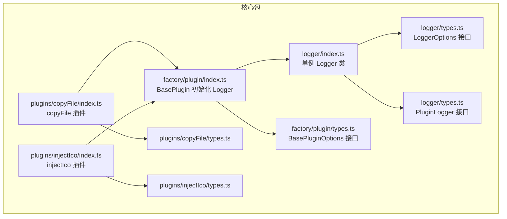
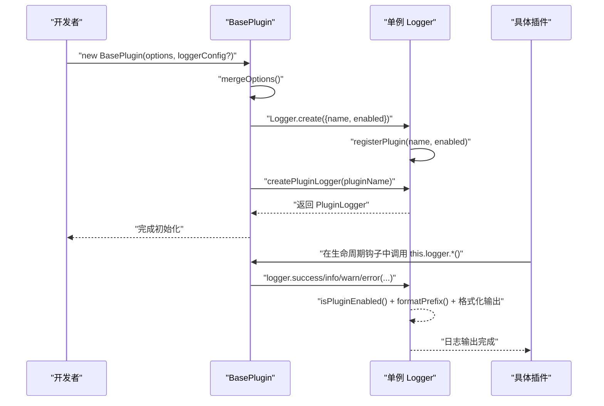
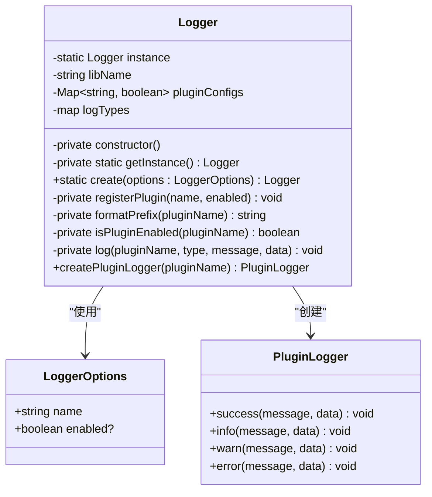
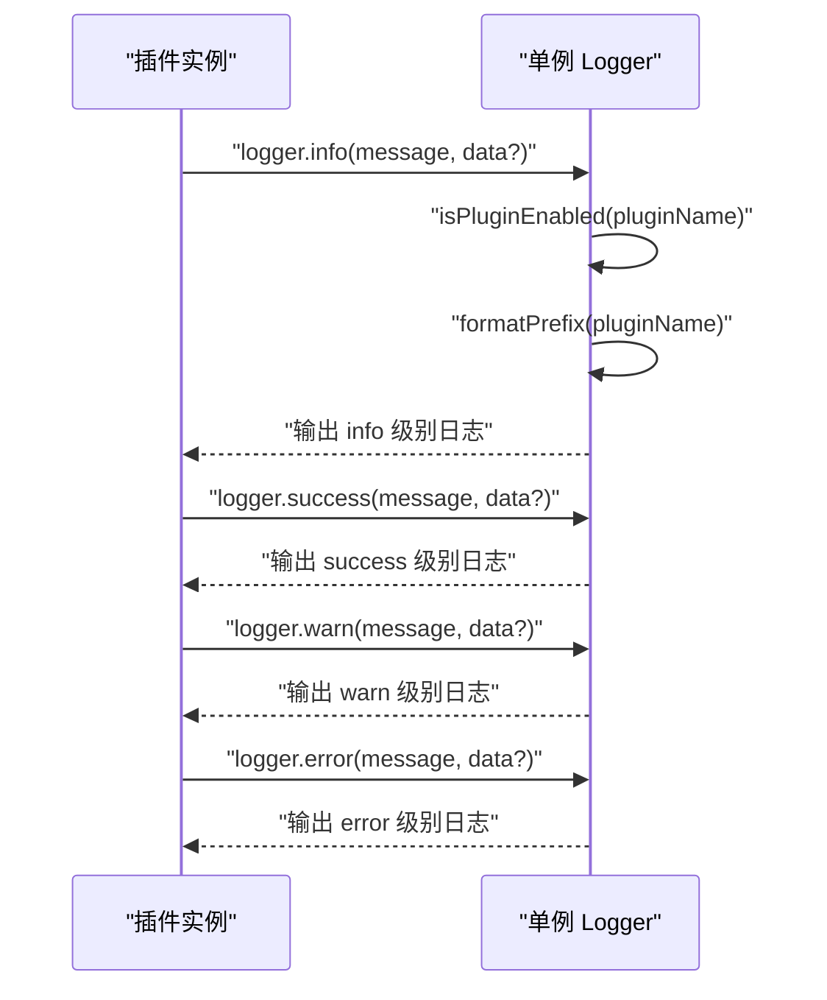
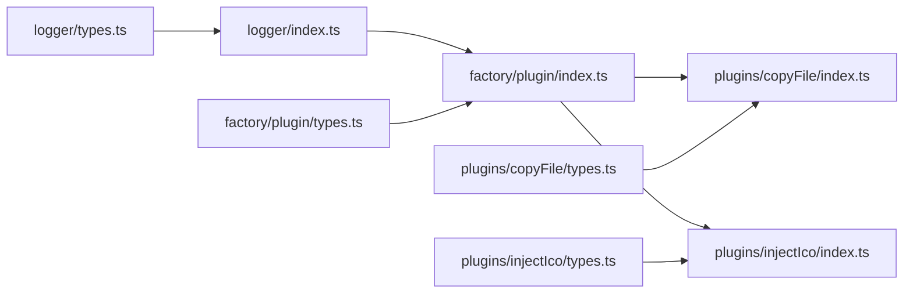

# 日志系统

<cite>
**本文引用的文件**
- [packages/core/src/logger/index.ts](file://packages/core/src/logger/index.ts)
- [packages/core/src/logger/types.ts](file://packages/core/src/logger/types.ts)
- [packages/core/src/factory/plugin/index.ts](file://packages/core/src/factory/plugin/index.ts)
- [packages/core/src/factory/plugin/types.ts](file://packages/core/src/factory/plugin/types.ts)
- [packages/core/src/plugins/copyFile/index.ts](file://packages/core/src/plugins/copyFile/index.ts)
- [packages/core/src/plugins/injectIco/index.ts](file://packages/core/src/plugins/injectIco/index.ts)
- [packages/core/src/plugins/copyFile/types.ts](file://packages/core/src/plugins/copyFile/types.ts)
- [packages/core/src/plugins/injectIco/types.ts](file://packages/core/src/plugins/injectIco/types.ts)
- [packages/core/package.json](file://packages/core/package.json)
</cite>

## 更新摘要
**变更内容**
- 从简单工具类升级为单例模式的复杂日志框架
- 新增 PluginLogger 接口，提供插件特定的日志控制
- 实现统一的日志格式化和插件配置管理
- 增强日志系统的可扩展性和性能优化

## 目录
1. [简介](#简介)
2. [项目结构](#项目结构)
3. [核心组件](#核心组件)
4. [架构总览](#架构总览)
5. [详细组件分析](#详细组件分析)
6. [依赖分析](#依赖分析)
7. [性能考虑](#性能考虑)
8. [故障排查指南](#故障排查指南)
9. [结论](#结论)
10. [附录：API 参考](#附录api-参考)

## 简介
本文件为日志系统模块的全面使用文档，重点围绕全新的单例模式日志框架设计与使用展开，涵盖以下主题：
- 单例模式 Logger 类的架构设计与职责边界
- PluginLogger 接口的插件特定日志控制机制
- 统一日志输出格式化规则（时间戳、级别、消息、附加数据）
- 插件配置映射与日志开关控制
- 实际使用示例（info、warn、error 等）
- 性能与最佳实践（异步与批量策略建议）
- 扩展性（自定义格式与输出目标）
- 完整 API 参考与调试技巧

## 项目结构
日志系统位于核心包 packages/core 下，采用"按功能域分层"的组织方式：
- logger：单例模式日志管理器与类型定义
- factory：插件工厂与基类，负责日志记录器的初始化与注入
- plugins：具体插件（如 copyFile、injectIco）在运行期通过 PluginLogger 输出日志

**图表来源**
- [packages/core/src/logger/index.ts](file://packages/core/src/logger/index.ts#L1-L188)
- [packages/core/src/logger/types.ts](file://packages/core/src/logger/types.ts#L1-L14)
- [packages/core/src/factory/plugin/index.ts](file://packages/core/src/factory/plugin/index.ts#L1-L386)
- [packages/core/src/factory/plugin/types.ts](file://packages/core/src/factory/plugin/types.ts#L1-L46)

**章节来源**
- [packages/core/src/logger/index.ts](file://packages/core/src/logger/index.ts#L1-L188)
- [packages/core/src/logger/types.ts](file://packages/core/src/logger/types.ts#L1-L14)
- [packages/core/src/factory/plugin/index.ts](file://packages/core/src/factory/plugin/index.ts#L1-L386)
- [packages/core/src/factory/plugin/types.ts](file://packages/core/src/factory/plugin/types.ts#L1-L46)

## 核心组件
- **单例模式 Logger 类**：提供全局统一的日志管理能力，支持插件配置映射、日志级别控制和格式化输出
- **PluginLogger 接口**：为每个插件提供独立的日志代理对象，实现插件特定的日志控制
- **LoggerOptions 接口**：定义 Logger 的构造参数，包含插件名称与是否启用日志两个字段
- **BasePlugin 初始化流程**：在插件构造阶段根据插件自身配置（verbose）决定 Logger 的启用状态，并通过 createPluginLogger 为每个插件创建独立的日志代理

**章节来源**
- [packages/core/src/logger/index.ts](file://packages/core/src/logger/index.ts#L7-L153)
- [packages/core/src/logger/types.ts](file://packages/core/src/logger/types.ts#L4-L13)
- [packages/core/src/factory/plugin/index.ts](file://packages/core/src/factory/plugin/index.ts#L128-L138)

## 架构总览
新的日志系统采用单例模式，Logger 在插件体系中的位置如下：
- 插件基类 BasePlugin 负责合并插件配置、初始化单例 Logger，并通过 createPluginLogger 为每个插件创建独立的日志代理
- 具体插件（如 copyFile、injectIco）在关键节点通过各自的 PluginLogger 输出 info、success、warn、error 等日志，实现插件级别的日志控制

**图表来源**
- [packages/core/src/factory/plugin/index.ts](file://packages/core/src/factory/plugin/index.ts#L69-L81)
- [packages/core/src/factory/plugin/index.ts](file://packages/core/src/factory/plugin/index.ts#L128-L138)
- [packages/core/src/logger/index.ts](file://packages/core/src/logger/index.ts#L76-L80)
- [packages/core/src/logger/index.ts](file://packages/core/src/logger/index.ts#L145-L152)

## 详细组件分析

### 单例模式 Logger 类设计与实现
- **设计要点**
  - 私有静态实例：确保全局只有一个 Logger 实例
  - 插件配置映射：使用 Map 存储每个插件的日志开关状态
  - 日志类型映射：将级别映射到控制台方法、图标、颜色与重置序列
  - 工厂方法：create 方法创建单例实例并注册插件配置
  - 插件代理：createPluginLogger 为每个插件返回独立的日志代理对象

**图表来源**
- [packages/core/src/logger/index.ts](file://packages/core/src/logger/index.ts#L7-L153)
- [packages/core/src/logger/types.ts](file://packages/core/src/logger/types.ts#L4-L13)

**章节来源**
- [packages/core/src/logger/index.ts](file://packages/core/src/logger/index.ts#L7-L153)
- [packages/core/src/logger/types.ts](file://packages/core/src/logger/types.ts#L4-L13)

### PluginLogger 接口与插件特定控制机制
- **接口设计**
  - success/info/warn/error 四种日志级别方法
  - 每个插件通过独立的 PluginLogger 实例进行日志记录
  - 支持附加数据参数，便于调试和问题定位
- **控制机制**
  - 通过 isPluginEnabled 方法检查插件级别的日志开关
  - 每个插件的日志状态独立管理，可分别控制不同插件的日志输出
  - 默认情况下插件日志启用，除非显式禁用

**章节来源**
- [packages/core/src/logger/index.ts](file://packages/core/src/logger/index.ts#L145-L152)
- [packages/core/src/logger/index.ts](file://packages/core/src/logger/index.ts#L110-L112)
- [packages/core/src/logger/index.ts](file://packages/core/src/logger/index.ts#L159-L187)

### 统一日志输出格式化规则
- **时间戳格式**：formatPrefix 中使用本地时间字符串，格式为 `[YYYY/MM/DD HH:mm:ss]`
- **命名空间格式**：固定前缀包含库名与插件名，格式为 `[@meng-xi/vite-plugin:pluginName]`
- **图标与颜色**：success/warn/error 分别带有 Unicode 图标与 ANSI 颜色控制序列，info 不加图标与颜色
- **输出结构**：统一以分隔线包裹，若存在附加数据则分两行输出（前缀+消息，数据）

**章节来源**
- [packages/core/src/logger/index.ts](file://packages/core/src/logger/index.ts#L96-L103)
- [packages/core/src/logger/index.ts](file://packages/core/src/logger/index.ts#L121-L137)

### 插件配置映射与集成机制
- **LoggerOptions**
  - name：插件名称，用于标识日志来源
  - enabled：是否启用该插件的日志输出
- **BasePlugin 集成流程**
  - Logger.create 创建单例实例并注册插件配置
  - initLogger 方法将插件配置与 LoggerOptions 关联
  - createPluginLogger 为每个插件创建独立的日志代理对象
- **插件配置对日志的影响**
  - BasePluginOptions 中的 verbose 控制插件日志启用状态
  - 插件自身的 enabled 控制插件逻辑是否执行，但不影响日志开关

**章节来源**
- [packages/core/src/logger/types.ts](file://packages/core/src/logger/types.ts#L4-L13)
- [packages/core/src/factory/plugin/index.ts](file://packages/core/src/factory/plugin/index.ts#L128-L138)
- [packages/core/src/factory/plugin/types.ts](file://packages/core/src/factory/plugin/types.ts#L8-L29)
- [packages/core/src/plugins/copyFile/types.ts](file://packages/core/src/plugins/copyFile/types.ts#L8-L43)
- [packages/core/src/plugins/injectIco/types.ts](file://packages/core/src/plugins/injectIco/types.ts#L70-L112)

### 实际使用示例
- **在插件中记录不同级别的日志**
  - info：记录一般性信息（如跳过执行、未生成标签等）
  - success：记录成功结果（如复制完成、注入成功）
  - warn：记录潜在问题（如未找到 head 标签）
  - error：记录错误（由插件内部错误处理触发）

**图表来源**
- [packages/core/src/plugins/copyFile/index.ts](file://packages/core/src/plugins/copyFile/index.ts#L64-L79)
- [packages/core/src/plugins/injectIco/index.ts](file://packages/core/src/plugins/injectIco/index.ts#L51-L78)
- [packages/core/src/logger/index.ts](file://packages/core/src/logger/index.ts#L145-L152)

**章节来源**
- [packages/core/src/plugins/copyFile/index.ts](file://packages/core/src/plugins/copyFile/index.ts#L64-L79)
- [packages/core/src/plugins/injectIco/index.ts](file://packages/core/src/plugins/injectIco/index.ts#L51-L78)
- [packages/core/src/logger/index.ts](file://packages/core/src/logger/index.ts#L145-L152)

### 性能考虑与最佳实践
- **当前实现优势**
  - 单例模式：避免重复创建 Logger 实例，节省内存资源
  - 插件配置映射：集中管理多个插件的日志开关，提高效率
  - 同步输出：Logger 使用 console.* 直接输出，简单可靠
  - 格式化开销：每次输出都会生成前缀与颜色序列，适合开发调试
- **建议策略（概念性指导）**
  - 异步日志：在高频日志场景下，可将日志写入队列并通过后台任务批量输出，降低主线程阻塞
  - 批量输出：聚合短时间内的日志条目，减少终端渲染压力
  - 条件输出：结合 enabled 与插件 verbose，仅在必要时输出详细日志
  - 结构化日志：在生产环境建议输出结构化 JSON，便于日志收集与检索

## 依赖分析
- **Logger 依赖**
  - types.ts：LoggerOptions 和 PluginLogger 接口
- **BasePlugin 对 Logger 的依赖**
  - 通过 Logger.create 将插件配置与单例 Logger 关联
  - 通过 createPluginLogger 将 Logger 注入到插件实例，供各生命周期使用
- **具体插件对 Logger 的依赖**
  - copyFile：在执行前后输出 info/success/warn
  - injectIco：在 HTML 转换与文件复制阶段输出 info/success/warn

**图表来源**
- [packages/core/src/logger/types.ts](file://packages/core/src/logger/types.ts#L4-L13)
- [packages/core/src/logger/index.ts](file://packages/core/src/logger/index.ts#L1-L188)
- [packages/core/src/factory/plugin/index.ts](file://packages/core/src/factory/plugin/index.ts#L1-L386)
- [packages/core/src/factory/plugin/types.ts](file://packages/core/src/factory/plugin/types.ts#L1-L46)
- [packages/core/src/plugins/copyFile/index.ts](file://packages/core/src/plugins/copyFile/index.ts#L1-L121)
- [packages/core/src/plugins/injectIco/index.ts](file://packages/core/src/plugins/injectIco/index.ts#L1-L169)

**章节来源**
- [packages/core/src/logger/index.ts](file://packages/core/src/logger/index.ts#L1-L188)
- [packages/core/src/factory/plugin/index.ts](file://packages/core/src/factory/plugin/index.ts#L1-L386)
- [packages/core/src/plugins/copyFile/index.ts](file://packages/core/src/plugins/copyFile/index.ts#L1-L121)
- [packages/core/src/plugins/injectIco/index.ts](file://packages/core/src/plugins/injectIco/index.ts#L1-L169)

## 故障排查指南
- **日志不显示**
  - 检查 LoggerOptions.enabled 或插件 verbose 是否为 false
  - 确认插件 enabled 是否为 false 导致提前返回
  - 验证插件名称是否正确注册到 pluginConfigs 映射表
- **输出格式异常**
  - 确认终端支持 ANSI 颜色与图标显示
  - 检查是否在非终端环境中（如 CI）导致样式丢失
- **插件未执行**
  - 检查插件的 enabled 与 errorStrategy 配置，确认错误处理策略是否导致流程中断
- **日志过多影响性能**
  - 建议在生产环境关闭 verbose，或引入异步/批量策略（见"性能考虑"）
- **插件间日志相互影响**
  - 检查是否正确使用 createPluginLogger 为每个插件创建独立的日志代理
  - 确认插件配置映射表中的日志状态是否正确

**章节来源**
- [packages/core/src/logger/index.ts](file://packages/core/src/logger/index.ts#L110-L112)
- [packages/core/src/factory/plugin/index.ts](file://packages/core/src/factory/plugin/index.ts#L128-L138)
- [packages/core/src/plugins/copyFile/index.ts](file://packages/core/src/plugins/copyFile/index.ts#L63-L66)
- [packages/core/src/plugins/injectIco/index.ts](file://packages/core/src/plugins/injectIco/index.ts#L50-L52)

## 结论
本日志系统经过重大升级，从简单的工具类发展为功能完善的单例模式框架。通过 PluginLogger 接口和插件配置映射机制，实现了插件级别的独立日志控制，配合统一的格式化输出和性能优化，为开发者提供了强大而灵活的日志记录解决方案。在开发与调试阶段，建议开启 verbose 以获得充分信息；在生产环境，建议关闭详细日志或采用异步/批量策略以提升性能与稳定性。

## 附录：API 参考

### Logger 类（单例模式）
- **构造函数**
  - 私有构造函数，防止外部直接实例化
  - 通过静态方法 getInstance 获取单例实例
- **静态方法**
  - create(options: LoggerOptions): Logger - 工厂方法，创建单例实例并注册插件配置
- **私有方法**
  - registerPlugin(name: string, enabled: boolean): void - 注册插件日志配置
  - formatPrefix(pluginName: string): string - 生成带时间戳和命名空间的日志前缀
  - isPluginEnabled(pluginName: string): boolean - 检查插件日志是否启用
  - log(pluginName: string, type: keyof typeof logTypes, message: string, data?: any): void - 统一日志输出方法
- **公共方法**
  - createPluginLogger(pluginName: string): PluginLogger - 为插件创建独立的日志代理对象

**章节来源**
- [packages/core/src/logger/index.ts](file://packages/core/src/logger/index.ts#L57-L153)

### PluginLogger 接口
- **方法定义**
  - success(message: string, data?: any): void - 输出成功级别日志
  - info(message: string, data?: any): void - 输出信息级别日志
  - warn(message: string, data?: any): void - 输出警告级别日志
  - error(message: string, data?: any): void - 输出错误级别日志
- **行为特性**
  - 每个插件拥有独立的 PluginLogger 实例
  - 自动检查插件级别的日志开关状态
  - 支持附加数据参数，便于调试和问题定位

**章节来源**
- [packages/core/src/logger/index.ts](file://packages/core/src/logger/index.ts#L159-L187)

### LoggerOptions 接口
- **字段定义**
  - name: string（必填）- 插件名称，用于标识日志来源
  - enabled: boolean（可选）- 是否启用该插件的日志输出，默认 true

**章节来源**
- [packages/core/src/logger/types.ts](file://packages/core/src/logger/types.ts#L4-L13)

### BasePlugin 初始化 Logger
- **输入参数**
  - options: T - 插件配置对象
  - loggerConfig?: LoggerOptions（可选）- 额外的日志配置
- **行为流程**
  - 合并插件配置：mergeOptions(options)
  - 初始化日志记录器：initLogger(loggerConfig)
  - 创建插件特定的日志代理：createPluginLogger(this.getPluginName())
- **返回值**
  - PluginLogger - 插件特定的日志代理对象

**章节来源**
- [packages/core/src/factory/plugin/index.ts](file://packages/core/src/factory/plugin/index.ts#L69-L81)
- [packages/core/src/factory/plugin/index.ts](file://packages/core/src/factory/plugin/index.ts#L128-L138)

### 具体插件中的日志使用
- **copyFile 插件**
  - 在插件禁用、执行前后输出 info/success/warn
  - 使用 this.logger.info/this.logger.success/this.logger.warn
- **injectIco 插件**
  - 在 HTML 转换与文件复制阶段输出 info/success/warn
  - 使用 this.logger.info/this.logger.success/this.logger.warn

**章节来源**
- [packages/core/src/plugins/copyFile/index.ts](file://packages/core/src/plugins/copyFile/index.ts#L64-L79)
- [packages/core/src/plugins/injectIco/index.ts](file://packages/core/src/plugins/injectIco/index.ts#L51-L78)