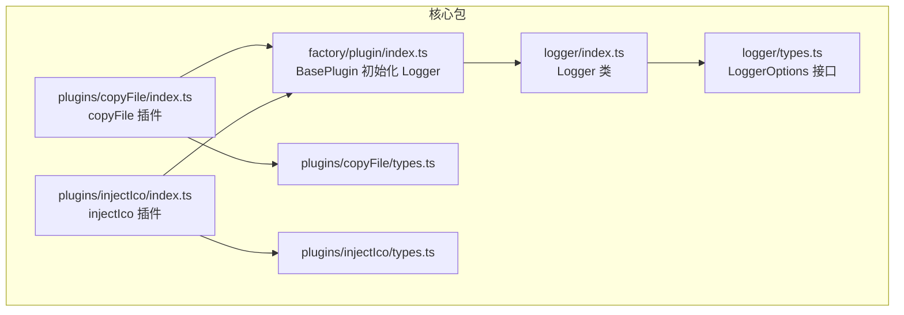
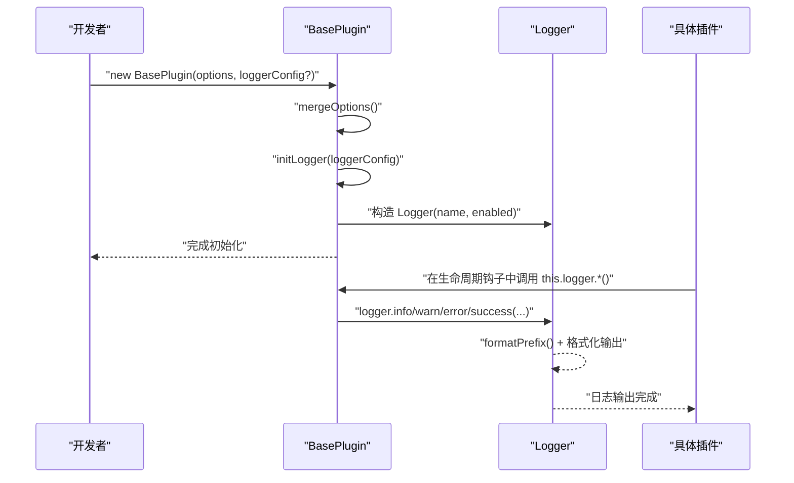
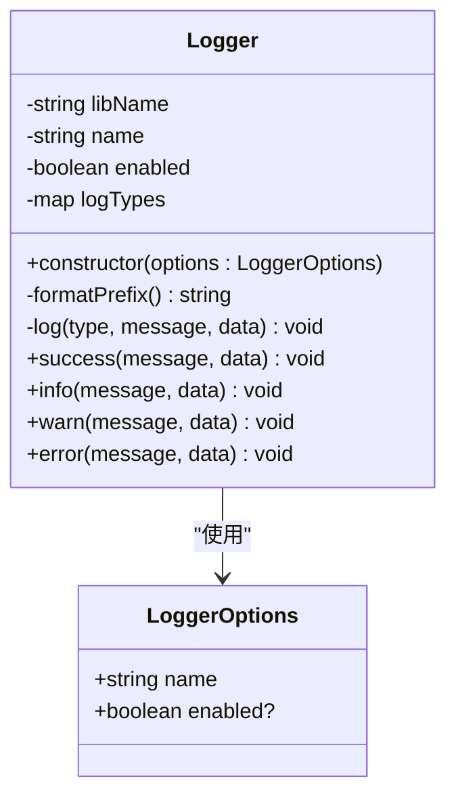
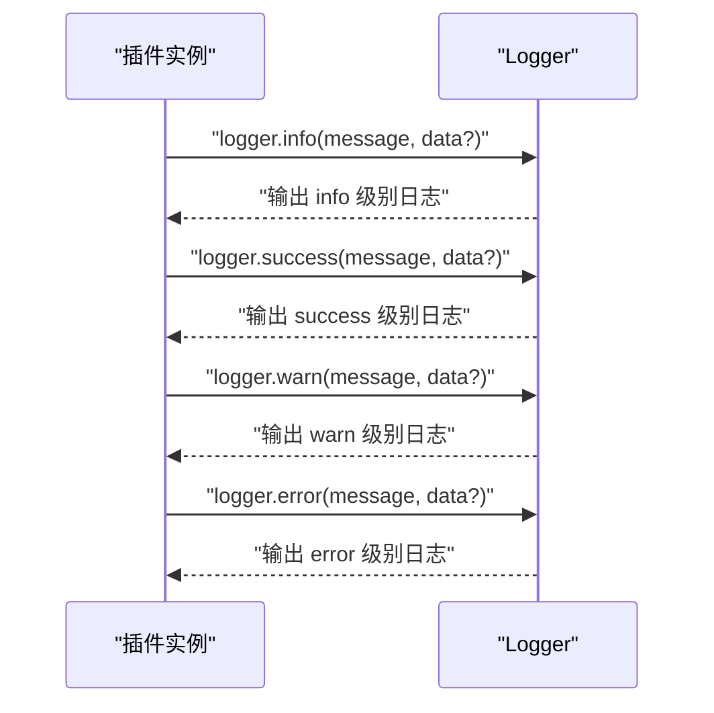
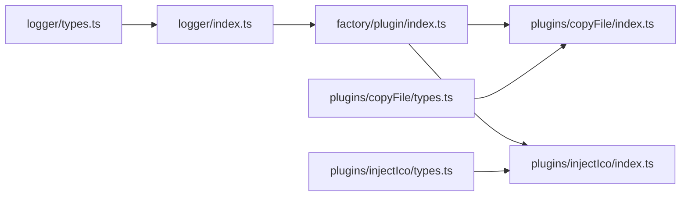

# 日志系统

<cite>
**本文引用的文件**
- [packages/core/src/logger/index.ts](file://packages/core/src/logger/index.ts)
- [packages/core/src/logger/types.ts](file://packages/core/src/logger/types.ts)
- [packages/core/src/factory/plugin/index.ts](file://packages/core/src/factory/plugin/index.ts)
- [packages/core/src/plugins/copyFile/index.ts](file://packages/core/src/plugins/copyFile/index.ts)
- [packages/core/src/plugins/injectIco/index.ts](file://packages/core/src/plugins/injectIco/index.ts)
- [packages/core/src/plugins/copyFile/types.ts](file://packages/core/src/plugins/copyFile/types.ts)
- [packages/core/src/plugins/injectIco/types.ts](file://packages/core/src/plugins/injectIco/types.ts)
- [packages/core/package.json](file://packages/core/package.json)
</cite>

## 目录
1. [简介](#简介)
2. [项目结构](#项目结构)
3. [核心组件](#核心组件)
4. [架构总览](#架构总览)
5. [详细组件分析](#详细组件分析)
6. [依赖分析](#依赖分析)
7. [性能考虑](#性能考虑)
8. [故障排查指南](#故障排查指南)
9. [结论](#结论)
10. [附录：API 参考](#附录api-参考)

## 简介
本文件为日志系统模块的全面使用文档，重点围绕 Logger 类的设计与使用展开，涵盖以下主题：
- Logger 类的架构设计与职责边界
- 日志级别定义与控制机制
- 日志输出格式化规则（时间戳、级别、消息、附加数据）
- 日志配置选项（输出目标、格式模板、过滤条件）与集成方式
- 实际使用示例（info、warn、error 等）
- 性能与最佳实践（异步与批量策略建议）
- 扩展性（自定义格式与输出目标）
- 完整 API 参考与调试技巧

## 项目结构
日志系统位于核心包 packages/core 下，采用“按功能域分层”的组织方式：
- logger：日志工具类与类型定义
- factory：插件工厂与基类，负责日志记录器的初始化与注入
- plugins：具体插件（如 copyFile、injectIco）在运行期通过 Logger 输出日志

图表来源
- [packages/core/src/logger/index.ts](file://packages/core/src/logger/index.ts#L1-L131)
- [packages/core/src/logger/types.ts](file://packages/core/src/logger/types.ts#L1-L14)
- [packages/core/src/factory/plugin/index.ts](file://packages/core/src/factory/plugin/index.ts#L1-L167)
- [packages/core/src/plugins/copyFile/index.ts](file://packages/core/src/plugins/copyFile/index.ts#L1-L121)
- [packages/core/src/plugins/injectIco/index.ts](file://packages/core/src/plugins/injectIco/index.ts#L1-L171)
- [packages/core/src/plugins/copyFile/types.ts](file://packages/core/src/plugins/copyFile/types.ts#L1-L44)
- [packages/core/src/plugins/injectIco/types.ts](file://packages/core/src/plugins/injectIco/types.ts#L1-L113)

章节来源
- [packages/core/src/logger/index.ts](file://packages/core/src/logger/index.ts#L1-L131)
- [packages/core/src/logger/types.ts](file://packages/core/src/logger/types.ts#L1-L14)
- [packages/core/src/factory/plugin/index.ts](file://packages/core/src/factory/plugin/index.ts#L1-L167)
- [packages/core/src/plugins/copyFile/index.ts](file://packages/core/src/plugins/copyFile/index.ts#L1-L121)
- [packages/core/src/plugins/injectIco/index.ts](file://packages/core/src/plugins/injectIco/index.ts#L1-L171)

## 核心组件
- Logger 类：提供统一的日志输出能力，支持 info、success、warn、error 四种级别；内部通过格式化前缀与颜色控制实现可读性增强；支持按开关控制是否输出。
- LoggerOptions 接口：定义 Logger 的构造参数，包含插件名称与是否启用日志两个字段。
- BasePlugin 初始化流程：在插件构造阶段根据插件自身配置（verbose）决定 Logger 的启用状态，并可传入外部 Logger 实例或 LoggerOptions 进行定制。

章节来源
- [packages/core/src/logger/index.ts](file://packages/core/src/logger/index.ts#L6-L130)
- [packages/core/src/logger/types.ts](file://packages/core/src/logger/types.ts#L4-L13)
- [packages/core/src/factory/plugin/index.ts](file://packages/core/src/factory/plugin/index.ts#L120-L139)

## 架构总览
Logger 在插件体系中的位置如下：
- 插件基类 BasePlugin 负责合并插件配置、初始化 Logger，并在插件生命周期内调用日志方法。
- 具体插件（如 copyFile、injectIco）在关键节点输出 info、success、warn、error 等日志，便于追踪执行状态与问题。

图表来源
- [packages/core/src/factory/plugin/index.ts](file://packages/core/src/factory/plugin/index.ts#L69-L81)
- [packages/core/src/factory/plugin/index.ts](file://packages/core/src/factory/plugin/index.ts#L120-L139)
- [packages/core/src/logger/index.ts](file://packages/core/src/logger/index.ts#L78-L93)

## 详细组件分析

### Logger 类设计与实现
- 设计要点
  - 私有属性：库名、插件名、启用标志
  - 日志类型映射：将级别映射到控制台方法、图标、颜色与重置序列
  - 统一输出：formatPrefix 生成带时间戳与命名空间的前缀，log 统一处理输出格式
  - 公共方法：success/info/warn/error 分别对应不同级别与样式

图表来源
- [packages/core/src/logger/index.ts](file://packages/core/src/logger/index.ts#L6-L130)
- [packages/core/src/logger/types.ts](file://packages/core/src/logger/types.ts#L4-L13)

章节来源
- [packages/core/src/logger/index.ts](file://packages/core/src/logger/index.ts#L6-L130)
- [packages/core/src/logger/types.ts](file://packages/core/src/logger/types.ts#L4-L13)

### 日志级别与控制机制
- 级别定义：info（普通信息）、success（成功）、warn（警告）、error（错误）
- 控制机制：通过 LoggerOptions.enabled 控制是否输出；Logger 内部在每次输出前检查 enabled，禁用时直接返回
- 插件侧控制：BasePlugin 将插件配置中的 verbose 作为 Logger 的 enabled 值来源，从而实现“插件级”日志开关

章节来源
- [packages/core/src/logger/index.ts](file://packages/core/src/logger/index.ts#L23-L48)
- [packages/core/src/logger/index.ts](file://packages/core/src/logger/index.ts#L78-L80)
- [packages/core/src/factory/plugin/index.ts](file://packages/core/src/factory/plugin/index.ts#L127-L139)

### 日志输出格式化规则
- 时间戳：formatPrefix 中使用本地时间字符串拼接
- 命名空间：固定前缀包含库名与插件名
- 图标与颜色：success/warn/error 分别带有图标与 ANSI 颜色控制序列，info 不加图标与颜色
- 输出结构：统一以分隔线包裹，若存在附加数据则分两行输出（前缀+消息，数据）

章节来源
- [packages/core/src/logger/index.ts](file://packages/core/src/logger/index.ts#L63-L70)
- [packages/core/src/logger/index.ts](file://packages/core/src/logger/index.ts#L86-L92)

### 日志配置选项与集成
- LoggerOptions
  - name：插件名，用于标识日志来源
  - enabled：是否启用日志
- BasePlugin 集成
  - 若传入 Logger 实例：直接复用
  - 若传入 LoggerOptions：以插件名与 verbose 为参数构造 Logger
- 插件配置对日志的影响
  - BasePluginOptions 中的 verbose 控制 Logger 启用状态
  - 插件自身的 enabled 控制插件逻辑是否执行，但不影响日志开关

章节来源
- [packages/core/src/logger/types.ts](file://packages/core/src/logger/types.ts#L4-L13)
- [packages/core/src/factory/plugin/index.ts](file://packages/core/src/factory/plugin/index.ts#L120-L139)
- [packages/core/src/plugins/copyFile/types.ts](file://packages/core/src/plugins/copyFile/types.ts#L8-L43)
- [packages/core/src/plugins/injectIco/types.ts](file://packages/core/src/plugins/injectIco/types.ts#L70-L112)

### 实际使用示例
- 在插件中记录不同级别的日志
  - info：记录一般性信息（如跳过执行、未生成标签等）
  - success：记录成功结果（如复制完成、注入成功）
  - warn：记录潜在问题（如未找到 head 标签）
  - error：记录错误（由插件内部错误处理触发）

图表来源
- [packages/core/src/plugins/copyFile/index.ts](file://packages/core/src/plugins/copyFile/index.ts#L64-L79)
- [packages/core/src/plugins/injectIco/index.ts](file://packages/core/src/plugins/injectIco/index.ts#L51-L78)
- [packages/core/src/logger/index.ts](file://packages/core/src/logger/index.ts#L100-L129)

章节来源
- [packages/core/src/plugins/copyFile/index.ts](file://packages/core/src/plugins/copyFile/index.ts#L64-L79)
- [packages/core/src/plugins/injectIco/index.ts](file://packages/core/src/plugins/injectIco/index.ts#L51-L78)
- [packages/core/src/logger/index.ts](file://packages/core/src/logger/index.ts#L100-L129)

### 性能考虑与最佳实践
- 当前实现
  - 同步输出：Logger 使用 console.* 直接输出，简单可靠
  - 格式化开销：每次输出都会生成前缀与颜色序列，适合开发调试
- 建议策略（概念性指导）
  - 异步日志：在高频日志场景下，可将日志写入队列并通过后台任务批量输出，降低主线程阻塞
  - 批量输出：聚合短时间内的日志条目，减少终端渲染压力
  - 条件输出：结合 enabled 与插件 verbose，仅在必要时输出详细日志
  - 结构化日志：在生产环境建议输出结构化 JSON，便于日志收集与检索

## 依赖分析
- Logger 依赖
  - types.ts：LoggerOptions 接口
- BasePlugin 对 Logger 的依赖
  - 通过 initLogger 将插件配置与 LoggerOptions 关联
  - 将 Logger 注入到插件实例，供各生命周期使用
- 具体插件对 Logger 的依赖
  - copyFile：在执行前后输出 info/success/warn
  - injectIco：在 HTML 转换与文件复制阶段输出 info/success/warn

图表来源
- [packages/core/src/logger/types.ts](file://packages/core/src/logger/types.ts#L4-L13)
- [packages/core/src/logger/index.ts](file://packages/core/src/logger/index.ts#L1-L131)
- [packages/core/src/factory/plugin/index.ts](file://packages/core/src/factory/plugin/index.ts#L1-L167)
- [packages/core/src/plugins/copyFile/index.ts](file://packages/core/src/plugins/copyFile/index.ts#L1-L121)
- [packages/core/src/plugins/injectIco/index.ts](file://packages/core/src/plugins/injectIco/index.ts#L1-L171)
- [packages/core/src/plugins/copyFile/types.ts](file://packages/core/src/plugins/copyFile/types.ts#L1-L44)
- [packages/core/src/plugins/injectIco/types.ts](file://packages/core/src/plugins/injectIco/types.ts#L1-L113)

章节来源
- [packages/core/src/logger/index.ts](file://packages/core/src/logger/index.ts#L1-L131)
- [packages/core/src/factory/plugin/index.ts](file://packages/core/src/factory/plugin/index.ts#L1-L167)
- [packages/core/src/plugins/copyFile/index.ts](file://packages/core/src/plugins/copyFile/index.ts#L1-L121)
- [packages/core/src/plugins/injectIco/index.ts](file://packages/core/src/plugins/injectIco/index.ts#L1-L171)

## 故障排查指南
- 日志不显示
  - 检查 LoggerOptions.enabled 或插件 verbose 是否为 false
  - 确认插件 enabled 是否为 false 导致提前返回
- 输出格式异常
  - 确认终端支持 ANSI 颜色与图标显示
  - 检查是否在非终端环境中（如 CI）导致样式丢失
- 插件未执行
  - 检查插件的 enabled 与 errorStrategy 配置，确认错误处理策略是否导致流程中断
- 日志过多影响性能
  - 建议在生产环境关闭 verbose，或引入异步/批量策略（见“性能考虑”）

章节来源
- [packages/core/src/logger/index.ts](file://packages/core/src/logger/index.ts#L78-L80)
- [packages/core/src/factory/plugin/index.ts](file://packages/core/src/factory/plugin/index.ts#L127-L139)
- [packages/core/src/plugins/copyFile/index.ts](file://packages/core/src/plugins/copyFile/index.ts#L63-L66)
- [packages/core/src/plugins/injectIco/index.ts](file://packages/core/src/plugins/injectIco/index.ts#L50-L52)

## 结论
本日志系统以 Logger 为核心，通过简洁的级别与格式化设计，配合插件体系的统一初始化流程，实现了清晰、可读且可控的日志输出。在开发与调试阶段，建议开启 verbose 以获得充分信息；在生产环境，建议关闭详细日志或采用异步/批量策略以提升性能与稳定性。

## 附录：API 参考

### Logger 类
- 构造函数
  - 参数：LoggerOptions
  - 行为：保存插件名与启用状态
- 方法
  - success(message, data?)：输出成功级别日志
  - info(message, data?)：输出信息级别日志
  - warn(message, data?)：输出警告级别日志
  - error(message, data?)：输出错误级别日志
- 行为细节
  - 若未启用，所有输出均被忽略
  - 统一格式化前缀（含时间戳与命名空间），并按级别应用图标与颜色

章节来源
- [packages/core/src/logger/index.ts](file://packages/core/src/logger/index.ts#L54-L57)
- [packages/core/src/logger/index.ts](file://packages/core/src/logger/index.ts#L100-L129)

### LoggerOptions 接口
- 字段
  - name: string（必填）
  - enabled: boolean（可选，默认 false）

章节来源
- [packages/core/src/logger/types.ts](file://packages/core/src/logger/types.ts#L4-L13)

### BasePlugin 初始化 Logger
- 输入
  - loggerConfig: LoggerOptions | Logger（可选）
- 行为
  - 若传入 Logger 实例：直接使用
  - 否则：以插件名与 verbose 作为 LoggerOptions 构造 Logger

章节来源
- [packages/core/src/factory/plugin/index.ts](file://packages/core/src/factory/plugin/index.ts#L120-L139)

### 具体插件中的日志使用
- copyFile
  - 在插件禁用、执行前后输出 info/success/warn
- injectIco
  - 在 HTML 转换与文件复制阶段输出 info/success/warn

章节来源
- [packages/core/src/plugins/copyFile/index.ts](file://packages/core/src/plugins/copyFile/index.ts#L64-L79)
- [packages/core/src/plugins/injectIco/index.ts](file://packages/core/src/plugins/injectIco/index.ts#L51-L78)