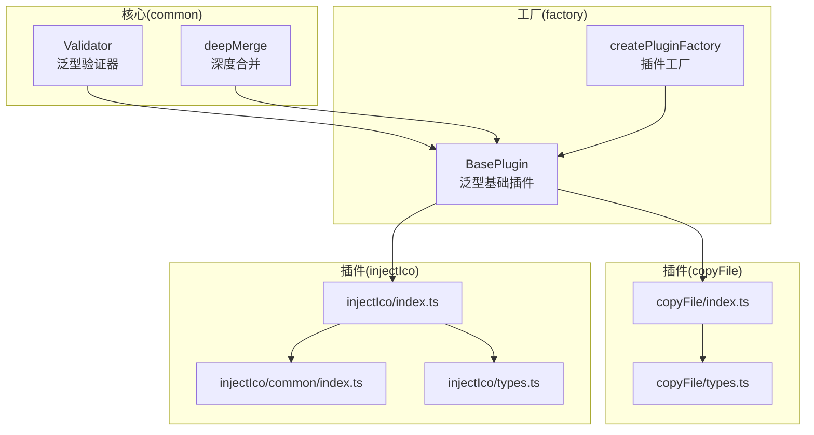
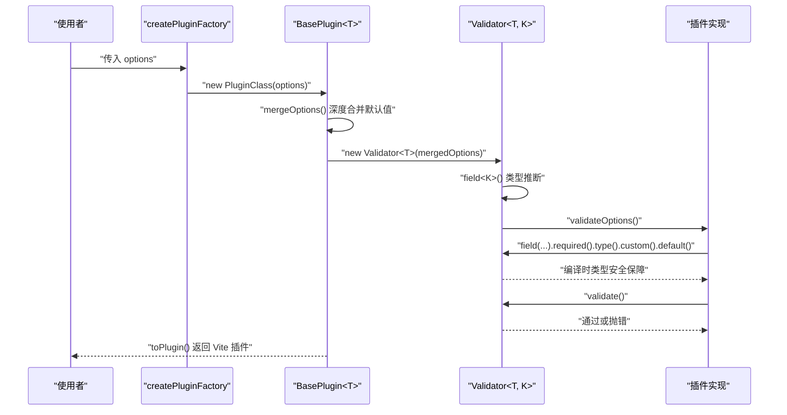
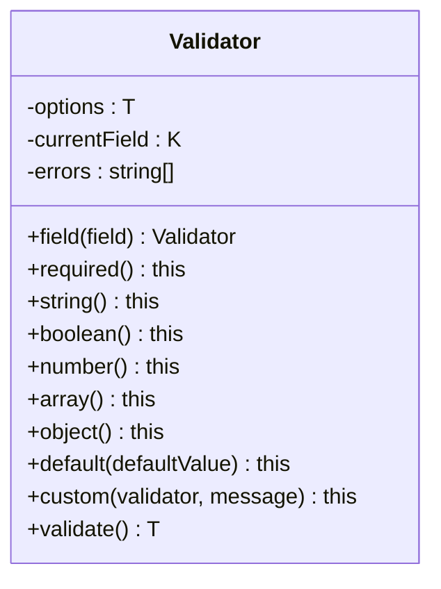
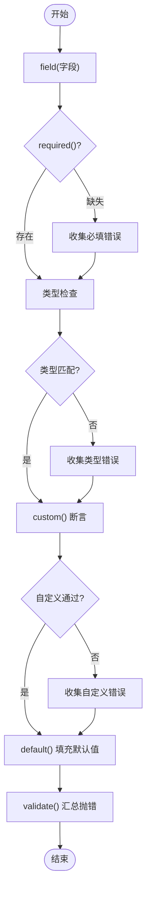
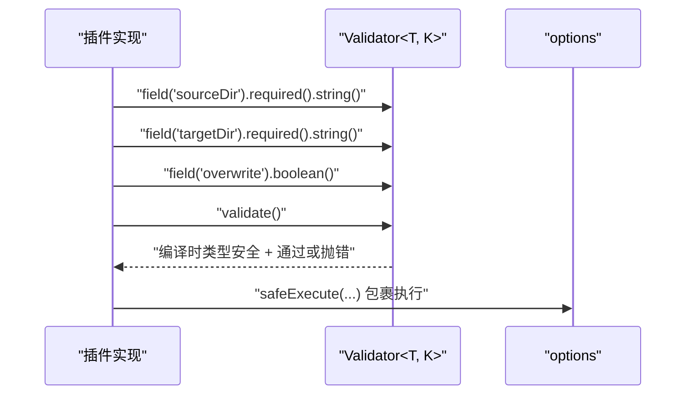
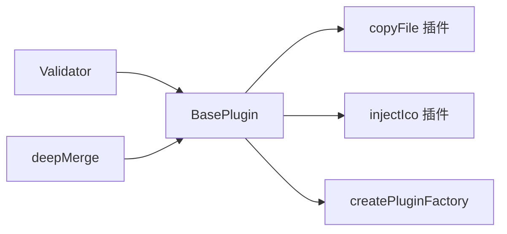

# 验证器工具

<cite>
**本文档引用的文件**
- [validation.ts](file://packages/core/src/common/validation.ts)
- [index.ts（common 导出）](file://packages/core/src/common/index.ts)
- [index.ts（工厂插件入口）](file://packages/core/src/factory/plugin/index.ts)
- [types.ts（工厂插件类型）](file://packages/core/src/factory/plugin/types.ts)
- [index.ts（插件 copyFile）](file://packages/core/src/plugins/copyFile/index.ts)
- [types.ts（插件 copyFile 类型）](file://packages/core/src/plugins/copyFile/types.ts)
- [index.ts（插件 injectIco）](file://packages/core/src/plugins/injectIco/index.ts)
- [common/index.ts（injectIco 工具）](file://packages/core/src/plugins/injectIco/common/index.ts)
- [types.ts（插件 injectIco 类型）](file://packages/core/src/plugins/injectIco/types.ts)
- [index.ts（核心包导出）](file://packages/core/src/index.ts)
- [index.d.ts（发布声明）](file://packages/core/dist/index.d.ts)
- [copyFile.test.ts（测试）](file://packages/test/src/copyFile/copyFile.test.ts)
- [injectIco.test.ts（测试）](file://packages/test/src/injectIco/injectIco.test.ts)
- [object.ts（深度合并）](file://packages/core/src/common/object.ts)
</cite>

## 更新摘要
**所做更改**
- 新增泛型类型约束章节，详细介绍 Validator 类的编译时类型安全增强
- 更新 API 参考，反映泛型参数的类型安全保障
- 增强类型安全性最佳实践指导
- 更新架构图以体现类型推断机制

## 目录
1. [简介](#简介)
2. [项目结构](#项目结构)
3. [核心组件](#核心组件)
4. [架构总览](#架构总览)
5. [详细组件分析](#详细组件分析)
6. [依赖分析](#依赖分析)
7. [性能考虑](#性能考虑)
8. [故障排查指南](#故障排查指南)
9. [结论](#结论)
10. [附录：API 参考](#附录api-参考)

## 简介
本指南聚焦于验证器工具模块 Validator 的设计理念、验证机制与使用方法，涵盖以下主题：
- 验证规则配置与错误处理策略
- 内置验证器能力：数据类型检查、范围验证、格式验证
- 自定义验证器的创建与错误信息定制
- 多验证器组合模式与复杂验证逻辑
- 在插件配置中的应用：必填性检查、默认值设置、类型转换
- **新增** 泛型类型约束与编译时类型安全保障
- 完整 API 参考与最佳实践
- 与工厂与插件体系的集成方式

## 项目结构
验证器工具位于核心包的 common 层，作为插件工厂与具体插件的基础设施，贯穿配置合并、校验与错误处理。



**图表来源**
- [validation.ts](file://packages/core/src/common/validation.ts#L16-L203)
- [index.ts（工厂插件入口）](file://packages/core/src/factory/plugin/index.ts#L27-L387)
- [index.ts（插件 copyFile）](file://packages/core/src/plugins/copyFile/index.ts#L1-L121)
- [types.ts（插件 copyFile 类型）](file://packages/core/src/plugins/copyFile/types.ts#L1-L44)
- [index.ts（插件 injectIco）](file://packages/core/src/plugins/injectIco/index.ts#L1-L169)
- [common/index.ts（injectIco 工具）](file://packages/core/src/plugins/injectIco/common/index.ts#L1-L41)
- [types.ts（插件 injectIco 类型）](file://packages/core/src/plugins/injectIco/types.ts#L1-L113)

**章节来源**
- [index.ts（common 导出）](file://packages/core/src/common/index.ts#L1-L4)
- [index.ts（核心包导出）](file://packages/core/src/index.ts#L1-L8)

## 核心组件
- **Validator<T, K>**：提供编译时类型安全的泛型验证器，支持类型推断和编译时验证
- BasePlugin<T>：泛型插件基类，负责配置合并、日志、错误策略与验证器初始化；子类通过重写 validateOptions 完成业务验证
- createPluginFactory：插件工厂，统一创建流程，支持选项标准化器与实例引用暴露

**章节来源**
- [validation.ts](file://packages/core/src/common/validation.ts#L16-L203)
- [index.ts（工厂插件入口）](file://packages/core/src/factory/plugin/index.ts#L27-L387)

## 架构总览
Validator 作为基础设施，贯穿"配置合并 → 验证 → 执行"的主干流程。BasePlugin 在构造阶段创建 Validator 并调用 validateOptions，随后插件进入生命周期钩子执行阶段。



**图表来源**
- [index.ts（工厂插件入口）](file://packages/core/src/factory/plugin/index.ts#L69-L81)
- [index.ts（工厂插件入口）](file://packages/core/src/factory/plugin/index.ts#L108-L118)
- [validation.ts](file://packages/core/src/common/validation.ts#L195-L201)

## 详细组件分析

### 泛型类型约束与编译时类型安全

**更新** 引入泛型类型约束，提供编译时类型安全保障

Validator 类现在采用泛型设计，通过类型参数确保编译时的类型安全：

- **T extends Record<string, any>**：确保配置对象具有字符串键和任意值
- **K extends keyof T**：限制当前字段必须是配置对象的有效键
- **NextK extends keyof T**：在 field() 方法中保持类型推断的连续性

```mermaid
classDiagram
class Validator~T extends Record~string, any~~K extends keyof T~ {
<<泛型验证器>>
-options : T
-currentField : K
-errors : string[]
+field~NextK~(field : NextK) Validator~T, NextK~
+required() this
+string() this
+boolean() this
+number() this
+array() this
+object() this
+default(defaultValue : T[K]) this
+custom(validator : (value : T[K]) => boolean, message : string) this
+validate() T
}
```

**图表来源**
- [validation.ts](file://packages/core/src/common/validation.ts#L16-L203)

**类型安全特性**：
- 字段访问：`this.options[this.currentField as K]` 确保字段类型正确
- 默认值设置：`defaultValue: T[K]` 保证默认值类型与字段类型一致
- 自定义验证：`(value: T[K]) => boolean` 提供类型安全的验证函数
- 返回类型：`validate()` 返回 `T` 类型，保持配置对象的完整类型信息

**章节来源**
- [validation.ts](file://packages/core/src/common/validation.ts#L16-L203)

### Validator 类设计与机制
- 设计理念
  - 流畅 API：链式调用 field() 指定字段，再叠加 required()/type()/custom()/default() 等规则。
  - **增强** 泛型类型推断：field() 方法返回 `Validator<T, NextK>`，保持类型信息的连续性。
  - 延迟验证：在 validate() 时一次性抛出全部错误，便于一次性修复。
  - 默认值策略：仅在值为 undefined/null 时填充，避免覆盖显式传入的值。
- 验证规则
  - 必填 required()：字段值为 undefined 或 null 视为缺失。
  - 类型检查 string/boolean/number/array/object：仅对非空值进行类型判断。
  - 自定义验证 custom(fn, msg)：对非空值执行自定义断言。
  - 默认值 default(value)：按需填充默认值。
- 错误处理
  - 收集阶段：将错误信息累积到内部数组。
  - 抛错阶段：validate() 若存在错误，抛出包含所有错误的异常；否则返回原配置对象。



**图表来源**
- [validation.ts](file://packages/core/src/common/validation.ts#L16-L203)

**章节来源**
- [validation.ts](file://packages/core/src/common/validation.ts#L16-L203)

### 内置验证器与使用场景
- 数据类型检查
  - string/boolean/number/array/object：对非空值进行严格类型判断，空值跳过。
- 范围与格式验证
  - 通过 custom() 实现：如非空字符串、URL 格式、枚举值等。
- 默认值设置
  - default() 仅在值缺失时填充，保证配置完整性。
- 必填性检查
  - required() 用于强制要求字段存在且非空。

**章节来源**
- [validation.ts](file://packages/core/src/common/validation.ts#L55-L201)

### 自定义验证器与错误信息定制
- 编写规范
  - 自定义函数签名：接收当前字段值，返回布尔值表示通过/失败。
  - **增强** 类型安全保障：验证函数参数类型自动推断为 `T[K]`。
  - 错误信息：通过 custom() 的 message 参数传入，建议明确指出期望与实际值。
- 最佳实践
  - 对空值放行，由 required() 单独处理。
  - 错误信息应包含字段名、期望类型/格式与实际值摘要，便于定位问题。

**章节来源**
- [validation.ts](file://packages/core/src/common/validation.ts#L177-L188)

### 验证器组合模式
- 多规则链式组合：field('x').required().string().custom(v => v.length > 0, "...")。
- 分层验证：先做类型与必填，再做业务域规则。
- 嵌套对象验证：对嵌套对象单独创建 Validator 实例，独立 validate()。



**图表来源**
- [validation.ts](file://packages/core/src/common/validation.ts#L55-L201)

**章节来源**
- [validation.ts](file://packages/core/src/common/validation.ts#L55-L201)

### 在插件配置中的应用
- 必填性检查与默认值
  - BasePlugin 在 mergeOptions() 中合并基础默认值与插件特定默认值；Validator 仅在配置缺失时补充默认值。
- 类型转换与校验
  - 插件类型接口定义字段类型，Validator 进一步确保运行时类型正确。
  - **增强** 编译时类型安全保障，防止类型不匹配的配置通过编译。
- 错误策略
  - BasePlugin 的 errorStrategy 控制执行期错误处理（抛出/记录/忽略），与 Validator 的配置错误形成互补。



**图表来源**
- [index.ts（插件 copyFile）](file://packages/core/src/plugins/copyFile/index.ts#L22-L40)
- [index.ts（工厂插件入口）](file://packages/core/src/factory/plugin/index.ts#L254-L312)

**章节来源**
- [index.ts（插件 copyFile）](file://packages/core/src/plugins/copyFile/index.ts#L14-L40)
- [index.ts（插件 injectIco）](file://packages/core/src/plugins/injectIco/index.ts#L21-L33)
- [index.ts（工厂插件入口）](file://packages/core/src/factory/plugin/index.ts#L108-L118)

### 与工厂与插件体系的集成
- BasePlugin<T>
  - 构造阶段：创建 Validator<T>，调用 validateOptions，随后进入生命周期。
  - 错误处理：统一通过 handleError() 应用 errorStrategy。
- createPluginFactory
  - 支持选项标准化器，兼容字符串或对象输入；最终将实例引用挂载到返回的 Vite 插件对象上，便于调试与扩展。

**章节来源**
- [index.ts（工厂插件入口）](file://packages/core/src/factory/plugin/index.ts#L69-L81)
- [index.ts（工厂插件入口）](file://packages/core/src/factory/plugin/index.ts#L284-L312)
- [index.ts（工厂插件入口）](file://packages/core/src/factory/plugin/index.ts#L370-L387)

## 依赖分析
- 组件耦合
  - BasePlugin<T> 依赖 Validator<T> 与 deepMerge；Validator 与业务插件解耦，仅依赖传入的配置对象。
  - 插件实现通过重写 validateOptions 与 Validator 交互，保持高内聚低耦合。
- 外部依赖
  - Vite 插件生态：通过 toPlugin() 输出标准插件对象。
  - Logger：统一错误日志输出，配合 errorStrategy 控制行为。



**图表来源**
- [validation.ts](file://packages/core/src/common/validation.ts#L16-L203)
- [index.ts（工厂插件入口）](file://packages/core/src/factory/plugin/index.ts#L27-L387)
- [object.ts](file://packages/core/src/common/object.ts#L8-L29)

**章节来源**
- [object.ts](file://packages/core/src/common/object.ts#L8-L29)
- [index.ts（工厂插件入口）](file://packages/core/src/factory/plugin/index.ts#L27-L387)

## 性能考虑
- 验证成本低：Validator 采用轻量的类型判断与字符串拼接，开销极小。
- 延迟抛错：validate() 一次性汇总错误，减少多次异常开销。
- 默认值填充：仅在值缺失时填充，避免不必要的写入。
- **增强** 泛型类型检查在编译时完成，运行时零开销。
- 建议
  - 将昂贵的业务校验放在插件执行阶段，验证器专注于结构与类型。
  - 对大对象嵌套验证，拆分为多个 Validator 实例，提升可维护性。

## 故障排查指南
- 常见错误
  - 未先 field() 指定字段即调用其他规则：Validator 抛出明确提示。
  - **新增** 泛型类型错误：编译时报错，提示字段类型不匹配或无效字段名。
  - 配置验证失败：validate() 抛出包含所有错误信息的异常，逐条修正。
  - 执行期错误：根据 errorStrategy 决定抛出、记录或忽略。
- 排查步骤
  - 检查必填字段是否传入且非空。
  - 核对类型是否与预期一致（空值跳过类型检查）。
  - **新增** 使用 TypeScript 编译器检查泛型类型错误。
  - 使用自定义规则时，确认 message 能准确反映期望与实际。
  - 结合插件日志定位执行阶段问题。

**章节来源**
- [validation.ts](file://packages/core/src/common/validation.ts#L56-L58)
- [validation.ts](file://packages/core/src/common/validation.ts#L196-L198)
- [index.ts（工厂插件入口）](file://packages/core/src/factory/plugin/index.ts#L284-L312)

## 结论
Validator 以简洁的链式 API 提供了强健的配置验证能力，结合 BasePlugin 的默认值合并与错误策略，形成了从"配置到执行"的闭环保障。**最新版本增强了泛型类型约束，提供编译时类型安全保障，进一步提升了开发体验和代码质量**。通过内置类型检查、自定义规则与默认值填充，开发者可以快速构建可靠、易维护的插件配置体系。

## 附录：API 参考

### 类：Validator<T, K>
**更新** 增强泛型类型约束

- **构造函数**
  - 参数：options: T
  - 作用：保存待验证的配置对象，保持类型安全
- **方法**
  - field<NextK extends keyof T>(field: NextK): Validator<T, NextK>
    - 作用：指定当前要验证的字段，保持类型推断连续性
    - 注意：必须先调用 field() 再调用其他规则
  - required(): this
    - 作用：标记字段为必填；值为 undefined 或 null 时记录错误
  - string(): this
    - 作用：要求字段为字符串类型；非空值才检查
  - boolean(): this
    - 作用：要求字段为布尔类型；非空值才检查
  - number(): this
    - 作用：要求字段为数字类型；非空值才检查
  - array(): this
    - 作用：要求字段为数组类型；非空值才检查
  - object(): this
    - 作用：要求字段为对象类型（排除数组）；非空值才检查
  - default(defaultValue: T[K]): this
    - 作用：若字段值为 undefined 或 null，则填充默认值
    - **增强** 默认值类型自动推断为字段类型 T[K]
  - custom(validator: (value: T[K]) => boolean, message: string): this
    - 作用：对非空值执行自定义断言；失败时记录 message
    - **增强** 验证函数参数类型自动推断为 T[K]
  - validate(): T
    - 作用：若存在任何错误则抛出异常，否则返回配置对象
    - **增强** 返回类型保持原始配置对象的完整类型信息

### 类：BasePlugin<T extends BasePluginOptions>
- **构造函数**
  - 参数：options: T, loggerConfig?: LoggerOptions | Logger
  - 作用：合并默认值、初始化日志与验证器，并执行 validateOptions()
- **方法**
  - mergeOptions(options: T): Required<T>
    - 作用：与基础默认值、插件特定默认值进行深度合并
  - validateOptions(): void
    - 作用：子类可重写以实现业务验证；默认为空实现
  - handleError(error, context): T | undefined
    - 作用：根据 errorStrategy 决定抛出、记录或忽略错误
  - toPlugin(): Plugin
    - 作用：输出标准 Vite 插件对象

### 工厂：createPluginFactory<T, P, R>
- 参数：PluginClass, normalizer?
- 返回：PluginFactory<T, R>
- 作用：创建插件工厂，支持选项标准化器与实例引用挂载

### 插件类型（节选）
- CopyFileOptions：包含 sourceDir、targetDir、overwrite、recursive、incremental 等
- InjectIcoOptions：包含 base、url、link、icons、copyOptions 等

**章节来源**
- [validation.ts](file://packages/core/src/common/validation.ts#L16-L203)
- [index.ts（工厂插件入口）](file://packages/core/src/factory/plugin/index.ts#L27-L387)
- [types.ts（工厂插件类型）](file://packages/core/src/factory/plugin/types.ts#L8-L46)
- [types.ts（插件 copyFile 类型）](file://packages/core/src/plugins/copyFile/types.ts#L8-L44)
- [types.ts（插件 injectIco 类型）](file://packages/core/src/plugins/injectIco/types.ts#L70-L113)
- [index.d.ts（发布声明）](file://packages/core/dist/index.d.ts#L92-L280)

## 实际使用示例与最佳实践

### 示例一：基础链式验证（copyFile）
- **步骤**
  - 指定字段：field('sourceDir').field('targetDir')
  - 必填与类型：required().string()
  - 自定义格式：custom(v => v.trim() !== '', "不能为空字符串")
  - 可选布尔：field('overwrite').boolean()
  - 执行验证：validate()
- **参考位置**
  - [index.ts（插件 copyFile）](file://packages/core/src/plugins/copyFile/index.ts#L22-L40)

### 示例二：嵌套对象验证（injectIco）
- **步骤**
  - 主体验证：field('base').string().field('url').string().field('link').string().field('icons').array()
  - 可选对象分支：当 copyOptions 存在时，创建新 Validator 对其进行独立验证
  - 执行验证：validate()
- **参考位置**
  - [index.ts（插件 injectIco）](file://packages/core/src/plugins/injectIco/index.ts#L21-L33)

### 示例三：默认值与类型约束
- **步骤**
  - 在 getDefaultOptions() 提供插件默认值
  - 在构造阶段由 mergeOptions() 合并
  - 在 validateOptions() 中通过 default() 仅在缺失时填充
- **参考位置**
  - [index.ts（工厂插件入口）](file://packages/core/src/factory/plugin/index.ts#L108-L118)
  - [index.ts（插件 copyFile）](file://packages/core/src/plugins/copyFile/index.ts#L14-L20)

### 示例四：错误策略与日志
- **步骤**
  - 通过 errorStrategy 控制抛出/记录/忽略
  - 使用 Logger 输出错误上下文
- **参考位置**
  - [index.ts（工厂插件入口）](file://packages/core/src/factory/plugin/index.ts#L284-L312)

### **新增** 示例五：泛型类型安全验证
- **步骤**
  - 使用泛型验证器确保字段类型正确
  - 编译时检查字段名有效性
  - 自动推断验证函数参数类型
- **参考位置**
  - [validation.ts](file://packages/core/src/common/validation.ts#L45-L49)

### 最佳实践
- 先 required() 再类型检查，最后 custom()。
- 自定义规则尽量幂等、可读性强，message 明确。
- 对大对象拆分验证，提升可维护性。
- 利用默认值与类型接口双重保障，减少运行时异常。
- **新增** 充分利用泛型类型推断，获得更好的开发体验和编译时安全保障。

**章节来源**
- [index.ts（插件 copyFile）](file://packages/core/src/plugins/copyFile/index.ts#L22-L40)
- [index.ts（插件 injectIco）](file://packages/core/src/plugins/injectIco/index.ts#L21-L33)
- [index.ts（工厂插件入口）](file://packages/core/src/factory/plugin/index.ts#L108-L118)
- [index.ts（工厂插件入口）](file://packages/core/src/factory/plugin/index.ts#L284-L312)
- [validation.ts](file://packages/core/src/common/validation.ts#L45-L49)