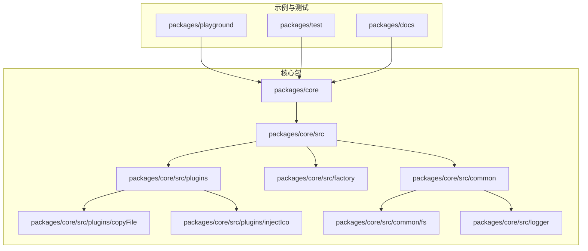
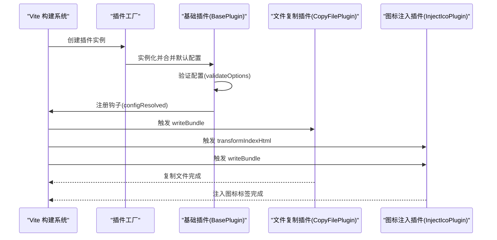
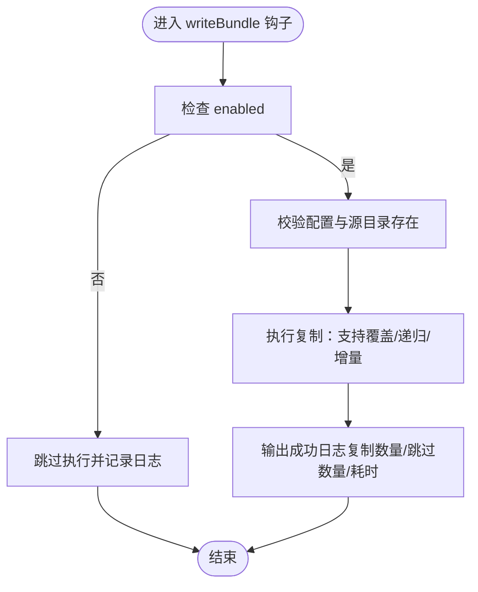
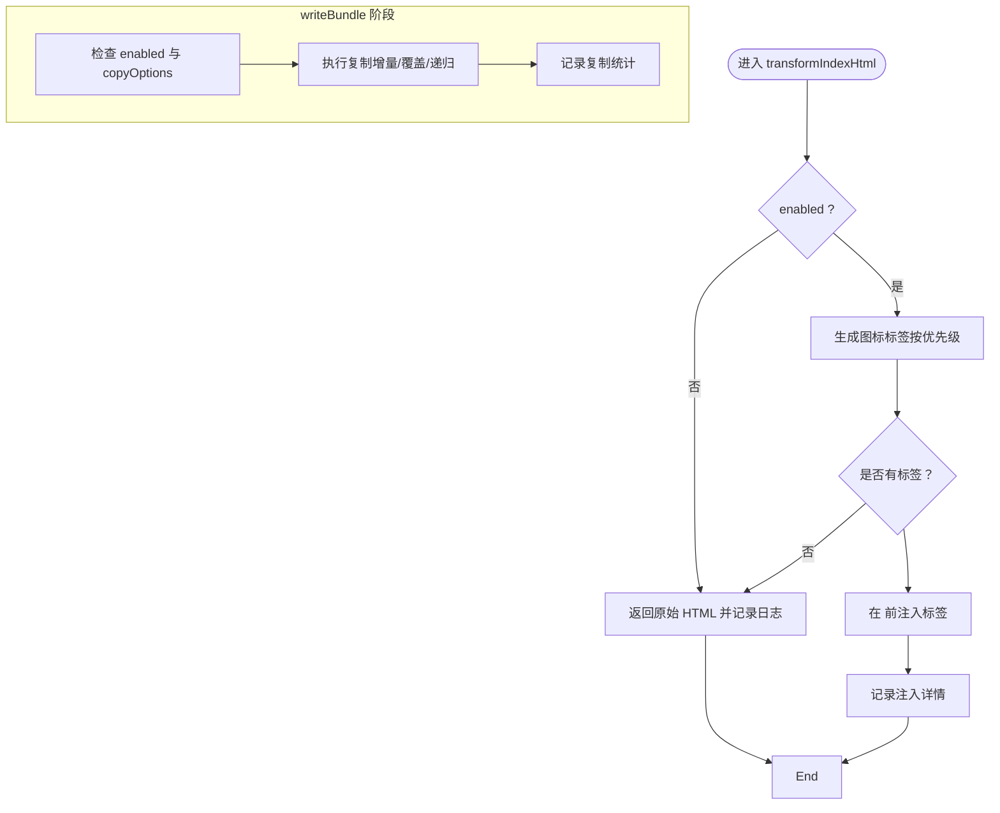
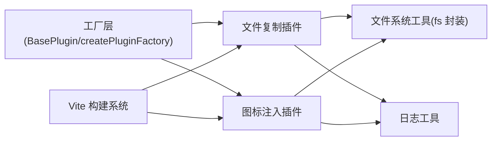

# 快速开始

<cite>
**本文引用的文件**
- [packages/core/package.json](file://packages/core/package.json)
- [packages/core/src/plugins/copyFile/index.ts](file://packages/core/src/plugins/copyFile/index.ts)
- [packages/core/src/plugins/injectIco/index.ts](file://packages/core/src/plugins/injectIco/index.ts)
- [packages/core/src/plugins/copyFile/types.ts](file://packages/core/src/plugins/copyFile/types.ts)
- [packages/core/src/plugins/injectIco/types.ts](file://packages/core/src/plugins/injectIco/types.ts)
- [packages/core/src/factory/plugin/index.ts](file://packages/core/src/factory/plugin/index.ts)
- [packages/core/src/common/fs/index.ts](file://packages/core/src/common/fs/index.ts)
- [packages/core/src/logger/index.ts](file://packages/core/src/logger/index.ts)
- [packages/playground/vite.config.ts](file://packages/playground/vite.config.ts)
- [packages/test/vite.config.ts](file://packages/test/vite.config.ts)
- [packages/docs/src/en/installation.md](file://packages/docs/src/en/installation.md)
- [packages/docs/src/plugins/copy-file.md](file://packages/docs/src/plugins/copy-file.md)
- [packages/docs/src/plugins/inject-ico.md](file://packages/docs/src/plugins/inject-ico.md)
- [packages/playground/package.json](file://packages/playground/package.json)
- [packages/test/src/copyFile/copyFile.test.ts](file://packages/test/src/copyFile/copyFile.test.ts)
</cite>

## 目录
1. [简介](#简介)
2. [项目结构](#项目结构)
3. [核心组件](#核心组件)
4. [架构总览](#架构总览)
5. [详细组件分析](#详细组件分析)
6. [依赖分析](#依赖分析)
7. [性能考虑](#性能考虑)
8. [故障排除指南](#故障排除指南)
9. [结论](#结论)
10. [附录](#附录)

## 简介
本指南面向 Vite 新手，帮助你在最短时间内完成 @meng-xi/vite-plugin 的安装与基础使用。你将学会：
- 使用 npm、yarn、pnpm 三种包管理器安装插件工具包
- 在 vite.config.ts 中注册并配置两个核心插件：文件复制插件与图标注入插件
- 通过最小化示例验证安装成功
- 快速定位常见问题（如插件未生效、配置错误等）

## 项目结构
该仓库采用多包工作区结构，核心插件位于 packages/core，配套文档与示例位于 packages/docs 与 packages/playground。

图表来源
- [packages/core/package.json](file://packages/core/package.json#L1-L55)
- [packages/playground/package.json](file://packages/playground/package.json#L1-L20)

章节来源
- [packages/core/package.json](file://packages/core/package.json#L1-L55)
- [packages/playground/package.json](file://packages/playground/package.json#L1-L20)

## 核心组件
- 工厂与基础插件：统一的插件开发框架，提供生命周期、日志、错误处理与默认配置合并。
- 文件复制插件：在构建完成后复制文件/目录，支持覆盖、递归与增量复制。
- 图标注入插件：在 HTML 中注入图标链接，并可选地复制图标文件到目标目录。

章节来源
- [packages/core/src/factory/plugin/index.ts](file://packages/core/src/factory/plugin/index.ts#L27-L337)
- [packages/core/src/plugins/copyFile/index.ts](file://packages/core/src/plugins/copyFile/index.ts#L13-L115)
- [packages/core/src/plugins/injectIco/index.ts](file://packages/core/src/plugins/injectIco/index.ts#L14-L177)

## 架构总览
下面的序列图展示了 Vite 在构建流程中如何调用插件钩子，以及两个核心插件的典型执行路径。

图表来源
- [packages/core/src/factory/plugin/index.ts](file://packages/core/src/factory/plugin/index.ts#L320-L336)
- [packages/core/src/plugins/copyFile/index.ts](file://packages/core/src/plugins/copyFile/index.ts#L77-L81)
- [packages/core/src/plugins/injectIco/index.ts](file://packages/core/src/plugins/injectIco/index.ts#L130-L138)

## 详细组件分析

### 安装与初始化
- 支持 npm、yarn、pnpm 三种包管理器安装，安装命令请参考官方文档页面。
- 安装后在你的 Vite 项目中引入插件命名空间，然后在 vite.config.ts 的 plugins 数组中注册插件。

章节来源
- [packages/docs/src/en/installation.md](file://packages/docs/src/en/installation.md#L1-L30)
- [packages/core/package.json](file://packages/core/package.json#L32-L37)

### 文件复制插件（copyFile）
- 作用：在构建完成后复制文件或目录到指定位置，支持覆盖、递归与增量复制。
- 执行时机：enforce: 'post'，确保其他构建任务完成后才执行。
- 基本配置要点：sourceDir、targetDir 为必填；overwrite、recursive、incremental 为常用开关；enabled 控制是否启用；verbose 控制日志输出；errorStrategy 控制错误处理策略。

图表来源
- [packages/core/src/plugins/copyFile/index.ts](file://packages/core/src/plugins/copyFile/index.ts#L53-L75)
- [packages/core/src/common/fs/index.ts](file://packages/core/src/common/fs/index.ts#L98-L202)

章节来源
- [packages/core/src/plugins/copyFile/index.ts](file://packages/core/src/plugins/copyFile/index.ts#L13-L115)
- [packages/core/src/plugins/copyFile/types.ts](file://packages/core/src/plugins/copyFile/types.ts#L8-L43)
- [packages/docs/src/plugins/copy-file.md](file://packages/docs/src/plugins/copy-file.md#L1-L159)

### 图标注入插件（injectIco）
- 作用：在 HTML 入口文件的 <head> 中注入图标链接；可选复制图标文件到目标目录。
- 执行时机：transformIndexHtml 注入图标标签；writeBundle 复制图标文件。
- 配置优先级：link > url > icons > base + favicon.ico；当提供 copyOptions 时，会复制图标文件，默认启用增量复制。

图表来源
- [packages/core/src/plugins/injectIco/index.ts](file://packages/core/src/plugins/injectIco/index.ts#L55-L89)
- [packages/core/src/plugins/injectIco/index.ts](file://packages/core/src/plugins/injectIco/index.ts#L101-L128)
- [packages/core/src/common/fs/index.ts](file://packages/core/src/common/fs/index.ts#L98-L202)

章节来源
- [packages/core/src/plugins/injectIco/index.ts](file://packages/core/src/plugins/injectIco/index.ts#L14-L177)
- [packages/core/src/plugins/injectIco/types.ts](file://packages/core/src/plugins/injectIco/types.ts#L70-L112)
- [packages/docs/src/plugins/inject-ico.md](file://packages/docs/src/plugins/inject-ico.md#L1-L258)

### 在 vite.config.ts 中注册插件
- 在你的 Vite 项目中，先安装 @meng-xi/vite-plugin，再在 vite.config.ts 中导入命名空间，将插件加入 plugins 数组。
- playground 与 test 包中均提供了完整的注册示例，可作为参考模板。

章节来源
- [packages/playground/vite.config.ts](file://packages/playground/vite.config.ts#L1-L68)
- [packages/test/vite.config.ts](file://packages/test/vite.config.ts#L10-L34)

## 依赖分析
- 依赖关系：插件实现依赖于工厂层（BasePlugin 与 createPluginFactory）、通用文件系统工具（fs 封装）与日志工具。
- 运行时依赖：vite 与 peerDependencies 约束要求 Vite 版本。

图表来源
- [packages/core/src/factory/plugin/index.ts](file://packages/core/src/factory/plugin/index.ts#L371-L383)
- [packages/core/src/plugins/copyFile/index.ts](file://packages/core/src/plugins/copyFile/index.ts#L1-L5)
- [packages/core/src/plugins/injectIco/index.ts](file://packages/core/src/plugins/injectIco/index.ts#L1-L5)
- [packages/core/src/common/fs/index.ts](file://packages/core/src/common/fs/index.ts#L1-L3)
- [packages/core/src/logger/index.ts](file://packages/core/src/logger/index.ts#L1-L131)

章节来源
- [packages/core/package.json](file://packages/core/package.json#L32-L37)

## 性能考虑
- 增量复制：两个插件均支持增量复制（默认启用），仅复制变更文件，显著降低重复构建时间。
- 执行时机：文件复制插件使用 enforce: 'post'，避免阻塞其他构建任务。
- 日志与开销：verbose=true 会输出详细日志，适合调试；生产构建建议关闭以减少输出开销。

章节来源
- [packages/core/src/plugins/copyFile/index.ts](file://packages/core/src/plugins/copyFile/index.ts#L25-L34)
- [packages/core/src/plugins/injectIco/index.ts](file://packages/core/src/plugins/injectIco/index.ts#L120-L127)
- [packages/docs/src/plugins/copy-file.md](file://packages/docs/src/plugins/copy-file.md#L145-L150)
- [packages/docs/src/plugins/inject-ico.md](file://packages/docs/src/plugins/inject-ico.md#L243-L251)

## 故障排除指南
- 插件未生效
  - 检查是否正确在 vite.config.ts 中注册插件，并确认 enabled 为 true。
  - 确认插件名称与执行钩子是否被 Vite 调用（参考 writeBundle/transformIndexHtml）。
- 配置错误
  - copyFile：确保 sourceDir 与 targetDir 为非空字符串且存在；必要时开启 verbose 查看日志。
  - injectIco：若提供 copyOptions，请补齐 sourceDir 与 targetDir；注意配置优先级（link > url > icons > base）。
- 权限与路径问题
  - 若提示“源文件不存在”或“权限不足”，请检查路径拼写与文件系统权限。
- 错误处理策略
  - 根据 errorStrategy 设置选择抛错、记录日志或忽略错误，便于在开发/生产环境间切换。

章节来源
- [packages/core/src/plugins/copyFile/index.ts](file://packages/core/src/plugins/copyFile/index.ts#L14-L35)
- [packages/core/src/plugins/injectIco/index.ts](file://packages/core/src/plugins/injectIco/index.ts#L28-L40)
- [packages/core/src/common/fs/index.ts](file://packages/core/src/common/fs/index.ts#L10-L23)
- [packages/core/src/factory/plugin/index.ts](file://packages/core/src/factory/plugin/index.ts#L272-L300)

## 结论
通过本指南，你已掌握：
- 使用 npm/yarn/pnpm 安装 @meng-xi/vite-plugin
- 在 vite.config.ts 中注册并配置文件复制与图标注入插件
- 通过最小示例验证安装成功
- 快速定位常见问题并进行修复

建议在实际项目中结合 verbose 与 errorStrategy 进行调试与生产部署的平衡。

## 附录

### 快速验证清单
- 安装命令已执行且无报错
- vite.config.ts 中已注册插件并保存
- 运行 dev/build 命令，观察控制台日志
- 对照示例配置核对关键字段（如 sourceDir/targetDir/base 等）

章节来源
- [packages/docs/src/en/installation.md](file://packages/docs/src/en/installation.md#L1-L30)
- [packages/playground/vite.config.ts](file://packages/playground/vite.config.ts#L11-L68)
- [packages/test/vite.config.ts](file://packages/test/vite.config.ts#L10-L34)