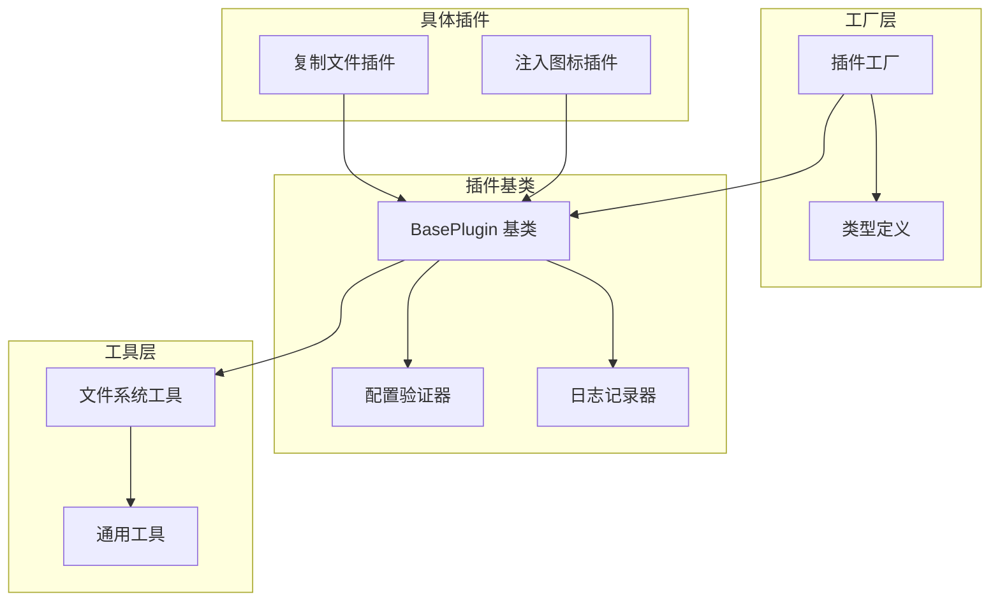
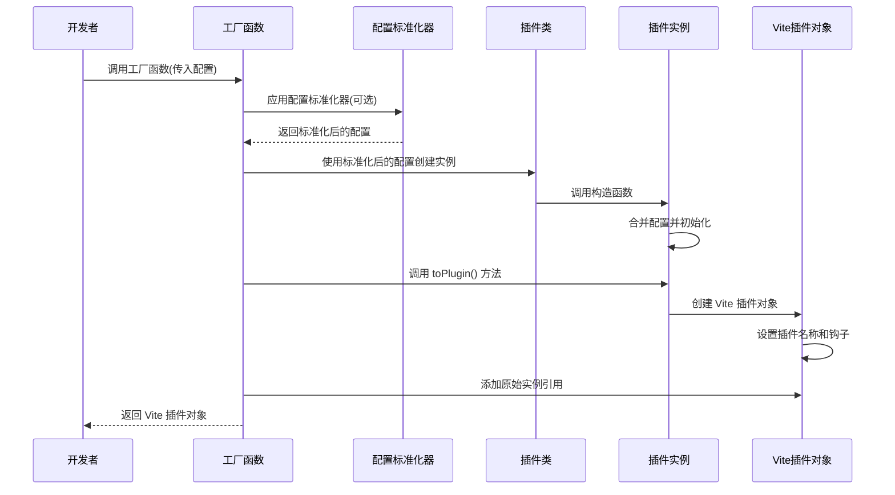
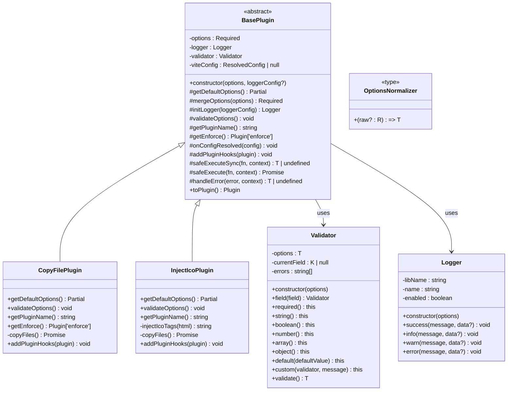
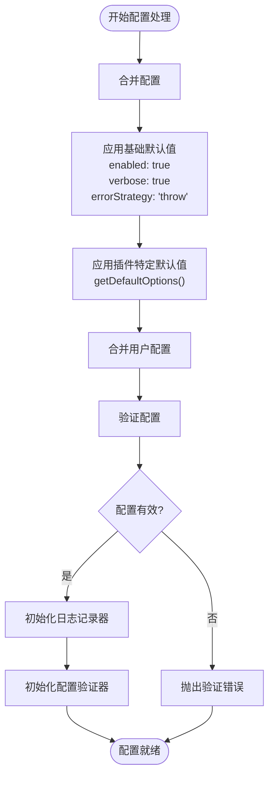
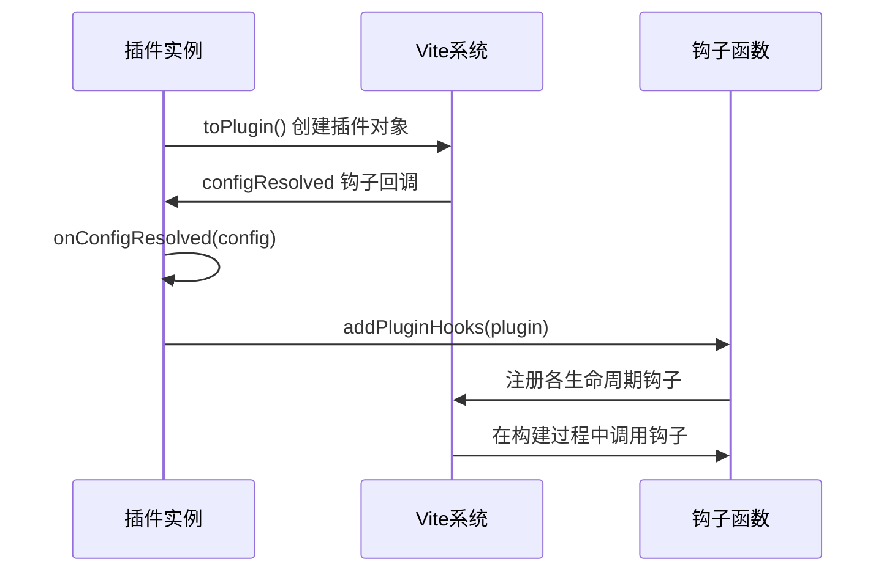
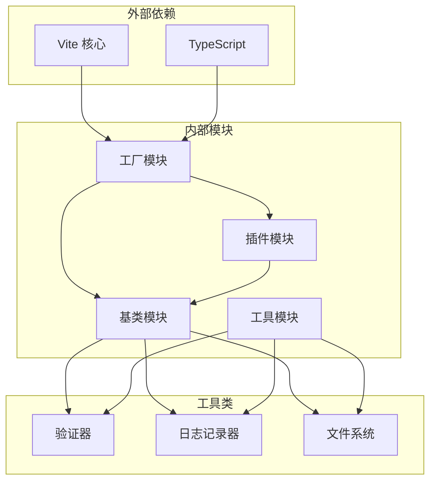

# 插件工厂系统

<cite>
**本文档引用的文件**
- [packages/core/src/factory/plugin/index.ts](file://packages/core/src/factory/plugin/index.ts)
- [packages/core/src/factory/plugin/types.ts](file://packages/core/src/factory/plugin/types.ts)
- [packages/core/src/factory/index.ts](file://packages/core/src/factory/index.ts)
- [packages/core/src/factory/types.ts](file://packages/core/src/factory/types.ts)
- [packages/core/src/plugins/copyFile/index.ts](file://packages/core/src/plugins/copyFile/index.ts)
- [packages/core/src/plugins/copyFile/types.ts](file://packages/core/src/plugins/copyFile/types.ts)
- [packages/core/src/plugins/injectIco/index.ts](file://packages/core/src/plugins/injectIco/index.ts)
- [packages/core/src/plugins/injectIco/types.ts](file://packages/core/src/plugins/injectIco/types.ts)
- [packages/core/src/common/validation.ts](file://packages/core/src/common/validation.ts)
- [packages/core/src/logger/index.ts](file://packages/core/src/logger/index.ts)
- [packages/playground/vite.config.ts](file://packages/playground/vite.config.ts)
- [packages/test/src/copyFile/copyFile.test.ts](file://packages/test/src/copyFile/copyFile.test.ts)
- [packages/test/src/injectIco/injectIco.test.ts](file://packages/test/src/injectIco/injectIco.test.ts)
</cite>

## 更新摘要
**变更内容**
- 新增 OptionsNormalizer 类型定义，支持灵活的配置输入标准化
- getDefaultOptions() 抽象方法成为必需实现，提供插件特定的默认配置
- 增强 createPluginFactory 函数，支持可选的配置标准化器
- 更新插件基类的配置管理机制，采用 getDefaultOptions() 方法
- 完善插件工厂的类型安全保证和最佳实践

## 目录
1. [简介](#简介)
2. [项目结构](#项目结构)
3. [核心组件](#核心组件)
4. [架构概览](#架构概览)
5. [详细组件分析](#详细组件分析)
6. [依赖分析](#依赖分析)
7. [性能考虑](#性能考虑)
8. [故障排除指南](#故障排除指南)
9. [结论](#结论)
10. [附录](#附录)

## 简介

插件工厂系统是一个基于 TypeScript 的 Vite 插件开发框架，提供了统一的插件开发模式和类型安全保证。该系统通过工厂模式简化了 Vite 插件的创建过程，使开发者能够专注于业务逻辑的实现，而无需关心底层的插件包装细节。

系统的核心特性包括：
- **泛型参数的类型约束和插件类的继承要求**
- **统一的插件生命周期管理和错误处理机制**
- **可选的配置标准化器，支持灵活的配置输入**
- **完整的类型安全保证和编译时检查**
- **内置的日志记录和配置验证功能**

**更新** 新增了 OptionsNormalizer 类型和 getDefaultOptions() 抽象方法，提供了更灵活的配置管理机制。

## 项目结构

插件工厂系统采用模块化设计，主要分为以下几个核心模块：



**图表来源**
- [packages/core/src/factory/plugin/index.ts](file://packages/core/src/factory/plugin/index.ts#L1-L386)
- [packages/core/src/plugins/copyFile/index.ts](file://packages/core/src/plugins/copyFile/index.ts#L1-L121)
- [packages/core/src/plugins/injectIco/index.ts](file://packages/core/src/plugins/injectIco/index.ts#L1-L169)

**章节来源**
- [packages/core/src/factory/index.ts](file://packages/core/src/factory/index.ts#L1-L2)
- [packages/core/src/factory/types.ts](file://packages/core/src/factory/types.ts#L1-L2)

## 核心组件

### createPluginFactory 函数

`createPluginFactory` 是整个插件工厂系统的核心函数，负责创建插件工厂函数。其工作原理如下：



**图表来源**
- [packages/core/src/factory/plugin/index.ts](file://packages/core/src/factory/plugin/index.ts#L369-L385)

**更新** 增强了配置处理流程，现在支持可选的配置标准化器，使得插件工厂能够处理更灵活的配置输入。

### BasePlugin 抽象类

`BasePlugin` 是所有插件的基类，提供了统一的插件开发框架：

**关键特性：**
- **配置管理**：自动合并基础配置和插件特定配置
- **生命周期管理**：提供标准的 Vite 插件生命周期钩子
- **错误处理**：内置统一的错误处理策略
- **日志记录**：集成日志记录功能
- **配置验证**：提供流畅的配置验证 API

**更新** getDefaultOptions() 方法现在是必需的抽象方法，子类必须实现以提供插件特定的默认配置。

**章节来源**
- [packages/core/src/factory/plugin/index.ts](file://packages/core/src/factory/plugin/index.ts#L27-L349)

## 架构概览

插件工厂系统采用分层架构设计，确保了良好的可扩展性和维护性：



**图表来源**
- [packages/core/src/factory/plugin/index.ts](file://packages/core/src/factory/plugin/index.ts#L27-L349)
- [packages/core/src/plugins/copyFile/index.ts](file://packages/core/src/plugins/copyFile/index.ts#L13-L87)
- [packages/core/src/plugins/injectIco/index.ts](file://packages/core/src/plugins/injectIco/index.ts#L14-L132)
- [packages/core/src/common/validation.ts](file://packages/core/src/common/validation.ts#L16-L202)
- [packages/core/src/logger/index.ts](file://packages/core/src/logger/index.ts#L6-L131)

## 详细组件分析

### createPluginFactory 函数详解

#### 函数签名和类型约束

`createPluginFactory` 函数具有以下泛型参数：

- `T extends BasePluginOptions`: 插件配置类型，必须继承自 `BasePluginOptions`
- `P extends BasePlugin<T>`: 插件实例类型，必须继承自 `BasePlugin<T>`
- `R = T`: 原始配置类型，默认与 T 相同

**更新** 新增了可选的 `OptionsNormalizer<T, R>` 参数，支持将原始配置类型 `R` 转换为目标配置类型 `T`。

#### 创建过程步骤

1. **配置标准化**：应用可选的标准化器处理原始配置
2. **实例创建**：使用标准化后的配置创建插件实例
3. **Vite 转换**：调用 `toPlugin()` 方法将实例转换为 Vite 插件对象
4. **引用添加**：在 Vite 插件对象上添加对原始插件实例的引用

#### 使用示例

**基本工厂创建：**
```typescript
// 复制文件插件工厂
const copyFile = createPluginFactory(CopyFilePlugin)
```

**带标准化器的工厂：**
```typescript
// 注入图标插件工厂（支持字符串或对象配置）
const injectIco = createPluginFactory(
  InjectIcoPlugin,
  (options) => typeof options === 'string' 
    ? { base: options } 
    : options
)
```

**章节来源**
- [packages/core/src/factory/plugin/index.ts](file://packages/core/src/factory/plugin/index.ts#L369-L385)

### BasePlugin 类分析

#### 配置管理系统

BasePlugin 提供了完整的配置管理功能：



**图表来源**
- [packages/core/src/factory/plugin/index.ts](file://packages/core/src/factory/plugin/index.ts#L108-L118)
- [packages/core/src/factory/plugin/index.ts](file://packages/core/src/factory/plugin/index.ts#L162-L162)

**更新** getDefaultOptions() 方法现在是必需的，子类必须实现以提供插件特定的默认配置。

#### 生命周期钩子管理

BasePlugin 将 Vite 插件生命周期钩子的注册委托给子类：



**图表来源**
- [packages/core/src/factory/plugin/index.ts](file://packages/core/src/factory/plugin/index.ts#L332-L348)

**章节来源**
- [packages/core/src/factory/plugin/index.ts](file://packages/core/src/factory/plugin/index.ts#L27-L349)

### 具体插件实现

#### 复制文件插件 (CopyFilePlugin)

CopyFilePlugin 展示了如何实现一个简单的文件操作插件：

**关键实现特点：**
- **默认配置**：启用覆盖、递归和增量复制
- **执行时机**：在构建完成后执行 (`enforce: 'post'`)
- **错误处理**：使用 `safeExecute` 包装异步操作
- **日志记录**：详细记录复制结果

**使用示例：**
```typescript
// 基本使用
copyFile({
  sourceDir: 'src/assets',
  targetDir: 'dist/assets'
})

// 高级配置
copyFile({
  sourceDir: 'src/static',
  targetDir: 'dist/static',
  overwrite: false,
  recursive: true,
  incremental: true,
  enabled: true,
  verbose: true,
  errorStrategy: 'throw'
})
```

**章节来源**
- [packages/core/src/plugins/copyFile/index.ts](file://packages/core/src/plugins/copyFile/index.ts#L13-L121)
- [packages/core/src/plugins/copyFile/types.ts](file://packages/core/src/plugins/copyFile/types.ts#L8-L44)

#### 注入图标插件 (InjectIcoPlugin)

InjectIcoPlugin 展示了更复杂的插件实现：

**核心功能：**
- **HTML 转换**：在构建过程中修改 HTML 文件
- **文件复制**：可选的图标文件复制功能
- **配置验证**：支持嵌套配置的复杂验证
- **条件执行**：根据配置动态决定执行路径

**使用示例：**
```typescript
// 基本使用
injectIco()

// 字符串配置（视为 base 路径）
injectIco('/assets')

// 完整配置
injectIco({
  base: '/assets',
  icons: [
    { rel: 'icon', href: '/favicon.svg', type: 'image/svg+xml' },
    { rel: 'icon', href: '/favicon-32x32.png', sizes: '32x32', type: 'image/png' }
  ],
  copyOptions: {
    sourceDir: 'src/assets/icons',
    targetDir: 'dist/assets/icons'
  }
})
```

**更新** 注入图标插件现在使用 OptionsNormalizer 类型，支持字符串或对象两种配置方式。

**章节来源**
- [packages/core/src/plugins/injectIco/index.ts](file://packages/core/src/plugins/injectIco/index.ts#L14-L169)
- [packages/core/src/plugins/injectIco/types.ts](file://packages/core/src/plugins/injectIco/types.ts#L70-L113)

## 依赖分析

插件工厂系统的依赖关系清晰且层次分明：



**图表来源**
- [packages/core/src/factory/plugin/index.ts](file://packages/core/src/factory/plugin/index.ts#L1-L6)
- [packages/core/src/plugins/copyFile/index.ts](file://packages/core/src/plugins/copyFile/index.ts#L1-L5)
- [packages/core/src/plugins/injectIco/index.ts](file://packages/core/src/plugins/injectIco/index.ts#L1-L6)

**章节来源**
- [packages/core/src/factory/plugin/index.ts](file://packages/core/src/factory/plugin/index.ts#L1-L6)

## 性能考虑

### 内存管理

插件工厂系统在内存管理方面采用了以下优化策略：

1. **延迟初始化**：插件实例只在需要时创建
2. **引用清理**：插件对象销毁时自动清理引用
3. **配置缓存**：合并后的配置会被缓存避免重复计算

### 执行效率

1. **异步操作优化**：使用 `safeExecute` 包装异步操作，避免阻塞主线程
2. **条件执行**：插件在禁用状态下跳过所有操作
3. **增量处理**：支持增量复制减少不必要的文件操作

### 最佳实践

1. **合理使用日志**：在生产环境中关闭详细日志以提升性能
2. **配置验证**：在开发阶段启用严格验证，生产环境可调整验证级别
3. **错误处理**：根据实际需求选择合适的错误处理策略

## 故障排除指南

### 常见问题及解决方案

#### 配置验证失败

**问题症状：**
- 插件初始化时抛出配置验证错误
- 控制台显示详细的配置错误信息

**解决方法：**
1. 检查必需字段是否正确设置
2. 验证数据类型是否符合要求
3. 使用 `console.log` 输出当前配置进行调试

#### 插件未执行

**问题症状：**
- 插件配置正确但没有任何效果
- 控制台没有相关日志

**解决方法：**
1. 检查插件的 `enabled` 配置
2. 验证插件的执行时机 (`enforce`) 设置
3. 确认插件钩子是否正确注册

#### 错误处理策略

插件工厂系统提供了三种错误处理策略：

| 策略 | 行为 | 适用场景 |
|------|------|----------|
| `throw` | 记录错误并抛出异常，中断执行 | 生产环境，需要严格错误处理 |
| `log` | 记录错误但继续执行 | 开发环境，需要完整日志 |
| `ignore` | 记录错误并继续执行，忽略错误 | 特殊场景，允许部分失败 |

**章节来源**
- [packages/core/src/factory/plugin/index.ts](file://packages/core/src/factory/plugin/index.ts#L284-L312)

## 结论

插件工厂系统为 Vite 插件开发提供了一个强大而灵活的框架。通过统一的抽象基类、类型安全的工厂模式和完善的工具集，开发者可以快速创建高质量的 Vite 插件。

**主要优势：**
- **类型安全**：完整的 TypeScript 支持，编译时错误检查
- **开发友好**：简化的插件创建流程和丰富的工具功能
- **可扩展性**：清晰的架构设计支持自定义插件开发
- **可靠性**：内置的错误处理和配置验证机制

**更新** 新增的 OptionsNormalizer 类型和 getDefaultOptions() 抽象方法进一步增强了系统的灵活性和类型安全性。

**推荐使用场景：**
- 需要创建多个相似功能的 Vite 插件
- 团队协作开发插件项目
- 需要严格类型检查和代码质量保证的项目

## 附录

### 类型定义参考

#### 基础配置类型

```typescript
interface BasePluginOptions {
  enabled?: boolean          // 是否启用插件
  verbose?: boolean          // 是否启用详细日志
  errorStrategy?: 'throw' | 'log' | 'ignore'  // 错误处理策略
}
```

#### 插件工厂类型

```typescript
type PluginFactory<T extends BasePluginOptions = BasePluginOptions, R = T> = 
  (options?: R) => Plugin
```

#### 配置标准化器类型

```typescript
type OptionsNormalizer<T, R = any> = (raw?: R) => T
```

**更新** 新增了 OptionsNormalizer 类型定义，支持将原始配置类型转换为目标配置类型。

#### getDefaultOptions 抽象方法

```typescript
protected abstract getDefaultOptions(): Partial<T>
```

**更新** getDefaultOptions() 现在是必需的抽象方法，子类必须实现以提供插件特定的默认配置。

### 使用最佳实践

1. **配置组织**：将插件配置集中管理，便于维护和复用
2. **错误处理**：根据插件用途选择合适的错误处理策略
3. **日志管理**：合理使用日志级别，避免过度输出
4. **性能优化**：在生产环境中优化配置，减少不必要的操作
5. **测试覆盖**：为插件编写充分的单元测试和集成测试
6. **类型安全**：充分利用 TypeScript 的类型推断和约束机制

### 进一步学习资源

- Vite 插件开发官方文档
- TypeScript 高级类型特性
- 插件工厂系统测试用例
- 实际项目中的插件使用示例