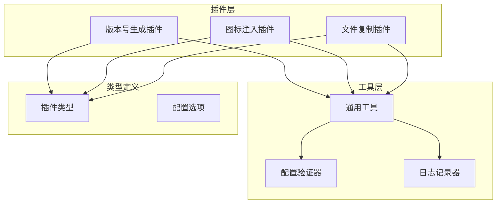
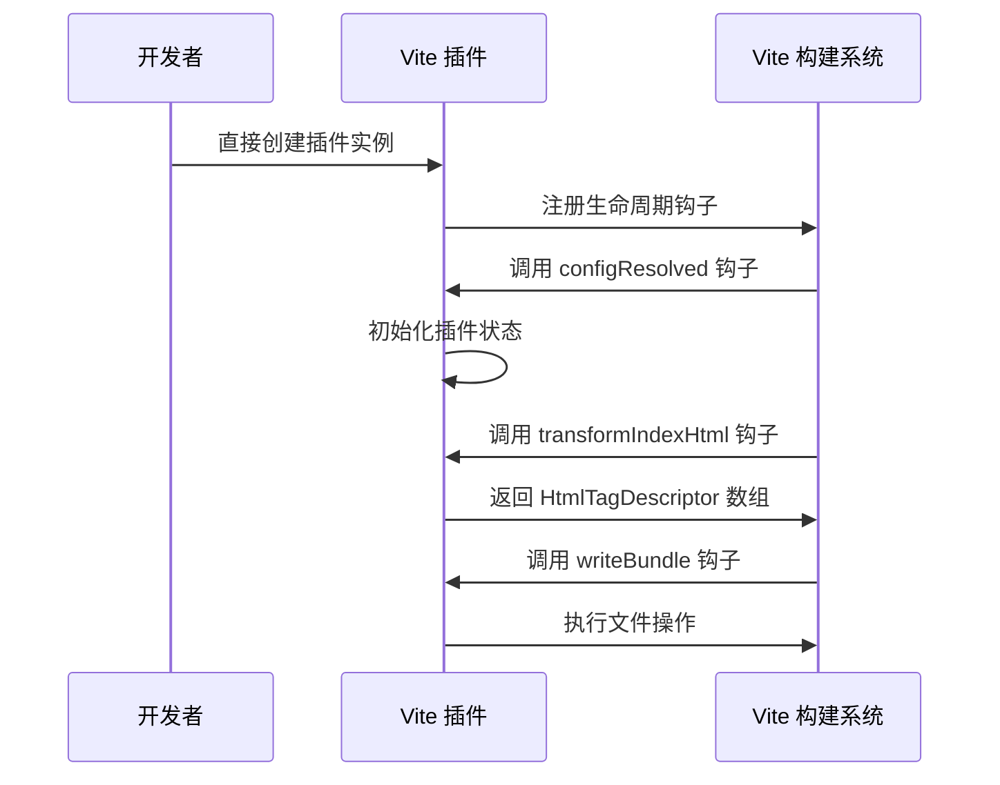
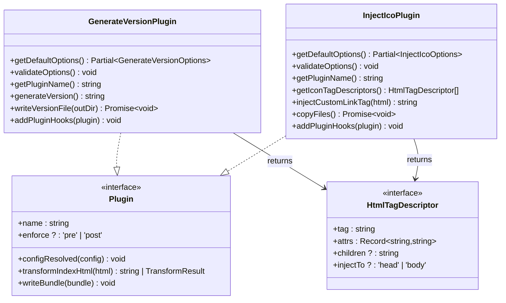
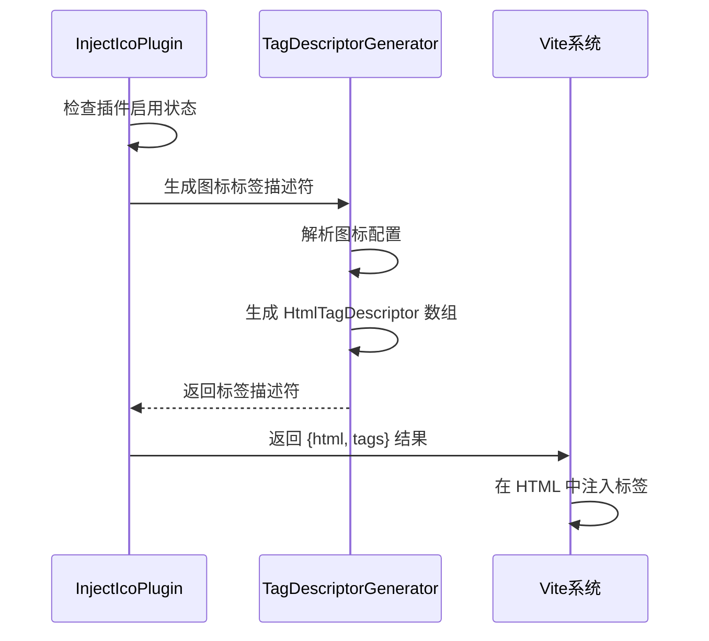
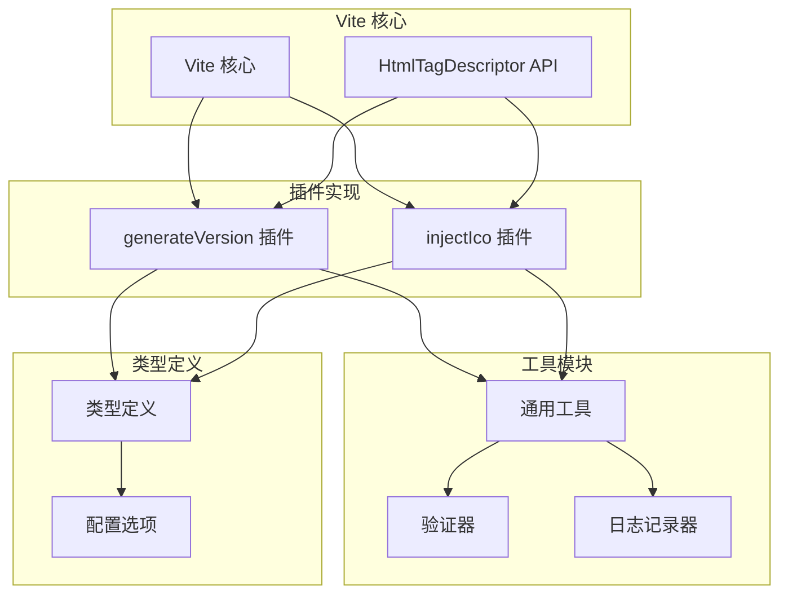

# 插件工厂系统

<cite>
**本文档引用的文件**
- [packages/core/src/factory/plugin/index.ts](file://packages/core/src/factory/plugin/index.ts)
- [packages/core/src/factory/plugin/types.ts](file://packages/core/src/factory/plugin/types.ts)
- [packages/core/src/factory/index.ts](file://packages/core/src/factory/index.ts)
- [packages/core/src/factory/types.ts](file://packages/core/src/factory/types.ts)
- [packages/core/src/plugins/generateVersion/index.ts](file://packages/core/src/plugins/generateVersion/index.ts)
- [packages/core/src/plugins/generateVersion/types.ts](file://packages/core/src/plugins/generateVersion/types.ts)
- [packages/core/src/plugins/injectIco/index.ts](file://packages/core/src/plugins/injectIco/index.ts)
- [packages/core/src/plugins/injectIco/types.ts](file://packages/core/src/plugins/injectIco/types.ts)
- [packages/core/src/common/validation.ts](file://packages/core/src/common/validation.ts)
- [packages/core/src/logger/index.ts](file://packages/core/src/logger/index.ts)
- [packages/playground/vite.config.ts](file://packages/playground/vite.config.ts)
</cite>

## 更新摘要
**变更内容**
- 移除了旧的插件工厂系统，采用 Vite 官方 HtmlTagDescriptor API 直接开发
- 新增 generateVersion 插件，支持多种版本号生成格式和输出方式
- 更新 injectIco 插件，完全迁移到 Vite 原生 HtmlTagDescriptor API
- 简化插件开发模式，直接使用 Vite 官方插件规范
- 移除了 createPluginFactory 工厂函数和 BasePlugin 抽象类

## 目录
1. [简介](#简介)
2. [项目结构](#项目结构)
3. [核心组件](#核心组件)
4. [架构概览](#架构概览)
5. [详细组件分析](#详细组件分析)
6. [依赖分析](#依赖分析)
7. [性能考虑](#性能考虑)
8. [故障排除指南](#故障排除指南)
9. [结论](#结论)
10. [附录](#附录)

## 简介

插件工厂系统是一个基于 TypeScript 的 Vite 插件开发框架，现已完全迁移到 Vite 官方插件开发模式。该系统直接遵循 Vite 官方指南，使用 HtmlTagDescriptor API 进行插件开发，提供了简洁高效的插件开发体验。

**更新** 系统已移除旧的工厂模式，采用更直接的 Vite 插件开发方式，每个插件都是独立的 Vite 插件实现。

系统的核心特性包括：
- **直接遵循 Vite 官方指南**：使用 HtmlTagDescriptor API 进行 HTML 标签注入
- **简洁的插件架构**：每个插件独立实现，无需工厂模式抽象
- **完整的类型安全保证**：基于 TypeScript 的完整类型系统
- **内置的日志记录和配置验证功能**
- **支持多种插件开发场景**：版本号生成、图标注入、文件复制等

## 项目结构

插件工厂系统采用模块化设计，主要分为以下几个核心模块：


```mermaid
graph TB
subgraph "插件层"
GenerateVersion[版本号生成插件]
InjectIco[图标注入插件]
CopyFile[文件复制插件]
end
subgraph "工具层"
Common[通用工具]
Validation[配置验证器]
Logger[日志记录器]
end
subgraph "类型定义"
Types[插件类型]
Options[配置选项]
end
GenerateVersion --> Types
InjectIco --> Types
CopyFile --> Types
GenerateVersion --> Common
InjectIco --> Common
CopyFile --> Common
Common --> Validation
Common --> Logger
```

**图表来源**
- [packages/core/src/plugins/generateVersion/index.ts](file://packages/core/src/plugins/generateVersion/index.ts#L1-L257)
- [packages/core/src/plugins/injectIco/index.ts](file://packages/core/src/plugins/injectIco/index.ts#L1-L195)

**章节来源**
- [packages/core/src/factory/index.ts](file://packages/core/src/factory/index.ts#L1-L2)
- [packages/core/src/factory/types.ts](file://packages/core/src/factory/types.ts#L1-L2)

## 核心组件

### Vite 原生插件开发模式

**更新** 插件开发已完全迁移到 Vite 官方模式，不再使用工厂函数和抽象基类。

每个插件现在都是一个独立的 Vite 插件实现，直接遵循 Vite 官方插件规范：


```mermaid
sequenceDiagram
participant Dev as 开发者
participant Plugin as Vite 插件
participant Vite as Vite 构建系统
Dev->>Plugin : 直接创建插件实例
Plugin->>Vite : 注册生命周期钩子
Vite->>Plugin : 调用 configResolved 钩子
Plugin->>Plugin : 初始化插件状态
Vite->>Plugin : 调用 transformIndexHtml 钩子
Plugin->>Vite : 返回 HtmlTagDescriptor 数组
Vite->>Plugin : 调用 writeBundle 钩子
Plugin->>Vite : 执行文件操作
```

**更新** 移除了 createPluginFactory 函数和 BasePlugin 抽象类，插件开发更加直接和简洁。

### generateVersion 插件

generateVersion 插件展示了如何使用 Vite 官方 API 创建复杂的构建时插件：

**核心功能：**
- **多格式版本号生成**：支持 timestamp、date、datetime、semver、hash、custom 等格式
- **灵活的输出方式**：支持文件输出、代码注入、双重输出
- **智能构建时间处理**：自动获取构建时间并格式化
- **自定义模板支持**：支持占位符模板的自定义格式

**使用示例：**
```typescript
// 基本使用 - 时间戳格式
generateVersion()

// 日期格式
generateVersion({
  format: 'date'
})

// 语义化版本格式
generateVersion({
  format: 'semver',
  semverBase: '2.0.0',
  prefix: 'v'
})

// 自定义格式
generateVersion({
  format: 'custom',
  customFormat: '{YYYY}.{MM}.{DD}-{hash}',
  hashLength: 6
})

// 注入到代码中
generateVersion({
  outputType: 'define',
  defineName: '__VERSION__'
})

// 同时输出文件和注入代码
generateVersion({
  outputType: 'both',
  outputFile: 'build-info.json',
  defineName: '__BUILD_VERSION__',
  extra: {
    environment: 'production',
    author: 'MengXi Studio'
  }
})
```

**章节来源**
- [packages/core/src/plugins/generateVersion/index.ts](file://packages/core/src/plugins/generateVersion/index.ts#L1-L257)
- [packages/core/src/plugins/generateVersion/types.ts](file://packages/core/src/plugins/generateVersion/types.ts#L1-L120)

### injectIco 插件

injectIco 插件完全迁移到 Vite 原生 HtmlTagDescriptor API：

**核心特性：**
- **原生 HtmlTagDescriptor 支持**：使用 Vite 官键 API 进行 HTML 标签注入
- **多种配置方式**：支持字符串配置、完整配置对象、自定义 link 标签
- **文件复制功能**：可选的图标文件复制到目标目录
- **智能 HTML 处理**：自动检测和注入到 HTML 文件的 `<head>` 标签

**使用示例：**
```typescript
// 基本使用
injectIco()

// 使用字符串配置 base 路径
injectIco('/assets')

// 使用完整配置
injectIco({
  base: '/assets',
  icons: [
    { rel: 'icon', href: '/favicon.svg', type: 'image/svg+xml' },
    { rel: 'icon', href: '/favicon-32x32.png', sizes: '32x32', type: 'image/png' }
  ],
  copyOptions: {
    sourceDir: 'src/assets/icons',
    targetDir: 'dist/assets/icons'
  }
})
```

**更新** 插件现在使用 Vite 原生 transformIndexHtml 钩子和 HtmlTagDescriptor API，完全移除了对工厂模式的依赖。

**章节来源**
- [packages/core/src/plugins/injectIco/index.ts](file://packages/core/src/plugins/injectIco/index.ts#L1-L195)
- [packages/core/src/plugins/injectIco/types.ts](file://packages/core/src/plugins/injectIco/types.ts#L1-L113)

## 架构概览

插件工厂系统已完全重构为直接的 Vite 插件架构：


```mermaid
classDiagram
class GenerateVersionPlugin {
+getDefaultOptions() Partial~GenerateVersionOptions~
+validateOptions() void
+getPluginName() string
+generateVersion() string
+writeVersionFile(outDir) Promise~void~
+addPluginHooks(plugin) void
}
class InjectIcoPlugin {
+getDefaultOptions() Partial~InjectIcoOptions~
+validateOptions() void
+getPluginName() string
+getIconTagDescriptors() HtmlTagDescriptor[]
+injectCustomLinkTag(html) string
+copyFiles() Promise~void~
+addPluginHooks(plugin) void
}
class HtmlTagDescriptor {
<<interface>>
+tag : string
+attrs : Record~string,string~
+children ? : string
+injectTo ? : 'head' | 'body'
}
class Plugin {
<<interface>>
+name : string
+enforce ? : 'pre' | 'post'
+configResolved(config) void
+transformIndexHtml(html) string | TransformResult
+writeBundle(bundle) void
}
GenerateVersionPlugin ..|> Plugin
InjectIcoPlugin ..|> Plugin
GenerateVersionPlugin --> HtmlTagDescriptor : returns
InjectIcoPlugin --> HtmlTagDescriptor : returns
```

**图表来源**
- [packages/core/src/plugins/generateVersion/index.ts](file://packages/core/src/plugins/generateVersion/index.ts#L14-L197)
- [packages/core/src/plugins/injectIco/index.ts](file://packages/core/src/plugins/injectIco/index.ts#L14-L158)

## 详细组件分析

### generateVersion 插件详解

#### 版本号生成算法

generateVersion 插件实现了多种版本号生成策略：

```mermaid
flowchart TD
Start([开始版本号生成]) --> CheckFormat{检查格式类型}
CheckFormat --> |timestamp| Timestamp[时间戳格式<br/>YYYYMMDDHHmmss]
CheckFormat --> |date| Date[日期格式<br/>YYYY.MM.DD]
CheckFormat --> |datetime| DateTime[日期时间格式<br/>YYYY.MM.DD.HHmmss]
CheckFormat --> |semver| SemVer[语义化版本<br/>MAJOR.MINOR.PATCH]
CheckFormat --> |hash| Hash[随机哈希<br/>a1b2c3d4]
CheckFormat --> |custom| Custom[自定义格式<br/>模板解析]
Timestamp --> PrefixSuffix[添加前缀和后缀]
Date --> PrefixSuffix
DateTime --> PrefixSuffix
SemVer --> PrefixSuffix
Hash --> PrefixSuffix
Custom --> ParseTemplate[解析模板占位符<br/>{YYYY},{MM},{DD},{hash},...]
ParseTemplate --> PrefixSuffix
PrefixSuffix --> Return([返回最终版本号])
```

**图表来源**
- [packages/core/src/plugins/generateVersion/index.ts](file://packages/core/src/plugins/generateVersion/index.ts#L63-L120)

#### 输出方式实现

插件支持三种输出方式，每种都有特定的实现策略：

1. **文件输出**：使用 writeBundle 钩子在构建完成后写入版本信息文件
2. **代码注入**：使用 config 钩子通过 Vite 的 define 选项注入全局变量
3. **双重输出**：同时支持文件输出和代码注入

**章节来源**
- [packages/core/src/plugins/generateVersion/index.ts](file://packages/core/src/plugins/generateVersion/index.ts#L146-L196)

### injectIco 插件详解

#### HtmlTagDescriptor 生成机制

injectIco 插件使用 Vite 原生 HtmlTagDescriptor API 生成图标标签：


```mermaid
sequenceDiagram
participant Plugin as InjectIcoPlugin
participant Generator as TagDescriptorGenerator
participant Vite as Vite系统
Plugin->>Plugin : 检查插件启用状态
Plugin->>Generator : 生成图标标签描述符
Generator->>Generator : 解析图标配置
Generator->>Generator : 生成 HtmlTagDescriptor 数组
Generator-->>Plugin : 返回标签描述符
Plugin->>Vite : 返回 {html, tags} 结果
Vite->>Vite : 在 HTML 中注入标签
```

**图表来源**
- [packages/core/src/plugins/injectIco/index.ts](file://packages/core/src/plugins/injectIco/index.ts#L45-L60)

#### 文件复制功能

插件提供了完整的图标文件复制功能：

1. **源文件检查**：验证源目录是否存在
2. **增量复制**：支持增量复制减少不必要的文件传输
3. **递归复制**：支持目录结构的完整复制
4. **覆盖控制**：可配置是否覆盖同名文件

**章节来源**
- [packages/core/src/plugins/injectIco/index.ts](file://packages/core/src/plugins/injectIco/index.ts#L102-L129)

## 依赖分析

插件系统的依赖关系已大幅简化：


```mermaid
graph TB
subgraph "Vite 核心"
Vite[Vite 核心]
HtmlTagDescriptor[HtmlTagDescriptor API]
end
subgraph "插件实现"
GenerateVersion[generateVersion 插件]
InjectIco[injectIco 插件]
end
subgraph "工具模块"
Common[通用工具]
Validation[验证器]
Logger[日志记录器]
end
subgraph "类型定义"
Types[类型定义]
Options[配置选项]
end
Vite --> GenerateVersion
Vite --> InjectIco
HtmlTagDescriptor --> GenerateVersion
HtmlTagDescriptor --> InjectIco
GenerateVersion --> Common
InjectIco --> Common
Common --> Validation
Common --> Logger
GenerateVersion --> Types
InjectIco --> Types
Types --> Options
```

**图表来源**
- [packages/core/src/plugins/generateVersion/index.ts](file://packages/core/src/plugins/generateVersion/index.ts#L1-L6)
- [packages/core/src/plugins/injectIco/index.ts](file://packages/core/src/plugins/injectIco/index.ts#L1-L6)

**章节来源**
- [packages/core/src/plugins/generateVersion/index.ts](file://packages/core/src/plugins/generateVersion/index.ts#L1-L6)
- [packages/core/src/plugins/injectIco/index.ts](file://packages/core/src/plugins/injectIco/index.ts#L1-L6)

## 性能考虑

### 执行效率优化

**更新** 由于移除了工厂模式和抽象层，插件执行效率得到显著提升：

1. **直接插件调用**：插件直接注册到 Vite，无需额外的工厂包装
2. **按需初始化**：插件只在需要时初始化，减少内存占用
3. **原生 API 利用**：直接使用 Vite 原生 HtmlTagDescriptor API，避免中间层开销

### 内存管理

1. **插件状态隔离**：每个插件维护独立的状态，避免相互影响
2. **生命周期优化**：精确控制插件在构建过程中的执行时机
3. **资源清理**：插件销毁时自动清理相关资源和监听器

### 最佳实践

1. **合理使用日志**：在生产环境中关闭详细日志以提升性能
2. **配置验证**：在开发阶段启用严格验证，生产环境可调整验证级别
3. **错误处理**：根据插件用途选择合适的错误处理策略
4. **插件组合**：合理组合多个插件以避免重复操作

## 故障排除指南

### 常见问题及解决方案

#### 插件未生效

**问题症状：**
- 插件配置正确但没有任何效果
- 控制台没有相关日志

**解决方法：**
1. 检查插件的 `enabled` 配置
2. 验证插件钩子是否正确注册
3. 确认插件在 Vite 配置中的正确位置

#### HtmlTagDescriptor 未注入

**问题症状：**
- 图标标签未出现在生成的 HTML 中
- 插件执行但无输出

**解决方法：**
1. 检查 transformIndexHtml 钩子是否正确返回标签描述符
2. 验证 HtmlTagDescriptor 的配置是否正确
3. 确认插件的执行顺序（order: 'pre'）

#### 版本号生成问题

**问题症状：**
- 版本号格式不符合预期
- 输出文件未生成

**解决方法：**
1. 检查版本号格式配置
2. 验证输出类型设置
3. 确认文件写入权限和路径

### 错误处理策略

插件系统提供了三种错误处理策略：

| 策略 | 行为 | 适用场景 |
|------|------|----------|
| `throw` | 记录错误并抛出异常，中断执行 | 生产环境，需要严格错误处理 |
| `log` | 记录错误但继续执行 | 开发环境，需要完整日志 |
| `ignore` | 记录错误并继续执行，忽略错误 | 特殊场景，允许部分失败 |

**章节来源**
- [packages/core/src/plugins/generateVersion/index.ts](file://packages/core/src/plugins/generateVersion/index.ts#L283-L311)

## 结论

插件工厂系统已成功迁移到 Vite 官方插件开发模式，提供了更简洁、高效和直接的插件开发体验。

**主要优势：**
- **直接遵循官方规范**：使用 Vite 原生 API，无需额外抽象层
- **简化开发流程**：每个插件独立实现，开发更加直观
- **提升执行效率**：移除工厂模式和抽象层，减少性能开销
- **增强类型安全**：基于 TypeScript 的完整类型系统
- **保持功能完整性**：保留原有插件的所有功能特性

**更新** 新增的 generateVersion 插件提供了强大的版本号管理功能，injectIco 插件完全迁移到 Vite 原生 API，两个插件都展示了现代 Vite 插件开发的最佳实践。

**推荐使用场景：**
- 需要创建 Vite 原生插件的项目
- 希望直接使用 Vite 官方 API 的开发者
- 需要版本号管理和 HTML 标签注入功能的项目

## 附录

### 插件类型定义参考

#### 基础配置类型

```typescript
interface BasePluginOptions {
  enabled?: boolean          // 是否启用插件
  verbose?: boolean          // 是否启用详细日志
  errorStrategy?: 'throw' | 'log' | 'ignore'  // 错误处理策略
}
```

#### generateVersion 插件配置

```typescript
interface GenerateVersionOptions extends BasePluginOptions {
  format?: 'timestamp' | 'date' | 'datetime' | 'semver' | 'hash' | 'custom'
  customFormat?: string
  semverBase?: string
  autoIncrement?: boolean
  outputType?: 'file' | 'define' | 'both'
  outputFile?: string
  defineName?: string
  hashLength?: number
  prefix?: string
  suffix?: string
  extra?: Record<string, any>
}
```

#### injectIco 插件配置

```typescript
interface InjectIcoOptions extends BasePluginOptions {
  base?: string
  url?: string
  link?: string
  icons?: Icon[]
  copyOptions?: CopyOptions
}

interface Icon {
  rel: string
  href: string
  sizes?: string
  type?: string
}

interface CopyOptions {
  sourceDir: string
  targetDir: string
  overwrite?: boolean
  recursive?: boolean
}
```

**更新** 移除了 createPluginFactory 类型定义和 OptionsNormalizer 类型，插件开发更加直接。

### 使用最佳实践

1. **插件组合**：合理组合多个插件以实现复杂功能
2. **配置验证**：利用内置验证器确保配置的正确性
3. **日志管理**：根据环境调整日志级别以平衡性能和调试需求
4. **错误处理**：根据插件用途选择合适的错误处理策略
5. **性能优化**：在生产环境中优化配置，减少不必要的操作
6. **类型安全**：充分利用 TypeScript 的类型推断和约束机制

### 进一步学习资源

- Vite 插件开发官方文档
- HtmlTagDescriptor API 参考
- TypeScript 高级类型特性
- Vite 插件开发最佳实践
- 实际项目中的插件使用示例