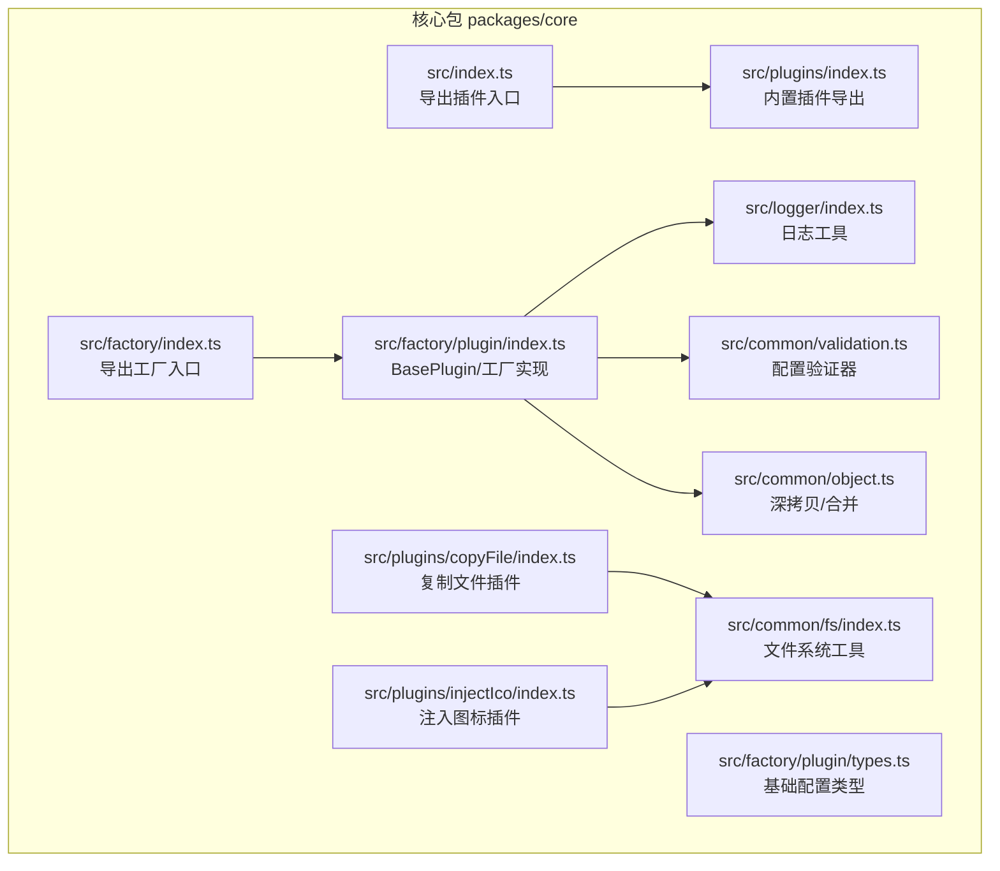
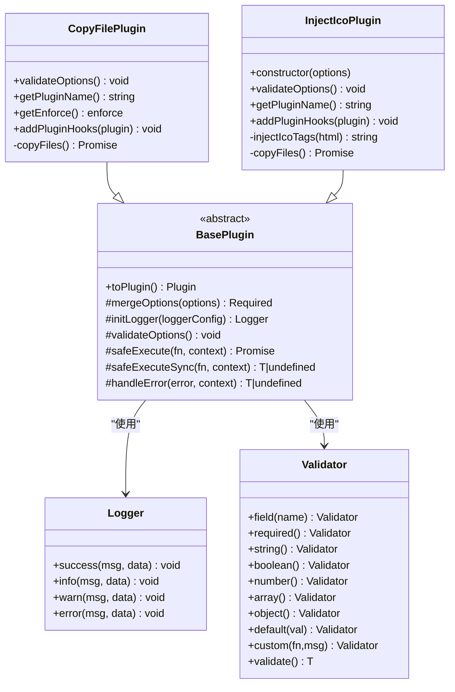
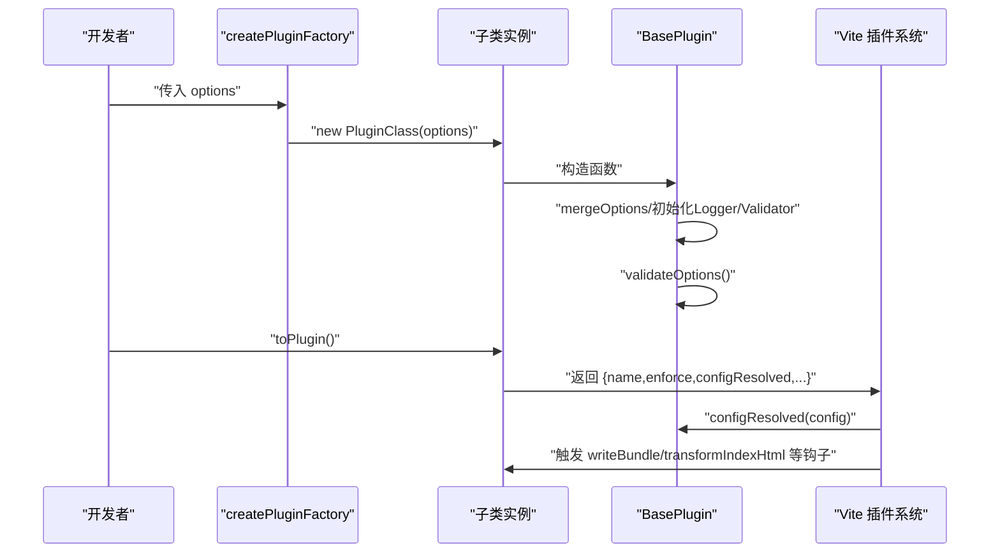
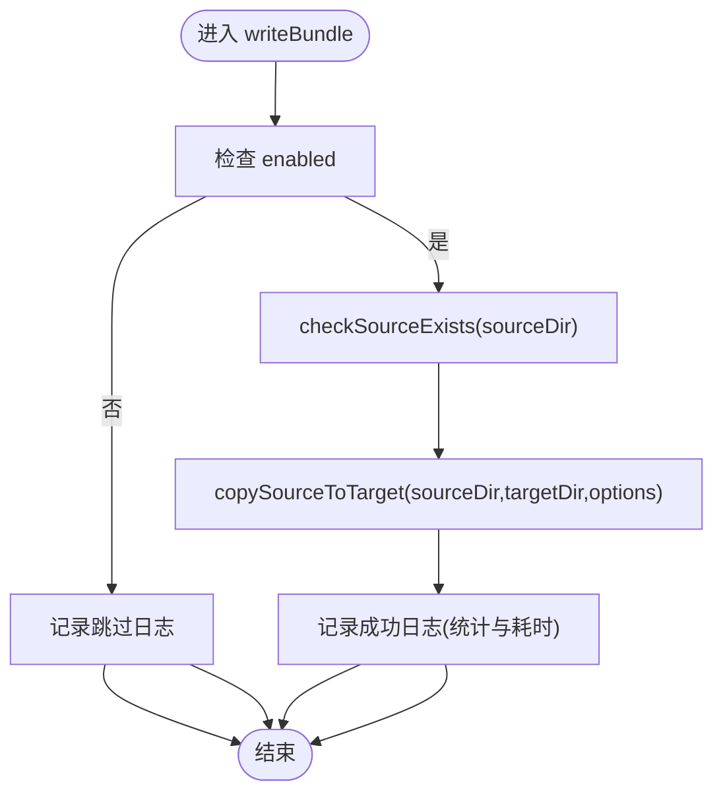
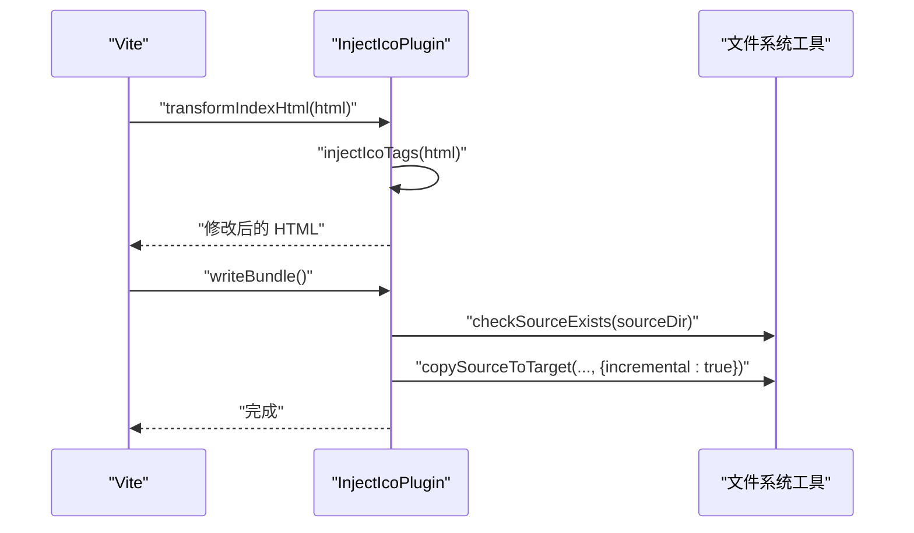
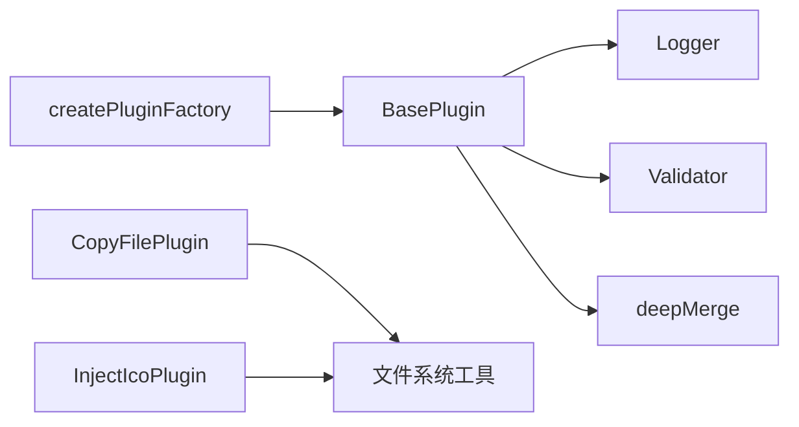

# 插件开发

<cite>
**本文引用的文件**
- [packages/core/src/index.ts](file://packages/core/src/index.ts)
- [packages/core/src/factory/index.ts](file://packages/core/src/factory/index.ts)
- [packages/core/src/factory/plugin/index.ts](file://packages/core/src/factory/plugin/index.ts)
- [packages/core/src/factory/plugin/types.ts](file://packages/core/src/factory/plugin/types.ts)
- [packages/core/src/factory/types.ts](file://packages/core/src/factory/types.ts)
- [packages/core/src/logger/index.ts](file://packages/core/src/logger/index.ts)
- [packages/core/src/logger/types.ts](file://packages/core/src/logger/types.ts)
- [packages/core/src/common/validation.ts](file://packages/core/src/common/validation.ts)
- [packages/core/src/common/object.ts](file://packages/core/src/common/object.ts)
- [packages/core/src/common/fs/index.ts](file://packages/core/src/common/fs/index.ts)
- [packages/core/src/plugins/index.ts](file://packages/core/src/plugins/index.ts)
- [packages/core/src/plugins/copyFile/index.ts](file://packages/core/src/plugins/copyFile/index.ts)
- [packages/core/src/plugins/copyFile/types.ts](file://packages/core/src/plugins/copyFile/types.ts)
- [packages/core/src/plugins/injectIco/index.ts](file://packages/core/src/plugins/injectIco/index.ts)
- [packages/core/src/plugins/injectIco/types.ts](file://packages/core/src/plugins/injectIco/types.ts)
</cite>

## 目录
1. [简介](#简介)
2. [项目结构](#项目结构)
3. [核心组件](#核心组件)
4. [架构总览](#架构总览)
5. [详细组件分析](#详细组件分析)
6. [依赖分析](#依赖分析)
7. [性能考虑](#性能考虑)
8. [故障排查指南](#故障排查指南)
9. [结论](#结论)
10. [附录](#附录)

## 简介
本指南面向希望基于本仓库开发 Vite 插件的开发者，系统讲解插件工厂体系的设计与实现，深入剖析 BasePlugin 抽象类的生命周期与扩展点，覆盖配置验证、错误处理、日志记录、测试与调试、性能优化等主题，并提供从需求分析到实现部署的完整流程与示例。

## 项目结构
本项目采用多包工作区组织，核心能力集中在 packages/core 中，包含插件工厂、通用工具、日志与验证模块，以及两个内置插件（复制文件与注入图标）。

图表来源
- [packages/core/src/index.ts](file://packages/core/src/index.ts#L1-L2)
- [packages/core/src/factory/index.ts](file://packages/core/src/factory/index.ts#L1-L2)
- [packages/core/src/factory/plugin/index.ts](file://packages/core/src/factory/plugin/index.ts#L1-L384)
- [packages/core/src/factory/plugin/types.ts](file://packages/core/src/factory/plugin/types.ts#L1-L37)
- [packages/core/src/logger/index.ts](file://packages/core/src/logger/index.ts#L1-L131)
- [packages/core/src/common/validation.ts](file://packages/core/src/common/validation.ts#L1-L203)
- [packages/core/src/common/object.ts](file://packages/core/src/common/object.ts#L1-L30)
- [packages/core/src/common/fs/index.ts](file://packages/core/src/common/fs/index.ts#L1-L241)
- [packages/core/src/plugins/index.ts](file://packages/core/src/plugins/index.ts#L1-L3)
- [packages/core/src/plugins/copyFile/index.ts](file://packages/core/src/plugins/copyFile/index.ts#L1-L116)
- [packages/core/src/plugins/injectIco/index.ts](file://packages/core/src/plugins/injectIco/index.ts#L1-L178)

章节来源
- [packages/core/src/index.ts](file://packages/core/src/index.ts#L1-L2)
- [packages/core/src/factory/index.ts](file://packages/core/src/factory/index.ts#L1-L2)
- [packages/core/src/plugins/index.ts](file://packages/core/src/plugins/index.ts#L1-L3)

## 核心组件
- 插件工厂与抽象基类
  - BasePlugin：提供统一的生命周期、配置合并、验证、日志、错误处理与 Vite 插件对象转换能力；子类通过抽象方法扩展钩子与命名。
  - createPluginFactory：生成“插件工厂函数”，负责实例化子类、调用 toPlugin 并挂载 pluginInstance 引用。
- 配置验证器
  - Validator：提供链式 API 验证必填、类型、默认值与自定义规则，集中于插件内部 validateOptions。
- 日志系统
  - Logger：统一输出 info/success/warn/error，带时间戳与插件前缀，受 verbose 控制。
- 通用工具
  - deepMerge：深合并默认配置与用户配置。
  - 文件系统工具：checkSourceExists、ensureTargetDir、readDirRecursive、shouldUpdateFile、copySourceToTarget、writeFileContent、readFileSync。

章节来源
- [packages/core/src/factory/plugin/index.ts](file://packages/core/src/factory/plugin/index.ts#L27-L337)
- [packages/core/src/factory/plugin/types.ts](file://packages/core/src/factory/plugin/types.ts#L8-L29)
- [packages/core/src/common/validation.ts](file://packages/core/src/common/validation.ts#L16-L202)
- [packages/core/src/logger/index.ts](file://packages/core/src/logger/index.ts#L6-L130)
- [packages/core/src/common/object.ts](file://packages/core/src/common/object.ts#L8-L29)
- [packages/core/src/common/fs/index.ts](file://packages/core/src/common/fs/index.ts#L10-L241)

## 架构总览
下图展示了插件工厂与内置插件之间的关系，以及 BasePlugin 如何将子类转换为 Vite 插件对象。

图表来源
- [packages/core/src/factory/plugin/index.ts](file://packages/core/src/factory/plugin/index.ts#L27-L337)
- [packages/core/src/plugins/copyFile/index.ts](file://packages/core/src/plugins/copyFile/index.ts#L13-L82)
- [packages/core/src/plugins/injectIco/index.ts](file://packages/core/src/plugins/injectIco/index.ts#L14-L139)
- [packages/core/src/logger/index.ts](file://packages/core/src/logger/index.ts#L6-L130)
- [packages/core/src/common/validation.ts](file://packages/core/src/common/validation.ts#L16-L202)

## 详细组件分析

### BasePlugin 抽象类与生命周期
- 生命周期钩子
  - configResolved：接收 ResolvedConfig，保存到实例并记录初始化日志。
  - 子类通过 addPluginHooks 注册 writeBundle/transformIndexHtml 等 Vite 钩子。
- 配置与验证
  - mergeOptions：默认配置与用户配置深合并，保证必填项存在。
  - validateOptions：子类可重写，结合 Validator 执行链式校验。
- 日志与错误处理
  - initLogger：支持传入 Logger 实例或 LoggerOptions，verbose 控制输出。
  - safeExecute/safeExecuteSync：包裹业务逻辑，按 errorStrategy 决定抛错或忽略。
  - handleError：统一错误格式化与日志输出。
- 对外接口
  - toPlugin：生成符合 Vite 规范的 Plugin 对象，设置 name/enforce/configResolved，并调用 addPluginHooks。

图表来源
- [packages/core/src/factory/plugin/index.ts](file://packages/core/src/factory/plugin/index.ts#L69-L336)

章节来源
- [packages/core/src/factory/plugin/index.ts](file://packages/core/src/factory/plugin/index.ts#L27-L337)
- [packages/core/src/factory/plugin/types.ts](file://packages/core/src/factory/plugin/types.ts#L8-L29)

### 插件工厂与类型系统
- BasePluginOptions：enabled/verbose/errorStrategy 的基础配置。
- PluginFactory：工厂函数签名，接收可选配置并返回 Vite 插件对象。
- createPluginFactory：实例化子类，调用 toPlugin，并在返回的插件对象上挂载 pluginInstance 引用，便于外部调试与访问。

章节来源
- [packages/core/src/factory/plugin/types.ts](file://packages/core/src/factory/plugin/types.ts#L8-L37)
- [packages/core/src/factory/plugin/index.ts](file://packages/core/src/factory/plugin/index.ts#L371-L383)

### 配置验证器 Validator
- 支持字段链式声明：required/string/boolean/number/array/object/default/custom。
- validate：收集错误后一次性抛出，便于在初始化阶段快速失败。
- 在插件内部使用，建议在 validateOptions 中集中声明与校验。

章节来源
- [packages/core/src/common/validation.ts](file://packages/core/src/common/validation.ts#L16-L202)

### 日志系统 Logger
- 统一前缀：库名+插件名+时间戳。
- 四种级别：info/success/warn/error，彩色输出（终端支持时）。
- 受 enabled 控制，避免在生产环境产生噪声。

章节来源
- [packages/core/src/logger/index.ts](file://packages/core/src/logger/index.ts#L6-L130)
- [packages/core/src/logger/types.ts](file://packages/core/src/logger/types.ts#L4-L13)

### 文件系统工具
- checkSourceExists/ensureTargetDir：前置检查与目录准备。
- readDirRecursive/shouldUpdateFile：递归遍历与增量判断。
- copySourceToTarget：核心复制逻辑，统计复制/跳过数量与耗时。
- writeFileContent/readFileSync：读写文件封装，统一错误处理。

章节来源
- [packages/core/src/common/fs/index.ts](file://packages/core/src/common/fs/index.ts#L10-L241)

### 内置插件：复制文件（copyFile）
- 配置项：sourceDir/targetDir/overwrite/recursive/incremental/继承基础配置。
- 生命周期：在 writeBundle 阶段执行复制，支持增量与覆盖策略。
- 验证：使用 Validator 校验必填与类型，提供默认值。
- 错误处理：通过 safeExecute 包裹，按 errorStrategy 处理。

图表来源
- [packages/core/src/plugins/copyFile/index.ts](file://packages/core/src/plugins/copyFile/index.ts#L53-L75)
- [packages/core/src/common/fs/index.ts](file://packages/core/src/common/fs/index.ts#L98-L202)

章节来源
- [packages/core/src/plugins/copyFile/index.ts](file://packages/core/src/plugins/copyFile/index.ts#L13-L82)
- [packages/core/src/plugins/copyFile/types.ts](file://packages/core/src/plugins/copyFile/types.ts#L8-L43)

### 内置插件：注入图标（injectIco）
- 配置项：base/url/link/icons/继承基础配置；可选 copyOptions 控制图标复制。
- 生命周期：
  - transformIndexHtml：向 HTML 的 head 注入图标标签，避免重复注入。
  - writeBundle：按需复制图标文件到目标目录。
- 验证：对主配置与 copyOptions 分别校验，支持默认值与必填约束。
- 错误处理：通过 safeExecute 包裹，按 errorStrategy 处理。

图表来源
- [packages/core/src/plugins/injectIco/index.ts](file://packages/core/src/plugins/injectIco/index.ts#L130-L138)
- [packages/core/src/common/fs/index.ts](file://packages/core/src/common/fs/index.ts#L98-L202)

章节来源
- [packages/core/src/plugins/injectIco/index.ts](file://packages/core/src/plugins/injectIco/index.ts#L14-L139)
- [packages/core/src/plugins/injectIco/types.ts](file://packages/core/src/plugins/injectIco/types.ts#L70-L112)

## 依赖分析
- 组件内聚与耦合
  - BasePlugin 与 Logger/Validator/deepMerge 紧密耦合，形成稳定的基础设施层。
  - 内置插件仅依赖 BasePlugin 与通用工具，职责清晰。
- 外部依赖
  - Vite 插件系统（Plugin 接口、钩子）。
  - Node.js fs/path 模块（文件系统操作）。
- 可能的循环依赖
  - 未发现直接循环导入；工厂导出位于 factory/index.ts，插件导出位于 plugins/index.ts，通过相对路径引用。

图表来源
- [packages/core/src/factory/plugin/index.ts](file://packages/core/src/factory/plugin/index.ts#L1-L7)
- [packages/core/src/plugins/copyFile/index.ts](file://packages/core/src/plugins/copyFile/index.ts#L1-L5)
- [packages/core/src/plugins/injectIco/index.ts](file://packages/core/src/plugins/injectIco/index.ts#L1-L5)

章节来源
- [packages/core/src/factory/index.ts](file://packages/core/src/factory/index.ts#L1-L2)
- [packages/core/src/plugins/index.ts](file://packages/core/src/plugins/index.ts#L1-L3)

## 性能考虑
- 增量复制
  - copySourceToTarget 支持 incremental 模式，通过比较修改时间与文件大小决定是否复制，减少不必要的 IO。
- 递归复制
  - readDirRecursive 递归扫描目录，配合增量策略可显著降低大目录复制成本。
- 并发与批处理
  - 当前实现逐个文件复制，若需进一步优化可在批量文件上引入并发控制（注意磁盘吞吐与系统资源限制）。
- 日志开销
  - verbose=true 会增加 I/O，建议在生产构建中关闭或仅保留 warn/error。
- 错误策略
  - errorStrategy='ignore' 可避免中断，但可能掩盖问题；建议开发阶段使用 'throw'，生产使用 'log'。

[本节为通用指导，无需列出章节来源]

## 故障排查指南
- 配置验证失败
  - 现象：初始化即抛出配置错误。
  - 排查：检查必填字段、类型与默认值；在 validateOptions 中逐步注释验证链定位问题。
- 权限与路径错误
  - 现象：复制/写入/读取失败。
  - 排查：确认 sourceDir/targetDir 存在且具备读写权限；使用 checkSourceExists/ensureTargetDir 前置检查。
- 增量复制未生效
  - 现象：每次均复制全部文件。
  - 排查：确认 incremental=true 且源文件时间戳或大小确有变化；检查 shouldUpdateFile 的判定逻辑。
- 日志未输出
  - 现象：verbose=false 或日志被过滤。
  - 排查：检查 verbose 与 Logger.enabled；确认插件名称与前缀一致。
- 工厂实例不可见
  - 现象：无法从 Vite 插件对象访问原始实例。
  - 排查：确认使用 createPluginFactory；返回的插件对象上应存在 pluginInstance 引用。

章节来源
- [packages/core/src/common/validation.ts](file://packages/core/src/common/validation.ts#L195-L201)
- [packages/core/src/common/fs/index.ts](file://packages/core/src/common/fs/index.ts#L10-L41)
- [packages/core/src/factory/plugin/index.ts](file://packages/core/src/factory/plugin/index.ts#L371-L383)

## 结论
本插件工厂体系以 BasePlugin 为核心，通过统一的生命周期、配置合并、验证、日志与错误处理，大幅降低了插件开发复杂度。内置 copyFile 与 injectIco 展示了典型场景的实现方式。遵循本文档的流程与最佳实践，开发者可快速扩展出满足自身需求的高质量 Vite 插件。

[本节为总结性内容，无需列出章节来源]

## 附录

### 自定义插件开发流程（从需求到部署）
- 需求分析
  - 明确插件目标（如：构建后处理、HTML 注入、静态资源复制等）。
  - 识别 Vite 钩子（如：configResolved、transformIndexHtml、writeBundle 等）。
- 设计与建模
  - 定义插件配置接口（继承 BasePluginOptions），明确必填与可选字段。
  - 设计 validateOptions 的验证规则，必要时拆分子配置对象（参考 InjectIco 的 copyOptions）。
- 实现步骤
  - 新建类继承 BasePlugin<T>，实现：
    - getPluginName：返回唯一插件名。
    - getEnforce：选择执行时机（pre/post/undefined）。
    - addPluginHooks：注册所需钩子。
    - 可选：重写 validateOptions，使用 Validator 完成校验。
  - 在钩子中调用 safeExecute/safeExecuteSync 包裹业务逻辑。
  - 使用 Logger 输出关键信息与诊断数据。
- 配置与部署
  - 使用 createPluginFactory 生成工厂函数，或直接 new 子类后 toPlugin。
  - 在 Vite 配置中导出并启用插件。
- 测试与调试
  - 单元测试：针对 validateOptions、钩子行为与边界条件。
  - 集成测试：在真实构建场景中验证效果。
  - 调试技巧：开启 verbose，利用 pluginInstance 引用查看内部状态；在关键路径打印日志。
- 性能优化
  - 启用增量策略；避免不必要的文件扫描；合理使用并发；减少日志输出频率。

[本节为流程性内容，无需列出章节来源]

### 基于现有插件的扩展示例
- 复制文件插件（copyFile）
  - 场景：构建完成后将静态资源复制到 dist。
  - 关键点：在 writeBundle 中调用 copySourceToTarget，启用 incremental 与 overwrite。
  - 参考路径：[复制文件插件实现](file://packages/core/src/plugins/copyFile/index.ts#L53-L81)
- 注入图标插件（injectIco）
  - 场景：向 HTML 注入 favicon 与多尺寸图标，并可选复制图标文件。
  - 关键点：transformIndexHtml 注入标签；writeBundle 复制文件；支持 base/url/link/icons。
  - 参考路径：[注入图标插件实现](file://packages/core/src/plugins/injectIco/index.ts#L130-L138)

章节来源
- [packages/core/src/plugins/copyFile/index.ts](file://packages/core/src/plugins/copyFile/index.ts#L13-L82)
- [packages/core/src/plugins/injectIco/index.ts](file://packages/core/src/plugins/injectIco/index.ts#L14-L139)

### 配置验证与错误处理清单
- 配置验证
  - 必填字段：使用 required。
  - 类型约束：使用 string/boolean/number/array/object。
  - 默认值：使用 default。
  - 自定义规则：使用 custom。
  - validate：一次性抛出所有错误，便于早期失败。
- 错误处理策略
  - throw：记录错误并中断，适合严格模式。
  - log：记录错误但继续执行，适合容忍部分失败。
  - ignore：记录并忽略，适合降级场景。
- 日志记录
  - info：常规信息。
  - success：成功结果（含统计与耗时）。
  - warn：潜在问题。
  - error：异常情况。

章节来源
- [packages/core/src/common/validation.ts](file://packages/core/src/common/validation.ts#L54-L188)
- [packages/core/src/factory/plugin/index.ts](file://packages/core/src/factory/plugin/index.ts#L272-L300)
- [packages/core/src/logger/index.ts](file://packages/core/src/logger/index.ts#L100-L129)