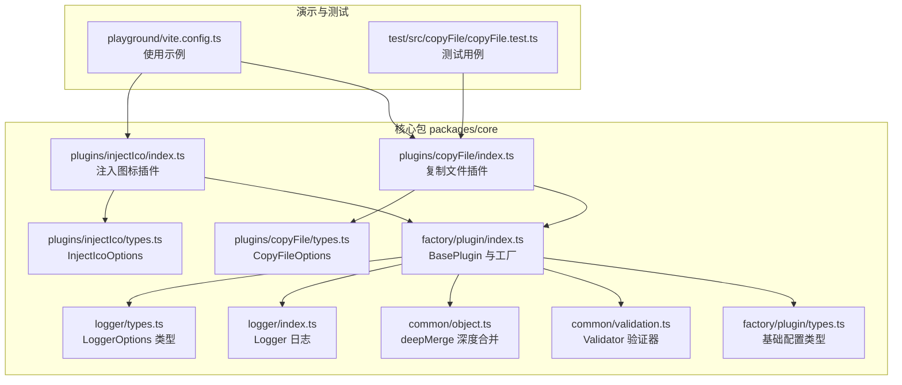
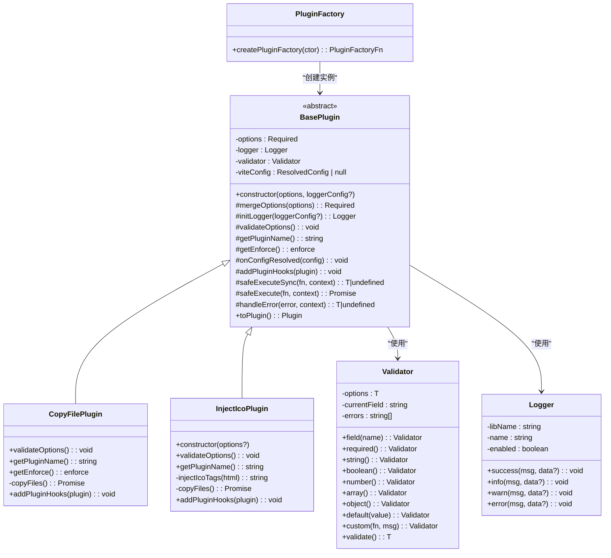
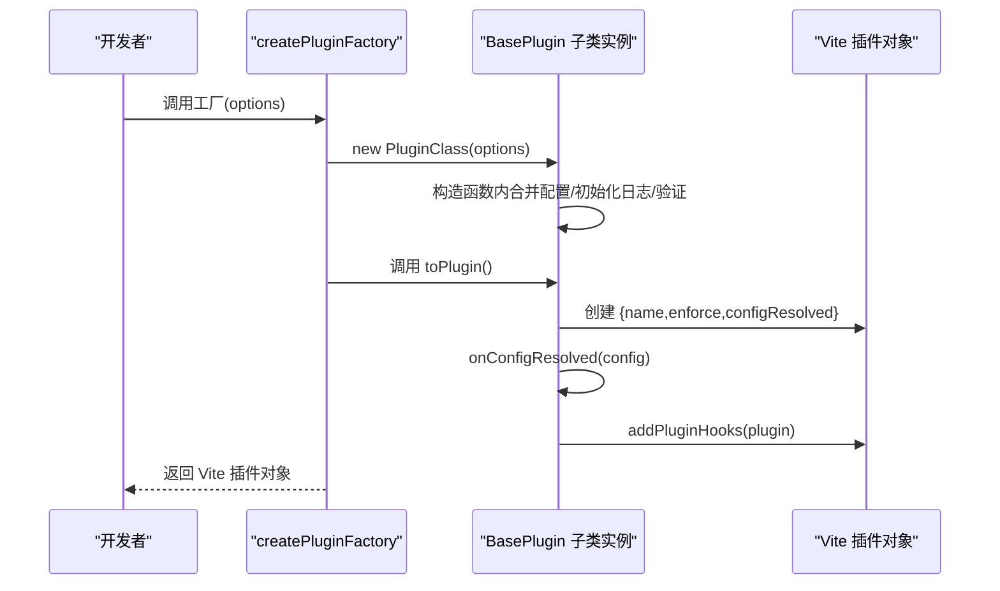
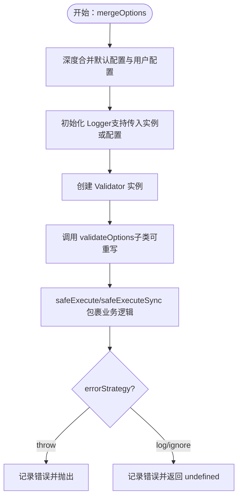
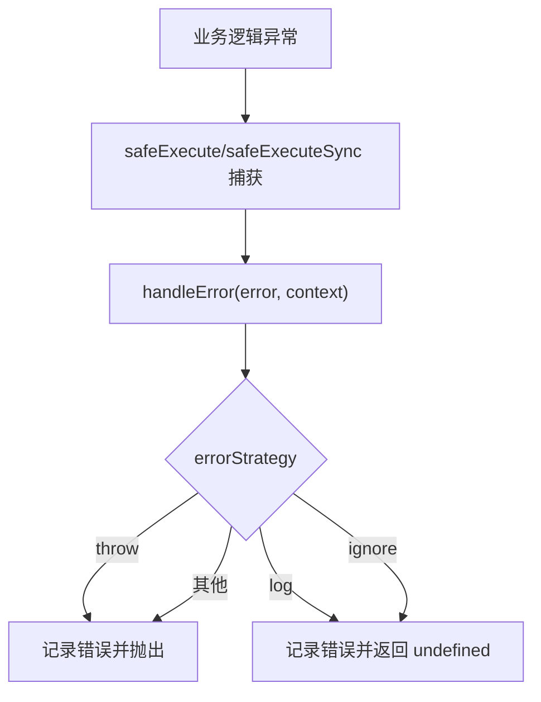
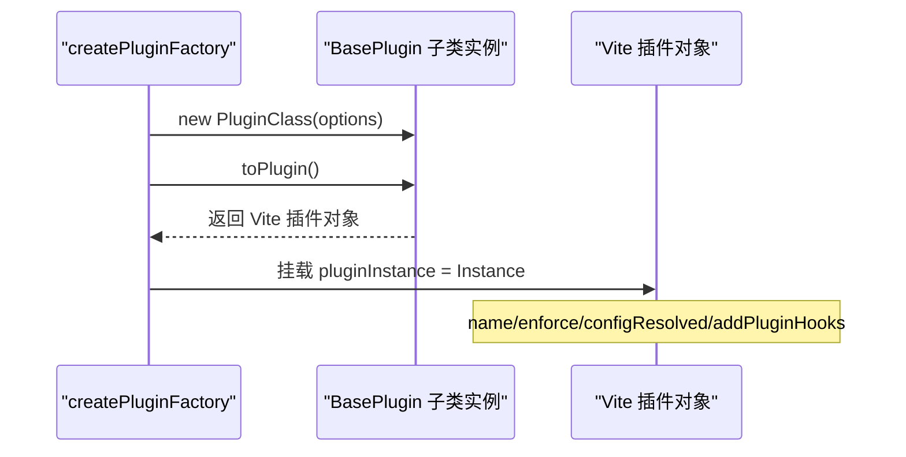
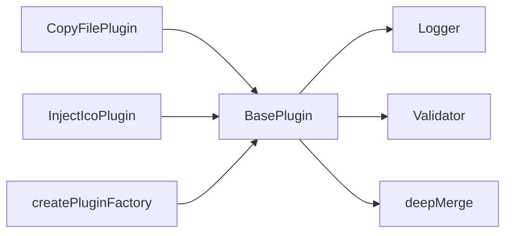

# 插件架构设计

<cite>
**本文档引用的文件**
- [packages/core/src/factory/plugin/index.ts](file://packages/core/src/factory/plugin/index.ts)
- [packages/core/src/factory/plugin/types.ts](file://packages/core/src/factory/plugin/types.ts)
- [packages/core/src/common/validation.ts](file://packages/core/src/common/validation.ts)
- [packages/core/src/logger/index.ts](file://packages/core/src/logger/index.ts)
- [packages/core/src/logger/types.ts](file://packages/core/src/logger/types.ts)
- [packages/core/src/common/object.ts](file://packages/core/src/common/object.ts)
- [packages/core/src/plugins/copyFile/index.ts](file://packages/core/src/plugins/copyFile/index.ts)
- [packages/core/src/plugins/copyFile/types.ts](file://packages/core/src/plugins/copyFile/types.ts)
- [packages/core/src/plugins/injectIco/index.ts](file://packages/core/src/plugins/injectIco/index.ts)
- [packages/core/src/plugins/injectIco/types.ts](file://packages/core/src/plugins/injectIco/types.ts)
- [packages/playground/vite.config.ts](file://packages/playground/vite.config.ts)
- [packages/test/src/copyFile/copyFile.test.ts](file://packages/test/src/copyFile/copyFile.test.ts)
</cite>

## 目录
1. [简介](#简介)
2. [项目结构](#项目结构)
3. [核心组件](#核心组件)
4. [架构总览](#架构总览)
5. [详细组件分析](#详细组件分析)
6. [依赖关系分析](#依赖关系分析)
7. [性能考虑](#性能考虑)
8. [故障排查指南](#故障排查指南)
9. [结论](#结论)
10. [附录](#附录)

## 简介
本文件面向插件架构设计，围绕 BasePlugin 抽象类展开，系统阐述其设计理念、生命周期管理、钩子函数机制、配置管理系统、初始化流程、配置合并策略与验证机制、错误处理策略（throw/log/ignore）以及插件实例与 Vite 插件对象之间的转换过程。文档同时提供基于真实代码的示例路径，帮助读者快速掌握如何正确继承 BasePlugin 并实现必要的抽象方法。

## 项目结构
该项目采用多包工作区组织，核心插件框架位于 packages/core，包含工厂、通用工具、日志与具体插件实现；playground 展示使用示例；test 提供测试用例。

**图表来源**
- [packages/core/src/factory/plugin/index.ts](file://packages/core/src/factory/plugin/index.ts#L1-L384)
- [packages/core/src/factory/plugin/types.ts](file://packages/core/src/factory/plugin/types.ts#L1-L37)
- [packages/core/src/common/validation.ts](file://packages/core/src/common/validation.ts#L1-L203)
- [packages/core/src/common/object.ts](file://packages/core/src/common/object.ts#L1-L30)
- [packages/core/src/logger/index.ts](file://packages/core/src/logger/index.ts#L1-L131)
- [packages/core/src/logger/types.ts](file://packages/core/src/logger/types.ts#L1-L14)
- [packages/core/src/plugins/copyFile/index.ts](file://packages/core/src/plugins/copyFile/index.ts#L1-L116)
- [packages/core/src/plugins/copyFile/types.ts](file://packages/core/src/plugins/copyFile/types.ts#L1-L44)
- [packages/core/src/plugins/injectIco/index.ts](file://packages/core/src/plugins/injectIco/index.ts#L1-L178)
- [packages/core/src/plugins/injectIco/types.ts](file://packages/core/src/plugins/injectIco/types.ts#L1-L113)
- [packages/playground/vite.config.ts](file://packages/playground/vite.config.ts#L1-L69)
- [packages/test/src/copyFile/copyFile.test.ts](file://packages/test/src/copyFile/copyFile.test.ts#L1-L219)

**章节来源**
- [packages/core/src/factory/plugin/index.ts](file://packages/core/src/factory/plugin/index.ts#L1-L384)
- [packages/core/src/factory/plugin/types.ts](file://packages/core/src/factory/plugin/types.ts#L1-L37)
- [packages/playground/vite.config.ts](file://packages/playground/vite.config.ts#L1-L69)

## 核心组件
本节聚焦 BasePlugin 抽象类及其工厂 createPluginFactory，涵盖以下要点：
- 生命周期管理：构造函数 -> 配置合并 -> 日志初始化 -> 验证 -> toPlugin() -> 钩子注册
- 配置系统：默认配置、深度合并、验证器 Validator、错误策略 errorStrategy
- 钩子机制：抽象方法 addPluginHooks，由子类实现具体钩子
- 错误处理：safeExecute/safeExecuteSync + handleError 的统一策略

**章节来源**
- [packages/core/src/factory/plugin/index.ts](file://packages/core/src/factory/plugin/index.ts#L27-L337)
- [packages/core/src/factory/plugin/types.ts](file://packages/core/src/factory/plugin/types.ts#L8-L29)
- [packages/core/src/common/validation.ts](file://packages/core/src/common/validation.ts#L16-L202)
- [packages/core/src/common/object.ts](file://packages/core/src/common/object.ts#L8-L29)
- [packages/core/src/logger/index.ts](file://packages/core/src/logger/index.ts#L6-L130)

## 架构总览
BasePlugin 作为所有插件的基类，提供统一的生命周期与基础设施；子类通过实现 getPluginName、getEnforce、addPluginHooks 等抽象/受保护方法，完成与 Vite 钩子的对接。工厂 createPluginFactory 负责将插件实例转换为 Vite 插件对象，并在对象上挂载 pluginInstance 引用，便于调试与扩展。

**图表来源**
- [packages/core/src/factory/plugin/index.ts](file://packages/core/src/factory/plugin/index.ts#L27-L383)
- [packages/core/src/common/validation.ts](file://packages/core/src/common/validation.ts#L16-L202)
- [packages/core/src/logger/index.ts](file://packages/core/src/logger/index.ts#L6-L130)

## 详细组件分析

### BasePlugin 抽象类详解
- 设计理念
  - 统一生命周期：构造函数内完成配置合并、日志与验证；toPlugin() 生成 Vite 插件对象并注册钩子
  - 可插拔钩子：通过抽象方法 addPluginHooks，子类自由选择 Vite 钩子
  - 可配置错误策略：errorStrategy 控制 throw/log/ignore 三种行为
- 关键方法
  - 构造函数：合并默认配置、初始化 Logger、创建 Validator、执行 validateOptions
  - mergeOptions：默认值 + 用户配置深度合并
  - initLogger：支持传入 Logger 实例或 LoggerOptions
  - validateOptions：空实现，子类可重写
  - getPluginName/getEnforce：分别提供插件标识与执行时机
  - onConfigResolved：保存 Vite 配置并记录初始化日志
  - addPluginHooks：抽象方法，子类实现具体钩子
  - safeExecute/safeExecuteSync：包裹业务逻辑，统一错误处理
  - handleError：按 errorStrategy 记录错误并决定是否抛出
  - toPlugin：创建 Vite 插件对象，注册 configResolved 钩子，再调用 addPluginHooks
- 工厂 createPluginFactory：创建实例并转换为 Vite 插件，同时挂载 pluginInstance 引用

**图表来源**
- [packages/core/src/factory/plugin/index.ts](file://packages/core/src/factory/plugin/index.ts#L320-L336)
- [packages/core/src/factory/plugin/index.ts](file://packages/core/src/factory/plugin/index.ts#L69-L81)
- [packages/core/src/factory/plugin/index.ts](file://packages/core/src/factory/plugin/index.ts#L371-L383)

**章节来源**
- [packages/core/src/factory/plugin/index.ts](file://packages/core/src/factory/plugin/index.ts#L27-L337)
- [packages/core/src/factory/plugin/types.ts](file://packages/core/src/factory/plugin/types.ts#L8-L29)

### 配置系统与验证机制
- 默认配置（BasePluginOptions）
  - enabled: 是否启用插件
  - verbose: 是否启用日志
  - errorStrategy: 错误策略（'throw' | 'log' | 'ignore'）
- 深度合并策略
  - mergeOptions 将默认配置与用户配置进行深度合并，保证嵌套对象逐层合并而非简单覆盖
- 验证器 Validator
  - 提供流畅 API：field().required().string().default().custom().validate()
  - 支持必填、类型校验、默认值注入与自定义校验
  - validate() 失败时抛出包含所有错误信息的异常
- 子类验证示例
  - CopyFilePlugin：校验 sourceDir/targetDir 必填且非空字符串，overwrite/recursive/incremental 布尔类型并设置默认值
  - InjectIcoPlugin：校验 base/url/link/icons 等字段，若存在 copyOptions 则对其内部字段再次验证

**图表来源**
- [packages/core/src/factory/plugin/index.ts](file://packages/core/src/factory/plugin/index.ts#L98-L106)
- [packages/core/src/factory/plugin/index.ts](file://packages/core/src/factory/plugin/index.ts#L115-L127)
- [packages/core/src/factory/plugin/index.ts](file://packages/core/src/factory/plugin/index.ts#L149-L150)
- [packages/core/src/factory/plugin/index.ts](file://packages/core/src/factory/plugin/index.ts#L214-L248)
- [packages/core/src/factory/plugin/index.ts](file://packages/core/src/factory/plugin/index.ts#L272-L300)
- [packages/core/src/common/validation.ts](file://packages/core/src/common/validation.ts#L195-L201)

**章节来源**
- [packages/core/src/factory/plugin/types.ts](file://packages/core/src/factory/plugin/types.ts#L8-L29)
- [packages/core/src/common/object.ts](file://packages/core/src/common/object.ts#L8-L29)
- [packages/core/src/common/validation.ts](file://packages/core/src/common/validation.ts#L16-L202)
- [packages/core/src/plugins/copyFile/index.ts](file://packages/core/src/plugins/copyFile/index.ts#L14-L35)
- [packages/core/src/plugins/injectIco/index.ts](file://packages/core/src/plugins/injectIco/index.ts#L22-L40)

### 错误处理策略（throw/log/ignore）
- 触发点：任何业务逻辑通过 safeExecute/safeExecuteSync 包裹后发生异常
- 处理流程：
  - 记录错误日志（包含上下文与错误信息）
  - 根据 errorStrategy 决策：
    - throw：抛出原始错误，中断执行
    - log/ignore：仅记录错误，返回 undefined，继续执行
- 默认策略：未匹配到明确策略时回退为抛出错误

**图表来源**
- [packages/core/src/factory/plugin/index.ts](file://packages/core/src/factory/plugin/index.ts#L272-L300)
- [packages/core/src/logger/index.ts](file://packages/core/src/logger/index.ts#L127-L129)

**章节来源**
- [packages/core/src/factory/plugin/index.ts](file://packages/core/src/factory/plugin/index.ts#L272-L300)

### 插件生命周期与钩子机制
- 生命周期阶段
  1) 构造函数：合并配置、初始化日志、创建验证器、执行验证
  2) toPlugin：创建 Vite 插件对象，注册 configResolved 钩子
  3) configResolved：保存 Vite 配置，记录初始化日志
  4) addPluginHooks：子类注册具体钩子（如 transformIndexHtml、writeBundle 等）
- 钩子函数机制
  - 抽象方法 addPluginHooks(plugin: Plugin) 由子类实现
  - 子类通过 plugin.writeBundle、plugin.transformIndexHtml 等属性挂载回调
  - 所有钩子内的业务逻辑建议通过 safeExecute/safeExecuteSync 包裹，确保错误策略一致

**章节来源**
- [packages/core/src/factory/plugin/index.ts](file://packages/core/src/factory/plugin/index.ts#L179-L193)
- [packages/core/src/factory/plugin/index.ts](file://packages/core/src/factory/plugin/index.ts#L320-L336)
- [packages/core/src/plugins/copyFile/index.ts](file://packages/core/src/plugins/copyFile/index.ts#L77-L81)
- [packages/core/src/plugins/injectIco/index.ts](file://packages/core/src/plugins/injectIco/index.ts#L130-L138)

### 插件实例与 Vite 插件对象的关系
- BasePlugin.toPlugin() 返回标准 Vite Plugin 对象，包含：
  - name：插件名称（getPluginName）
  - enforce：执行时机（getEnforce）
  - configResolved：在启用状态下调用 onConfigResolved
- 工厂 createPluginFactory 进一步增强：
  - 将插件实例挂载到 Vite 插件对象的 pluginInstance 属性上，便于调试与扩展
- 子类插件示例
  - CopyFilePlugin：在 writeBundle 钩子中执行文件复制
  - InjectIcoPlugin：在 transformIndexHtml 钩子中注入图标标签，并在 writeBundle 中可选地复制图标文件

**图表来源**
- [packages/core/src/factory/plugin/index.ts](file://packages/core/src/factory/plugin/index.ts#L320-L336)
- [packages/core/src/factory/plugin/index.ts](file://packages/core/src/factory/plugin/index.ts#L371-L383)

**章节来源**
- [packages/core/src/factory/plugin/index.ts](file://packages/core/src/factory/plugin/index.ts#L320-L336)
- [packages/core/src/factory/plugin/index.ts](file://packages/core/src/factory/plugin/index.ts#L371-L383)
- [packages/core/src/plugins/copyFile/index.ts](file://packages/core/src/plugins/copyFile/index.ts#L77-L81)
- [packages/core/src/plugins/injectIco/index.ts](file://packages/core/src/plugins/injectIco/index.ts#L130-L138)

### 如何正确继承 BasePlugin 并实现必要抽象方法
- 步骤
  1) 定义配置接口（扩展 BasePluginOptions）
  2) 继承 BasePlugin<T>
  3) 实现 getPluginName：返回插件名称
  4) 可选实现 getEnforce：设置执行时机
  5) 实现 validateOptions：使用 Validator 验证配置
  6) 实现 addPluginHooks：注册所需 Vite 钩子
  7) 在钩子中使用 safeExecute/safeExecuteSync 包裹业务逻辑
  8) 通过 createPluginFactory 或直接 new + toPlugin() 导出插件
- 示例参考
  - 复制文件插件：定义 CopyFileOptions，实现 getPluginName/getEnforce/validateOptions/addPluginHooks
  - 注入图标插件：支持字符串或对象配置，实现 getPluginName/validateOptions/addPluginHooks

**章节来源**
- [packages/core/src/plugins/copyFile/index.ts](file://packages/core/src/plugins/copyFile/index.ts#L13-L82)
- [packages/core/src/plugins/copyFile/types.ts](file://packages/core/src/plugins/copyFile/types.ts#L8-L43)
- [packages/core/src/plugins/injectIco/index.ts](file://packages/core/src/plugins/injectIco/index.ts#L14-L139)
- [packages/core/src/plugins/injectIco/types.ts](file://packages/core/src/plugins/injectIco/types.ts#L70-L112)

## 依赖关系分析
- 组件耦合
  - BasePlugin 依赖 Logger、Validator、deepMerge
  - 子类插件依赖 BasePlugin 与各自类型定义
  - 工厂函数依赖 BasePlugin 与类型系统
- 外部依赖
  - Vite 插件规范（Plugin 接口）
- 潜在循环依赖
  - 未发现循环导入；各模块职责清晰

**图表来源**
- [packages/core/src/factory/plugin/index.ts](file://packages/core/src/factory/plugin/index.ts#L1-L6)
- [packages/core/src/plugins/copyFile/index.ts](file://packages/core/src/plugins/copyFile/index.ts#L1-L5)
- [packages/core/src/plugins/injectIco/index.ts](file://packages/core/src/plugins/injectIco/index.ts#L1-L5)

**章节来源**
- [packages/core/src/factory/plugin/index.ts](file://packages/core/src/factory/plugin/index.ts#L1-L6)
- [packages/core/src/common/object.ts](file://packages/core/src/common/object.ts#L8-L29)
- [packages/core/src/common/validation.ts](file://packages/core/src/common/validation.ts#L16-L202)
- [packages/core/src/logger/index.ts](file://packages/core/src/logger/index.ts#L6-L130)

## 性能考虑
- 配置合并与验证
  - deepMerge 为浅层遍历，嵌套对象逐层合并，复杂度 O(N+M)，N/M 为键数量
  - Validator 链式调用，验证开销主要在字段数量与自定义校验函数
- 日志输出
  - Logger 在 disabled 时直接返回，避免无意义输出
- 钩子执行
  - 建议在钩子中尽量减少 IO 操作，必要时使用 safeExecute 包裹，避免阻塞构建
- 错误策略
  - errorStrategy='ignore' 可提升稳定性但掩盖问题，建议在开发环境使用 'log'/'throw'

## 故障排查指南
- 配置验证失败
  - 症状：构造函数抛出验证异常
  - 排查：检查 required/string/boolean/array/object/default/custom 设置是否匹配
  - 参考：Validator.validate() 抛出的错误信息包含所有失败项
- 插件未生效
  - 症状：钩子未触发
  - 排查：确认 enabled=true；检查 getEnforce 返回值；确认 toPlugin() 已导出
- 错误被吞掉
  - 症状：业务异常未抛出
  - 排查：检查 errorStrategy；确保使用 safeExecute/safeExecuteSync 包裹
- 日志未输出
  - 症状：Logger 无输出
  - 排查：确认 verbose=true；确认 Logger.enabled=true

**章节来源**
- [packages/core/src/common/validation.ts](file://packages/core/src/common/validation.ts#L195-L201)
- [packages/core/src/factory/plugin/index.ts](file://packages/core/src/factory/plugin/index.ts#L320-L336)
- [packages/core/src/factory/plugin/index.ts](file://packages/core/src/factory/plugin/index.ts#L272-L300)
- [packages/core/src/logger/index.ts](file://packages/core/src/logger/index.ts#L78-L93)

## 结论
BasePlugin 通过统一的生命周期、可插拔钩子与完善的配置/验证/日志/错误处理体系，为 Vite 插件开发提供了高内聚、低耦合的基础设施。借助 createPluginFactory，开发者可以快速创建符合 Vite 规范的插件对象，并在需要时通过 pluginInstance 进行调试与扩展。推荐在生产环境中使用 'throw' 或 'log' 的错误策略，在开发环境中适度放宽以提升可观测性。

## 附录
- 使用示例（路径）
  - playground 中的 copyFile 与 injectIco 插件使用示例：[packages/playground/vite.config.ts](file://packages/playground/vite.config.ts#L11-L68)
  - 测试用例对 copyFile 插件的行为验证：[packages/test/src/copyFile/copyFile.test.ts](file://packages/test/src/copyFile/copyFile.test.ts#L13-L219)
- 类型定义（路径）
  - BasePluginOptions：[packages/core/src/factory/plugin/types.ts](file://packages/core/src/factory/plugin/types.ts#L8-L29)
  - CopyFileOptions：[packages/core/src/plugins/copyFile/types.ts](file://packages/core/src/plugins/copyFile/types.ts#L8-L43)
  - InjectIcoOptions：[packages/core/src/plugins/injectIco/types.ts](file://packages/core/src/plugins/injectIco/types.ts#L70-L112)
  - LoggerOptions：[packages/core/src/logger/types.ts](file://packages/core/src/logger/types.ts#L4-L13)