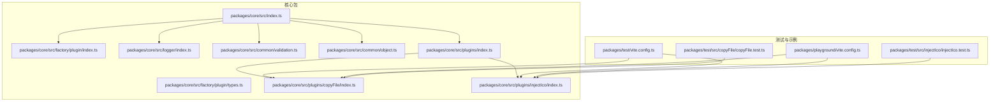
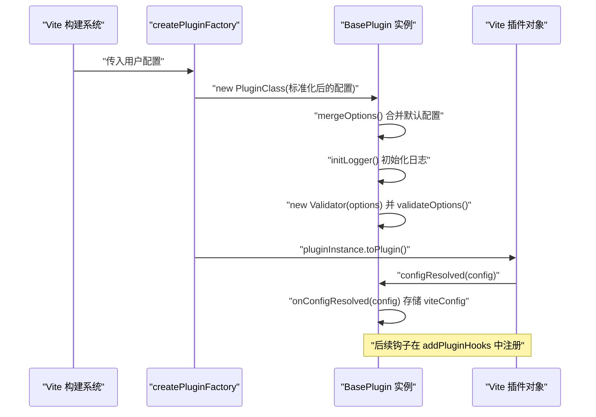
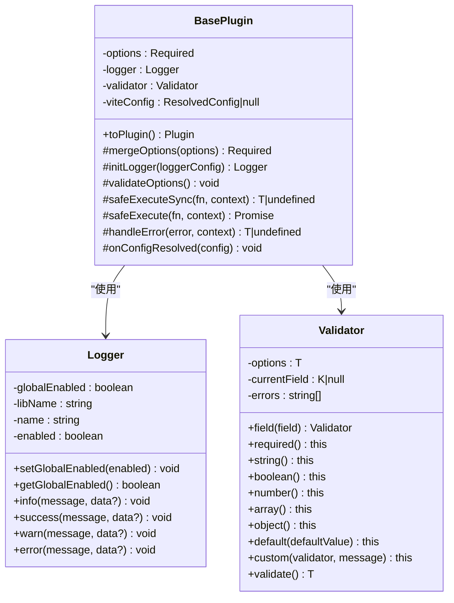
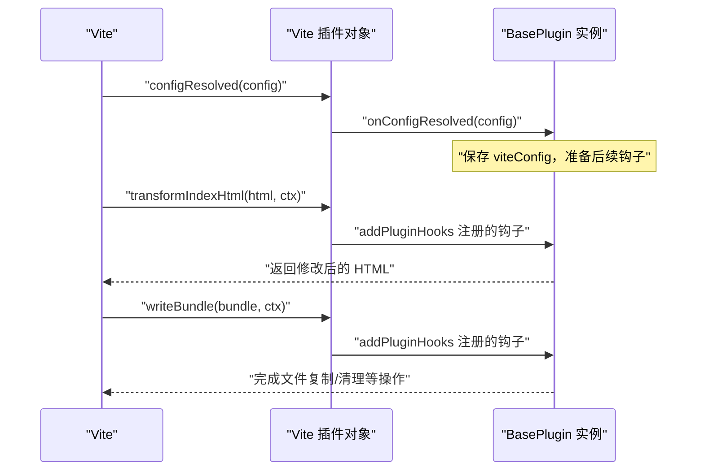
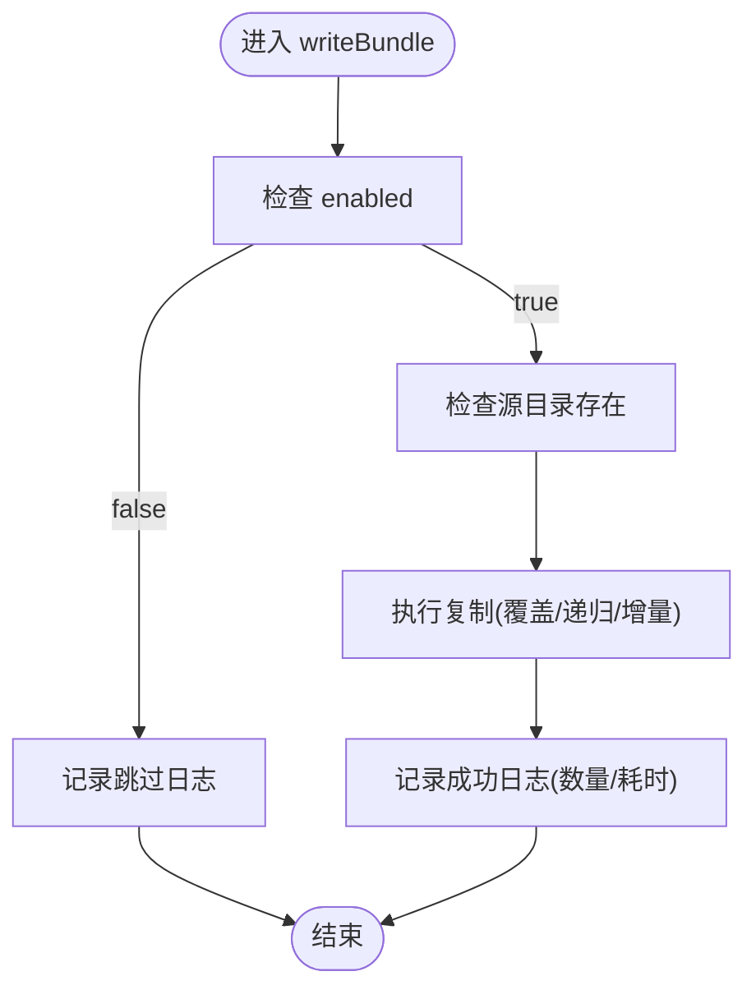
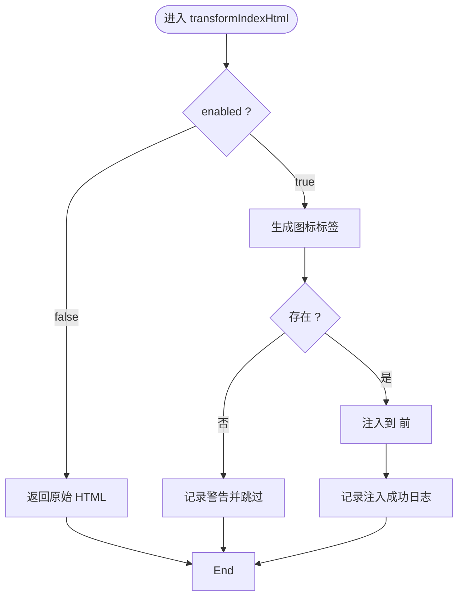
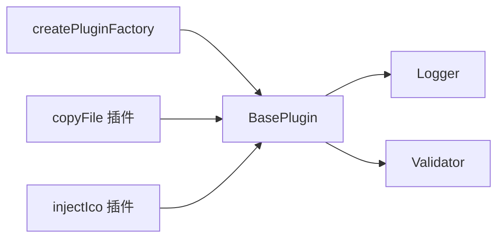

# 插件生命周期管理

<cite>
**本文档引用的文件**
- [packages/core/src/index.ts](file://packages/core/src/index.ts)
- [packages/core/src/factory/plugin/index.ts](file://packages/core/src/factory/plugin/index.ts)
- [packages/core/src/factory/plugin/types.ts](file://packages/core/src/factory/plugin/types.ts)
- [packages/core/src/logger/index.ts](file://packages/core/src/logger/index.ts)
- [packages/core/src/logger/types.ts](file://packages/core/src/logger/types.ts)
- [packages/core/src/common/validation.ts](file://packages/core/src/common/validation.ts)
- [packages/core/src/common/object.ts](file://packages/core/src/common/object.ts)
- [packages/core/src/plugins/copyFile/index.ts](file://packages/core/src/plugins/copyFile/index.ts)
- [packages/core/src/plugins/copyFile/types.ts](file://packages/core/src/plugins/copyFile/types.ts)
- [packages/core/src/plugins/injectIco/index.ts](file://packages/core/src/plugins/injectIco/index.ts)
- [packages/core/src/plugins/injectIco/types.ts](file://packages/core/src/plugins/injectIco/types.ts)
- [packages/core/src/plugins/index.ts](file://packages/core/src/plugins/index.ts)
- [packages/test/vite.config.ts](file://packages/test/vite.config.ts)
- [packages/playground/vite.config.ts](file://packages/playground/vite.config.ts)
- [packages/test/src/copyFile/copyFile.test.ts](file://packages/test/src/copyFile/copyFile.test.ts)
- [packages/test/src/injectIco/injectIco.test.ts](file://packages/test/src/injectIco/injectIco.test.ts)
</cite>

## 目录
1. [简介](#简介)
2. [项目结构](#项目结构)
3. [核心组件](#核心组件)
4. [架构总览](#架构总览)
5. [详细组件分析](#详细组件分析)
6. [依赖分析](#依赖分析)
7. [性能考虑](#性能考虑)
8. [故障排查指南](#故障排查指南)
9. [结论](#结论)
10. [附录](#附录)

## 简介
本文件面向 Vite 插件开发者与使用者，系统化阐述基于本仓库的插件生命周期管理机制。内容涵盖从插件创建、初始化、配置合并与校验、日志系统、钩子注册与执行时机，到插件状态管理、错误处理与恢复策略，以及插件间交互与配置共享。文档同时提供关键阶段的代码示例路径，帮助读者在正确时机执行相应逻辑。

## 项目结构
本项目采用多包工作区组织，核心能力集中在 packages/core 包中，提供通用的插件基类、工厂函数、日志与验证工具，以及两个具体插件实现（复制文件与注入图标）。测试与示例位于 packages/test 与 packages/playground。

图表来源
- [packages/core/src/index.ts](file://packages/core/src/index.ts#L1-L8)
- [packages/core/src/plugins/index.ts](file://packages/core/src/plugins/index.ts#L1-L3)
- [packages/test/vite.config.ts](file://packages/test/vite.config.ts#L1-L35)
- [packages/playground/vite.config.ts](file://packages/playground/vite.config.ts#L1-L69)

章节来源
- [packages/core/src/index.ts](file://packages/core/src/index.ts#L1-L8)
- [packages/core/src/plugins/index.ts](file://packages/core/src/plugins/index.ts#L1-L3)

## 核心组件
- 插件基类与工厂
  - BasePlugin：提供配置合并、日志初始化、验证器、生命周期钩子注册、安全执行与错误处理等能力；对外暴露 toPlugin() 将实例转为 Vite 插件对象。
  - createPluginFactory：工厂函数，负责标准化用户输入、创建插件实例、调用 toPlugin() 并在导出对象上挂载原始实例引用。
- 日志系统
  - Logger：统一的插件日志工具，支持全局开关、实例开关、时间戳前缀、彩色输出与多种日志级别。
- 验证器
  - Validator：流畅 API 的参数验证器，支持必填、类型、默认值与自定义校验，最终 validate() 抛错或返回规范化配置。
- 工具
  - deepMerge：深度合并对象，用于配置合并。
- 具体插件
  - copyFile：在构建完成后执行文件复制，支持覆盖、递归与增量复制。
  - injectIco：在 HTML 构建阶段注入图标链接，并可选复制图标文件。

章节来源
- [packages/core/src/factory/plugin/index.ts](file://packages/core/src/factory/plugin/index.ts#L27-L349)
- [packages/core/src/factory/plugin/types.ts](file://packages/core/src/factory/plugin/types.ts#L1-L46)
- [packages/core/src/logger/index.ts](file://packages/core/src/logger/index.ts#L6-L155)
- [packages/core/src/logger/types.ts](file://packages/core/src/logger/types.ts#L1-L14)
- [packages/core/src/common/validation.ts](file://packages/core/src/common/validation.ts#L16-L203)
- [packages/core/src/common/object.ts](file://packages/core/src/common/object.ts#L8-L30)
- [packages/core/src/plugins/copyFile/index.ts](file://packages/core/src/plugins/copyFile/index.ts#L13-L121)
- [packages/core/src/plugins/injectIco/index.ts](file://packages/core/src/plugins/injectIco/index.ts#L14-L169)

## 架构总览
下图展示了从 Vite 配置加载到插件生命周期执行的关键流程，包括配置解析、钩子注册与执行、状态存储与错误处理。

图表来源
- [packages/core/src/factory/plugin/index.ts](file://packages/core/src/factory/plugin/index.ts#L332-L348)
- [packages/core/src/factory/plugin/index.ts](file://packages/core/src/factory/plugin/index.ts#L108-L118)
- [packages/core/src/factory/plugin/index.ts](file://packages/core/src/factory/plugin/index.ts#L127-L139)
- [packages/core/src/factory/plugin/index.ts](file://packages/core/src/factory/plugin/index.ts#L191-L194)

## 详细组件分析

### BasePlugin 生命周期与状态管理
- 初始化阶段
  - 合并配置：mergeOptions() 将基础默认值、插件特定默认值与用户配置深度合并，保证所有字段具备合理默认值。
  - 日志初始化：initLogger() 支持传入 Logger 实例或 LoggerOptions，按 enabled 控制输出。
  - 配置验证：构造函数内调用 safeExecuteSync(() => this.validateOptions(), '插件配置验证')，确保初始化即通过验证。
- 生命周期钩子注册
  - toPlugin() 创建 Vite 插件对象，设置 name、enforce，并注册 configResolved 钩子；随后调用 addPluginHooks(plugin) 注册业务钩子。
  - viteConfig 字段保存解析后的 Vite 配置，供后续钩子使用。
- 安全执行与错误处理
  - safeExecuteSync/safeExecute：封装同步/异步函数执行，捕获异常后依据 errorStrategy 决策（抛出、记录并忽略、仅记录）。
  - handleError：统一错误日志格式与策略分支，支持字符串、Error 与任意类型错误对象。
- 插件状态
  - options：合并后的完整配置。
  - logger：当前插件日志实例。
  - validator：配置验证器。
  - viteConfig：解析后的 Vite 配置，仅在 configResolved 后可用。

图表来源
- [packages/core/src/factory/plugin/index.ts](file://packages/core/src/factory/plugin/index.ts#L27-L349)
- [packages/core/src/logger/index.ts](file://packages/core/src/logger/index.ts#L6-L155)
- [packages/core/src/common/validation.ts](file://packages/core/src/common/validation.ts#L16-L203)

章节来源
- [packages/core/src/factory/plugin/index.ts](file://packages/core/src/factory/plugin/index.ts#L69-L81)
- [packages/core/src/factory/plugin/index.ts](file://packages/core/src/factory/plugin/index.ts#L108-L118)
- [packages/core/src/factory/plugin/index.ts](file://packages/core/src/factory/plugin/index.ts#L127-L139)
- [packages/core/src/factory/plugin/index.ts](file://packages/core/src/factory/plugin/index.ts#L191-L194)
- [packages/core/src/factory/plugin/index.ts](file://packages/core/src/factory/plugin/index.ts#L226-L312)

### 插件钩子注册与执行时机
- configResolved
  - 作用：Vite 完成配置解析后触发，插件在此保存 ResolvedConfig，准备后续钩子使用。
  - 触发条件：Vite 插件对象注册了 configResolved 钩子。
  - 关键实现：BasePlugin.toPlugin() 中注册 configResolved；BasePlugin.onConfigResolved() 存储配置并记录日志。
- writeBundle
  - 作用：构建完成时执行，常用于产出物后处理（如复制文件）。
  - 示例：copyFile 插件在 writeBundle 中执行文件复制；injectIco 插件在 writeBundle 中执行图标文件复制。
- transformIndexHtml
  - 作用：HTML 构建阶段转换入口，注入图标链接。
  - 示例：injectIco 插件在 transformIndexHtml 中生成并注入图标标签。
- resolveId/load/transform
  - 说明：这些钩子在具体插件中可由 addPluginHooks 注册，用于模块解析与转换。本仓库示例主要展示 writeBundle 与 transformIndexHtml。

图表来源
- [packages/core/src/factory/plugin/index.ts](file://packages/core/src/factory/plugin/index.ts#L332-L348)
- [packages/core/src/factory/plugin/index.ts](file://packages/core/src/factory/plugin/index.ts#L191-L194)
- [packages/core/src/plugins/copyFile/index.ts](file://packages/core/src/plugins/copyFile/index.ts#L82-L86)
- [packages/core/src/plugins/injectIco/index.ts](file://packages/core/src/plugins/injectIco/index.ts#L123-L131)

章节来源
- [packages/core/src/factory/plugin/index.ts](file://packages/core/src/factory/plugin/index.ts#L332-L348)
- [packages/core/src/plugins/copyFile/index.ts](file://packages/core/src/plugins/copyFile/index.ts#L82-L86)
- [packages/core/src/plugins/injectIco/index.ts](file://packages/core/src/plugins/injectIco/index.ts#L123-L131)

### copyFile 插件：生命周期与行为
- 默认配置与校验
  - 默认值：overwrite、recursive、incremental。
  - 校验：sourceDir、targetDir 必填且为非空字符串，overwrite/recursive/incremental 为布尔。
- 执行时机
  - writeBundle：在构建完成后执行，检查插件启用状态、源目录存在性，再执行复制并输出统计日志。
- 关键点
  - 增量复制：通过 incremental 控制是否跳过已存在文件。
  - 覆盖策略：由 overwrite 控制同名文件处理。
  - 递归复制：由 recursive 控制是否遍历子目录。

图表来源
- [packages/core/src/plugins/copyFile/index.ts](file://packages/core/src/plugins/copyFile/index.ts#L58-L80)

章节来源
- [packages/core/src/plugins/copyFile/index.ts](file://packages/core/src/plugins/copyFile/index.ts#L14-L20)
- [packages/core/src/plugins/copyFile/index.ts](file://packages/core/src/plugins/copyFile/index.ts#L22-L40)
- [packages/core/src/plugins/copyFile/index.ts](file://packages/core/src/plugins/copyFile/index.ts#L58-L80)
- [packages/core/src/plugins/copyFile/index.ts](file://packages/core/src/plugins/copyFile/index.ts#L82-L86)

### injectIco 插件：生命周期与行为
- 默认配置与校验
  - 默认值：base '/'。
  - 校验：icons 为数组；若提供 copyOptions，则校验其 sourceDir/targetDir 必填且字符串，overwrite/recursive 布尔。
- 执行时机
  - transformIndexHtml：在 HTML 构建阶段注入图标链接，支持自动生成默认 favicon 或自定义 icons 数组；若未找到 </head> 则跳过。
  - writeBundle：若配置 copyOptions，则复制图标文件到目标目录。
- 关键点
  - 避免重复注入：检测已存在图标标签。
  - 增量复制：复制时启用增量模式。

图表来源
- [packages/core/src/plugins/injectIco/index.ts](file://packages/core/src/plugins/injectIco/index.ts#L48-L82)

章节来源
- [packages/core/src/plugins/injectIco/index.ts](file://packages/core/src/plugins/injectIco/index.ts#L15-L19)
- [packages/core/src/plugins/injectIco/index.ts](file://packages/core/src/plugins/injectIco/index.ts#L21-L33)
- [packages/core/src/plugins/injectIco/index.ts](file://packages/core/src/plugins/injectIco/index.ts#L48-L82)
- [packages/core/src/plugins/injectIco/index.ts](file://packages/core/src/plugins/injectIco/index.ts#L123-L131)

### 插件工厂与配置标准化
- createPluginFactory
  - 接收插件类构造函数与可选 OptionsNormalizer，标准化用户输入后创建实例并调用 toPlugin()。
  - 在导出的 Vite 插件对象上挂载 pluginInstance 引用，便于外部调试与访问。
- 配置标准化器示例
  - injectIco 支持字符串形式的 base 路径，标准化器将其转换为 { base } 对象。
  - copyFile 保持原样，直接作为配置对象使用。

章节来源
- [packages/core/src/factory/plugin/index.ts](file://packages/core/src/factory/plugin/index.ts#L370-L386)
- [packages/core/src/plugins/injectIco/index.ts](file://packages/core/src/plugins/injectIco/index.ts#L168-L169)

## 依赖分析
- 组件耦合
  - BasePlugin 依赖 Logger 与 Validator；具体插件通过继承 BasePlugin 获得统一生命周期与错误处理。
  - 插件工厂依赖 BasePlugin 与具体插件类，负责实例化与导出。
- 外部依赖
  - Vite 插件规范：Plugin 接口、钩子函数签名。
  - Node.js 文件系统工具（在具体插件中用于文件检查与复制）。
- 可能的循环依赖
  - 当前结构清晰，无明显循环依赖风险。

图表来源
- [packages/core/src/factory/plugin/index.ts](file://packages/core/src/factory/plugin/index.ts#L370-L386)
- [packages/core/src/plugins/copyFile/index.ts](file://packages/core/src/plugins/copyFile/index.ts#L13-L13)
- [packages/core/src/plugins/injectIco/index.ts](file://packages/core/src/plugins/injectIco/index.ts#L14-L2)

章节来源
- [packages/core/src/factory/plugin/index.ts](file://packages/core/src/factory/plugin/index.ts#L370-L386)
- [packages/core/src/plugins/copyFile/index.ts](file://packages/core/src/plugins/copyFile/index.ts#L13-L13)
- [packages/core/src/plugins/injectIco/index.ts](file://packages/core/src/plugins/injectIco/index.ts#L14-L2)

## 性能考虑
- 增量复制：copyFile 与 injectIco 在复制时支持增量模式，避免重复处理已存在文件，减少 I/O 开销。
- 递归复制：合理使用 recursive，避免不必要的深层扫描。
- 日志级别：通过 verbose 控制日志输出，生产环境建议关闭详细日志以降低开销。
- 钩子选择：尽量在合适的钩子阶段执行任务（如写入阶段做后处理），避免在解析/转换阶段引入额外负担。

## 故障排查指南
- 配置验证失败
  - 症状：插件初始化即抛出配置错误。
  - 排查：检查 required 字段、类型与自定义校验规则；参考 Validator 的 validate() 抛错信息。
  - 参考路径：[packages/core/src/common/validation.ts](file://packages/core/src/common/validation.ts#L195-L201)
- 源目录不存在
  - 症状：复制阶段报错或跳过。
  - 排查：确认 sourceDir 存在且可读；检查权限。
  - 参考路径：[packages/core/src/plugins/copyFile/index.ts](file://packages/core/src/plugins/copyFile/index.ts#L69-L69)、[packages/core/src/plugins/injectIco/index.ts](file://packages/core/src/plugins/injectIco/index.ts#L110-L110)
- HTML 未找到 </head>
  - 症状：图标注入被跳过并记录警告。
  - 排查：确认模板 HTML 结构正确。
  - 参考路径：[packages/core/src/plugins/injectIco/index.ts](file://packages/core/src/plugins/injectIco/index.ts#L78-L78)
- 错误策略影响
  - 症状：同步/异步钩子执行异常时的行为差异。
  - 排查：检查 errorStrategy（throw/log/ignore），必要时改为 log/ignore 以避免中断构建。
  - 参考路径：[packages/core/src/factory/plugin/index.ts](file://packages/core/src/factory/plugin/index.ts#L284-L312)

章节来源
- [packages/core/src/common/validation.ts](file://packages/core/src/common/validation.ts#L195-L201)
- [packages/core/src/plugins/copyFile/index.ts](file://packages/core/src/plugins/copyFile/index.ts#L69-L69)
- [packages/core/src/plugins/injectIco/index.ts](file://packages/core/src/plugins/injectIco/index.ts#L78-L78)
- [packages/core/src/factory/plugin/index.ts](file://packages/core/src/factory/plugin/index.ts#L284-L312)

## 结论
本仓库通过 BasePlugin 抽象类与 createPluginFactory 工厂，为 Vite 插件提供了统一的生命周期管理、配置合并与验证、日志与错误处理机制。具体插件（copyFile 与 injectIco）展示了在合适钩子阶段执行任务的最佳实践。借助标准化器与类型约束，插件的易用性与健壮性得到显著提升。建议在实际项目中：
- 明确各插件的 enforce 与钩子选择；
- 合理配置 errorStrategy 与 verbose；
- 使用增量复制与递归控制优化性能；
- 在测试中覆盖关键钩子与边界条件。

## 附录

### 使用示例与配置要点
- playground 示例配置展示了两种插件的多种配置方式与典型参数。
- 测试配置演示了在真实项目中如何组合多个插件。

章节来源
- [packages/playground/vite.config.ts](file://packages/playground/vite.config.ts#L11-L69)
- [packages/test/vite.config.ts](file://packages/test/vite.config.ts#L10-L35)

### 关键类型与接口
- 插件基础配置：BasePluginOptions（enabled、verbose、errorStrategy）
- copyFile 配置：CopyFileOptions（sourceDir、targetDir、overwrite、recursive、incremental）
- injectIco 配置：InjectIcoOptions（base、url、link、icons、copyOptions）

章节来源
- [packages/core/src/factory/plugin/types.ts](file://packages/core/src/factory/plugin/types.ts#L8-L29)
- [packages/core/src/plugins/copyFile/types.ts](file://packages/core/src/plugins/copyFile/types.ts#L8-L43)
- [packages/core/src/plugins/injectIco/types.ts](file://packages/core/src/plugins/injectIco/types.ts#L70-L112)