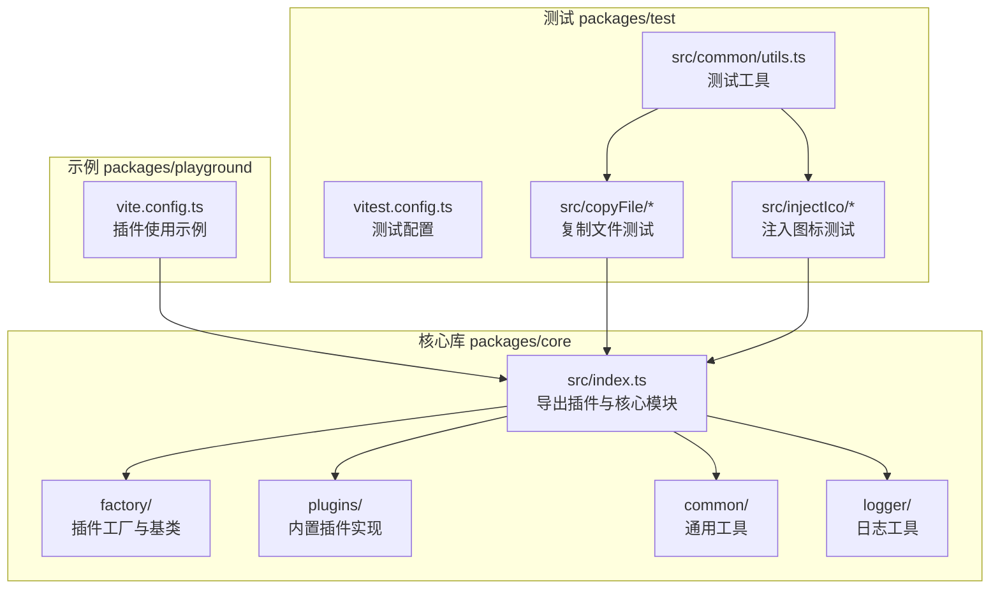
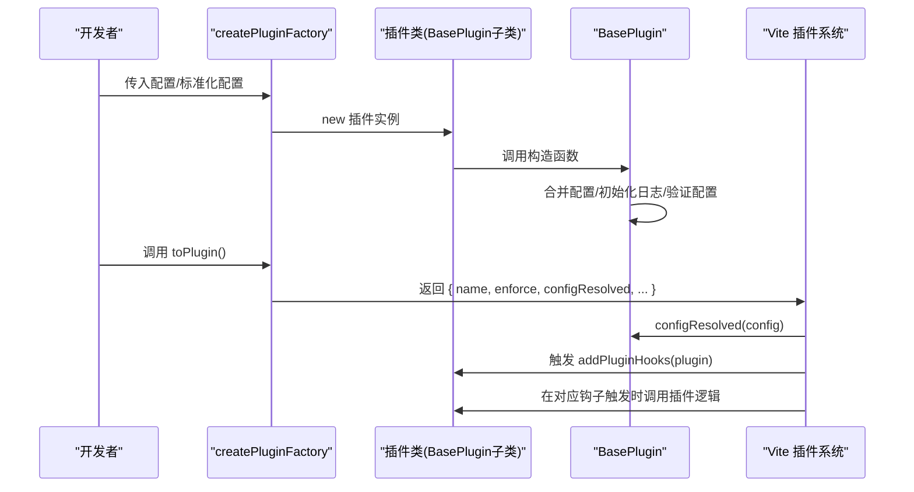
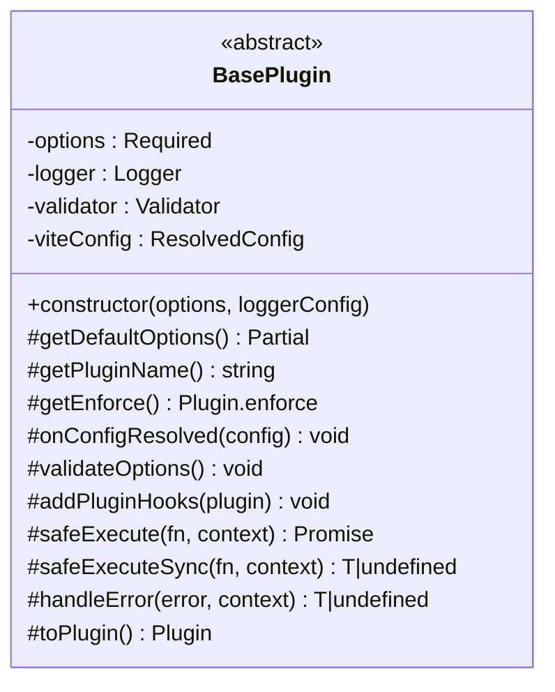
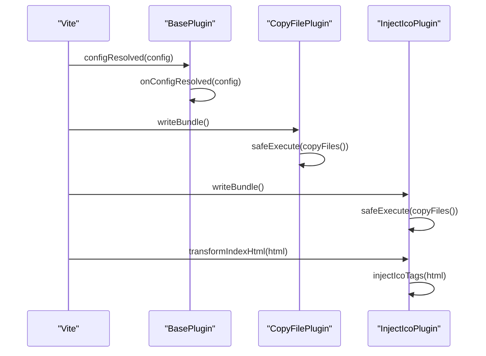
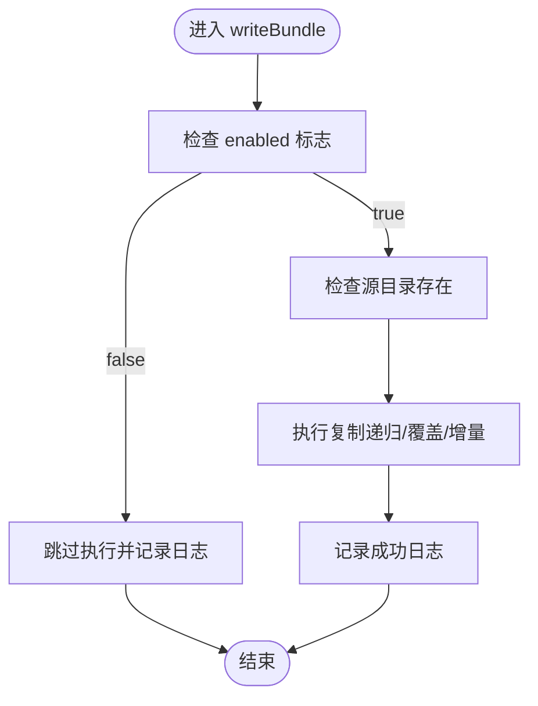
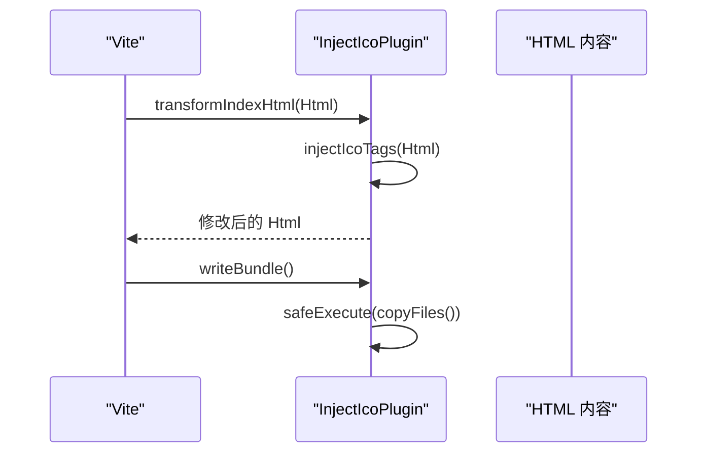
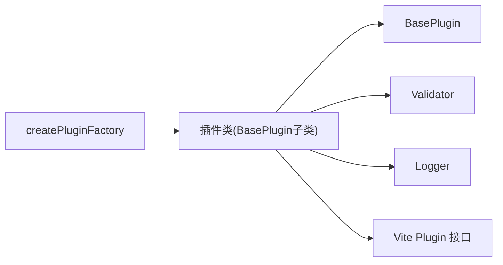

# 自定义插件开发

<cite>
**本文档引用的文件**
- [packages/core/src/factory/plugin/index.ts](file://packages/core/src/factory/plugin/index.ts)
- [packages/core/src/factory/plugin/types.ts](file://packages/core/src/factory/plugin/types.ts)
- [packages/core/src/plugins/copyFile/index.ts](file://packages/core/src/plugins/copyFile/index.ts)
- [packages/core/src/plugins/copyFile/types.ts](file://packages/core/src/plugins/copyFile/types.ts)
- [packages/core/src/plugins/injectIco/index.ts](file://packages/core/src/plugins/injectIco/index.ts)
- [packages/core/src/plugins/injectIco/types.ts](file://packages/core/src/plugins/injectIco/types.ts)
- [packages/core/src/common/validation.ts](file://packages/core/src/common/validation.ts)
- [packages/core/src/logger/index.ts](file://packages/core/src/logger/index.ts)
- [packages/playground/vite.config.ts](file://packages/playground/vite.config.ts)
- [packages/test/src/copyFile/copyFile.test.ts](file://packages/test/src/copyFile/copyFile.test.ts)
- [packages/test/src/injectIco/injectIco.test.ts](file://packages/test/src/injectIco/injectIco.test.ts)
- [packages/test/vitest.config.ts](file://packages/test/vitest.config.ts)
- [packages/test/src/common/utils.ts](file://packages/test/src/common/utils.ts)
- [packages/core/package.json](file://packages/core/package.json)
</cite>

## 目录
1. [简介](#简介)
2. [项目结构](#项目结构)
3. [核心组件](#核心组件)
4. [架构总览](#架构总览)
5. [详细组件分析](#详细组件分析)
6. [依赖分析](#依赖分析)
7. [性能考虑](#性能考虑)
8. [故障排除指南](#故障排除指南)
9. [结论](#结论)
10. [附录](#附录)

## 简介
本指南面向希望基于现有框架开发自定义 Vite 插件的开发者。文档从需求分析、架构设计、代码实现到测试验证提供完整流程，重点讲解如何继承 BasePlugin 抽象类、实现必需的抽象方法（如 getPluginName() 和 addPluginHooks()）、设计插件配置接口（BasePluginOptions 及其扩展）、实现各类钩子函数（如 configResolved、writeBundle、transformIndexHtml 等），并通过 copyFile 与 injectIco 两个真实插件作为范例，演示不同类型的插件开发模式。同时提供测试与调试的最佳实践。

## 项目结构
该项目采用多包工作区结构，核心插件库位于 packages/core，示例与测试分别位于 playground 与 test。核心插件库导出插件集合、通用工具、工厂与日志模块；示例工程展示插件的实际使用；测试工程提供单元与集成测试样例。

图表来源
- [packages/core/src/index.ts](file://packages/core/src/index.ts#L1-L8)
- [packages/playground/vite.config.ts](file://packages/playground/vite.config.ts#L1-L69)
- [packages/test/vitest.config.ts](file://packages/test/vitest.config.ts#L1-L24)

章节来源
- [packages/core/src/index.ts](file://packages/core/src/index.ts#L1-L8)
- [packages/core/package.json](file://packages/core/package.json#L1-L52)

## 核心组件
本节聚焦于插件开发的核心基础设施：BasePlugin 抽象类、插件工厂 createPluginFactory、基础配置接口 BasePluginOptions，以及验证器 Validator 与日志 Logger。

- BasePlugin 抽象类
  - 负责配置合并、日志初始化、配置验证、生命周期钩子注册与错误处理。
  - 子类需实现：getDefaultOptions()、getPluginName()、addPluginHooks()。
  - 提供安全执行方法 safeExecute/safeExecuteSync 与错误策略 errorStrategy。
  - 提供 toPlugin() 将实例转换为 Vite 插件对象。

- 插件工厂 createPluginFactory
  - 接收插件类构造函数与可选的 OptionsNormalizer，返回符合 Vite 规范的 Plugin 对象。
  - 支持字符串或对象等多种输入形式的标准化。

- 基础配置接口 BasePluginOptions
  - enabled: 是否启用插件
  - verbose: 是否输出详细日志
  - errorStrategy: 错误处理策略（throw/log/ignore）

- 验证器 Validator
  - 提供流畅 API 进行字段必填、类型、自定义规则与默认值设置。
  - 在 validateOptions() 中使用，确保配置有效。

- 日志 Logger
  - 统一格式化输出，支持 info/success/warn/error 四种级别。
  - 可通过全局开关与实例开关控制输出。

章节来源
- [packages/core/src/factory/plugin/index.ts](file://packages/core/src/factory/plugin/index.ts#L27-L349)
- [packages/core/src/factory/plugin/types.ts](file://packages/core/src/factory/plugin/types.ts#L1-L46)
- [packages/core/src/common/validation.ts](file://packages/core/src/common/validation.ts#L16-L202)
- [packages/core/src/logger/index.ts](file://packages/core/src/logger/index.ts#L6-L154)

## 架构总览
下图展示了从插件工厂到具体插件类、再到 Vite 生命周期钩子的整体调用链路。

图表来源
- [packages/core/src/factory/plugin/index.ts](file://packages/core/src/factory/plugin/index.ts#L332-L348)
- [packages/core/src/factory/plugin/index.ts](file://packages/core/src/factory/plugin/index.ts#L370-L386)

## 详细组件分析

### BasePlugin 抽象类详解
BasePlugin 是所有插件的基类，提供统一的生命周期管理与错误处理机制。其关键点如下：
- 配置合并：mergeOptions 将基础默认值、插件特定默认值与用户配置深度合并。
- 日志初始化：initLogger 支持传入 Logger 实例或 LoggerOptions。
- 配置验证：validateOptions 为空实现，子类可重写使用 Validator 进行校验。
- 生命周期：toPlugin() 注册 configResolved 钩子，随后调用 addPluginHooks() 注册业务钩子。
- 错误处理：safeExecute/safeExecuteSync + handleError，依据 errorStrategy 决定抛出或忽略错误。

图表来源
- [packages/core/src/factory/plugin/index.ts](file://packages/core/src/factory/plugin/index.ts#L27-L349)

章节来源
- [packages/core/src/factory/plugin/index.ts](file://packages/core/src/factory/plugin/index.ts#L27-L349)

### 插件配置接口设计
- 基础配置 BasePluginOptions
  - enabled/verbose/errorStrategy 由 BasePlugin 统一处理。
- CopyFileOptions
  - 必填：sourceDir、targetDir
  - 可选：overwrite、recursive、incremental
- InjectIcoOptions
  - 可选：base、url、link、icons[]
  - 可选嵌套：copyOptions（含 sourceDir、targetDir、overwrite、recursive）

设计原则
- 所有插件均继承 BasePluginOptions，确保一致的启用、日志与错误策略控制。
- 插件特定配置通过接口扩展，避免污染基础配置。
- 使用 Validator 在 validateOptions() 中进行字段必填、类型与自定义规则校验。

章节来源
- [packages/core/src/factory/plugin/types.ts](file://packages/core/src/factory/plugin/types.ts#L8-L29)
- [packages/core/src/plugins/copyFile/types.ts](file://packages/core/src/plugins/copyFile/types.ts#L8-L43)
- [packages/core/src/plugins/injectIco/types.ts](file://packages/core/src/plugins/injectIco/types.ts#L70-L112)

### 钩子函数实现与使用
- configResolved
  - BasePlugin 已在 toPlugin() 中注册，子类可在 onConfigResolved() 中获取 ResolvedConfig。
- writeBundle
  - CopyFilePlugin 在写入打包产物后执行文件复制。
  - InjectIcoPlugin 在写入打包产物后执行图标文件复制。
- transformIndexHtml
  - InjectIcoPlugin 在 HTML 转换阶段注入图标链接。

图表来源
- [packages/core/src/plugins/copyFile/index.ts](file://packages/core/src/plugins/copyFile/index.ts#L82-L86)
- [packages/core/src/plugins/injectIco/index.ts](file://packages/core/src/plugins/injectIco/index.ts#L123-L131)

章节来源
- [packages/core/src/plugins/copyFile/index.ts](file://packages/core/src/plugins/copyFile/index.ts#L82-L86)
- [packages/core/src/plugins/injectIco/index.ts](file://packages/core/src/plugins/injectIco/index.ts#L123-L131)

### 示例一：复制文件插件（copyFile）
- 继承关系
  - CopyFilePlugin extends BasePlugin<CopyFileOptions>
- 关键实现
  - getDefaultOptions() 提供插件特定默认值（如 overwrite、recursive、incremental）。
  - validateOptions() 使用 Validator 校验 sourceDir、targetDir 等字段。
  - getPluginName() 返回插件标识。
  - addPluginHooks() 注册 writeBundle 钩子，在打包完成后执行复制。
  - copyFiles() 执行实际复制逻辑，支持增量与覆盖策略。
- 配置要点
  - 必填：sourceDir、targetDir
  - 可选：overwrite、recursive、incremental、enabled、verbose、errorStrategy

图表来源
- [packages/core/src/plugins/copyFile/index.ts](file://packages/core/src/plugins/copyFile/index.ts#L58-L80)

章节来源
- [packages/core/src/plugins/copyFile/index.ts](file://packages/core/src/plugins/copyFile/index.ts#L13-L121)
- [packages/core/src/plugins/copyFile/types.ts](file://packages/core/src/plugins/copyFile/types.ts#L8-L43)

### 示例二：注入图标插件（injectIco）
- 继承关系
  - InjectIcoPlugin extends BasePlugin<InjectIcoOptions>
- 关键实现
  - getDefaultOptions() 提供 base 默认值 '/'。
  - validateOptions() 校验基础字段与可选 copyOptions 的内部字段。
  - getPluginName() 返回插件标识。
  - addPluginHooks() 注册 transformIndexHtml 与 writeBundle。
  - injectIcoTags() 注入图标链接到 HTML 的 </head> 前。
  - copyFiles() 在启用时复制图标文件到目标目录。
- 配置要点
  - 可选：base、url、link、icons[]、copyOptions（含 sourceDir、targetDir、overwrite、recursive）
  - 支持字符串形式的工厂标准化器，将字符串视为 base 路径。

图表来源
- [packages/core/src/plugins/injectIco/index.ts](file://packages/core/src/plugins/injectIco/index.ts#L123-L131)
- [packages/core/src/plugins/injectIco/index.ts](file://packages/core/src/plugins/injectIco/index.ts#L48-L82)
- [packages/core/src/plugins/injectIco/index.ts](file://packages/core/src/plugins/injectIco/index.ts#L94-L121)

章节来源
- [packages/core/src/plugins/injectIco/index.ts](file://packages/core/src/plugins/injectIco/index.ts#L14-L169)
- [packages/core/src/plugins/injectIco/types.ts](file://packages/core/src/plugins/injectIco/types.ts#L70-L112)

### 插件工厂与标准化器
- createPluginFactory
  - 将插件类实例转换为 Vite 插件对象，并在对象上挂载 pluginInstance 引用。
- OptionsNormalizer
  - injectIco 支持字符串输入，标准化为 { base: string }。
  - copyFile 不需要标准化器，直接使用对象配置。

章节来源
- [packages/core/src/factory/plugin/index.ts](file://packages/core/src/factory/plugin/index.ts#L370-L386)
- [packages/core/src/plugins/injectIco/index.ts](file://packages/core/src/plugins/injectIco/index.ts#L168-L169)

## 依赖分析
- 组件耦合
  - 插件类强依赖 BasePlugin（继承关系）。
  - 插件类弱依赖通用工具（验证器 Validator、日志 Logger）。
  - 插件工厂与插件类解耦，通过构造函数注入配置。
- 外部依赖
  - Vite 插件系统（Plugin 接口）。
  - Node.js 文件系统 API（用于复制与检查文件）。
- 循环依赖
  - 未发现循环依赖：工厂 -> 插件类 -> 基类 -> 工具，方向单一。

图表来源
- [packages/core/src/factory/plugin/index.ts](file://packages/core/src/factory/plugin/index.ts#L370-L386)
- [packages/core/src/plugins/copyFile/index.ts](file://packages/core/src/plugins/copyFile/index.ts#L2-L5)
- [packages/core/src/plugins/injectIco/index.ts](file://packages/core/src/plugins/injectIco/index.ts#L2-L6)

章节来源
- [packages/core/src/factory/plugin/index.ts](file://packages/core/src/factory/plugin/index.ts#L370-L386)

## 性能考虑
- 增量复制
  - copyFile 与 injectIco 均支持 incremental，避免重复复制，提升二次构建效率。
- 异步执行
  - 使用 safeExecute 包装异步操作，避免阻塞 Vite 构建流程。
- 日志控制
  - 通过 verbose 控制日志输出，减少不必要的 I/O。
- 最小化文件系统操作
  - 在执行前检查源目录存在性，避免无效操作。

## 故障排除指南
- 配置验证失败
  - 症状：抛出“配置验证失败”异常。
  - 排查：检查必填字段、类型与自定义规则；参考插件的 validateOptions() 实现。
- 插件未执行
  - 症状：目标目录无文件或 HTML 未注入。
  - 排查：确认 enabled=true；检查 getEnforce() 返回值；核对钩子注册是否正确。
- 错误处理策略
  - 症状：构建中断或静默失败。
  - 排查：调整 errorStrategy（throw/log/ignore）以适应调试阶段。
- 日志定位
  - 使用 Logger 的 success/info/warn/error 分级输出，结合全局开关与实例开关定位问题。

章节来源
- [packages/core/src/common/validation.ts](file://packages/core/src/common/validation.ts#L195-L201)
- [packages/core/src/factory/plugin/index.ts](file://packages/core/src/factory/plugin/index.ts#L284-L312)
- [packages/core/src/logger/index.ts](file://packages/core/src/logger/index.ts#L101-L117)

## 结论
通过 BasePlugin 抽象类与 createPluginFactory 工厂，本项目为自定义 Vite 插件开发提供了清晰的模板：统一的配置管理、健壮的验证与错误处理、标准的生命周期钩子接入。copyFile 与 injectIco 两个插件展示了文件复制与 HTML 注入两类典型场景，开发者可据此快速扩展更多插件能力。配合完善的测试与调试实践，能够高效地完成从需求到上线的全流程开发。

## 附录

### 从零开始开发自定义插件的步骤
- 需求分析
  - 明确插件目标（如资源复制、HTML 注入、代码转换等）。
  - 确定配置项与默认值，区分基础配置与插件特定配置。
- 架构设计
  - 设计插件配置接口（继承 BasePluginOptions）。
  - 选择合适的 Vite 钩子（如 configResolved、buildStart、resolveId、transform、load、transformIndexHtml、writeBundle 等）。
- 代码实现
  - 新建插件类，继承 BasePlugin<T>。
  - 实现 getDefaultOptions()/getPluginName()/addPluginHooks()。
  - 在 validateOptions() 中使用 Validator 校验配置。
  - 使用 safeExecute/safeExecuteSync 包装异步/同步逻辑。
- 测试验证
  - 编写单元测试与集成测试，覆盖正常流程与边界条件。
  - 使用测试工具创建临时目录与文件，模拟真实场景。
- 文档与发布
  - 更新示例工程与测试用例，补充使用说明。
  - 发布至包管理器，维护版本与变更日志。

### 常用钩子参考
- configResolved：获取解析后的 Vite 配置，适合做环境判断与路径计算。
- writeBundle：在打包产物写入后执行，适合文件复制、资源后处理。
- transformIndexHtml：在 HTML 转换阶段注入标签或修改内容。
- 其他：buildStart、resolveId、load、transform、renderStart、renderError、renderChunk、generateBundle 等，按需选择。

### 测试与调试最佳实践
- 单元测试
  - 使用 Vitest，模拟钩子调用（如 writeBundle/transformIndexHtml）。
  - 使用测试工具创建目录结构与文件，断言复制/注入行为。
- 集成测试
  - 在 playground 中集成插件，观察构建结果与日志输出。
- 调试技巧
  - 将 verbose 设为 true，查看详细日志。
  - 使用 errorStrategy='log' 或 'ignore' 在开发阶段避免中断。
  - 逐步注释与恢复逻辑，缩小问题范围。

章节来源
- [packages/test/src/copyFile/copyFile.test.ts](file://packages/test/src/copyFile/copyFile.test.ts#L39-L218)
- [packages/test/src/injectIco/injectIco.test.ts](file://packages/test/src/injectIco/injectIco.test.ts#L50-L272)
- [packages/playground/vite.config.ts](file://packages/playground/vite.config.ts#L11-L68)
- [packages/test/vitest.config.ts](file://packages/test/vitest.config.ts#L4-L23)
- [packages/test/src/common/utils.ts](file://packages/test/src/common/utils.ts#L9-L81)