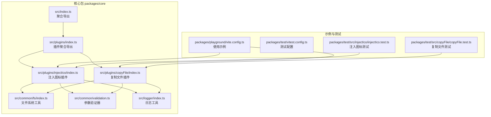
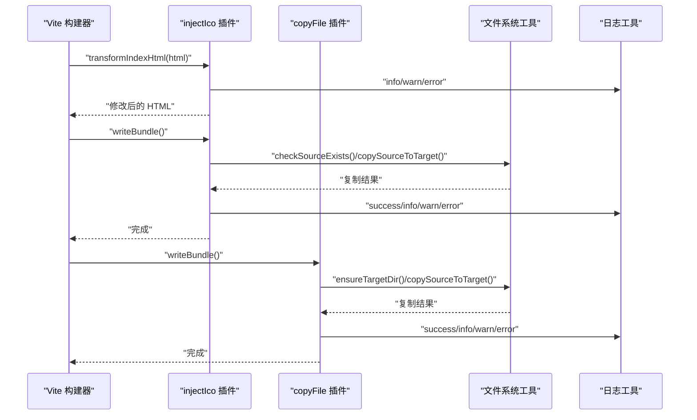
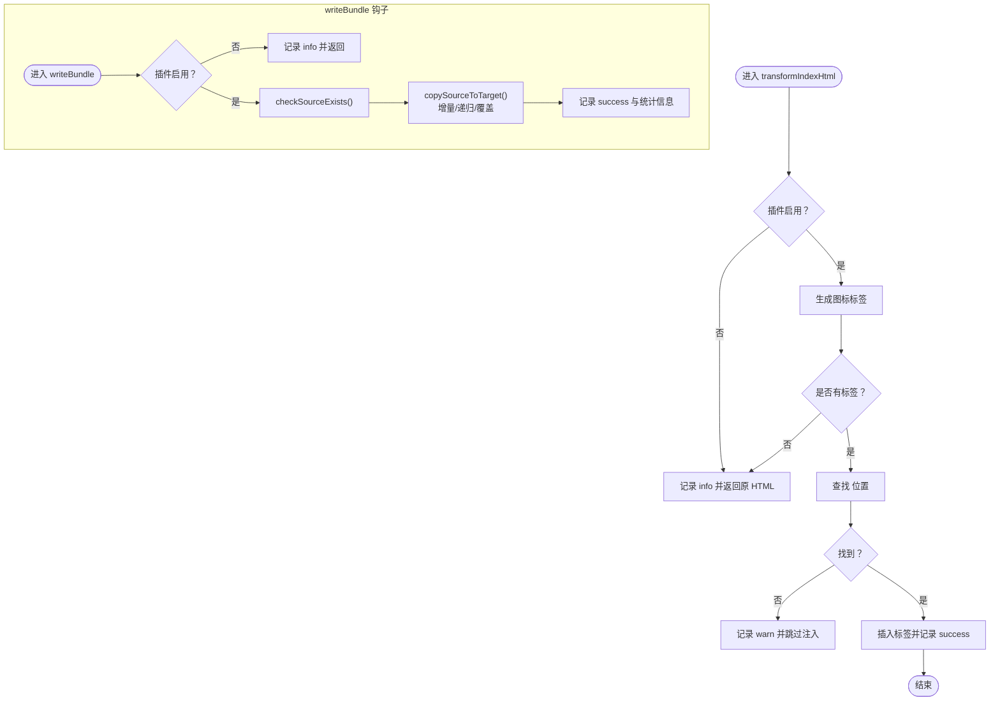
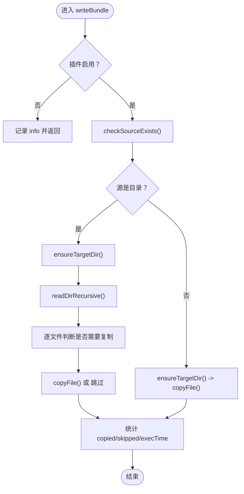
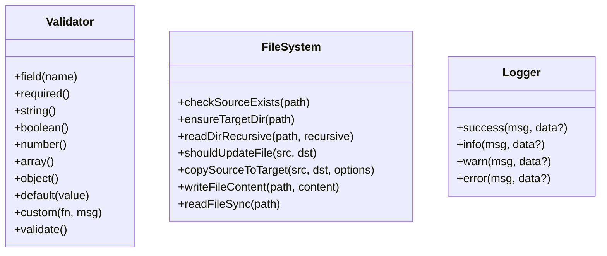
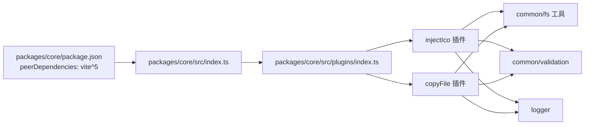

# 故障排除

<cite>
**本文引用的文件**
- [packages/core/package.json](file://packages/core/package.json)
- [packages/core/src/index.ts](file://packages/core/src/index.ts)
- [packages/core/src/logger/index.ts](file://packages/core/src/logger/index.ts)
- [packages/core/src/plugins/index.ts](file://packages/core/src/plugins/index.ts)
- [packages/core/src/plugins/injectIco/index.ts](file://packages/core/src/plugins/injectIco/index.ts)
- [packages/core/src/plugins/injectIco/types.ts](file://packages/core/src/plugins/injectIco/types.ts)
- [packages/core/src/plugins/copyFile/index.ts](file://packages/core/src/plugins/copyFile/index.ts)
- [packages/core/src/plugins/copyFile/types.ts](file://packages/core/src/plugins/copyFile/types.ts)
- [packages/core/src/common/validation.ts](file://packages/core/src/common/validation.ts)
- [packages/core/src/common/fs/index.ts](file://packages/core/src/common/fs/index.ts)
- [packages/playground/vite.config.ts](file://packages/playground/vite.config.ts)
- [packages/test/vitest.config.ts](file://packages/test/vitest.config.ts)
- [packages/test/src/injectIco/injectIco.test.ts](file://packages/test/src/injectIco/injectIco.test.ts)
- [packages/test/src/copyFile/copyFile.test.ts](file://packages/test/src/copyFile/copyFile.test.ts)
- [packages/docs/src/plugins/inject-ico.md](file://packages/docs/src/plugins/inject-ico.md)
- [packages/docs/src/plugins/copy-file.md](file://packages/docs/src/plugins/copy-file.md)
- [README.md](file://README.md)
</cite>

## 目录
1. [简介](#简介)
2. [项目结构](#项目结构)
3. [核心组件](#核心组件)
4. [架构总览](#架构总览)
5. [详细组件分析](#详细组件分析)
6. [依赖分析](#依赖分析)
7. [性能考虑](#性能考虑)
8. [故障排除指南](#故障排除指南)
9. [结论](#结论)
10. [附录](#附录)

## 简介
本指南面向使用 @meng-xi/vite-plugin 的开发者，聚焦于常见问题的系统性排查与解决，涵盖插件不生效、配置错误、构建失败、性能问题诊断与优化、版本兼容与升级注意事项，以及预防性措施与最佳实践。文档以仓库现有实现为依据，结合日志、错误处理策略与测试用例，提供可操作的调试方法与工具使用建议。

## 项目结构
该项目采用多包工作区结构，核心插件位于 packages/core，示例与测试分别位于 packages/playground 与 packages/test，配套文档位于 packages/docs。核心导出入口统一从 plugins 聚合导出，便于按需引入。

**图表来源**
- [packages/core/src/index.ts](file://packages/core/src/index.ts#L1-L2)
- [packages/core/src/plugins/index.ts](file://packages/core/src/plugins/index.ts#L1-L3)
- [packages/core/src/plugins/injectIco/index.ts](file://packages/core/src/plugins/injectIco/index.ts#L1-L178)
- [packages/core/src/plugins/copyFile/index.ts](file://packages/core/src/plugins/copyFile/index.ts#L1-L116)
- [packages/core/src/common/fs/index.ts](file://packages/core/src/common/fs/index.ts#L1-L241)
- [packages/core/src/common/validation.ts](file://packages/core/src/common/validation.ts#L1-L203)
- [packages/core/src/logger/index.ts](file://packages/core/src/logger/index.ts#L1-L131)
- [packages/playground/vite.config.ts](file://packages/playground/vite.config.ts#L1-L69)
- [packages/test/vitest.config.ts](file://packages/test/vitest.config.ts#L1-L24)

**章节来源**
- [packages/core/src/index.ts](file://packages/core/src/index.ts#L1-L2)
- [packages/core/src/plugins/index.ts](file://packages/core/src/plugins/index.ts#L1-L3)
- [packages/playground/vite.config.ts](file://packages/playground/vite.config.ts#L1-L69)

## 核心组件
- 插件聚合导出：通过 src/index.ts 与 src/plugins/index.ts 将 injectIco 与 copyFile 聚合导出，便于统一引入。
- 注入图标插件（injectIco）：在 HTML transformIndexHtml 阶段注入图标链接；在 writeBundle 阶段可选地复制图标文件。
- 复制文件插件（copyFile）：在构建完成后执行文件/目录复制，支持递归、覆盖与增量复制。
- 文件系统工具：提供源文件存在性检查、目标目录创建、递归读取、增量判断与复制执行。
- 参数验证器：提供链式验证 API，支持必填、类型、默认值与自定义校验。
- 日志工具：统一输出 info/success/warn/error 四类日志，带时间戳与插件前缀，便于问题定位。

**章节来源**
- [packages/core/src/plugins/injectIco/index.ts](file://packages/core/src/plugins/injectIco/index.ts#L1-L178)
- [packages/core/src/plugins/copyFile/index.ts](file://packages/core/src/plugins/copyFile/index.ts#L1-L116)
- [packages/core/src/common/fs/index.ts](file://packages/core/src/common/fs/index.ts#L1-L241)
- [packages/core/src/common/validation.ts](file://packages/core/src/common/validation.ts#L1-L203)
- [packages/core/src/logger/index.ts](file://packages/core/src/logger/index.ts#L1-L131)

## 架构总览
以下序列图展示两个插件在 Vite 生命周期中的典型调用顺序与错误处理策略：

**图表来源**
- [packages/core/src/plugins/injectIco/index.ts](file://packages/core/src/plugins/injectIco/index.ts#L130-L138)
- [packages/core/src/plugins/copyFile/index.ts](file://packages/core/src/plugins/copyFile/index.ts#L77-L81)
- [packages/core/src/common/fs/index.ts](file://packages/core/src/common/fs/index.ts#L98-L202)
- [packages/core/src/logger/index.ts](file://packages/core/src/logger/index.ts#L78-L130)

## 详细组件分析

### 注入图标插件（injectIco）
- 功能要点
  - transformIndexHtml 阶段：根据配置生成图标标签并注入到 HTML 的 head 区域。
  - writeBundle 阶段：可选复制图标文件至目标目录，支持增量复制、递归与覆盖。
  - 配置优先级：link > icons > url > base；当未找到 head 标签时输出警告并跳过注入。
- 关键流程
  - 选项标准化与验证：支持字符串 base 或完整配置对象；对 copyOptions 进行二次验证。
  - HTML 注入：查找 head 结束标签，避免重复注入。
  - 文件复制：检查源存在性，逐文件判断是否需要复制，统计复制/跳过数量与耗时。
- 错误处理策略
  - 配置验证失败抛出错误。
  - 文件系统错误区分源不存在、权限不足等具体原因。
  - 日志输出包含详细上下文，便于定位问题。

**图表来源**
- [packages/core/src/plugins/injectIco/index.ts](file://packages/core/src/plugins/injectIco/index.ts#L55-L89)
- [packages/core/src/plugins/injectIco/index.ts](file://packages/core/src/plugins/injectIco/index.ts#L101-L128)
- [packages/core/src/common/fs/index.ts](file://packages/core/src/common/fs/index.ts#L10-L23)
- [packages/core/src/common/fs/index.ts](file://packages/core/src/common/fs/index.ts#L98-L202)

**章节来源**
- [packages/core/src/plugins/injectIco/index.ts](file://packages/core/src/plugins/injectIco/index.ts#L1-L178)
- [packages/core/src/plugins/injectIco/types.ts](file://packages/core/src/plugins/injectIco/types.ts#L1-L113)
- [packages/docs/src/plugins/inject-ico.md](file://packages/docs/src/plugins/inject-ico.md#L1-L258)

### 复制文件插件（copyFile）
- 功能要点
  - enforce: 'post' 确保在其他构建任务之后执行。
  - 支持 sourceDir/targetDir 必填校验、非空字符串限制、默认值与自定义校验。
  - 增量复制：基于修改时间与文件大小判断是否需要复制。
- 关键流程
  - 选项验证：必填字段、类型与自定义非空校验。
  - 目录/文件复制：递归读取、逐文件判断、权限与错误分类处理。
  - 结果统计：复制/跳过数量与执行耗时。

**图表来源**
- [packages/core/src/plugins/copyFile/index.ts](file://packages/core/src/plugins/copyFile/index.ts#L53-L75)
- [packages/core/src/common/fs/index.ts](file://packages/core/src/common/fs/index.ts#L98-L202)

**章节来源**
- [packages/core/src/plugins/copyFile/index.ts](file://packages/core/src/plugins/copyFile/index.ts#L1-L116)
- [packages/core/src/plugins/copyFile/types.ts](file://packages/core/src/plugins/copyFile/types.ts#L1-L44)
- [packages/docs/src/plugins/copy-file.md](file://packages/docs/src/plugins/copy-file.md#L1-L159)

### 工厂与通用工具
- 参数验证器（Validator）：提供流畅 API，支持 required/string/boolean/number/array/object/default/custom/validate。
- 文件系统工具（fs）：封装源检查、目标目录创建、递归读取、增量判断与复制执行，统一错误分类与抛出。
- 日志工具（Logger）：统一输出格式，带时间戳与插件前缀，支持 info/success/warn/error。

**图表来源**
- [packages/core/src/common/validation.ts](file://packages/core/src/common/validation.ts#L16-L203)
- [packages/core/src/common/fs/index.ts](file://packages/core/src/common/fs/index.ts#L10-L241)
- [packages/core/src/logger/index.ts](file://packages/core/src/logger/index.ts#L6-L131)

**章节来源**
- [packages/core/src/common/validation.ts](file://packages/core/src/common/validation.ts#L1-L203)
- [packages/core/src/common/fs/index.ts](file://packages/core/src/common/fs/index.ts#L1-L241)
- [packages/core/src/logger/index.ts](file://packages/core/src/logger/index.ts#L1-L131)

## 依赖分析
- 版本与运行时依赖
  - peerDependencies: vite ^5.0.0，确保与 Vite 主版本兼容。
  - devDependencies: unbuild、typescript、@types/node 等，用于构建与类型检查。
- 导出与入口
  - exports 映射到 dist 下的 cjs/mjs/dts，保证 Node 与 ESM 场景可用。
- 插件间耦合
  - 两个插件均依赖通用工具（fs、validation、logger），保持低耦合高内聚。
  - 插件通过 Vite 生命周期钩子与文件系统交互，避免直接耦合外部框架。

**图表来源**
- [packages/core/package.json](file://packages/core/package.json#L32-L34)
- [packages/core/src/index.ts](file://packages/core/src/index.ts#L1-L2)
- [packages/core/src/plugins/index.ts](file://packages/core/src/plugins/index.ts#L1-L3)
- [packages/core/src/plugins/injectIco/index.ts](file://packages/core/src/plugins/injectIco/index.ts#L1-L178)
- [packages/core/src/plugins/copyFile/index.ts](file://packages/core/src/plugins/copyFile/index.ts#L1-L116)
- [packages/core/src/common/fs/index.ts](file://packages/core/src/common/fs/index.ts#L1-L241)
- [packages/core/src/common/validation.ts](file://packages/core/src/common/validation.ts#L1-L203)
- [packages/core/src/logger/index.ts](file://packages/core/src/logger/index.ts#L1-L131)

**章节来源**
- [packages/core/package.json](file://packages/core/package.json#L1-L52)
- [packages/core/src/index.ts](file://packages/core/src/index.ts#L1-L2)
- [packages/core/src/plugins/index.ts](file://packages/core/src/plugins/index.ts#L1-L3)

## 性能考虑
- 增量复制（推荐）
  - copyFile 与 injectIco 均支持增量复制，仅复制修改过的文件，显著降低重复构建耗时。
  - 建议在生产构建中启用，开发构建中可按需关闭以减少 IO。
- 递归与覆盖策略
  - 递归复制可避免遗漏子目录，但会增加 IO；覆盖策略影响磁盘写入次数。
- 日志开销
  - verbose=true 会输出大量日志，有助于调试但会增加 I/O 与 CPU 开销；建议在 CI/生产构建中关闭。
- 并发与批处理
  - 文件复制采用逐文件判断与复制，避免不必要的写入；如需进一步优化，可在上层构建工具中并行化任务。

[本节为通用性能建议，无需特定文件引用]

## 故障排除指南

### 一、插件不生效
- 症状
  - HTML 中未注入图标标签；或目标目录未生成预期文件。
- 排查步骤
  - 检查插件是否启用：确认 enabled 为 true。
  - 检查配置优先级：若提供 link 或 icons，将覆盖 url/base；若仅提供 base，将使用 base + favicon.ico。
  - 检查 HTML 结构：若未找到 </head>，插件会跳过注入并输出警告。
  - 检查 copyOptions：injectIco 的图标复制需显式提供 copyOptions 才会执行。
- 参考实现
  - HTML 注入与 head 标签检测、warn 跳过逻辑。
  - copyOptions 存在性与复制执行逻辑。

**章节来源**
- [packages/core/src/plugins/injectIco/index.ts](file://packages/core/src/plugins/injectIco/index.ts#L55-L89)
- [packages/core/src/plugins/injectIco/index.ts](file://packages/core/src/plugins/injectIco/index.ts#L101-L128)
- [packages/docs/src/plugins/inject-ico.md](file://packages/docs/src/plugins/inject-ico.md#L243-L258)

### 二、配置错误
- 症状
  - 构建启动即报错，提示配置验证失败。
- 排查步骤
  - copyFile：sourceDir/targetDir 必填且不可为空字符串；验证器会抛出明确错误。
  - injectIco：当提供 copyOptions 时，需包含 sourceDir/targetDir；否则验证失败。
  - 自定义校验：使用 custom 规则可添加非空字符串等约束。
- 参考实现
  - copyFile 验证链与自定义非空校验。
  - injectIco 对 copyOptions 的二次验证。

**章节来源**
- [packages/core/src/plugins/copyFile/index.ts](file://packages/core/src/plugins/copyFile/index.ts#L14-L35)
- [packages/core/src/common/validation.ts](file://packages/core/src/common/validation.ts#L177-L188)
- [packages/core/src/plugins/injectIco/index.ts](file://packages/core/src/plugins/injectIco/index.ts#L28-L40)

### 三、构建失败（文件系统相关）
- 症状
  - 报错“源文件不存在”“没有权限访问”“创建目录失败”等。
- 排查步骤
  - 确认 sourceDir 存在且可读；若不存在，修正路径或准备文件。
  - 检查权限：确保构建进程对源目录与目标目录具有读写权限。
  - 目标目录自动创建：若 targetDir 不存在，工具会尝试创建。
- 参考实现
  - 源检查、目标目录创建与错误分类抛出。

**章节来源**
- [packages/core/src/common/fs/index.ts](file://packages/core/src/common/fs/index.ts#L10-L23)
- [packages/core/src/common/fs/index.ts](file://packages/core/src/common/fs/index.ts#L30-L41)
- [packages/core/src/common/fs/index.ts](file://packages/core/src/common/fs/index.ts#L210-L241)

### 四、性能问题（构建速度与内存）
- 症状
  - 构建时间过长；内存占用偏高。
- 排查与优化
  - 启用增量复制：在 copyFile 与 injectIco 中均支持 incremental=true，减少重复写入。
  - 关闭详细日志：将 verbose=false 以降低 I/O 与 CPU 开销。
  - 控制递归范围：recursive=false 可减少扫描与复制的文件数量。
  - 分离任务：将大目录复制拆分为多个小任务，避免一次性复制过多文件。
- 参考实现
  - 增量判断 shouldUpdateFile 与复制统计。

**章节来源**
- [packages/core/src/common/fs/index.ts](file://packages/core/src/common/fs/index.ts#L77-L88)
- [packages/core/src/common/fs/index.ts](file://packages/core/src/common/fs/index.ts#L146-L156)
- [packages/docs/src/plugins/copy-file.md](file://packages/docs/src/plugins/copy-file.md#L143-L159)

### 五、版本兼容性与升级注意事项
- 兼容性
  - peerDependencies 指定 vite ^5.0.0，升级 Vite 时需确保主版本匹配。
- 升级建议
  - 升级前先运行测试，确保插件行为不变。
  - 关注 Vite 生命周期钩子变化，必要时调整插件实现。
- 参考实现
  - 依赖声明与导出配置。

**章节来源**
- [packages/core/package.json](file://packages/core/package.json#L32-L34)
- [packages/core/package.json](file://packages/core/package.json#L16-L22)

### 六、日志分析与错误追踪
- 日志级别
  - info：常规信息与跳过提示（如插件禁用、未找到 head 标签）。
  - success：成功执行（如注入标签数、复制统计）。
  - warn：警告（如跳过注入）。
  - error：错误（如配置验证失败、文件系统异常）。
- 调试技巧
  - 将 verbose 设为 true 以获取详细执行日志。
  - 结合测试用例定位边界情况（如无 head 标签、禁用插件、空 icons 等）。
- 参考实现
  - 日志输出格式与前缀生成。
  - 测试用例覆盖多种边界场景。

**章节来源**
- [packages/core/src/logger/index.ts](file://packages/core/src/logger/index.ts#L63-L130)
- [packages/test/src/injectIco/injectIco.test.ts](file://packages/test/src/injectIco/injectIco.test.ts#L206-L242)
- [packages/test/src/injectIco/injectIco.test.ts](file://packages/test/src/injectIco/injectIco.test.ts#L135-L183)
- [packages/test/src/copyFile/copyFile.test.ts](file://packages/test/src/copyFile/copyFile.test.ts#L181-L203)

### 七、社区支持与获取帮助
- 问题反馈
  - 通过仓库 Issues 页面提交问题与建议。
- 文档与示例
  - 官方文档与示例配置文件可作为参考。
- 参考实现
  - 仓库 README 与 playground 配置。

**章节来源**
- [README.md](file://README.md#L1-L85)
- [packages/playground/vite.config.ts](file://packages/playground/vite.config.ts#L1-L69)

## 结论
本指南基于仓库现有实现，总结了插件不生效、配置错误、构建失败、性能问题与版本兼容等常见问题的系统性排查方法。通过日志分析、错误追踪与测试用例辅助定位，配合增量复制、递归与覆盖策略的合理配置，可有效提升构建稳定性与效率。建议在开发与生产环境中分别采用不同的日志与复制策略，以平衡可观测性与性能。

## 附录

### A. 常见问题速查表
- 问题：HTML 未注入图标
  - 检查 enabled、head 标签、icons/link/url/base 优先级。
- 问题：复制失败
  - 检查 sourceDir 存在性、权限与 targetDir 创建。
- 问题：构建慢
  - 启用增量复制、关闭详细日志、控制递归范围。
- 问题：升级后不兼容
  - 确认 vite 主版本匹配，运行测试验证。

**章节来源**
- [packages/docs/src/plugins/inject-ico.md](file://packages/docs/src/plugins/inject-ico.md#L243-L258)
- [packages/docs/src/plugins/copy-file.md](file://packages/docs/src/plugins/copy-file.md#L143-L159)
- [packages/core/package.json](file://packages/core/package.json#L32-L34)

### B. 最佳实践清单
- 配置层面
  - 明确启用/禁用策略，按环境动态开关。
  - 使用 copyOptions 时提供完整 sourceDir/targetDir。
- 性能层面
  - 生产构建启用增量复制；开发构建按需开启详细日志。
  - 合理设置 recursive 与 overwrite，避免不必要的 IO。
- 可靠性层面
  - 在 CI 中运行测试，覆盖边界场景。
  - 使用统一日志输出，便于问题复现与追踪。

**章节来源**
- [packages/test/src/injectIco/injectIco.test.ts](file://packages/test/src/injectIco/injectIco.test.ts#L1-L273)
- [packages/test/src/copyFile/copyFile.test.ts](file://packages/test/src/copyFile/copyFile.test.ts#L1-L219)
- [packages/core/src/logger/index.ts](file://packages/core/src/logger/index.ts#L1-L131)