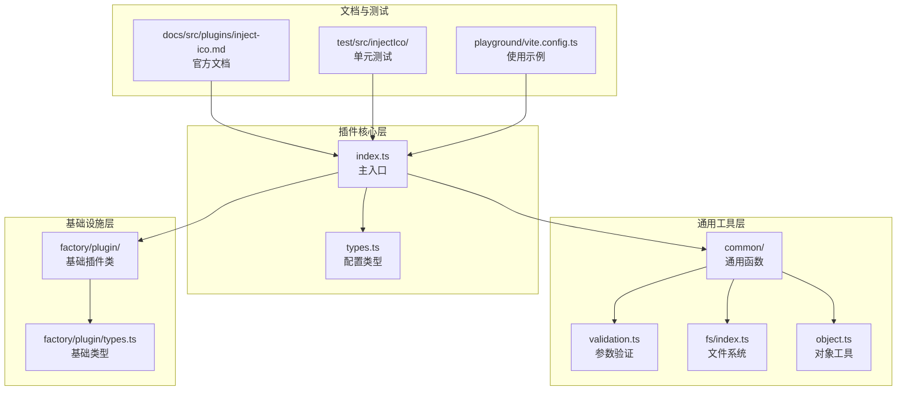
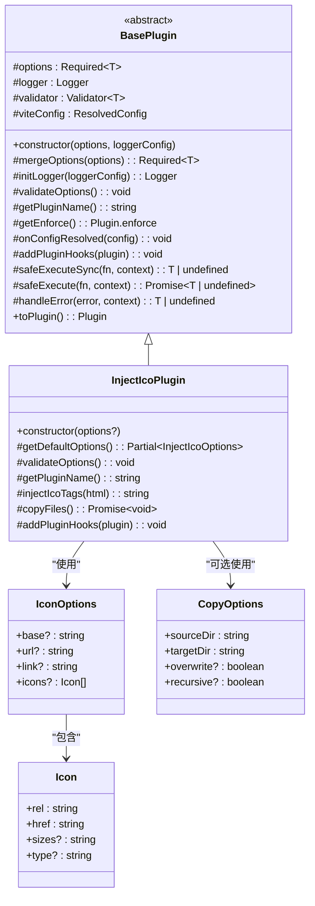
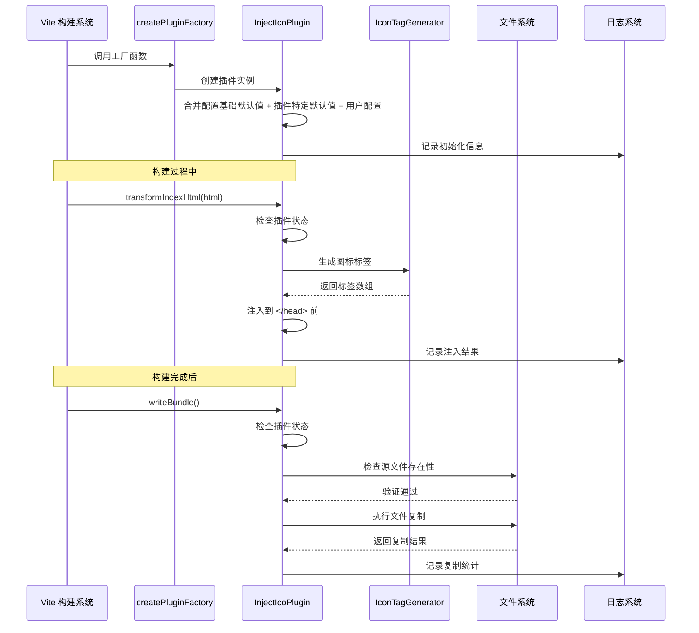
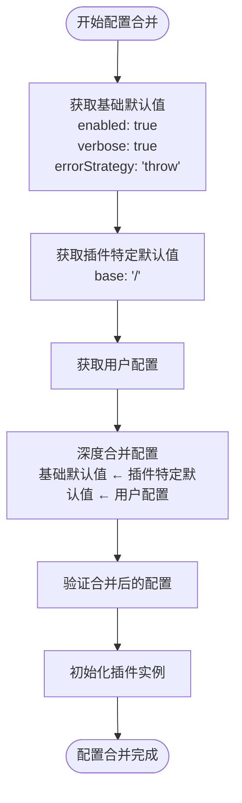
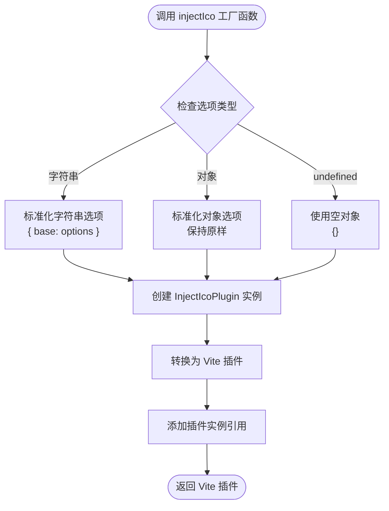
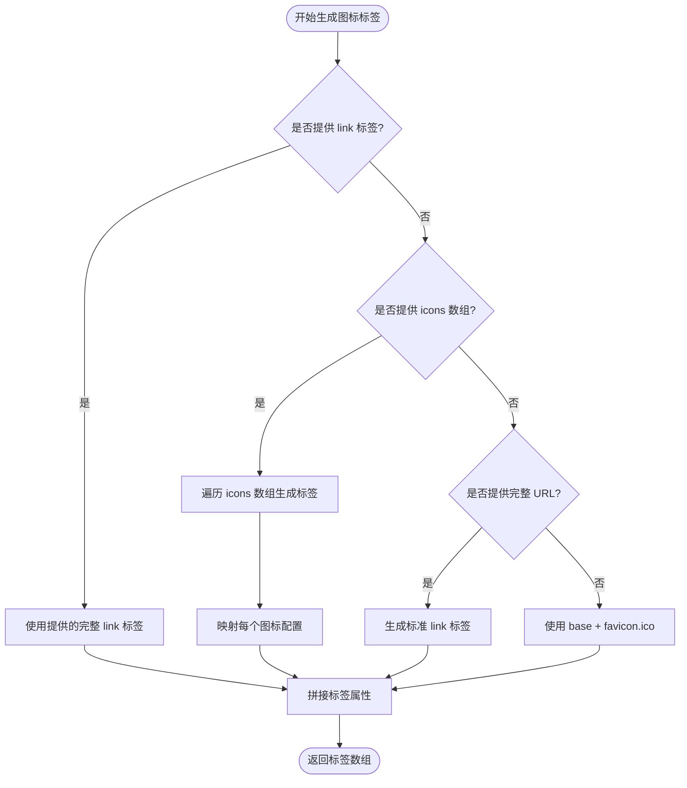
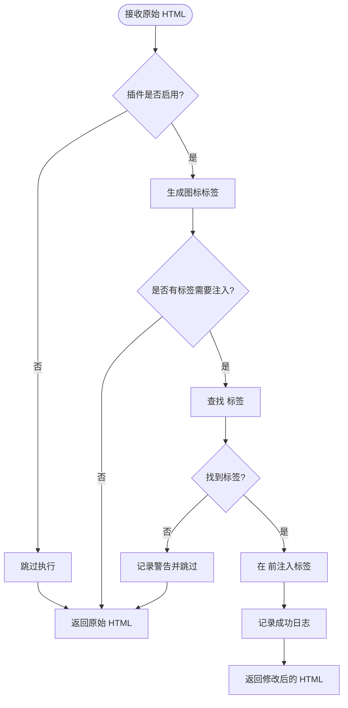
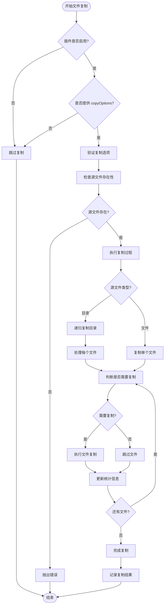
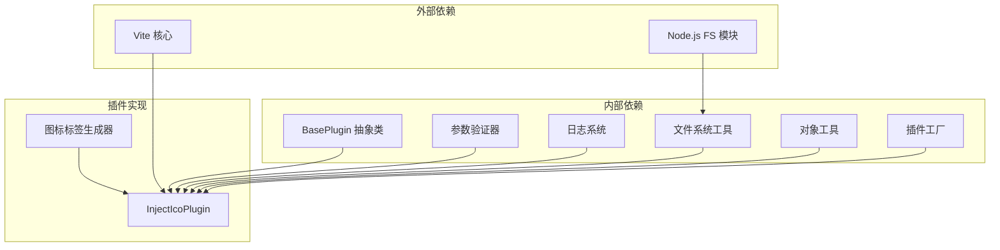

# 图标注入插件 (injectIco)

<cite>
**本文档引用的文件**
- [packages/core/src/plugins/injectIco/index.ts](file://packages/core/src/plugins/injectIco/index.ts)
- [packages/core/src/plugins/injectIco/types.ts](file://packages/core/src/plugins/injectIco/types.ts)
- [packages/core/src/plugins/injectIco/common/index.ts](file://packages/core/src/plugins/injectIco/common/index.ts)
- [packages/core/src/plugins/injectIco/common/type.ts](file://packages/core/src/plugins/injectIco/common/type.ts)
- [packages/core/src/factory/plugin/index.ts](file://packages/core/src/factory/plugin/index.ts)
- [packages/core/src/factory/plugin/types.ts](file://packages/core/src/factory/plugin/types.ts)
- [packages/core/src/common/validation.ts](file://packages/core/src/common/validation.ts)
- [packages/core/src/common/fs/index.ts](file://packages/core/src/common/fs/index.ts)
- [packages/core/src/common/object.ts](file://packages/core/src/common/object.ts)
- [packages/docs/src/plugins/inject-ico.md](file://packages/docs/src/plugins/inject-ico.md)
- [packages/test/src/injectIco/injectIco.test.ts](file://packages/test/src/injectIco/injectIco.test.ts)
- [packages/playground/vite.config.ts](file://packages/playground/vite.config.ts)
- [packages/core/src/plugins/copyFile/types.ts](file://packages/core/src/plugins/copyFile/types.ts)
- [packages/core/package.json](file://packages/core/package.json)
</cite>

## 更新摘要
**变更内容**
- 新增 InjectIcoPlugin 的 `getDefaultOptions()` 方法，提供 base 路径默认配置
- 使用增强的 `createPluginFactory` 函数简化配置处理，支持字符串或对象配置
- 改进配置合并机制，实现基础默认值、插件特定默认值和用户配置的三层合并

## 目录
1. [简介](#简介)
2. [项目结构](#项目结构)
3. [核心组件](#核心组件)
4. [架构总览](#架构总览)
5. [详细组件分析](#详细组件分析)
6. [依赖分析](#依赖分析)
7. [性能考虑](#性能考虑)
8. [故障排除指南](#故障排除指南)
9. [结论](#结论)
10. [附录](#附录)

## 简介
injectIco 插件是一个专为 Vite 设计的图标注入工具，能够在构建过程中自动将网站图标链接注入到 HTML 文件的 `<head>` 区域，并可选地将图标文件复制到目标目录。该插件支持多种配置方式：
- 基于基础路径的默认图标注入
- 完整 URL 的直接注入
- 自定义 link 标签的完全控制
- 多格式图标数组配置（支持不同尺寸和 MIME 类型）
- 与文件复制插件的集成使用

**最新改进**：插件现已实现 `getDefaultOptions()` 方法提供默认配置，并通过增强的 `createPluginFactory` 函数简化配置处理，使使用更加便捷。

插件采用模块化设计，通过统一的工厂模式和基础插件抽象类实现，具备完善的配置验证、错误处理和日志记录能力。

## 项目结构
injectIco 插件位于插件库的核心包中，采用清晰的分层架构：



**图表来源**
- [packages/core/src/plugins/injectIco/index.ts](file://packages/core/src/plugins/injectIco/index.ts#L1-L169)
- [packages/core/src/plugins/injectIco/types.ts](file://packages/core/src/plugins/injectIco/types.ts#L1-L113)
- [packages/core/src/plugins/injectIco/common/index.ts](file://packages/core/src/plugins/injectIco/common/index.ts#L1-L41)

**章节来源**
- [packages/core/src/plugins/injectIco/index.ts](file://packages/core/src/plugins/injectIco/index.ts#L1-L169)
- [packages/core/src/plugins/injectIco/types.ts](file://packages/core/src/plugins/injectIco/types.ts#L1-L113)

## 核心组件
injectIco 插件由以下核心组件构成：

### 主要类结构


**图表来源**
- [packages/core/src/factory/plugin/index.ts](file://packages/core/src/factory/plugin/index.ts#L27-L348)
- [packages/core/src/plugins/injectIco/index.ts](file://packages/core/src/plugins/injectIco/index.ts#L14-L132)
- [packages/core/src/plugins/injectIco/types.ts](file://packages/core/src/plugins/injectIco/types.ts#L66-L113)

### 配置体系
插件采用分层配置设计，支持灵活的配置组合：

| 配置层级 | 选项 | 类型 | 默认值 | 优先级 |
|---------|------|------|--------|--------|
| 基础配置 | enabled | boolean | true | 最低 |
| 基础配置 | verbose | boolean | true | 最低 |
| 基础配置 | errorStrategy | 'throw' \| 'log' \| 'ignore' | 'throw' | 最低 |
| 插件特定默认 | base | string | '/' | 中等 |
| 图标配置 | url | string | undefined | 高 |
| 图标配置 | link | string | undefined | 最高 |
| 图标配置 | icons | Icon[] | undefined | 中等 |
| 文件复制 | copyOptions | CopyOptions | undefined | 仅在提供时生效 |

**更新**：新增插件特定默认配置层，通过 `getDefaultOptions()` 方法提供 base 路径的默认值 '/'。

**章节来源**
- [packages/core/src/plugins/injectIco/types.ts](file://packages/core/src/plugins/injectIco/types.ts#L66-L113)
- [packages/core/src/factory/plugin/types.ts](file://packages/core/src/factory/plugin/types.ts#L8-L29)
- [packages/core/src/plugins/injectIco/index.ts](file://packages/core/src/plugins/injectIco/index.ts#L15-L19)

## 架构总览
injectIco 插件遵循 Vite 插件生命周期，通过钩子函数实现图标注入和文件复制功能：



**图表来源**
- [packages/core/src/plugins/injectIco/index.ts](file://packages/core/src/plugins/injectIco/index.ts#L123-L131)
- [packages/core/src/plugins/injectIco/common/index.ts](file://packages/core/src/plugins/injectIco/common/index.ts#L9-L40)
- [packages/core/src/factory/plugin/index.ts](file://packages/core/src/factory/plugin/index.ts#L369-L385)

## 详细组件分析

### 配置合并机制
**更新**：插件现在使用三层配置合并机制，提供更灵活的配置管理：



**图表来源**
- [packages/core/src/factory/plugin/index.ts](file://packages/core/src/factory/plugin/index.ts#L108-L118)
- [packages/core/src/plugins/injectIco/index.ts](file://packages/core/src/plugins/injectIco/index.ts#L15-L19)

### 工厂函数增强
**更新**：使用增强的 `createPluginFactory` 函数简化配置处理：



**图表来源**
- [packages/core/src/plugins/injectIco/index.ts](file://packages/core/src/plugins/injectIco/index.ts#L168)
- [packages/core/src/factory/plugin/index.ts](file://packages/core/src/factory/plugin/index.ts#L369-L385)

### 图标标签生成器
图标标签生成器负责根据配置选项生成相应的 HTML `<link>` 标签：



**图表来源**
- [packages/core/src/plugins/injectIco/common/index.ts](file://packages/core/src/plugins/injectIco/common/index.ts#L9-L40)

### HTML 注入流程
插件通过 Vite 的 `transformIndexHtml` 钩子实现 HTML 注入：



**图表来源**
- [packages/core/src/plugins/injectIco/index.ts](file://packages/core/src/plugins/injectIco/index.ts#L48-L82)

### 文件复制机制
文件复制功能基于统一的文件系统抽象层实现：



**图表来源**
- [packages/core/src/plugins/injectIco/index.ts](file://packages/core/src/plugins/injectIco/index.ts#L94-L121)
- [packages/core/src/common/fs/index.ts](file://packages/core/src/common/fs/index.ts#L98-L202)

**章节来源**
- [packages/core/src/plugins/injectIco/common/index.ts](file://packages/core/src/plugins/injectIco/common/index.ts#L1-L41)
- [packages/core/src/plugins/injectIco/index.ts](file://packages/core/src/plugins/injectIco/index.ts#L48-L121)

## 依赖分析
injectIco 插件的依赖关系体现了清晰的分层架构：



**图表来源**
- [packages/core/src/plugins/injectIco/index.ts](file://packages/core/src/plugins/injectIco/index.ts#L1-L6)
- [packages/core/src/factory/plugin/index.ts](file://packages/core/src/factory/plugin/index.ts#L1-L5)

### 关键依赖说明
- **BasePlugin**: 提供插件生命周期管理和配置验证
- **Validator**: 实现流畅的 API 验证机制
- **Logger**: 统一日志记录和错误处理
- **FS Utils**: 抽象文件系统操作，支持增量复制
- **Object Utils**: 提供深度合并功能，支持三层配置合并
- **Factory**: 增强的插件工厂函数，简化配置处理
- **Icon Generator**: 专门的图标标签生成逻辑

**章节来源**
- [packages/core/src/plugins/injectIco/index.ts](file://packages/core/src/plugins/injectIco/index.ts#L1-L6)
- [packages/core/src/factory/plugin/index.ts](file://packages/core/src/factory/plugin/index.ts#L1-L5)

## 性能考虑
injectIco 插件在设计时充分考虑了性能优化：

### 增量复制策略
- **智能比较**: 基于文件修改时间和大小进行比较
- **条件复制**: 仅在文件发生变化时才进行复制
- **统计报告**: 提供详细的复制统计信息

### 内存优化
- **流式处理**: 目录遍历采用异步迭代
- **按需生成**: 标签生成仅在需要时执行
- **缓存机制**: 避免重复的文件检查操作

### 并发处理
- **异步操作**: 文件复制和检查均采用异步模式
- **错误隔离**: 单个文件错误不影响整体流程

### 配置处理优化
**更新**：三层配置合并机制减少了不必要的配置处理开销，提高了插件初始化性能。

## 故障排除指南

### 常见问题及解决方案

#### 配置验证错误
**问题**: 配置选项不符合要求
**原因**: 缺少必填字段或类型不匹配
**解决**: 检查配置选项的完整性和类型

#### 文件复制失败
**问题**: 源文件不存在或权限不足
**原因**: 源路径配置错误或权限问题
**解决**: 验证源文件路径和权限设置

#### HTML 注入失败
**问题**: 未找到 `</head>` 标签
**原因**: HTML 结构不完整
**解决**: 检查 HTML 模板的完整性

#### 插件未生效
**问题**: 插件被禁用或配置错误
**原因**: enabled 设置为 false 或配置语法错误
**解决**: 检查插件启用状态和配置语法

#### 配置合并问题
**更新**：如果遇到配置合并问题，检查三层配置的优先级：
1. 基础默认值（不可覆盖）
2. 插件特定默认值（可被用户配置覆盖）
3. 用户配置（最高优先级）

**章节来源**
- [packages/core/src/common/validation.ts](file://packages/core/src/common/validation.ts#L195-L201)
- [packages/core/src/common/fs/index.ts](file://packages/core/src/common/fs/index.ts#L10-L23)
- [packages/docs/src/plugins/inject-ico.md](file://packages/docs/src/plugins/inject-ico.md#L243-L258)

## 结论
injectIco 插件通过其模块化的架构设计和完善的错误处理机制，为 Vite 项目提供了可靠的图标注入解决方案。插件的主要优势包括：

- **灵活性**: 支持多种配置方式，满足不同使用场景
- **可靠性**: 完善的配置验证和错误处理
- **性能**: 增量复制和异步处理优化构建性能
- **易用性**: 清晰的 API 设计和详细的文档支持
- **现代化**: 使用三层配置合并机制和增强的工厂函数

**最新改进**使得插件的配置更加简洁直观，开发者可以通过简单的字符串配置快速使用插件，同时保留了完整的配置选项以满足高级需求。

该插件特别适合需要在构建过程中自动化处理图标资源的前端项目，能够有效减少手动配置的工作量并提高构建效率。

## 附录

### API 参考

#### 主要函数
- **injectIco(options?)**: 创建并返回 Vite 插件实例
  - 参数: `string | InjectIcoOptions` (可选)
  - 返回: `Plugin` (Vite 插件实例)

**更新**：工厂函数现在支持字符串形式的 base 路径配置，例如 `injectIco('/assets')` 等价于 `injectIco({ base: '/assets' })`。

#### 配置接口定义
- **InjectIcoOptions**: 主要配置接口
  - 继承: `BasePluginOptions`
  - 属性: `base`, `url`, `link`, `icons`, `copyOptions`

- **Icon 接口**: 图标配置项
  - 属性: `rel`, `href`, `sizes`, `type`

- **CopyOptions 接口**: 文件复制配置
  - 属性: `sourceDir`, `targetDir`, `overwrite`, `recursive`

#### 错误处理策略
- **throw**: 抛出错误并中断构建
- **log**: 记录错误但继续执行
- **ignore**: 忽略错误并继续执行

### 使用示例
插件支持多种使用场景，从基础配置到复杂集成都有对应的示例配置。

**更新**：新增简化的配置方式示例：

#### 基础使用
```typescript
// 使用字符串配置 base 路径
injectIco('/assets')

// 使用完整配置对象
injectIco({
  base: '/assets',
  icons: [
    { rel: 'icon', href: '/favicon.svg', type: 'image/svg+xml' },
    { rel: 'icon', href: '/favicon-32x32.png', sizes: '32x32', type: 'image/png' }
  ],
  copyOptions: {
    sourceDir: 'src/assets/icons',
    targetDir: 'dist/assets/icons'
  }
})
```

**章节来源**
- [packages/core/src/plugins/injectIco/index.ts](file://packages/core/src/plugins/injectIco/index.ts#L168)
- [packages/core/src/plugins/injectIco/types.ts](file://packages/core/src/plugins/injectIco/types.ts#L66-L113)
- [packages/docs/src/plugins/inject-ico.md](file://packages/docs/src/plugins/inject-ico.md#L1-L258)