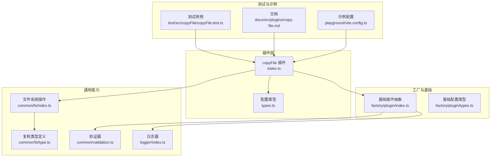
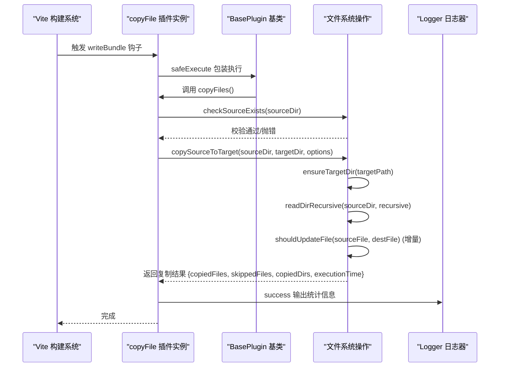
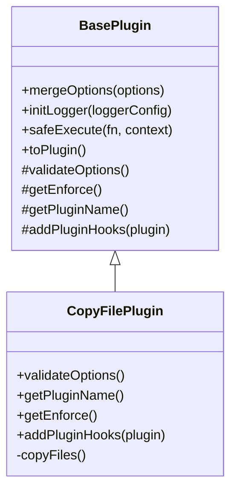
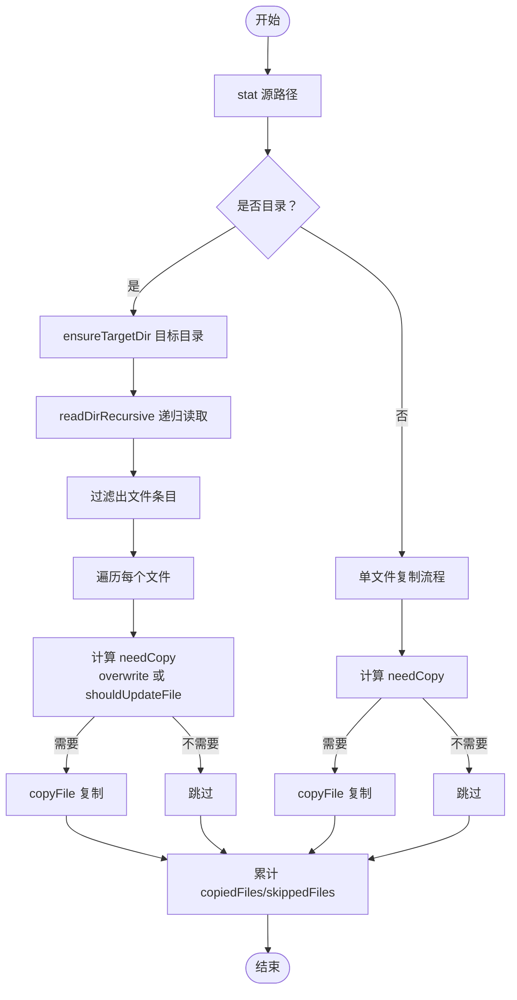
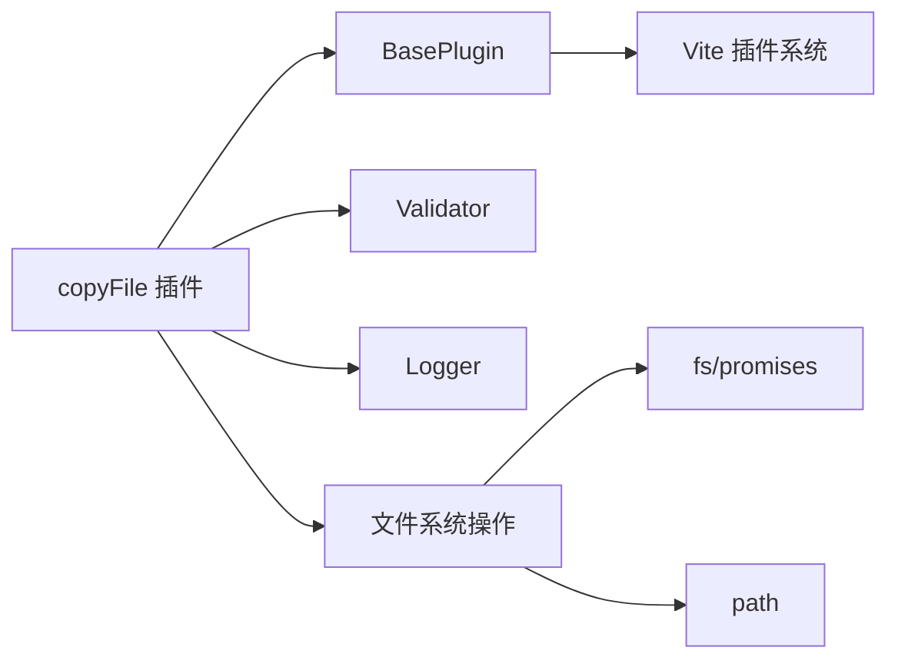

# 文件复制插件 (copyFile)

<cite>
**本文引用的文件**
- [packages/core/src/plugins/copyFile/index.ts](file://packages/core/src/plugins/copyFile/index.ts)
- [packages/core/src/plugins/copyFile/types.ts](file://packages/core/src/plugins/copyFile/types.ts)
- [packages/core/src/common/fs/index.ts](file://packages/core/src/common/fs/index.ts)
- [packages/core/src/common/fs/type.ts](file://packages/core/src/common/fs/type.ts)
- [packages/core/src/factory/plugin/index.ts](file://packages/core/src/factory/plugin/index.ts)
- [packages/core/src/factory/plugin/types.ts](file://packages/core/src/factory/plugin/types.ts)
- [packages/core/src/common/validation.ts](file://packages/core/src/common/validation.ts)
- [packages/core/src/logger/index.ts](file://packages/core/src/logger/index.ts)
- [packages/test/src/copyFile/copyFile.test.ts](file://packages/test/src/copyFile/copyFile.test.ts)
- [packages/docs/src/plugins/copy-file.md](file://packages/docs/src/plugins/copy-file.md)
- [packages/playground/vite.config.ts](file://packages/playground/vite.config.ts)
- [packages/core/package.json](file://packages/core/package.json)
</cite>

## 目录
1. [简介](#简介)
2. [项目结构](#项目结构)
3. [核心组件](#核心组件)
4. [架构总览](#架构总览)
5. [详细组件分析](#详细组件分析)
6. [依赖关系分析](#依赖关系分析)
7. [性能考量](#性能考量)
8. [故障排除指南](#故障排除指南)
9. [结论](#结论)
10. [附录](#附录)

## 简介
本文件复制插件（copyFile）旨在在 Vite 构建完成后，将指定源目录中的文件与子目录复制到目标目录。其设计重点在于：
- 在构建流程末尾执行（post 阶段），确保其他构建任务已完成
- 支持递归复制、增量复制与覆盖控制
- 提供完善的配置校验、日志输出与错误处理策略
- 通过统一的插件工厂与基础插件抽象类，实现一致的生命周期与钩子接入

## 项目结构
围绕 copyFile 插件的关键文件组织如下：
- 插件实现与类型定义位于 plugins/copyFile
- 文件系统操作与类型定义位于 common/fs
- 插件通用基础设施（工厂、基础类、验证器、日志）位于 factory 与 common
- 文档、测试与示例位于 docs、test、playground

图表来源
- [packages/core/src/plugins/copyFile/index.ts](file://packages/core/src/plugins/copyFile/index.ts#L1-L116)
- [packages/core/src/plugins/copyFile/types.ts](file://packages/core/src/plugins/copyFile/types.ts#L1-L44)
- [packages/core/src/common/fs/index.ts](file://packages/core/src/common/fs/index.ts#L1-L241)
- [packages/core/src/common/fs/type.ts](file://packages/core/src/common/fs/type.ts#L1-L55)
- [packages/core/src/factory/plugin/index.ts](file://packages/core/src/factory/plugin/index.ts#L1-L384)
- [packages/core/src/factory/plugin/types.ts](file://packages/core/src/factory/plugin/types.ts#L1-L37)
- [packages/core/src/common/validation.ts](file://packages/core/src/common/validation.ts#L1-L203)
- [packages/core/src/logger/index.ts](file://packages/core/src/logger/index.ts#L1-L131)
- [packages/test/src/copyFile/copyFile.test.ts](file://packages/test/src/copyFile/copyFile.test.ts#L1-L219)
- [packages/docs/src/plugins/copy-file.md](file://packages/docs/src/plugins/copy-file.md#L1-L159)
- [packages/playground/vite.config.ts](file://packages/playground/vite.config.ts#L1-L69)

章节来源
- [packages/core/src/plugins/copyFile/index.ts](file://packages/core/src/plugins/copyFile/index.ts#L1-L116)
- [packages/core/src/plugins/copyFile/types.ts](file://packages/core/src/plugins/copyFile/types.ts#L1-L44)
- [packages/core/src/common/fs/index.ts](file://packages/core/src/common/fs/index.ts#L1-L241)
- [packages/core/src/common/fs/type.ts](file://packages/core/src/common/fs/type.ts#L1-L55)
- [packages/core/src/factory/plugin/index.ts](file://packages/core/src/factory/plugin/index.ts#L1-L384)
- [packages/core/src/factory/plugin/types.ts](file://packages/core/src/factory/plugin/types.ts#L1-L37)
- [packages/core/src/common/validation.ts](file://packages/core/src/common/validation.ts#L1-L203)
- [packages/core/src/logger/index.ts](file://packages/core/src/logger/index.ts#L1-L131)
- [packages/test/src/copyFile/copyFile.test.ts](file://packages/test/src/copyFile/copyFile.test.ts#L1-L219)
- [packages/docs/src/plugins/copy-file.md](file://packages/docs/src/plugins/copy-file.md#L1-L159)
- [packages/playground/vite.config.ts](file://packages/playground/vite.config.ts#L1-L69)

## 核心组件
- 插件类与工厂
  - CopyFilePlugin：继承基础插件抽象类，负责配置校验、生命周期钩子注册与复制执行
  - 工厂函数 copyFile：基于 createPluginFactory 生成 Vite 插件实例
- 文件系统操作
  - checkSourceExists：校验源路径存在性
  - ensureTargetDir：确保目标目录存在
  - readDirRecursive：递归读取目录树
  - shouldUpdateFile：判断文件是否需要更新（增量复制）
  - copySourceToTarget：核心复制逻辑，支持目录/文件、递归、覆盖、增量
- 基础设施
  - BasePlugin：提供配置合并、日志、错误处理、生命周期钩子注册
  - Validator：链式参数校验器
  - Logger：统一日志输出

章节来源
- [packages/core/src/plugins/copyFile/index.ts](file://packages/core/src/plugins/copyFile/index.ts#L13-L116)
- [packages/core/src/common/fs/index.ts](file://packages/core/src/common/fs/index.ts#L98-L202)
- [packages/core/src/factory/plugin/index.ts](file://packages/core/src/factory/plugin/index.ts#L27-L337)
- [packages/core/src/common/validation.ts](file://packages/core/src/common/validation.ts#L16-L203)
- [packages/core/src/logger/index.ts](file://packages/core/src/logger/index.ts#L6-L131)

## 架构总览
copyFile 插件在 Vite 构建流程中以 post 阶段执行，通过 writeBundle 钩子触发复制逻辑。其内部通过文件系统操作模块完成目录遍历、增量判断与文件复制，并输出统计信息与日志。

图表来源
- [packages/core/src/plugins/copyFile/index.ts](file://packages/core/src/plugins/copyFile/index.ts#L53-L81)
- [packages/core/src/common/fs/index.ts](file://packages/core/src/common/fs/index.ts#L98-L202)
- [packages/core/src/factory/plugin/index.ts](file://packages/core/src/factory/plugin/index.ts#L242-L248)
- [packages/core/src/logger/index.ts](file://packages/core/src/logger/index.ts#L99-L131)

## 详细组件分析

### 插件类与生命周期
- 继承 BasePlugin，实现 getPluginName、getEnforce、addPluginHooks
- validateOptions 使用 Validator 对 sourceDir、targetDir、overwrite、recursive、incremental 等进行校验
- enforce 设置为 'post'，确保在构建后期执行
- addPluginHooks 注册 writeBundle 钩子，在构建完成后执行复制

图表来源
- [packages/core/src/factory/plugin/index.ts](file://packages/core/src/factory/plugin/index.ts#L27-L194)
- [packages/core/src/plugins/copyFile/index.ts](file://packages/core/src/plugins/copyFile/index.ts#L13-L82)

章节来源
- [packages/core/src/plugins/copyFile/index.ts](file://packages/core/src/plugins/copyFile/index.ts#L13-L82)
- [packages/core/src/factory/plugin/index.ts](file://packages/core/src/factory/plugin/index.ts#L27-L194)

### 配置选项与类型
- CopyFileOptions 继承基础插件配置，扩展 sourceDir、targetDir、overwrite、recursive、incremental
- 基础配置包含 enabled、verbose、errorStrategy
- Validator 对必填字段与类型进行校验，并支持自定义校验与默认值设置

章节来源
- [packages/core/src/plugins/copyFile/types.ts](file://packages/core/src/plugins/copyFile/types.ts#L8-L44)
- [packages/core/src/factory/plugin/types.ts](file://packages/core/src/factory/plugin/types.ts#L8-L29)
- [packages/core/src/common/validation.ts](file://packages/core/src/common/validation.ts#L45-L201)

### 文件系统操作与复制流程
- checkSourceExists：检查源路径存在性，区分 ENOENT/EACCES 等错误
- ensureTargetDir：递归创建目标目录
- readDirRecursive：递归读取目录树，支持是否递归
- shouldUpdateFile：比较修改时间与文件大小，判断是否需要更新
- copySourceToTarget：核心复制逻辑
  - 支持源为目录或文件
  - 逐个计算相对路径，确保目标目录存在
  - 根据 overwrite/incremental 控制是否复制
  - 统计 copiedFiles、skippedFiles、copiedDirs、executionTime

图表来源
- [packages/core/src/common/fs/index.ts](file://packages/core/src/common/fs/index.ts#L98-L202)

章节来源
- [packages/core/src/common/fs/index.ts](file://packages/core/src/common/fs/index.ts#L9-L241)

### API 参考
- 工厂函数
  - 名称：copyFile
  - 参数：CopyFileOptions
  - 返回：Vite 插件对象（包含 name、enforce、configResolved、writeBundle 等）
  - 作用：创建并返回可直接加入 Vite 配置的插件实例
- 插件钩子
  - writeBundle：在构建完成后执行复制
- 复制函数
  - copySourceToTarget(sourcePath, targetPath, options)：返回 CopyResult
- 类型定义
  - CopyOptions：recursive、overwrite、incremental、parallelLimit、skipEmptyDirs
  - CopyResult：copiedFiles、skippedFiles、copiedDirs、executionTime

章节来源
- [packages/core/src/plugins/copyFile/index.ts](file://packages/core/src/plugins/copyFile/index.ts#L77-L82)
- [packages/core/src/common/fs/type.ts](file://packages/core/src/common/fs/type.ts#L4-L55)

### 使用示例与最佳实践
- 基础文件复制：配置 sourceDir 与 targetDir 即可
- 条件复制：通过 overwrite 控制覆盖行为；通过 incremental 控制增量复制
- 批量文件处理：开启 recursive 以复制子目录；结合 incremental 提升效率
- 环境控制：通过 enabled 控制是否启用插件；在开发/生产环境按需启用
- 错误处理：通过 errorStrategy 选择抛错、记录日志或忽略错误

章节来源
- [packages/docs/src/plugins/copy-file.md](file://packages/docs/src/plugins/copy-file.md#L17-L159)
- [packages/playground/vite.config.ts](file://packages/playground/vite.config.ts#L53-L66)

### 测试覆盖
- 插件有效性：验证插件对象结构与名称
- 基本复制：确认文件与子目录被正确复制
- 覆盖行为：验证 overwrite 选项影响复制结果
- 递归复制：验证 recursive 选项影响子目录复制
- 增量复制：验证 incremental 选项在重复执行时的行为
- 插件禁用：验证 enabled: false 时跳过复制
- 配置校验：验证必填字段缺失时抛出错误

章节来源
- [packages/test/src/copyFile/copyFile.test.ts](file://packages/test/src/copyFile/copyFile.test.ts#L39-L219)

## 依赖关系分析
- 插件依赖
  - 继承 BasePlugin，复用配置合并、日志、错误处理与生命周期钩子
  - 使用 Validator 进行参数校验
  - 使用 Logger 输出日志
- 文件系统依赖
  - fs/promises 与 path 用于文件系统操作
  - CopyOptions/CopyResult 类型约束复制行为与返回值
- 外部依赖
  - Vite 插件系统（writeBundle 钩子）
  - peerDependencies 中声明 vite 版本要求

图表来源
- [packages/core/src/plugins/copyFile/index.ts](file://packages/core/src/plugins/copyFile/index.ts#L1-L4)
- [packages/core/src/factory/plugin/index.ts](file://packages/core/src/factory/plugin/index.ts#L1-L5)
- [packages/core/src/common/fs/index.ts](file://packages/core/src/common/fs/index.ts#L1-L3)

章节来源
- [packages/core/src/plugins/copyFile/index.ts](file://packages/core/src/plugins/copyFile/index.ts#L1-L4)
- [packages/core/src/factory/plugin/index.ts](file://packages/core/src/factory/plugin/index.ts#L1-L5)
- [packages/core/src/common/fs/index.ts](file://packages/core/src/common/fs/index.ts#L1-L3)
- [packages/core/package.json](file://packages/core/package.json#L32-L34)

## 性能考量
- 增量复制：shouldUpdateFile 基于 mtimeMs 与 size 判断是否需要复制，减少不必要的 IO
- 递归遍历：readDirRecursive 采用递归读取，适合层级较深的目录；注意大目录的内存与 IO 开销
- 目标目录预创建：ensureTargetDir 在复制前保证目标目录存在，避免多次 stat/mkdir
- 并行限制：类型定义中包含 parallelLimit 字段，当前实现未使用；可在后续版本引入以提升大批量文件复制性能
- 统计输出：copySourceToTarget 返回执行时间与计数，便于性能监控与优化

章节来源
- [packages/core/src/common/fs/index.ts](file://packages/core/src/common/fs/index.ts#L77-L88)
- [packages/core/src/common/fs/type.ts](file://packages/core/src/common/fs/type.ts#L22-L23)

## 故障排除指南
- 源路径不存在或权限不足
  - 现象：抛出“源文件不存在”或“没有权限访问源文件”
  - 排查：确认 sourceDir 存在且具备读权限
- 目标目录权限不足
  - 现象：抛出“没有权限创建目标目录”
  - 排查：确认目标路径可写或手动创建目录
- 配置校验失败
  - 现象：抛出“配置验证失败”，包含具体字段错误
  - 排查：检查 sourceDir/targetDir 是否为非空字符串，overwrite/recursive/incremental 是否为布尔值
- 插件未执行
  - 现象：目标目录无文件
  - 排查：确认 enabled 为 true；检查 enforce: 'post' 是否与其他钩子冲突
- 增量复制未生效
  - 现象：每次均复制
  - 排查：确认 incremental 为 true；检查文件修改时间与大小是否变化

章节来源
- [packages/core/src/common/fs/index.ts](file://packages/core/src/common/fs/index.ts#L10-L23)
- [packages/core/src/common/validation.ts](file://packages/core/src/common/validation.ts#L195-L201)
- [packages/test/src/copyFile/copyFile.test.ts](file://packages/test/src/copyFile/copyFile.test.ts#L181-L203)

## 结论
copyFile 插件通过清晰的职责划分与统一的基础设施，实现了在 Vite 构建后期稳定、可控地复制文件与目录。其配置校验、日志输出与错误处理策略使插件易于集成与维护；增量复制与递归复制满足大多数工程化场景需求。建议在大规模目录复制时关注性能，必要时引入并行限制与缓存策略。

## 附录
- 相关文档与示例
  - 插件文档：[copy-file.md](file://packages/docs/src/plugins/copy-file.md#L1-L159)
  - 示例配置：[playground/vite.config.ts](file://packages/playground/vite.config.ts#L53-L66)
- 测试用例参考
  - [copyFile.test.ts](file://packages/test/src/copyFile/copyFile.test.ts#L39-L219)