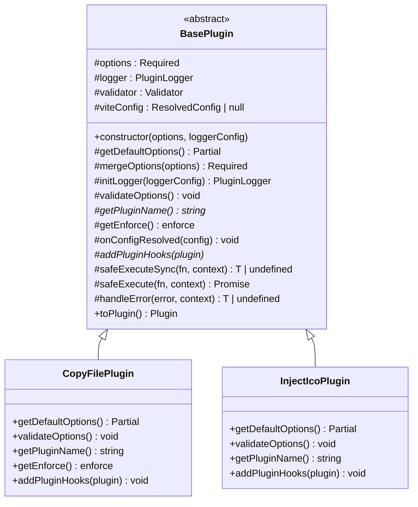
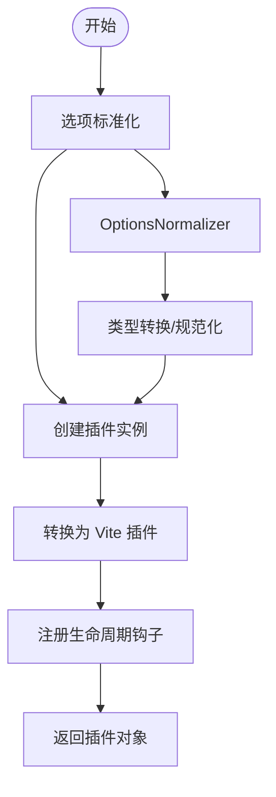
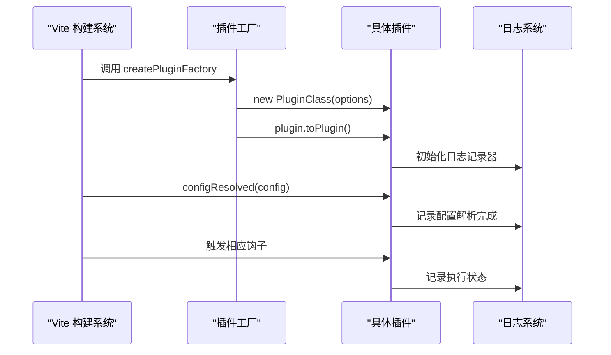

# 核心插件

<cite>
**本文档引用的文件**
- [packages/core/src/index.ts](file://packages/core/src/index.ts)
- [packages/core/src/plugins/index.ts](file://packages/core/src/plugins/index.ts)
- [packages/core/src/factory/index.ts](file://packages/core/src/factory/index.ts)
- [packages/core/src/factory/plugin/index.ts](file://packages/core/src/factory/plugin/index.ts)
- [packages/core/src/factory/plugin/types.ts](file://packages/core/src/factory/plugin/types.ts)
- [packages/core/src/factory/types.ts](file://packages/core/src/factory/types.ts)
- [packages/core/src/plugins/copyFile/index.ts](file://packages/core/src/plugins/copyFile/index.ts)
- [packages/core/src/plugins/copyFile/types.ts](file://packages/core/src/plugins/copyFile/types.ts)
- [packages/core/src/plugins/injectIco/index.ts](file://packages/core/src/plugins/injectIco/index.ts)
- [packages/core/src/plugins/injectIco/types.ts](file://packages/core/src/plugins/injectIco/types.ts)
- [packages/core/src/common/validation.ts](file://packages/core/src/common/validation.ts)
- [packages/core/src/common/object.ts](file://packages/core/src/common/object.ts)
- [packages/core/src/logger/index.ts](file://packages/core/src/logger/index.ts)
- [packages/core/package.json](file://packages/core/package.json)
- [packages/test/src/copyFile/copyFile.test.ts](file://packages/test/src/copyFile/copyFile.test.ts)
- [packages/test/src/injectIco/injectIco.test.ts](file://packages/test/src/injectIco/injectIco.test.ts)
- [packages/docs/src/plugins/copy-file.md](file://packages/docs/src/plugins/copy-file.md)
- [packages/docs/src/plugins/inject-ico.md](file://packages/docs/src/plugins/inject-ico.md)
</cite>

## 更新摘要
**所做更改**
- 重新聚焦插件开发框架特性，强调 BasePlugin 抽象类和 createPluginFactory 工厂函数的核心地位
- 从传统的模块化架构描述转向框架中心的消息传递机制
- 突出插件工厂系统的统一生命周期管理和错误处理能力
- 强调插件开发的标准化流程和最佳实践

## 目录
1. [简介](#简介)
2. [插件开发框架](#插件开发框架)
3. [核心插件实现](#核心插件实现)
4. [框架设计理念](#框架设计理念)
5. [详细组件分析](#详细组件分析)
6. [开发最佳实践](#开发最佳实践)
7. [性能优化策略](#性能优化策略)
8. [故障排除指南](#故障排除指南)
9. [总结](#总结)

## 简介
本文档深入阐述核心插件模块的框架设计理念，重点介绍插件开发框架的统一抽象和标准化流程。通过 BasePlugin 抽象类和 createPluginFactory 工厂函数，实现了插件开发的标准化、模块化和可扩展性。两个核心插件 copyFile 和 injectIco 展示了框架的实际应用效果，体现了框架中心的消息传递机制和统一生命周期管理。

## 插件开发框架
插件开发框架是整个核心插件模块的基石，通过统一的抽象层和工厂模式，为插件开发提供了标准化的开发流程和最佳实践。

### BasePlugin 抽象类
BasePlugin 作为所有插件的基类，提供了完整的插件生命周期管理和基础设施：

**图表来源**
- [packages/core/src/factory/plugin/index.ts](file://packages/core/src/factory/plugin/index.ts#L27-L348)
- [packages/core/src/plugins/copyFile/index.ts](file://packages/core/src/plugins/copyFile/index.ts#L13-L87)
- [packages/core/src/plugins/injectIco/index.ts](file://packages/core/src/plugins/injectIco/index.ts#L14-L132)

### createPluginFactory 工厂函数
createPluginFactory 提供了插件实例化和标准化的工厂模式：

**图表来源**
- [packages/core/src/factory/plugin/index.ts](file://packages/core/src/factory/plugin/index.ts#L369-L385)

**章节来源**
- [packages/core/src/factory/plugin/index.ts](file://packages/core/src/factory/plugin/index.ts#L27-L386)
- [packages/core/src/factory/plugin/types.ts](file://packages/core/src/factory/plugin/types.ts#L1-L46)

## 核心插件实现
两个核心插件展示了框架的强大功能和灵活性，分别覆盖了静态资源复制和 HTML 图标注入两大常用场景。

### copyFile 插件
copyFile 插件专注于构建完成后的文件复制操作，体现了框架的可靠性和易用性：

**设计特点**
- 继承 BasePlugin，复用统一的配置管理和错误处理
- 使用 enforce: 'post' 确保在构建后期执行
- 支持增量复制、递归复制和覆盖控制
- 完善的日志记录和状态反馈

**章节来源**
- [packages/core/src/plugins/copyFile/index.ts](file://packages/core/src/plugins/copyFile/index.ts#L13-L121)
- [packages/core/src/plugins/copyFile/types.ts](file://packages/core/src/plugins/copyFile/types.ts#L1-L44)

### injectIco 插件
injectIco 插件展示了框架在复杂场景下的应用能力：

**设计特点**
- 支持多种配置方式（base/url/link/icons）
- HTML 转换和文件复制的双重功能
- 智能的图标标签生成和注入机制
- 可选的文件复制功能

**章节来源**
- [packages/core/src/plugins/injectIco/index.ts](file://packages/core/src/plugins/injectIco/index.ts#L14-L169)
- [packages/core/src/plugins/injectIco/types.ts](file://packages/core/src/plugins/injectIco/types.ts#L1-L113)

## 框架设计理念
核心插件框架的设计理念体现了现代插件开发的最佳实践，强调统一性、可扩展性和易用性。

### 统一抽象层
框架通过 BasePlugin 抽象类提供了统一的插件开发模板，确保所有插件都具备相同的基础能力：

**核心能力**
- 配置合并和验证
- 日志记录和错误处理
- 生命周期管理
- Vite 插件对象转换

### 标准化开发流程
createPluginFactory 工厂函数定义了标准的插件开发流程：

**开发步骤**
1. 继承 BasePlugin 创建插件类
2. 实现 getDefaultOptions 和 validateOptions
3. 实现 getPluginName 和 addPluginHooks
4. 使用 createPluginFactory 导出插件

### 框架中心消息机制
框架通过统一的生命周期和钩子机制，实现了插件间的协调和通信：

**图表来源**
- [packages/core/src/factory/plugin/index.ts](file://packages/core/src/factory/plugin/index.ts#L331-L347)

## 详细组件分析

### 插件工厂系统工作原理
插件工厂系统是框架的核心，它将插件开发标准化并简化了插件的创建过程。

**核心组件**
- BasePlugin：提供插件开发的基础抽象
- createPluginFactory：实现插件实例化和标准化
- Validator：提供配置验证能力
- Logger：提供统一的日志记录

**章节来源**
- [packages/core/src/factory/plugin/index.ts](file://packages/core/src/factory/plugin/index.ts#L27-L386)
- [packages/core/src/common/validation.ts](file://packages/core/src/common/validation.ts#L16-L203)
- [packages/core/src/logger/index.ts](file://packages/core/src/logger/index.ts#L7-L188)

### 配置管理系统
框架提供了强大的配置管理能力，确保插件配置的一致性和可靠性：

**配置层次**
1. 基础配置（enabled、verbose、errorStrategy）
2. 插件特定配置（由各插件实现 getDefaultOptions）
3. 用户配置（最终用户提供的配置）

**章节来源**
- [packages/core/src/factory/plugin/types.ts](file://packages/core/src/factory/plugin/types.ts#L8-L29)
- [packages/core/src/plugins/copyFile/index.ts](file://packages/core/src/plugins/copyFile/index.ts#L14-L20)
- [packages/core/src/plugins/injectIco/index.ts](file://packages/core/src/plugins/injectIco/index.ts#L15-L19)

### 错误处理机制
框架实现了统一的错误处理策略，提供了灵活的错误处理选项：

**错误策略**
- throw：抛出错误，中断构建过程
- log：记录错误但继续执行
- ignore：忽略错误，继续执行

**章节来源**
- [packages/core/src/factory/plugin/index.ts](file://packages/core/src/factory/plugin/index.ts#L283-L311)

## 开发最佳实践
基于框架的设计理念和实现细节，总结出以下开发最佳实践：

### 插件开发规范
1. **继承 BasePlugin**：所有插件必须继承 BasePlugin 抽象类
2. **实现必要方法**：必须实现 getDefaultOptions、validateOptions、getPluginName、addPluginHooks
3. **配置验证**：使用 Validator 进行配置验证，确保配置的正确性
4. **日志记录**：使用统一的日志接口记录插件状态和错误信息

### 性能优化建议
1. **增量处理**：利用框架的增量复制能力，避免不必要的文件操作
2. **异步执行**：合理使用 safeExecute 和 safeExecuteSync 方法
3. **错误策略**：根据使用场景选择合适的错误处理策略

### 测试策略
1. **单元测试**：为每个插件编写完整的单元测试
2. **集成测试**：测试插件与其他插件的协作效果
3. **边界测试**：测试插件在异常情况下的表现

**章节来源**
- [packages/test/src/copyFile/copyFile.test.ts](file://packages/test/src/copyFile/copyFile.test.ts#L1-L219)
- [packages/test/src/injectIco/injectIco.test.ts](file://packages/test/src/injectIco/injectIco.test.ts#L1-L273)

## 性能优化策略
框架在设计时充分考虑了性能优化，提供了多种优化策略和最佳实践。

### 增量复制优化
两个核心插件都支持增量复制功能，显著减少了重复构建的时间：

**优化机制**
- 比较文件修改时间戳
- 跳过未修改的文件
- 减少不必要的文件操作

**章节来源**
- [packages/core/src/plugins/copyFile/index.ts](file://packages/core/src/plugins/copyFile/index.ts#L17-L18)
- [packages/core/src/plugins/injectIco/index.ts](file://packages/core/src/plugins/injectIco/index.ts#L116-L117)

### 执行时机优化
通过 enforce 机制优化插件执行时机：

**执行策略**
- copyFile 使用 'post' 确保在其他插件之后执行
- injectIco 使用 'pre' 确保在构建早期执行
- 避免插件间的冲突和依赖问题

**章节来源**
- [packages/core/src/plugins/copyFile/index.ts](file://packages/core/src/plugins/copyFile/index.ts#L46-L48)
- [packages/core/src/plugins/injectIco/index.ts](file://packages/core/src/plugins/injectIco/index.ts#L131-L132)

### 内存管理优化
框架提供了高效的内存管理机制：

**优化措施**
- 单例模式的日志系统
- 深度合并配置时的内存优化
- 统一的错误处理避免内存泄漏

**章节来源**
- [packages/core/src/logger/index.ts](file://packages/core/src/logger/index.ts#L63-L68)
- [packages/core/src/common/object.ts](file://packages/core/src/common/object.ts#L8-L29)

## 故障排除指南
基于框架的统一设计和实现细节，提供以下故障排除指南：

### 配置验证失败
当插件配置验证失败时，框架会抛出详细的错误信息：

**常见原因**
- 缺少必填字段
- 字段类型不匹配
- 自定义验证规则失败

**解决方法**
- 检查配置对象的结构和类型
- 查看错误信息中的具体字段
- 使用默认配置作为参考

**章节来源**
- [packages/core/src/common/validation.ts](file://packages/core/src/common/validation.ts#L195-L201)

### 插件执行错误
框架提供了灵活的错误处理策略：

**错误处理策略**
- throw：立即终止构建，便于快速定位问题
- log：记录错误但继续执行，适合开发环境
- ignore：忽略错误，谨慎使用

**章节来源**
- [packages/core/src/factory/plugin/index.ts](file://packages/core/src/factory/plugin/index.ts#L296-L310)

### 性能问题排查
当遇到性能问题时，可以从以下方面排查：

**排查步骤**
1. 检查插件的 enabled 状态
2. 分析日志中的执行时间
3. 评估文件数量和大小
4. 考虑使用增量复制功能

**章节来源**
- [packages/core/src/plugins/copyFile/index.ts](file://packages/core/src/plugins/copyFile/index.ts#L78-L79)
- [packages/core/src/plugins/injectIco/index.ts](file://packages/core/src/plugins/injectIco/index.ts#L119-L120)

## 总结
核心插件模块通过精心设计的框架系统，实现了插件开发的标准化、模块化和可扩展性。BasePlugin 抽象类和 createPluginFactory 工厂函数构成了框架的核心，为插件开发提供了统一的开发模板和最佳实践。

两个核心插件 copyFile 和 injectIco 展示了框架的强大功能，分别覆盖了静态资源复制和 HTML 图标注入两大常用场景。框架的统一抽象层、标准化开发流程和完善的错误处理机制，确保了插件的可靠性、可维护性和性能表现。

通过遵循框架的设计理念和最佳实践，开发者可以快速创建高质量的插件，享受框架带来的开发效率提升和代码质量保障。框架中心的消息传递机制和统一生命周期管理，为插件间的协作和扩展提供了坚实的基础。

未来，框架将继续演进，支持更多的插件开发模式和应用场景，为构建更强大的 Vite 生态系统贡献力量。