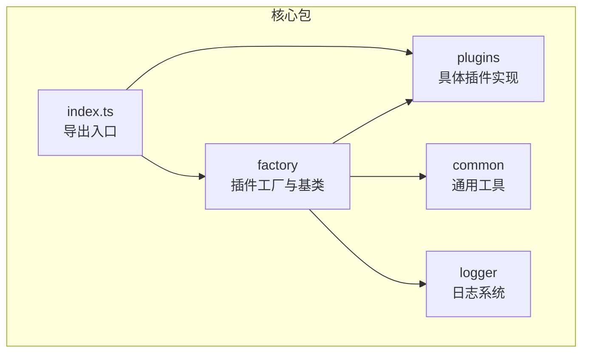
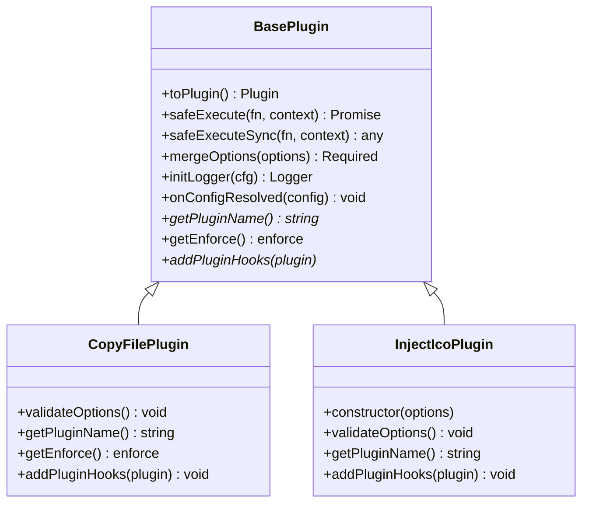
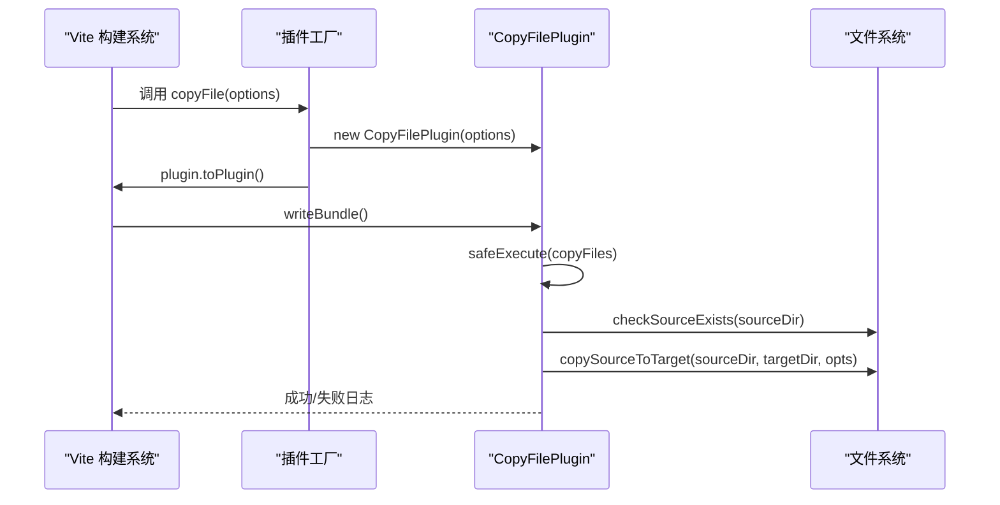
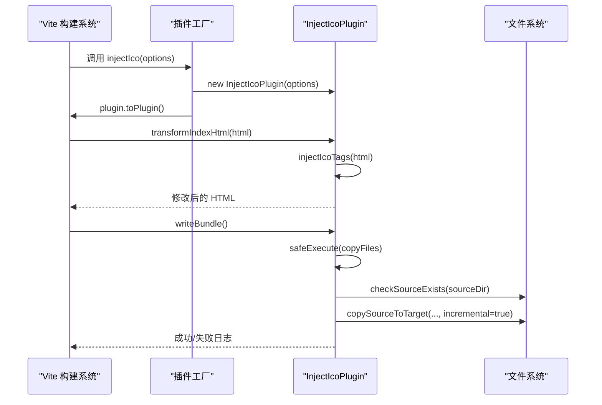
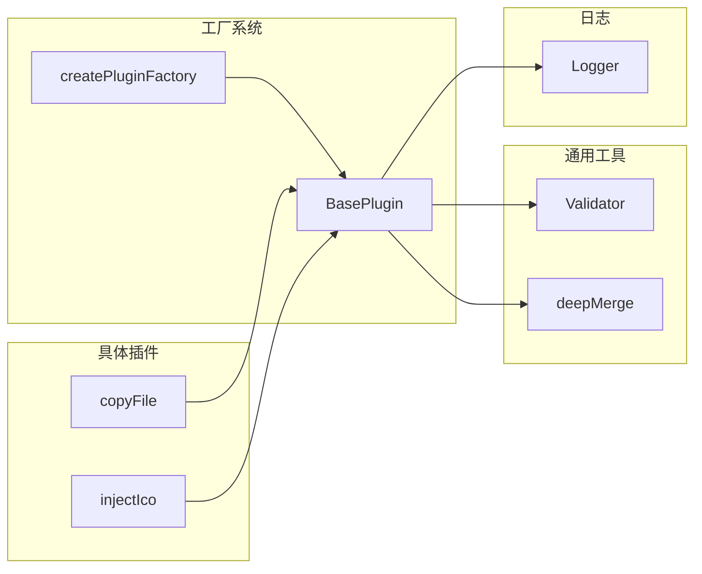
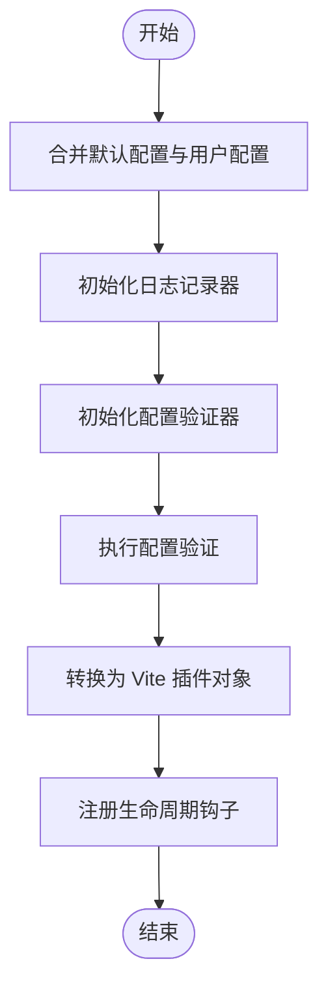

# 核心插件

<cite>
**本文档引用的文件**
- [packages/core/src/index.ts](file://packages/core/src/index.ts)
- [packages/core/src/plugins/index.ts](file://packages/core/src/plugins/index.ts)
- [packages/core/src/factory/index.ts](file://packages/core/src/factory/index.ts)
- [packages/core/src/factory/plugin/index.ts](file://packages/core/src/factory/plugin/index.ts)
- [packages/core/src/factory/plugin/types.ts](file://packages/core/src/factory/plugin/types.ts)
- [packages/core/src/factory/types.ts](file://packages/core/src/factory/types.ts)
- [packages/core/src/plugins/copyFile/index.ts](file://packages/core/src/plugins/copyFile/index.ts)
- [packages/core/src/plugins/copyFile/types.ts](file://packages/core/src/plugins/copyFile/types.ts)
- [packages/core/src/plugins/injectIco/index.ts](file://packages/core/src/plugins/injectIco/index.ts)
- [packages/core/src/plugins/injectIco/types.ts](file://packages/core/src/plugins/injectIco/types.ts)
- [packages/core/src/common/validation.ts](file://packages/core/src/common/validation.ts)
- [packages/core/src/common/object.ts](file://packages/core/src/common/object.ts)
- [packages/core/src/logger/index.ts](file://packages/core/src/logger/index.ts)
- [packages/core/package.json](file://packages/core/package.json)
- [packages/test/src/copyFile/copyFile.test.ts](file://packages/test/src/copyFile/copyFile.test.ts)
- [packages/test/src/injectIco/injectIco.test.ts](file://packages/test/src/injectIco/injectIco.test.ts)
- [packages/docs/src/plugins/copy-file.md](file://packages/docs/src/plugins/copy-file.md)
- [packages/docs/src/plugins/inject-ico.md](file://packages/docs/src/plugins/inject-ico.md)
</cite>

## 目录
1. [简介](#简介)
2. [项目结构](#项目结构)
3. [核心组件](#核心组件)
4. [架构总览](#架构总览)
5. [详细组件分析](#详细组件分析)
6. [依赖关系分析](#依赖关系分析)
7. [性能考量](#性能考量)
8. [故障排除指南](#故障排除指南)
9. [结论](#结论)
10. [附录](#附录)

## 简介
本文件面向核心插件模块，系统性介绍两个核心插件的功能特性、使用场景与配置选项，深入解析插件工厂系统的设计理念与实现原理，并提供完整的 API 参考、协作关系与组合使用方式、性能优化建议与最佳实践。读者无需深入源码即可快速掌握如何在 Vite 项目中高效使用这两个插件。

## 项目结构
核心插件模块位于 packages/core，采用“按功能分层 + 工厂抽象”的组织方式：
- factory：插件工厂与基类，提供统一的生命周期、日志、错误处理与配置合并能力
- plugins：具体插件实现，当前包含 copyFile 与 injectIco
- common：通用工具（验证器、深拷贝）
- logger：统一日志输出
- index.ts：导出入口

图表来源
- [packages/core/src/index.ts](file://packages/core/src/index.ts#L1-L2)
- [packages/core/src/plugins/index.ts](file://packages/core/src/plugins/index.ts#L1-L3)
- [packages/core/src/factory/index.ts](file://packages/core/src/factory/index.ts#L1-L2)

章节来源
- [packages/core/src/index.ts](file://packages/core/src/index.ts#L1-L2)
- [packages/core/src/plugins/index.ts](file://packages/core/src/plugins/index.ts#L1-L3)
- [packages/core/src/factory/index.ts](file://packages/core/src/factory/index.ts#L1-L2)

## 核心组件
- 插件工厂系统
  - BasePlugin：抽象基类，提供配置合并、日志、验证、错误处理、生命周期钩子注册与 Vite 插件对象转换
  - createPluginFactory：工厂函数，将插件类实例化为 Vite 插件对象，并保留对原始实例的引用
- 具体插件
  - copyFile：在构建完成后复制文件/目录，支持覆盖、递归、增量复制
  - injectIco：在 HTML 中注入图标链接，并可选复制图标文件到打包目录

章节来源
- [packages/core/src/factory/plugin/index.ts](file://packages/core/src/factory/plugin/index.ts#L27-L337)
- [packages/core/src/factory/plugin/types.ts](file://packages/core/src/factory/plugin/types.ts#L8-L36)
- [packages/core/src/plugins/copyFile/index.ts](file://packages/core/src/plugins/copyFile/index.ts#L13-L115)
- [packages/core/src/plugins/injectIco/index.ts](file://packages/core/src/plugins/injectIco/index.ts#L14-L177)

## 架构总览
插件工厂系统通过统一的基类与工厂函数，屏蔽了 Vite 生命周期细节，使具体插件只需关注业务逻辑。两个核心插件均继承自 BasePlugin，复用其配置合并、日志与错误处理能力；同时各自实现 addPluginHooks 以接入 Vite 钩子。

图表来源
- [packages/core/src/factory/plugin/index.ts](file://packages/core/src/factory/plugin/index.ts#L27-L337)
- [packages/core/src/plugins/copyFile/index.ts](file://packages/core/src/plugins/copyFile/index.ts#L13-L82)
- [packages/core/src/plugins/injectIco/index.ts](file://packages/core/src/plugins/injectIco/index.ts#L14-L139)

## 详细组件分析

### copyFile 插件
- 设计理念
  - 在 Vite 构建“收尾阶段”执行，确保资源已打包完毕再进行复制
  - 通过统一的配置校验与错误策略，保证健壮性
- 核心能力
  - 复制文件/目录：支持覆盖、递归、增量复制
  - 生命周期：writeBundle 钩子触发
  - 日志：成功/失败/跳过等多级日志输出
- API 参考
  - 工厂函数：copyFile(options)
  - 配置项（继承 BasePluginOptions）
    - sourceDir: string（必填，非空）
    - targetDir: string（必填，非空）
    - overwrite: boolean（默认 true）
    - recursive: boolean（默认 true）
    - incremental: boolean（默认 true）
    - enabled: boolean（默认 true）
    - verbose: boolean（默认 true）
    - errorStrategy: 'throw' | 'log' | 'ignore'（默认 'throw'）

图表来源
- [packages/core/src/plugins/copyFile/index.ts](file://packages/core/src/plugins/copyFile/index.ts#L53-L81)
- [packages/core/src/factory/plugin/index.ts](file://packages/core/src/factory/plugin/index.ts#L320-L336)

章节来源
- [packages/core/src/plugins/copyFile/index.ts](file://packages/core/src/plugins/copyFile/index.ts#L13-L115)
- [packages/core/src/plugins/copyFile/types.ts](file://packages/core/src/plugins/copyFile/types.ts#L8-L43)
- [packages/docs/src/plugins/copy-file.md](file://packages/docs/src/plugins/copy-file.md#L57-L68)

使用指南（从基础到高级）
- 基础用法：仅配置 sourceDir 与 targetDir
- 高级用法：关闭覆盖、禁用递归、禁用增量、调整错误策略、按环境启用
- 最佳实践：生产环境启用、开发环境禁用；结合 CI/CD 控制增量复制

章节来源
- [packages/docs/src/plugins/copy-file.md](file://packages/docs/src/plugins/copy-file.md#L17-L158)
- [packages/test/src/copyFile/copyFile.test.ts](file://packages/test/src/copyFile/copyFile.test.ts#L39-L218)

### injectIco 插件
- 设计理念
  - 在 HTML 转换阶段注入图标链接，构建完成后可选复制图标文件
  - 支持多种配置方式（base/url/link/icons），优先级明确
- 核心能力
  - HTML 注入：transformIndexHtml 钩子
  - 文件复制：writeBundle 钩子（需配置 copyOptions）
  - 日志：成功/跳过/警告等多级日志输出
- API 参考
  - 工厂函数：injectIco(options?: string | InjectIcoOptions)
  - 配置项（继承 BasePluginOptions）
    - base: string（默认 '/'）
    - url: string（优先级最高）
    - link: string（优先级次之）
    - icons: Icon[]
    - copyOptions: CopyOptions（含 sourceDir/targetDir/overwrite/recursive）
  - Icon 接口：rel/href/sizes/type
  - CopyOptions 接口：sourceDir/targetDir（必填），overwrite/recursive（默认 true）

图表来源
- [packages/core/src/plugins/injectIco/index.ts](file://packages/core/src/plugins/injectIco/index.ts#L130-L138)
- [packages/core/src/factory/plugin/index.ts](file://packages/core/src/factory/plugin/index.ts#L320-L336)

章节来源
- [packages/core/src/plugins/injectIco/index.ts](file://packages/core/src/plugins/injectIco/index.ts#L14-L177)
- [packages/core/src/plugins/injectIco/types.ts](file://packages/core/src/plugins/injectIco/types.ts#L70-L112)
- [packages/docs/src/plugins/inject-ico.md](file://packages/docs/src/plugins/inject-ico.md#L69-L90)

使用指南（从基础到高级）
- 基础用法：传入字符串 base 或完整配置
- 高级用法：自定义 icons 数组、配置 copyOptions、调整错误策略
- 最佳实践：生产环境启用、开发环境可禁用；优先使用 link 或 icons 明确控制

章节来源
- [packages/docs/src/plugins/inject-ico.md](file://packages/docs/src/plugins/inject-ico.md#L18-L257)
- [packages/test/src/injectIco/injectIco.test.ts](file://packages/test/src/injectIco/injectIco.test.ts#L50-L272)

## 依赖关系分析
- 插件工厂系统
  - BasePlugin 依赖：common（deepMerge、Validator）、logger（Logger）、vite（Plugin 类型）
  - createPluginFactory 将插件类包装为 Vite 插件对象，并保留对原始实例的引用
- 具体插件
  - copyFile：依赖 BasePlugin、common（checkSourceExists、copySourceToTarget）、logger
  - injectIco：依赖 BasePlugin、common（checkSourceExists、copySourceToTarget、Validator）、logger
- 导出入口
  - plugins/index.ts 导出 copyFile 与 injectIco
  - factory/index.ts 导出插件工厂
  - core/index.ts 统一导出

图表来源
- [packages/core/src/factory/plugin/index.ts](file://packages/core/src/factory/plugin/index.ts#L27-L337)
- [packages/core/src/plugins/copyFile/index.ts](file://packages/core/src/plugins/copyFile/index.ts#L1-L5)
- [packages/core/src/plugins/injectIco/index.ts](file://packages/core/src/plugins/injectIco/index.ts#L1-L5)

章节来源
- [packages/core/src/plugins/index.ts](file://packages/core/src/plugins/index.ts#L1-L3)
- [packages/core/src/factory/index.ts](file://packages/core/src/factory/index.ts#L1-L2)

## 性能考量
- 增量复制
  - copyFile 与 injectIco 在复制时支持增量模式，仅处理变更文件，显著降低重复构建时间
- 执行时机
  - copyFile 使用 enforce: 'post'，确保在其他构建任务之后执行，减少冲突
- 日志与错误策略
  - 通过 verbose 与 errorStrategy 控制日志开销与失败处理成本
- 文件系统操作
  - 建议合理规划 sourceDir/targetDir，避免过大目录导致 IO 压力

章节来源
- [packages/core/src/plugins/copyFile/index.ts](file://packages/core/src/plugins/copyFile/index.ts#L41-L43)
- [packages/core/src/plugins/copyFile/index.ts](file://packages/core/src/plugins/copyFile/index.ts#L67-L74)
- [packages/core/src/plugins/injectIco/index.ts](file://packages/core/src/plugins/injectIco/index.ts#L120-L127)

## 故障排除指南
- 配置验证失败
  - Validator 会收集所有错误并抛出详细信息，检查必填字段与类型
- 源目录不存在
  - checkSourceExists 会在复制前校验，确保路径有效
- HTML 中缺少 </head>
  - injectIco 会检测并输出警告，跳过注入
- 错误策略选择
  - throw：中断构建，便于快速发现错误
  - log：记录错误但继续，适合开发环境
  - ignore：忽略错误，谨慎使用

章节来源
- [packages/core/src/common/validation.ts](file://packages/core/src/common/validation.ts#L195-L201)
- [packages/core/src/plugins/injectIco/index.ts](file://packages/core/src/plugins/injectIco/index.ts#L84-L86)
- [packages/core/src/factory/plugin/index.ts](file://packages/core/src/factory/plugin/index.ts#L272-L300)

## 结论
核心插件模块通过统一的工厂与基类抽象，实现了高内聚、低耦合的插件体系。copyFile 与 injectIco 分别覆盖“静态资源复制”和“HTML 图标注入”两大常用场景，配合完善的配置校验、日志与错误处理机制，能够在不同环境下稳定运行。建议在生产环境启用、开发环境按需禁用，并结合增量复制与合理的错误策略获得最佳体验。

## 附录

### 插件工厂系统工作原理
- BasePlugin
  - 合并默认配置与用户配置（deepMerge）
  - 初始化 Logger 与 Validator
  - 提供安全执行方法（同步/异步），统一错误处理策略
  - 将插件实例转换为 Vite 插件对象，注入生命周期钩子
- createPluginFactory
  - 生成工厂函数，负责实例化插件并暴露 toPlugin 能力
  - 保留对原始实例的引用，便于外部调试与扩展

图表来源
- [packages/core/src/factory/plugin/index.ts](file://packages/core/src/factory/plugin/index.ts#L98-L106)
- [packages/core/src/factory/plugin/index.ts](file://packages/core/src/factory/plugin/index.ts#L115-L127)
- [packages/core/src/factory/plugin/index.ts](file://packages/core/src/factory/plugin/index.ts#L149-L150)
- [packages/core/src/factory/plugin/index.ts](file://packages/core/src/factory/plugin/index.ts#L320-L336)

章节来源
- [packages/core/src/factory/plugin/index.ts](file://packages/core/src/factory/plugin/index.ts#L27-L337)
- [packages/core/src/factory/plugin/types.ts](file://packages/core/src/factory/plugin/types.ts#L8-L36)
- [packages/core/src/common/object.ts](file://packages/core/src/common/object.ts#L8-L29)
- [packages/core/src/logger/index.ts](file://packages/core/src/logger/index.ts#L6-L130)

### API 参考（概览）
- copyFile(options)
  - 输入：CopyFileOptions（继承 BasePluginOptions）
  - 返回：Vite Plugin 对象
  - 钩子：writeBundle
- injectIco(options?)
  - 输入：string | InjectIcoOptions（继承 BasePluginOptions）
  - 返回：Vite Plugin 对象
  - 钩子：transformIndexHtml、writeBundle（可选）

章节来源
- [packages/core/src/plugins/copyFile/index.ts](file://packages/core/src/plugins/copyFile/index.ts#L115-L115)
- [packages/core/src/plugins/injectIco/index.ts](file://packages/core/src/plugins/injectIco/index.ts#L175-L177)
- [packages/core/src/plugins/copyFile/types.ts](file://packages/core/src/plugins/copyFile/types.ts#L8-L43)
- [packages/core/src/plugins/injectIco/types.ts](file://packages/core/src/plugins/injectIco/types.ts#L70-L112)

### 组合使用与协作关系
- 顺序建议
  - 先执行 copyFile（确保静态资源到位），再执行 injectIco（确保 HTML 注入时资源可用）
- 共享能力
  - 两者均继承 BasePlugin，共享配置合并、日志与错误处理
- 互补场景
  - copyFile：批量复制静态资源
  - injectIco：注入图标链接并可选复制图标文件

章节来源
- [packages/core/src/plugins/copyFile/index.ts](file://packages/core/src/plugins/copyFile/index.ts#L77-L81)
- [packages/core/src/plugins/injectIco/index.ts](file://packages/core/src/plugins/injectIco/index.ts#L130-L138)