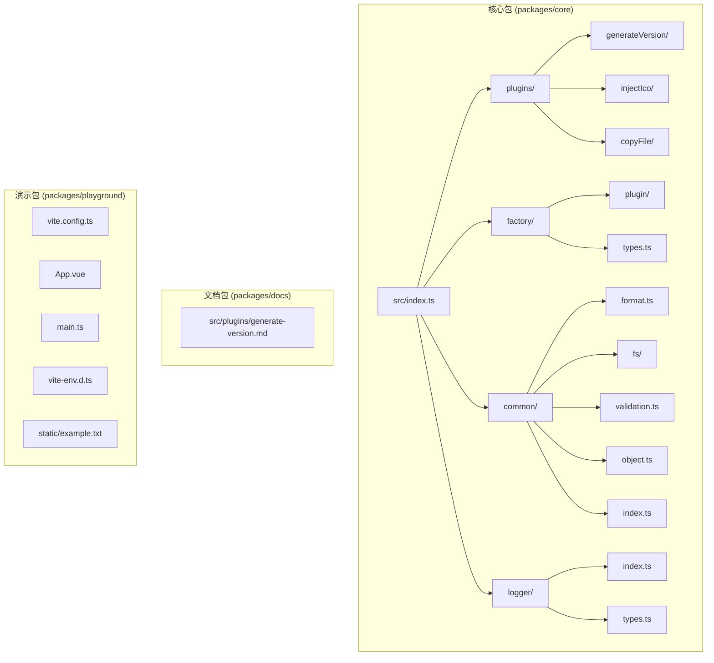
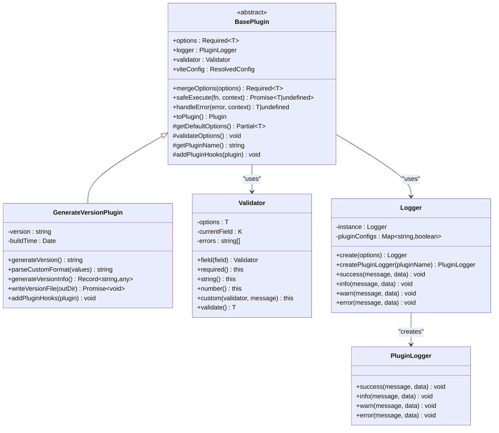
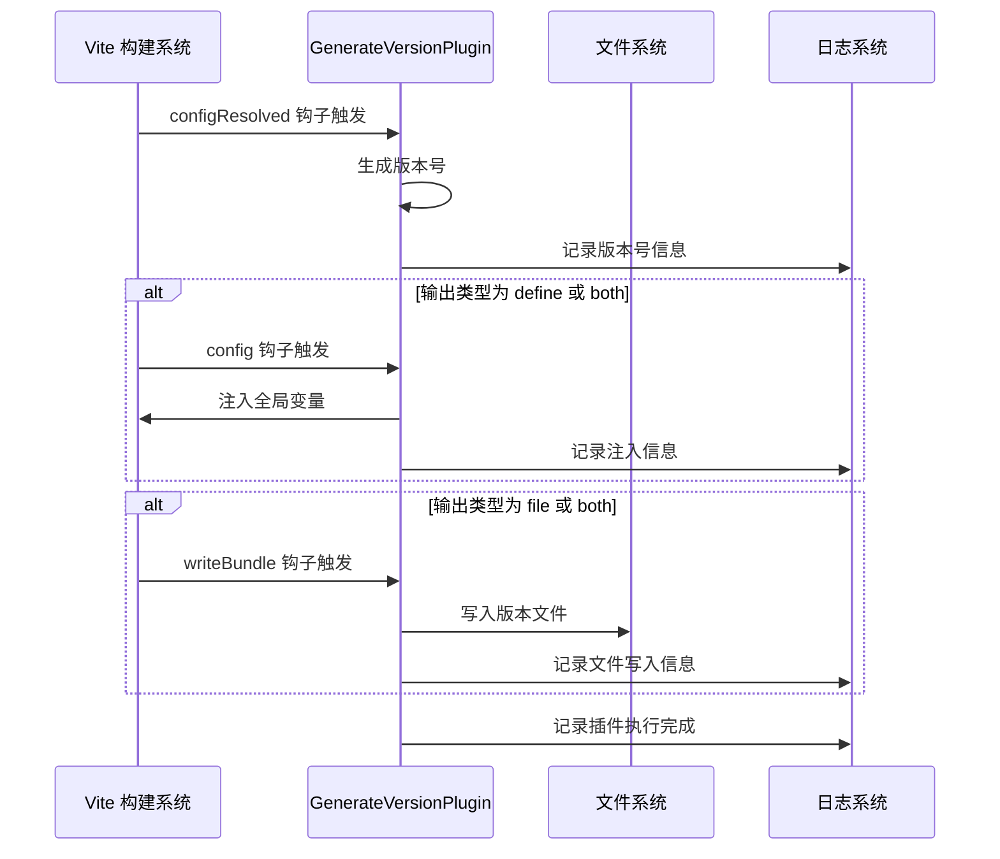
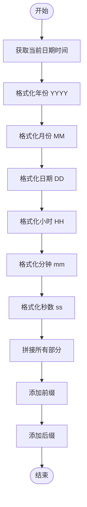
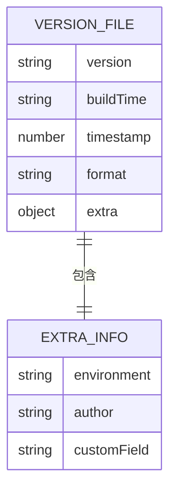
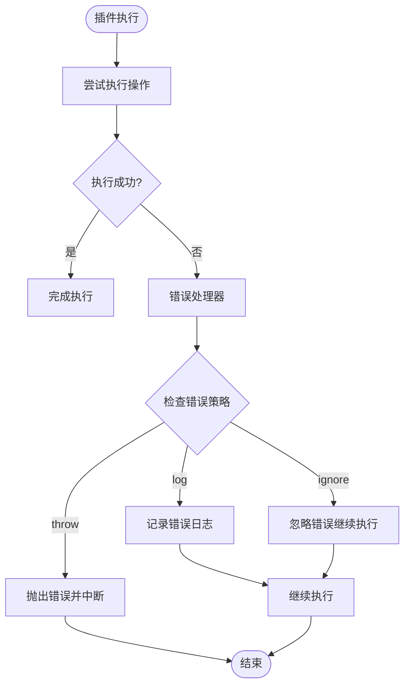
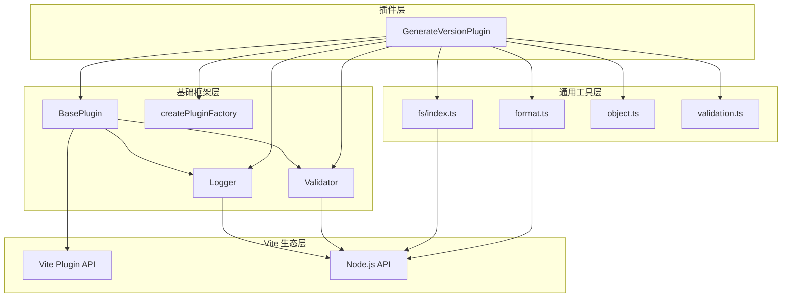

# 版本号生成插件 (generateVersion)

<cite>
**本文档中引用的文件**
- [packages/core/src/plugins/generateVersion/index.ts](file://packages/core/src/plugins/generateVersion/index.ts)
- [packages/core/src/plugins/generateVersion/types.ts](file://packages/core/src/plugins/generateVersion/types.ts)
- [packages/core/src/factory/plugin/index.ts](file://packages/core/src/factory/plugin/index.ts)
- [packages/core/src/common/format.ts](file://packages/core/src/common/format.ts)
- [packages/core/src/common/fs/index.ts](file://packages/core/src/common/fs/index.ts)
- [packages/core/src/logger/index.ts](file://packages/core/src/logger/index.ts)
- [packages/core/src/common/validation.ts](file://packages/core/src/common/validation.ts)
- [packages/docs/src/plugins/generate-version.md](file://packages/docs/src/plugins/generate-version.md)
- [packages/core/package.json](file://packages/core/package.json)
- [packages/core/build.config.ts](file://packages/core/build.config.ts)
- [packages/playground/vite.config.ts](file://packages/playground/vite.config.ts)
- [packages/playground/src/App.vue](file://packages/playground/src/App.vue)
</cite>

## 更新摘要
**变更内容**
- 新增 playground 实际使用示例，展示 generateVersion 插件的完整配置和使用方法
- 增强文档中的配置演示和测试功能说明
- 添加版本号显示界面的实际应用场景
- 完善插件集成的最佳实践指导

## 目录
1. [简介](#简介)
2. [项目结构](#项目结构)
3. [核心组件](#核心组件)
4. [架构概览](#架构概览)
5. [详细组件分析](#详细组件分析)
6. [Playground 实际使用示例](#playground-实际使用示例)
7. [依赖关系分析](#依赖关系分析)
8. [性能考虑](#性能考虑)
9. [故障排除指南](#故障排除指南)
10. [结论](#结论)

## 简介

版本号生成插件 (`generateVersion`) 是 MengXi Studio 开发的一套 Vite 插件库中的核心组件，专门用于在 Vite 构建过程中自动生成版本号。该插件提供了多种版本号格式支持，包括时间戳、日期、语义化版本、哈希等格式，并支持将版本号输出到文件或注入到代码中。

该插件采用模块化设计，基于统一的插件框架，具有良好的扩展性和可维护性。插件支持灵活的配置选项，包括自定义格式模板、输出类型选择、错误处理策略等。**新增功能**：通过 playground 实际使用示例，开发者可以直观地看到插件在真实项目中的配置和使用方法。

## 项目结构

项目采用多包架构，主要包含以下核心模块：



**图表来源**
- [packages/core/src/plugins/generateVersion/index.ts](file://packages/core/src/plugins/generateVersion/index.ts#L1-L257)
- [packages/core/src/factory/plugin/index.ts](file://packages/core/src/factory/plugin/index.ts#L1-L386)

**章节来源**
- [packages/core/package.json](file://packages/core/package.json#L1-L73)
- [packages/core/build.config.ts](file://packages/core/build.config.ts#L1-L18)

## 核心组件

### GenerateVersionPlugin 类

`GenerateVersionPlugin` 是插件的核心实现类，继承自 `BasePlugin` 基类，提供了完整的版本号生成功能。

#### 主要特性
- **多格式支持**: 支持 timestamp、date、datetime、semver、hash、custom 六种格式
- **灵活输出**: 支持 file、define、both 三种输出方式
- **自定义模板**: 支持自定义格式模板，包含丰富的占位符
- **错误处理**: 提供多种错误处理策略 (throw、log、ignore)
- **日志记录**: 完善的日志系统，支持详细和简洁两种模式

#### 关键属性
- `version`: 生成的版本号字符串
- `buildTime`: 构建时间戳
- `options`: 插件配置选项
- `logger`: 日志记录器实例

**章节来源**
- [packages/core/src/plugins/generateVersion/index.ts](file://packages/core/src/plugins/generateVersion/index.ts#L14-L197)

### 插件配置选项

插件提供了丰富的配置选项，支持高度定制化的版本号生成需求：

| 选项名 | 类型 | 默认值 | 描述 |
|--------|------|--------|------|
| format | VersionFormat | 'timestamp' | 版本号格式类型 |
| customFormat | string | - | 自定义格式模板 |
| semverBase | string | '1.0.0' | 语义化版本基础值 |
| autoIncrement | boolean | false | 是否自动递增补丁版本号 |
| outputType | OutputType | 'file' | 输出类型 |
| outputFile | string | 'version.json' | 输出文件路径 |
| defineName | string | '__APP_VERSION__' | 注入到代码中的全局变量名 |
| hashLength | number | 8 | 哈希长度 (1-32) |
| prefix | string | '' | 版本号前缀 |
| suffix | string | '' | 版本号后缀 |
| extra | object | - | 额外的版本信息 |

**章节来源**
- [packages/core/src/plugins/generateVersion/types.ts](file://packages/core/src/plugins/generateVersion/types.ts#L31-L120)

## 架构概览

插件采用分层架构设计，确保了良好的模块化和可扩展性：



**图表来源**
- [packages/core/src/factory/plugin/index.ts](file://packages/core/src/factory/plugin/index.ts#L27-L348)
- [packages/core/src/plugins/generateVersion/index.ts](file://packages/core/src/plugins/generateVersion/index.ts#L14-L197)
- [packages/core/src/logger/index.ts](file://packages/core/src/logger/index.ts#L7-L153)

### 插件生命周期

插件在 Vite 构建过程中的执行流程如下：



**图表来源**
- [packages/core/src/plugins/generateVersion/index.ts](file://packages/core/src/plugins/generateVersion/index.ts#L146-L196)

**章节来源**
- [packages/core/src/factory/plugin/index.ts](file://packages/core/src/factory/plugin/index.ts#L331-L347)

## 详细组件分析

### 版本号生成算法

插件的核心功能是根据不同的格式生成版本号字符串。以下是各格式的生成逻辑：

#### 时间戳格式 (timestamp)


**图表来源**
- [packages/core/src/plugins/generateVersion/index.ts](file://packages/core/src/plugins/generateVersion/index.ts#L63-L103)

#### 自定义格式解析
自定义格式支持丰富的占位符替换：

| 占位符 | 说明 | 示例 |
|--------|------|------|
| {YYYY} | 四位年份 | 2026 |
| {MM} | 两位月份 | 02 |
| {DD} | 两位日期 | 03 |
| {HH} | 两位小时 | 15 |
| {mm} | 两位分钟 | 30 |
| {ss} | 两位秒数 | 00 |
| {timestamp} | 时间戳 | 1738567800000 |
| {hash} | 随机哈希 | a1b2c3d4 |
| {major} | 主版本号 | 1 |
| {minor} | 次版本号 | 0 |
| {patch} | 补丁版本号 | 0 |

**章节来源**
- [packages/core/src/plugins/generateVersion/index.ts](file://packages/core/src/plugins/generateVersion/index.ts#L108-L120)
- [packages/core/src/common/format.ts](file://packages/core/src/common/format.ts#L128-L136)

### 文件输出机制

当配置为输出到文件时，插件会生成包含版本信息的 JSON 文件：



**图表来源**
- [packages/core/src/plugins/generateVersion/index.ts](file://packages/core/src/plugins/generateVersion/index.ts#L125-L133)

**章节来源**
- [packages/core/src/plugins/generateVersion/index.ts](file://packages/core/src/plugins/generateVersion/index.ts#L138-L144)

### 错误处理策略

插件提供了三种错误处理策略，确保在不同场景下的稳定性：



**图表来源**
- [packages/core/src/factory/plugin/index.ts](file://packages/core/src/factory/plugin/index.ts#L283-L311)

**章节来源**
- [packages/core/src/factory/plugin/index.ts](file://packages/core/src/factory/plugin/index.ts#L283-L311)

## Playground 实际使用示例

**新增功能**：playground 包提供了 generateVersion 插件的完整实际使用示例，包括配置演示、版本号显示界面和测试功能。

### Playground 配置示例

playground 中的 `vite.config.ts` 展示了 generateVersion 插件的完整配置：

```typescript
vitePlugin.generateVersion({
  // 版本号格式，可选值：timestamp、date、datetime、semver、hash、custom
  format: 'custom',
  // 自定义格式模板，支持占位符：{YYYY}、{MM}、{DD}、{HH}、{mm}、{ss}、{hash} 等
  customFormat: '{YYYY}.{MM}.{DD}-{hash}',
  // 哈希长度，范围 1-32
  hashLength: 6,
  // 输出类型：'file' 输出到文件，'define' 注入代码，'both' 两者兼具
  outputType: 'both',
  // 输出文件路径（相对于构建输出目录）
  outputFile: 'version.json',
  // 注入到代码中的全局变量名
  defineName: '__APP_VERSION__',
  // 版本号前缀
  prefix: 'v',
  // 是否启用插件，默认值为 true
  enabled: true,
  // 是否显示详细日志，默认值为 true
  verbose: true,
  // 额外的版本信息，会包含在输出的 JSON 文件中
  extra: {
    environment: 'development',
    author: 'MengXi Studio'
  }
})
```

**章节来源**
- [packages/playground/vite.config.ts](file://packages/playground/vite.config.ts#L66-L97)

### 版本号显示界面

playground 的 `App.vue` 展示了如何在前端界面中显示版本号：

```vue
<template>
  <div id="app">
    <h1>Vite Plugin Playground</h1>
    <p>Welcome to the playground for testing our Vite plugin!</p>

    <!-- generateVersion 插件示例：显示版本号 -->
    <div class="version-info">
      <p>应用版本: {{ appVersion }}</p>
    </div>

    <button @click="testPlugin">Test Plugin</button>
  </div>
</template>

<script setup lang="ts">
// 通过 generateVersion 插件注入的全局变量
declare const __APP_VERSION__: string
declare const __APP_VERSION___INFO: {
  version: string
  buildTime: string
  timestamp: number
  format: string
  [key: string]: unknown
}

// 获取版本号
const appVersion = __APP_VERSION__

function testPlugin() {
  // 打印版本信息
  console.log('应用版本:', __APP_VERSION__)
  console.log('版本详情:', __APP_VERSION___INFO)
}
</script>
```

**章节来源**
- [packages/playground/src/App.vue](file://packages/playground/src/App.vue#L1-L88)

### 测试功能增强

playground 提供了完整的测试功能，包括：
- **实时版本号显示**：页面顶部显示当前应用版本
- **控制台测试**：点击按钮查看版本号和详细信息
- **配置验证**：演示不同配置选项的效果
- **集成测试**：验证插件与 Vite 构建系统的兼容性

**章节来源**
- [packages/playground/src/App.vue](file://packages/playground/src/App.vue#L29-L33)

## 依赖关系分析

插件的依赖关系体现了清晰的模块化设计：



**图表来源**
- [packages/core/src/plugins/generateVersion/index.ts](file://packages/core/src/plugins/generateVersion/index.ts#L1-L6)
- [packages/core/src/factory/plugin/index.ts](file://packages/core/src/factory/plugin/index.ts#L1-L6)

### 外部依赖

插件的主要外部依赖包括：
- **Vite**: 构建工具和插件系统
- **Node.js**: 文件系统和加密模块
- **TypeScript**: 类型安全和开发体验

**章节来源**
- [packages/core/package.json](file://packages/core/package.json#L53-L60)

## 性能考虑

### 内存使用优化
- 使用单例模式管理日志系统，避免重复创建
- 采用流式文件操作，减少内存占用
- 及时释放临时变量和缓存

### 执行效率
- 版本号生成在配置解析阶段完成，避免重复计算
- 文件写入采用异步操作，不影响构建主线程
- 错误处理采用快速失败策略，减少不必要的操作

### 缓存策略
- 利用 Vite 的内置缓存机制
- 避免重复的文件系统操作
- 合理使用 Node.js 内置模块

## 故障排除指南

### 常见问题及解决方案

#### 配置验证错误
**问题**: 插件启动时报配置错误
**原因**: 配置选项不符合验证规则
**解决方案**:
1. 检查 `format` 选项是否为允许的值
2. 确认 `hashLength` 在 1-32 范围内
3. 当使用 `custom` 格式时，确保提供 `customFormat` 选项

#### 文件写入失败
**问题**: 版本文件无法生成
**原因**: 权限不足或路径不存在
**解决方案**:
1. 检查输出目录权限
2. 确认 `outputDir` 配置正确
3. 验证磁盘空间充足

#### 注入失败
**问题**: 全局变量未正确注入
**原因**: Vite 配置冲突
**解决方案**:
1. 检查 `defineName` 是否与其他定义冲突
2. 确认 `outputType` 设置正确
3. 验证 Vite 版本兼容性

**章节来源**
- [packages/core/src/factory/plugin/index.ts](file://packages/core/src/factory/plugin/index.ts#L283-L311)
- [packages/core/src/common/fs/index.ts](file://packages/core/src/common/fs/index.ts#L210-L221)

## 结论

版本号生成插件 (`generateVersion`) 是一个功能完整、设计精良的 Vite 插件，具有以下优势：

### 技术优势
- **模块化设计**: 基于统一的插件框架，易于扩展和维护
- **类型安全**: 完整的 TypeScript 类型定义，提供良好的开发体验
- **错误处理**: 灵活的错误处理策略，确保插件稳定性
- **性能优化**: 采用异步操作和缓存策略，保证构建效率

### 功能特性
- **多格式支持**: 满足不同场景的版本号需求
- **灵活配置**: 丰富的配置选项，支持高度定制化
- **双向输出**: 同时支持文件输出和代码注入
- **日志系统**: 完善的日志记录，便于调试和监控
- **实际应用**: 通过 playground 提供真实的使用示例

### 应用价值
该插件为 Vite 生态系统提供了可靠的版本号管理解决方案，适用于各种规模的前端项目，能够有效提升开发效率和构建质量。

**新增功能**：通过 playground 的实际使用示例，开发者可以：
- 直观地看到插件的完整配置方法
- 了解版本号在前端界面中的显示方式
- 通过测试功能验证插件的实际效果
- 掌握插件集成的最佳实践

通过本文档的详细分析，开发者可以更好地理解和使用该插件，充分发挥其功能特性，为项目构建提供稳定可靠的版本号支持。