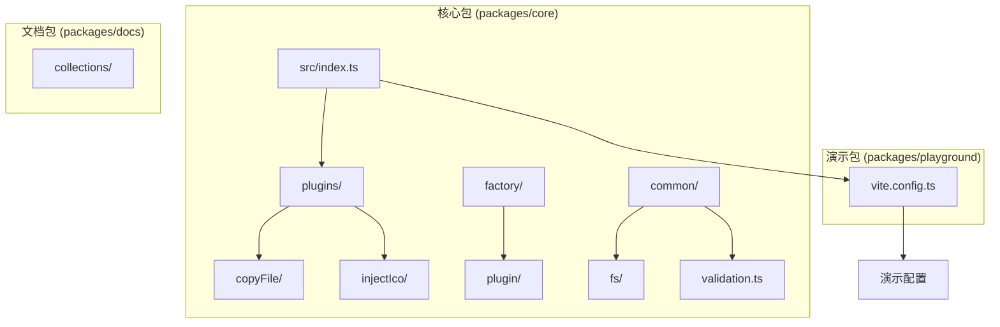
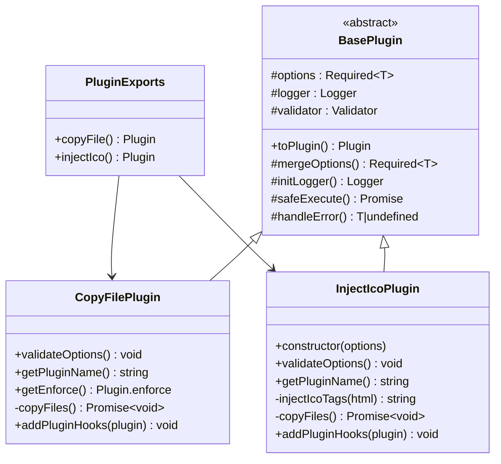
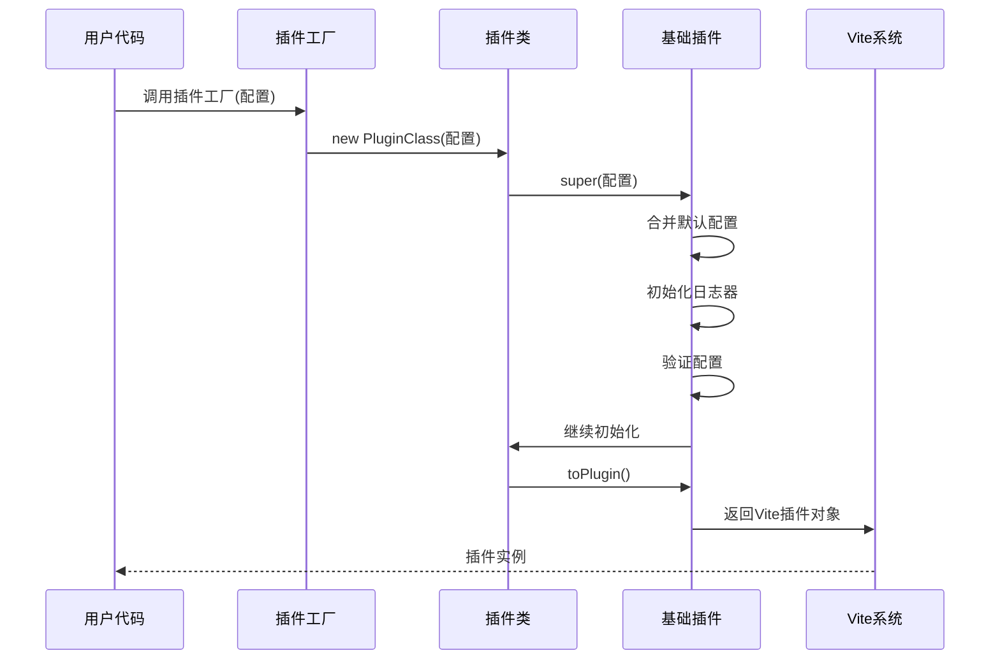
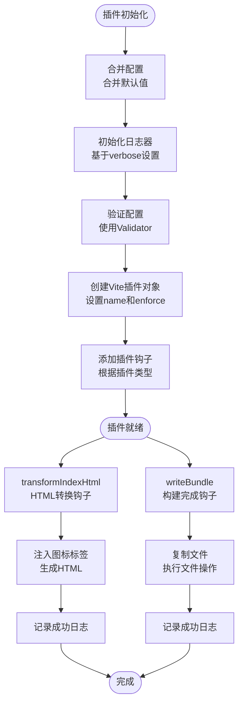
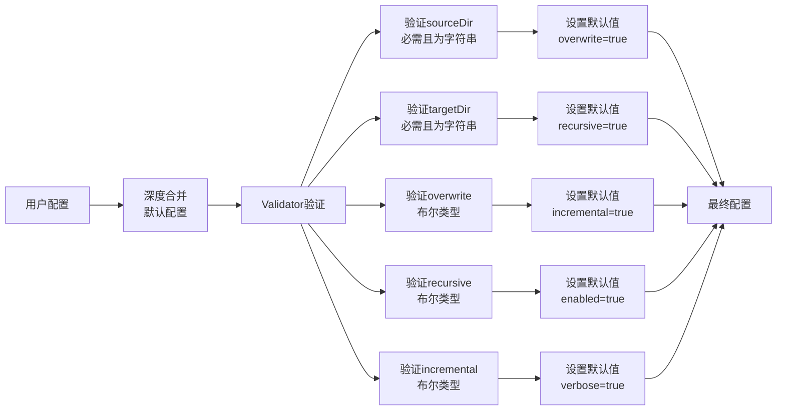
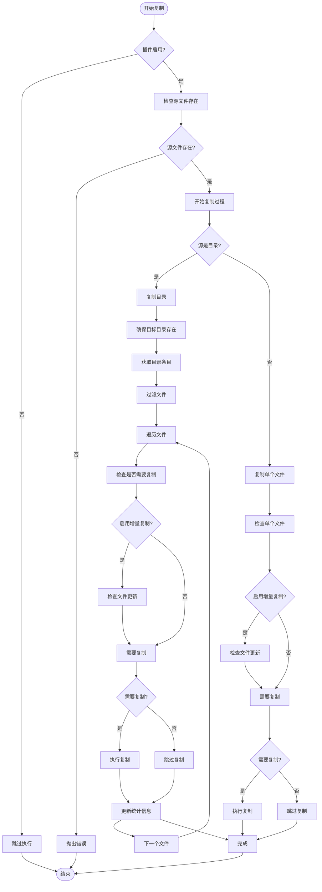
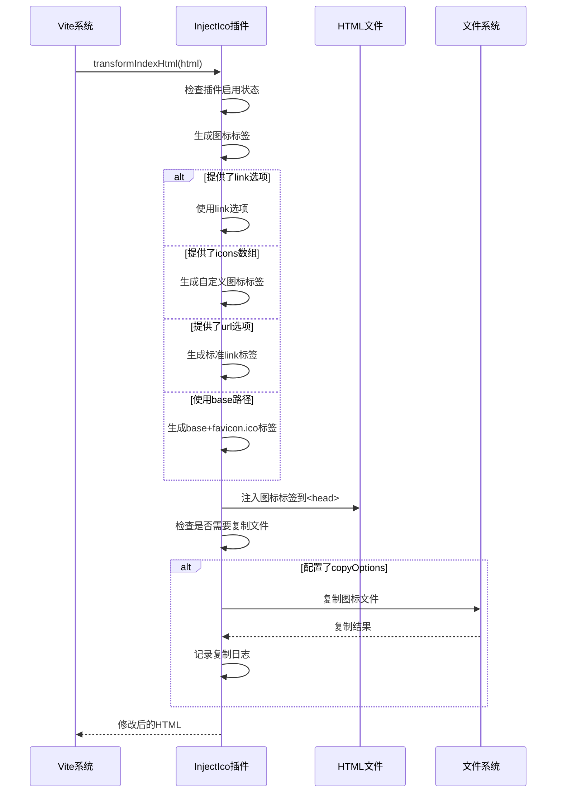
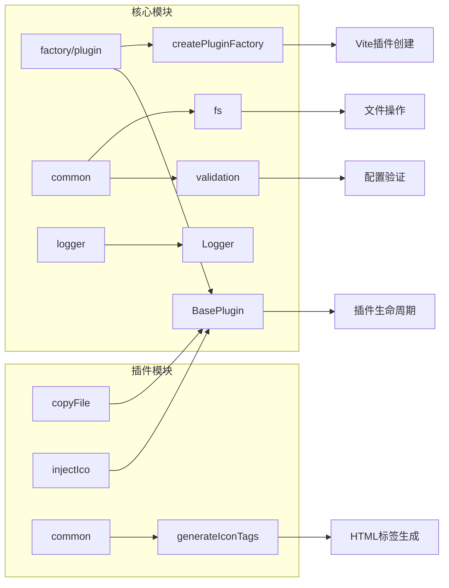

# 基础使用示例

<cite>
**本文档引用的文件**
- [packages/core/package.json](file://packages/core/package.json)
- [packages/core/src/index.ts](file://packages/core/src/index.ts)
- [packages/core/src/plugins/copyFile/index.ts](file://packages/core/src/plugins/copyFile/index.ts)
- [packages/core/src/plugins/copyFile/types.ts](file://packages/core/src/plugins/copyFile/types.ts)
- [packages/core/src/plugins/injectIco/index.ts](file://packages/core/src/plugins/injectIco/index.ts)
- [packages/core/src/plugins/injectIco/types.ts](file://packages/core/src/plugins/injectIco/types.ts)
- [packages/core/src/plugins/injectIco/common/index.ts](file://packages/core/src/plugins/injectIco/common/index.ts)
- [packages/core/src/factory/plugin/index.ts](file://packages/core/src/factory/plugin/index.ts)
- [packages/core/src/factory/plugin/types.ts](file://packages/core/src/factory/plugin/types.ts)
- [packages/core/src/common/validation.ts](file://packages/core/src/common/validation.ts)
- [packages/core/src/common/fs/index.ts](file://packages/core/src/common/fs/index.ts)
- [packages/playground/vite.config.ts](file://packages/playground/vite.config.ts)
- [packages/docs/src/plugins/copy-file.md](file://packages/docs/src/plugins/copy-file.md)
- [packages/docs/src/plugins/inject-ico.md](file://packages/docs/src/plugins/inject-ico.md)
</cite>

## 目录
1. [简介](#简介)
2. [项目结构](#项目结构)
3. [核心组件](#核心组件)
4. [架构概览](#架构概览)
5. [详细组件分析](#详细组件分析)
6. [依赖分析](#依赖分析)
7. [性能考虑](#性能考虑)
8. [故障排除指南](#故障排除指南)
9. [结论](#结论)
10. [附录](#附录)

## 简介

@Meng-Xi/Vite-Plugin 是一个专为 Vite 设计的插件库，提供了两个核心插件：copyFile 和 injectIco。这些插件旨在简化 Vite 项目中的文件复制和图标注入工作流。

**核心特性**：
- copyFile 插件：在构建完成后复制文件或目录到指定位置
- injectIco 插件：在 HTML 文件中注入网站图标链接
- 基于工厂模式的插件架构
- 完善的配置验证和错误处理机制
- 支持增量复制和递归复制

## 项目结构

该项目采用多包架构，主要包含以下核心模块：



**图表来源**
- [packages/core/src/index.ts](file://packages/core/src/index.ts#L1-L2)
- [packages/core/src/plugins/copyFile/index.ts](file://packages/core/src/plugins/copyFile/index.ts#L1-L116)
- [packages/core/src/plugins/injectIco/index.ts](file://packages/core/src/plugins/injectIco/index.ts#L1-L178)

**章节来源**
- [packages/core/package.json](file://packages/core/package.json#L1-L52)
- [packages/core/src/index.ts](file://packages/core/src/index.ts#L1-L2)

## 核心组件

### 插件导出结构

插件库通过统一的入口点导出所有可用插件：



**图表来源**
- [packages/core/src/index.ts](file://packages/core/src/index.ts#L1-L2)
- [packages/core/src/factory/plugin/index.ts](file://packages/core/src/factory/plugin/index.ts#L27-L337)
- [packages/core/src/plugins/copyFile/index.ts](file://packages/core/src/plugins/copyFile/index.ts#L13-L82)
- [packages/core/src/plugins/injectIco/index.ts](file://packages/core/src/plugins/injectIco/index.ts#L14-L139)

### 工厂模式架构

插件库采用工厂模式设计，提供统一的插件创建接口：



**图表来源**
- [packages/core/src/factory/plugin/index.ts](file://packages/core/src/factory/plugin/index.ts#L371-L383)
- [packages/core/src/factory/plugin/index.ts](file://packages/core/src/factory/plugin/index.ts#L320-L336)

**章节来源**
- [packages/core/src/index.ts](file://packages/core/src/index.ts#L1-L2)
- [packages/core/src/factory/plugin/index.ts](file://packages/core/src/factory/plugin/index.ts#L371-L383)

## 架构概览

### 插件生命周期



**图表来源**
- [packages/core/src/factory/plugin/index.ts](file://packages/core/src/factory/plugin/index.ts#L320-L336)
- [packages/core/src/plugins/copyFile/index.ts](file://packages/core/src/plugins/copyFile/index.ts#L77-L81)
- [packages/core/src/plugins/injectIco/index.ts](file://packages/core/src/plugins/injectIco/index.ts#L130-L138)

### 配置验证流程



**图表来源**
- [packages/core/src/factory/plugin/index.ts](file://packages/core/src/factory/plugin/index.ts#L98-L106)
- [packages/core/src/common/validation.ts](file://packages/core/src/common/validation.ts#L195-L201)

**章节来源**
- [packages/core/src/factory/plugin/index.ts](file://packages/core/src/factory/plugin/index.ts#L98-L106)
- [packages/core/src/common/validation.ts](file://packages/core/src/common/validation.ts#L1-L203)

## 详细组件分析

### copyFile 插件

#### 基本配置示例

最简配置示例：
```typescript
import { defineConfig } from 'vite'
import { copyFile } from '@meng-xi/vite-plugin'

export default defineConfig({
  plugins: [
    copyFile({
      sourceDir: 'src/assets',
      targetDir: 'dist/assets'
    })
  ]
})
```

完整配置示例：
```typescript
import { defineConfig } from 'vite'
import { copyFile } from '@meng-xi/vite-plugin'

export default defineConfig({
  plugins: [
    copyFile({
      sourceDir: 'src/assets',
      targetDir: 'dist/assets',
      overwrite: true,
      recursive: true,
      incremental: true,
      enabled: true,
      verbose: true,
      errorStrategy: 'throw'
    })
  ]
})
```

#### 配置选项详解

| 选项 | 类型 | 默认值 | 描述 |
|------|------|--------|------|
| sourceDir | string | 必填 | 源文件目录的路径，必须是非空字符串 |
| targetDir | string | 必填 | 目标文件目录的路径，必须是非空字符串 |
| overwrite | boolean | true | 是否覆盖同名文件 |
| recursive | boolean | true | 是否支持递归复制子目录 |
| incremental | boolean | true | 是否启用增量复制，仅复制修改过的文件 |
| enabled | boolean | true | 是否启用插件 |
| verbose | boolean | true | 是否显示详细日志 |
| errorStrategy | 'throw' \| 'log' \| 'ignore' | 'throw' | 错误处理策略 |

#### 文件复制流程



**图表来源**
- [packages/core/src/plugins/copyFile/index.ts](file://packages/core/src/plugins/copyFile/index.ts#L53-L75)
- [packages/core/src/common/fs/index.ts](file://packages/core/src/common/fs/index.ts#L98-L202)

**章节来源**
- [packages/core/src/plugins/copyFile/index.ts](file://packages/core/src/plugins/copyFile/index.ts#L1-L116)
- [packages/core/src/plugins/copyFile/types.ts](file://packages/core/src/plugins/copyFile/types.ts#L1-L44)
- [packages/docs/src/plugins/copy-file.md](file://packages/docs/src/plugins/copy-file.md#L1-L159)

### injectIco 插件

#### 基本配置示例

字符串形式（视为 base 路径）：
```typescript
import { defineConfig } from 'vite'
import { injectIco } from '@meng-xi/vite-plugin'

export default defineConfig({
  plugins: [injectIco('/assets')]
})
```

基本配置（base + 默认 favicon.ico）：
```typescript
import { defineConfig } from 'vite'
import { injectIco } from '@meng-xi/vite-plugin'

export default defineConfig({
  plugins: [
    injectIco({
      base: '/assets'
    })
  ]
})
```

完整配置：
```typescript
import { defineConfig } from 'vite'
import { injectIco } from '@meng-xi/vite-plugin'

export default defineConfig({
  plugins: [
    injectIco({
      base: '/assets',
      enabled: true,
      verbose: true,
      copyOptions: {
        sourceDir: 'src/assets/icons',
        targetDir: 'dist/assets/icons',
        overwrite: true,
        recursive: true
      }
    })
  ]
})
```

#### 配置选项详解

| 选项 | 类型 | 默认值 | 描述 |
|------|------|--------|------|
| base | string | '/' | 图标文件的基础路径，默认为根路径 '/' |
| url | string | undefined | 图标的完整 URL，如果提供则优先使用 |
| link | string | undefined | 自定义的完整 link 标签 HTML |
| icons | array | undefined | 自定义图标数组，支持多种图标格式和尺寸 |
| verbose | boolean | true | 是否显示详细日志 |
| enabled | boolean | true | 是否启用插件 |
| errorStrategy | 'throw' \| 'log' \| 'ignore' | 'throw' | 错误处理策略 |
| copyOptions | object | undefined | 图标文件复制配置 |

##### copyOptions 配置

| 选项 | 类型 | 默认值 | 描述 |
|------|-------|--------|------|
| sourceDir | string | 必填 | 图标源文件目录，用于复制图标到打包目录 |
| targetDir | string | 必填 | 图标目标目录（打包目录） |
| overwrite | boolean | true | 是否覆盖同名文件 |
| recursive | boolean | true | 是否支持递归复制 |

#### 图标注入流程



**图表来源**
- [packages/core/src/plugins/injectIco/index.ts](file://packages/core/src/plugins/injectIco/index.ts#L130-L138)
- [packages/core/src/plugins/injectIco/common/index.ts](file://packages/core/src/plugins/injectIco/common/index.ts#L9-L40)

**章节来源**
- [packages/core/src/plugins/injectIco/index.ts](file://packages/core/src/plugins/injectIco/index.ts#L1-L178)
- [packages/core/src/plugins/injectIco/types.ts](file://packages/core/src/plugins/injectIco/types.ts#L1-L113)
- [packages/docs/src/plugins/inject-ico.md](file://packages/docs/src/plugins/inject-ico.md#L1-L258)

### 实际使用场景

#### 场景一：静态资源复制

适用于需要在构建时复制静态资源的场景：
- 复制字体文件到 dist 目录
- 复制配置文件到打包输出
- 复制媒体资源到 CDN 目录

#### 场景二：图标管理

适用于需要动态管理网站图标的场景：
- 管理多尺寸 favicon
- 支持 SVG 和 PNG 格式
- 自动注入到 HTML 头部
- 可选的文件复制功能

#### 场景三：条件性启用

根据环境变量动态启用插件：
```typescript
export default defineConfig({
  plugins: [
    copyFile({
      sourceDir: 'src/assets',
      targetDir: 'dist/assets',
      enabled: process.env.NODE_ENV === 'production'
    }),
    injectIco({
      base: '/assets',
      enabled: process.env.NODE_ENV === 'production'
    })
  ]
})
```

**章节来源**
- [packages/playground/vite.config.ts](file://packages/playground/vite.config.ts#L1-L69)

## 依赖分析

### 外部依赖

```mermaid
graph TB
subgraph "运行时依赖"
A[Vite ^5.0.0] --> B[插件系统]
C[TypeScript] --> D[类型定义]
end
subgraph "内部依赖"
E[BasePlugin] --> F[Logger]
E --> G[Validator]
E --> H[FileSystem]
I[copyFile] --> E
J[injectIco] --> E
K[Factory] --> I
K --> J
end
subgraph "工具依赖"
L[unbuild] --> M[构建工具]
N[@types/node] --> O[Node类型]
end
```

**图表来源**
- [packages/core/package.json](file://packages/core/package.json#L32-L38)
- [packages/core/src/factory/plugin/index.ts](file://packages/core/src/factory/plugin/index.ts#L1-L5)

### 内部模块关系



**图表来源**
- [packages/core/src/factory/plugin/index.ts](file://packages/core/src/factory/plugin/index.ts#L1-L384)
- [packages/core/src/plugins/copyFile/index.ts](file://packages/core/src/plugins/copyFile/index.ts#L1-L116)
- [packages/core/src/plugins/injectIco/index.ts](file://packages/core/src/plugins/injectIco/index.ts#L1-L178)

**章节来源**
- [packages/core/package.json](file://packages/core/package.json#L32-L38)

## 性能考虑

### 增量复制优化

copyFile 插件实现了智能的增量复制机制：

1. **时间戳比较**：比较源文件和目标文件的修改时间
2. **文件大小验证**：确保文件完整性
3. **条件复制判断**：只有在文件确实发生变化时才执行复制

### 并发处理

- 文件系统操作采用异步处理
- 目录遍历支持递归操作
- 复制过程中的错误处理不影响整体流程

### 内存管理

- 大文件复制采用流式处理
- 目录扫描分批处理
- 避免不必要的内存占用

## 故障排除指南

### 常见问题及解决方案

#### 配置验证错误

**问题**：配置验证失败
**原因**：必填字段缺失或类型不匹配
**解决**：检查配置选项的类型和必填性

#### 文件不存在错误

**问题**：源文件不存在
**原因**：sourceDir 指向的路径不存在
**解决**：确认源文件路径正确，检查文件权限

#### 权限错误

**问题**：文件复制失败
**原因**：没有足够的文件系统权限
**解决**：检查源文件和目标目录的权限设置

#### HTML 注入失败

**问题**：图标标签未注入到 HTML
**原因**：未找到 `</head>` 标签
**解决**：确认 HTML 模板结构正确

### 调试技巧

1. **启用详细日志**：设置 `verbose: true` 查看详细执行信息
2. **检查插件状态**：确认 `enabled: true` 状态
3. **验证配置**：使用最小配置验证插件基本功能
4. **查看错误策略**：根据 `errorStrategy` 设置调整错误处理

**章节来源**
- [packages/core/src/common/validation.ts](file://packages/core/src/common/validation.ts#L195-L201)
- [packages/core/src/common/fs/index.ts](file://packages/core/src/common/fs/index.ts#L10-L23)
- [packages/core/src/factory/plugin/index.ts](file://packages/core/src/factory/plugin/index.ts#L272-L300)

## 结论

@Meng-Xi/Vite-Plugin 提供了简洁而强大的插件解决方案，具有以下优势：

1. **易于使用**：提供直观的 API 和完善的配置选项
2. **功能完整**：涵盖文件复制和图标注入的核心需求
3. **扩展性强**：基于工厂模式设计，易于扩展新功能
4. **可靠性高**：完善的错误处理和配置验证机制
5. **性能优秀**：支持增量复制和智能文件处理

推荐在 Vite 项目中使用这些插件来简化构建流程，提高开发效率。

## 附录

### 最佳实践建议

1. **配置管理**：使用环境变量区分开发和生产环境配置
2. **路径规范**：使用相对路径确保跨平台兼容性
3. **权限设置**：确保构建用户对源文件和目标目录有足够权限
4. **监控日志**：启用详细日志便于问题排查
5. **版本管理**：定期更新插件版本以获得最新功能和修复

### 快速开始模板

```typescript
import { defineConfig } from 'vite'
import { copyFile, injectIco } from '@meng-xi/vite-plugin'

export default defineConfig({
  plugins: [
    // 文件复制插件
    copyFile({
      sourceDir: 'src/assets',
      targetDir: 'dist/assets',
      recursive: true,
      incremental: true
    }),
    
    // 图标注入插件
    injectIco({
      base: '/assets',
      enabled: true,
      verbose: true
    })
  ]
})
```