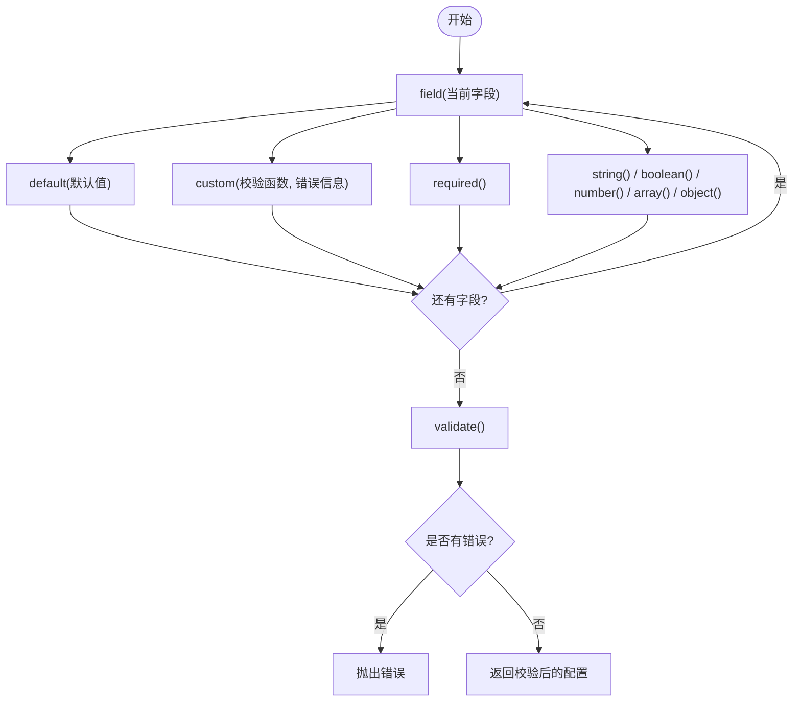

# 多环境配置管理

<cite>
**本文档引用的文件**
- [packages/core/src/index.ts](file://packages/core/src/index.ts)
- [packages/core/src/factory/plugin/index.ts](file://packages/core/src/factory/plugin/index.ts)
- [packages/core/src/factory/plugin/types.ts](file://packages/core/src/factory/plugin/types.ts)
- [packages/core/src/common/validation.ts](file://packages/core/src/common/validation.ts)
- [packages/core/src/common/object.ts](file://packages/core/src/common/object.ts)
- [packages/core/src/logger/index.ts](file://packages/core/src/logger/index.ts)
- [packages/core/src/plugins/copyFile/index.ts](file://packages/core/src/plugins/copyFile/index.ts)
- [packages/core/src/plugins/copyFile/types.ts](file://packages/core/src/plugins/copyFile/types.ts)
- [packages/core/src/plugins/injectIco/index.ts](file://packages/core/src/plugins/injectIco/index.ts)
- [packages/core/src/plugins/injectIco/types.ts](file://packages/core/src/plugins/injectIco/types.ts)
- [packages/playground/vite.config.ts](file://packages/playground/vite.config.ts)
- [packages/test/vite.config.ts](file://packages/test/vite.config.ts)
- [package.json](file://package.json)
</cite>

## 目录
1. [简介](#简介)
2. [项目结构](#项目结构)
3. [核心组件](#核心组件)
4. [架构总览](#架构总览)
5. [详细组件分析](#详细组件分析)
6. [依赖分析](#依赖分析)
7. [性能考虑](#性能考虑)
8. [故障排查指南](#故障排查指南)
9. [结论](#结论)
10. [附录](#附录)

## 简介
本参考文档围绕多环境配置管理展开，结合仓库现有插件体系与基础设施，系统性地展示如何为开发、测试与生产环境配置不同的插件参数；提供基于环境变量的动态配置方案（含条件加载与参数替换）；演示如何按环境优化插件性能与行为；给出 CI/CD 流水线中的配置管理策略；提供环境特定的插件启用/禁用方案；说明不同部署环境下的路径与资源配置处理；并总结配置文件的组织结构与命名约定建议，最后提供配置验证与错误处理的最佳实践，确保配置方案具备良好的可维护性与可扩展性。

## 项目结构
该项目采用多包工作区结构，核心能力集中在 packages/core，包含通用工厂、验证器、日志器与具体插件实现；playground 与 test 提供示例与测试配置；顶层 package.json 管理脚本与工作区。

图表来源
- [packages/core/src/index.ts](file://packages/core/src/index.ts#L1-L8)
- [packages/core/src/factory/plugin/index.ts](file://packages/core/src/factory/plugin/index.ts#L1-L387)
- [packages/core/src/factory/plugin/types.ts](file://packages/core/src/factory/plugin/types.ts#L1-L46)
- [packages/core/src/common/validation.ts](file://packages/core/src/common/validation.ts#L1-L203)
- [packages/core/src/common/object.ts](file://packages/core/src/common/object.ts#L1-L30)
- [packages/core/src/logger/index.ts](file://packages/core/src/logger/index.ts#L1-L155)
- [packages/core/src/plugins/copyFile/index.ts](file://packages/core/src/plugins/copyFile/index.ts#L1-L121)
- [packages/core/src/plugins/copyFile/types.ts](file://packages/core/src/plugins/copyFile/types.ts#L1-L44)
- [packages/core/src/plugins/injectIco/index.ts](file://packages/core/src/plugins/injectIco/index.ts#L1-L169)
- [packages/core/src/plugins/injectIco/types.ts](file://packages/core/src/plugins/injectIco/types.ts#L1-L113)
- [packages/playground/vite.config.ts](file://packages/playground/vite.config.ts#L1-L69)
- [packages/test/vite.config.ts](file://packages/test/vite.config.ts#L1-L35)

章节来源
- [packages/core/src/index.ts](file://packages/core/src/index.ts#L1-L8)
- [package.json](file://package.json#L1-L47)

## 核心组件
- 插件工厂与基类
  - BasePlugin 提供统一的配置合并、日志初始化、验证器、错误处理策略与生命周期钩子挂载能力；插件通过 toPlugin 将自身转换为 Vite 插件对象。
  - createPluginFactory 提供标准化器与实例化流程，支持字符串或对象两种传参形态。
- 配置验证器
  - Validator 提供链式 API，支持必填、类型、自定义校验与默认值设置，validate 统一抛错。
- 深度合并
  - deepMerge 实现嵌套对象的深度合并，保证默认值与用户配置的正确叠加。
- 日志器
  - Logger 提供 info/success/warn/error 四种日志类型，支持全局开关与实例开关。
- 插件实现
  - copyFile：构建后复制静态资源，支持增量、递归与覆盖控制。
  - injectIco：向 HTML 注入图标链接，支持基础路径、URL、自定义 link 标签与图标数组；可选复制图标文件。

章节来源
- [packages/core/src/factory/plugin/index.ts](file://packages/core/src/factory/plugin/index.ts#L27-L349)
- [packages/core/src/factory/plugin/types.ts](file://packages/core/src/factory/plugin/types.ts#L1-L46)
- [packages/core/src/common/validation.ts](file://packages/core/src/common/validation.ts#L16-L202)
- [packages/core/src/common/object.ts](file://packages/core/src/common/object.ts#L8-L29)
- [packages/core/src/logger/index.ts](file://packages/core/src/logger/index.ts#L6-L154)
- [packages/core/src/plugins/copyFile/index.ts](file://packages/core/src/plugins/copyFile/index.ts#L13-L120)
- [packages/core/src/plugins/injectIco/index.ts](file://packages/core/src/plugins/injectIco/index.ts#L14-L131)

## 架构总览
下图展示多环境配置在插件体系中的流转：环境变量驱动的配置标准化器 -> 工厂创建插件实例 -> 基类合并默认值与用户配置 -> 验证器校验 -> 日志器输出 -> 插件钩子执行。

图表来源
- [packages/core/src/factory/plugin/index.ts](file://packages/core/src/factory/plugin/index.ts#L370-L386)
- [packages/core/src/factory/plugin/index.ts](file://packages/core/src/factory/plugin/index.ts#L108-L118)
- [packages/core/src/common/validation.ts](file://packages/core/src/common/validation.ts#L195-L201)
- [packages/core/src/logger/index.ts](file://packages/core/src/logger/index.ts#L60-L63)

## 详细组件分析

### 基础插件与工厂
- BasePlugin
  - 负责配置合并、日志初始化、验证器创建与错误处理策略。
  - toPlugin 将插件注册到 Vite 生命周期，按 enabled 条件执行 onConfigResolved。
- createPluginFactory
  - 接收可选标准化器，将字符串或对象配置规范化为插件期望的配置对象，再创建 Vite 插件实例。

图表来源
- [packages/core/src/factory/plugin/index.ts](file://packages/core/src/factory/plugin/index.ts#L27-L349)
- [packages/core/src/plugins/copyFile/index.ts](file://packages/core/src/plugins/copyFile/index.ts#L13-L86)
- [packages/core/src/plugins/injectIco/index.ts](file://packages/core/src/plugins/injectIco/index.ts#L14-L131)

章节来源
- [packages/core/src/factory/plugin/index.ts](file://packages/core/src/factory/plugin/index.ts#L27-L349)
- [packages/core/src/factory/plugin/types.ts](file://packages/core/src/factory/plugin/types.ts#L1-L46)

### 配置验证器
- Validator 提供链式 API，支持字段必填、类型校验、自定义校验与默认值设置；validate 统一收集错误并抛出异常，便于在初始化阶段快速暴露配置问题。

图表来源
- [packages/core/src/common/validation.ts](file://packages/core/src/common/validation.ts#L45-L201)

章节来源
- [packages/core/src/common/validation.ts](file://packages/core/src/common/validation.ts#L16-L202)

### 深度合并
- deepMerge 对嵌套对象进行递归合并，确保默认值与用户配置的正确叠加，避免浅拷贝导致的覆盖问题。

章节来源
- [packages/core/src/common/object.ts](file://packages/core/src/common/object.ts#L8-L29)

### 日志器
- Logger 提供统一前缀、时间戳与彩色输出；支持全局开关与实例开关，便于在不同环境下控制日志级别与输出量。

章节来源
- [packages/core/src/logger/index.ts](file://packages/core/src/logger/index.ts#L6-L154)

### 复制文件插件（copyFile）
- 默认行为：递归、增量、覆盖；构建完成后执行复制。
- 关键点：enabled 控制是否执行；validateOptions 校验 sourceDir/targetDir 等必要字段；writeBundle 钩子内安全执行复制逻辑。

章节来源
- [packages/core/src/plugins/copyFile/index.ts](file://packages/core/src/plugins/copyFile/index.ts#L13-L120)
- [packages/core/src/plugins/copyFile/types.ts](file://packages/core/src/plugins/copyFile/types.ts#L8-L43)

### 注入图标插件（injectIco）
- 默认行为：base 为根路径；transformIndexHtml 注入图标；writeBundle 可选复制图标文件。
- 关键点：支持多种配置形态（base、url、link、icons 数组）；validateOptions 对 copyOptions 进行二次校验；enabled 控制整体行为。

章节来源
- [packages/core/src/plugins/injectIco/index.ts](file://packages/core/src/plugins/injectIco/index.ts#L14-L131)
- [packages/core/src/plugins/injectIco/types.ts](file://packages/core/src/plugins/injectIco/types.ts#L70-L112)

## 依赖分析
- 组件耦合
  - 插件实现依赖 BasePlugin 与 createPluginFactory，形成高内聚低耦合。
  - 验证器与日志器作为通用工具被各插件复用。
- 外部依赖
  - Vite 插件生命周期钩子（如 writeBundle、transformIndexHtml）由插件实现使用。
- 可能的循环依赖
  - 当前结构清晰，未发现循环导入。

图表来源
- [packages/core/src/factory/plugin/index.ts](file://packages/core/src/factory/plugin/index.ts#L27-L349)
- [packages/core/src/plugins/copyFile/index.ts](file://packages/core/src/plugins/copyFile/index.ts#L13-L86)
- [packages/core/src/plugins/injectIco/index.ts](file://packages/core/src/plugins/injectIco/index.ts#L14-L131)

章节来源
- [packages/core/src/factory/plugin/index.ts](file://packages/core/src/factory/plugin/index.ts#L1-L387)
- [packages/core/src/plugins/copyFile/index.ts](file://packages/core/src/plugins/copyFile/index.ts#L1-L121)
- [packages/core/src/plugins/injectIco/index.ts](file://packages/core/src/plugins/injectIco/index.ts#L1-L169)

## 性能考虑
- 增量复制
  - copyFile 的 incremental 选项可减少不必要的 IO，适合大体积静态资源场景。
- 递归复制
  - recursive 选项在目录层级较深时需权衡性能，建议仅在必要时开启。
- 日志级别
  - production 环境建议关闭 verbose 或降低日志级别，减少输出开销。
- 错误策略
  - 生产环境推荐使用 'log' 或 'ignore' 以避免阻断构建；开发环境使用 'throw' 以便快速定位问题。
- 插件启用/禁用
  - 通过 enabled 控制插件生命周期执行，避免在非目标环境执行昂贵操作。

## 故障排查指南
- 配置验证失败
  - 检查 required 字段、类型与自定义校验规则；查看 validate 抛出的错误信息，逐项修正。
- 插件未执行
  - 确认 enabled 为 true；检查 Vite 生命周期钩子是否被正确挂载；查看日志输出确认执行路径。
- 路径与资源问题
  - 确保 sourceDir 存在且可访问；检查 targetDir 权限；在 CI/CD 中使用相对或绝对路径时保持一致性。
- 错误处理策略
  - 根据 errorStrategy 选择合适的行为：'throw' 会中断流程，'log' 与 'ignore' 会记录错误并继续。

章节来源
- [packages/core/src/common/validation.ts](file://packages/core/src/common/validation.ts#L195-L201)
- [packages/core/src/factory/plugin/index.ts](file://packages/core/src/factory/plugin/index.ts#L284-L312)
- [packages/core/src/plugins/copyFile/index.ts](file://packages/core/src/plugins/copyFile/index.ts#L58-L80)
- [packages/core/src/plugins/injectIco/index.ts](file://packages/core/src/plugins/injectIco/index.ts#L48-L82)

## 结论
本项目通过统一的插件工厂与基类、可组合的验证器与日志器，以及明确的生命周期钩子，为多环境配置管理提供了坚实基础。结合 enabled、verbose、errorStrategy 等通用选项，配合环境变量驱动的标准化器，可在开发、测试与生产环境中灵活切换插件行为与性能策略，满足 CI/CD 流水线的自动化需求。

## 附录

### 多环境配置实践清单
- 开发环境
  - enabled: true
  - verbose: true
  - errorStrategy: 'throw'
  - 增量复制：incremental: true
  - 路径：本地相对路径或临时目录
- 测试环境
  - enabled: true
  - verbose: true（可按需降低）
  - errorStrategy: 'log'
  - 路径：测试专用临时目录
- 生产环境
  - enabled: true（按需禁用非关键插件）
  - verbose: false
  - errorStrategy: 'log'
  - 路径：构建产物目录，避免冗余日志输出

### 基于环境变量的动态配置方案
- 标准化器模式
  - 在 createPluginFactory 中传入 OptionsNormalizer，读取 process.env 并将字符串或布尔值转换为插件期望的配置对象。
  - 示例路径：[packages/core/src/factory/plugin/index.ts](file://packages/core/src/factory/plugin/index.ts#L370-L386)
- 条件加载
  - 通过环境变量判断是否创建插件实例，或在 toPlugin 中根据 enabled 条件执行生命周期钩子。
  - 示例路径：[packages/core/src/factory/plugin/index.ts](file://packages/core/src/factory/plugin/index.ts#L332-L348)
- 参数替换
  - 使用环境变量替换路径、URL、基础路径等参数，确保在不同部署环境的一致性。
  - 示例路径：[packages/core/src/plugins/injectIco/types.ts](file://packages/core/src/plugins/injectIco/types.ts#L70-L112)，[packages/core/src/plugins/copyFile/types.ts](file://packages/core/src/plugins/copyFile/types.ts#L8-L43)

### CI/CD 流水线中的配置管理策略
- 环境变量注入
  - 在流水线中注入环境变量（如 NODE_ENV、PLUGIN_VERBOSE、PLUGIN_ERROR_STRATEGY），在构建阶段由标准化器读取并应用。
- 分层配置
  - 使用不同环境的配置文件或脚本，分别设置 enabled、verbose、errorStrategy 与路径参数。
- 缓存与增量
  - 利用增量复制与缓存策略减少重复构建时间，提升流水线效率。
- 审计与回滚
  - 记录插件执行日志与错误策略，便于问题追踪与回滚。

### 环境特定的插件启用/禁用方案
- 通过 enabled 控制插件生命周期执行，避免在非目标环境执行昂贵操作。
- 在流水线中按环境设置 enabled，例如仅在生产环境启用资源复制与严格校验。

章节来源
- [packages/core/src/factory/plugin/index.ts](file://packages/core/src/factory/plugin/index.ts#L332-L348)
- [packages/core/src/plugins/copyFile/index.ts](file://packages/core/src/plugins/copyFile/index.ts#L62-L66)
- [packages/core/src/plugins/injectIco/index.ts](file://packages/core/src/plugins/injectIco/index.ts#L49-L53)

### 不同部署环境下的路径与资源配置
- 路径策略
  - 开发：本地相对路径或临时目录
  - 测试：测试专用临时目录
  - 生产：构建产物目录，避免冗余日志输出
- 资源复制
  - 使用 copyOptions 配置 sourceDir/targetDir，结合 overwrite 与 recursive 控制复制行为。
- HTML 注入
  - injectIco 支持 base、url、link、icons 数组等多种形态，适配不同部署场景。

章节来源
- [packages/core/src/plugins/injectIco/types.ts](file://packages/core/src/plugins/injectIco/types.ts#L70-L112)
- [packages/core/src/plugins/copyFile/types.ts](file://packages/core/src/plugins/copyFile/types.ts#L8-L43)
- [packages/playground/vite.config.ts](file://packages/playground/vite.config.ts#L11-L68)
- [packages/test/vite.config.ts](file://packages/test/vite.config.ts#L10-L34)

### 配置文件组织结构与命名约定建议
- 目录结构
  - packages/core/src/plugins/<plugin>/types.ts：定义插件配置接口
  - packages/core/src/plugins/<plugin>/index.ts：插件实现与工厂导出
  - packages/playground/vite.config.ts：示例配置
  - packages/test/vite.config.ts：测试配置
- 命名约定
  - 插件配置接口以大驼峰命名（如 CopyFileOptions、InjectIcoOptions）
  - 工厂导出函数以小驼峰命名（如 copyFile、injectIco）
  - Vite 配置文件使用 vite.config.ts，按环境拆分（如 vite.config.dev.ts、vite.config.prod.ts）

章节来源
- [packages/core/src/plugins/copyFile/types.ts](file://packages/core/src/plugins/copyFile/types.ts#L1-L44)
- [packages/core/src/plugins/injectIco/types.ts](file://packages/core/src/plugins/injectIco/types.ts#L1-L113)
- [packages/playground/vite.config.ts](file://packages/playground/vite.config.ts#L1-L69)
- [packages/test/vite.config.ts](file://packages/test/vite.config.ts#L1-L35)

### 配置验证与错误处理最佳实践
- 验证策略
  - 在 validateOptions 中使用 Validator 对必填字段、类型与自定义规则进行集中校验
  - 对可选的嵌套配置（如 copyOptions）单独创建 Validator 进行二次校验
- 错误处理
  - 开发环境使用 'throw' 快速反馈问题
  - 测试/生产环境使用 'log' 或 'ignore' 保证流程不中断
  - 通过 handleError 统一记录错误上下文与策略分支

章节来源
- [packages/core/src/plugins/copyFile/index.ts](file://packages/core/src/plugins/copyFile/index.ts#L22-L40)
- [packages/core/src/plugins/injectIco/index.ts](file://packages/core/src/plugins/injectIco/index.ts#L21-L33)
- [packages/core/src/factory/plugin/index.ts](file://packages/core/src/factory/plugin/index.ts#L284-L312)
- [packages/core/src/common/validation.ts](file://packages/core/src/common/validation.ts#L195-L201)