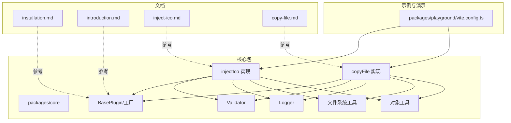
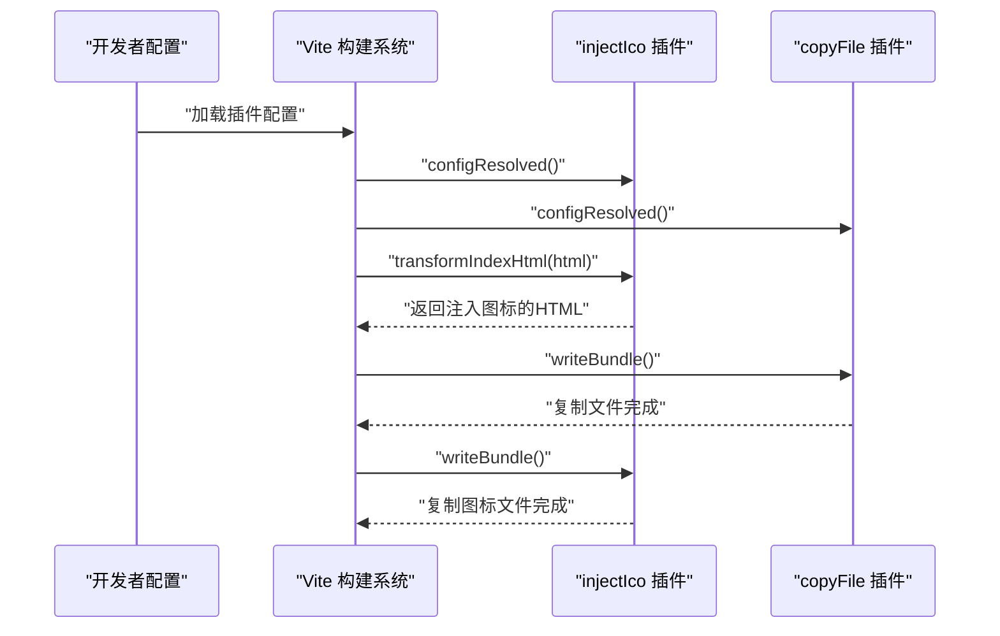
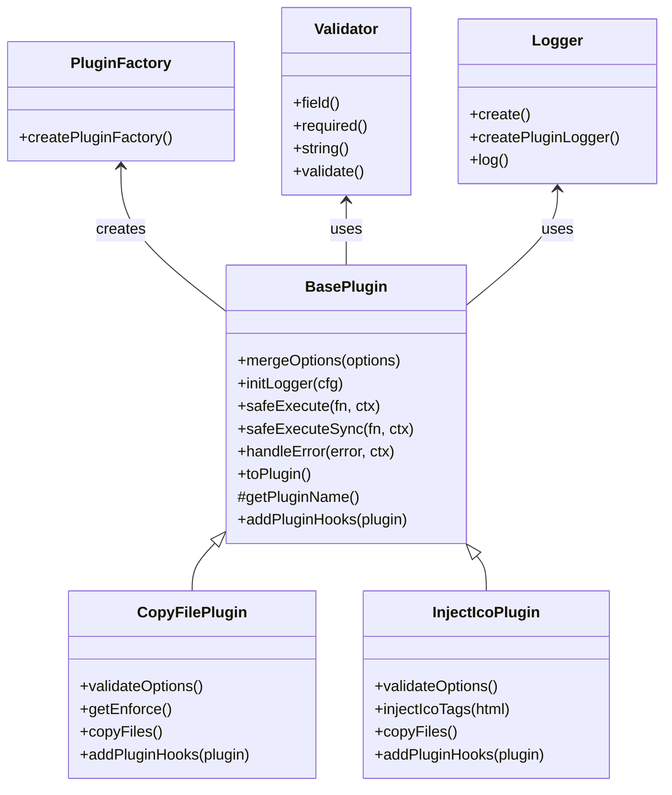

# 示例与案例

<cite>
**本文引用的文件**
- [packages/core/package.json](file://packages/core/package.json)
- [packages/playground/vite.config.ts](file://packages/playground/vite.config.ts)
- [packages/docs/src/plugins/copy-file.md](file://packages/docs/src/plugins/copy-file.md)
- [packages/docs/src/plugins/inject-ico.md](file://packages/docs/src/plugins/inject-ico.md)
- [packages/core/src/plugins/injectIco/index.ts](file://packages/core/src/plugins/injectIco/index.ts)
- [packages/core/src/plugins/injectIco/types.ts](file://packages/core/src/plugins/injectIco/types.ts)
- [packages/core/src/plugins/copyFile/index.ts](file://packages/core/src/plugins/copyFile/index.ts)
- [packages/core/src/plugins/copyFile/types.ts](file://packages/core/src/plugins/copyFile/types.ts)
- [packages/core/src/factory/plugin/index.ts](file://packages/core/src/factory/plugin/index.ts)
- [packages/core/src/factory/plugin/types.ts](file://packages/core/src/factory/plugin/types.ts)
- [packages/core/src/common/validation.ts](file://packages/core/src/common/validation.ts)
- [packages/core/src/common/object.ts](file://packages/core/src/common/object.ts)
- [packages/core/src/common/fs/index.ts](file://packages/core/src/common/fs/index.ts)
- [packages/core/src/logger/index.ts](file://packages/core/src/logger/index.ts)
- [packages/core/src/plugins/index.ts](file://packages/core/src/plugins/index.ts)
- [packages/docs/src/installation.md](file://packages/docs/src/installation.md)
- [packages/docs/src/introduction.md](file://packages/docs/src/introduction.md)
- [packages/playground/src/App.vue](file://packages/playground/src/App.vue)
- [packages/playground/src/main.ts](file://packages/playground/src/main.ts)
</cite>

## 更新摘要
**所做更改**
- 移除了对测试基础设施的引用和相关配置说明
- 更新了示例和配置说明以反映测试包的移除
- 简化了项目结构图，移除了测试相关的组件
- 更新了多环境配置管理和故障排除指南

## 目录
1. [简介](#简介)
2. [项目结构](#项目结构)
3. [核心组件](#核心组件)
4. [架构总览](#架构总览)
5. [详细组件分析](#详细组件分析)
6. [内置插件快速启动指南](#内置插件快速启动指南)
7. [自定义插件开发完整示例](#自定义插件开发完整示例)
8. [依赖分析](#依赖分析)
9. [性能考虑](#性能考虑)
10. [故障排除指南](#故障排除指南)
11. [结论](#结论)
12. [附录](#附录)

## 简介
本文件面向实际工程场景，提供基于真实代码与配置的"示例与案例"参考文档。内容涵盖：
- 基础使用：在简单 Vite 项目中快速集成插件
- 高级用法：复杂项目中的插件组合、配置优化与最佳实践
- 内置插件快速启动：零基础快速上手官方插件
- 自定义插件开发：完整的插件扩展开发指南
- 多环境配置：开发、测试、生产三环境的差异化策略
- CI/CD 集成：流水线自动化构建与质量保障
- 性能优化：增量复制、日志与错误策略等实操建议
- 故障排除：常见问题定位与调试技巧

## 项目结构
该项目采用多包工作区组织，核心能力集中在 core 包，配套有演示(playground)与文档(docs)。关键入口与示例配置如下：
- 核心插件实现：injectIco 与 copyFile
- 工厂与基础框架：BasePlugin、createPluginFactory、Validator
- 插件开发工具：Logger、文件系统工具、对象合并工具
- 示例配置：playground 展示完整组合
- 文档：各插件的使用说明与配置清单



**图表来源**
- [packages/playground/vite.config.ts](file://packages/playground/vite.config.ts#L1-L69)
- [packages/core/src/plugins/injectIco/index.ts](file://packages/core/src/plugins/injectIco/index.ts#L1-L169)
- [packages/core/src/plugins/copyFile/index.ts](file://packages/core/src/plugins/copyFile/index.ts#L1-L121)
- [packages/core/src/factory/plugin/index.ts](file://packages/core/src/factory/plugin/index.ts#L1-L386)
- [packages/core/src/common/validation.ts](file://packages/core/src/common/validation.ts#L1-L203)
- [packages/core/src/logger/index.ts](file://packages/core/src/logger/index.ts#L1-L188)
- [packages/core/src/common/fs/index.ts](file://packages/core/src/common/fs/index.ts#L1-L241)
- [packages/core/src/common/object.ts](file://packages/core/src/common/object.ts#L1-L30)
- [packages/docs/src/installation.md](file://packages/docs/src/installation.md#L1-L87)
- [packages/docs/src/introduction.md](file://packages/docs/src/introduction.md#L1-L47)

**章节来源**
- [packages/playground/vite.config.ts](file://packages/playground/vite.config.ts#L1-L69)

## 核心组件
- injectIco 插件：在 HTML 入口注入图标链接，并可在启用时复制图标文件至打包目录，支持多种配置形态（base、url、link、icons、copyOptions）
- copyFile 插件：在构建完成后复制文件/目录，支持递归、覆盖、增量复制与开关控制
- BasePlugin 与工厂：统一的插件生命周期、日志、错误策略与配置合并
- Validator：链式校验器，保证配置有效性
- Logger：单例日志管理器，提供统一的日志输出格式
- 文件系统工具：提供文件复制、目录遍历、权限检查等核心功能
- 对象工具：深度合并、类型检查等通用工具函数

**章节来源**
- [packages/core/src/plugins/injectIco/index.ts](file://packages/core/src/plugins/injectIco/index.ts#L1-L169)
- [packages/core/src/plugins/copyFile/index.ts](file://packages/core/src/plugins/copyFile/index.ts#L1-L121)
- [packages/core/src/factory/plugin/index.ts](file://packages/core/src/factory/plugin/index.ts#L1-L386)
- [packages/core/src/common/validation.ts](file://packages/core/src/common/validation.ts#L1-L203)
- [packages/core/src/logger/index.ts](file://packages/core/src/logger/index.ts#L1-L188)
- [packages/core/src/common/fs/index.ts](file://packages/core/src/common/fs/index.ts#L1-L241)
- [packages/core/src/common/object.ts](file://packages/core/src/common/object.ts#L1-L30)

## 架构总览
以下序列图展示两个插件在 Vite 生命周期中的典型调用顺序与职责边界。



**图表来源**
- [packages/core/src/plugins/injectIco/index.ts](file://packages/core/src/plugins/injectIco/index.ts#L123-L131)
- [packages/core/src/plugins/copyFile/index.ts](file://packages/core/src/plugins/copyFile/index.ts#L82-L86)
- [packages/core/src/factory/plugin/index.ts](file://packages/core/src/factory/plugin/index.ts#L331-L347)

## 详细组件分析

### injectIco 插件
- 功能要点
  - 在 HTML 入口注入图标链接（支持多种配置形态）
  - 可选地在构建完成后复制图标文件（增量复制）
  - 统一的错误策略与日志输出
- 配置要点
  - 支持字符串 base、完整 url、自定义 link、自定义 icons 数组
  - copyOptions 支持 sourceDir/targetDir/overwrite/recursive
- 生命周期
  - transformIndexHtml：注入图标标签
  - writeBundle：复制图标文件（如配置）


**图表来源**
- [packages/core/src/plugins/injectIco/index.ts](file://packages/core/src/plugins/injectIco/index.ts#L48-L82)

**章节来源**
- [packages/core/src/plugins/injectIco/index.ts](file://packages/core/src/plugins/injectIco/index.ts#L1-L169)
- [packages/core/src/plugins/injectIco/types.ts](file://packages/core/src/plugins/injectIco/types.ts#L1-L113)
- [packages/docs/src/plugins/inject-ico.md](file://packages/docs/src/plugins/inject-ico.md#L1-L258)

### copyFile 插件
- 功能要点
  - 构建完成后复制文件/目录
  - 支持递归、覆盖、增量复制
  - 统一的错误策略与日志输出
- 生命周期
  - writeBundle：执行复制并输出统计信息


**图表来源**
- [packages/core/src/plugins/copyFile/index.ts](file://packages/core/src/plugins/copyFile/index.ts#L58-L80)

**章节来源**
- [packages/core/src/plugins/copyFile/index.ts](file://packages/core/src/plugins/copyFile/index.ts#L1-L121)
- [packages/core/src/plugins/copyFile/types.ts](file://packages/core/src/plugins/copyFile/types.ts#L1-L44)
- [packages/docs/src/plugins/copy-file.md](file://packages/docs/src/plugins/copy-file.md#L1-L159)

### 基础框架与工具
- BasePlugin
  - 统一配置合并、日志初始化、生命周期钩子注册
  - 提供安全执行与错误策略处理
- createPluginFactory
  - 生成 Vite 插件对象，附加原始实例引用
- Validator
  - 链式 API 验证字段类型、必填、默认值与自定义规则
- Logger
  - 单例日志管理器，提供统一的日志格式化输出
- 文件系统工具
  - 提供文件复制、目录遍历、权限检查等核心功能
- 对象工具
  - 深度合并、类型检查等通用工具函数



**图表来源**
- [packages/core/src/factory/plugin/index.ts](file://packages/core/src/factory/plugin/index.ts#L27-L386)
- [packages/core/src/plugins/copyFile/index.ts](file://packages/core/src/plugins/copyFile/index.ts#L13-L87)
- [packages/core/src/plugins/injectIco/index.ts](file://packages/core/src/plugins/injectIco/index.ts#L14-L132)
- [packages/core/src/factory/plugin/types.ts](file://packages/core/src/factory/plugin/types.ts#L1-L46)
- [packages/core/src/common/validation.ts](file://packages/core/src/common/validation.ts#L16-L203)
- [packages/core/src/logger/index.ts](file://packages/core/src/logger/index.ts#L7-L188)

**章节来源**
- [packages/core/src/factory/plugin/index.ts](file://packages/core/src/factory/plugin/index.ts#L1-L386)
- [packages/core/src/factory/plugin/types.ts](file://packages/core/src/factory/plugin/types.ts#L1-L46)
- [packages/core/src/common/validation.ts](file://packages/core/src/common/validation.ts#L1-L203)
- [packages/core/src/logger/index.ts](file://packages/core/src/logger/index.ts#L1-L188)
- [packages/core/src/common/object.ts](file://packages/core/src/common/object.ts#L1-L30)
- [packages/core/src/common/fs/index.ts](file://packages/core/src/common/fs/index.ts#L1-L241)

## 内置插件快速启动指南

### copyFile 插件快速开始
copyFile 插件用于在构建完成后复制文件或目录，支持递归、覆盖和增量复制功能。

**基本配置示例**
```typescript
import { defineConfig } from 'vite'
import { copyFile } from '@meng-xi/vite-plugin'

export default defineConfig({
  plugins: [
    copyFile({
      sourceDir: 'src/assets',
      targetDir: 'dist/assets'
    })
  ]
})
```

**高级配置选项**
- `sourceDir`: 源目录路径（必填）
- `targetDir`: 目标目录路径（必填）
- `overwrite`: 是否覆盖已存在的文件（默认 true）
- `recursive`: 是否递归复制子目录（默认 true）
- `incremental`: 是否启用增量复制（默认 true）

**章节来源**
- [packages/docs/src/plugins/copy-file.md](file://packages/docs/src/plugins/copy-file.md#L1-L159)
- [packages/core/src/plugins/copyFile/index.ts](file://packages/core/src/plugins/copyFile/index.ts#L1-L121)

### injectIco 插件快速开始
injectIco 插件用于在 HTML 入口文件中注入网站图标链接，并可选复制图标文件到目标目录。

**基本配置示例**
```typescript
import { defineConfig } from 'vite'
import { injectIco } from '@meng-xi/vite-plugin'

export default defineConfig({
  plugins: [
    injectIco({
      base: '/assets'
    })
  ]
})
```

**配置形态支持**
- `base`: 图标基础路径
- `url`: 完整的图标 URL
- `link`: 自定义 link 标签配置
- `icons`: 图标数组配置
- `copyOptions`: 图标文件复制选项

**章节来源**
- [packages/docs/src/plugins/inject-ico.md](file://packages/docs/src/plugins/inject-ico.md#L1-L258)
- [packages/core/src/plugins/injectIco/index.ts](file://packages/core/src/plugins/injectIco/index.ts#L1-L169)

## 自定义插件开发完整示例

### 开发环境准备
首先安装必要的依赖和开发工具：

```bash
npm install @meng-xi/vite-plugin --save-dev
npm install typescript @types/node --save-dev
```

### 基础插件开发步骤

**1. 创建插件类结构**
```typescript
import { BasePlugin, createPluginFactory, Validator } from '@meng-xi/vite-plugin'
import type { Plugin } from 'vite'

interface MyPluginOptions {
  path: string
  enabled?: boolean
  verbose?: boolean
  errorStrategy?: 'throw' | 'log' | 'ignore'
}

class MyPlugin extends BasePlugin<MyPluginOptions> {
  // 实现默认配置
  protected getDefaultOptions() {
    return {
      path: './default'
    }
  }

  // 配置验证
  protected validateOptions(): void {
    this.validator.field('path').required().string().validate()
  }

  // 插件名称
  protected getPluginName(): string {
    return 'my-plugin'
  }

  // 添加 Vite 钩子
  protected addPluginHooks(plugin: Plugin): void {
    plugin.buildStart = () => {
      this.logger.info(`Plugin started with path: ${this.options.path}`)
    }
  }
}
```

**2. 创建插件工厂**
```typescript
export const myPlugin = createPluginFactory(MyPlugin)
```

**3. 在 Vite 中使用**
```typescript
import { defineConfig } from 'vite'
import { myPlugin } from './plugins/my-plugin'

export default defineConfig({
  plugins: [
    myPlugin({
      path: './src/assets'
    })
  ]
})
```

### 高级插件开发模式

**带选项标准化器的插件**
```typescript
class AdvancedPlugin extends BasePlugin<AdvancedPluginOptions> {
  protected getDefaultOptions() {
    return {
      config: {}
    }
  }

  protected validateOptions(): void {
    this.validator
      .field('config')
      .required()
      .object()
      .validate()
  }

  protected getPluginName(): string {
    return 'advanced-plugin'
  }

  protected addPluginHooks(plugin: Plugin): void {
    // 实现复杂的构建逻辑
  }
}

// 支持字符串或对象配置
export const advancedPlugin = createPluginFactory(
  AdvancedPlugin, 
  (opt) => typeof opt === 'string' ? { config: { path: opt } } : opt
)
```

### 插件开发最佳实践

**1. 错误处理策略**
```typescript
protected handleError(error: unknown, context: string): T | undefined {
  const strategy = this.options.errorStrategy
  
  switch (strategy) {
    case 'throw':
      this.logger.error(`${context}: ${error}`)
      throw error
    case 'log':
      this.logger.warn(`${context}: ${error}`)
      return undefined
    case 'ignore':
      this.logger.info(`${context}: ${error}`)
      return undefined
  }
}
```

**2. 日志记录规范**
```typescript
this.logger.success('操作成功完成', { count: copiedFiles })
this.logger.info('开始执行复制操作', { source, target })
this.logger.warn('检测到潜在问题', { warning })
this.logger.error('操作失败', { error })
```

**3. 生命周期管理**
```typescript
protected onConfigResolved(config: ResolvedConfig): void {
  this.viteConfig = config
  this.logger.info('配置解析完成，插件已初始化')
}

protected addPluginHooks(plugin: Plugin): void {
  // 在这里添加所有 Vite 钩子
  plugin.configResolved = (config) => this.onConfigResolved(config)
  plugin.buildStart = () => this.handleBuildStart()
  plugin.writeBundle = () => this.handleWriteBundle()
}
```

**章节来源**
- [packages/docs/src/installation.md](file://packages/docs/src/installation.md#L46-L82)
- [packages/core/src/factory/plugin/index.ts](file://packages/core/src/factory/plugin/index.ts#L369-L386)
- [packages/core/src/factory/plugin/types.ts](file://packages/core/src/factory/plugin/types.ts#L1-L46)
- [packages/core/src/common/validation.ts](file://packages/core/src/common/validation.ts#L1-L203)
- [packages/core/src/logger/index.ts](file://packages/core/src/logger/index.ts#L1-L188)

## 依赖分析
- 插件对 Vite 的依赖：通过标准钩子接入（transformIndexHtml、writeBundle）
- 插件间耦合：低耦合，各自独立执行；可通过组合实现复杂流程
- 外部依赖：peerDependencies 指向 vite，构建产物导出模块化入口
- 开发依赖：TypeScript 类型定义、Node.js 文件系统 API

**章节来源**
- [packages/core/package.json](file://packages/core/package.json#L32-L34)

## 性能考虑
- 增量复制：copyFile 与 injectIco 在复制时默认启用增量模式，减少重复 IO
- 执行时机：copyFile 显式 enforce: 'post'，确保在其他构建任务之后执行
- 日志与错误策略：通过 verbose 与 errorStrategy 控制输出与中断行为，平衡可观测性与构建速度
- 文件系统优化：使用异步文件操作和批量处理减少 I/O 瓶颈
- 建议
  - 生产环境可开启增量复制与详细日志，便于回溯
  - CI 环境可将 errorStrategy 设为 log，避免小问题阻塞流水线
  - 大文件复制建议使用递归模式和覆盖选项

**章节来源**
- [packages/core/src/plugins/copyFile/index.ts](file://packages/core/src/plugins/copyFile/index.ts#L46-L48)
- [packages/core/src/plugins/injectIco/index.ts](file://packages/core/src/plugins/injectIco/index.ts#L116-L121)
- [packages/docs/src/plugins/copy-file.md](file://packages/docs/src/plugins/copy-file.md#L10-L14)
- [packages/docs/src/plugins/inject-ico.md](file://packages/docs/src/plugins/inject-ico.md#L9-L16)

## 故障排除指南
- 未找到 </head> 标签
  - 现象：插件跳过注入并输出警告
  - 排查：确认 HTML 结构与入口文件
  - 参考：[注入逻辑](file://packages/core/src/plugins/injectIco/index.ts#L77-L82)
- 配置校验失败
  - 现象：抛出包含具体字段错误的异常
  - 排查：核对必填字段与类型（如 sourceDir/targetDir）
  - 参考：[校验器](file://packages/core/src/common/validation.ts#L195-L200)
- 插件被禁用
  - 现象：跳过执行
  - 排查：检查 enabled 与环境变量
  - 参考：[copyFile 跳过条件](file://packages/core/src/plugins/copyFile/index.ts#L62-L66)，[injectIco 跳过条件](file://packages/core/src/plugins/injectIco/index.ts#L49-L53)
- CI 环境构建中断
  - 建议：将 errorStrategy 设为 log，保留构建产物以便诊断
  - 参考：[错误策略处理](file://packages/core/src/factory/plugin/index.ts#L283-L311)
- 文件权限问题
  - 现象：复制操作失败
  - 排查：检查源文件和目标目录的读写权限
  - 参考：[文件系统工具](file://packages/core/src/common/fs/index.ts#L10-L241)

**章节来源**
- [packages/core/src/plugins/injectIco/index.ts](file://packages/core/src/plugins/injectIco/index.ts#L77-L82)
- [packages/core/src/common/validation.ts](file://packages/core/src/common/validation.ts#L195-L200)
- [packages/core/src/plugins/copyFile/index.ts](file://packages/core/src/plugins/copyFile/index.ts#L62-L66)
- [packages/core/src/factory/plugin/index.ts](file://packages/core/src/factory/plugin/index.ts#L283-L311)
- [packages/core/src/common/fs/index.ts](file://packages/core/src/common/fs/index.ts#L10-L241)

## 结论
本项目通过统一的插件框架与清晰的生命周期设计，提供了开箱即用且易于扩展的 Vite 插件能力。内置的 copyFile 和 injectIco 插件为常见构建任务提供了即用解决方案，而完整的自定义插件开发框架则为开发者扩展插件生态系统提供了坚实基础。结合示例配置与演示项目，开发者可以在不同规模与复杂度的项目中快速落地，同时通过多环境策略、CI/CD 集成与性能优化手段，获得稳定高效的构建体验。

## 附录

### 基础使用示例（简单 Vite 项目）
- 在 Vite 配置中引入插件并按需启用
- 参考示例配置
  - [playground 配置](file://packages/playground/vite.config.ts#L11-L68)

**章节来源**
- [packages/playground/vite.config.ts](file://packages/playground/vite.config.ts#L1-L69)

### 高级使用案例（复杂项目组合）
- 组合策略
  - injectIco 用于注入图标链接与复制图标资源
  - copyFile 用于复制静态资源
- 参考实现
  - [injectIco 插件](file://packages/core/src/plugins/injectIco/index.ts#L123-L132)
  - [copyFile 插件](file://packages/core/src/plugins/copyFile/index.ts#L82-L86)

**章节来源**
- [packages/core/src/plugins/injectIco/index.ts](file://packages/core/src/plugins/injectIco/index.ts#L1-L169)
- [packages/core/src/plugins/copyFile/index.ts](file://packages/core/src/plugins/copyFile/index.ts#L1-L121)

### 多环境配置管理
- 开发环境
  - 建议：开启详细日志与增量复制，便于调试
  - 参考：[copy-file 文档-详细日志](file://packages/docs/src/plugins/copy-file.md#L67-L68)
- 测试环境
  - 建议：使用最小配置，确保可复现性
  - 参考：[playground 配置](file://packages/playground/vite.config.ts#L11-L68)
- 生产环境
  - 建议：启用增量复制与错误日志，避免中断
  - 参考：[inject-ico 文档-错误策略](file://packages/docs/src/plugins/inject-ico.md#L223-L241)

**章节来源**
- [packages/docs/src/plugins/copy-file.md](file://packages/docs/src/plugins/copy-file.md#L67-L68)
- [packages/docs/src/plugins/inject-ico.md](file://packages/docs/src/plugins/inject-ico.md#L223-L241)
- [packages/playground/vite.config.ts](file://packages/playground/vite.config.ts#L11-L68)

### CI/CD 集成与自动化构建
- 建议流程
  - 安装依赖 → 运行测试 → 构建产物 → 上传制品
- 错误策略
  - 将 errorStrategy 设为 log，避免小问题阻塞流水线
  - 参考：[错误策略处理](file://packages/core/src/factory/plugin/index.ts#L283-L311)
- 参考示例
  - [playground 配置](file://packages/playground/vite.config.ts#L11-L68)

**章节来源**
- [packages/core/src/factory/plugin/index.ts](file://packages/core/src/factory/plugin/index.ts#L283-L311)
- [packages/playground/vite.config.ts](file://packages/playground/vite.config.ts#L11-L68)

### 性能优化与监控集成
- 性能优化
  - 启用增量复制，减少重复 IO
  - 参考：[copyFile 增量复制](file://packages/core/src/plugins/copyFile/index.ts#L72-L76)
  - 参考：[injectIco 增量复制](file://packages/core/src/plugins/injectIco/index.ts#L113-L117)
- 监控集成
  - 通过日志输出构建统计（复制数量、耗时）
  - 参考：[copyFile 成功日志](file://packages/core/src/plugins/copyFile/index.ts#L78-L79)
  - 参考：[injectIco 成功日志](file://packages/core/src/plugins/injectIco/index.ts#L119-L121)

**章节来源**
- [packages/core/src/plugins/copyFile/index.ts](file://packages/core/src/plugins/copyFile/index.ts#L72-L79)
- [packages/core/src/plugins/injectIco/index.ts](file://packages/core/src/plugins/injectIco/index.ts#L113-L121)

### 故障排除与调试技巧
- 常见问题
  - 未找到 </head>：检查 HTML 入口与模板
  - 配置校验失败：核对必填字段与类型
  - 插件被禁用：检查 enabled 与环境变量
  - 文件权限问题：检查源文件和目标目录权限
- 参考实现
  - [injectIco 警告与跳过逻辑](file://packages/core/src/plugins/injectIco/index.ts#L77-L82)
  - [Validator 校验](file://packages/core/src/common/validation.ts#L195-L200)
  - [BasePlugin 错误处理](file://packages/core/src/factory/plugin/index.ts#L283-L311)
  - [文件系统权限检查](file://packages/core/src/common/fs/index.ts#L10-L241)

**章节来源**
- [packages/core/src/plugins/injectIco/index.ts](file://packages/core/src/plugins/injectIco/index.ts#L77-L82)
- [packages/core/src/common/validation.ts](file://packages/core/src/common/validation.ts#L195-L200)
- [packages/core/src/factory/plugin/index.ts](file://packages/core/src/factory/plugin/index.ts#L283-L311)
- [packages/core/src/common/fs/index.ts](file://packages/core/src/common/fs/index.ts#L10-L241)

### 插件生态系统扩展
- 插件发现机制
  - 通过 createPluginFactory 自动注册插件实例
  - 支持选项标准化器，提升用户体验
- 插件间通信
  - 通过 Vite 钩子系统实现插件间协作
  - 统一的日志和错误处理机制
- 扩展开发建议
  - 遵循 BasePlugin 抽象类规范
  - 实现完整的配置验证和错误处理
  - 提供详细的使用文档和示例

**章节来源**
- [packages/core/src/factory/plugin/index.ts](file://packages/core/src/factory/plugin/index.ts#L369-L386)
- [packages/core/src/plugins/index.ts](file://packages/core/src/plugins/index.ts#L1-L3)
- [packages/docs/src/introduction.md](file://packages/docs/src/introduction.md#L31-L45)