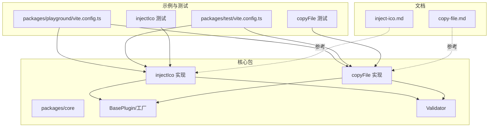
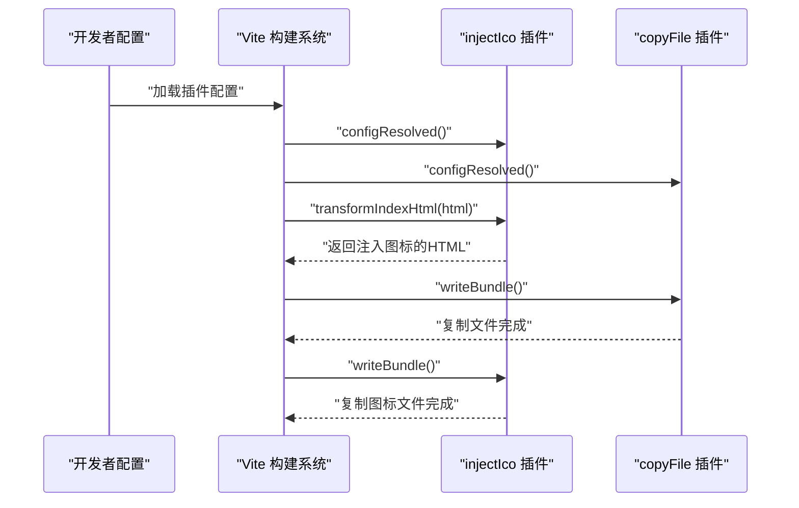
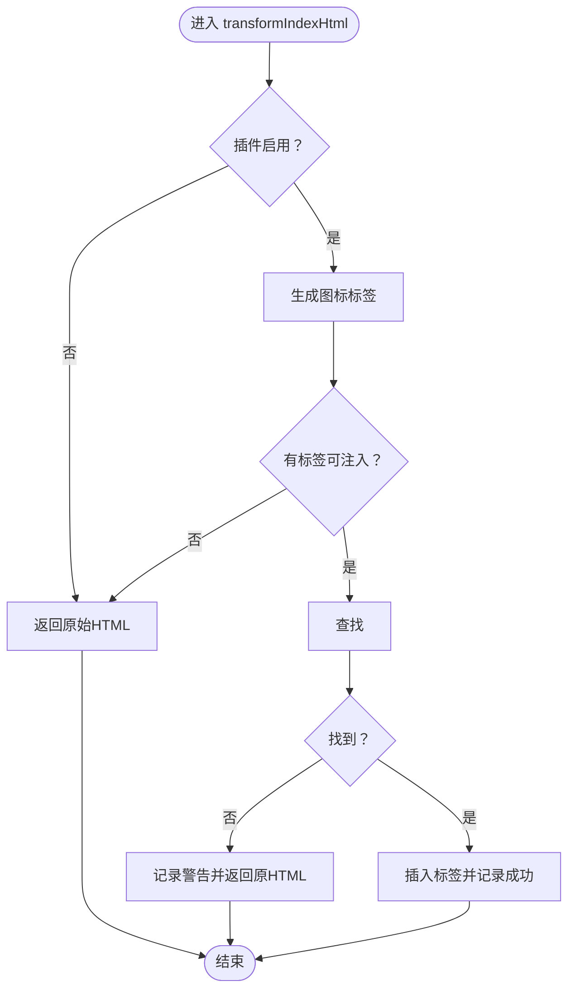
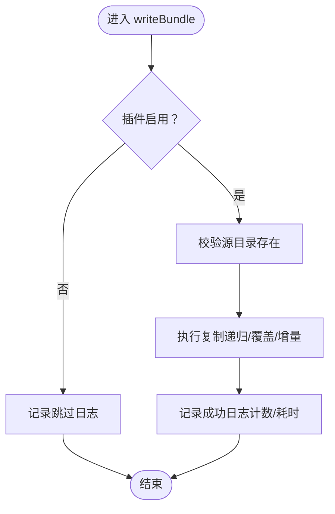
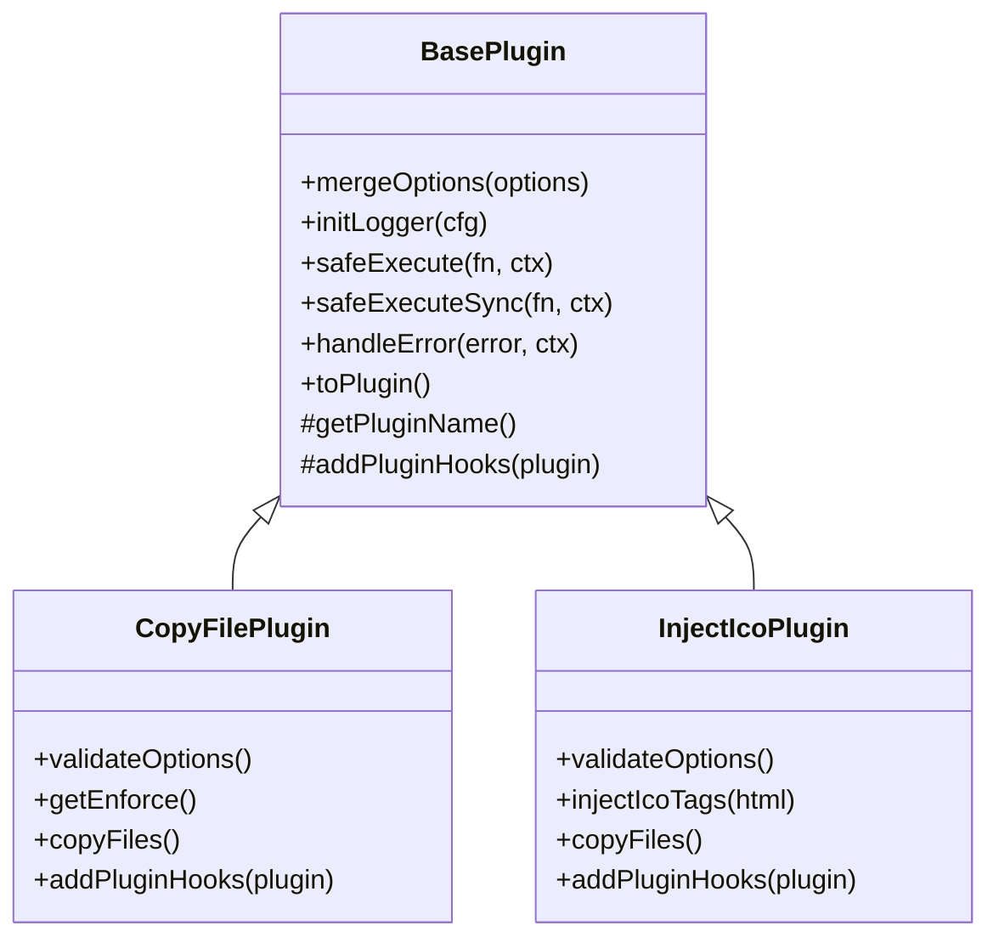

# 示例与案例

<cite>
**本文引用的文件**
- [packages/core/package.json](file://packages/core/package.json)
- [packages/playground/vite.config.ts](file://packages/playground/vite.config.ts)
- [packages/test/vite.config.ts](file://packages/test/vite.config.ts)
- [packages/docs/src/plugins/copy-file.md](file://packages/docs/src/plugins/copy-file.md)
- [packages/docs/src/plugins/inject-ico.md](file://packages/docs/src/plugins/inject-ico.md)
- [packages/core/src/plugins/injectIco/index.ts](file://packages/core/src/plugins/injectIco/index.ts)
- [packages/core/src/plugins/injectIco/types.ts](file://packages/core/src/plugins/injectIco/types.ts)
- [packages/core/src/plugins/copyFile/index.ts](file://packages/core/src/plugins/copyFile/index.ts)
- [packages/core/src/plugins/copyFile/types.ts](file://packages/core/src/plugins/copyFile/types.ts)
- [packages/core/src/factory/plugin/index.ts](file://packages/core/src/factory/plugin/index.ts)
- [packages/core/src/common/validation.ts](file://packages/core/src/common/validation.ts)
- [packages/test/src/copyFile/copyFile.test.ts](file://packages/test/src/copyFile/copyFile.test.ts)
- [packages/test/src/injectIco/injectIco.test.ts](file://packages/test/src/injectIco/injectIco.test.ts)
</cite>

## 目录
1. [简介](#简介)
2. [项目结构](#项目结构)
3. [核心组件](#核心组件)
4. [架构总览](#架构总览)
5. [详细组件分析](#详细组件分析)
6. [依赖分析](#依赖分析)
7. [性能考虑](#性能考虑)
8. [故障排除指南](#故障排除指南)
9. [结论](#结论)
10. [附录](#附录)

## 简介
本文件面向实际工程场景，提供基于真实代码与配置的“示例与案例”参考文档。内容涵盖：
- 基础使用：在简单 Vite 项目中快速集成插件
- 高级用法：复杂项目中的插件组合、配置优化与最佳实践
- 多环境配置：开发、测试、生产三环境的差异化策略
- CI/CD 集成：流水线自动化构建与质量保障
- 性能优化：增量复制、日志与错误策略等实操建议
- 故障排除：常见问题定位与调试技巧

## 项目结构
该项目采用多包工作区组织，核心能力集中在 core 包，配套有演示(playground)、测试(test)与文档(docs)。关键入口与示例配置如下：
- 核心插件实现：injectIco 与 copyFile
- 工厂与基础框架：BasePlugin、createPluginFactory、Validator
- 示例配置：playground 展示完整组合；test 展示最小可用配置
- 文档：各插件的使用说明与配置清单

图表来源
- [packages/playground/vite.config.ts](file://packages/playground/vite.config.ts#L1-L69)
- [packages/test/vite.config.ts](file://packages/test/vite.config.ts#L1-L35)
- [packages/core/src/plugins/injectIco/index.ts](file://packages/core/src/plugins/injectIco/index.ts#L1-L178)
- [packages/core/src/plugins/copyFile/index.ts](file://packages/core/src/plugins/copyFile/index.ts#L1-L116)
- [packages/core/src/factory/plugin/index.ts](file://packages/core/src/factory/plugin/index.ts#L1-L384)
- [packages/core/src/common/validation.ts](file://packages/core/src/common/validation.ts#L1-L203)
- [packages/docs/src/plugins/inject-ico.md](file://packages/docs/src/plugins/inject-ico.md#L1-L258)
- [packages/docs/src/plugins/copy-file.md](file://packages/docs/src/plugins/copy-file.md#L1-L159)

章节来源
- [packages/playground/vite.config.ts](file://packages/playground/vite.config.ts#L1-L69)
- [packages/test/vite.config.ts](file://packages/test/vite.config.ts#L1-L35)

## 核心组件
- injectIco 插件：在 HTML 入口注入图标链接，并可在启用时复制图标文件至打包目录，支持多种配置形态（base、url、link、icons、copyOptions）
- copyFile 插件：在构建完成后复制文件/目录，支持递归、覆盖、增量复制与开关控制
- BasePlugin 与工厂：统一的插件生命周期、日志、错误策略与配置合并
- Validator：链式校验器，保证配置有效性

章节来源
- [packages/core/src/plugins/injectIco/index.ts](file://packages/core/src/plugins/injectIco/index.ts#L1-L178)
- [packages/core/src/plugins/copyFile/index.ts](file://packages/core/src/plugins/copyFile/index.ts#L1-L116)
- [packages/core/src/factory/plugin/index.ts](file://packages/core/src/factory/plugin/index.ts#L1-L384)
- [packages/core/src/common/validation.ts](file://packages/core/src/common/validation.ts#L1-L203)

## 架构总览
以下序列图展示两个插件在 Vite 生命周期中的典型调用顺序与职责边界。

图表来源
- [packages/core/src/plugins/injectIco/index.ts](file://packages/core/src/plugins/injectIco/index.ts#L130-L138)
- [packages/core/src/plugins/copyFile/index.ts](file://packages/core/src/plugins/copyFile/index.ts#L77-L81)
- [packages/core/src/factory/plugin/index.ts](file://packages/core/src/factory/plugin/index.ts#L320-L336)

## 详细组件分析

### injectIco 插件
- 功能要点
  - 在 HTML 入口注入图标链接（支持多种配置形态）
  - 可选地在构建完成后复制图标文件（增量复制）
  - 统一的错误策略与日志输出
- 配置要点
  - 支持字符串 base、完整 url、自定义 link、自定义 icons 数组
  - copyOptions 支持 sourceDir/targetDir/overwrite/recursive
- 生命周期
  - transformIndexHtml：注入图标标签
  - writeBundle：复制图标文件（如配置）

图表来源
- [packages/core/src/plugins/injectIco/index.ts](file://packages/core/src/plugins/injectIco/index.ts#L55-L89)

章节来源
- [packages/core/src/plugins/injectIco/index.ts](file://packages/core/src/plugins/injectIco/index.ts#L1-L178)
- [packages/core/src/plugins/injectIco/types.ts](file://packages/core/src/plugins/injectIco/types.ts#L1-L113)
- [packages/docs/src/plugins/inject-ico.md](file://packages/docs/src/plugins/inject-ico.md#L1-L258)

### copyFile 插件
- 功能要点
  - 构建完成后复制文件/目录
  - 支持递归、覆盖、增量复制
  - 统一的错误策略与日志输出
- 生命周期
  - writeBundle：执行复制并输出统计信息

图表来源
- [packages/core/src/plugins/copyFile/index.ts](file://packages/core/src/plugins/copyFile/index.ts#L53-L75)

章节来源
- [packages/core/src/plugins/copyFile/index.ts](file://packages/core/src/plugins/copyFile/index.ts#L1-L116)
- [packages/core/src/plugins/copyFile/types.ts](file://packages/core/src/plugins/copyFile/types.ts#L1-L44)
- [packages/docs/src/plugins/copy-file.md](file://packages/docs/src/plugins/copy-file.md#L1-L159)

### 基础框架与工具
- BasePlugin
  - 统一配置合并、日志初始化、生命周期钩子注册
  - 提供安全执行与错误策略处理
- createPluginFactory
  - 生成 Vite 插件对象，附加原始实例引用
- Validator
  - 链式 API 验证字段类型、必填、默认值与自定义规则

图表来源
- [packages/core/src/factory/plugin/index.ts](file://packages/core/src/factory/plugin/index.ts#L27-L337)
- [packages/core/src/plugins/copyFile/index.ts](file://packages/core/src/plugins/copyFile/index.ts#L13-L82)
- [packages/core/src/plugins/injectIco/index.ts](file://packages/core/src/plugins/injectIco/index.ts#L14-L139)

章节来源
- [packages/core/src/factory/plugin/index.ts](file://packages/core/src/factory/plugin/index.ts#L1-L384)
- [packages/core/src/common/validation.ts](file://packages/core/src/common/validation.ts#L1-L203)

## 依赖分析
- 插件对 Vite 的依赖：通过标准钩子接入（transformIndexHtml、writeBundle）
- 插件间耦合：低耦合，各自独立执行；可通过组合实现复杂流程
- 外部依赖：peerDependencies 指向 vite，构建产物导出模块化入口

章节来源
- [packages/core/package.json](file://packages/core/package.json#L32-L34)

## 性能考虑
- 增量复制：copyFile 与 injectIco 在复制时默认启用增量模式，减少重复 IO
- 执行时机：copyFile 显式 enforce: 'post'，确保在其他构建任务之后执行
- 日志与错误策略：通过 verbose 与 errorStrategy 控制输出与中断行为，平衡可观测性与构建速度
- 建议
  - 生产环境可开启增量复制与详细日志，便于回溯
  - CI 环境可将 errorStrategy 设为 log，避免小问题阻塞流水线

章节来源
- [packages/core/src/plugins/copyFile/index.ts](file://packages/core/src/plugins/copyFile/index.ts#L41-L43)
- [packages/core/src/plugins/injectIco/index.ts](file://packages/core/src/plugins/injectIco/index.ts#L120-L127)
- [packages/docs/src/plugins/copy-file.md](file://packages/docs/src/plugins/copy-file.md#L10-L14)
- [packages/docs/src/plugins/inject-ico.md](file://packages/docs/src/plugins/inject-ico.md#L9-L16)

## 故障排除指南
- 未找到 </head> 标签
  - 现象：插件跳过注入并输出警告
  - 排查：确认 HTML 结构与入口文件
  - 参考：[注入逻辑](file://packages/core/src/plugins/injectIco/index.ts#L84-L86)
- 配置校验失败
  - 现象：抛出包含具体字段错误的异常
  - 排查：核对必填字段与类型（如 sourceDir/targetDir）
  - 参考：[校验器](file://packages/core/src/common/validation.ts#L195-L201)
- 插件被禁用
  - 现象：跳过执行
  - 排查：检查 enabled 与环境变量
  - 参考：[copyFile 跳过条件](file://packages/core/src/plugins/copyFile/index.ts#L57-L61)，[injectIco 跳过条件](file://packages/core/src/plugins/injectIco/index.ts#L56-L60)
- CI 环境构建中断
  - 建议：将 errorStrategy 设为 log，保留构建产物以便诊断
  - 参考：[错误策略处理](file://packages/core/src/factory/plugin/index.ts#L272-L300)

章节来源
- [packages/core/src/plugins/injectIco/index.ts](file://packages/core/src/plugins/injectIco/index.ts#L84-L86)
- [packages/core/src/common/validation.ts](file://packages/core/src/common/validation.ts#L195-L201)
- [packages/core/src/plugins/copyFile/index.ts](file://packages/core/src/plugins/copyFile/index.ts#L57-L61)
- [packages/core/src/factory/plugin/index.ts](file://packages/core/src/factory/plugin/index.ts#L272-L300)

## 结论
本项目通过统一的插件框架与清晰的生命周期设计，提供了开箱即用且易于扩展的 Vite 插件能力。结合示例配置与测试用例，开发者可以在不同规模与复杂度的项目中快速落地，同时通过多环境策略、CI/CD 集成与性能优化手段，获得稳定高效的构建体验。

## 附录

### 基础使用示例（简单 Vite 项目）
- 在 Vite 配置中引入插件并按需启用
- 参考示例配置
  - [playground 配置](file://packages/playground/vite.config.ts#L11-L68)
  - [test 配置](file://packages/test/vite.config.ts#L10-L34)

章节来源
- [packages/playground/vite.config.ts](file://packages/playground/vite.config.ts#L1-L69)
- [packages/test/vite.config.ts](file://packages/test/vite.config.ts#L1-L35)

### 高级使用案例（复杂项目组合）
- 组合策略
  - injectIco 用于注入图标链接与复制图标资源
  - copyFile 用于复制静态资源
- 参考实现
  - [injectIco 插件](file://packages/core/src/plugins/injectIco/index.ts#L14-L139)
  - [copyFile 插件](file://packages/core/src/plugins/copyFile/index.ts#L13-L82)

章节来源
- [packages/core/src/plugins/injectIco/index.ts](file://packages/core/src/plugins/injectIco/index.ts#L1-L178)
- [packages/core/src/plugins/copyFile/index.ts](file://packages/core/src/plugins/copyFile/index.ts#L1-L116)

### 多环境配置管理
- 开发环境
  - 建议：开启详细日志与增量复制，便于调试
  - 参考：[copy-file 文档-详细日志](file://packages/docs/src/plugins/copy-file.md#L67-L68)
- 测试环境
  - 建议：使用最小配置，确保可复现性
  - 参考：[test 配置](file://packages/test/vite.config.ts#L10-L34)
- 生产环境
  - 建议：启用增量复制与错误日志，避免中断
  - 参考：[inject-ico 文档-错误策略](file://packages/docs/src/plugins/inject-ico.md#L223-L241)

章节来源
- [packages/docs/src/plugins/copy-file.md](file://packages/docs/src/plugins/copy-file.md#L67-L68)
- [packages/docs/src/plugins/inject-ico.md](file://packages/docs/src/plugins/inject-ico.md#L223-L241)
- [packages/test/vite.config.ts](file://packages/test/vite.config.ts#L10-L34)

### CI/CD 集成与自动化构建
- 建议流程
  - 安装依赖 → 运行测试 → 构建产物 → 上传制品
- 错误策略
  - 将 errorStrategy 设为 log，避免小问题阻塞流水线
  - 参考：[错误策略处理](file://packages/core/src/factory/plugin/index.ts#L272-L300)
- 参考示例
  - [playground 配置](file://packages/playground/vite.config.ts#L11-L68)

章节来源
- [packages/core/src/factory/plugin/index.ts](file://packages/core/src/factory/plugin/index.ts#L272-L300)
- [packages/playground/vite.config.ts](file://packages/playground/vite.config.ts#L11-L68)

### 性能优化与监控集成
- 性能优化
  - 启用增量复制，减少重复 IO
  - 参考：[copyFile 增量复制](file://packages/core/src/plugins/copyFile/index.ts#L67-L71)
  - 参考：[injectIco 增量复制](file://packages/core/src/plugins/injectIco/index.ts#L120-L124)
- 监控集成
  - 通过日志输出构建统计（复制数量、耗时）
  - 参考：[copyFile 成功日志](file://packages/core/src/plugins/copyFile/index.ts#L73-L74)
  - 参考：[injectIco 成功日志](file://packages/core/src/plugins/injectIco/index.ts#L126-L128)

章节来源
- [packages/core/src/plugins/copyFile/index.ts](file://packages/core/src/plugins/copyFile/index.ts#L67-L74)
- [packages/core/src/plugins/injectIco/index.ts](file://packages/core/src/plugins/injectIco/index.ts#L120-L128)

### 故障排除与调试技巧
- 常见问题
  - 未找到 </head>：检查 HTML 入口与模板
  - 配置校验失败：核对必填字段与类型
  - 插件被禁用：检查 enabled 与环境变量
- 参考实现
  - [injectIco 警告与跳过逻辑](file://packages/core/src/plugins/injectIco/index.ts#L84-L86)
  - [Validator 校验](file://packages/core/src/common/validation.ts#L195-L201)
  - [BasePlugin 错误处理](file://packages/core/src/factory/plugin/index.ts#L272-L300)

章节来源
- [packages/core/src/plugins/injectIco/index.ts](file://packages/core/src/plugins/injectIco/index.ts#L84-L86)
- [packages/core/src/common/validation.ts](file://packages/core/src/common/validation.ts#L195-L201)
- [packages/core/src/factory/plugin/index.ts](file://packages/core/src/factory/plugin/index.ts#L272-L300)