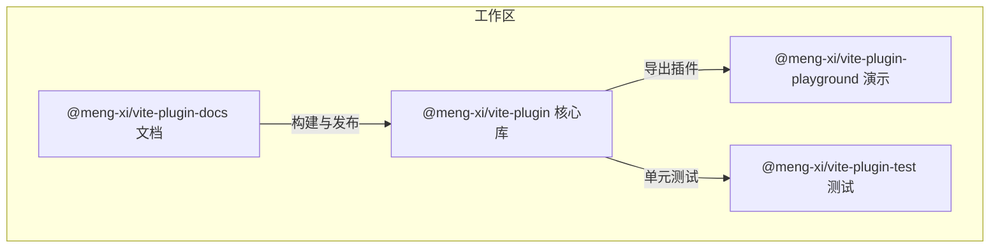
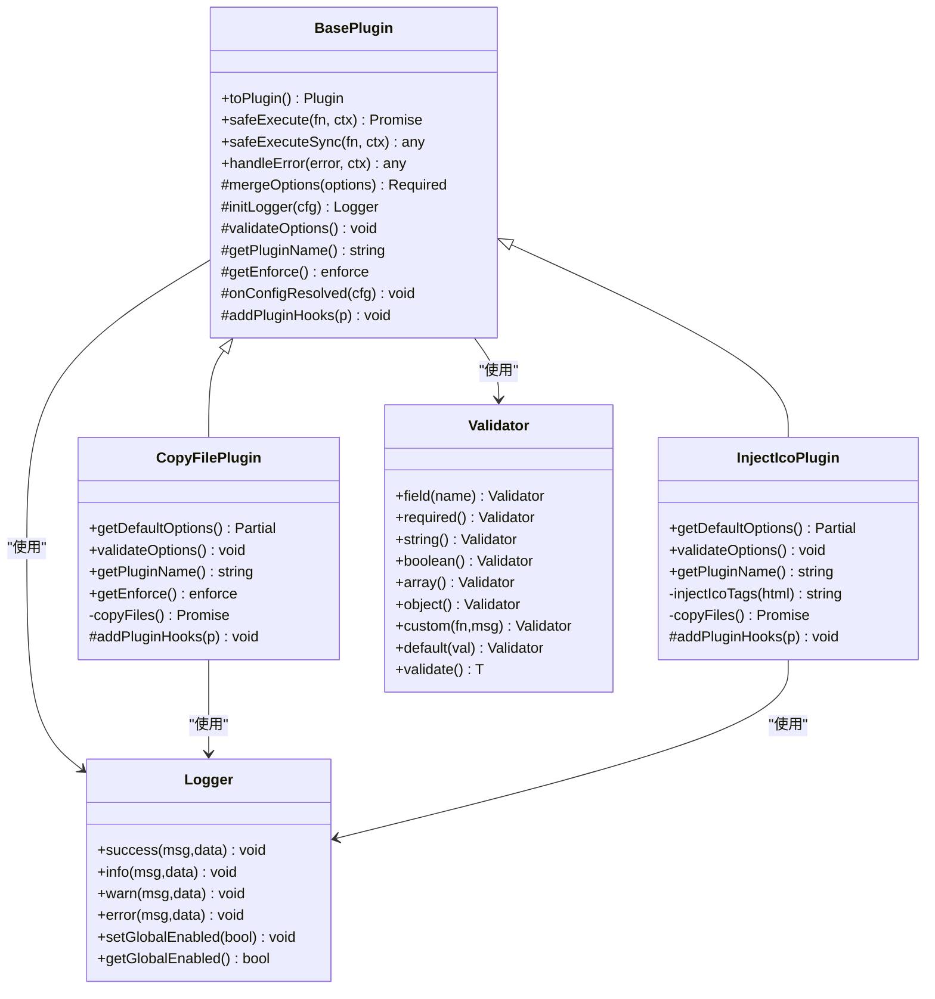
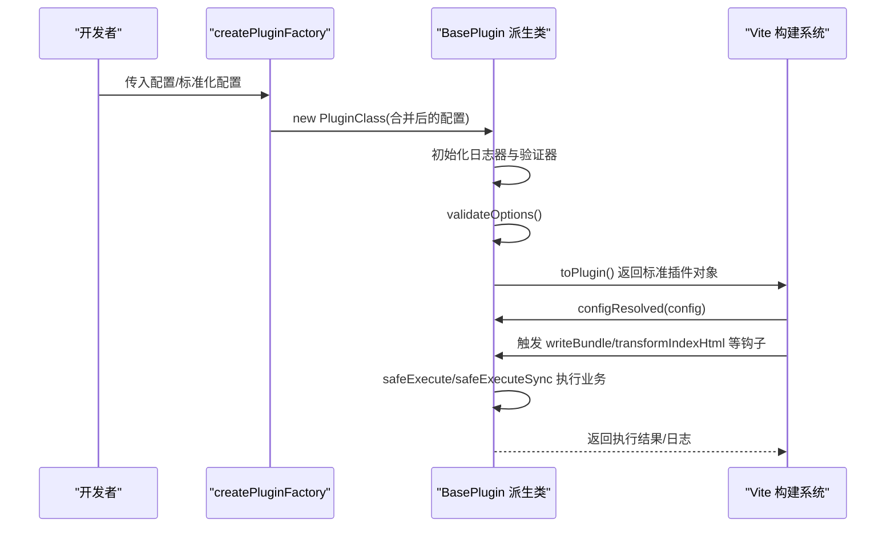
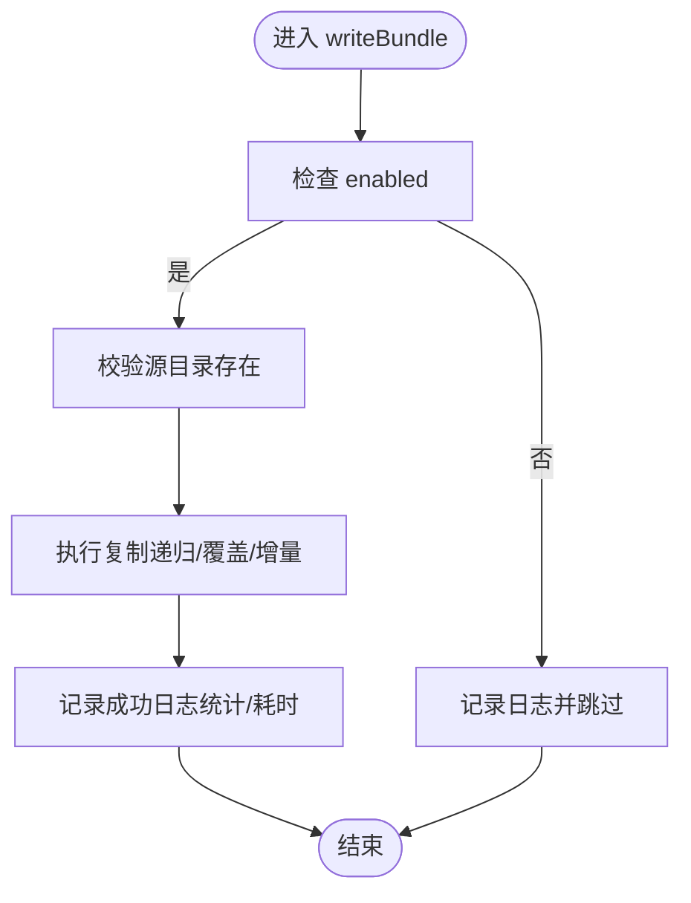
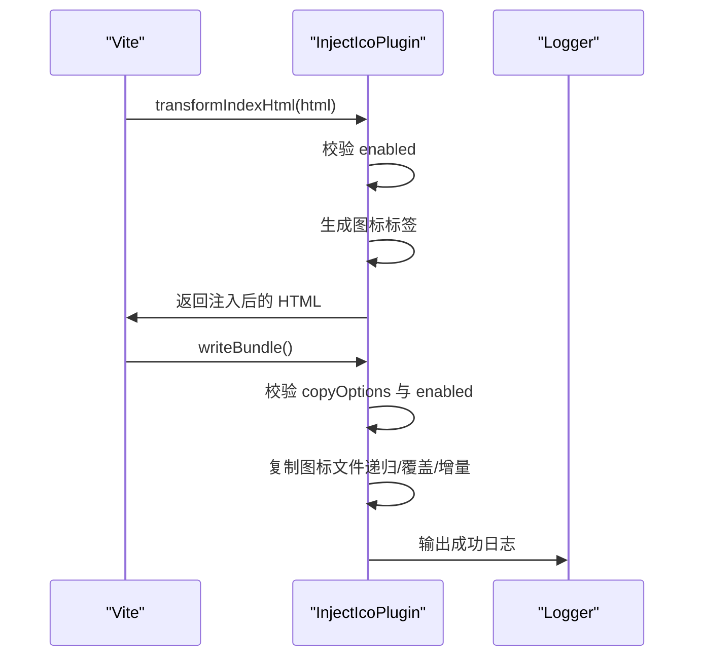
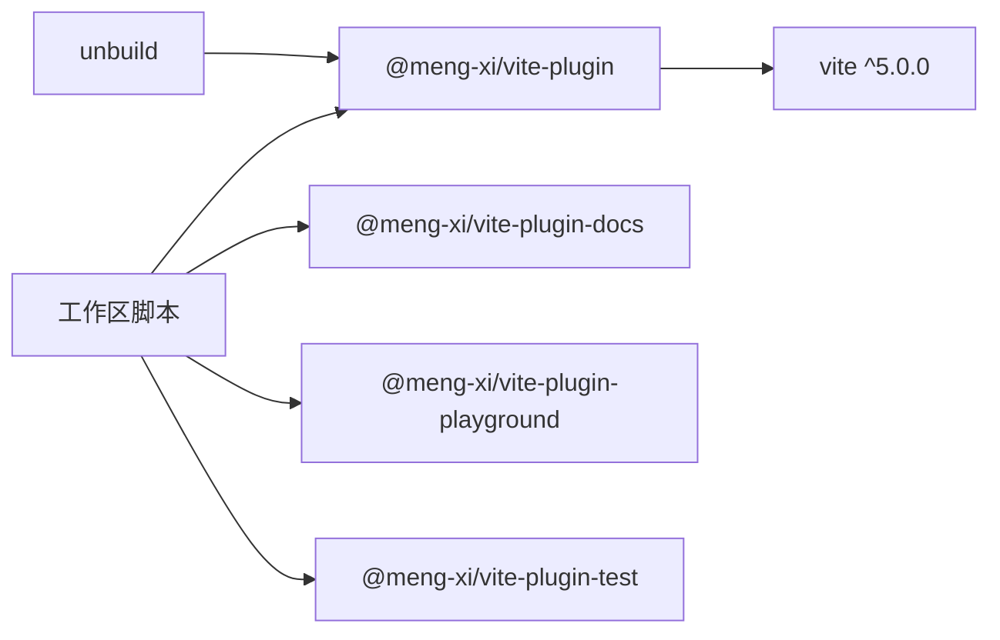

# 集成模式与最佳实践

<cite>
**本文档引用的文件**
- [packages/core/src/index.ts](file://packages/core/src/index.ts)
- [packages/core/src/plugins/index.ts](file://packages/core/src/plugins/index.ts)
- [packages/core/src/factory/index.ts](file://packages/core/src/factory/index.ts)
- [packages/core/src/factory/types.ts](file://packages/core/src/factory/types.ts)
- [packages/core/src/factory/plugin/index.ts](file://packages/core/src/factory/plugin/index.ts)
- [packages/core/src/common/validation.ts](file://packages/core/src/common/validation.ts)
- [packages/core/src/logger/index.ts](file://packages/core/src/logger/index.ts)
- [packages/core/src/plugins/copyFile/index.ts](file://packages/core/src/plugins/copyFile/index.ts)
- [packages/core/src/plugins/injectIco/index.ts](file://packages/core/src/plugins/injectIco/index.ts)
- [packages/core/build.config.ts](file://packages/core/build.config.ts)
- [packages/core/package.json](file://packages/core/package.json)
- [packages/playground/vite.config.ts](file://packages/playground/vite.config.ts)
- [packages/test/vitest.config.ts](file://packages/test/vitest.config.ts)
- [packages/test/src/copyFile/copyFile.test.ts](file://packages/test/src/copyFile/copyFile.test.ts)
- [packages/test/src/injectIco/injectIco.test.ts](file://packages/test/src/injectIco/injectIco.test.ts)
- [package.json](file://package.json)
- [bump.config.ts](file://bump.config.ts)
</cite>

## 目录
1. [简介](#简介)
2. [项目结构](#项目结构)
3. [核心组件](#核心组件)
4. [架构总览](#架构总览)
5. [详细组件分析](#详细组件分析)
6. [依赖关系分析](#依赖关系分析)
7. [性能考量](#性能考量)
8. [故障排查指南](#故障排查指南)
9. [结论](#结论)
10. [附录](#附录)

## 简介
本文件面向在 Vite 生态系统中集成与规模化使用插件的团队，提供一套可复用的集成模式与最佳实践。内容涵盖：
- 插件与 Vite 的集成方式与协作策略
- 大型项目的插件组织与管理策略
- 团队开发中的插件使用规范与标准化流程
- 性能监控与日志收集的集成方案
- 插件版本管理与升级策略
- 插件冲突与兼容性处理
- 代码组织与模块化最佳实践
- 自动化测试与质量保障集成

## 项目结构
该项目采用多包工作区（monorepo）组织，核心能力集中在 @meng-xi/vite-plugin 包中，配套提供 Playground 示例与 Test 测试套件，便于演示与验证。

图表来源
- [package.json](file://package.json#L7-L9)
- [packages/core/src/index.ts](file://packages/core/src/index.ts#L1-L8)

章节来源
- [package.json](file://package.json#L1-L47)
- [packages/core/src/index.ts](file://packages/core/src/index.ts#L1-L8)

## 核心组件
- 工厂与基类：提供统一的插件生命周期、配置合并、日志与错误处理机制
- 插件集合：copyFile 与 injectIco 两个具体插件，分别负责静态资源复制与 HTML 图标注入
- 工具与基础设施：通用验证器、日志器、构建配置与测试配置

章节来源
- [packages/core/src/factory/plugin/index.ts](file://packages/core/src/factory/plugin/index.ts#L27-L349)
- [packages/core/src/common/validation.ts](file://packages/core/src/common/validation.ts#L16-L202)
- [packages/core/src/logger/index.ts](file://packages/core/src/logger/index.ts#L6-L154)
- [packages/core/src/plugins/copyFile/index.ts](file://packages/core/src/plugins/copyFile/index.ts#L13-L120)
- [packages/core/src/plugins/injectIco/index.ts](file://packages/core/src/plugins/injectIco/index.ts#L14-L168)

## 架构总览
整体架构围绕“工厂 + 基类 + 插件”的分层设计展开，插件通过工厂函数统一创建，基类提供一致的生命周期钩子与错误处理策略，插件各自实现业务逻辑。

图表来源
- [packages/core/src/factory/plugin/index.ts](file://packages/core/src/factory/plugin/index.ts#L27-L349)
- [packages/core/src/plugins/copyFile/index.ts](file://packages/core/src/plugins/copyFile/index.ts#L13-L87)
- [packages/core/src/plugins/injectIco/index.ts](file://packages/core/src/plugins/injectIco/index.ts#L14-L131)
- [packages/core/src/common/validation.ts](file://packages/core/src/common/validation.ts#L16-L202)
- [packages/core/src/logger/index.ts](file://packages/core/src/logger/index.ts#L6-L154)

## 详细组件分析

### 工厂与基类：统一生命周期与错误处理
- 生命周期：插件实例通过 toPlugin() 输出标准 Vite 插件对象，注册 configResolved 钩子，按需执行业务钩子
- 配置合并：基础默认项（启用、详细日志、错误策略）与插件特定默认项深度合并，确保健壮性
- 错误处理：提供同步与异步安全执行包装，支持“抛出/记录/忽略”三种策略
- 日志：统一前缀、时间戳与彩色输出；支持全局开关与实例开关

图表来源
- [packages/core/src/factory/plugin/index.ts](file://packages/core/src/factory/plugin/index.ts#L332-L348)
- [packages/core/src/factory/plugin/index.ts](file://packages/core/src/factory/plugin/index.ts#L226-L312)

章节来源
- [packages/core/src/factory/plugin/index.ts](file://packages/core/src/factory/plugin/index.ts#L27-L349)

### 验证器：声明式配置校验
- 提供链式 API，支持必填、类型、数组、对象、自定义规则与默认值
- 在插件构造阶段集中校验，失败时抛出明确错误信息

章节来源
- [packages/core/src/common/validation.ts](file://packages/core/src/common/validation.ts#L16-L202)

### 日志器：统一输出与可观测性
- 支持 info/success/warn/error 四种级别
- 统一前缀、时间戳与颜色输出
- 全局开关与实例开关组合控制

章节来源
- [packages/core/src/logger/index.ts](file://packages/core/src/logger/index.ts#L6-L154)

### 插件：copyFile（文件复制）
- 执行时机：构建末期（enforce: 'post'），确保在其他构建任务之后执行
- 功能：支持递归、覆盖、增量复制；插件可禁用；详细日志输出
- 钩子：writeBundle 中触发复制逻辑

图表来源
- [packages/core/src/plugins/copyFile/index.ts](file://packages/core/src/plugins/copyFile/index.ts#L58-L86)

章节来源
- [packages/core/src/plugins/copyFile/index.ts](file://packages/core/src/plugins/copyFile/index.ts#L13-L120)

### 插件：injectIco（HTML 图标注入）
- 功能：在 HTML head 中注入图标链接；可选复制图标文件到目标目录
- 钩子：transformIndexHtml 注入图标；writeBundle 复制文件
- 安全：检测 head 标签存在性；避免重复注入；支持禁用

图表来源
- [packages/core/src/plugins/injectIco/index.ts](file://packages/core/src/plugins/injectIco/index.ts#L48-L82)
- [packages/core/src/plugins/injectIco/index.ts](file://packages/core/src/plugins/injectIco/index.ts#L94-L131)

章节来源
- [packages/core/src/plugins/injectIco/index.ts](file://packages/core/src/plugins/injectIco/index.ts#L14-L168)

### 插件导出与聚合
- 核心入口导出所有插件与基础设施，便于统一导入与按需使用
- 插件目录聚合导出，保持清晰的命名空间

章节来源
- [packages/core/src/index.ts](file://packages/core/src/index.ts#L1-L8)
- [packages/core/src/plugins/index.ts](file://packages/core/src/plugins/index.ts#L1-L3)

### Playground：真实场景集成示例
- 展示 injectIco 与 copyFile 的典型配置与组合使用
- 体现插件在真实项目中的协作方式

章节来源
- [packages/playground/vite.config.ts](file://packages/playground/vite.config.ts#L11-L68)

### 测试：自动化质量保障
- Vitest 配置：根目录扫描、覆盖率、别名配置
- 单元测试：覆盖插件行为、钩子触发、配置校验与边界条件

章节来源
- [packages/test/vitest.config.ts](file://packages/test/vitest.config.ts#L4-L23)
- [packages/test/src/copyFile/copyFile.test.ts](file://packages/test/src/copyFile/copyFile.test.ts#L13-L218)
- [packages/test/src/injectIco/injectIco.test.ts](file://packages/test/src/injectIco/injectIco.test.ts#L28-L272)

## 依赖关系分析
- 版本约束：核心包对 Vite 的 peerDependencies 明确为 ^5.0.0
- 构建配置：使用 unbuild，启用 CJS/ESM 双发布与最小化
- 工作区脚本：统一管理各包的开发、构建、测试与发布

图表来源
- [packages/core/package.json](file://packages/core/package.json#L32-L34)
- [packages/core/build.config.ts](file://packages/core/build.config.ts#L4-L17)
- [package.json](file://package.json#L10-L22)

章节来源
- [packages/core/package.json](file://packages/core/package.json#L32-L34)
- [packages/core/build.config.ts](file://packages/core/build.config.ts#L4-L17)
- [package.json](file://package.json#L10-L22)

## 性能考量
- 增量复制：copyFile 与 injectIco 的文件复制均支持增量策略，减少重复 IO
- 执行时机：copyFile 使用 enforce: 'post'，避免与编译/打包任务竞争资源
- 日志开销：通过全局与实例开关控制日志输出，生产环境建议关闭详细日志
- 验证成本：在构造阶段集中校验配置，避免运行时反复校验带来的额外开销

章节来源
- [packages/core/src/plugins/copyFile/index.ts](file://packages/core/src/plugins/copyFile/index.ts#L14-L20)
- [packages/core/src/plugins/injectIco/index.ts](file://packages/core/src/plugins/injectIco/index.ts#L15-L19)
- [packages/core/src/logger/index.ts](file://packages/core/src/logger/index.ts#L70-L80)

## 故障排查指南
- 配置校验失败：检查必填字段与类型；查看链式验证抛出的错误信息
- 插件未执行：确认 enabled 为 true；检查 enforce 时机是否与预期冲突
- HTML 注入失败：确认模板包含 </head> 标签；检查 icons 配置
- 文件复制失败：确认源目录存在；检查权限与磁盘空间；查看错误策略是否导致中断
- 日志缺失：检查全局与实例日志开关；确认输出终端支持颜色

章节来源
- [packages/core/src/common/validation.ts](file://packages/core/src/common/validation.ts#L195-L201)
- [packages/core/src/plugins/injectIco/index.ts](file://packages/core/src/plugins/injectIco/index.ts#L68-L81)
- [packages/core/src/factory/plugin/index.ts](file://packages/core/src/factory/plugin/index.ts#L284-L312)
- [packages/core/src/logger/index.ts](file://packages/core/src/logger/index.ts#L102-L104)

## 结论
本项目通过“工厂 + 基类 + 插件”的架构，实现了插件的标准化、可扩展与可维护。结合 Playground 与 Test，提供了可复用的集成模式与质量保障体系。团队可在大型项目中采用相同的组织方式与最佳实践，提升开发效率与一致性。

## 附录

### 集成模式与协作方案
- 插件组合：在 Vite 配置中按需组合多个插件，注意 enforce 顺序与钩子冲突
- 标准化入口：通过统一导出入口集中管理插件导入与别名
- 环境化配置：基于 NODE_ENV 控制插件启用与日志级别

章节来源
- [packages/playground/vite.config.ts](file://packages/playground/vite.config.ts#L11-L68)
- [packages/core/src/index.ts](file://packages/core/src/index.ts#L1-L8)

### 大型项目组织与管理策略
- 分层与职责分离：工厂与基类负责通用能力，插件专注业务逻辑
- 配置与默认值：统一默认项，插件仅覆盖特定默认值
- 测试驱动：为每个插件编写单元测试，覆盖钩子、配置与边界条件

章节来源
- [packages/core/src/factory/plugin/index.ts](file://packages/core/src/factory/plugin/index.ts#L108-L118)
- [packages/test/src/copyFile/copyFile.test.ts](file://packages/test/src/copyFile/copyFile.test.ts#L39-L80)
- [packages/test/src/injectIco/injectIco.test.ts](file://packages/test/src/injectIco/injectIco.test.ts#L50-L106)

### 团队开发规范建议
- 统一命名：插件名称与导出保持一致
- 文档与示例：为每个插件提供使用说明与示例配置
- 变更评审：涉及插件行为变更需通过测试与回归验证

### 性能监控与日志收集
- 使用 Logger 输出关键指标（复制数量、耗时）
- 在 CI 中开启覆盖率报告，持续跟踪质量
- 生产构建关闭详细日志，降低输出开销

章节来源
- [packages/core/src/logger/index.ts](file://packages/core/src/logger/index.ts#L101-L117)
- [packages/test/vitest.config.ts](file://packages/test/vitest.config.ts#L12-L16)

### 版本管理与升级策略
- 使用 bumpp 统一管理多包版本
- 严格遵循语义化版本，重大变更需更新主版本号
- 发布前执行构建、测试与文档校验

章节来源
- [bump.config.ts](file://bump.config.ts#L3-L5)
- [package.json](file://package.json#L19)

### 插件冲突与兼容性处理
- enforce 顺序：合理设置 enforce: 'pre'/'post'，避免与第三方插件冲突
- 配置隔离：通过独立的插件实例与配置，避免相互影响
- 兼容性验证：在 Playground 中验证与常用插件（如 @vitejs/plugin-vue）的协同效果

章节来源
- [packages/core/src/plugins/copyFile/index.ts](file://packages/core/src/plugins/copyFile/index.ts#L46-L48)
- [packages/playground/vite.config.ts](file://packages/playground/vite.config.ts#L11-L68)

### 代码组织与模块化最佳实践
- 工厂与基类：集中复用生命周期与错误处理
- 插件内部：按职责拆分私有方法（如 copyFiles、injectIcoTags）
- 工具模块：验证器与日志器独立封装，便于复用

章节来源
- [packages/core/src/factory/plugin/index.ts](file://packages/core/src/factory/plugin/index.ts#L50-L81)
- [packages/core/src/plugins/injectIco/index.ts](file://packages/core/src/plugins/injectIco/index.ts#L48-L82)
- [packages/core/src/plugins/copyFile/index.ts](file://packages/core/src/plugins/copyFile/index.ts#L58-L80)

### 自动化测试与质量保证
- 测试范围：覆盖钩子触发、配置校验、文件系统交互与边界条件
- 覆盖率：开启覆盖率报告，持续改进测试质量
- CI 集成：在流水线中执行测试与构建，确保每次提交的质量门槛

章节来源
- [packages/test/vitest.config.ts](file://packages/test/vitest.config.ts#L4-L23)
- [packages/test/src/copyFile/copyFile.test.ts](file://packages/test/src/copyFile/copyFile.test.ts#L13-L218)
- [packages/test/src/injectIco/injectIco.test.ts](file://packages/test/src/injectIco/injectIco.test.ts#L28-L272)