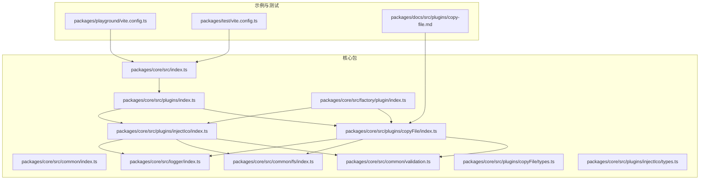
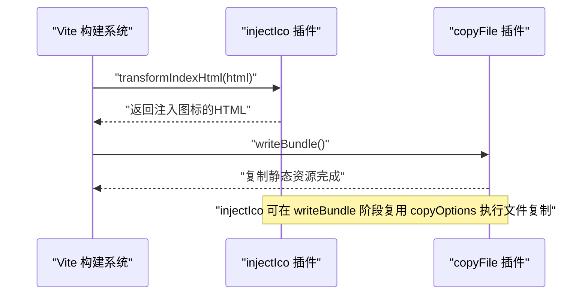
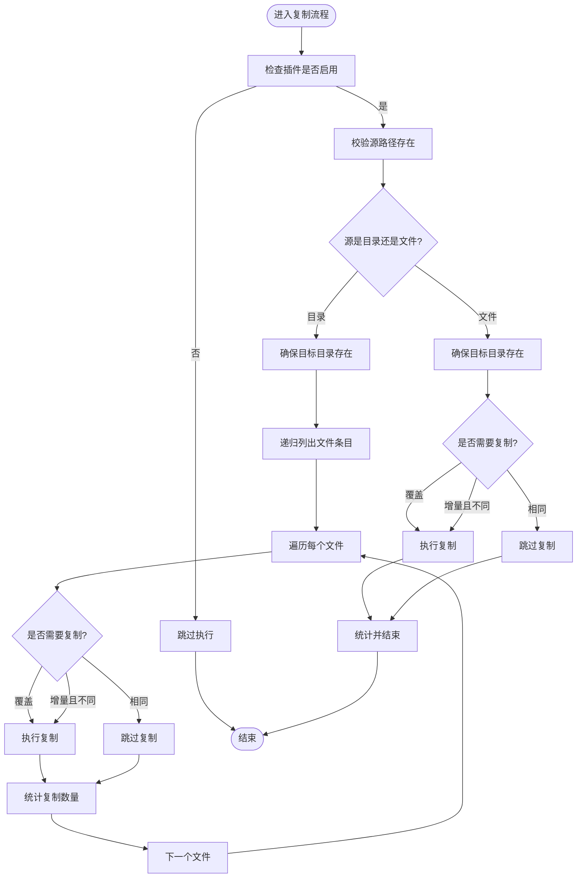
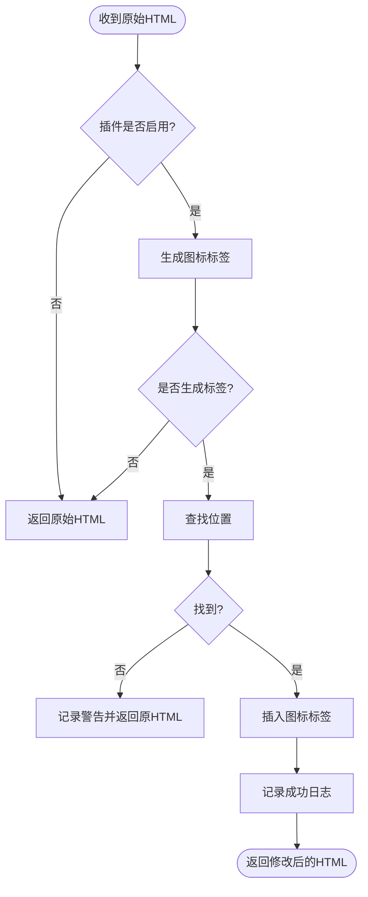
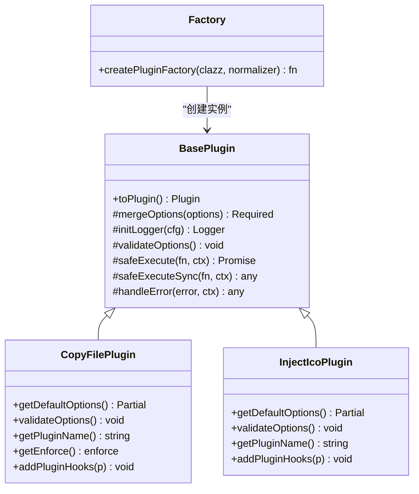
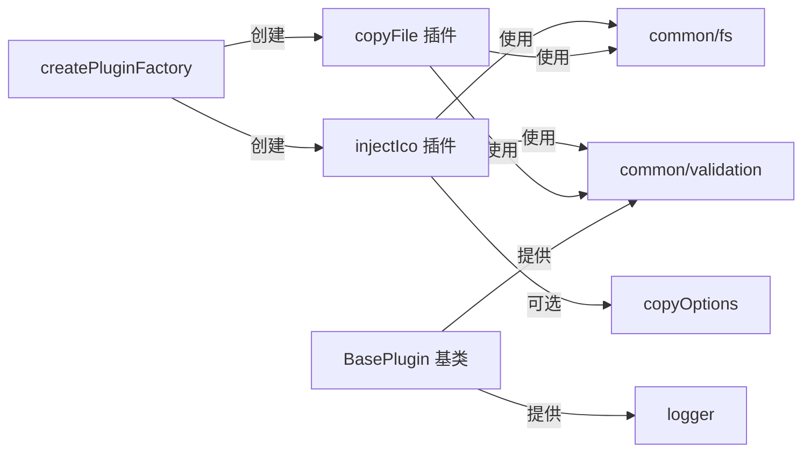

# 高级使用案例

<cite>
**本文引用的文件**
- [packages/core/src/index.ts](file://packages/core/src/index.ts)
- [packages/core/src/plugins/index.ts](file://packages/core/src/plugins/index.ts)
- [packages/core/src/factory/plugin/index.ts](file://packages/core/src/factory/plugin/index.ts)
- [packages/core/src/factory/types.ts](file://packages/core/src/factory/types.ts)
- [packages/core/src/common/index.ts](file://packages/core/src/common/index.ts)
- [packages/core/src/common/validation.ts](file://packages/core/src/common/validation.ts)
- [packages/core/src/common/fs/index.ts](file://packages/core/src/common/fs/index.ts)
- [packages/core/src/logger/index.ts](file://packages/core/src/logger/index.ts)
- [packages/core/src/plugins/copyFile/index.ts](file://packages/core/src/plugins/copyFile/index.ts)
- [packages/core/src/plugins/copyFile/types.ts](file://packages/core/src/plugins/copyFile/types.ts)
- [packages/core/src/plugins/injectIco/index.ts](file://packages/core/src/plugins/injectIco/index.ts)
- [packages/core/src/plugins/injectIco/types.ts](file://packages/core/src/plugins/injectIco/types.ts)
- [packages/playground/vite.config.ts](file://packages/playground/vite.config.ts)
- [packages/test/vite.config.ts](file://packages/test/vite.config.ts)
- [packages/docs/src/plugins/copy-file.md](file://packages/docs/src/plugins/copy-file.md)
</cite>

## 目录
1. [简介](#简介)
2. [项目结构](#项目结构)
3. [核心组件](#核心组件)
4. [架构总览](#架构总览)
5. [详细组件分析](#详细组件分析)
6. [依赖关系分析](#依赖关系分析)
7. [性能优化实战](#性能优化实战)
8. [故障排查指南](#故障排查指南)
9. [结论](#结论)
10. [附录](#附录)

## 简介
本文件面向高级用户，聚焦于复杂插件组合使用场景、性能优化策略（增量复制、并发处理、内存优化）、插件间依赖与执行顺序管理、自定义配置与扩展开发、错误处理与调试最佳实践，以及与第三方工具和框架的集成方案。文档中的案例均基于仓库现有实现，强调可落地的工程化经验。

## 项目结构
该项目采用多包工作区组织，核心能力集中在 packages/core，提供通用工厂、日志、验证与文件系统工具，以及两个具体插件：copyFile 与 injectIco。playground 与 test 提供真实配置示例与测试场景；docs 提供插件文档。

**图表来源**
- [packages/core/src/index.ts](file://packages/core/src/index.ts#L1-L2)
- [packages/core/src/plugins/index.ts](file://packages/core/src/plugins/index.ts#L1-L3)
- [packages/core/src/factory/plugin/index.ts](file://packages/core/src/factory/plugin/index.ts#L1-L387)
- [packages/core/src/common/index.ts](file://packages/core/src/common/index.ts#L1-L4)
- [packages/core/src/common/validation.ts](file://packages/core/src/common/validation.ts#L1-L203)
- [packages/core/src/common/fs/index.ts](file://packages/core/src/common/fs/index.ts#L1-L241)
- [packages/core/src/logger/index.ts](file://packages/core/src/logger/index.ts#L1-L131)
- [packages/core/src/plugins/copyFile/index.ts](file://packages/core/src/plugins/copyFile/index.ts#L1-L121)
- [packages/core/src/plugins/injectIco/index.ts](file://packages/core/src/plugins/injectIco/index.ts#L1-L169)
- [packages/playground/vite.config.ts](file://packages/playground/vite.config.ts#L1-L69)
- [packages/test/vite.config.ts](file://packages/test/vite.config.ts#L1-L35)
- [packages/docs/src/plugins/copy-file.md](file://packages/docs/src/plugins/copy-file.md#L1-L159)

**章节来源**
- [packages/core/src/index.ts](file://packages/core/src/index.ts#L1-L2)
- [packages/core/src/plugins/index.ts](file://packages/core/src/plugins/index.ts#L1-L3)
- [packages/playground/vite.config.ts](file://packages/playground/vite.config.ts#L1-L69)
- [packages/test/vite.config.ts](file://packages/test/vite.config.ts#L1-L35)

## 核心组件
- 插件工厂与基类
  - BasePlugin：统一的插件生命周期、配置合并、日志、验证与错误处理，提供 toPlugin() 将实例转为 Vite 插件对象。
  - createPluginFactory：工厂函数，支持可选的选项标准化器，返回 Vite 插件实例，并在导出对象上挂载 pluginInstance 引用。
- 工具模块
  - Validator：链式验证器，支持 required、string、boolean、number、array、object、custom、default 等。
  - Logger：带时间戳与彩色前缀的日志工具，支持 info/success/warn/error 四种级别。
  - FS 工具：checkSourceExists、ensureTargetDir、readDirRecursive、shouldUpdateFile、copySourceToTarget、writeFileContent、readFileSync。
- 插件实现
  - copyFile：在 writeBundle 阶段执行，支持增量复制、递归复制、覆盖控制与详细日志。
  - injectIco：在 transformIndexHtml 阶段注入图标链接，并可选地复制图标文件到目标目录。

**章节来源**
- [packages/core/src/factory/plugin/index.ts](file://packages/core/src/factory/plugin/index.ts#L27-L349)
- [packages/core/src/factory/plugin/index.ts](file://packages/core/src/factory/plugin/index.ts#L370-L386)
- [packages/core/src/common/validation.ts](file://packages/core/src/common/validation.ts#L16-L202)
- [packages/core/src/logger/index.ts](file://packages/core/src/logger/index.ts#L6-L130)
- [packages/core/src/common/fs/index.ts](file://packages/core/src/common/fs/index.ts#L10-L241)
- [packages/core/src/plugins/copyFile/index.ts](file://packages/core/src/plugins/copyFile/index.ts#L13-L87)
- [packages/core/src/plugins/injectIco/index.ts](file://packages/core/src/plugins/injectIco/index.ts#L14-L132)

## 架构总览
下图展示 Vite 插件在构建流程中的钩子触发顺序与插件协作关系。copyFile 使用 enforce: 'post'，确保在其他构建任务之后执行；injectIco 在 transformIndexHtml 阶段注入 HTML 头部图标链接，并可在 writeBundle 阶段复制图标文件。

**图表来源**
- [packages/core/src/plugins/injectIco/index.ts](file://packages/core/src/plugins/injectIco/index.ts#L123-L131)
- [packages/core/src/plugins/copyFile/index.ts](file://packages/core/src/plugins/copyFile/index.ts#L82-L86)

**章节来源**
- [packages/core/src/plugins/injectIco/index.ts](file://packages/core/src/plugins/injectIco/index.ts#L123-L131)
- [packages/core/src/plugins/copyFile/index.ts](file://packages/core/src/plugins/copyFile/index.ts#L46-L48)

## 详细组件分析

### copyFile 插件
- 设计要点
  - 默认启用增量复制与递归复制，减少不必要的 IO。
  - 在 writeBundle 阶段执行，保证产物已生成后再复制静态资源。
  - 通过 Validator 对 sourceDir/targetDir 等关键字段进行严格校验。
- 关键流程（增量复制）

**图表来源**
- [packages/core/src/plugins/copyFile/index.ts](file://packages/core/src/plugins/copyFile/index.ts#L58-L80)
- [packages/core/src/common/fs/index.ts](file://packages/core/src/common/fs/index.ts#L98-L202)

**章节来源**
- [packages/core/src/plugins/copyFile/index.ts](file://packages/core/src/plugins/copyFile/index.ts#L13-L87)
- [packages/core/src/plugins/copyFile/types.ts](file://packages/core/src/plugins/copyFile/types.ts#L8-L43)
- [packages/docs/src/plugins/copy-file.md](file://packages/docs/src/plugins/copy-file.md#L1-L159)

### injectIco 插件
- 设计要点
  - 在 transformIndexHtml 阶段注入图标链接，支持 base/url/link/icons 多种配置。
  - 可选地通过 copyOptions 复制图标文件，与 copyFile 插件形成互补。
  - 通过 generateIconTags 生成标签，避免重复注入。
- 关键流程（HTML 注入）

**图表来源**
- [packages/core/src/plugins/injectIco/index.ts](file://packages/core/src/plugins/injectIco/index.ts#L48-L82)

**章节来源**
- [packages/core/src/plugins/injectIco/index.ts](file://packages/core/src/plugins/injectIco/index.ts#L14-L132)
- [packages/core/src/plugins/injectIco/types.ts](file://packages/core/src/plugins/injectIco/types.ts#L65-L113)

### 插件基类与工厂
- BasePlugin
  - 合并默认配置与用户配置，初始化 Logger 与 Validator。
  - 提供 safeExecute/safeExecuteSync 包装执行，按 errorStrategy 处理错误。
  - toPlugin() 统一注册 configResolved 与插件钩子。
- createPluginFactory
  - 支持可选的 OptionsNormalizer，兼容字符串或对象两种传参形式。
  - 在导出的 Vite 插件对象上挂载 pluginInstance 引用，便于调试与扩展。

**图表来源**
- [packages/core/src/factory/plugin/index.ts](file://packages/core/src/factory/plugin/index.ts#L27-L349)
- [packages/core/src/plugins/copyFile/index.ts](file://packages/core/src/plugins/copyFile/index.ts#L13-L87)
- [packages/core/src/plugins/injectIco/index.ts](file://packages/core/src/plugins/injectIco/index.ts#L14-L132)

**章节来源**
- [packages/core/src/factory/plugin/index.ts](file://packages/core/src/factory/plugin/index.ts#L27-L349)
- [packages/core/src/factory/plugin/index.ts](file://packages/core/src/factory/plugin/index.ts#L370-L386)

## 依赖关系分析
- 组件耦合
  - 插件实现依赖 BasePlugin 与 createPluginFactory，共享配置合并、日志与验证能力。
  - copyFile 与 injectIco 均依赖 common/fs 与 common/validation，分别负责文件复制与配置校验。
  - injectIco 可选依赖 copyOptions，与 copyFile 形成“注入 + 复制”的组合模式。
- 外部依赖
  - Vite 插件钩子：transformIndexHtml、writeBundle、configResolved。
  - Node.js fs/path 标准库。

**图表来源**
- [packages/core/src/plugins/injectIco/index.ts](file://packages/core/src/plugins/injectIco/index.ts#L1-L169)
- [packages/core/src/plugins/copyFile/index.ts](file://packages/core/src/plugins/copyFile/index.ts#L1-L121)
- [packages/core/src/factory/plugin/index.ts](file://packages/core/src/factory/plugin/index.ts#L1-L387)
- [packages/core/src/common/fs/index.ts](file://packages/core/src/common/fs/index.ts#L1-L241)
- [packages/core/src/common/validation.ts](file://packages/core/src/common/validation.ts#L1-L203)
- [packages/core/src/logger/index.ts](file://packages/core/src/logger/index.ts#L1-L131)

**章节来源**
- [packages/core/src/plugins/injectIco/index.ts](file://packages/core/src/plugins/injectIco/index.ts#L1-L169)
- [packages/core/src/plugins/copyFile/index.ts](file://packages/core/src/plugins/copyFile/index.ts#L1-L121)
- [packages/core/src/factory/plugin/index.ts](file://packages/core/src/factory/plugin/index.ts#L1-L387)

## 性能优化实战
以下案例均基于现有实现，强调可直接落地的工程实践。

- 增量复制（推荐）
  - copyFile 默认启用 incremental，仅复制变更文件，显著降低 CI/CD 时间。
  - injectIco 在 writeBundle 阶段复用 copyOptions 执行增量复制，避免重复扫描。
  - 参考：[packages/core/src/common/fs/index.ts](file://packages/core/src/common/fs/index.ts#L77-L88)、[packages/core/src/plugins/copyFile/index.ts](file://packages/core/src/plugins/copyFile/index.ts#L14-L20)、[packages/core/src/plugins/injectIco/index.ts](file://packages/core/src/plugins/injectIco/index.ts#L107-L121)

- 并发处理与内存优化
  - 当前实现为逐文件复制，适合大多数场景。若需进一步优化，可在保持幂等的前提下，将文件复制过程改为批量处理（注意：需维持增量判断与覆盖策略）。
  - 对超大目录，建议结合 recursive 与 incremental，避免一次性加载过多文件到内存。
  - 参考：[packages/core/src/common/fs/index.ts](file://packages/core/src/common/fs/index.ts#L114-L156)

- 执行顺序与插件编排
  - injectIco 的 transformIndexHtml 在写入阶段之前执行，copyFile 的 writeBundle 在最后执行，天然避免冲突。
  - 若同时使用 copyOptions 与 copyFile，建议将 copyFile 放在 injectIco 之后，确保图标文件先被复制再注入链接。
  - 参考：[packages/core/src/plugins/injectIco/index.ts](file://packages/core/src/plugins/injectIco/index.ts#L123-L131)、[packages/core/src/plugins/copyFile/index.ts](file://packages/core/src/plugins/copyFile/index.ts#L46-L48)

- 环境化启用与条件执行
  - 通过 enabled 控制插件启停，结合 NODE_ENV 或 CI 条件启用/禁用，减少非生产环境的 IO 开销。
  - 参考：[packages/playground/vite.config.ts](file://packages/playground/vite.config.ts#L26-L66)、[packages/test/vite.config.ts](file://packages/test/vite.config.ts#L13-L32)

- 错误策略与可观测性
  - 使用 errorStrategy 控制“抛出/记录/忽略”，verbose 输出详细日志，便于定位问题。
  - 参考：[packages/core/src/factory/plugin/index.ts](file://packages/core/src/factory/plugin/index.ts#L284-L312)、[packages/core/src/logger/index.ts](file://packages/core/src/logger/index.ts#L78-L93)

**章节来源**
- [packages/core/src/common/fs/index.ts](file://packages/core/src/common/fs/index.ts#L77-L88)
- [packages/core/src/plugins/copyFile/index.ts](file://packages/core/src/plugins/copyFile/index.ts#L14-L20)
- [packages/core/src/plugins/injectIco/index.ts](file://packages/core/src/plugins/injectIco/index.ts#L107-L121)
- [packages/playground/vite.config.ts](file://packages/playground/vite.config.ts#L26-L66)
- [packages/test/vite.config.ts](file://packages/test/vite.config.ts#L13-L32)
- [packages/core/src/factory/plugin/index.ts](file://packages/core/src/factory/plugin/index.ts#L284-L312)
- [packages/core/src/logger/index.ts](file://packages/core/src/logger/index.ts#L78-L93)

## 故障排查指南
- 常见错误与定位
  - 源路径不存在或权限不足：检查 sourceDir/targetDir，确认路径正确与权限充足。
    - 参考：[packages/core/src/common/fs/index.ts](file://packages/core/src/common/fs/index.ts#L10-L23)
  - 配置验证失败：根据 Validator 抛出的详细错误信息修正字段类型或必填项。
    - 参考：[packages/core/src/common/validation.ts](file://packages/core/src/common/validation.ts#L195-L201)
  - HTML 注入失败：确认模板中存在 </head>，否则会记录警告并跳过注入。
    - 参考：[packages/core/src/plugins/injectIco/index.ts](file://packages/core/src/plugins/injectIco/index.ts#L68-L79)
- 调试建议
  - 将 verbose 设置为 true，观察 success/info/warn/error 日志。
  - 使用 errorStrategy='log' 在 CI 中保留错误信息但不中断构建，便于事后分析。
  - 通过导出对象上的 pluginInstance 引用进行断点调试。
    - 参考：[packages/core/src/factory/plugin/index.ts](file://packages/core/src/factory/plugin/index.ts#L381-L384)

**章节来源**
- [packages/core/src/common/fs/index.ts](file://packages/core/src/common/fs/index.ts#L10-L23)
- [packages/core/src/common/validation.ts](file://packages/core/src/common/validation.ts#L195-L201)
- [packages/core/src/plugins/injectIco/index.ts](file://packages/core/src/plugins/injectIco/index.ts#L68-L79)
- [packages/core/src/factory/plugin/index.ts](file://packages/core/src/factory/plugin/index.ts#L381-L384)

## 结论
本项目通过统一的插件基类与工厂模式，实现了可组合、可扩展、可观测的 Vite 插件体系。copyFile 与 injectIco 分别覆盖“静态资源复制”和“HTML 图标注入”两大高频场景，并通过增量复制、严格的配置验证与完善的日志体系，满足复杂工程的性能与稳定性需求。建议在实际项目中结合环境变量与错误策略，合理编排插件顺序，最大化发挥组合优势。

## 附录

### 复杂组合使用场景与配置策略
- 场景一：生产环境启用 copyFile，开发环境禁用
  - 参考：[packages/playground/vite.config.ts](file://packages/playground/vite.config.ts#L53-L66)
- 场景二：injectIco 与 copyFile 协同，先复制后注入
  - 参考：[packages/test/vite.config.ts](file://packages/test/vite.config.ts#L13-L32)
- 场景三：injectIco 使用字符串 base 快速配置
  - 参考：[packages/core/src/plugins/injectIco/index.ts](file://packages/core/src/plugins/injectIco/index.ts#L168)

### 高级配置选项与使用建议
- copyFile
  - incremental：默认开启，建议在 CI 中保持开启以提升效率。
  - recursive：默认开启，建议在大型静态资源目录中保持开启。
  - overwrite：谨慎开启，避免覆盖重要文件。
  - 参考：[packages/docs/src/plugins/copy-file.md](file://packages/docs/src/plugins/copy-file.md#L59-L68)
- injectIco
  - base/url/link/icons：优先级为 link > url > base + favicon.ico。
  - copyOptions：与 copyFile 的增量策略一致，建议开启 incremental。
  - 参考：[packages/core/src/plugins/injectIco/types.ts](file://packages/core/src/plugins/injectIco/types.ts#L70-L113)

### 与第三方工具和框架的集成
- 与 Vue 生态：在 playground 中与 @vitejs/plugin-vue 并列使用，互不干扰。
  - 参考：[packages/playground/vite.config.ts](file://packages/playground/vite.config.ts#L1-L69)
- 与测试框架：在 Vitest 中通过 vite.config.ts 直接引入插件进行单元测试。
  - 参考：[packages/test/vite.config.ts](file://packages/test/vite.config.ts#L1-L35)