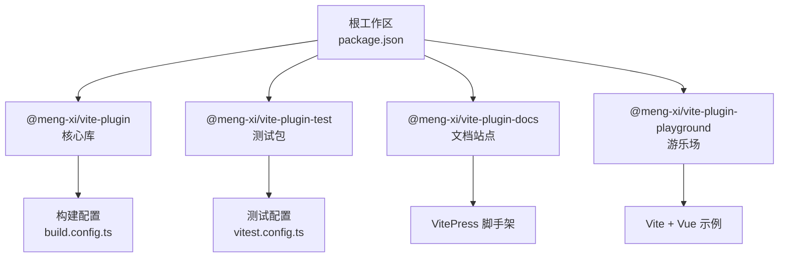
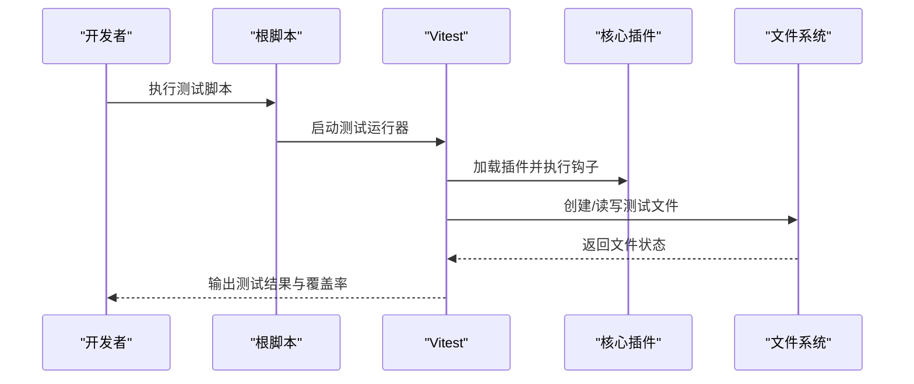

# 贡献指南

<cite>
**本文引用的文件**
- [根 package.json](file://package.json)
- [pnpm 工作区配置](file://pnpm-workspace.yaml)
- [ESLint 配置](file://.eslintrc.js)
- [Prettier 配置](file://.prettierrc)
- [核心包 package.json](file://packages/core/package.json)
- [测试包 package.json](file://packages/test/package.json)
- [测试配置](file://packages/test/vitest.config.ts)
- [文档包 package.json](file://packages/docs/package.json)
- [游乐场 package.json](file://packages/playground/package.json)
- [核心构建配置](file://packages/core/build.config.ts)
- [复制文件测试](file://packages/test/src/copyFile/copyFile.test.ts)
- [注入图标测试](file://packages/test/src/injectIco/injectIco.test.ts)
- [复制文件插件实现](file://packages/core/src/plugins/copyFile/index.ts)
- [注入图标插件实现](file://packages/core/src/plugins/injectIco/index.ts)
- [根 README](file://README.md)
</cite>

## 目录
1. [简介](#简介)
2. [项目结构](#项目结构)
3. [开发环境搭建](#开发环境搭建)
4. [代码规范与风格](#代码规范与风格)
5. [测试要求与流程](#测试要求与流程)
6. [提交规范与流程](#提交规范与流程)
7. [文档贡献指南](#文档贡献指南)
8. [维护与发布流程](#维护与发布流程)
9. [社区行为准则与沟通渠道](#社区行为准则与沟通渠道)
10. [故障排除指南](#故障排除指南)
11. [结语](#结语)

## 简介
本项目是一个为 Vite 提供实用插件的工具包，旨在简化构建流程、提高开发效率。项目采用 monorepo 结构，包含核心插件库、测试套件、文档站点和游乐场示例。本文档面向新贡献者，提供从环境搭建到代码贡献、测试、文档、维护与发布的全流程指南。

## 项目结构
项目采用 pnpm 工作区组织多包结构，核心组件包括：
- packages/core：核心插件库，导出 copyFile 和 injectIco 插件
- packages/test：单元测试与集成测试套件
- packages/docs：文档站点（VitePress）
- packages/playground：插件使用示例（Vite + Vue）

图表来源
- [根 package.json](file://package.json#L10-L23)
- [pnpm 工作区配置](file://pnpm-workspace.yaml#L1-L2)
- [核心包 package.json](file://packages/core/package.json#L1-L52)
- [测试包 package.json](file://packages/test/package.json#L1-L23)
- [文档包 package.json](file://packages/docs/package.json#L1-L16)
- [游乐场 package.json](file://packages/playground/package.json#L1-L20)
- [核心构建配置](file://packages/core/build.config.ts#L1-L18)
- [测试配置](file://packages/test/vitest.config.ts#L1-L24)

章节来源
- [根 package.json](file://package.json#L1-L47)
- [pnpm 工作区配置](file://pnpm-workspace.yaml#L1-L2)

## 开发环境搭建
为确保一致的开发体验，请遵循以下步骤：

- Node.js 版本要求
  - 项目使用 TypeScript 5.x，建议使用 Node.js LTS 版本（如 18.x 或 20.x）以获得最佳兼容性
  - 包管理器：推荐使用 pnpm（版本见根 package.json 中的 packageManager 字段），它能更好地支持工作区与符号链接

- 安装依赖
  - 在仓库根目录执行安装命令，pnpm 会自动解析工作区并安装所有包的依赖
  - 若需清理缓存或锁文件，可使用根脚本提供的清理命令

- 启动各子包
  - 核心库开发：使用根脚本启动核心库的开发模式
  - 文档站点开发：使用根脚本启动文档站点开发
  - 游乐场开发：使用根脚本启动游乐场示例
  - 测试：使用根脚本运行测试或监听模式

章节来源
- [根 package.json](file://package.json#L6-L23)
- [pnpm 工作区配置](file://pnpm-workspace.yaml#L1-L2)
- [核心包 package.json](file://packages/core/package.json#L28-L31)
- [测试包 package.json](file://packages/test/package.json#L7-L11)
- [文档包 package.json](file://packages/docs/package.json#L7-L11)
- [游乐场 package.json](file://packages/playground/package.json#L6-L10)

## 代码规范与风格
项目采用 ESLint + Prettier 的统一代码风格，确保跨包一致性。

- ESLint 配置要点
  - 解析器：TypeScript ESLint 解析器
  - 环境：Node、浏览器、ES2020
  - 扩展：推荐规则集 + TypeScript 推荐规则 + Prettier 推荐规则
  - 关键规则：
    - console 使用：关闭（允许在开发中使用）
    - 未使用变量：警告
    - 未定义变量：关闭（避免与 TS 类型系统冲突）
    - Prettier 格式化：开启错误级别
    - any 类型：关闭（鼓励类型安全）

- Prettier 配置要点
  - 行宽：较大值，适合长链式调用
  - 缩进：Tab 宽度 2，使用 Tab
  - 分号：不使用
  - 单引号：启用
  - 尾随逗号：禁用
  - 括号间距：保留
  - 括号换行：避免
  - 结尾换行：LF
  - Vue 脚本缩进：不缩进
  - 代码块包裹策略：按需

- 代码格式化流程
  - 运行根脚本进行一次性格式检查与修复
  - 在提交前确保通过 Lint 与格式化校验

章节来源
- [.eslintrc.js](file://.eslintrc.js#L1-L28)
- [.prettierrc](file://.prettierrc#L1-L17)
- [根 package.json](file://package.json#L24-L34)

## 测试要求与流程
项目使用 Vitest 进行单元测试与集成测试，覆盖核心插件的关键行为。

- 测试包结构
  - 测试入口：packages/test
  - 测试脚本：run、watch、覆盖率
  - 依赖：@meng-xi/vite-plugin（workspace:*）、vite、vitest、覆盖率插件

- 测试配置
  - 根目录：src/**/*.test.ts
  - 环境：Node
  - 覆盖率：开启，输出至 coverage 目录
  - 别名：@ -> src

- 测试用例示例
  - 复制文件插件测试：验证插件实例、文件复制、覆盖、递归、增量、禁用等行为
  - 注入图标插件测试：验证 HTML 注入、默认图标、复制选项、禁用行为、无 head 标签处理等

- 测试运行流程
  - 运行单次测试：使用根脚本
  - 监听模式：使用根脚本的 watch 脚本
  - 覆盖率报告：使用根脚本的覆盖率脚本

图表来源
- [根 package.json](file://package.json#L17-L18)
- [测试配置](file://packages/test/vitest.config.ts#L4-L17)
- [复制文件测试](file://packages/test/src/copyFile/copyFile.test.ts#L1-L219)
- [注入图标测试](file://packages/test/src/injectIco/injectIco.test.ts#L1-L273)

章节来源
- [测试包 package.json](file://packages/test/package.json#L1-L23)
- [测试配置](file://packages/test/vitest.config.ts#L1-L24)
- [复制文件测试](file://packages/test/src/copyFile/copyFile.test.ts#L1-L219)
- [注入图标测试](file://packages/test/src/injectIco/injectIco.test.ts#L1-L273)

## 提交规范与流程
遵循标准的 Git 工作流与 Pull Request 要求，确保代码质量与可追溯性。

- Git 工作流
  - Fork 项目到个人仓库
  - 克隆到本地并创建功能分支
  - 提交变更时使用清晰的提交信息（建议采用约定式提交风格）
  - 推送分支到远程
  - 在 GitHub 上创建 Pull Request 并等待审核

- Pull Request 要求
  - 保持分支简洁，聚焦单一功能或修复
  - 确保通过 Lint、格式化与测试
  - 在 PR 描述中说明变更动机、影响范围与测试结果

- 提交信息规范（建议）
  - 类型：feat、fix、docs、style、refactor、perf、test、build、ci、chore、revert
  - 范围：可选，描述变更涉及的模块（如 core、test、docs）
  - 描述：简明扼要说明变更内容

章节来源
- [根 README](file://README.md#L53-L85)

## 文档贡献指南
文档由 VitePress 驱动，位于 packages/docs，支持中英文双语文档。

- 文档结构
  - 英文文档：packages/docs/src/en
  - 中文文档：packages/docs/src
  - 站点脚本：dev、build、preview

- 贡献流程
  - 在对应语言目录新增或修改 Markdown 页面
  - 在本地启动文档站点进行预览与校对
  - 提交 PR 并在描述中说明文档变更内容与影响

- 文档模板（建议）
  - 标题层级：H1 用于页面标题，H2/H3 用于章节
  - 代码示例：使用合适的语言标识符
  - 图表：使用 Mermaid 或图片，配合中文注释

章节来源
- [文档包 package.json](file://packages/docs/package.json#L1-L16)

## 维护与发布流程
项目使用版本管理工具进行版本提升与发布。

- 版本提升
  - 使用根脚本触发版本提升（例如 bumpp）
  - 提升后自动更新版本号并生成变更记录

- 发布准备
  - 确保通过 Lint、格式化与测试
  - 更新根 README 中的更新日志链接与版本徽章
  - 在 GitHub Releases 中发布新版本

- 发布渠道
  - NPM：核心库发布到 NPM，版本号与标签同步
  - 文档：通过 VitePress 构建并部署到静态托管平台

章节来源
- [根 package.json](file://package.json#L19-L23)
- [根 README](file://README.md#L49-L52)

## 社区行为准则与沟通渠道
- 行为准则
  - 尊重与包容：欢迎不同背景的贡献者
  - 建设性反馈：提供建设性的意见与建议
  - 遵守法律法规：在讨论与交流中遵守适用法律

- 沟通渠道
  - Issues：用于报告 Bug、功能请求与讨论
  - Discussions：用于一般性讨论与方案征集
  - 邮件/即时通讯：如有需要可联系维护者

章节来源
- [根 package.json](file://package.json#L41-L46)

## 故障排除指南
- 常见问题与解决思路
  - 依赖安装失败：确认 pnpm 版本与 Node.js 版本匹配；清理缓存后重试
  - Lint 报错：根据 ESLint 输出逐项修复；必要时使用自动修复脚本
  - 测试失败：检查测试用例与期望值；关注文件路径与权限
  - 构建错误：核对构建配置与导出字段；确保类型声明正确

- 调试建议
  - 使用监听模式运行测试，快速定位问题
  - 在核心插件中添加日志，观察执行流程
  - 对比不同环境下的行为差异

## 结语
感谢您对本项目的关注与贡献。请按照本文档的指引完成环境搭建、代码规范、测试与提交流程，共同维护高质量的开源生态。如有任何疑问，欢迎通过 Issues 或 Discussions 与社区交流。